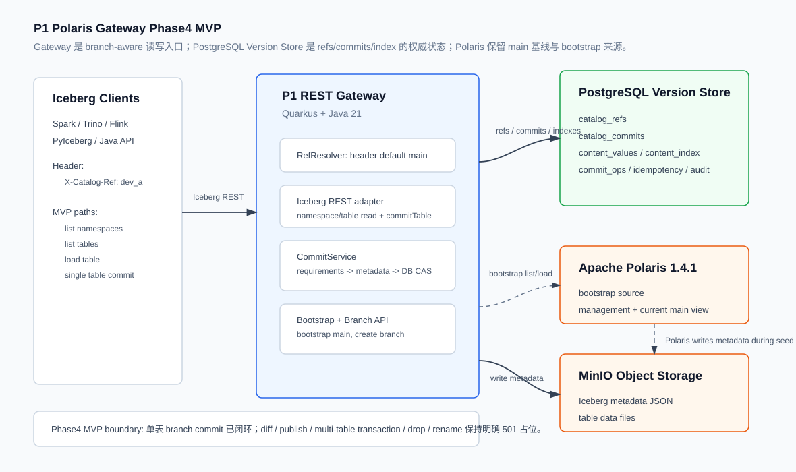

# P1 Polaris Gateway Phase4 MVP 总结

> 范围说明：本文聚焦 `Demo/p1_polaris_gateway/` 在 `5aec3c9 Add Polaris gateway P1 MVP` 提交对应的 Phase4 MVP 最终状态，综合 `memo.md`、`Industry/git-like/5. Polaris_GitLike_REST_Gateway_P1_Research_And_Design.md` 与提交内容整理。当前工作区中后续 Phase5/6 的未提交内容不纳入本文。

## 1. 结论概览

P1 demo 的核心结论是：**P0 的 branch overlay 工作流可以升级为一个更接近真实 LakeHouse catalog 的 branch-aware Iceberg REST Gateway，但必须把 branch/commit 的权威状态从“脚本清单”提升为外置 Version Store，并把读写入口收敛到 Gateway。**

截至 Phase4 MVP，P1 已经跑通以下闭环：

- 从 Apache Polaris 当前 main 状态 bootstrap 到 PostgreSQL Version Store。
- 在 Version Store 中以 O(1) HEAD 指针创建 `main` / `dev_a` 等逻辑 branch。
- Iceberg REST 读路径按 `X-Catalog-Ref` 读取不同 ref 上的 namespace、table list、table metadata。
- 对非 main branch 执行单表 commit，生成新的 Iceberg metadata JSON、新 catalog commit、新 incremental index，并用 ref HEAD CAS 推进 branch。
- branch commit 后 `main` 不变，`dev_a` 可读到新 snapshot。
- 对单表 commit 提供 requirements 校验、幂等 replay、CAS 冲突处理、审计事件和真实 MinIO 写入验证。

Phase4 MVP 不是完整 P1 终态。多表 transaction、diff、publish/outbox、drop/rename、GC dry-run 等仍保持明确 `501 PHASE_1_PLACEHOLDER`，为后续阶段预留接口但不伪装成功。

## 2. 相比 P0 的目的与意义

P0 `Demo/branch_on_polaris` 验证的是“在不修改 Polaris core 的前提下，用外置 controller 编排 Iceberg 表级 branch，能否跑通 logical branch 工作流”。它的价值是证明流程：创建 logical branch、推进不同 branch、diff、fast-forward publish 预检。但 P0 的状态文件和脚本模型不适合真实规模。

P1 的目的不是把 P0 的 Python/PowerShell controller 服务化，而是验证一种可迁移架构：

| 维度 | P0 branch overlay | P1 Phase4 MVP |
|---|---|---|
| 权威状态 | 本地 branch manifest + 采集的 table state JSON | PostgreSQL Version Store |
| branch 表达 | 多张 Iceberg 表级 branch 的外部清单 | catalog-wide ref HEAD 指针 |
| branch 创建成本 | 随 table 数量增长，需要逐表 `CREATE BRANCH` | O(1)，只插入/复制 ref HEAD |
| 写入口 | Spark SQL + controller 生成 SQL，服务端不可控 | Gateway 作为 branch-aware REST 写入口 |
| publish 原子性 | 逐表 fast-forward，不是 catalog-wide 原子边界 | Phase4 尚未 publish；设计边界是后续 ref HEAD CAS |
| 并发与重试 | 依赖脚本顺序执行 | CommitService 提供 requirements、CAS、idempotency |
| 可观测性 | 生成文件与命令输出 | audit_events、commit_ops、idempotency_keys、DB 可复核 |
| 与 Polaris 关系 | Polaris 只感知 Iceberg 表级操作 | Polaris 是 bootstrap 来源和 main 兼容视图，branch 状态由 Gateway 掌握 |

因此，P1 Phase4 的意义在于把 P0 的“可演示工作流”推进到“有服务端语义边界的最小 Version Store”：branch 不再是表集合复制，commit 不再是脚本串行动作，冲突不再是隐式失败，而是由 ref HEAD CAS 和 Iceberg requirements 共同定义。

## 3. MVP 范围

### 3.1 已实现能力

Phase4 MVP 实际落地的能力如下：

- 项目骨架：Java 21、Quarkus 3.29.2、Gradle Wrapper、Flyway、jOOQ、PostgreSQL、Iceberg 1.10.1。
- Runtime：PostgreSQL 16、MinIO、Apache Polaris 1.4.1、Gradle gateway placeholder。
- Version Store repository：refs、commits、content values、indexes、commit ops、idempotency、audit 等核心表读写。
- Bootstrap：调用 Polaris auth/list/load，将 Polaris main 的 namespace/table 导入 Version Store，生成 initial commit + full index + `main` ref。
- Iceberg REST 读路径：
  - `GET /iceberg/v1/{prefix}/namespaces`
  - `GET /iceberg/v1/{prefix}/namespaces/{namespace}`
  - `GET /iceberg/v1/{prefix}/namespaces/{namespace}/tables`
  - `GET /iceberg/v1/{prefix}/namespaces/{namespace}/tables/{table}`
- Branch 创建：
  - `POST /api/v1/catalogs/{catalog}/branches`
- 单表 commit：
  - `POST /iceberg/v1/{prefix}/namespaces/{namespace}/tables/{table}`
  - 支持 `X-Catalog-Ref`、`Idempotency-Key`、`X-Request-ID`。
- Iceberg commit requirements 校验：
  - `assert-create`
  - `assert-table-uuid`
  - `assert-ref-snapshot-id`
  - `assert-last-assigned-field-id`
  - `assert-current-schema-id`
  - `assert-last-assigned-partition-id`
  - `assert-default-spec-id`
  - `assert-default-sort-order-id`
- Iceberg metadata 写入：通过 `S3FileIO` 写入 MinIO，配置项为 `gateway.s3.*`。
- 审计：branch create 与 table commit 写入 `audit_events`。

### 3.2 明确未实现能力

这些路径在 OpenAPI 中已冻结，但 Phase4 仍返回 `501 PHASE_1_PLACEHOLDER`：

- branch list/get/delete。
- branch diff。
- publish-plan、publish。
- drift-report、GC dry-run。
- Iceberg create table、drop table、rename table、credentials。
- Iceberg multi-table transaction commit。

这个边界是刻意保留的：未完成能力必须显式失败，不能转发到 Polaris 绕过 ref 语义。

## 4. 总体架构



P1 的架构原则是：**Gateway 是 branch-aware 读写入口，PostgreSQL Version Store 是 refs/commits/content/index 的权威状态，Polaris 是 main 兼容基线和 bootstrap 来源，MinIO 保存 Iceberg metadata/data 文件。**

### 4.1 组件分工

| 组件 | Phase4 MVP 职责 |
|---|---|
| Iceberg clients | 通过 Iceberg REST 路径访问 Gateway；用 `X-Catalog-Ref` 选择 ref，缺省为 `main`。 |
| P1 REST Gateway | 实现 branch-aware read path、bootstrap、branch create、single-table commit。 |
| RefResolver | 解析 `X-Catalog-Ref`，未传时默认 `main`。 |
| CommitService | 校验 requirements，应用 updates，写 metadata，写 Version Store，CAS 推进 ref HEAD。 |
| PostgreSQL Version Store | 存储 refs、commits、content values、indexes、commit ops、幂等与审计。 |
| Apache Polaris | 提供初始 main 状态、catalog 管理基线和 Iceberg REST 兼容入口。Phase4 不把 branch 状态写回 Polaris。 |
| MinIO | 作为 S3-compatible object storage，承载 Iceberg metadata JSON 与数据文件。 |

### 4.2 工具与技术栈

Phase4 MVP 使用的工具与技术栈可以按职责分为以下几类。

| 类别 | 技术/工具 | 在 P1 MVP 中的作用 |
|---|---|---|
| 服务端语言与框架 | Java 21、Quarkus 3.29.2 | Gateway 主服务运行时。Quarkus 提供 CDI、REST endpoint、health、OpenAPI 与应用配置。 |
| REST 与 JSON | Quarkus REST Jackson、Jackson、Java `HttpClient` | 对外实现 Iceberg REST / 管理 API；对内调用 Polaris OAuth、namespace/table/list/load 接口；请求/响应 JSON 统一用 Jackson 处理。 |
| 数据库与迁移 | PostgreSQL 16、JDBC、jOOQ 3.19.24、Flyway | PostgreSQL 是 Version Store；Flyway 管理 10 张核心表 DDL；jOOQ/JDBC 用于 repository、幂等、commit ops 和 audit 写入。 |
| Iceberg 与对象存储 | Apache Iceberg 1.10.1、`iceberg-api`、`iceberg-core`、`iceberg-aws`、`iceberg-aws-bundle`、`S3FileIO`、MinIO | Gateway 接收 Iceberg REST 风格 commit；`S3FileIO` 把新的 metadata JSON 写到 S3-compatible storage。`iceberg-aws` 提供 `S3FileIO`，`iceberg-aws-bundle` 提供 AWS SDK classes。 |
| Catalog 基线 | Apache Polaris 1.4.1 | 作为 bootstrap 来源、main 兼容视图和 catalog/storage configuration 基线。Phase4 不把 branch 状态物化回 Polaris。 |
| 构建与测试 | Gradle Wrapper 8.14.5、Gradle `8-jdk21` 镜像、JUnit 5、Quarkus JUnit 5、REST-assured、Mockito、Testcontainers 1.20.6、PostgreSQL Testcontainer | Gradle Wrapper 保证无需宿主机安装 Gradle；Testcontainers 提供 repository/API/commit 集成测试数据库；REST-assured 验证 HTTP 语义；Mockito mock `IcebergMetadataWriter` 以隔离 S3 写入。 |
| 容器与本地运行 | Docker Desktop、Docker Compose、`postgres:16`、`minio/minio:latest`、`amazon/aws-cli:2.34.9`、`apache/polaris:1.4.1`、`gradle:8-jdk21` | Compose 拉起 P1 demo 的外部依赖；`bucket-setup` 创建测试 bucket；`gateway` 容器是 placeholder/fallback，推荐开发模式是在宿主机运行 Quarkus。 |
| 运维/可观测入口 | Quarkus health、SmallRye OpenAPI、Swagger UI、Micrometer/Prometheus dependency、OpenTelemetry disabled config | Phase4 主要使用 `/q/health` 与 `/q/openapi` 做 smoke 和接口核对；OTel 在本地 demo 中默认关闭，避免引入额外 collector 依赖。 |

关键配置集中在 `application.properties`：

| 配置组 | 代表配置 | 说明 |
|---|---|---|
| HTTP | `quarkus.http.port=8080`、`quarkus.http.host=0.0.0.0` | 允许容器端口转发访问 Gateway。 |
| PostgreSQL | `quarkus.datasource.*`、`quarkus.flyway.migrate-at-start=true` | Gateway 启动时自动迁移 Version Store schema。 |
| Polaris | `polaris.catalog.url`、`polaris.catalog.client-id`、`polaris.catalog.client-secret` | Gateway bootstrap 时访问 Polaris。容器内默认用 `http://polaris:8181`，宿主机 E2E 覆盖为 `http://localhost:8281`。 |
| S3/MinIO | `gateway.s3.endpoint`、`gateway.s3.access-key-id`、`gateway.s3.secret-access-key`、`gateway.s3.region` | `IcebergMetadataWriter` 写 metadata JSON 的 FileIO 配置。容器内默认用 `http://minio:9000`，宿主机 E2E 覆盖为 `http://localhost:9100`。 |
| 测试 | `src/test/resources/docker-java.properties` 的 `api.version=1.44` | 规避 Docker Desktop 新版本拒绝过低 Docker API version 的 Testcontainers 问题。 |

### 4.3 Runtime 拓扑

`runtime/docker-compose.yml` 包含：

| 服务 | 镜像 | 端口 | 用途 |
|---|---|---:|---|
| `postgres` | `postgres:16` | `55432:5432` | Version Store |
| `minio` | `minio/minio:latest` | `9100:9000`, `9101:9001` | S3-compatible storage |
| `bucket-setup` | `amazon/aws-cli:2.34.9` | n/a | 创建 `s3://bucket123` |
| `polaris` | `apache/polaris:1.4.1` | `8281:8181`, `8282:8182` | Polaris catalog 与 health |
| `gateway` | `gradle:8-jdk21` | `8080:8080` | placeholder 容器，挂载源码，可在容器内启动 Quarkus |

本地开发推荐只用 compose 启动依赖服务，在宿主机运行 Gateway：

```powershell
Set-Location Demo/p1_polaris_gateway/runtime
docker compose up -d postgres minio bucket-setup polaris

Set-Location ../gateway-service
$env:POLARIS_CATALOG_URL = "http://localhost:8281"
$env:GATEWAY_S3_ENDPOINT = "http://localhost:9100"
.\gradlew.bat quarkusDev
```

容器内 fallback 运行方式保留为：

```bash
docker compose up -d
docker exec p1-gateway-placeholder ./gradlew quarkusDev --project-cache-dir /tmp/gradle-project-cache
```

`--project-cache-dir /tmp/gradle-project-cache` 用于避开 Windows Docker Desktop 挂载卷上的 Gradle 文件锁问题。

## 5. Demo 目录的逻辑结构

`Demo/p1_polaris_gateway/` 不是一个单纯的源码目录，而是把“可运行环境、Gateway 服务、接口契约、数据库模型、测试验收和总结材料”放在同一个 demo 工作区中。它的逻辑结构如下。

### 5.1 文档与验收记录层

这一层用于说明 demo 的设计来源、阶段性结果和最终展示口径。

| 内容 | 功能 |
|---|---|
| 设计总结文档 | 面向组员解释 P1 为什么从 P0 overlay 升级为 Gateway + Version Store，以及 Phase4 MVP 实际做到了什么。 |
| 开发与验收 memo | 保存各阶段产出、修复项、命令和验收结果，是追溯 Phase1-4 实际过程的事实记录。 |
| 架构图资产 | 用图示表达 Iceberg client、Gateway、Version Store、Polaris、MinIO 的关系，服务于展示和讨论。 |

这层不参与运行，但决定了 demo 展示时的边界：只讲 Phase4 MVP 已闭环的 bootstrap、read path、branch create、single-table commit，不把后续 diff/publish 能力说成已完成。

### 5.2 Runtime 环境层

Runtime 层负责提供 Gateway 以外的依赖系统。

| 逻辑组件 | 功能 | 与 Gateway 的关系 |
|---|---|---|
| PostgreSQL | 承载 Version Store 10 张表。 | Gateway 所有 ref、commit、index、幂等和 audit 状态都写入这里。 |
| MinIO | 提供 S3-compatible object storage。 | `IcebergMetadataWriter` 把新 metadata JSON 写入这里；Polaris seed/create table 时也依赖它。 |
| bucket setup | 初始化测试 bucket。 | 保证 Polaris 和 Gateway 写 metadata 前已有 `bucket123`。 |
| Polaris | 提供 bootstrap 来源和 catalog 基线。 | Gateway 通过 Polaris auth/list/load 导入 main；Phase4 commit 不回写 Polaris branch 状态。 |
| Gateway placeholder | 提供容器内 fallback 运行入口。 | 开发推荐宿主机运行 Quarkus；placeholder 主要用于无宿主机 Gradle 环境或 CI fallback。 |

Runtime 层和服务层的关系是“依赖在 compose，业务在 Gateway”。Compose 不保存 branch 语义；branch 语义只存在于 Gateway + PostgreSQL Version Store。

### 5.3 Gateway 服务层

Gateway 服务层是 demo 的主体，内部按职责拆成几组模块。

| 模块组 | 功能定位 | 关系 |
|---|---|---|
| Iceberg REST API | 面向引擎的入口，包括 config、namespace list/get、table list/load、single-table commit，以及仍占位的 create/drop/rename/transaction。 | 读取 `X-Catalog-Ref`，把 Iceberg REST 请求转换为 Version Store 查询或 CommitService 调用。 |
| 管理 API | 面向平台/CLI/UI 的入口，包括 bootstrap、branch create，以及仍占位的 branch list/get/delete、diff、publish、drift、GC。 | bootstrap 连接 Polaris 和 Version Store；branch create 只操作 ref HEAD 指针。 |
| Ref 解析 | 统一处理 ref 选择。 | 当前规则是 `X-Catalog-Ref` 优先，缺省为 `main`。 |
| Polaris 适配 | 负责访问 Polaris OAuth、list namespaces、list tables、load table。 | 只用于 bootstrap，从 Polaris main 导入初始状态。 |
| Version Store repository | 封装 refs、commits、content values、indexes 的主要 SQL 操作。 | API 与 CommitService 通过 repository 读取和推进 catalog 状态。 |
| Commit 协调 | 单表 commit 的核心编排：幂等检查、requirements 校验、metadata 更新、S3 写入、DB 写入、CAS、audit。 | 连接 Iceberg REST commit 请求、MinIO metadata 文件和 PostgreSQL Version Store。 |
| Audit | 写入审计事件。 | Phase4 覆盖 `CREATE_BRANCH` 与 `TABLE_COMMIT`。 |

从调用链看，Phase4 的核心路径是：

```text
Iceberg / 管理 API
  -> RefResolver
  -> Repository / BootstrapService / CommitService
  -> PostgreSQL Version Store
  -> Polaris 或 MinIO（按流程需要）
```

### 5.4 资源与契约层

资源层保存运行配置、接口契约和数据库 schema。

| 内容 | 功能 | 注意点 |
|---|---|---|
| 应用配置 | 定义 HTTP、datasource、Flyway、Polaris endpoint、S3 endpoint、S3 region 等。 | 同一套配置需要区分容器内服务名和宿主机端口覆盖。 |
| OpenAPI 契约 | 冻结管理 API 与 Iceberg REST 子集。 | OpenAPI 覆盖的接口多于 Phase4 已实现能力；未实现接口必须返回明确 501。 |
| Flyway migration | 创建 Version Store 10 张表和索引。 | 部分表如 `branch_locks`、`outbox_materializations` 是后续 publish/物化阶段的 schema 预留。 |
| 测试配置 | 指定 Testcontainers Docker API version。 | 解决 Docker Desktop 新版本与 docker-java 默认 API version 不兼容问题。 |

这一层的价值是把 demo 从脚本状态推进到可重复启动、可重复迁移、可由测试验证的服务形态。

### 5.5 测试与验收层

测试层按行为边界分组，而不是按文件名分组。

| 测试组 | 验证内容 |
|---|---|
| Store repository tests | branch 创建、重复 branch 冲突、CAS 成功/失败、软删除过滤、commit/index 插入查询、compaction 阈值判断。 |
| API read-path tests | 默认 main ref、unknown ref 404、unknown table 404、namespace list、table list、load table。 |
| Commit tests | branch commit 后 snapshot 前进、main 不变、幂等 replay、不重复写 S3、重复/并发提交返回明确 409。 |
| PostgreSQL test resource | 为 Quarkus 集成测试提供可迁移的 PostgreSQL 环境。 |

测试层直接支撑本文的验收结论：Phase4 MVP 的目标不是“所有 OpenAPI 都能用”，而是 bootstrap + ref-aware read path + branch create + single-table commit 这条最小闭环可被重复验证。

## 6. 数据模型与逻辑表结构

Phase4 MVP 使用 Flyway `V1__init.sql` 创建 10 张核心表。表结构与 `5.md` 设计一致，部分字段在 Phase4 先作为后续阶段预留。

### 6.1 refs 与 commit graph

#### `catalog_refs`

保存 catalog 内的 ref 指针。

关键字段：

- `catalog_id`
- `ref_name`
- `ref_type`: `BRANCH` / `TAG`
- `head_commit_id`
- `deleted`
- `version`

关键行为：

- `(catalog_id, ref_name)` 为主键。
- branch 创建只写入一行 ref，`head_commit_id` 指向 source ref 当前 head。
- commit 时使用 `WHERE head_commit_id = :expectedHead` 做 CAS，成功后 `version + 1`。

#### `catalog_commits`

保存 catalog commit。

关键字段：

- `commit_id`
- `catalog_id`
- `parent_commit_id`
- `author`
- `message`
- `operation_summary`
- `index_id`
- `source_ref`
- `request_id`

Phase4 使用单父 commit 模型。bootstrap commit 无 parent；branch commit 的 parent 为提交前 ref head。`index_id` 指向该 commit 对应的 ref index。

### 6.2 content value 与 index

#### `catalog_content_values`

保存逻辑对象在某个版本上的不可变 value。

关键字段：

- `value_id`
- `catalog_id`
- `content_id`
- `content_key`: 例如 `sales.orders`
- `content_type`: Phase4 使用 `ICEBERG_TABLE`
- `metadata_location`
- `snapshot_id`
- `schema_id`
- `spec_id`
- `sort_order_id`
- `table_uuid`
- `table_location`
- `format_version`
- `last_sequence_number`
- `metadata_fingerprint`
- `metadata_summary_json`

实际 Phase4 中，`metadata_summary_json` 保存完整 Iceberg metadata JSON，用于 read path 直接返回 metadata。设计稿中它更偏向摘要字段，Phase4 为了读路径闭环暂存完整 metadata；权威文件仍会写入 `metadata_location` 指向的 object storage。

#### `catalog_ref_indexes`

保存每个 commit 对应的可查询 index 元信息。

关键字段：

- `index_id`
- `catalog_id`
- `commit_id`
- `parent_index_id`
- `index_kind`: `FULL` / `INCREMENTAL`
- `object_count`
- `stripe_count`

bootstrap 生成 `FULL` index；单表 commit 生成 `INCREMENTAL` index，`parent_index_id` 指向提交前 index。

#### `catalog_content_index`

保存 index 中的 content lookup 记录。

关键字段：

- `index_id`
- `namespace`
- `content_key`
- `content_id`
- `value_id`
- `content_type`
- `deleted`

Phase4 读路径通过当前 commit 的 `index_id` 查 `content_key -> value_id`，再读 `catalog_content_values`。索引 compaction 阈值已实现判断：20 个 incremental index 或 commit ops 超过 1000 时应 compact；实际 full compaction 后台任务不在 Phase4 范围。

### 6.3 commit ops、幂等、锁、outbox、审计

#### `catalog_commit_ops`

记录每个 commit 对 content 的操作。

关键字段：

- `commit_id`
- `op_ordinal`
- `content_key`
- `op_type`: `PUT` / `DELETE` / `RENAME` / `UNCHANGED`
- `expected_value_id`
- `new_value_id`
- `old_content_key`
- `new_content_key`

Phase4 单表 commit 写入一条 `PUT` 操作，用于审计、后续 diff/publish-plan 和回溯。

#### `idempotency_keys`

记录幂等请求结果。

关键字段：

- `key`
- `request_hash`
- `status`: `STARTED` / `COMPLETED` / `FAILED`
- `response_payload`
- `expires_at`

Phase4 实际实现为：提交成功后写入 `COMPLETED + response_payload`；重复请求查到 `COMPLETED` 后直接 replay response，不再写 S3 metadata。`request_hash` 暂为空，`STARTED/FAILED` 状态未形成完整状态机。

#### `branch_locks`

为后续 publish/merge 预留的锁表。

Phase4 DDL 已存在，业务代码尚未使用。

#### `outbox_materializations`

为后续 publish 后物化 Polaris main 预留的 outbox 表。

Phase4 DDL 已存在，业务代码尚未使用。

#### `audit_events`

记录关键操作审计。

Phase4 已写入：

- `CREATE_BRANCH`
- `TABLE_COMMIT`

## 7. 核心流程

### 7.1 Bootstrap main

入口：

```http
POST /api/v1/catalogs/{catalog}/bootstrap
```

流程：

1. 检查 `catalog_refs` 中是否已有 `{catalog}/main`；已有则返回 409。
2. `PolarisClient.authenticate()` 获取 token。
3. 调用 Polaris Iceberg REST：
   - list namespaces
   - list tables
   - load table
4. 为每张表写入 `catalog_content_values`。
5. 写入 initial commit `c0-*`。
6. 写入 full index `i0-*` 与 `catalog_content_index`。
7. 创建 `main -> c0-*` ref。
8. 返回 `{"commitId": "c0-..."}`。

Phase4 的 bootstrap 把 Polaris 当前 main 状态导入 Version Store，此后 Gateway 读路径以 Version Store 为准。

### 7.2 Create branch

入口：

```http
POST /api/v1/catalogs/{catalog}/branches
Content-Type: application/json

{
  "name": "dev_a",
  "sourceRef": "main"
}
```

流程：

1. 校验 request body 与 branch name。
2. 读取 `sourceRef`，默认 `main`。
3. source ref 不存在或已删除时返回 404。
4. 插入 `catalog_refs(dev_a -> sourceHead)`。
5. 写 audit event: `CREATE_BRANCH`。
6. 返回 201。

创建 branch 不复制 table，不扫描 namespace，不调用 Polaris，不创建 Iceberg 表级 branch；它只是 O(1) 复制一个 catalog-wide HEAD 指针。

### 7.3 Namespace 与 table 读路径

请求示例：

```http
GET /iceberg/v1/test/namespaces/sales/tables/orders
X-Catalog-Ref: dev_a
```

流程：

1. `RefResolver` 解析 header；未传则使用 `main`。
2. 查 `catalog_refs`，不存在返回 404。
3. 通过 `head_commit_id` 查 `catalog_commits.index_id`。
4. 对 list namespaces/list tables，查 `catalog_content_index`。
5. 对 load table，查 `catalog_content_index(content_key)` 得到 `value_id`。
6. 读取 `catalog_content_values`。
7. 返回 Iceberg `LoadTableResponse` 风格 JSON：

```json
{
  "metadata-location": "s3://bucket123/test-catalog/sales/orders/metadata/....metadata.json",
  "metadata": {
    "format-version": 2,
    "table-uuid": "...",
    "current-snapshot-id": 1
  },
  "config": {}
}
```

未知 ref、未知 table 均返回 404。list namespaces/list tables 对未知 ref 也统一返回 404，避免和 loadTable 语义不一致。

### 7.4 Single-table commit

入口：

```http
POST /iceberg/v1/{catalog}/namespaces/{namespace}/tables/{table}
X-Catalog-Ref: dev_a
Idempotency-Key: phase4-e2e-001
X-Request-ID: request-001
Content-Type: application/json
```

请求体包含 Iceberg REST 风格的 `requirements` 与 `updates`。

实际流程：

1. 幂等检查：若 `Idempotency-Key` 已有 `COMPLETED` response，直接返回缓存结果。
2. 读取 ref 状态，取得 `expectedHead`；ref 不存在返回 404。
3. 通过 `expectedHead -> index_id -> content_index -> content_value` 解析当前表。
4. `IcebergRequirementsValidator` 校验 requirements。
5. `CommitService.applyUpdates()` 将支持的 Iceberg update action 应用于当前 metadata。
6. `IcebergMetadataWriter` 使用 `S3FileIO` 写入新的 metadata JSON：
   - 路径为 `{tableLocation}/metadata/{uuid}.metadata.json`
   - MinIO endpoint、ak/sk、region 由 `gateway.s3.*` 配置提供。
7. 写入新的 `catalog_content_values`。
8. 写入新的 `catalog_commits(parent = expectedHead, index_id = newIndexId)`。
9. 写入新的 incremental `catalog_ref_indexes(parent_index_id = currentIndexId)`。
10. 写入新的 `catalog_content_index`。
11. 写入 `catalog_commit_ops(PUT)`。
12. `RefRepository.casUpdateHead(catalog, ref, expectedHead, newCommitId)`。
13. CAS 失败返回 409，并回滚 DB 事务。
14. CAS 成功后写 `audit_events(TABLE_COMMIT)`。
15. 若有幂等键，写 `idempotency_keys(COMPLETED)`。
16. 返回新的 `metadata-location` 与 metadata。

S3 metadata 写入不是 JTA 资源，因此 DB CAS 失败时可能留下未引用 metadata 文件。Phase4 的处理原则是明确记录为后续 GC/dry-run 范围，而不是在事务中伪装对象存储可回滚。

### 7.5 并发与冲突语义

Phase4 使用两层冲突保护：

- Iceberg requirements：例如 `assert-ref-snapshot-id` 可以在表级 snapshot 已变更时拒绝提交。
- ref HEAD CAS：即使 requirements 通过，只要 branch head 已被其他提交推进，CAS 更新行数为 0，返回 409。

测试中的并发验收使用同一初始 requirements 连续提交两次：第一次成功，第二次因 snapshot 变化返回 409。真实并发情况下，最终语义由 requirements + CAS 共同保证。

## 8. API 实现边界

### 8.1 已闭环 API

| API | 状态 | 说明 |
|---|---|---|
| `POST /api/v1/catalogs/{catalog}/bootstrap` | 已实现 | 从 Polaris main 导入 Version Store。 |
| `POST /api/v1/catalogs/{catalog}/branches` | 已实现 | 创建 branch，写 audit。 |
| `GET /iceberg/v1/{prefix}/namespaces` | 已实现 | 从 ref index 列出 namespace。 |
| `GET /iceberg/v1/{prefix}/namespaces/{namespace}` | 已实现 | 校验 namespace 是否存在。 |
| `GET /iceberg/v1/{prefix}/namespaces/{namespace}/tables` | 已实现 | 从 ref index 列出 table identifiers。 |
| `GET /iceberg/v1/{prefix}/namespaces/{namespace}/tables/{table}` | 已实现 | 从 ref index + content value 返回 metadata。 |
| `POST /iceberg/v1/{prefix}/namespaces/{namespace}/tables/{table}` | 已实现 | 单表 commit。 |

### 8.2 保持占位 API

| API | Phase4 状态 |
|---|---|
| `GET /api/v1/catalogs/{catalog}/branches` | 501 |
| `GET /api/v1/catalogs/{catalog}/branches/{branch}` | 501 |
| `DELETE /api/v1/catalogs/{catalog}/branches/{branch}` | 501 |
| `POST /api/v1/catalogs/{catalog}/branches/{branch}/diff` | 501 |
| `POST /api/v1/catalogs/{catalog}/branches/{branch}/publish-plan` | 501 |
| `POST /api/v1/catalogs/{catalog}/branches/{branch}/publish` | 501 |
| `GET /api/v1/catalogs/{catalog}/drift-report` | 501 |
| `POST /api/v1/catalogs/{catalog}/gc/dry-run` | 501 |
| `POST /iceberg/v1/{prefix}/namespaces/{namespace}/tables` | 501 |
| `DELETE /iceberg/v1/{prefix}/namespaces/{namespace}/tables/{table}` | 501 |
| `GET /iceberg/v1/{prefix}/namespaces/{namespace}/tables/{table}/credentials` | 501 |
| `POST /iceberg/v1/{prefix}/tables/rename` | 501 |
| `POST /iceberg/v1/{prefix}/transactions/commit` | 501 |

## 9. 测试设计与验收结果

### 9.1 Phase1 骨架验收

| 验收项 | 结果 |
|---|---|
| `.\gradlew.bat compileJava` | PASS |
| Flyway DDL 核心表数量 | PASS，10 张表 |
| `GET /q/health` | PASS，UP |
| OpenAPI paths 数量 | PASS，18 |
| compose 服务启动 | PASS |

修复项：

- Maven Central 优先于本地 `.m2`，避免本地不完整 jar 遮蔽依赖。
- PowerShell smoke 统计 OpenAPI paths 改用 `Measure-Object`，避免属性访问异常。

### 9.2 Phase2 Version Store repository 测试

命令：

```powershell
.\gradlew.bat --no-daemon --no-configuration-cache test --tests "*.store.*"
```

结果：PASS，`RefRepositoryIT` 共 9 个测试通过。

覆盖场景：

- `createBranch_success`
- `createBranch_duplicateName`
- `casUpdate_succeeds`
- `casUpdate_conflictsOnMismatch`
- `listBranches_excludesDeleted`
- `insertAndFindCommit_success`
- `insertAndFindIndex_success`
- `shouldCompact_atTwentyIncrementalIndexes`
- `shouldCompact_whenOpsExceedThreshold`

环境修复：

- Testcontainers 在 Docker Desktop 29.4.3 上因默认 Docker API version 过低失败，新增 `src/test/resources/docker-java.properties`：

```properties
api.version=1.44
```

### 9.3 Phase3 读路径与 bootstrap 测试

命令：

```powershell
.\gradlew.bat --no-daemon --no-configuration-cache test --tests "*.store.*" --tests "*.api.*"
```

结果：PASS。

| Suite | 测试数 | 结果 |
|---|---:|---|
| `LoadTableIT` | 8 | PASS |
| `RefRepositoryIT` | 9 | PASS |

`LoadTableIT` 覆盖：

- `loadTable_returnsMetadataLocation`
- `loadTable_noRefHeader_usesMain`
- `loadTable_unknownRef_returns404`
- `listNamespaces_unknownRef_returns404`
- `listTables_unknownRef_returns404`
- `loadTable_unknownTable_returns404`
- `listTables_returnsTableInNamespace`
- `listNamespaces_returnsNamespace`

E2E 验收结果：

| 验收项 | 结果 |
|---|---|
| Gateway health | PASS |
| 空 catalog bootstrap | PASS，返回 commitId |
| 第二次 bootstrap | PASS，409 |
| main ref listNamespaces 空表 | PASS |
| unknown ref listNamespaces/listTables | PASS，404 |
| 使用 MinIO 后创建真实 Iceberg 表并 bootstrap | PASS |
| loadTable 返回 metadata-location 与完整 metadata JSON | PASS |

运行环境调整：

- RustFS 对外部 STS mock 返回的 session token 校验不通过，Phase3 起 runtime 改为 MinIO。
- Polaris catalog storage config 必须设置 `stsEndpoint: http://minio:9000` 与 `pathStyleAccess: true`，否则会分别打到公网 STS 或生成 `bucket.minio` 虚拟托管式域名导致 DNS 失败。
- `quarkus.http.host=0.0.0.0`，保证容器端口转发可访问。
- `polaris.catalog.url=http://polaris:8181`，保证容器内按 compose 服务名访问 Polaris。

### 9.4 Phase4 commit 测试

命令：

```powershell
.\gradlew.bat test --tests "*.commit.*"
```

结果：PASS，`CommitIT` 共 4 个测试通过。

| 测试 | 验证意图 |
|---|---|
| `commitSucceeds_branchHasNewSnapshot` | commit 到 `dev_a` 后，branch 读路径返回新 snapshot。 |
| `mainUnchangedAfterBranchCommit` | branch commit 不污染 `main`。 |
| `idempotencyReplay_sameResponse` | 相同 `Idempotency-Key` replay 缓存响应，不重复写 metadata。 |
| `concurrentCommit_atLeastOneSucceeds` | 同一初始 requirements 的重复提交至少一个成功，后续冲突返回 409。 |

回归命令：

```powershell
.\gradlew.bat test --tests "*.store.*" --tests "*.api.*"
```

结果：

| Suite | 测试数 | 结果 |
|---|---:|---|
| `LoadTableIT` | 8 | PASS |
| `RefRepositoryIT` | 9 | PASS |

Phase1-4 累计 21 个测试通过。

### 9.5 Codex 复验与真实运行态验收

测试命令：

```powershell
.\gradlew.bat --no-daemon --no-configuration-cache test --tests "*.commit.*" --rerun-tasks
.\gradlew.bat --no-daemon --no-configuration-cache test --tests "*.store.*" --tests "*.api.*" --tests "*.commit.*" --rerun-tasks
```

结果：

| Suite | 测试数 | 结果 |
|---|---:|---|
| `CommitIT` | 4 | PASS |
| `LoadTableIT` | 8 | PASS |
| `RefRepositoryIT` | 9 | PASS |

真实 E2E 路径：

1. compose 启动 PostgreSQL、MinIO、bucket-setup、Polaris。
2. 宿主机运行 Gateway `quarkusDev`。
3. 覆盖配置：
   - `POLARIS_CATALOG_URL=http://localhost:8281`
   - `GATEWAY_S3_ENDPOINT=http://localhost:9100`
4. 创建 Polaris catalog/namespace/table。
5. Gateway bootstrap。
6. 创建 `dev_a`。
7. commit 到 `dev_a`。
8. 分别 load `main` 与 `dev_a`。

E2E 结果：

| 验收项 | 结果 |
|---|---|
| Gateway health | UP |
| `POST /api/v1/catalogs/test/bootstrap` | 返回 bootstrap commit |
| `POST /api/v1/catalogs/test/branches` 创建 `dev_a` | 201，`dev_a` head 指向 bootstrap commit |
| commit 到 `dev_a` | 成功写出新 metadata 到 MinIO |
| commit 后 loadTable | `main` snapshot 保持 `-1`，`dev_a` snapshot 变为 `1` |

运行态 DB 复核：

| 表 | 行数 |
|---|---:|
| `catalog_refs` | 2 |
| `catalog_commits` | 2 |
| `catalog_content_values` | 2 |
| `catalog_content_index` | 2 |
| `catalog_commit_ops` | 1 |
| `audit_events` | 2 |
| `idempotency_keys` | 1 |

复验中暴露并修复了两个真实 S3 写路径问题：

- 缺少 AWS SDK bundle，补充 `org.apache.iceberg:iceberg-aws-bundle`。
- `S3FileIO` 缺少 region，新增 `gateway.s3.region=us-east-1` 并设置 `client.region`。

`iceberg-aws` 与 `iceberg-aws-bundle` 均需保留：前者提供 `S3FileIO`，后者提供 AWS SDK classes。

## 10. 当前限制与后续边界

Phase4 MVP 的限制需要明确：

1. Polaris 当前使用 in-memory persistence，compose 重启后需重新创建 catalog、namespace、table，再 bootstrap。
2. Gateway 必须是写入口；客户端直接写 Polaris 会绕过 Version Store，P1 无法感知。
3. Phase4 只支持单表 commit，不支持 Iceberg transaction commit。
4. Phase4 read path 直接查当前 commit 的 index；多表、多次 incremental commit 后的完整 effective index 链解析不在 Phase4 范围。
5. `metadata_summary_json` 在 Phase4 存完整 metadata JSON，用于 MVP 读路径闭环；后续可收敛为摘要 + 从 object storage 加载完整 metadata。
6. 幂等实现只覆盖 `COMPLETED` replay，未实现完整 `STARTED/FAILED` 状态机和 request hash 校验。
7. S3 metadata 写入不参与 DB 事务，CAS 失败可能产生 orphan metadata 文件，需要后续 GC/dry-run。
8. `branch_locks` 与 `outbox_materializations` 仅有 DDL，Phase4 未使用。
9. create/drop/rename/publish/diff/drift/GC 相关 API 均为显式占位，不应被视为可用功能。

这些限制不影响 Phase4 MVP 的核心验收结论：**P1 已经证明用 Gateway + 外置 Version Store 可以实现 branch-aware load/list 与单表 branch commit，并保持 main 与 branch 的隔离。**
