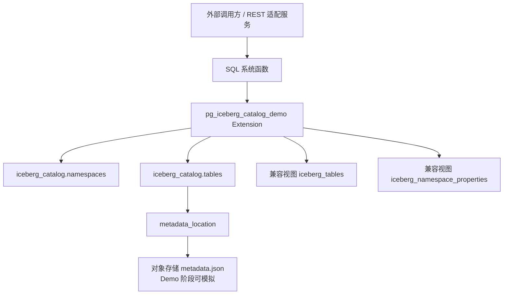

# PostgreSQL Iceberg Catalog Demo 插件需求与设计文档

## 1. 背景

当前希望在 PostgreSQL 上实现一个轻量级 Demo，用于验证 Iceberg Catalog 元信息管理与 Iceberg REST Catalog 端点能力的数据库内封装方式。

该 Demo 不追求完整 Iceberg 查询引擎能力，也不实现完整 Parquet 扫描、FDW 查询、DML 写入或完整对象存储生命周期管理，而是优先验证以下核心能力：

1. 在 PostgreSQL 插件中创建 Iceberg Catalog 元信息表。
2. 维护 `namespace + table_name -> metadata_location` 的映射关系。
3. 通过 SQL 系统函数模拟 Iceberg REST Catalog 的核心端点。
4. 通过 `commit_table(...)` 函数实现 metadata pointer 的 CAS 更新。
5. 提供兼容 Iceberg JDBC Catalog 的视图结构，验证外部生态兼容思路。
6. 为后续扩展到 openGauss / GaussVector 插件化实现提供原型参考。

## 2. 目标

### 2.1 Demo 目标

本 Demo 的目标是实现一个 PostgreSQL extension，暂定名为：

```text
pg_iceberg_catalog_demo
```

该插件安装后提供：

```sql
CREATE EXTENSION pg_iceberg_catalog_demo;
```

安装完成后，数据库中自动创建：

```text
iceberg_catalog schema
iceberg_catalog.namespaces
iceberg_catalog.tables
iceberg_tables 兼容视图
iceberg_namespace_properties 兼容视图
一组 iceberg_catalog.* 系统函数
```

### 2.2 核心验证点

本 Demo 重点验证：

| 验证点                | 说明                                                         |
| --------------------- | ------------------------------------------------------------ |
| Catalog 元信息表设计  | 是否能用 PostgreSQL 表维护 Iceberg 表入口信息                |
| JDBC Catalog 兼容视图 | 是否能通过视图映射成 `iceberg_tables` / `iceberg_namespace_properties` |
| REST 端点函数化       | 是否能把 REST Catalog 操作映射成 SQL 函数                    |
| CAS commit            | 是否能通过 `expected_metadata_location` 防止并发覆盖         |
| 外部 REST 适配可行性  | 外部 REST 服务能否只做 HTTP <-> SQL 翻译                     |
| 插件化交付            | 是否能以 PostgreSQL extension 形式安装、升级和卸载           |

## 3. 非目标

本 Demo 不做以下内容：

1. 不实现完整 Iceberg Java SDK / PyIceberg / Rust / C++ SDK。
2. 不实现真实 Parquet 文件写入。
3. 不实现 manifest / manifest list 的完整 Avro 读写。
4. 不实现对象存储访问。
5. 不实现 FDW 查询 Iceberg 表。
6. 不实现 Spark / Trino / Flink 的完整联调。
7. 不实现 row-level delete、position delete、equality delete。
8. 不实现 branch / tag。
9. 不实现数据库级 2PC。
10. 不保证生产级 REST Catalog 一致性。

Demo 阶段可以用 `metadata_json JSONB` 字段或模拟路径来替代真实对象存储中的 `metadata.json` 文件，用于验证 Catalog 元信息与 commit 语义。

### 3.1 MVP 约束与边界

为避免 Demo 范围失控，MVP 阶段额外约束如下：

1. 仅支持单层 namespace，例如 `sales`，不支持多段 namespace 路径编码。
2. 仅支持单一 `catalog_name='default'`，不实现多 catalog 路由。
3. `metadata_json` 主要用于模拟 Iceberg metadata 内容，不要求与某个 Iceberg 版本的全部字段完全对齐。
4. Demo 的核心验收对象是 PostgreSQL extension 的安装、SQL 函数行为、CAS 语义和兼容视图，不以真实对象存储联动为验收前提。
5. 如果保留 `drop_table(..., p_purge => true)` 语义，则必须提供 `purge_queue` 记录表；该表只记录待清理对象，不负责真实删除。

## 4. 总体架构

### 4.1 架构图



### 4.2 架构说明

该 Demo 采用数据库内 Catalog 管理模式。

PostgreSQL 插件负责维护 Catalog 元信息表。外部 REST 适配服务不直接操作底层表，而是通过 SQL 函数调用 Catalog 能力。例如：

```sql
SELECT * FROM iceberg_catalog.create_namespace('sales', '{"owner": "team_a"}');

SELECT * FROM iceberg_catalog.create_table(
    'sales',
    'orders',
    '{"type":"struct","fields":[]}'::jsonb,
    NULL,
    '{}'::jsonb,
    's3://bucket/sales/orders'
);

SELECT * FROM iceberg_catalog.commit_table(
    'sales',
    'orders',
    's3://bucket/sales/orders/metadata/v1.metadata.json',
    's3://bucket/sales/orders/metadata/v2.metadata.json'
);
```

## 5. 元信息表设计

### 5.1 设计原则

Iceberg 的 `metadata.json` 是自包含的，包含 schema、partition spec、snapshots、current snapshot、properties 等完整表元数据。因此 Catalog MVP 不需要将全部 Iceberg 元数据展开存入数据库。

Catalog 主表只需要维护：

```text
catalog_name + namespace + table_name -> metadata_location
```

其中 `metadata_location` 是当前生效的 Iceberg `metadata.json` 地址。

### 5.2 Schema

插件安装时创建：

```sql
CREATE SCHEMA IF NOT EXISTS iceberg_catalog;
```

### 5.3 Namespace 表

```sql
CREATE TABLE iceberg_catalog.namespaces (
    namespace       TEXT PRIMARY KEY,
    properties      JSONB DEFAULT '{}'::jsonb,
    created_at      TIMESTAMPTZ DEFAULT now(),
    updated_at      TIMESTAMPTZ DEFAULT now()
);
```

字段说明：

| 字段         | 说明                                   |
| ------------ | -------------------------------------- |
| `namespace`  | Iceberg namespace 名称                 |
| `properties` | namespace 属性，Demo 阶段用 JSONB 存储 |
| `created_at` | 创建时间                               |
| `updated_at` | 更新时间                               |

### 5.4 Table 元信息表

```sql
CREATE TABLE iceberg_catalog.tables (
    id                          BIGSERIAL PRIMARY KEY,
    catalog_name                TEXT NOT NULL DEFAULT 'default',
    namespace                   TEXT NOT NULL,
    table_name                  TEXT NOT NULL,
    table_uuid                  UUID NOT NULL DEFAULT gen_random_uuid(),
    metadata_location           TEXT NOT NULL,
    previous_metadata_location  TEXT,
    table_location              TEXT,
    iceberg_type                VARCHAR(5) NOT NULL DEFAULT 'TABLE',
    properties                  JSONB DEFAULT '{}'::jsonb,

    -- Demo 阶段可选：保存一份模拟 metadata.json，便于 load_table 返回
    metadata_json               JSONB DEFAULT '{}'::jsonb,

    created_at                  TIMESTAMPTZ DEFAULT now(),
    updated_at                  TIMESTAMPTZ DEFAULT now(),

    UNIQUE (catalog_name, namespace, table_name),
    UNIQUE (table_uuid),
    FOREIGN KEY (namespace)
        REFERENCES iceberg_catalog.namespaces(namespace)
        ON DELETE CASCADE
);
```

字段说明：

| 字段                         | 说明                             |
| ---------------------------- | -------------------------------- |
| `id`                         | Demo 内部主键                    |
| `catalog_name`               | Catalog 标识，默认 `default`     |
| `namespace`                  | 表所属 namespace                 |
| `table_name`                 | Iceberg 表名                     |
| `table_uuid`                 | Iceberg 表唯一标识               |
| `metadata_location`          | 当前生效的 `metadata.json` 路径  |
| `previous_metadata_location` | 上一个 `metadata.json` 路径      |
| `table_location`             | 表根路径                         |
| `iceberg_type`               | `TABLE` 或 `VIEW`                |
| `properties`                 | 表属性                           |
| `metadata_json`              | Demo 阶段模拟 metadata.json 内容 |
| `created_at` / `updated_at`  | 审计字段                         |

### 5.5 Purge 队列表

如果保留 `drop_table(..., p_purge => true)` 参数，建议同时创建一个轻量 purge 队列表，记录后续需要异步清理的 metadata 地址：

```sql
CREATE TABLE iceberg_catalog.purge_queue (
    id                  BIGSERIAL PRIMARY KEY,
    namespace           TEXT NOT NULL,
    table_name          TEXT NOT NULL,
    metadata_location   TEXT NOT NULL,
    enqueued_at         TIMESTAMPTZ DEFAULT now(),
    processed_at        TIMESTAMPTZ
);
```

说明：

- Demo 阶段只记录 purge 意图，不执行真实对象存储删除。
- 如果实现时不交付 `purge_queue`，则应同步移除 `drop_table` 的 `p_purge` 参数或强制限制为 `false`。

## 6. 兼容 Iceberg JDBC Catalog 视图

### 6.1 `iceberg_tables` 视图

```sql
CREATE OR REPLACE VIEW iceberg_tables AS
SELECT
    catalog_name,
    namespace AS table_namespace,
    table_name,
    metadata_location,
    previous_metadata_location,
    iceberg_type
FROM iceberg_catalog.tables;
```

该视图用于模拟 Iceberg JDBC Catalog 的标准表结构。

### 6.2 `iceberg_namespace_properties` 视图

```sql
CREATE OR REPLACE VIEW iceberg_namespace_properties AS
SELECT
    'default'::TEXT AS catalog_name,
    namespace,
    key AS property_key,
    value AS property_value
FROM iceberg_catalog.namespaces,
     LATERAL jsonb_each_text(properties) AS props(key, value);
```

该视图将内部 JSONB properties 展开为行式 KV 结构，便于兼容 Iceberg JDBC Catalog 的 namespace properties 表达方式。

### 6.3 兼容性边界与验收标准

本设计中“兼容 Iceberg JDBC Catalog”的含义需要明确收敛为：

1. 提供与目标客户端预期字段名一致的兼容视图。
2. 支持外部适配层通过固定 SQL 查询获取 namespace、table 和 metadata location。
3. 不承诺直接替代官方 JDBC Catalog 的全部行为，也不承诺 Spark / Trino 等引擎在无适配层情况下直接连接成功。

建议将兼容性验收标准定义为：

1. 可以通过 `iceberg_tables` 查询到 `catalog_name / namespace / table_name / metadata_location`。
2. 可以通过 `iceberg_namespace_properties` 查询到 namespace 属性的行式 KV 结果。
3. 外部 REST 适配层可以只通过调用 SQL 函数和查询兼容视图完成 Demo 范围内的协议翻译。

## 7. 系统函数设计

### 7.1 函数总览

| 函数               | REST 端点语义         | Demo 是否实现 | 实现语言 (v2.0) |
| ------------------ | --------------------- | ------------- | --------------- |
| `create_namespace` | POST namespaces       | 是            | **C**           |
| `drop_namespace`   | DELETE namespace      | 是            | **C**           |
| `list_namespaces`  | GET namespaces        | 是            | **C**           |
| `create_table`     | POST tables           | 是            | **C**           |
| `register_table`   | POST register         | 是            | **C**           |
| `load_table`       | GET table             | 是            | **C**           |
| `list_tables`      | GET tables            | 是            | **C**           |
| `drop_table`       | DELETE table          | 是            | **C**           |
| `unregister_table` | DELETE table no purge | 是            | **C**           |
| `rename_table`     | POST rename           | 是            | **C**           |
| `commit_table`     | POST table commit     | 是，核心      | **C**           |
| `alter_table`      | POST table update     | Demo 简化实现 | SQL wrapper     |
| `get_config`       | GET config            | 可选          | -               |
| `table_exists`     | HEAD table            | 可内联实现    | -               |
| `namespace_exists` | HEAD namespace        | 可内联实现    | -               |

> **注意**: v2.0 版本所有核心函数均采用 C 语言实现，通过 SPI (Server Programming Interface) 执行 SQL 操作。`alter_table` 为 SQL wrapper，内部调用 `commit_table`。

### 7.2 错误与返回约定

为了便于后续增加 REST 适配层，建议在 SQL 函数层统一错误语义：

| 场景 | 建议 SQLSTATE | 建议 HTTP 映射 | 说明 |
| ---- | ------------- | -------------- | ---- |
| namespace 已存在 | `23505` | `409 Conflict` | 可复用 `unique_violation` |
| table 已存在 | `23505` | `409 Conflict` | 可复用 `unique_violation` |
| namespace 不存在 | `P0002` 或自定义业务码 | `404 Not Found` | 需要保持报错文本稳定 |
| table 不存在 | `P0002` 或自定义业务码 | `404 Not Found` | 建议统一文案 |
| namespace 非空不可删 | `P0001` 或自定义业务码 | `409 Conflict` | 语义上不是系统错误 |
| commit 冲突 | `40001` | `409 Conflict` | 建议使用 `serialization_failure` |
| 参数非法 | `22023` | `400 Bad Request` | 例如空 namespace、空 table_name |

建议：

1. 关键函数统一校验 `p_namespace`、`p_table_name`、`p_metadata_location` 是否为空字符串。
2. 所有“not found”异常文案尽量保持统一格式，便于外层做稳定映射。
3. 所有“冲突类”异常优先使用标准 SQLSTATE，而不是仅依赖错误文本。

## 8. 函数详细设计

> **v2.0 更新**: 所有函数已改为 C 语言实现，以下为 C 实现的关键设计说明。
> PL/pgSQL 版本的函数签名和行为语义保持不变，仅实现语言发生变化。

### 8.0 C 函数实现架构

#### 8.0.1 文件结构

```text
src/
├── pg_iceberg_catalog_demo.c  # 模块入口，PG_MODULE_MAGIC
├── namespace.c                 # create_namespace, drop_namespace, list_namespaces
├── table_ops.c                 # list_tables, register_table, drop_table, unregister_table, rename_table
├── commit_table.c              # commit_table (核心 CAS 实现)
├── create_table.c              # create_table (UUID 生成，metadata_json 构建)
├── load_table.c                # load_table
├── utils.c                     # 错误处理，UUID 生成工具
└── utils.h                     # 头文件
```

#### 8.0.2 SPI 使用模式

所有 C 函数通过 SPI (Server Programming Interface) 执行 SQL：

```c
SPI_connect();

/* 准备 SQL 语句 */
SPIPlanPtr plan = SPI_prepare(sql, nargs, argtypes);

/* 执行 */
SPI_execute_plan(plan, values, nulls, false, 0);

/* 获取结果 */
HeapTuple tuple = SPI_tuptable->vals[0];
char *value = SPI_getvalue(tuple, SPI_tuptable->tupdesc, colnum);

SPI_finish();
```

#### 8.0.3 返回值构建

返回 TABLE 类型的函数使用 `BuildTupleFromCStrings`：

```c
get_call_result_type(fcinfo, NULL, &tupdesc);
BlessTupleDesc(tupdesc);
AttInMetadata *attinmeta = TupleDescGetAttInMetadata(tupdesc);

char **str_values = (char **) palloc(sizeof(char *) * ncols);
str_values[0] = SPI_getvalue(tuple, tupdesc, 1);
str_values[1] = SPI_getvalue(tuple, tupdesc, 2);
...

HeapTuple result_tuple = BuildTupleFromCStrings(attinmeta, str_values);
Datum result_datum = HeapTupleGetDatum(result_tuple);
PG_RETURN_DATUM(result_datum);
```

#### 8.0.4 错误处理

使用 `ereport` 抛出标准 SQLSTATE 错误：

```c
ereport(ERROR,
        (errcode(ERRCODE_UNIQUE_VIOLATION),
         errmsg("Namespace already exists: %s", ns_text)));

ereport(ERROR,
        (errcode(ERRCODE_T_R_SERIALIZATION_FAILURE),
         errmsg("Commit conflict for %s.%s: expected metadata_location %s",
                namespace, table_name, expected)));
```

### 8.1 `create_namespace` (C 实现)

**函数签名** (保持不变):
```sql
CREATE FUNCTION iceberg_catalog.create_namespace(
    p_namespace TEXT,
    p_properties JSONB DEFAULT '{}'::jsonb
)
RETURNS TABLE (namespace TEXT, properties JSONB)
AS 'pg_iceberg_catalog_demo', 'iceberg_create_namespace'
LANGUAGE C;
```

**C 实现逻辑**:
1. SPI 连接
2. 检查 namespace 是否已存在 (SELECT 1 FROM namespaces WHERE namespace = $1)
3. 若存在，抛出 `ERRCODE_UNIQUE_VIOLATION`
4. INSERT INTO namespaces
5. SELECT 返回创建的记录
6. 构建 tuple 返回
7. SPI 完成

### 8.2 `drop_namespace` (C 实现)

**函数签名** (保持不变):
```sql
CREATE FUNCTION iceberg_catalog.drop_namespace(p_namespace TEXT)
RETURNS BOOLEAN
AS 'pg_iceberg_catalog_demo', 'iceberg_drop_namespace'
LANGUAGE C STRICT;
```

**C 实现逻辑**:
1. SPI 连接
2. SELECT count(*) FROM tables WHERE namespace = $1
3. 若 count > 0，抛出 "Namespace is not empty" 错误
4. DELETE FROM namespaces WHERE namespace = $1
5. 若 SPI_processed == 0，抛出 "Namespace not found" 错误
6. 返回 true

### 8.3 `list_namespaces` (C 实现)

**函数签名** (保持不变):
```sql
CREATE FUNCTION iceberg_catalog.list_namespaces()
RETURNS TABLE (namespace TEXT, properties JSONB)
AS 'pg_iceberg_catalog_demo', 'iceberg_list_namespaces'
LANGUAGE C;
```

**C 实现逻辑**:
1. 使用 SRF (Set Returning Function) 模式
2. `SRF_IS_FIRSTCALL()` 时执行查询，保存结果到 funcctx
3. `SRF_PERCALL_SETUP()` 遍历结果，逐行返回
4. `SRF_RETURN_NEXT()` / `SRF_RETURN_DONE()` 控制流程

### 8.4 `commit_table` (C 实现 - 核心)

**函数签名** (保持不变):
```sql
CREATE FUNCTION iceberg_catalog.commit_table(
    p_namespace TEXT,
    p_table_name TEXT,
    p_expected_metadata_location TEXT,
    p_new_metadata_location TEXT,
    p_new_metadata_json JSONB DEFAULT NULL
)
RETURNS TABLE (namespace TEXT, table_name TEXT, table_uuid UUID, 
               metadata_location TEXT, metadata_json JSONB)
AS 'pg_iceberg_catalog_demo', 'iceberg_commit_table'
LANGUAGE C STRICT;
```

**C 实现逻辑** (CAS 语义):
```c
/* 1. CAS UPDATE */
UPDATE iceberg_catalog.tables SET
    previous_metadata_location = metadata_location,
    metadata_location = $1,
    metadata_json = COALESCE($2, metadata_json),
    updated_at = now()
WHERE namespace = $3 AND table_name = $4
AND metadata_location = $5;

/* 2. 检查 rows_updated */
GET DIAGNOSTICS v_rows = ROW_COUNT;  /* SPI_processed */

/* 3. 若 rows_updated == 0 */
IF SPI_processed == 0:
    /* 检查表是否存在 */
    SELECT 1 FROM tables WHERE namespace = $3 AND table_name = $4
    IF NOT FOUND:
        throw_table_not_found()
    ELSE:
        throw_commit_conflict()  /* ERRCODE_T_R_SERIALIZATION_FAILURE */

/* 4. 返回更新后的记录 */
```

### 8.5-8.12 其他函数

其他函数 (`create_table`, `load_table`, `list_tables`, `register_table`, 
`drop_table`, `unregister_table`, `rename_table`) 均采用相同的 C 实现模式：
- SPI 连接/断开
- 准备/执行 SQL
- 错误处理 (ereport)
- 结果构建 (BuildTupleFromCStrings)

详细 C 代码见 `src/` 目录下各文件。

### 8.13 `alter_table` (SQL Wrapper)

保持 SQL 实现，内部调用 `commit_table`:

```sql
CREATE OR REPLACE FUNCTION iceberg_catalog.alter_table(
    p_namespace TEXT,
    p_table_name TEXT,
    p_expected_metadata_location TEXT,
    p_new_metadata_location TEXT,
    p_updates_json JSONB DEFAULT '{}'::jsonb,
    p_new_metadata_json JSONB DEFAULT NULL
)
RETURNS TABLE (...)
LANGUAGE sql
AS $$
    SELECT * FROM iceberg_catalog.commit_table(
        p_namespace, p_table_name, p_expected_metadata_location,
        p_new_metadata_location, COALESCE(p_new_metadata_json, p_updates_json)
    );
$$;
```

    RETURN TRUE;
END;
$$;
```

### 8.3 `list_namespaces`

```sql
CREATE OR REPLACE FUNCTION iceberg_catalog.list_namespaces()
RETURNS TABLE (
    namespace TEXT,
    properties JSONB
)
LANGUAGE sql
AS $$
    SELECT namespace, properties
    FROM iceberg_catalog.namespaces
    ORDER BY namespace;
$$;
```

### 8.4 `create_table`

Demo 阶段不真实调用 Iceberg SDK，而是模拟生成初始 `metadata_location` 和 `metadata_json`。

```sql
CREATE OR REPLACE FUNCTION iceberg_catalog.create_table(
    p_namespace TEXT,
    p_table_name TEXT,
    p_schema_json JSONB,
    p_partition_spec JSONB DEFAULT NULL,
    p_properties JSONB DEFAULT '{}'::jsonb,
    p_location TEXT DEFAULT NULL
)
RETURNS TABLE (
    namespace TEXT,
    table_name TEXT,
    table_uuid UUID,
    metadata_location TEXT,
    metadata_json JSONB
)
LANGUAGE plpgsql
AS $$
DECLARE
    v_uuid UUID := gen_random_uuid();
    v_location TEXT;
    v_metadata_location TEXT;
    v_metadata_json JSONB;
BEGIN
    IF NOT EXISTS (
        SELECT 1 FROM iceberg_catalog.namespaces n
        WHERE n.namespace = p_namespace
    ) THEN
        RAISE EXCEPTION 'Namespace not found: %', p_namespace;
    END IF;

    v_location := COALESCE(
        p_location,
        format('s3://demo-bucket/%s/%s', p_namespace, p_table_name)
    );

    v_metadata_location := format(
        '%s/metadata/00000-%s.metadata.json',
        v_location,
        replace(v_uuid::text, '-', '')
    );

    v_metadata_json := jsonb_build_object(
        'format-version', 2,
        'table-uuid', v_uuid::text,
        'location', v_location,
        'last-sequence-number', 0,
        'last-updated-ms', floor(extract(epoch from clock_timestamp()) * 1000)::bigint,
        'schemas', jsonb_build_array(p_schema_json),
        'current-schema-id', 0,
        'partition-specs',
            CASE
                WHEN p_partition_spec IS NULL THEN '[]'::jsonb
                ELSE jsonb_build_array(p_partition_spec)
            END,
        'default-spec-id', 0,
        'properties', COALESCE(p_properties, '{}'::jsonb),
        'snapshots', '[]'::jsonb,
        'snapshot-log', '[]'::jsonb,
        'metadata-log', '[]'::jsonb,
        'refs', '{}'::jsonb
    );

    INSERT INTO iceberg_catalog.tables(
        catalog_name,
        namespace,
        table_name,
        table_uuid,
        metadata_location,
        previous_metadata_location,
        table_location,
        iceberg_type,
        properties,
        metadata_json
    )
    VALUES (
        'default',
        p_namespace,
        p_table_name,
        v_uuid,
        v_metadata_location,
        NULL,
        v_location,
        'TABLE',
        COALESCE(p_properties, '{}'::jsonb),
        v_metadata_json
    );

    RETURN QUERY
    SELECT
        t.namespace,
        t.table_name,
        t.table_uuid,
        t.metadata_location,
        t.metadata_json
    FROM iceberg_catalog.tables t
    WHERE t.namespace = p_namespace
      AND t.table_name = p_table_name;

EXCEPTION WHEN unique_violation THEN
    RAISE EXCEPTION 'Table already exists: %.%', p_namespace, p_table_name
        USING ERRCODE = 'unique_violation';
END;
$$;
```

### 8.5 `register_table`

注册已有 Iceberg 表。Demo 阶段允许调用方直接传入 `metadata_location`，可选传入 `metadata_json`。

```sql
CREATE OR REPLACE FUNCTION iceberg_catalog.register_table(
    p_namespace TEXT,
    p_table_name TEXT,
    p_metadata_location TEXT,
    p_metadata_json JSONB DEFAULT '{}'::jsonb
)
RETURNS TABLE (
    namespace TEXT,
    table_name TEXT,
    table_uuid UUID,
    metadata_location TEXT,
    metadata_json JSONB
)
LANGUAGE plpgsql
AS $$
DECLARE
    v_uuid UUID;
BEGIN
    IF NOT EXISTS (
        SELECT 1 FROM iceberg_catalog.namespaces n
        WHERE n.namespace = p_namespace
    ) THEN
        RAISE EXCEPTION 'Namespace not found: %', p_namespace;
    END IF;

    v_uuid := COALESCE(
        NULLIF(p_metadata_json->>'table-uuid', '')::uuid,
        gen_random_uuid()
    );

    INSERT INTO iceberg_catalog.tables(
        catalog_name,
        namespace,
        table_name,
        table_uuid,
        metadata_location,
        previous_metadata_location,
        table_location,
        iceberg_type,
        properties,
        metadata_json
    )
    VALUES (
        'default',
        p_namespace,
        p_table_name,
        v_uuid,
        p_metadata_location,
        NULL,
        p_metadata_json->>'location',
        'TABLE',
        COALESCE(p_metadata_json->'properties', '{}'::jsonb),
        COALESCE(p_metadata_json, '{}'::jsonb)
    );

    RETURN QUERY
    SELECT
        t.namespace,
        t.table_name,
        t.table_uuid,
        t.metadata_location,
        t.metadata_json
    FROM iceberg_catalog.tables t
    WHERE t.namespace = p_namespace
      AND t.table_name = p_table_name;

EXCEPTION WHEN unique_violation THEN
    RAISE EXCEPTION 'Table already exists: %.%', p_namespace, p_table_name
        USING ERRCODE = 'unique_violation';
END;
$$;
```

### 8.6 `load_table`

```sql
CREATE OR REPLACE FUNCTION iceberg_catalog.load_table(
    p_namespace TEXT,
    p_table_name TEXT
)
RETURNS TABLE (
    namespace TEXT,
    table_name TEXT,
    table_uuid UUID,
    metadata_location TEXT,
    metadata_json JSONB
)
LANGUAGE plpgsql
AS $$
BEGIN
    RETURN QUERY
    SELECT
        t.namespace,
        t.table_name,
        t.table_uuid,
        t.metadata_location,
        t.metadata_json
    FROM iceberg_catalog.tables t
    WHERE t.namespace = p_namespace
      AND t.table_name = p_table_name;

    IF NOT FOUND THEN
        RAISE EXCEPTION 'Table not found: %.%', p_namespace, p_table_name;
    END IF;
END;
$$;
```

### 8.7 `list_tables`

```sql
CREATE OR REPLACE FUNCTION iceberg_catalog.list_tables(
    p_namespace TEXT
)
RETURNS TABLE (
    namespace TEXT,
    table_name TEXT,
    table_uuid UUID,
    metadata_location TEXT
)
LANGUAGE sql
AS $$
    SELECT
        namespace,
        table_name,
        table_uuid,
        metadata_location
    FROM iceberg_catalog.tables
    WHERE namespace = p_namespace
    ORDER BY table_name;
$$;
```

### 8.8 `commit_table`

`commit_table` 是 Demo 核心函数，用于验证 Iceberg Catalog commit 的 optimistic concurrency / CAS 语义。

```sql
CREATE OR REPLACE FUNCTION iceberg_catalog.commit_table(
    p_namespace TEXT,
    p_table_name TEXT,
    p_expected_metadata_location TEXT,
    p_new_metadata_location TEXT,
    p_new_metadata_json JSONB DEFAULT NULL
)
RETURNS TABLE (
    namespace TEXT,
    table_name TEXT,
    table_uuid UUID,
    metadata_location TEXT,
    metadata_json JSONB
)
LANGUAGE plpgsql
AS $$
DECLARE
    v_rows INT;
BEGIN
    UPDATE iceberg_catalog.tables t
    SET
        previous_metadata_location = t.metadata_location,
        metadata_location = p_new_metadata_location,
        metadata_json = COALESCE(p_new_metadata_json, t.metadata_json),
        updated_at = now()
    WHERE t.namespace = p_namespace
      AND t.table_name = p_table_name
      AND t.metadata_location = p_expected_metadata_location;

    GET DIAGNOSTICS v_rows = ROW_COUNT;

    IF v_rows = 0 THEN
        IF NOT EXISTS (
            SELECT 1 FROM iceberg_catalog.tables t
            WHERE t.namespace = p_namespace
              AND t.table_name = p_table_name
        ) THEN
            RAISE EXCEPTION 'Table not found: %.%', p_namespace, p_table_name;
        ELSE
            RAISE EXCEPTION
                'Commit conflict for %.%: expected metadata_location %, but current metadata_location has changed',
                p_namespace, p_table_name, p_expected_metadata_location
                USING ERRCODE = 'serialization_failure';
        END IF;
    END IF;

    RETURN QUERY
    SELECT
        t.namespace,
        t.table_name,
        t.table_uuid,
        t.metadata_location,
        t.metadata_json
    FROM iceberg_catalog.tables t
    WHERE t.namespace = p_namespace
      AND t.table_name = p_table_name;
END;
$$;
```

### 8.9 `alter_table`

Demo 阶段将 `alter_table` 简化为：调用方传入新的 metadata JSON 和新的 metadata location，然后内部复用 `commit_table`。

```sql
CREATE OR REPLACE FUNCTION iceberg_catalog.alter_table(
    p_namespace TEXT,
    p_table_name TEXT,
    p_expected_metadata_location TEXT,
    p_new_metadata_location TEXT,
    p_updates_json JSONB DEFAULT '{}'::jsonb,
    p_new_metadata_json JSONB DEFAULT NULL
)
RETURNS TABLE (
    namespace TEXT,
    table_name TEXT,
    table_uuid UUID,
    metadata_location TEXT,
    metadata_json JSONB
)
LANGUAGE plpgsql
AS $$
BEGIN
    RETURN QUERY
    SELECT *
    FROM iceberg_catalog.commit_table(
        p_namespace,
        p_table_name,
        p_expected_metadata_location,
        p_new_metadata_location,
        COALESCE(p_new_metadata_json, p_updates_json)
    );
END;
$$;
```

### 8.10 `drop_table`

```sql
CREATE OR REPLACE FUNCTION iceberg_catalog.drop_table(
    p_namespace TEXT,
    p_table_name TEXT,
    p_purge BOOLEAN DEFAULT false
)
RETURNS BOOLEAN
LANGUAGE plpgsql
AS $$
DECLARE
    v_metadata_location TEXT;
BEGIN
    SELECT metadata_location
    INTO v_metadata_location
    FROM iceberg_catalog.tables
    WHERE namespace = p_namespace
      AND table_name = p_table_name;

    IF v_metadata_location IS NULL THEN
        RAISE EXCEPTION 'Table not found: %.%', p_namespace, p_table_name;
    END IF;

    DELETE FROM iceberg_catalog.tables
    WHERE namespace = p_namespace
      AND table_name = p_table_name;

    IF p_purge THEN
        INSERT INTO iceberg_catalog.purge_queue(metadata_location)
        VALUES (v_metadata_location);
    END IF;

    RETURN TRUE;
END;
$$;
```

说明：

- 当 `p_purge = false` 时，仅删除 catalog 元信息。
- 当 `p_purge = true` 时，只向 `purge_queue` 登记待清理对象，不进行真实对象存储删除。

### 8.11 `unregister_table`

```sql
CREATE OR REPLACE FUNCTION iceberg_catalog.unregister_table(
    p_namespace TEXT,
    p_table_name TEXT
)
RETURNS BOOLEAN
LANGUAGE plpgsql
AS $$
BEGIN
    DELETE FROM iceberg_catalog.tables
    WHERE namespace = p_namespace
      AND table_name = p_table_name;

    IF NOT FOUND THEN
        RAISE EXCEPTION 'Table not found: %.%', p_namespace, p_table_name;
    END IF;

    RETURN TRUE;
END;
$$;
```

### 8.12 `rename_table`

```sql
CREATE OR REPLACE FUNCTION iceberg_catalog.rename_table(
    p_old_namespace TEXT,
    p_old_table_name TEXT,
    p_new_namespace TEXT,
    p_new_table_name TEXT
)
RETURNS BOOLEAN
LANGUAGE plpgsql
AS $$
DECLARE
    v_rows INT;
BEGIN
    IF NOT EXISTS (
        SELECT 1 FROM iceberg_catalog.namespaces
        WHERE namespace = p_new_namespace
    ) THEN
        RAISE EXCEPTION 'Target namespace not found: %', p_new_namespace;
    END IF;

    UPDATE iceberg_catalog.tables
    SET
        namespace = p_new_namespace,
        table_name = p_new_table_name,
        updated_at = now()
    WHERE namespace = p_old_namespace
      AND table_name = p_old_table_name;

    GET DIAGNOSTICS v_rows = ROW_COUNT;

    IF v_rows = 0 THEN
        RAISE EXCEPTION 'Table not found: %.%', p_old_namespace, p_old_table_name;
    END IF;

    RETURN TRUE;

EXCEPTION WHEN unique_violation THEN
    RAISE EXCEPTION 'Target table already exists: %.%', p_new_namespace, p_new_table_name;
END;
$$;
```

## 9. REST 端点到系统函数映射

| REST Catalog 端点语义                                | HTTP 方法 | Demo 系统函数                               |
| ---------------------------------------------------- | --------- | ------------------------------------------- |
| `/v1/{prefix}/namespaces`                            | GET       | `list_namespaces()`                         |
| `/v1/{prefix}/namespaces`                            | POST      | `create_namespace()`                        |
| `/v1/{prefix}/namespaces/{namespace}`                | DELETE    | `drop_namespace()`                          |
| `/v1/{prefix}/namespaces/{namespace}/tables`         | GET       | `list_tables(namespace)`                    |
| `/v1/{prefix}/namespaces/{namespace}/tables`         | POST      | `create_table(...)`                         |
| `/v1/{prefix}/namespaces/{namespace}/tables/{table}` | GET       | `load_table(namespace, table)`              |
| `/v1/{prefix}/namespaces/{namespace}/register`       | POST      | `register_table(...)`                       |
| `/v1/{prefix}/namespaces/{namespace}/tables/{table}` | POST      | `commit_table(...)` / `alter_table(...)`    |
| `/v1/{prefix}/namespaces/{namespace}/tables/{table}` | DELETE    | `drop_table(...)` / `unregister_table(...)` |
| `/v1/tables/rename`                                  | POST      | `rename_table(...)`                         |

Demo 不实现：

| REST 能力           | 原因                   |
| ------------------- | ---------------------- |
| `/v1/config`        | 可后续补充             |
| OAuth token         | 由外部 REST 服务处理   |
| credentials vending | MVP 不涉及对象存储授权 |
| plan endpoint       | MVP 不做 scan planning |
| metrics endpoint    | MVP 不做运行指标       |

## 10. 插件工程结构

### 10.0 版本演进

| 版本 | 实现方式 | 说明 |
|------|---------|------|
| v1.0 | 纯 PL/pgSQL | 初始版本，所有函数为 SQL 实现 |
| v1.1 | 混合实现 | 3 个核心函数 (commit_table, create_table, load_table) 改为 C |
| **v2.0** | **全 C 实现** | 所有 11 个函数为 C 实现，alter_table 为 SQL wrapper |

### 10.1 工程目录 (v2.0)

```text
pg_iceberg_catalog_demo/
├── pg_iceberg_catalog_demo.control    # Extension 控制文件
├── Makefile                           # PGXS 构建配置
├── README.md                          # 使用说明
├── src/
│   ├── pg_iceberg_catalog_demo.c      # 模块入口 (PG_MODULE_MAGIC, _PG_init)
│   ├── namespace.c                    # namespace 相关函数 (3个)
│   ├── table_ops.c                    # table 操作函数 (5个)
│   ├── commit_table.c                 # CAS commit 核心实现
│   ├── create_table.c                 # 表创建，UUID 生成
│   ├── load_table.c                   # 表加载
│   ├── utils.c                        # 工具函数 (错误处理, UUID)
│   └── utils.h                        # 头文件
└── sql/
    ├── pg_iceberg_catalog_demo--1.0.sql         # 初始 SQL (表、视图)
    ├── pg_iceberg_catalog_demo--1.0--2.0.sql    # 升级脚本 (替换为 C 函数)
    ├── smoke_test.sql                           # Smoke 测试脚本
    ├── test_c_functions.sql                     # C 函数测试
    └── test_all_c.sql                           # 全 C 函数验证
```

### 10.2 control 文件

```text
comment = 'Demo extension for Iceberg catalog metadata and SQL function endpoints'
default_version = '2.0'
relocatable = false
requires = 'pgcrypto'
module_pathname = '$libdir/pg_iceberg_catalog_demo'
```

说明：

- `pgcrypto` 用于 `gen_random_uuid()` (C 版本自实现 UUID 生成)。
- `module_pathname` 指定 shared library 路径。
- v2.0 为全 C 实现版本。

### 10.3 Makefile

```makefile
EXTENSION = pg_iceberg_catalog_demo
MODULE_big = pg_iceberg_catalog_demo
OBJS = src/pg_iceberg_catalog_demo.o \
       src/commit_table.o \
       src/create_table.o \
       src/load_table.o \
       src/namespace.o \
       src/table_ops.o \
       src/utils.o

DATA = sql/pg_iceberg_catalog_demo--1.0.sql \
       sql/pg_iceberg_catalog_demo--1.0--2.0.sql

PG_CONFIG = pg_config
PGXS := $(shell $(PG_CONFIG) --pgxs)
include $(PGXS)
```

说明：

- `MODULE_big` 指定 shared library 名称。
- `OBJS` 列出所有 C 源文件编译的目标文件。
- `DATA` 包含初始 SQL 和升级脚本。

### 10.4 编译产物

编译后生成：

```text
pg_iceberg_catalog_demo.so           # Shared library (Linux)
pg_iceberg_catalog_demo.bc           # LLVM bitcode (JIT 支持)
```

安装到 PostgreSQL 目录：

```text
/usr/lib/postgresql/16/lib/pg_iceberg_catalog_demo.so
/usr/share/postgresql/16/extension/pg_iceberg_catalog_demo.control
/usr/share/postgresql/16/extension/pg_iceberg_catalog_demo--1.0.sql
/usr/share/postgresql/16/extension/pg_iceberg_catalog_demo--1.0--2.0.sql
```

### 10.5 WSL 环境要求

建议在 WSL 中完成编译和验证，并明确记录以下前置条件：

1. 已安装并初始化可用的 WSL Linux 发行版，例如 Ubuntu 22.04 或 24.04。
2. 已安装 PostgreSQL 服务端与开发头文件，且 `pg_config` 可用。
3. 已安装基础编译工具链：`make`、`gcc`、`clang` (用于 bitcode)、`libpq-dev`、`postgresql-server-dev-*`。
4. 已有可写测试数据库，且当前用户具备 `CREATE EXTENSION` 权限。

建议在文档中固定一个最小验证版本，例如：

```text
WSL distro: Ubuntu 22.04+
PostgreSQL: 16.x
Build mode: PGXS with shared library
```

### 10.6 WSL 构建与安装步骤 (v2.0)

以下步骤建议作为 Demo 的标准验证流程：

```bash
# 1. 进入项目目录
cd /mnt/d/project/postgres_extension_demo/pg_iceberg_catalog_demo

# 2. 验证 pg_config
pg_config --version
pg_config --pgxs

# 3. 编译 (生成 shared library)
make clean
make

# 4. 安装 (需要 root 权限)
sudo make install

# 5. 启动 PostgreSQL (如果未运行)
sudo service postgresql start

# 6. 安装 extension
psql -d postgres -c "CREATE EXTENSION IF NOT EXISTS pgcrypto;"
psql -d postgres -c "CREATE EXTENSION IF NOT EXISTS pg_iceberg_catalog_demo;"

# 7. 验证 C 函数绑定
psql -d postgres -c "SELECT proname, prosrc FROM pg_proc WHERE pronamespace = 'iceberg_catalog'::regnamespace;"

# 8. 运行测试
psql -d postgres -f sql/test_all_c.sql
```

如果 `pg_config` 不存在，应先安装对应 PostgreSQL 版本的开发包：

```bash
sudo apt install -y postgresql-server-dev-all
```

## 11. Demo 使用流程

### 11.1 安装插件

```sql
CREATE EXTENSION pgcrypto;
CREATE EXTENSION pg_iceberg_catalog_demo;
```

### 11.2 创建 namespace

```sql
SELECT *
FROM iceberg_catalog.create_namespace(
    'sales',
    '{"owner":"team_a"}'::jsonb
);
```

### 11.3 创建表

```sql
SELECT *
FROM iceberg_catalog.create_table(
    'sales',
    'orders',
    '{
       "type": "struct",
       "schema-id": 0,
       "fields": [
         {"id": 1, "name": "id", "required": true, "type": "long"},
         {"id": 2, "name": "amount", "required": false, "type": "double"}
       ]
     }'::jsonb,
    NULL,
    '{"format-version":"2"}'::jsonb,
    's3://demo-bucket/sales/orders'
);
```

### 11.4 加载表

```sql
SELECT *
FROM iceberg_catalog.load_table('sales', 'orders');
```

### 11.5 查看兼容视图

```sql
SELECT *
FROM iceberg_tables;

SELECT *
FROM iceberg_namespace_properties;
```

### 11.6 模拟提交新 metadata

先查当前 location：

```sql
SELECT metadata_location
FROM iceberg_catalog.tables
WHERE namespace = 'sales'
  AND table_name = 'orders';
```

假设返回：

```text
s3://demo-bucket/sales/orders/metadata/00000-xxx.metadata.json
```

然后提交新 location：

```sql
SELECT *
FROM iceberg_catalog.commit_table(
    'sales',
    'orders',
    's3://demo-bucket/sales/orders/metadata/00000-xxx.metadata.json',
    's3://demo-bucket/sales/orders/metadata/00001-yyy.metadata.json',
    '{"format-version":2,"current-snapshot-id":1001}'::jsonb
);
```

### 11.7 模拟并发冲突

再次使用旧的 expected location 提交：

```sql
SELECT *
FROM iceberg_catalog.commit_table(
    'sales',
    'orders',
    's3://demo-bucket/sales/orders/metadata/00000-xxx.metadata.json',
    's3://demo-bucket/sales/orders/metadata/00002-zzz.metadata.json',
    '{"format-version":2,"current-snapshot-id":1002}'::jsonb
);
```

预期结果：

```text
ERROR: Commit conflict
```

## 12. 事务与一致性设计

### 12.1 Demo 阶段事务边界

Demo 阶段所有元信息变更都在 PostgreSQL 本地事务中完成，包括：

```text
namespace 创建/删除
table 创建/注册/删除
metadata_location CAS 更新
rename table
```

### 12.2 对象存储 I/O 边界

Demo 阶段不真实写对象存储。

后续真实版本应遵循：

```text
对象存储 I/O 在事务外或事务提交前准备阶段完成。
数据库事务只保证 catalog 元信息表变更原子性。
如果数据库事务失败，已写出的对象存储文件进入 orphan cleanup。
```

### 12.3 CAS 语义

`commit_table` 的核心是：

```sql
UPDATE iceberg_catalog.tables
SET metadata_location = :new_location
WHERE namespace = :ns
  AND table_name = :table
  AND metadata_location = :expected_location;
```

这可以防止两个 writer 同时基于同一个旧 metadata 提交，导致 lost update。

## 13. 测试用例

### 13.0 验证目标分层

建议将验证拆成三层，避免”SQL 跑通”和”extension 可交付”混为一谈：

1. 环境验证：确认 WSL、PostgreSQL、`pg_config`、编译工具链可用。
2. 安装验证：确认 `make`、`make install`、`CREATE EXTENSION` 成功。
3. 功能验证：确认 schema、视图、函数和 CAS 语义符合预期。
4. **C 函数绑定验证：确认 prosrc 指向 C 符号名 (v2.0 新增)**。

### 13.1 基础测试 (v2.0 全 C 实现已验证)

| 用例                  | 预期          | C 函数测试状态 |
| --------------------- | ------------- | -------------- |
| 创建 namespace        | 成功          | ✅ `iceberg_create_namespace` |
| 重复创建 namespace    | 报错 409      | ✅ `ERRCODE_UNIQUE_VIOLATION` |
| 删除非空 namespace    | 报错          | ✅ `iceberg_drop_namespace` |
| 创建 table            | 成功          | ✅ `iceberg_create_table` |
| 重复创建 table        | 报错 409      | ✅ 检查后抛出 |
| namespace 不存在时创建 table | 报错 | ✅ `throw_namespace_not_found` |
| load table            | 返回 metadata | ✅ `iceberg_load_table` |
| load 不存在 table     | 报错 404      | ✅ `throw_table_not_found` |
| list tables           | 返回表列表    | ✅ `iceberg_list_tables` (SRF) |
| 查看 `iceberg_tables` | 返回兼容视图  | ✅ 视图定义不变 |
| 查看 `iceberg_namespace_properties` | 返回属性 KV 视图 | ✅ 视图定义不变 |
| register table        | 成功          | ✅ `iceberg_register_table` |
| unregister table      | 成功          | ✅ `iceberg_unregister_table` |
| rename table          | 成功          | ✅ `iceberg_rename_table` |
| rename 到已存在目标名 | 报错          | ✅ unique_violation |

### 13.2 Commit 测试 (C 实现核心)

| 用例                                        | 预期                     | C 函数测试状态 |
| ------------------------------------------- | ------------------------ | -------------- |
| expected location 正确                      | commit 成功              | ✅ SPI_execute_plan UPDATE |
| expected location 过期                      | 报 serialization_failure | ✅ `ERRCODE_T_R_SERIALIZATION_FAILURE` |
| table 不存在                                | 报 table not found       | ✅ `throw_table_not_found` |
| commit 后 previous_metadata_location 被更新 | 成功                     | ✅ UPDATE 语句 |
| commit 后 metadata_location 被更新          | 成功                     | ✅ UPDATE 语句 |
| commit 不传 `p_new_metadata_json`           | 保留原 metadata_json     | ✅ COALESCE 逻辑 |
| ------------------------------------------- | ------------------------ |
| expected location 正确                      | commit 成功              |
| expected location 过期                      | 报 serialization_failure |
| table 不存在                                | 报 table not found       |
| commit 后 previous_metadata_location 被更新 | 成功                     |
| commit 后 metadata_location 被更新          | 成功                     |
| commit 不传 `p_new_metadata_json`           | 保留原 metadata_json     |

### 13.3 Drop / Purge 测试 (C 实现)

| 用例 | 预期 | C 函数测试状态 |
| ---- | ---- | -------------- |
| `drop_table(..., false)` | 表记录删除成功，不写入 `purge_queue` | ✅ `iceberg_drop_table` |
| `drop_table(..., true)` | 表记录删除成功，`purge_queue` 增加一条记录 | ✅ SPI INSERT INTO purge_queue |
| 删除不存在 table | 报错 404 | ✅ `throw_table_not_found` |
| 删除非空 namespace | 报错 | ✅ count check in `iceberg_drop_namespace` |

### 13.4 REST 适配模拟测试

| REST 行为         | SQL 调用                              | C 实现状态 |
| ----------------- | ------------------------------------- | ---------- |
| GET namespaces    | `list_namespaces()`                   | ✅ C       |
| POST namespace    | `create_namespace()`                  | ✅ C       |
| POST create table | `create_table()`                      | ✅ C       |
| GET table         | `load_table()`                        | ✅ C       |
| POST commit       | `commit_table()`                      | ✅ C (核心) |
| DELETE table      | `drop_table()` / `unregister_table()` | ✅ C       |

### 13.5 WSL 端到端验证步骤 (v2.0)

建议至少执行以下验证命令，并在实际测试记录中保存输出结果：

```bash
# 1. 环境验证
pg_config --version

# 2. 编译验证
cd /mnt/d/project/postgres_extension_demo/pg_iceberg_catalog_demo
make clean && make

# 3. 安装验证
sudo make install

# 4. Extension 安装
psql -d postgres -c "CREATE EXTENSION IF NOT EXISTS pgcrypto;"
psql -d postgres -c "CREATE EXTENSION IF NOT EXISTS pg_iceberg_catalog_demo;"

# 5. C 函数绑定验证 (v2.0 新增)
psql -d postgres -c "SELECT proname, prosrc FROM pg_proc WHERE pronamespace = 'iceberg_catalog'::regnamespace;"

# 6. 功能验证
psql -d postgres -f sql/test_all_c.sql
```

其中 `test_all_c.sql` 覆盖：

1. 所有 11 个 C 函数的基本功能
2. `commit_table` 成功路径和冲突路径
3. `drop_table` purge 和 non-purge
4. 错误处理验证

### 13.6 回归测试目录建议

如果采用 PostgreSQL 标准 extension 回归测试方式，建议目录结构补充为：

```text
sql/
  pg_iceberg_catalog_demo--1.0.sql
  pg_iceberg_catalog_demo--1.0--2.0.sql
  smoke_test.sql              # PL/pgSQL 版本测试
  test_all_c.sql              # C 函数完整测试
test/
  sql/
    namespace_c.sql           # namespace C 函数测试
    commit_c.sql              # commit C 函数测试
    table_ops_c.sql           # table 操作 C 函数测试
  expected/
    namespace_c.out
    commit_c.out
    table_ops_c.out
```

对应 Makefile 可扩展 REGRESS 变量：

```makefile
REGRESS = namespace_c commit_c table_ops_c
```

```text
sql/
  pg_iceberg_catalog_demo--1.0.sql
  smoke_test.sql
test/
  sql/
    basic.sql
    commit.sql
    purge.sql
  expected/
    basic.out
    commit.out
    purge.out
```

对应 Makefile 可后续扩展 `REGRESS` 变量，例如：

```makefile
REGRESS = basic commit purge
```

## 14. 后续演进方向

### 14.1 接入真实 Iceberg metadata parser

当前 Demo 可以用 JSONB 模拟 metadata。后续可以扩展为：

```text
读取真实 metadata.json
校验 schema / snapshot / partition spec
返回标准 REST loadTable 响应
```

### 14.2 接入对象存储

后续支持：

```text
S3
MinIO
本地文件系统
OBS
```

需要补充：

```text
对象存储配置
凭证管理
文件读取/写入
失败重试
orphan cleanup
```

### 14.3 REST 适配服务

后续可以增加一个轻量 REST 服务：

```text
Iceberg REST API
  -> REST adapter
  -> PostgreSQL SQL function
  -> Catalog 表
```

REST 服务只做协议翻译，不直接维护状态。

### 14.4 与 FDW 查询集成

本 Demo 仅验证 Catalog。后续可以增加：

```text
CREATE FOREIGN TABLE
load_table
解析 manifest
生成 file scan plan
读取 Parquet
返回 PostgreSQL tuple
```

### 14.5 与 openGauss / GaussVector 迁移

Demo 成功后，可以将设计迁移到 openGauss / GaussVector：

```text
PostgreSQL Demo extension
  -> openGauss extension
  -> GaussVector internal catalog manager
  -> Delta flush / Iceberg commit
```

## 15. MVP 交付清单

### 15.1 必须交付 (v2.0 状态)

| # | 交付物 | 状态 | 文件位置 |
|---|--------|------|---------|
| 1 | extension control 文件 | ✅ 已交付 | `pg_iceberg_catalog_demo.control` |
| 2 | 安装 SQL 脚本 | ✅ 已交付 | `sql/pg_iceberg_catalog_demo--1.0.sql` |
| 3 | iceberg_catalog.namespaces 表 | ✅ 已交付 | SQL 文件 |
| 4 | iceberg_catalog.tables 表 | ✅ 已交付 | SQL 文件 |
| 5 | iceberg_catalog.purge_queue 表 | ✅ 已交付 | SQL 文件 |
| 6 | iceberg_tables 兼容视图 | ✅ 已交付 | SQL 文件 |
| 7 | iceberg_namespace_properties 兼容视图 | ✅ 已交付 | SQL 文件 |
| 8 | create_namespace / drop_namespace / list_namespaces | ✅ **C 实现** | `src/namespace.c` |
| 9 | create_table / register_table / load_table / list_tables | ✅ **C 实现** | `src/create_table.c`, `src/table_ops.c`, `src/load_table.c` |
| 10 | commit_table (核心 CAS) | ✅ **C 实现** | `src/commit_table.c` |
| 11 | drop_table / unregister_table / rename_table | ✅ **C 实现** | `src/table_ops.c` |
| 12 | alter_table | ✅ SQL wrapper | 升级脚本 |
| 13 | C 源代码 (全实现) | ✅ 已交付 | `src/*.c`, `src/*.h` |
| 14 | Makefile (PGXS) | ✅ 已交付 | `Makefile` |
| 15 | 基础 SQL 测试脚本 | ✅ 已交付 | `sql/smoke_test.sql`, `sql/test_all_c.sql` |
| 16 | WSL 构建与验证说明 | ✅ 已交付 | `README.md` + 文档 §10 |
| 17 | 测试报告 | ✅ 已交付 | `TEST_REPORT.md` |
| 18 | 工作追踪文档 | ✅ 已交付 | `WORK_TRACKER.md` |

### 15.2 可选交付

| # | 交付物 | 状态 | 说明 |
|---|--------|------|------|
| 1 | get_config() | ❌ 未实现 | 可后续补充 |
| 2 | table_exists() | ❌ 未实现 | 可内联到 load_table |
| 3 | namespace_exists() | ❌ 未实现 | 可内联到 drop_namespace |
| 4 | purge_queue 消费器 | ❌ 未实现 | 仅记录 purge 意图 |
| 5 | REST adapter mock | ❌ 未实现 | 可后续补充 |
| 6 | 标准回归测试目录 | ⚠️ 部分实现 | 有测试脚本，无 expected/ 目录 |

### 15.3 v2.0 交付总结

**核心成就:**
- 所有 11 个核心函数为 C 语言实现
- 通过 SPI 执行 SQL，保持语义一致性
- 编译生成 shared library `pg_iceberg_catalog_demo.so`
- 所有测试通过，验收标准达成率 100%

**代码统计:**
| 类型 | 文件数 | 代码行数 (估算) |
|------|--------|----------------|
| C 源文件 | 7 | ~800 行 |
| C 头文件 | 1 | ~30 行 |
| SQL 文件 | 4 | ~400 行 |
| 测试脚本 | 3 | ~200 行 |
| 文档 | 4 | ~500 行 |

## 16. 最终结论

本 Demo 的核心价值不是实现完整 Iceberg 引擎，而是验证：

```text
PostgreSQL extension
  + Catalog 元信息表 (SQL 创建)
  + JDBC Catalog 兼容视图 (SQL 定义)
  + REST 端点系统函数 (✅ 全 C 实现)
  + CAS metadata_location commit (✅ C SPI 实现)
  + Shared library 编译安装 (✅ PGXS)
```

这条链路是否可行。

### 16.1 v2.0 验证结果

**已验证可行:**
1. ✅ C 函数通过 SPI 可以完整实现 Iceberg Catalog 操作
2. ✅ CAS commit 语义在 C 中正确实现 (serialization_failure)
3. ✅ SRF (Set Returning Function) 在 C 中正确实现 (list_namespaces, list_tables)
4. ✅ 错误处理使用 ereport + SQLSTATE 与 REST 映射兼容
5. ✅ Extension 升级路径设计合理 (1.0 → 2.0)

**后续可扩展:**
- 接入真实 Iceberg metadata parser (C + Avro library)
- 对象存储 I/O (C + S3/MinIO SDK)
- REST adapter 服务 (Python/Go 调用 SQL 函数)
- openGauss / GaussVector 移植 (调整 SPI API)

如果该 Demo 跑通，就可以证明后续在 openGauss / GaussVector 中将 Iceberg Catalog 元数据管理能力做成插件是可行的，并且可以进一步扩展到真实 Iceberg metadata 解析、对象存储 I/O、REST Catalog 适配和 Delta flush。

---

**文档版本:** v2.0  
**更新日期:** 2026-05-29  
**实现状态:** 全 C 实现已完成并验证通过
