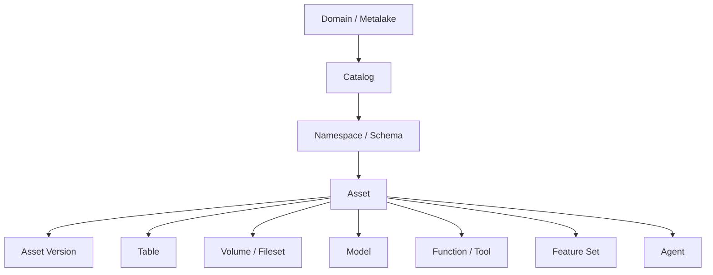
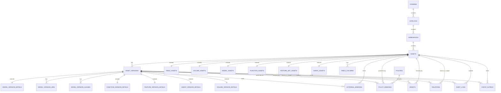

# Catalog Service 统一治理非表资产的数据模型设计方案

## 执行摘要

本文聚焦 AI 时代 Catalog Service 统一治理非表资产的数据模型设计方案。

核心结论如下：

- 如果目标是统一治理 `volume/fileset`、`model`、`function/tool`、`feature_set`、`agent` 等非表资产，仅靠对象分散建模已经不足
- 相比单纯“每个类型一张独立主表”，更推荐采用“统一公共资产表 + 类型扩展表 + 统一版本表 + 横切治理表”的设计
- Unity Catalog 更适合作为面向用户的对象目录体验参考
- Gravitino 更适合作为面向平台的统一治理抽象参考
- 推荐最终方向是：以统一 `assets` 和 `asset_versions` 为主干，通过类型扩展表表达强语义，通过 `relations / grants / policies / bindings / audit` 承接横切治理能力

推荐的对象层级可以概括为：

`domain(or metalake) -> catalog -> namespace(schema) -> asset -> asset_version`

---

## 1. 设计目标与原则

这套数据模型的目标不是简单“多支持几种对象”，而是建立一套能够长期承接非表资产治理的统一主干模型。

设计上需要同时满足：

- 统一命名与统一搜索
- 统一权限与统一审批
- 统一版本治理
- 统一关系表达
- 面向未来更多 AI-native 资产类型扩展

为此，建议遵循以下原则：

### 1.1 统一资产主线

不同类型资产首先应被纳入统一资产体系，而不应完全分散成互不相关的对象集合。

### 1.2 强语义字段结构化

类型特有且系统需要理解、校验、查询和治理的字段，应进入类型扩展表或版本扩展表，而不是全部塞入 `properties_json`。

### 1.3 版本治理统一

所有需要审批、发布、回滚和审计的对象，建议共享统一版本主表，再用类型化版本明细表承接差异。

### 1.4 关系、权限、策略单独建模

依赖关系、授权、治理策略、运行时绑定等能力，应作为横切治理对象单独建模，而不是埋在资产属性中。

---

## 2. 开源参考：Unity Catalog 与 Gravitino

## 2.1 Unity Catalog 的数据模型启发

Unity Catalog 的主要特点是：

- 采用 `metastore -> catalog -> schema -> object` 分层
- 每类对象单独建表
- 没有统一 `asset` 主表
- `registered_model + model_version` 两层结构较清晰
- `volume / function / model` 等对象对用户呈现比较成熟

其优势主要在：

- 面向用户的对象组织方式清晰
- 命名空间层级成熟
- 对象型目录体验较强

其不足主要在：

- 缺统一 `asset`
- 缺统一 `asset_version`
- 缺统一 `relations`
- 对 `feature / agent` 等 AI-native 对象支持不足

## 2.2 Gravitino 的数据模型启发

Gravitino 的主要特点是：

- 具备较强的统一抽象能力，如 `MetadataObject`、`Entity`、`SecurableObject`
- 对外虽然按对象类型暴露，但内部语义更统一
- 很多对象具有统一治理字段，如 `properties`、`auditInfo`、`currentVersion`、`lastVersion`、`deletedAt`
- 已将 `fileset / model / function / tag / policy` 等对象纳入主元数据体系

可以用一句话理解：`MetadataObject` 解决“它是什么元数据对象”，`Entity` 解决“它在系统内部怎么存和管理”，`SecurableObject` 解决“它作为资源怎么做授权”。

其优势主要在：

- 更接近统一治理平台
- 非表资产接纳方式更系统
- 统一审计、统一软删除、统一治理字段思路更成熟

其不足主要在：

- 仍然没有真正统一的 `asset` 主表
- 通用 `relations` 图层还不够强
- 对 `feature / agent` 等对象仍不完整

## 2.3 设计判断

整体上：

- Unity Catalog 更适合作为面向用户的对象目录体验参考
- Gravitino 更适合作为面向平台的统一治理抽象参考

因此，更合适的方案不是直接照抄其中任意一个，而是：

- 吸收 Unity Catalog 的对象层级与对象体验
- 吸收 Gravitino 的统一治理抽象
- 在此基础上补上统一 `asset`、统一 `asset_version`、统一 `relations`

---

## 3. 推荐的总体模型

## 3.1 推荐最终对象层级

建议采用如下统一层级：

`domain(or metalake) -> catalog -> namespace(schema) -> asset -> asset_version`

解释如下：

- `domain/metalake`
  - 组织、租户或环境边界
- `catalog`
  - 资产集合与治理空间
- `namespace/schema`
  - catalog 内进一步分组
- `asset`
  - 统一资产身份层
- `asset_version`
  - 所有需要审批、发布、回滚、别名切换的对象版本层

## 3.2 为什么采用“公共资产表 + 扩展表”模式

这里有一个关键设计选择：是“每个资产类型一张独立主表”，还是“先有统一公共资产表，再用扩展表承接类型差异”。

本方案更推荐后一种，也就是：

- 用统一 `assets` 表承接所有资产的公共字段
- 用 `table_assets`、`model_assets`、`function_assets`、`agent_assets` 等扩展表承接类型特有字段

这样设计的主要好处是：

- 统一搜索、统一权限、统一审计、统一审批更容易落地
- 资产关系图可以围绕统一 `asset_id` 构建
- 后续新增资产类型时，扩展成本更低

如果每个类型都采用独立主表，短期实现会更直接，但中长期会带来：

- 跨类型查询需要在多张对象表之间拼接
- 权限、关系、审计能力容易分散实现
- 新增资产类型时，平台能力需要重复接入

因此，本方案的取舍是：

**用统一公共资产表承接治理共性，用扩展表承接类型差异。**

## 3.3 推荐的数据模型结构

建议采用三层模型：

### 第一层：统一资产核

统一承接：

- 资产身份
- 统一命名
- 基础状态
- 审计
- 软删除
- 当前生效版本

### 第二层：类型扩展层

每类资产的强语义字段分别落入对应扩展表，例如：

- `table_assets`
- `volume_assets`
- `model_assets`
- `function_assets`
- `feature_set_assets`
- `agent_assets`

### 第三层：关系与治理横切层

把这些横切能力独立出来：

- 关系
- 策略
- 授权
- 外部绑定
- 审计日志
- 事件分发

---

## 4. 推荐核心表关系图

### 4.1 对象层级图

### 4.2 核心表关系图

其中：

- `extends` 表示“同一个对象的扩展表”
- `has` 表示“该对象下面挂了一组子对象”

---

## 5. 推荐的核心表设计

## 5.1 主层级表

### `domains`

| 字段 | 说明 |
|---|---|
| `domain_id` | domain 主键 |
| `domain_name` | domain 唯一名称 |
| `display_name` | 面向用户的展示名称 |
| `description` | domain 描述信息 |
| `owner` | 负责团队或负责人 |
| `status` | domain 当前状态 |
| `properties_json` | 低频补充属性 |
| `created_by` | 创建人 |
| `created_at` | 创建时间 |
| `updated_by` | 最近更新人 |
| `updated_at` | 最近更新时间 |

### `catalogs`

| 字段 | 说明 |
|---|---|
| `catalog_id` | catalog 主键 |
| `domain_id` | 所属 domain |
| `catalog_name` | catalog 唯一名称 |
| `display_name` | 面向用户的展示名称 |
| `description` | catalog 描述信息 |
| `catalog_type` | catalog 类型，如 lakehouse、ai_asset 等 |
| `storage_root` | 默认存储根路径 |
| `owner` | 负责团队或负责人 |
| `status` | catalog 当前状态 |
| `properties_json` | 低频补充属性 |
| `created_by` | 创建人 |
| `created_at` | 创建时间 |
| `updated_by` | 最近更新人 |
| `updated_at` | 最近更新时间 |

### `namespaces`

| 字段 | 说明 |
|---|---|
| `namespace_id` | namespace 主键 |
| `domain_id` | 所属 domain |
| `catalog_id` | 所属 catalog |
| `namespace_name` | namespace 或 schema 名称 |
| `qualified_name` | 全限定名称 |
| `display_name` | 展示名称 |
| `description` | namespace 描述信息 |
| `owner` | 负责团队或负责人 |
| `status` | namespace 当前状态 |
| `properties_json` | 低频补充属性 |
| `created_by` | 创建人 |
| `created_at` | 创建时间 |
| `updated_by` | 最近更新人 |
| `updated_at` | 最近更新时间 |

### `assets`

这是统一资产核，建议所有一等资产都先进入这张表。

| 字段 | 说明 |
|---|---|
| `asset_id` | 资产主键 |
| `domain_id` | 所属 domain |
| `catalog_id` | 所属 catalog |
| `namespace_id` | 所属 namespace |
| `asset_type` | 资产类型，如 TABLE、MODEL、AGENT 等 |
| `asset_name` | 资产名称 |
| `qualified_name` | 资产全限定名 |
| `display_name` | 面向用户的展示名称 |
| `description` | 资产描述信息 |
| `owner` | 负责团队或负责人 |
| `status` | 治理状态 |
| `lifecycle_state` | 生命周期状态 |
| `current_version_id` | 当前生效版本 ID |
| `external_id` | 外部系统中的对应 ID |
| `audit_info_json` | 审计摘要信息 |
| `deleted_at` | 软删除时间戳 |
| `tags_json` | 标签摘要信息 |
| `properties_json` | 低频补充属性 |
| `created_by` | 创建人 |
| `created_at` | 创建时间 |
| `updated_by` | 最近更新人 |
| `updated_at` | 最近更新时间 |

### `asset_versions`

所有需要治理版本的资产，共享这张版本主表。

| 字段 | 说明 |
|---|---|
| `asset_version_id` | 资产版本主键 |
| `asset_id` | 所属资产 ID |
| `version` | 版本号 |
| `version_label` | 版本别名，如 prod、champion |
| `description` | 版本说明 |
| `status` | 版本治理状态 |
| `registration_status` | 外部注册状态 |
| `change_summary` | 变更摘要 |
| `schema_snapshot_json` | 版本对应的 schema 快照 |
| `spec_snapshot_json` | 版本对应的规格定义快照 |
| `artifact_summary_json` | 版本工件摘要 |
| `approved_by` | 审批人 |
| `approved_at` | 审批时间 |
| `published_by` | 发布人 |
| `published_at` | 发布时间 |
| `created_by` | 版本创建人 |
| `created_at` | 版本创建时间 |

关于统一版本设计的取舍：

- 建议所有需要版本治理的资产进入统一 `asset_versions`
- 但不建议把所有版本细节都塞进一张通用 version 大表
- 更合理的方式是“统一版本主表 + 类型化版本明细表”

## 5.2 资产类型扩展表

### `table_assets`

| 字段 | 说明 |
|---|---|
| `asset_id` | 对应 `assets.asset_id` |
| `table_format` | 表格式，如 Iceberg、Hive 等 |
| `table_type` | 表类型，如 managed、external |
| `storage_location` | 表物理存储位置 |
| `schema_ref` | 表 schema 引用 |
| `partition_spec_json` | 分区定义 |
| `primary_keys_json` | 主键定义 |
| `snapshot_ref` | 当前快照引用 |

### `table_columns`

| 字段 | 说明 |
|---|---|
| `column_id` | 列主键 |
| `asset_id` | 所属 table 资产 ID |
| `column_name` | 列名 |
| `ordinal_position` | 列顺序 |
| `type_name` | 结构化类型名称 |
| `type_text` | 原始类型文本 |
| `nullable` | 是否允许为空 |
| `comment` | 列注释 |
| `partition_index` | 如果是分区列，对应分区顺序 |

### `volume_assets`

| 字段 | 说明 |
|---|---|
| `asset_id` | 对应 `assets.asset_id` |
| `volume_kind` | volume 类型，如 MANAGED_VOLUME、FILESET |
| `storage_provider` | 底层存储提供方 |
| `root_uri` | 根路径或根 URI |
| `access_mode` | 访问模式 |
| `default_file_format` | 默认文件格式提示 |
| `credential_policy_ref` | 凭证策略引用 |
| `retention_policy_ref` | 生命周期策略引用 |

### `model_assets`

| 字段 | 说明 |
|---|---|
| `asset_id` | 对应 `assets.asset_id` |
| `model_family` | 模型族或模型大类 |
| `task_type` | 任务类型，如 ranking、classification |
| `framework` | 使用框架 |
| `algorithm` | 算法名称 |
| `problem_type` | 问题类型，如回归、分类、召回 |
| `risk_level` | 风险等级 |
| `default_registry` | 默认外部注册中心 |
| `model_card_uri` | 模型卡文档地址 |
| `owner_team` | 所属团队 |

### `model_version_details`

| 字段 | 说明 |
|---|---|
| `asset_version_id` | 对应 `asset_versions.asset_version_id` |
| `run_id` | 训练或实验运行 ID |
| `training_job_id` | 训练任务 ID |
| `artifact_manifest_json` | 工件清单 |
| `hyperparams_json` | 超参数信息 |
| `metrics_json` | 评测指标 |
| `evaluation_summary_json` | 评测摘要 |
| `signature_json` | 输入输出签名 |
| `runtime_image` | 运行镜像 |
| `validation_report_json` | 验证报告 |

### `model_version_uris`

| 字段 | 说明 |
|---|---|
| `id` | 记录主键 |
| `asset_version_id` | 所属模型版本 ID |
| `uri_name` | URI 名称 |
| `uri_value` | URI 值 |
| `uri_type` | URI 类型，如 artifact、source、serving |

### `model_version_aliases`

| 字段 | 说明 |
|---|---|
| `id` | 记录主键 |
| `asset_version_id` | 所属模型版本 ID |
| `alias_name` | 版本别名 |
| `deleted_at` | 软删除时间戳 |

建议将 alias 独立建表，原因是 alias 往往是一对多、可切换、可查询并需要唯一约束的版本级子对象，比直接放单字段或 JSON 更适合独立管理。

### `function_assets`

| 字段 | 说明 |
|---|---|
| `asset_id` | 对应 `assets.asset_id` |
| `function_kind` | 类型，如 FUNCTION 或 TOOL |
| `language` | 实现语言 |
| `runtime_type` | 运行时类型 |
| `entrypoint` | 执行入口 |
| `deterministic` | 是否确定性执行 |
| `side_effect_level` | 副作用等级 |
| `timeout_ms` | 超时时间 |
| `resource_quota_json` | 资源配额限制 |
| `approval_required` | 是否需要审批 |

### `function_version_details`

| 字段 | 说明 |
|---|---|
| `asset_version_id` | 对应 `asset_versions.asset_version_id` |
| `definitions_json` | 定义快照 |
| `impl_uri` | 实现代码或包地址 |
| `image_uri` | 运行镜像地址 |
| `input_schema_json` | 输入契约 |
| `output_schema_json` | 输出契约 |
| `dependency_manifest_json` | 依赖清单 |
| `runtime_constraints_json` | 运行约束 |
| `release_notes` | 发布说明 |

### `feature_set_assets`

首期建议先做 `FEATURE_SET` 资产，而不是一开始就把单个 feature 独立成一级对象。

这样设计的主要原因是：

- 真实场景中，特征通常以“特征集”而不是“单个特征”被共同生产、共同服务和共同消费
- 实体键、来源、刷新策略、质量规则、新鲜度 SLA 等治理字段，通常天然属于 feature set 级别
- 如果首期就把单个 feature 提升为一级资产，资产数量和关系数量会快速膨胀，增加治理复杂度
- 先以 `FEATURE_SET` 作为一等资产，更符合首期统一治理“特征生产与服务单元”的目标

| 字段 | 说明 |
|---|---|
| `asset_id` | 对应 `assets.asset_id` |
| `entity_keys_json` | 实体键定义 |
| `source_type` | 来源类型，如 batch、stream、table |
| `source_definition` | 来源定义 |
| `update_mode` | 更新模式 |
| `freshness_sla` | 新鲜度 SLA |
| `quality_policy_ref` | 质量策略引用 |
| `serving_binding_ref` | 服务绑定引用 |
| `owner_team` | 所属团队 |

### `feature_version_details`

| 字段 | 说明 |
|---|---|
| `asset_version_id` | 对应 `asset_versions.asset_version_id` |
| `feature_schema_json` | 特征 schema 快照 |
| `feature_definitions_json` | 特征定义快照 |
| `transformation_logic_json` | 转换逻辑定义 |
| `validation_report_json` | 验证报告 |
| `materialization_ref` | 物化对象引用 |
| `serving_contract_json` | 服务契约定义 |

### `agent_assets`

| 字段 | 说明 |
|---|---|
| `asset_id` | 对应 `assets.asset_id` |
| `agent_type` | Agent 类型 |
| `goal` | Agent 目标描述 |
| `risk_level` | 风险等级 |
| `runtime_binding_ref` | 运行时绑定引用 |
| `approval_policy_ref` | 审批策略引用 |
| `memory_policy_ref` | 记忆策略引用 |
| `interaction_mode` | 交互模式 |
| `owner_team` | 所属团队 |

### `agent_version_details`

| 字段 | 说明 |
|---|---|
| `asset_version_id` | 对应 `asset_versions.asset_version_id` |
| `spec_snapshot_json` | Agent 规格定义快照 |
| `system_prompt_uri` | 系统提示词地址 |
| `workflow_graph_json` | 工作流定义 |
| `guardrail_config_json` | 护栏配置 |
| `runtime_config_json` | 运行配置 |
| `evaluation_report_json` | 评测报告 |

## 5.3 横切治理表

### `relations`

| 字段 | 说明 |
|---|---|
| `relation_id` | 关系主键 |
| `relation_type` | 关系类型 |
| `source_asset_id` | 源资产 ID |
| `source_asset_version_id` | 源资产版本 ID，可为空 |
| `target_asset_id` | 目标资产 ID |
| `target_asset_version_id` | 目标资产版本 ID，可为空 |
| `properties_json` | 关系补充属性 |
| `created_by` | 关系创建人 |
| `created_at` | 关系创建时间 |

常见关系类型包括：

- `DEPENDS_ON`
- `USES`
- `DERIVED_FROM`
- `BOUND_TO`
- `PRODUCES`
- `SERVES`
- `READS`
- `WRITES`

### `external_bindings`

| 字段 | 说明 |
|---|---|
| `binding_id` | 绑定记录主键 |
| `asset_id` | 对应资产 ID |
| `asset_version_id` | 对应资产版本 ID，可为空 |
| `binding_type` | 绑定类型，如 runtime、registry、serving |
| `target_system` | 外部目标系统名称 |
| `target_uri` | 外部目标地址 |
| `credential_ref` | 凭证引用 |
| `status` | 绑定状态 |
| `last_sync_at` | 最近同步时间 |
| `properties_json` | 绑定补充属性 |

### `policies`

| 字段 | 说明 |
|---|---|
| `policy_id` | 策略主键 |
| `policy_type` | 策略类型 |
| `policy_name` | 策略名称 |
| `description` | 策略描述 |
| `policy_spec_json` | 策略定义内容 |
| `status` | 策略状态 |
| `created_by` | 创建人 |
| `created_at` | 创建时间 |
| `updated_by` | 最近更新人 |
| `updated_at` | 最近更新时间 |

### `policy_bindings`

| 字段 | 说明 |
|---|---|
| `policy_binding_id` | 策略绑定主键 |
| `policy_id` | 对应策略 ID |
| `resource_type` | 资源类型 |
| `resource_id` | 资源 ID |
| `version_scope` | 策略作用范围 |
| `priority` | 优先级 |
| `created_at` | 绑定创建时间 |

### `grants`

| 字段 | 说明 |
|---|---|
| `grant_id` | 授权记录主键 |
| `principal_type` | 主体类型，如 USER、GROUP、ROLE |
| `principal_id` | 主体 ID |
| `resource_type` | 资源类型 |
| `resource_id` | 资源 ID |
| `action` | 权限动作 |
| `effect` | 生效方式，如 ALLOW、DENY |
| `condition_json` | 条件表达式 |
| `expires_at` | 过期时间 |
| `created_by` | 创建人 |
| `created_at` | 创建时间 |

### `audit_logs`

| 字段 | 说明 |
|---|---|
| `audit_id` | 审计事件主键 |
| `actor` | 操作者 |
| `action` | 操作动作 |
| `resource_type` | 资源类型 |
| `resource_id` | 资源 ID |
| `resource_version_id` | 资源版本 ID，可为空 |
| `request_id` | 请求链路 ID |
| `result` | 操作结果 |
| `details_json` | 审计细节 |
| `timestamp` | 发生时间 |

### `event_outbox`

| 字段 | 说明 |
|---|---|
| `event_id` | 事件主键 |
| `event_type` | 事件类型 |
| `resource_type` | 资源类型 |
| `resource_id` | 资源 ID |
| `resource_version_id` | 资源版本 ID，可为空 |
| `payload_json` | 事件负载内容 |
| `status` | 分发状态 |
| `created_at` | 事件创建时间 |

---

## 6. 字段放置标准与 `properties_json` 策略

## 6.1 总体原则

核心判断是：

**系统需要理解并依赖它，就结构化；系统只需要存一下、展示一下，就放 `properties_json`。**

以下字段通常不适合放入 `properties_json`：

- 会被高频查询、筛选、排序的字段
- 会参与权限、审批、发布、生命周期流转的字段
- 会被 API、前端或下游系统稳定依赖的字段
- 需要强类型校验的字段
- 需要被关系、血缘、binding 引用的字段

## 6.2 各表 `properties_json` 推荐承载内容

### `assets.properties_json`

推荐放：

- `business_alias`
- `wiki_url`
- `notebook_url`
- `slack_channel`
- `migration_note`
- `demo_link`

### `model_assets.properties_json`

推荐放：

- `paper_url`
- `benchmark_note`
- 业务背景说明
- 演示链接

### `function_assets.properties_json`

推荐放：

- 使用示例
- 开发者备注
- 演示调用链接

### `feature_set_assets.properties_json`

推荐放：

- 业务场景说明
- 特征使用建议
- 示例消费者列表

### `agent_assets.properties_json`

推荐放：

- `persona_style`
- 示例问法
- 对外展示文案
- 业务说明链接

### `relations.properties_json`

推荐放：

- 关系备注
- 关系来源说明
- 置信度

### `external_bindings.properties_json`

推荐放：

- 同步备注
- 外部映射补充说明
- 非关键展示属性

对于 `asset_versions`、`model_version_details`、`function_version_details`、`feature_version_details`、`agent_version_details` 上的 JSON 字段，建议优先承载版本快照、展示型备注和补充上下文；凡是系统需要理解和校验的强语义字段，仍应优先结构化建模。

---

## 7. 模型完整性与后续扩展性评估

整体上，这版数据模型已经具备较高完整性，能够覆盖统一治理非表资产所需的核心骨架，主要包括：

- 组织层：`domain / catalog / namespace`
- 统一资产层：`assets`
- 统一版本层：`asset_versions`
- 类型扩展层：`table / volume / model / function / feature_set / agent`
- 横切治理层：`relations / grants / policies / external_bindings / audit_logs / event_outbox`

从一期建设角度看，这套模型已经能够支撑：

- 统一资产发现
- 统一权限和审批
- 统一版本治理
- 统一关系表达
- 统一审计与事件分发

从后续扩展性看，这套模型也具备较好的延展能力，主要原因在于：

- 已有统一 `assets` 主表，后续新增资产类型时不需要重做主干
- 已有统一 `asset_versions`，后续新增可版本化对象时可直接复用
- 类型扩展表与横切治理表职责清晰，便于增量扩展
- `relations` 预留了较强的跨类型依赖表达能力

因此，后续如果增加 `prompt`、`workflow`、`evaluation`、`dataset`、`memory`、`resource` 等 AI-native 资产类型，整体仍然可以在现有主模型上继续扩展，而不需要推倒重来。

同时也需要说明，这一版更适合作为 V1 主干模型，而不是最终终局模型。后续仍可逐步增强的方向包括：

- `principal / role / group` 等主体模型
- `tag` 等标签治理模型
- `run` 等运行态对象模型
- 更大规模关系查询场景下的图能力增强
- 搜索索引与检索投影层

---

## 8. 推荐演进路径

建议分阶段演进，而不是一次性做成大而全系统。

### 阶段一：统一资产核

先落：

- `domains`
- `catalogs`
- `namespaces`
- `assets`
- `asset_versions`

并先纳入：

- `table`
- `volume`
- `model`
- `function`

### 阶段二：补齐横切治理能力

增加：

- `relations`
- `external_bindings`
- `policies`
- `policy_bindings`
- `grants`
- `audit_logs`
- `event_outbox`

### 阶段三：引入 AI-native 对象

纳入：

- `feature_set`
- `agent`

并逐步完善：

- 质量治理
- 评测治理
- 风险治理
- 运行时绑定

### 阶段四：增强搜索与图谱能力

在统一对象核之上，扩展：

- 资产搜索
- 依赖图谱
- 影响分析
- 变更推荐
- Agent 依赖审计

---

## 9. 结论

如果目标是 AI 时代统一治理非表资产的 Catalog Service，那么更合适的数据模型方向不是继续围绕“多对象分散建表”演进，而是建立统一资产主干模型。

这一主干模型应具备以下特征：

- 用统一 `assets` 承接身份、命名、状态、审计和软删除
- 用统一 `asset_versions` 承接版本治理
- 用类型扩展表承接不同资产的强语义
- 用 `relations / grants / policies / bindings / audit` 承接横切治理能力

一句话总结：

**以统一资产核为中心，以类型扩展表承载强语义，以统一关系层串起数据、模型、工具和 Agent 的完整治理链路。**
