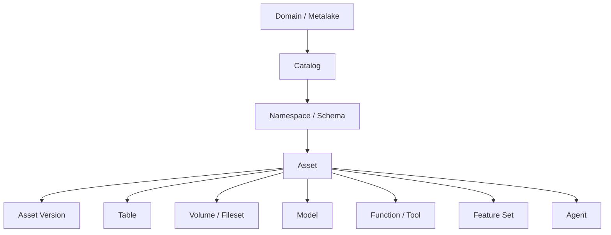
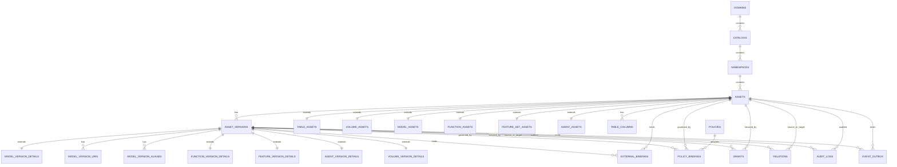
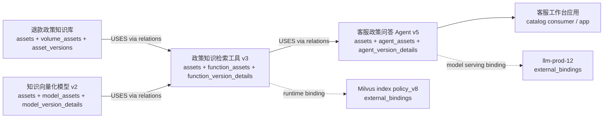
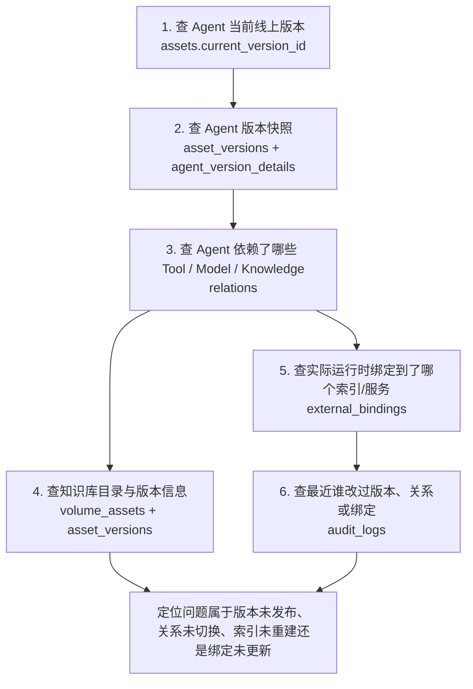

# Catalog Service 统一治理非表资产的数据模型设计方案

## 执行摘要

本文聚焦 AI 时代 Catalog Service 统一治理非表资产的数据模型设计方案。

核心结论如下：

- 如果目标是统一治理 `volume/fileset`、`model`、`function/tool`、`feature_set`、`agent` 等非表资产，仅靠对象分散建模已经不足
- 相比单纯“每个类型一张独立主表”，更推荐采用“统一公共资产表 + 类型扩展表 + 统一版本表 + 横切治理表”的设计
- Unity Catalog 更适合作为面向用户的对象目录体验参考
- Gravitino 更适合作为面向平台的统一治理抽象参考
- 推荐最终方向是：以统一 `assets` 和 `asset_versions` 为主干，通过类型扩展表表达强语义，通过 `relations / grants / policies / bindings / audit` 承接横切治理能力

推荐的对象层级可以概括为：

`domain(or metalake) -> catalog -> namespace(schema) -> asset -> asset_version`

---

## 1. 设计目标与原则

这套数据模型的目标不是简单“多支持几种对象”，而是建立一套能够长期承接非表资产治理的统一主干模型。

设计上需要同时满足：

- 统一命名与统一搜索
- 统一权限与统一审批
- 统一版本治理
- 统一关系表达
- 面向未来更多 AI-native 资产类型扩展

为此，建议遵循以下原则：

### 1.1 统一资产主线

不同类型资产首先应被纳入统一资产体系，而不应完全分散成互不相关的对象集合。

### 1.2 强语义字段结构化

类型特有且系统需要理解、校验、查询和治理的字段，应进入类型扩展表或版本扩展表，而不是全部塞入 `properties_json`。

### 1.3 版本治理统一

所有需要审批、发布、回滚和审计的对象，建议共享统一版本主表，再用类型化版本明细表承接差异。

### 1.4 关系、权限、策略单独建模

依赖关系、授权、治理策略、运行时绑定等能力，应作为横切治理对象单独建模，而不是埋在资产属性中。

---

## 2. 开源参考：Unity Catalog 与 Gravitino

## 2.1 Unity Catalog 的数据模型启发

Unity Catalog 的主要特点是：

- 采用 `metastore -> catalog -> schema -> object` 分层
- 每类对象单独建表
- 没有统一 `asset` 主表
- `registered_model + model_version` 两层结构较清晰
- `volume / function / model` 等对象对用户呈现比较成熟

其优势主要在：

- 面向用户的对象组织方式清晰
- 命名空间层级成熟
- 对象型目录体验较强

其不足主要在：

- 缺统一 `asset`
- 缺统一 `asset_version`
- 缺统一 `relations`
- 对 `feature / agent` 等 AI-native 对象支持不足

## 2.2 Gravitino 的数据模型启发

Gravitino 的主要特点是：

- 具备较强的统一抽象能力，如 `MetadataObject`、`Entity`、`SecurableObject`
- 对外虽然按对象类型暴露，但内部语义更统一
- 很多对象具有统一治理字段，如 `properties`、`auditInfo`、`currentVersion`、`lastVersion`、`deletedAt`
- 已将 `fileset / model / function / tag / policy` 等对象纳入主元数据体系

可以用一句话理解：`MetadataObject` 解决“它是什么元数据对象”，`Entity` 解决“它在系统内部怎么存和管理”，`SecurableObject` 解决“它作为资源怎么做授权”。

其优势主要在：

- 更接近统一治理平台
- 非表资产接纳方式更系统
- 统一审计、统一软删除、统一治理字段思路更成熟

其不足主要在：

- 仍然没有真正统一的 `asset` 主表
- 通用 `relations` 图层还不够强
- 对 `feature / agent` 等对象仍不完整

## 2.3 设计判断

整体上：

- Unity Catalog 更适合作为面向用户的对象目录体验参考
- Gravitino 更适合作为面向平台的统一治理抽象参考

因此，更合适的方案不是直接照抄其中任意一个，而是：

- 吸收 Unity Catalog 的对象层级与对象体验
- 吸收 Gravitino 的统一治理抽象
- 在此基础上补上统一 `asset`、统一 `asset_version`、统一 `relations`

---

## 3. 推荐的总体模型

## 3.1 推荐最终对象层级

建议采用如下统一层级：

`domain(or metalake) -> catalog -> namespace(schema) -> asset -> asset_version`

解释如下：

- `domain/metalake`
  - 组织、租户或环境边界
- `catalog`
  - 资产集合与治理空间
- `namespace/schema`
  - catalog 内进一步分组
- `asset`
  - 统一资产身份层
- `asset_version`
  - 所有需要审批、发布、回滚、别名切换的对象版本层

## 3.2 为什么采用“公共资产表 + 扩展表”模式

这里有一个关键设计选择：是“每个资产类型一张独立主表”，还是“先有统一公共资产表，再用扩展表承接类型差异”。

本方案更推荐后一种，也就是：

- 用统一 `assets` 表承接所有资产的公共字段
- 用 `table_assets`、`model_assets`、`function_assets`、`agent_assets` 等扩展表承接类型特有字段

这样设计的主要好处是：

- 统一搜索、统一权限、统一审计、统一审批更容易落地
- 资产关系图可以围绕统一 `asset_id` 构建
- 后续新增资产类型时，扩展成本更低

如果每个类型都采用独立主表，短期实现会更直接，但中长期会带来：

- 跨类型查询需要在多张对象表之间拼接
- 权限、关系、审计能力容易分散实现
- 新增资产类型时，平台能力需要重复接入

因此，本方案的取舍是：

**用统一公共资产表承接治理共性，用扩展表承接类型差异。**

## 3.3 推荐的数据模型结构

建议采用三层模型：

### 第一层：统一资产核

统一承接：

- 资产身份
- 统一命名
- 基础状态
- 审计
- 软删除
- 当前生效版本

### 第二层：类型扩展层

每类资产的强语义字段分别落入对应扩展表，例如：

- `table_assets`
- `volume_assets`
- `model_assets`
- `function_assets`
- `feature_set_assets`
- `agent_assets`

### 第三层：关系与治理横切层

把这些横切能力独立出来：

- 关系
- 策略
- 授权
- 外部绑定
- 审计日志
- 事件分发

### 3.4 为什么要把关系与治理横切层单独分一层

之所以把“关系与治理横切层”单独分出来，核心原因是：这部分能力管理的不是某一种资产自己的属性，而是跨所有资产类型复用的共性治理能力。

如果不单独分层，而是把这些能力分别埋进 `table / volume / model / function / feature_set / agent` 各自的资产表里，短期看实现似乎更直接，但中长期会导致关系表达分散、治理口径不一致、查询复杂度上升，以及新资产类型接入成本过高。

#### 3.4.1 关系天然是跨资产的，不属于某个资产自己

例如：

- 模型依赖特征集
- Agent 使用 Tool
- Tool 读取知识库
- 特征集来源于表
- 模型服务绑定到某个外部 endpoint

这些都不是 `model_assets` 或 `agent_assets` 自己的内部字段，而是“资产与资产之间的一条边”。  
因此更适合单独抽象为 `relations`，而不是在每一类资产表中各自维护上游下游字段。

#### 3.4.2 治理能力也是跨资产复用的，不应每类资产各实现一套

以下能力对表、模型、Tool、Feature Set、Agent 都成立：

- 授权
- 审批
- 策略绑定
- 外部绑定
- 审计
- 事件通知

如果不单独抽层，很容易演变成：

- 表有一套授权实现
- 模型有一套权限和发布实现
- Agent 有一套审批实现
- Tool 再有一套审计实现

这种方式短期灵活，但长期会导致：

- 概念口径不统一
- 平台能力重复建设
- 前后端查询接口难统一
- 新资产类型接入时需要重复对接一遍治理能力

#### 3.4.3 资产层管“点”，横切层管“边”和“控制面”

这套模型里有一个关键设计思想：

- `assets / asset_versions / *_assets / *_version_details` 管“点”
- `relations / grants / policies / bindings / audit_logs / event_outbox` 管“边”和“控制面”

也就是说：

- 资产层回答“它是什么对象”
- 关系层回答“它和谁有关”
- 治理层回答“它受什么控制”
- 审计层回答“它发生过什么”

把这些职责拆开后，模型边界更清晰，也更容易支撑平台级查询和演进。

#### 3.4.4 真实业务查询本身就是横切查询

真实场景下，经常需要回答的问题并不是“某个模型自己的字段值是什么”，而是：

- 哪些 Agent 依赖这个模型
- 哪些模型使用了这个特征集
- 哪些资产绑定了这个 serving endpoint
- 哪些资产挂载了某个风险策略
- 最近谁改了关系、策略或权限配置

这些查询本质上都要跨资产类型。如果没有单独的横切治理层，就会退化为扫描多张业务表、拼接多份 JSON，甚至依赖应用层特判逻辑，复杂度会迅速上升。

#### 3.4.5 横切层能显著降低新资产类型的接入成本

今天纳入 Catalog 的非表资产类型可能包括：

- `volume/fileset`
- `model`
- `function/tool`
- `feature_set`
- `agent`

未来很可能继续扩展到：

- `prompt`
- `workflow`
- `evaluation`
- `dataset`
- `memory`
- `resource`

如果关系和治理能力都嵌入每一类资产表，那么每新增一种资产类型，就需要重新补一遍：

- 依赖关系表达
- 权限模型
- 策略绑定
- 审计记录
- 事件通知

但如果横切层已经独立，只要新对象先接入统一 `asset_id`，就能自动复用：

- `relations`
- `grants`
- `policies`
- `policy_bindings`
- `external_bindings`
- `audit_logs`
- `event_outbox`

这会显著降低 AI-native 新资产类型的演进成本。

#### 3.4.6 以血缘为例，单独建横切层更容易支撑图查询

如果不单独抽象横切层，很容易把关系字段直接埋进资产表，例如：

- `model_assets.upstream_feature_ids`
- `agent_assets.tool_ids`
- `feature_set_assets.source_table_ids`

这种方式在最初看起来简单，但很快会出现问题：

- 关系类型不统一
- 多对多关系难管理
- 版本级依赖难表达
- 多跳遍历和影响分析难实现
- 新资产类型加入后又要增加新的关系字段

而把关系统一抽到 `relations` 后，就可以统一表达：

- `MODEL_VERSION USES FEATURE_SET_VERSION`
- `AGENT_VERSION USES TOOL_VERSION`
- `FEATURE_SET DERIVED_FROM TABLE`
- `TOOL READS VOLUME`

这样系统才能真正把资产依赖看成一张图，并进一步支撑：

- 上游下游遍历
- 影响分析
- 变更回溯
- 风险评估
- Agent 依赖审计

---

## 4. 推荐核心表关系图

### 4.1 对象层级图

### 4.2 核心表关系图

其中：

- `extends` 表示“同一个对象的扩展表”
- `has` 表示“该对象下面挂了一组子对象”

---

## 5. 推荐的核心表设计

## 5.1 主层级表

### `domains`

`domains` 用来表达最上层的组织或治理边界。  
它通常对应租户、业务域、环境边界或 metalake 级别的隔离单元，用来承接资产分区、owner 边界和治理范围。

| 字段 | 说明 |
|---|---|
| `domain_id` | domain 主键 |
| `domain_name` | domain 唯一名称 |
| `display_name` | 面向用户的展示名称 |
| `description` | domain 描述信息 |
| `owner` | 负责团队或负责人 |
| `status` | domain 当前状态 |
| `properties_json` | 低频补充属性 |
| `created_by` | 创建人 |
| `created_at` | 创建时间 |
| `updated_by` | 最近更新人 |
| `updated_at` | 最近更新时间 |

### `catalogs`

`catalogs` 用来表达某一类资产集合及其治理空间。  
它位于 domain 之下，承接更具体的资产分类、默认存储根以及面向用户的目录组织方式。

| 字段 | 说明 |
|---|---|
| `catalog_id` | catalog 主键 |
| `domain_id` | 所属 domain |
| `catalog_name` | catalog 唯一名称 |
| `display_name` | 面向用户的展示名称 |
| `description` | catalog 描述信息 |
| `catalog_type` | catalog 类型，如 lakehouse、ai_asset 等 |
| `storage_root` | 默认存储根路径 |
| `owner` | 负责团队或负责人 |
| `status` | catalog 当前状态 |
| `properties_json` | 低频补充属性 |
| `created_by` | 创建人 |
| `created_at` | 创建时间 |
| `updated_by` | 最近更新人 |
| `updated_at` | 最近更新时间 |

### `namespaces`

`namespaces` 用来表达 catalog 内部的进一步分组单元。  
它通常对应 schema、项目空间、团队空间或主题分区，是资产进入统一命名空间体系前的最后一层目录。

| 字段 | 说明 |
|---|---|
| `namespace_id` | namespace 主键 |
| `domain_id` | 所属 domain |
| `catalog_id` | 所属 catalog |
| `namespace_name` | namespace 或 schema 名称 |
| `qualified_name` | 全限定名称 |
| `display_name` | 展示名称 |
| `description` | namespace 描述信息 |
| `owner` | 负责团队或负责人 |
| `status` | namespace 当前状态 |
| `properties_json` | 低频补充属性 |
| `created_by` | 创建人 |
| `created_at` | 创建时间 |
| `updated_by` | 最近更新人 |
| `updated_at` | 最近更新时间 |

### `assets`

这是统一资产核，建议所有一等资产都先进入这张表。

它承接的是所有资产类型共享的公共身份信息，例如名称、类型、owner、状态、当前生效版本和基础审计字段，是整套模型的统一入口。

| 字段 | 说明 |
|---|---|
| `asset_id` | 资产主键 |
| `domain_id` | 所属 domain |
| `catalog_id` | 所属 catalog |
| `namespace_id` | 所属 namespace |
| `asset_type` | 资产类型，如 TABLE、MODEL、AGENT 等 |
| `asset_name` | 资产名称 |
| `qualified_name` | 资产全限定名 |
| `display_name` | 面向用户的展示名称 |
| `description` | 资产描述信息 |
| `owner` | 负责团队或负责人 |
| `status` | 治理状态 |
| `lifecycle_state` | 生命周期状态 |
| `current_version_id` | 当前生效版本 ID |
| `external_id` | 外部系统中的对应 ID |
| `audit_info_json` | 审计摘要信息 |
| `deleted_at` | 软删除时间戳 |
| `tags_json` | 标签摘要信息 |
| `properties_json` | 低频补充属性 |
| `created_by` | 创建人 |
| `created_at` | 创建时间 |
| `updated_by` | 最近更新人 |
| `updated_at` | 最近更新时间 |

### `asset_versions`

所有需要治理版本的资产，共享这张版本主表。

它承接的是版本级治理能力，例如审批、发布、回滚、版本说明和快照信息，使不同资产类型可以复用统一版本生命周期。

| 字段 | 说明 |
|---|---|
| `asset_version_id` | 资产版本主键 |
| `asset_id` | 所属资产 ID |
| `version` | 版本号 |
| `version_label` | 版本别名，如 prod、champion |
| `description` | 版本说明 |
| `status` | 版本治理状态 |
| `registration_status` | 外部注册状态 |
| `change_summary` | 变更摘要 |
| `schema_snapshot_json` | 版本对应的 schema 快照 |
| `spec_snapshot_json` | 版本对应的规格定义快照 |
| `artifact_summary_json` | 版本工件摘要 |
| `approved_by` | 审批人 |
| `approved_at` | 审批时间 |
| `published_by` | 发布人 |
| `published_at` | 发布时间 |
| `created_by` | 版本创建人 |
| `created_at` | 版本创建时间 |

关于统一版本设计的取舍：

- 建议所有需要版本治理的资产进入统一 `asset_versions`
- 但不建议把所有版本细节都塞进一张通用 version 大表
- 更合理的方式是“统一版本主表 + 类型化版本明细表”

## 5.2 资产类型扩展表

### `table_assets`

`table_assets` 用来承接表资产的类型特有字段。  
它补充的是表格式、表类型、物理存储位置、分区定义、主键定义和快照引用等结构化表语义。

| 字段 | 说明 |
|---|---|
| `asset_id` | 对应 `assets.asset_id` |
| `table_format` | 表格式，如 Iceberg、Hive 等 |
| `table_type` | 表类型，如 managed、external |
| `storage_location` | 表物理存储位置 |
| `schema_ref` | 表 schema 引用 |
| `partition_spec_json` | 分区定义 |
| `primary_keys_json` | 主键定义 |
| `snapshot_ref` | 当前快照引用 |

### `table_columns`

`table_columns` 用来表达表资产下的列级明细。  
它承接的是字段名称、顺序、类型、可空性、注释和分区列信息，方便做 schema 展示、字段搜索和列级治理扩展。

| 字段 | 说明 |
|---|---|
| `column_id` | 列主键 |
| `asset_id` | 所属 table 资产 ID |
| `column_name` | 列名 |
| `ordinal_position` | 列顺序 |
| `type_name` | 结构化类型名称 |
| `type_text` | 原始类型文本 |
| `nullable` | 是否允许为空 |
| `comment` | 列注释 |
| `partition_index` | 如果是分区列，对应分区顺序 |

### `volume_assets`

`volume_assets` 用来承接文件型资产或路径型资产的扩展信息。  
它适合表示知识库目录、训练数据目录、评测集目录、模型工件目录等对象，重点描述根路径、访问模式和生命周期策略。

| 字段 | 说明 |
|---|---|
| `asset_id` | 对应 `assets.asset_id` |
| `volume_kind` | volume 类型，如 MANAGED_VOLUME、FILESET |
| `storage_provider` | 底层存储提供方 |
| `root_uri` | 根路径或根 URI |
| `access_mode` | 访问模式 |
| `default_file_format` | 默认文件格式提示 |
| `credential_policy_ref` | 凭证策略引用 |
| `retention_policy_ref` | 生命周期策略引用 |

### `model_assets`

`model_assets` 用来承接模型资产的稳定属性。  
它描述的是模型家族、任务类型、框架、算法、风险等级、默认注册中心和模型卡等版本无关或低频变化信息。

| 字段 | 说明 |
|---|---|
| `asset_id` | 对应 `assets.asset_id` |
| `model_family` | 模型族或模型大类 |
| `task_type` | 任务类型，如 ranking、classification |
| `framework` | 使用框架 |
| `algorithm` | 算法名称 |
| `problem_type` | 问题类型，如回归、分类、召回 |
| `risk_level` | 风险等级 |
| `default_registry` | 默认外部注册中心 |
| `model_card_uri` | 模型卡文档地址 |
| `owner_team` | 所属团队 |

### `model_version_details`

`model_version_details` 用来承接模型某个具体版本的运行与评测细节。  
它重点描述训练任务、工件清单、超参数、评测指标、输入输出签名、运行镜像和验证报告等版本级信息。

| 字段 | 说明 |
|---|---|
| `asset_version_id` | 对应 `asset_versions.asset_version_id` |
| `run_id` | 训练或实验运行 ID |
| `training_job_id` | 训练任务 ID |
| `artifact_manifest_json` | 工件清单 |
| `hyperparams_json` | 超参数信息 |
| `metrics_json` | 评测指标 |
| `evaluation_summary_json` | 评测摘要 |
| `signature_json` | 输入输出签名 |
| `runtime_image` | 运行镜像 |
| `validation_report_json` | 验证报告 |

### `model_version_uris`

`model_version_uris` 用来记录模型版本关联的多个地址。  
它适合承接 artifact、source、serving 等不同用途的 URI，避免把多种地址混在一个字段或 JSON 中。

| 字段 | 说明 |
|---|---|
| `id` | 记录主键 |
| `asset_version_id` | 所属模型版本 ID |
| `uri_name` | URI 名称 |
| `uri_value` | URI 值 |
| `uri_type` | URI 类型，如 artifact、source、serving |

### `model_version_aliases`

`model_version_aliases` 用来管理模型版本的别名映射。  
它适合表达 `prod`、`champion`、`canary` 这类可切换、可查询、需要唯一约束的版本标签。

| 字段 | 说明 |
|---|---|
| `id` | 记录主键 |
| `asset_version_id` | 所属模型版本 ID |
| `alias_name` | 版本别名 |
| `deleted_at` | 软删除时间戳 |

建议将 alias 独立建表，原因是 alias 往往是一对多、可切换、可查询并需要唯一约束的版本级子对象，比直接放单字段或 JSON 更适合独立管理。

### `function_assets`

`function_assets` 用来承接函数或工具资产的稳定属性。  
它重点描述语言、运行时类型、入口点、确定性、副作用等级、资源配额和是否需要审批等可执行能力信息。

| 字段 | 说明 |
|---|---|
| `asset_id` | 对应 `assets.asset_id` |
| `function_kind` | 类型，如 FUNCTION 或 TOOL |
| `language` | 实现语言 |
| `runtime_type` | 运行时类型 |
| `entrypoint` | 执行入口 |
| `deterministic` | 是否确定性执行 |
| `side_effect_level` | 副作用等级 |
| `timeout_ms` | 超时时间 |
| `resource_quota_json` | 资源配额限制 |
| `approval_required` | 是否需要审批 |

### `function_version_details`

`function_version_details` 用来承接函数或工具某个版本的实现快照。  
它描述的是代码包或镜像地址、输入输出契约、依赖清单、运行约束和版本发布说明。

| 字段 | 说明 |
|---|---|
| `asset_version_id` | 对应 `asset_versions.asset_version_id` |
| `definitions_json` | 定义快照 |
| `impl_uri` | 实现代码或包地址 |
| `image_uri` | 运行镜像地址 |
| `input_schema_json` | 输入契约 |
| `output_schema_json` | 输出契约 |
| `dependency_manifest_json` | 依赖清单 |
| `runtime_constraints_json` | 运行约束 |
| `release_notes` | 发布说明 |

### `feature_set_assets`

首期建议先做 `FEATURE_SET` 资产，而不是一开始就把单个 feature 独立成一级对象。

这样设计的主要原因是：

- 真实场景中，特征通常以“特征集”而不是“单个特征”被共同生产、共同服务和共同消费
- 实体键、来源、刷新策略、质量规则、新鲜度 SLA 等治理字段，通常天然属于 feature set 级别
- 如果首期就把单个 feature 提升为一级资产，资产数量和关系数量会快速膨胀，增加治理复杂度
- 先以 `FEATURE_SET` 作为一等资产，更符合首期统一治理“特征生产与服务单元”的目标

| 字段 | 说明 |
|---|---|
| `asset_id` | 对应 `assets.asset_id` |
| `entity_keys_json` | 实体键定义 |
| `source_type` | 来源类型，如 batch、stream、table |
| `source_definition` | 来源定义 |
| `update_mode` | 更新模式 |
| `freshness_sla` | 新鲜度 SLA |
| `quality_policy_ref` | 质量策略引用 |
| `serving_binding_ref` | 服务绑定引用 |
| `owner_team` | 所属团队 |

### `feature_version_details`

`feature_version_details` 用来承接特征集某个版本的定义快照。  
它重点描述特征 schema、特征定义、转换逻辑、验证报告、物化引用和服务契约等版本级信息。

| 字段 | 说明 |
|---|---|
| `asset_version_id` | 对应 `asset_versions.asset_version_id` |
| `feature_schema_json` | 特征 schema 快照 |
| `feature_definitions_json` | 特征定义快照 |
| `transformation_logic_json` | 转换逻辑定义 |
| `validation_report_json` | 验证报告 |
| `materialization_ref` | 物化对象引用 |
| `serving_contract_json` | 服务契约定义 |

### `agent_assets`

`agent_assets` 用来承接 Agent 资产的稳定属性。  
它描述的是 Agent 类型、目标、风险等级、运行时绑定引用、审批策略、记忆策略和交互模式等治理信息。

| 字段 | 说明 |
|---|---|
| `asset_id` | 对应 `assets.asset_id` |
| `agent_type` | Agent 类型 |
| `goal` | Agent 目标描述 |
| `risk_level` | 风险等级 |
| `runtime_binding_ref` | 运行时绑定引用 |
| `approval_policy_ref` | 审批策略引用 |
| `memory_policy_ref` | 记忆策略引用 |
| `interaction_mode` | 交互模式 |
| `owner_team` | 所属团队 |

### `agent_version_details`

`agent_version_details` 用来承接 Agent 某个版本的运行定义快照。  
它重点描述系统提示词地址、工作流图、护栏配置、运行时配置和评测报告等版本级配置。

| 字段 | 说明 |
|---|---|
| `asset_version_id` | 对应 `asset_versions.asset_version_id` |
| `spec_snapshot_json` | Agent 规格定义快照 |
| `system_prompt_uri` | 系统提示词地址 |
| `workflow_graph_json` | 工作流定义 |
| `guardrail_config_json` | 护栏配置 |
| `runtime_config_json` | 运行配置 |
| `evaluation_report_json` | 评测报告 |

## 5.3 横切治理表

### `relations`

`relations` 用来表达资产与资产之间的依赖关系和血缘关系。  
它承接的是跨资产、跨类型、可多跳遍历的关系边，例如依赖、使用、产出、读取、写入和服务关系。

| 字段 | 说明 |
|---|---|
| `relation_id` | 关系主键 |
| `relation_type` | 关系类型 |
| `source_asset_id` | 源资产 ID |
| `source_asset_version_id` | 源资产版本 ID，可为空 |
| `target_asset_id` | 目标资产 ID |
| `target_asset_version_id` | 目标资产版本 ID，可为空 |
| `properties_json` | 关系补充属性 |
| `created_by` | 关系创建人 |
| `created_at` | 关系创建时间 |

常见关系类型包括：

- `DEPENDS_ON`
- `USES`
- `DERIVED_FROM`
- `BOUND_TO`
- `PRODUCES`
- `SERVES`
- `READS`
- `WRITES`

### `external_bindings`

`external_bindings` 用来表达资产或版本与外部系统实例之间的绑定关系。  
它重点回答“这个资产版本实际跑在哪个 registry、runtime、serving endpoint、向量索引或外部存储实例上”。

| 字段 | 说明 |
|---|---|
| `binding_id` | 绑定记录主键 |
| `asset_id` | 对应资产 ID |
| `asset_version_id` | 对应资产版本 ID，可为空 |
| `binding_type` | 绑定类型，如 runtime、registry、serving |
| `target_system` | 外部目标系统名称 |
| `target_uri` | 外部目标地址 |
| `credential_ref` | 凭证引用 |
| `status` | 绑定状态 |
| `last_sync_at` | 最近同步时间 |
| `properties_json` | 绑定补充属性 |

### `policies`

`policies` 用来定义可复用的治理策略模板，本身不直接挂在某个资产上。  
它更像“策略定义中心”，可以承载审批策略、风险策略、质量策略、保留策略等规则内容，再通过绑定表挂到具体资产或版本上。

| 字段 | 说明 |
|---|---|
| `policy_id` | 策略主键 |
| `policy_type` | 策略类型 |
| `policy_name` | 策略名称 |
| `description` | 策略描述 |
| `policy_spec_json` | 策略定义内容 |
| `status` | 策略状态 |
| `created_by` | 创建人 |
| `created_at` | 创建时间 |
| `updated_by` | 最近更新人 |
| `updated_at` | 最近更新时间 |

### `policy_bindings`

`policy_bindings` 用来表达“某条策略实际作用在谁身上”。  
也就是说，`policies` 定义规则内容，`policy_bindings` 负责把规则绑定到 `asset` 或 `asset_version`，从而支持按资源、按版本范围、按优先级生效。

| 字段 | 说明 |
|---|---|
| `policy_binding_id` | 策略绑定主键 |
| `policy_id` | 对应策略 ID |
| `resource_type` | 资源类型 |
| `resource_id` | 资源 ID |
| `version_scope` | 策略作用范围 |
| `priority` | 优先级 |
| `created_at` | 绑定创建时间 |

`policies` 与 `policy_bindings`` 的典型使用方式可以简化理解为：

- 在 `policies` 中定义“规则是什么”
- 在 `policy_bindings` 中定义“这条规则作用到谁身上”

例如：

- Agent 生产发布审批策略
  - `policies`
    - `policy_name = agent_prod_publish_approval`
    - `policy_type = APPROVAL`
    - `policy_spec_json = 生产发布前需平台主管 + 合规审批`
  - `policy_bindings`
    - 绑定到 `客服政策问答 Agent`
    - 或绑定到 `客服政策问答 Agent v5`

- Tool 风险控制策略
  - `policies`
    - `policy_name = external_tool_high_risk_control`
    - `policy_type = RISK_CONTROL`
    - `policy_spec_json = 高风险 Tool 仅允许白名单 Agent 调用，并要求人工确认`
  - `policy_bindings`
    - 绑定到 `客户数据查询工具`

- Feature Set 质量策略
  - `policies`
    - `policy_name = feature_freshness_and_quality_rule`
    - `policy_type = QUALITY`
    - `policy_spec_json = 缺失率 < 1%，freshness SLA <= T+1`
  - `policy_bindings`
    - 绑定到 `用户风险特征集`

这组表回答的不是“谁有权限”，而是“这个资产必须遵守什么治理规则”。  
相对地，`grants` 更偏向回答“谁能对什么资源执行什么动作”。

### `grants`

`grants` 用来表达具体的授权关系，即“谁对什么资源拥有什么动作权限”。  
它承接的是访问控制和执行控制，例如谁能读知识库、谁能调用模型、谁能执行 Tool、谁能发布 Agent 版本。

| 字段 | 说明 |
|---|---|
| `grant_id` | 授权记录主键 |
| `principal_type` | 主体类型，如 USER、GROUP、ROLE |
| `principal_id` | 主体 ID |
| `resource_type` | 资源类型 |
| `resource_id` | 资源 ID |
| `action` | 权限动作 |
| `effect` | 生效方式，如 ALLOW、DENY |
| `condition_json` | 条件表达式 |
| `expires_at` | 过期时间 |
| `created_by` | 创建人 |
| `created_at` | 创建时间 |

### `audit_logs`

`audit_logs` 用来记录关键治理动作的历史轨迹。  
它承接的是“谁在什么时候对哪个资产或版本执行了什么操作，以及结果如何”，从而支撑排障、追责、审计与合规证明。

| 字段 | 说明 |
|---|---|
| `audit_id` | 审计事件主键 |
| `actor` | 操作者 |
| `action` | 操作动作 |
| `resource_type` | 资源类型 |
| `resource_id` | 资源 ID |
| `resource_version_id` | 资源版本 ID，可为空 |
| `request_id` | 请求链路 ID |
| `result` | 操作结果 |
| `details_json` | 审计细节 |
| `timestamp` | 发生时间 |

### `event_outbox`

`event_outbox` 用来记录待分发的资产变更事件。  
它承接的是与搜索、图谱、缓存、审批流和其他下游系统的异步联动，避免把事件分发逻辑直接耦合进主事务。

| 字段 | 说明 |
|---|---|
| `event_id` | 事件主键 |
| `event_type` | 事件类型 |
| `resource_type` | 资源类型 |
| `resource_id` | 资源 ID |
| `resource_version_id` | 资源版本 ID，可为空 |
| `payload_json` | 事件负载内容 |
| `status` | 分发状态 |
| `created_at` | 事件创建时间 |

---

## 6. 字段放置标准与 `properties_json` 策略

## 6.1 总体原则

核心判断是：

**系统需要理解并依赖它，就结构化；系统只需要存一下、展示一下，就放 `properties_json`。**

以下字段通常不适合放入 `properties_json`：

- 会被高频查询、筛选、排序的字段
- 会参与权限、审批、发布、生命周期流转的字段
- 会被 API、前端或下游系统稳定依赖的字段
- 需要强类型校验的字段
- 需要被关系、血缘、binding 引用的字段

## 6.2 各表 `properties_json` 推荐承载内容

### `assets.properties_json`

推荐放：

- `business_alias`
- `wiki_url`
- `notebook_url`
- `slack_channel`
- `migration_note`
- `demo_link`

### `model_assets.properties_json`

推荐放：

- `paper_url`
- `benchmark_note`
- 业务背景说明
- 演示链接

### `function_assets.properties_json`

推荐放：

- 使用示例
- 开发者备注
- 演示调用链接

### `feature_set_assets.properties_json`

推荐放：

- 业务场景说明
- 特征使用建议
- 示例消费者列表

### `agent_assets.properties_json`

推荐放：

- `persona_style`
- 示例问法
- 对外展示文案
- 业务说明链接

### `relations.properties_json`

推荐放：

- 关系备注
- 关系来源说明
- 置信度

### `external_bindings.properties_json`

推荐放：

- 同步备注
- 外部映射补充说明
- 非关键展示属性

对于 `asset_versions`、`model_version_details`、`function_version_details`、`feature_version_details`、`agent_version_details` 上的 JSON 字段，建议优先承载版本快照、展示型备注和补充上下文；凡是系统需要理解和校验的强语义字段，仍应优先结构化建模。

---

## 7. 模型完整性与后续扩展性评估

整体上，这版数据模型已经具备较高完整性，能够覆盖统一治理非表资产所需的核心骨架，主要包括：

- 组织层：`domain / catalog / namespace`
- 统一资产层：`assets`
- 统一版本层：`asset_versions`
- 类型扩展层：`table / volume / model / function / feature_set / agent`
- 横切治理层：`relations / grants / policies / external_bindings / audit_logs / event_outbox`

从一期建设角度看，这套模型已经能够支撑：

- 统一资产发现
- 统一权限和审批
- 统一版本治理
- 统一关系表达
- 统一审计与事件分发

从后续扩展性看，这套模型也具备较好的延展能力，主要原因在于：

- 已有统一 `assets` 主表，后续新增资产类型时不需要重做主干
- 已有统一 `asset_versions`，后续新增可版本化对象时可直接复用
- 类型扩展表与横切治理表职责清晰，便于增量扩展
- `relations` 预留了较强的跨类型依赖表达能力

因此，后续如果增加 `prompt`、`workflow`、`evaluation`、`dataset`、`memory`、`resource` 等 AI-native 资产类型，整体仍然可以在现有主模型上继续扩展，而不需要推倒重来。

同时也需要说明，这一版更适合作为 V1 主干模型，而不是最终终局模型。后续仍可逐步增强的方向包括：

- `principal / role / group` 等主体模型
- `tag` 等标签治理模型
- `run` 等运行态对象模型
- 更大规模关系查询场景下的图能力增强
- 搜索索引与检索投影层

---

## 8. 业务场景与数据模型映射

为了避免“表很多但价值不清楚”，可以从典型业务场景反推每类表的职责。整体上，这套模型是在把不同性质的问题拆开承接：

- `domains / catalogs / namespaces` 解决“资产放哪、归谁管、如何组织”
- `assets / asset_versions` 解决“它是什么资产、当前生效哪个版本、能否审批发布回滚”
- 各类 `*_assets / *_version_details` 解决“不同资产类型的强语义字段”
- `relations / external_bindings / grants / policies / policy_bindings` 解决“依赖、绑定、权限、策略”
- `audit_logs / event_outbox` 解决“历史动作、审计追踪、系统联动”

### 8.1 场景与表映射矩阵

| 业务场景 | 需要回答的问题 | 主要表 | 为什么需要这些表 |
|---|---|---|---|
| 统一资产发现 | 有哪些可复用的模型、特征集、工具、Agent、知识库 | `domains` `catalogs` `namespaces` `assets` | 先要有统一目录树和统一资产主表，才能跨类型搜索、浏览和归档 |
| 版本治理 | 当前线上版本是什么，谁审批的，能否回滚 | `assets` `asset_versions` `model_version_details` `function_version_details` `feature_version_details` `agent_version_details` `model_version_aliases` | 资产身份和资产版本不是一回事，版本有独立审批、发布、回滚和别名切换生命周期 |
| RAG / 知识库治理 | 某个 Agent 用了哪个知识库、哪个索引、哪个 Prompt/Tool | `volume_assets` `agent_assets` `agent_version_details` `function_assets` `relations` `external_bindings` | 知识库、Retriever、Agent、运行时绑定是不同对象，不能塞进一张表 |
| 特征与模型治理 | 模型用了哪些特征，特征来自哪些表，线上离线是否一致 | `table_assets` `table_columns` `feature_set_assets` `feature_version_details` `model_assets` `model_version_details` `relations` | 表、特征集、模型都要成为独立资产，才能形成完整链路 |
| Tool / Function 治理 | 谁能调用工具，工具有没有副作用，输入输出契约是什么 | `function_assets` `function_version_details` `grants` `policies` `policy_bindings` | Tool 不只是元数据对象，还是可执行能力，需要权限和策略单独治理 |
| Agent 治理 | Agent 依赖哪些模型、工具、知识库，是否通过审批 | `agent_assets` `agent_version_details` `relations` `policies` `policy_bindings` `audit_logs` | Agent 是复合资产，既有自身配置，也有外部依赖和审批记录 |
| 合规删除 / 影响分析 | 用户数据是否进入训练集、向量索引、模型、Agent | `relations` `asset_versions` `external_bindings` `audit_logs` | 要沿依赖图追踪传播路径，必须有边表和版本级关系 |
| 审计与追责 | 谁改了 Prompt，谁发布了模型，谁绑定了线上服务 | `audit_logs` `asset_versions` `external_bindings` | 历史动作不是静态属性，需要单独的审计表 |
| 系统联动 | 资产变更后如何通知搜索、图谱、审批系统 | `event_outbox` | 变更传播是异步事件，不应耦合在主表更新逻辑里 |

### 8.2 为什么需要拆这么多表

这套模型并不是“为了存元数据而拆表”，而是在把不同性质的治理问题拆开处理。

#### 8.2.1 公共属性和类型属性不是一回事

所有资产都有名称、owner、状态、标签，所以进入统一 `assets`。  
但模型才有 `framework / algorithm / risk_level`，Feature Set 才有 `freshness_sla / entity_keys`，Agent 才有 `goal / interaction_mode / runtime_binding_ref`。  
这些字段如果都塞进一个大 JSON，不利于查询、校验和治理，因此要拆到类型扩展表。

#### 8.2.2 资产本体和资产版本不是一回事

“客服知识库”是一个资产，但“2026-04-20 的知识库版本”才是具体发布对象。  
“风控模型”是一个资产，但 `v3`、`v4` 才是审批、评测、上线和回滚的单位。  
因此需要统一 `asset_versions`，以及模型、函数、特征、Agent 各自的版本明细表。

#### 8.2.3 关系不是资产自己的属性

血缘、依赖、使用、绑定、服务关系，本质上都是“资产和资产之间的一条边”，不是某个资产自己的字段。  
因此需要单独的 `relations`，而不是把上游下游信息埋进 `assets.properties_json`。

#### 8.2.4 权限和策略不是资产自己的属性

“谁能执行某个 Tool”“某个 Agent 上线前必须审批”“某个 Feature Set 必须满足质量规则”，这些都不是写在资产表里就够了。  
它们需要被独立查询、绑定、变更和审计，因此要有 `grants / policies / policy_bindings`。

#### 8.2.5 审计和事件是时序信息，不是静态元数据

“谁在什么时候改了 Prompt”“谁把模型 v4 发布到了 prod”“资产变更后要通知搜索索引刷新”都是时间序列上的动作，而不是当前快照。  
因此需要 `audit_logs` 和 `event_outbox`。

### 8.3 为什么血缘必须单独建 `relations`

血缘不是“点”，而是“边”。

- `assets / asset_versions` 管的是点：表、Feature Set、模型、Tool、Agent 及其版本
- `relations` 管的是边：谁依赖谁、谁产出谁、谁读取谁、谁服务谁

如果不单独建 `relations`，会立刻遇到以下问题：

- 一个模型依赖多个特征集时，一对多关系难表达
- 一个 Agent 同时依赖模型、Tool、知识库时，跨类型关系难表达
- 无法表达版本级关系，例如“模型 v4 依赖特征集 v7”
- 无法给关系本身附加属性，例如关系来源、备注、置信度、创建时间
- 很难做上游下游遍历、影响分析、审计追踪和变更回溯

因此，`relations` 的设计重点不只是“存一条关系”，而是支撑完整的依赖图分析能力。

### 8.4 一个完整例子：企业知识库问答 Agent 的排障与影响分析

下面用一个完整场景说明这些表如何一起工作。

#### 8.4.1 业务背景

公司有一个“客服政策问答 Agent”，用于回答客服关于退款、补贴、优惠券规则的问题。  
某天业务反馈：Agent 回答的还是旧政策。

平台需要回答以下问题：

- 当前线上 Agent 是哪个版本
- 它依赖了哪个知识库目录
- 知识库最近一次更新时间是什么
- 当前检索工具使用的是哪个向量索引
- 向量索引是由哪个 Embedding 模型版本生成的
- 最近是谁改了 Agent、Tool 或知识库绑定
- 如果切换知识库版本，会影响哪些 Agent

#### 8.4.2 资产登记方式

这条链路上的对象会分别登记为不同资产：

- `退款政策知识库`：登记为一个 `VOLUME / FILESET` 资产，扩展信息在 `volume_assets`
- `知识向量化模型`：登记为一个 `MODEL` 资产，版本信息在 `asset_versions` 和 `model_version_details`
- `政策知识检索工具`：登记为一个 `FUNCTION / TOOL` 资产，定义和运行细节在 `function_assets` 和 `function_version_details`
- `客服政策问答 Agent`：登记为一个 `AGENT` 资产，运行配置在 `agent_assets` 和 `agent_version_details`

其中：

- 统一身份、名称、owner、状态在 `assets`
- 当前线上版本在 `assets.current_version_id`
- 具体版本快照在 `asset_versions`

#### 8.4.3 资产之间的关系

这些对象之间的关键关系可以记录在 `relations` 中，例如：

- `政策知识检索工具 v3 USES 退款政策知识库 v8`
- `政策知识检索工具 v3 USES 知识向量化模型 v2`
- `客服政策问答 Agent v5 USES 政策知识检索工具 v3`
- `客服政策问答 Agent v5 USES gpt-service-model v12`

如果还需要表达实际运行落点，则通过 `external_bindings` 记录：

- `政策知识检索工具 v3` 绑定到 `Milvus 集群 A / index policy_v8`
- `gpt-service-model v12` 绑定到 `serving endpoint llm-prod-12`

这里可以简洁理解为：

- `政策知识检索工具 v3` 绑定到 `Milvus 集群 A / index policy_v8`
  - 表示这个工具版本运行时实际检索的是哪个向量索引实例
- `gpt-service-model v12` 绑定到 `serving endpoint llm-prod-12`
  - 表示这个模型版本运行时实际由哪个在线推理服务实例提供能力

也就是说：

- `assets / asset_versions` 管“这个资产是什么版本”
- `external_bindings` 管“这个版本实际跑在哪个外部系统实例上”

对应的场景级关系图可以简化表示为：

这张图表达的是：

- 资产主信息统一进入 `assets`
- 各类资产的类型语义进入各自扩展表
- 版本和版本细节进入 `asset_versions` 与各类 `*_version_details`
- 依赖边统一进入 `relations`
- 实际运行落点统一进入 `external_bindings`

#### 8.4.4 出现问题时怎么排查

当业务说“Agent 回答的还是旧政策”时，排查路径大致如下：

对应的查询路径可以简化表示为：

1. 先查 `assets` 和 `asset_versions`

- 找到“客服政策问答 Agent”这个资产
- 确认 `current_version_id` 指向的是 `v5`
- 查看 `agent_version_details`，确认当前版本的配置快照

2. 再查 `relations`

- 找到 `Agent v5 USES 政策知识检索工具 v3`
- 再找到 `政策知识检索工具 v3 USES 退款政策知识库 v8`

3. 再查 `volume_assets` 和相关版本信息

- 确认知识库根目录 `root_uri`
- 确认当前生效的是 `v8`
- 检查知识库最近更新时间、对应文件集是否为新版政策目录

4. 再查 `external_bindings`

- 看 `政策知识检索工具 v3` 实际绑定的向量索引是不是 `policy_v8`
- 如果绑定的还是 `policy_v7`，说明问题出在运行时绑定没有切换

5. 最后查 `audit_logs`

- 看最近是谁改了 Agent 版本
- 谁改了 Tool 到知识库的关系
- 谁改了外部索引绑定

这时平台就能明确定位问题到底出在：

- Agent 没发新版
- Tool 还指向旧知识库
- 外部向量索引绑定没切换
- 知识库版本虽然更新了，但索引未重建

#### 8.4.5 影响分析怎么做

如果现在要把知识库从 `v8` 升级到 `v9`，平台还需要回答：

- 哪些 Tool 正在依赖 `退款政策知识库 v8`
- 哪些 Agent 又依赖这些 Tool
- 哪些线上应用依赖这些 Agent

这时只要从 `relations` 沿着边向下游遍历即可：

`退款政策知识库 v8 -> 政策知识检索工具 v3 -> 客服政策问答 Agent v5 -> 客服工作台应用`

这就是血缘和影响分析的最直接应用。

#### 8.4.6 这个例子说明了什么

这个例子可以看出：

- `assets / asset_versions` 解决“对象是谁、当前生效哪个版本”
- `volume_assets / function_assets / agent_assets / model_version_details` 解决“对象自己的强语义字段”
- `relations` 解决“对象之间如何依赖”
- `external_bindings` 解决“对象实际落在哪个外部运行实例上”
- `audit_logs` 解决“谁改了什么”

也就是说，只有这些表协同起来，Catalog Service 才能真正支撑 AI 场景下的发现、排障、回溯和影响分析。

### 8.5 一个更完整的例子：高风险 Agent 的上线治理

前面的例子重点展示了知识库、Tool、模型、Agent 之间的依赖和排障。  
下面再给一个更完整的治理例子，重点说明 `policies / policy_bindings / grants / audit_logs` 是如何一起工作的。

#### 8.5.1 业务背景

公司准备上线一个“客户数据核验 Agent”，用于帮助客服核验客户身份、查询 CRM 信息并生成处理建议。  
这个 Agent 的风险较高，因为它：

- 依赖客户知识库
- 会调用外部 CRM 查询工具
- 可能接触敏感个人信息
- 最终会在生产环境提供服务

平台希望做到：

- 只有授权客服组可以调用这个 Agent
- Agent 发布到生产前必须经过审批
- 高风险 Tool 只能被白名单 Agent 使用
- 所有关键动作都留下审计记录

#### 8.5.2 涉及的资产

这一场景中的关键资产可以抽象为：

- `客户核验知识库`：`VOLUME / FILESET`
- `客户数据查询工具`：`FUNCTION / TOOL`
- `客户数据核验 Agent`：`AGENT`
- `身份识别模型`：`MODEL`

这些对象仍然统一进入：

- `assets`
- `asset_versions`
- 各自的 `*_assets / *_version_details`

#### 8.5.3 依赖关系如何表达

在 `relations` 中，可以表达如下关系：

- `客户数据查询工具 v2 READS 客户核验知识库 v4`
- `客户数据核验 Agent v7 USES 客户数据查询工具 v2`
- `客户数据核验 Agent v7 USES 身份识别模型 v3`

这部分回答的是：这个 Agent 依赖了哪些上游能力。

#### 8.5.4 权限如何表达

在 `grants` 中，可以表达谁能对哪些对象执行什么动作，例如：

- `客服组 A` 对 `客户数据核验 Agent` 有 `EXECUTE`
- `平台管理员角色` 对 `客户数据核验 Agent` 有 `PUBLISH`
- `合规审核角色` 对 `客户数据核验 Agent v7` 有 `APPROVE`
- `客服组 A` 对 `客户核验知识库` 有 `READ_METADATA`

这部分回答的是：谁有权限做什么。

#### 8.5.5 策略如何表达

在 `policies` 中，可以定义规则内容，例如：

- `agent_prod_publish_approval`
  - 类型：`APPROVAL`
  - 规则：生产发布前必须完成平台主管 + 合规审批

- `high_risk_tool_whitelist_control`
  - 类型：`RISK_CONTROL`
  - 规则：高风险 Tool 仅允许白名单 Agent 使用

- `pii_access_audit_policy`
  - 类型：`COMPLIANCE`
  - 规则：访问 PII 相关资产必须记录完整审计链路

然后在 `policy_bindings` 中把它们绑定到具体对象：

- 将 `agent_prod_publish_approval` 绑定到 `客户数据核验 Agent`
- 将 `high_risk_tool_whitelist_control` 绑定到 `客户数据查询工具`
- 将 `pii_access_audit_policy` 绑定到 `客户核验知识库`

这部分回答的是：这些资产必须遵守什么规则。

#### 8.5.6 上线时实际发生什么

当团队准备把 `客户数据核验 Agent v7` 发布到生产时，平台会同时检查：

1. `relations`

- 它依赖了哪些 Tool、模型、知识库
- 是否接入了高风险外部系统

2. `grants`

- 当前操作者是否拥有 `PUBLISH` 权限
- 审批人是否拥有 `APPROVE` 权限

3. `policy_bindings`

- 这个 Agent 是否绑定了生产审批策略
- 它依赖的 Tool 是否绑定了高风险控制策略
- 它访问的知识库是否绑定了合规审计策略

4. `external_bindings`

- Agent 版本是否已绑定生产 runtime
- 模型版本是否已绑定线上 serving endpoint

只有这些条件都满足，平台才允许完成上线。

#### 8.5.7 审计如何落地

整个过程中，`audit_logs` 会记录关键动作，例如：

- 谁创建了 `客户数据核验 Agent v7`
- 谁修改了它依赖的 Tool
- 谁绑定了生产审批策略
- 谁批准了这次发布
- 谁最终把它发布到生产 runtime

这样后续如果出现问题，就可以清楚回放：

- 版本是谁改的
- 依赖是谁切的
- 审批链路是否完整
- 发布动作是否合规

#### 8.5.8 这个完整例子说明了什么

这个例子把几类横切能力串起来了：

- `relations` 负责表达依赖链
- `grants` 负责表达谁有权限
- `policies` 负责定义治理规则
- `policy_bindings` 负责把规则挂到具体资产或版本上
- `external_bindings` 负责表达实际运行落点
- `audit_logs` 负责记录全过程

也就是说，AI 时代的 Catalog Service 不只是“知道有哪些资产”，而是要能把依赖、权限、策略、运行时和审计串成一条完整治理链。

---

## 9. 推荐演进路径

建议分阶段演进，而不是一次性做成大而全系统。

### 阶段一：统一资产核

先落：

- `domains`
- `catalogs`
- `namespaces`
- `assets`
- `asset_versions`

并先纳入：

- `table`
- `volume`
- `model`
- `function`

### 阶段二：补齐横切治理能力

增加：

- `relations`
- `external_bindings`
- `policies`
- `policy_bindings`
- `grants`
- `audit_logs`
- `event_outbox`

### 阶段三：引入 AI-native 对象

纳入：

- `feature_set`
- `agent`

并逐步完善：

- 质量治理
- 评测治理
- 风险治理
- 运行时绑定

### 阶段四：增强搜索与图谱能力

在统一对象核之上，扩展：

- 资产搜索
- 依赖图谱
- 影响分析
- 变更推荐
- Agent 依赖审计

---

## 10. 结论

如果目标是 AI 时代统一治理非表资产的 Catalog Service，那么更合适的数据模型方向不是继续围绕“多对象分散建表”演进，而是建立统一资产主干模型。

这一主干模型应具备以下特征：

- 用统一 `assets` 承接身份、命名、状态、审计和软删除
- 用统一 `asset_versions` 承接版本治理
- 用类型扩展表承接不同资产的强语义
- 用 `relations / grants / policies / bindings / audit` 承接横切治理能力

一句话总结：

**以统一资产核为中心，以类型扩展表承载强语义，以统一关系层串起数据、模型、工具和 Agent 的完整治理链路。**
