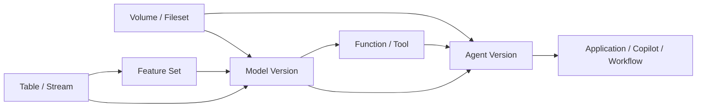

# AI 时代 Catalog Service 统一治理非表资产的必要性与典型场景

## 执行摘要

本文聚焦一个核心问题：为什么 Catalog Service 需要从传统“表目录”演进为统一治理非表资产的控制面，以及这些非表资产在业务侧和平台侧分别有哪些典型场景。

核心结论如下：

- 过去 Catalog Service 主要解决“有哪些表、表在哪里、谁能访问、表之间如何依赖”
- 但在 AI 时代，真实业务链路已经演进为 `data -> feature -> model -> tool -> agent -> application`
- 如果 Catalog Service 仍然只识别表资产，那么模型、工具、知识目录、Agent 等关键对象无法被统一发现、授权、审计、发布和追踪
- 因此，Catalog Service 需要将 `volume/fileset`、`feature`、`model`、`function/tool`、`agent` 纳入统一治理范围

本文主要说明：

1. 非表资产进入后的背景变化与问题
2. 为什么非表资产需要成为 Catalog 中的一等对象
3. 引入非表资产后的核心价值
4. 各类非表资产的典型业务场景与平台管理场景

---

## 1. 背景与问题界定

### 1.1 背景

过去的 Catalog Service 主要回答以下问题：

- 有哪些表
- 表在哪里
- 谁能访问这些表
- 表与表之间的上下游依赖是什么

这套模型对传统数仓和湖仓场景是成立的，因为核心资产基本围绕：

- `table`
- `view`
- `partition`
- `column`

但在 AI 时代，企业真正需要治理和复用的对象已经不再只是表，而是逐步扩展为：

- `volume/fileset`：知识文档、训练集、评测集、模型工件、Prompt 模板等文件型资产
- `feature`：推荐、搜索、风控、画像等场景里的特征定义
- `model`：训练模型、推理模型、Embedding 模型、多版本模型产物
- `function/tool`：UDF、检索工具、数据库查询工具、外部 API 工具、MCP Tool 等
- `agent`：企业问答助手、数据分析助手、自动化执行 Agent、业务 Copilot

这意味着 Catalog Service 需要回答的问题，已经从“找表”变成：

- 有哪些可复用的数据与 AI 资产
- 这些资产分别归谁所有、谁能读、谁能调、谁能发、谁能批
- 一个 Agent 依赖了哪些模型、工具、知识源和表
- 一个模型来自哪些训练数据、哪些特征、哪些函数定义
- 某个非表资产变更后，会影响哪些应用、Agent、模型或任务

因此，Catalog Service 的定位需要从“表元数据目录”演进为“统一资产控制面”。

### 1.2 当前面临的问题

如果 Catalog Service 仍然主要围绕 `table` 设计，会很快遇到以下问题。

#### 1.2.1 资产发现不完整

很多真正被复用和治理的对象根本不是表，例如：

- RAG 文档目录
- 模型工件目录
- Feature 定义
- Agent 编排定义
- 可调用 Tool

如果 Catalog 里只有表，那么“可发现资产目录”天然就是不完整的。

#### 1.2.2 血缘和影响分析断裂

现实中的链路往往是：

`table/stream -> feature -> model -> tool -> agent -> application`

如果 Catalog 只能识别其中的表，剩余链路就会断掉，导致：

- 无法做端到端影响分析
- 无法定位问题传播路径
- 无法完整审计 AI 应用依赖链

#### 1.2.3 治理能力分散

一旦非表资产不进 Catalog，治理就会分散到多个系统：

- model registry 管模型
- feature store 管特征
- 文件系统或对象存储管目录
- 代码仓库或配置系统管 tool/agent

结果是：

- 权限不统一
- 生命周期不统一
- 审计不统一
- 搜索入口不统一

#### 1.2.4 复用效率低

没有统一发现和治理，团队容易重复建设：

- 重复做相似特征
- 重复注册相似模型
- 重复开发相似工具
- 重复搭建相似 Agent

这会直接抬高 AI 应用的交付成本。

#### 1.2.5 变更风险难控制

当一个模型、工具或 Agent 发生版本切换，如果 Catalog 没有统一对象和关系模型，很难回答：

- 谁在依赖它
- 现在的生效版本是什么
- 上一个稳定版本是什么
- 哪些发布、审批、权限和风险策略会被影响

---

## 2. 为什么要将非表资产纳入 Catalog Service

非表资产进入 Catalog 的根本原因，不是“对象类型变多了”，而是这些对象已经具备了和表相同甚至更强的治理需求。

一个对象只要具备以下能力中的大部分，就应该被视为一等资产：

- 需要统一命名
- 需要权限控制
- 需要版本治理
- 需要依赖关系或血缘关系
- 需要审计
- 需要审批、发布、回滚
- 需要被跨团队发现和复用

对 `volume`、`model`、`function/tool`、`feature`、`agent` 来说，这些条件基本都成立。

因此，它们不应该只是：

- 表上的 tag
- 某个 JSON 配置
- 外部系统 ID
- 一条备注信息

而应该成为 Catalog 中的一等对象。

---

## 3. 为什么不能简单把这些资产当成表来管理

表是一种非常重要的资产，但它不是通用资产模型。  
非表资产和表在多个方面存在本质差异。

### 3.1 语义不同

- `table` 是结构化数据集合
- `volume/fileset` 是路径空间或文件集合
- `model` 是可发布、可推理、可评测的工件集合
- `function/tool` 是可执行能力
- `feature` 是用于训练或服务的特征定义
- `agent` 是多资产组合后的执行体或编排对象

### 3.2 生命周期不同

表更关注：

- schema 变更
- partition/snapshot 演进

模型和 Agent 更关注：

- 草稿
- 评测
- 审批
- 发布
- 回滚
- champion/canary/alias

function/tool 更关注：

- 定义版本
- runtime 绑定
- 输入输出契约
- 风险级别

### 3.3 权限动作不同

表的典型动作是：

- `SELECT`
- `INSERT`
- `ALTER`

而非表资产往往需要：

- `READ_METADATA`
- `READ_FILES`
- `EXECUTE`
- `PUBLISH`
- `APPROVE`
- `BIND_RUNTIME`
- `SERVE`
- `GOVERN`

### 3.4 关系类型不同

表更偏数据血缘，而 AI 资产往往存在更多类型关系：

- `DEPENDS_ON`
- `USES`
- `DERIVED_FROM`
- `BOUND_TO`
- `PRODUCES`
- `SERVES`
- `READS`
- `WRITES`

如果没有统一关系层，就很难表达完整依赖图。

---

## 4. 引入非表资产后的核心价值

### 4.1 从“找表”升级为“找能力”

用户不只是查某张表，而是能查到：

- 可复用知识目录
- 可复用特征集
- 可用模型及版本
- 可调用函数和工具
- 可复用 Agent

### 4.2 建立端到端资产依赖图

可以串起完整链路：

`data -> feature -> model -> tool -> agent -> application`

从而支持：

- 影响分析
- 风险评估
- 审计追踪
- 变更回溯

### 4.3 统一治理入口

把原本散落在 model registry、feature store、对象存储、代码配置里的对象统一纳入 Catalog，使治理动作具备一致性：

- 命名
- 搜索
- 授权
- 审批
- 发布
- 审计

### 4.4 提升资产复用率

统一治理后，可以明显降低：

- 重复造轮子
- 重复做特征
- 重复注册模型
- 重复开发工具
- 重复搭建 Agent

### 4.5 为多 Agent 协作打基础

未来越来越多业务能力会表现为多个 Agent 协作、编排和调用。  
如果 Catalog 没有对 `model/tool/knowledge/agent` 做统一建模，就很难成为 AI 应用的底层控制面。

---

## 5. 各类非表资产的典型场景与管理诉求

### 5.1 `volume/fileset`

典型承载内容：

- RAG 知识文档目录
- 模型工件目录
- 训练样本和评测集目录
- Prompt 模板和规则文件
- 多模态素材目录

Catalog Service 管理这类资产的典型场景：

- 注册和发现知识库目录、训练集目录、评测集目录、模型工件目录
- 统一维护 `root_uri`、存储类型、访问模式、生命周期策略
- 把 volume 与 table、model、agent 建立关系
- 统一控制谁能读文件、谁能写文件、谁能绑定到 Agent 或模型
- 记录目录切换、挂载变更、凭证策略变更的审计信息

### 5.2 `feature`

典型场景：

- 推荐排序特征
- 用户画像特征
- 风控评分特征
- 搜索检索特征
- Embedding 衍生特征

Catalog Service 管理这类资产的典型场景：

- 统一注册特征集及其实体键、来源、刷新策略和服务契约
- 维护 feature set 与 table、stream、function 的来源关系
- 支持模型到特征集、特征集到上游表的依赖查询
- 统一挂载质量规则、新鲜度 SLA、发布审批策略
- 在特征定义变更后，做下游模型和 Agent 的影响分析

### 5.3 `model`

典型场景：

- CTR/CVR 排序模型
- 分类与回归模型
- Embedding 模型
- 多版本推理模型
- 生成式模型适配版本

Catalog Service 管理这类资产的典型场景：

- 统一注册模型资产与模型版本，而不是只在外部 registry 里维护
- 管理模型版本的工件地址、训练任务、评测指标、签名和别名
- 支持模型版本状态流转
- 统一记录模型与训练数据、特征集、函数依赖、服务实例的关系
- 支持版本回滚影响分析

### 5.4 `function/tool`

典型场景：

- UDF
- 数据清洗函数
- 向量检索工具
- 数据库查询工具
- 外部 API Connector
- MCP Tool

Catalog Service 管理这类资产的典型场景：

- 统一注册可复用函数和工具
- 管理输入输出 schema、运行时类型、入口定义和依赖包
- 区分纯函数和有副作用的 tool，并挂载不同审批与权限策略
- 统一表达工具与表、外部 API、向量库、模型之间的绑定关系
- 支持 Agent 到 tool 的依赖查询和风险识别

### 5.5 `agent`

典型场景：

- 企业知识问答助手
- 数据分析 Copilot
- 自动化执行 Agent
- 客服 Agent
- 多工具编排 Agent

Catalog Service 管理这类资产的典型场景：

- 统一注册 Agent 资产及其版本
- 管理 Agent 的目标、运行模式、风险等级、运行时绑定和审批策略
- 记录 Agent 版本依赖的模型、工具、知识目录、规则策略和工作流定义
- 支持 Agent 发布前后的版本切换、审批、评测与审计
- 支持模型或 tool 变更影响 Agent 的分析

---

## 6. 结论

AI 时代下，Catalog Service 不再只服务于表对象目录，而需要逐步演进为统一治理数据资产、文件资产、模型资产、可执行能力和 Agent 的控制面。

其中，最关键的变化不是“对象类型增加了”，而是治理边界发生了变化：

- 需要统一发现
- 需要统一授权
- 需要统一版本治理
- 需要统一依赖关系表达
- 需要统一审计与发布能力

因此，将 `volume/fileset`、`feature`、`model`、`function/tool`、`agent` 纳入 Catalog Service，是 AI 时代统一资产治理的必然演进方向。
