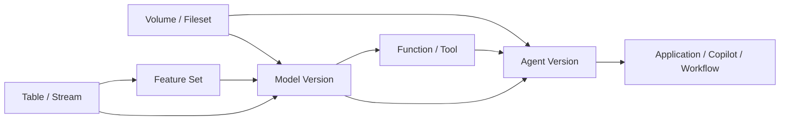

# AI 时代 Catalog Service 引入非表资产管理的必要性与业务场景

更新日期：2026-05-06

## 执行摘要

本文只回答“为什么要做”和“哪些场景最值得做”，不展开完整数据模型、REST API 与工程落地细节。

对应专题文档请参考：

- [catalog-service-ai-non-table-assets-data-model-design.md](./catalog-service-ai-non-table-assets-data-model-design.md)
- [catalog-service-non-table-assets-rest-api-design.md](./catalog-service-non-table-assets-rest-api-design.md)
- [catalog-service-ai-non-table-assets-technical-solution.md](./catalog-service-ai-non-table-assets-technical-solution.md)

本文聚焦一个核心问题：为什么 AI 时代的 Catalog Service 不能再只管理表资产，而需要将模型、特征、文件集、函数、工具、Agent 等非表资产纳入统一治理范围。

核心结论如下：

- 在传统数仓和湖仓场景中，Catalog Service 主要回答“有哪些表、表在哪里、谁能访问、表之间如何依赖”。
- 但在 AI 时代，真实业务链路已经演进为 `data -> feature -> model -> prompt/tool -> agent -> application`，表只是其中的一部分。
- 如果 Catalog Service 仍然只识别表，那么模型、Prompt、知识库、向量索引、工具、Agent 等关键对象将无法被统一发现、授权、审计、发布和追踪。
- 因此，Catalog Service 需要从“table-centric 的表目录”演进为“asset-centric 的统一资产目录与治理控制面”。
- Catalog Service 的职责不是替代 Model Registry、Feature Store、Vector Store、Prompt Store 或 Agent Runtime，而是对这些系统中的核心对象建立统一资产抽象，承接元数据、版本、关系、权限、策略、审计与查询能力。

---

## 1. 背景与问题界定

### 1.1 传统 Catalog Service 的适用边界

过去的 Catalog Service 主要围绕结构化数据对象展开，重点解决以下问题：

- 有哪些表
- 表位于哪里
- 谁能访问这些表
- 表与表之间的上下游依赖关系是什么

这套模型在传统数据仓库和湖仓场景中是成立的，因为核心资产基本围绕以下对象展开：

- `table`
- `view`
- `partition`
- `column`

但在 AI 时代，企业真正需要被发现、复用、治理和审计的对象，已经不再只有表，而是逐步扩展为：

- `volume/fileset`：知识文档、训练数据集、评测集、Prompt 模板、模型工件等文件型资产
- `feature / feature_set`：推荐、风控、搜索、画像等场景中的特征定义
- `model`：训练模型、推理模型、Embedding 模型、多版本模型产物
- `function / tool`：UDF、检索工具、数据库查询工具、外部 API 工具、MCP Tool 等可执行能力
- `agent`：企业问答助手、分析 Copilot、自动化执行 Agent、业务 Copilot

这意味着 Catalog Service 需要回答的问题，已经从“找表”变成：

- 有哪些可复用的数据与 AI 资产
- 这些资产分别归谁所有、谁能读、谁能调、谁能发、谁能批
- 一个 Agent 依赖了哪些模型、工具、知识库和表
- 一个模型来自哪些训练数据、哪些特征、哪些函数定义
- 某个 Prompt、模型或工具变更后，会影响哪些 Agent、服务或业务流程

因此，Catalog Service 的定位需要从“表元数据目录”演进为“统一资产目录与治理控制面”。

### 1.2 如果仍然只管理表，会出现什么问题

如果 Catalog Service 继续主要围绕 `table` 设计，会很快遇到以下问题。

#### 1.2.1 资产发现不完整

很多真正被复用和治理的对象并不是表，例如：

- RAG 知识库目录
- 模型版本和模型工件
- Feature Set
- Prompt 模板
- Tool 定义
- Agent 配置

如果 Catalog 中只有表，那么统一资产目录天然就是不完整的，用户无法通过一个入口发现可用的 AI 能力。

#### 1.2.2 端到端血缘断裂

现实链路通常更像这样：

`table/stream -> feature -> model -> prompt/tool -> agent -> application`

如果 Catalog 只能识别其中的表，剩余链路就会断掉，导致：

- 无法做端到端影响分析
- 无法定位问题传播路径
- 无法完整审计 AI 应用的依赖链

#### 1.2.3 治理能力分散

一旦非表资产不进入 Catalog，治理能力就会散落在多个系统中：

- Model Registry 管模型
- Feature Store 管特征
- 对象存储或文件系统管知识目录和工件
- 代码仓库、配置中心或运行时系统管理 Prompt、Tool 和 Agent

结果就是：

- 权限入口不统一
- 生命周期管理不统一
- 审计不统一
- 搜索入口不统一

#### 1.2.4 复用效率低

没有统一发现和治理，团队很容易重复建设：

- 重复做相似特征
- 重复注册相似模型
- 重复开发相似工具
- 重复搭建相似 Agent

这会直接抬高 AI 应用的交付成本。

#### 1.2.5 变更风险难以控制

当一个模型、Prompt、工具或 Agent 发生版本切换时，如果 Catalog 没有统一对象模型和关系模型，就很难回答：

- 谁在依赖它
- 当前生效版本是什么
- 上一个稳定版本是什么
- 哪些发布、审批、权限和风险策略会受到影响

---

### 1.3 未引入非表资产前的实现方式与局限

在 Catalog Service 尚未统一纳入非表资产之前，这些资产通常不是“没人管理”，而是分散在不同专业系统里分别管理。

可以先用下面这张总览表理解当前常见现状：

| 资产类型 | 常见管理位置 | 主要管理内容 | 典型局限 |
|---|---|---|---|
| `table / view / column` | 传统 Catalog、Hive Metastore、Unity Catalog、湖仓元数据服务 | 命名空间、schema、权限、表血缘、基础搜索 | 只能覆盖结构化数据对象 |
| `volume / fileset / knowledge base` | 对象存储、文件系统、文档平台、数据集目录 | 路径、目录、存储权限、生命周期 | 不知道被哪些模型、工具、Agent 使用 |
| `model` | Model Registry、实验平台、模型平台 | 模型版本、工件、指标、发布记录 | 很难统一看到上游数据和下游 Agent |
| `feature / feature_set` | Feature Store、离线任务平台、流处理平台 | 特征定义、实体键、刷新方式、在线/离线存储 | 跨系统依赖不完整，治理口径不统一 |
| `function / tool` | 代码仓库、服务注册中心、运行时平台、插件平台 | 函数定义、运行方式、配置、调用入口 | 资产发现弱，权限和审计通常在应用层分散实现 |
| `prompt / workflow / agent` | 代码仓库、配置中心、Agent Runtime、应用数据库 | Prompt 模板、编排定义、版本配置、运行参数 | 往往缺少统一资产视图、统一依赖图和统一发布治理 |

这种模式在单系统内通常可以工作，但一旦需要回答跨系统问题，就会迅速暴露问题，例如：

- 某个 Agent 依赖了哪些模型、Tool 和知识库
- 某个模型版本变更会影响哪些下游应用
- 某个知识目录更新后，哪些索引、检索 Tool 和 Agent 需要同步切换
- 某个高风险 Tool 是否被未经审批的 Agent 使用

因此，“引入统一 Catalog 管理非表资产”的本质，不是替换这些专业系统，而是在这些系统之上增加一个统一资产视图和统一治理控制面。

下面分别展开各类资产在未统一纳入 Catalog 之前的典型管理方式与局限。

#### 1.3.1 表资产仍由传统 Catalog 管理

传统 Catalog 继续负责：

- 表、视图、字段、分区等结构化数据对象
- 表级和列级权限
- 表到表的数据血缘
- 基础搜索和元数据浏览

这套能力对于结构化数据仍然有效，但它只能覆盖 AI 业务链路中的“表”这一段。

#### 1.3.2 模型由 Model Registry 或模型平台管理

模型相关信息通常由 Model Registry、实验平台或模型发布平台管理，例如：

- 模型名
- 模型版本
- 训练任务
- 评测指标
- 部署记录

这能解决模型自己的版本和发布问题，但通常无法在企业统一资产视角下回答：

- 这个模型依赖了哪些表和特征
- 这个模型被哪些 Agent 或应用在使用
- 模型变更会影响哪些下游业务链路

#### 1.3.3 特征由 Feature Store 或离线任务系统管理

特征相关信息通常由 Feature Store、Spark/Flink 作业配置或特征平台管理，例如：

- 特征定义
- 实体主键
- 刷新方式
- 在线 / 离线存储位置

这能解决特征生产和服务问题，但往往无法自然纳入统一 Catalog 视图，导致：

- 特征和模型的跨系统依赖难以统一查询
- 特征的跨团队发现与复用效率不高
- 表、特征、模型之间的完整链路不易呈现

#### 1.3.4 知识库和文件集由对象存储或文件系统管理

RAG 文档、训练集、评测集、模型工件等文件型对象，通常落在对象存储、文件系统或文档平台中，例如：

- S3 / OSS / HDFS / NAS
- 文档平台
- 数据集目录

这些系统可以管理：

- 文件目录
- 存储路径
- 基本访问控制
- 生命周期

但通常无法直接回答：

- 哪个 Agent 在用这批知识库
- 哪个向量索引对应这批文档
- 文档更新后会影响哪些 Tool、模型和 Agent

#### 1.3.5 Prompt、Tool、Agent 通常落在代码库、配置中心或运行时平台

Prompt、Tool 和 Agent 在很多团队里通常由以下方式管理：

- Git 仓库中的 YAML / JSON / 代码配置
- 配置中心
- 应用数据库表
- Agent Runtime 自身的存储

这能解决配置存储和发布，但常见问题是：

- Prompt 版本和 Agent 版本缺少统一资产视图
- Tool、模型、知识库、Agent 的依赖关系分散在不同系统里
- 发布、审批、审计往往按应用局部实现，缺统一口径

#### 1.3.6 血缘通常依赖人工拼接或弱集成

在没有统一非表资产 Catalog 的情况下，血缘往往有几种实现方式：

- 只做表到表血缘
- 各个专业系统维护自己的局部依赖
- 通过离线脚本从多个系统抽取信息后做拼接
- 依赖人工文档或经验排查

因此很容易出现：

- 数据血缘在数据平台里
- 模型依赖在模型平台里
- Agent 依赖在应用配置里
- 真正跨域排障时需要人工串联多个系统

#### 1.3.7 权限和审计同样是分散实现

未引入统一非表资产模型时，权限和审计通常也分散在各系统中：

- 表权限在数据平台
- 模型调用权限在模型服务或网关
- 知识库访问权限在对象存储
- Tool 权限在应用层或插件平台
- Agent 发布权限在运行平台

审计也类似：

- 查表有表审计
- 模型调用有服务日志
- Prompt 变更有 Git 提交记录
- Agent 发布有应用发布记录

问题并不在于“完全没有管理”，而在于：

- 管理入口不统一
- 数据口径不统一
- 依赖关系不完整
- 排障路径不连续
- 审计和合规证明成本高

#### 1.3.8 这也是为什么需要引入非表资产管理

因此，引入非表资产管理并不是要替代 Model Registry、Feature Store、Vector Store、Prompt Store 或 Agent Runtime，而是在这些专业系统之上增加一层统一资产抽象，解决以下平台级问题：

- 用统一目录发现 AI 资产
- 用统一关系表达跨系统依赖
- 用统一版本视图管理发布和回滚
- 用统一权限和策略承接治理控制
- 用统一审计视图支撑追责与合规

可以理解为：

- 原来的方式是“每个系统各自管理自己的一段”
- 引入非表资产后的 Catalog Service 负责“把这些段拼成完整治理链路”

## 2. 为什么非表资产应该成为 Catalog 中的一等对象

非表资产进入 Catalog 的根本原因，不是“对象类型变多了”，而是这些对象已经具备了和表相同、甚至更强的治理需求。

一个对象只要具备以下能力中的大部分，就应该被视为一等资产：

- 需要统一命名
- 需要权限控制
- 需要版本治理
- 需要表达依赖关系或血缘关系
- 需要审计
- 需要审批、发布和回滚
- 需要被跨团队发现和复用

对于 `volume/fileset`、`feature`、`model`、`function/tool`、`agent` 来说，这些条件基本都成立。

因此，它们不应该只是：

- 表上的一个标签
- 某个 JSON 配置
- 外部系统中的一个 ID
- 一条附属备注

而应该成为 Catalog 中可检索、可授权、可版本化、可审计、可建立关系的一等对象。

### 2.1 从 Table-centric 到 Asset-centric

传统 Catalog 更偏向：

`catalog -> namespace -> table -> column`

AI 时代更合适的抽象应该是：

`catalog -> namespace -> asset -> asset_version -> relation`

其中 `asset` 可以是：

- `TABLE`
- `VOLUME / FILESET`
- `FEATURE_SET`
- `MODEL`
- `FUNCTION / TOOL`
- `AGENT`

也就是说，表只是统一资产模型中的一种，而不再是唯一中心。

### 2.2 AI 资产需要端到端血缘而不是表级血缘

传统血缘通常关注：

`table_a -> table_b -> dashboard`

AI 时代更需要关注：

`raw_data -> dataset -> feature -> model_version -> prompt/tool -> agent -> service -> feedback`

例如一个客服 Agent 回答出错时，平台通常需要排查：

- 是知识库文档过期
- 是切片版本不对
- 是 Embedding 或向量索引未更新
- 是 Prompt 版本发生错误切换
- 是模型版本回滚
- 是 Tool 调用了异常的外部系统

如果非表资产没有进入 Catalog，这条依赖链就无法完整表达。

### 2.3 AI 资产同样需要统一治理能力

模型、Prompt、向量索引、特征、评测集，本质上都需要类似表的治理能力：

| 治理能力 | 表资产 | AI 非表资产 |
|---|---|---|
| 元数据 | 表名、字段、分区 | 模型名、版本、输入输出、用途 |
| 权限 | 表级 / 列级权限 | 模型调用权限、Prompt 编辑权限、Agent 发布权限 |
| 血缘 | 表到表 | 数据到特征到模型到 Agent |
| 版本 | Snapshot / Schema 演进 | Model Version、Prompt Version、Feature Version |
| 审计 | 谁访问了表 | 谁调用了模型、谁修改了 Prompt、谁发布了 Agent |
| 质量 | 数据质量规则 | 模型评测指标、特征稳定性、知识库更新状态 |
| 生命周期 | 归档 / 删除 | 上线、灰度、回滚、下线、废弃 |

因此，非表资产不是附属对象，而是 AI 系统里的核心生产资料。

---

## 3. 为什么不能简单把这些资产当成“表”来管理

表是一类非常重要的资产，但它不是通用资产模型。非表资产和表在多个方面存在本质差异。

### 3.1 语义不同

- `table` 是结构化数据集合
- `volume/fileset` 是路径空间或文件集合
- `model` 是可训练、可评测、可部署、可推理的产物集合
- `function/tool` 是可执行能力
- `feature_set` 是一组可训练和可服务的特征定义
- `agent` 是由模型、Prompt、工具、知识库等对象组合而成的执行体

### 3.2 生命周期不同

表更关注：

- schema 演进
- partition / snapshot 演进

模型和 Agent 更关注：

- 草稿
- 评测
- 审批
- 发布
- 灰度
- 回滚
- champion / alias 切换

Function / Tool 更关注：

- 定义版本
- 运行时绑定
- 输入输出契约
- 风险等级

### 3.3 权限动作不同

表的典型动作通常是：

- `SELECT`
- `INSERT`
- `ALTER`

而非表资产往往需要：

- `READ_METADATA`
- `READ_FILES`
- `EXECUTE`
- `PUBLISH`
- `APPROVE`
- `BIND_RUNTIME`
- `SERVE`
- `GOVERN`

### 3.4 关系类型不同

表更偏数据加工链路，而 AI 资产往往存在更多样的关系：

- `DEPENDS_ON`
- `USES`
- `DERIVED_FROM`
- `BOUND_TO`
- `PRODUCES`
- `SERVES`
- `READS`
- `WRITES`
- `EVALUATED_BY`
- `GOVERNED_BY`

如果没有统一的关系层，就很难表达完整依赖图。

---

## 4. 引入非表资产后的核心价值

### 4.1 从“找表”升级为“找能力”

用户不再只是查询某张表，而是能找到：

- 可复用知识库
- 可复用特征集
- 可用模型及其版本
- 可调用函数和工具
- 可上线或可接入的 Agent

Catalog Service 从数据目录升级为能力目录。

### 4.2 建立端到端资产依赖图

可以串起完整链路：

`data -> feature -> model -> prompt/tool -> agent -> application`

从而支持：

- 影响分析
- 风险评估
- 审计追踪
- 变更回溯

### 4.3 建立统一治理入口

将原本分散在 Model Registry、Feature Store、对象存储、Prompt Store 和运行时系统中的关键对象纳入统一治理，使治理动作具备一致性：

- 统一命名
- 统一搜索
- 统一授权
- 统一审批
- 统一发布
- 统一审计

### 4.4 提升资产复用效率

统一治理后，可以明显降低：

- 重复造轮子
- 重复做特征
- 重复训练或注册模型
- 重复开发工具
- 重复搭建 Agent

### 4.5 为多 Agent 与 AI 原生应用治理打基础

未来越来越多业务能力会表现为多 Agent 协作、编排和调用。如果 Catalog 不对 `model/tool/knowledge/agent` 做统一建模，就很难成为 AI 应用底层的治理控制面。

---

## 5. 典型业务场景

为了避免设计范围过散，V1 最值得关注的业务场景可以收敛为以下四类。

### 5.1 企业知识库问答 / RAG 场景

典型业务链路：

`document -> chunk -> embedding -> vector index -> retriever -> prompt -> llm -> agent -> application`

这一场景中需要被统一管理的对象包括：

- 文档集合
- 切片数据集
- Embedding 模型
- 向量索引
- Retriever 配置
- Prompt 模板
- LLM 模型
- RAG Agent
- 评测集

业务上常见的问题包括：

- 为什么客服机器人回答的是旧政策
- 哪个知识库版本正在被线上 Agent 使用
- 文档更新后是否重新切片和重建索引
- Prompt 是否切回了旧版本
- 哪个 Embedding 模型生成了当前索引

如果 Catalog 只管理表，最多只能知道文档元数据表的位置，无法定位真正影响回答质量的对象。

Catalog 在这一场景中的价值是：

- 将知识库、索引、Prompt、Retriever、Agent 作为可发现资产纳管
- 建立文档到向量索引、向量索引到 Agent 的依赖关系
- 支撑知识更新、索引切换、Prompt 变更的影响分析与审计

### 5.2 特征与模型治理场景

典型业务链路：

`table/stream -> feature_set -> training_dataset -> model_version -> serving_endpoint -> application`

这一场景中需要被统一管理的对象包括：

- Feature Set
- 训练数据集
- 模型
- 模型版本
- 评测结果
- 部署端点
- 在线特征服务

业务上常见的问题包括：

- 某个模型用了哪些特征训练
- 某个特征来源于哪些表或流
- 最近谁修改了特征定义
- 线上特征和离线训练特征是否一致
- 模型版本回滚会影响哪些服务

Catalog 在这一场景中的价值是：

- 让 Feature Set 成为一等资产，而不是埋在代码或表字段里
- 建立数据、特征、模型、部署端点之间的统一血缘
- 支撑版本治理、评测追踪、影响分析与合规审计

### 5.3 Prompt / Agent 治理场景

典型业务链路：

`user_input -> agent -> prompt -> tool/rag -> llm -> output`

这一场景中需要被统一管理的对象包括：

- Prompt Template
- Agent
- Tool / Function
- Workflow
- Guardrail / Policy
- Evaluation Set

业务上常见的问题包括：

- Prompt 是谁改的，改了哪一版
- 哪些 Agent 依赖了这个 Prompt
- 某个 Tool 是否允许在线上环境被调用
- Agent 发布前是否经过评测和审批
- 某次错误输出是否与模型、Prompt 或工具变更有关

Catalog 在这一场景中的价值是：

- 让 Prompt、Tool、Agent 成为可检索、可审批、可审计资产
- 表达 Prompt、模型、工具、Guardrail、Agent 之间的关系
- 支撑 Agent 发布、回滚和风险治理

### 5.4 合规删除与影响分析场景

AI 时代非常常见的问题是：

“某个用户要求删除个人数据，是否也要从训练集、特征、向量索引、模型服务和 Agent memory 中处理掉？”

典型链路可能是：

`user_profile_table -> training_dataset -> feature_set -> model_v3 -> embedding_index -> customer_service_agent`

业务上需要回答：

- 某个用户数据是否进入过训练集
- 是否生成过 Embedding
- 是否进入过向量索引
- 是否被某个模型版本使用过
- 是否进入过评测集、缓存或 Agent memory

Catalog 在这一场景中的价值是：

- 支撑用户数据影响范围分析
- 支撑删除传播与索引重建
- 支撑模型重训与资产下线决策
- 支撑审计记录与合规证明

---

## 6. Catalog Service 的职责边界

引入非表资产管理并不意味着 Catalog Service 要成为所有资产内容的实际存储系统。

Catalog Service 的职责不是替代：

- Model Registry
- Feature Store
- Vector Store
- Prompt Store
- Agent Runtime
- Object Storage

而是对这些系统中的核心对象建立统一资产抽象，并承接以下能力：

- 注册资产
- 维护元数据
- 管理版本
- 维护关系与血缘
- 控制权限与策略绑定
- 记录审计
- 提供统一搜索与查询 API

可以把它理解为：

- 内容本体仍然留在专业系统中
- 治理抽象、关系抽象和查询入口统一收敛到 Catalog Service

这也是 AI 时代 Catalog Service 最重要的职责升级：

从“表元数据目录”升级为“统一资产图谱与治理控制面”。

---

## 7. 结论

AI 时代下，Catalog Service 不再只服务于表目录，而需要逐步演进为统一治理数据资产、文件资产、模型资产、可执行能力和 Agent 资产的控制面。

其中最关键的变化不是“对象类型增多了”，而是治理边界发生了变化：

- 需要统一发现
- 需要统一授权
- 需要统一版本治理
- 需要统一依赖关系表达
- 需要统一审计与发布治理

因此，将 `volume/fileset`、`feature`、`model`、`function/tool`、`agent` 等非表资产纳入 Catalog Service，是 AI 时代统一资产治理的必然演进方向。
