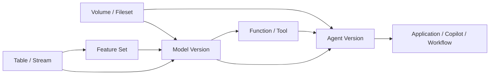
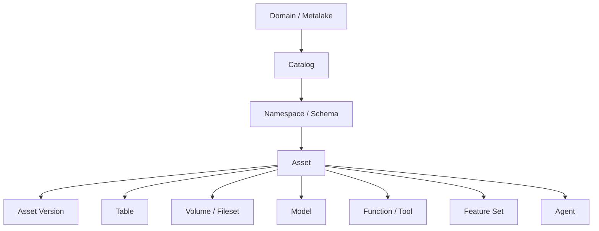
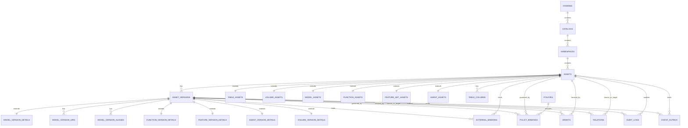

# AI 时代 Catalog Service 统一治理非表资产的数据模型设计建议

## 执行摘要

本文聚焦 AI 时代 Catalog Service 的能力边界与演进方向。

核心结论如下：

- 过去 Catalog Service 主要解决“有哪些表、表在哪里、谁能访问、表之间如何依赖”
- 但在 AI 时代，真实业务链路已经演进为 `data -> feature -> model -> tool -> agent -> application`
- 如果 Catalog Service 仍然只识别表资产，那么中间大量关键对象无法被统一发现、授权、审计、发布和追踪
- 因此，Catalog Service 需要从“表目录”演进为“统一资产控制面”

围绕这一判断，本文提出以下建议：

- 将 `volume/fileset`、`feature`、`model`、`function/tool`、`agent` 纳入一等资产范围
- 吸收 Unity Catalog 在对外对象组织和使用方式上的优点
- 吸收 Gravitino 在统一元对象抽象和治理字段设计上的优点
- 在此基础上，建立统一 `asset`、统一 `asset_version`、统一 `relations` 的数据模型底座

推荐的数据模型方向可以概括为：

`domain(or metalake) -> catalog -> namespace(schema) -> asset -> asset_version`

具体实现上，建议通过以下三层结构落地：

- 统一资产核承接身份、命名、状态、审计、软删除
- 类型扩展表承接 `table/volume/model/function/feature/agent` 的强语义
- 统一关系层承接依赖、绑定、权限、策略和影响分析

本文结构如下：

1. 先说明为什么非表资产进入后，Catalog Service 必须升级
2. 再分析 Unity Catalog 和 Gravitino 各自的数据模型实现与优劣
3. 最后给出推荐的最终对象层级、核心表设计和演进路径

## 1. 背景与问题界定

本文面向内部方案汇报，聚焦一个核心问题：

在 AI 时代，湖仓 Catalog Service 不再只管理 `table/view` 等传统表资产，而是需要逐步纳入 `volume/fileset`、`feature`、`model`、`function/tool`、`agent` 等非表资产。  
在这一前提下，Catalog Service 需要从“表目录”演进为“统一资产控制面”，并形成与之匹配的数据模型。

本文重点说明以下内容：

- 为什么非表资产进入后，Catalog Service 需要升级
- 为什么这些资产不能简单按“表”建模
- Unity Catalog 与 Gravitino 的实现方式对比
- 推荐的最终对象层级与数据模型
- 字段分类原则：什么应该结构化，什么可以放入 `properties`

---

### 1.1 背景

过去的 Catalog Service 主要回答的是这几类问题：

- 有哪些表
- 表在哪里
- 谁能访问这些表
- 表和表之间的上下游依赖是什么

这套模型对传统数仓和湖仓场景是成立的，因为核心资产基本围绕：

- `table`
- `view`
- `partition`
- `column`

但在 AI 时代，企业真正需要治理和复用的对象已经不再只是表，而是逐步扩展为：

- `volume/fileset`：知识文档、训练集、评测集、模型工件、Prompt 模板等文件型资产
- `feature`：推荐、搜索、风控、画像等场景里的特征定义
- `model`：训练模型、推理模型、Embedding 模型、多版本模型产物
- `function/tool`：UDF、检索工具、数据库查询工具、外部 API 工具、MCP Tool 等
- `agent`：企业问答助手、数据分析助手、自动化执行 Agent、业务 Copilot

这意味着 Catalog Service 需要回答的问题，已经从“找表”变成：

- 有哪些可复用的数据与 AI 资产
- 这些资产分别归谁所有、谁能读、谁能调、谁能发、谁能批
- 一个 Agent 依赖了哪些模型、工具、知识源和表
- 一个模型来自哪些训练数据、哪些特征、哪些函数定义
- 某个非表资产变更后，会影响哪些应用、Agent、模型或任务

因此，Catalog Service 的定位需要从“表元数据目录”演进为“统一资产控制面”。

---

### 1.2 当前面临的问题

如果 Catalog Service 仍然主要围绕 `table` 设计，会很快遇到以下问题。

#### 1.2.1 资产发现不完整

很多真正被复用和治理的对象根本不是表，例如：

- RAG 文档目录
- 模型工件目录
- Feature 定义
- Agent 编排定义
- 可调用 Tool

如果 Catalog 里只有表，那么“可发现资产目录”天然就是不完整的。

#### 1.2.2 血缘和影响分析断裂

现实中的链路往往是：

`table/stream -> feature -> model -> tool -> agent -> application`

如果 Catalog 只能识别其中的表，剩余链路就会断掉，导致：

- 无法做端到端影响分析
- 无法定位问题传播路径
- 无法完整审计 AI 应用依赖链

#### 1.2.3 治理能力分散

一旦非表资产不进 Catalog，治理就会分散到多个系统：

- model registry 管模型
- feature store 管特征
- 文件系统或对象存储管目录
- 代码仓库或配置系统管 tool/agent

结果是：

- 权限不统一
- 生命周期不统一
- 审计不统一
- 搜索入口不统一

#### 1.2.4 复用效率低

没有统一发现和治理，团队容易重复建设：

- 重复做相似特征
- 重复注册相似模型
- 重复开发相似工具
- 重复搭建相似 Agent

这会直接抬高 AI 应用的交付成本。

#### 1.2.5 变更风险难控制

当一个模型、工具或 Agent 发生版本切换，如果 Catalog 没有统一对象和关系模型，很难回答：

- 谁在依赖它
- 现在的生效版本是什么
- 上一个稳定版本是什么
- 哪些发布、审批、权限和风险策略会被影响

---

### 1.3 为什么要将非表资产纳入 Catalog Service

非表资产进入 Catalog 的根本原因，不是“对象类型变多了”，而是这些对象已经具备了和表相同甚至更强的治理需求。

一个对象只要具备以下能力中的大部分，就应该被视为一等资产：

- 需要统一命名
- 需要权限控制
- 需要版本治理
- 需要依赖关系或血缘关系
- 需要审计
- 需要审批、发布、回滚
- 需要被跨团队发现和复用

对 `volume`、`model`、`function/tool`、`feature`、`agent` 来说，这些条件基本都成立。

所以它们不应该只是：

- 表上的 tag
- 某个 JSON 配置
- 外部系统 ID
- 一条备注信息

而应该成为 Catalog 中的一等对象。

---

### 1.4 为什么不能简单把这些资产当成表来管理

表是一种非常重要的资产，但它不是通用资产模型。

非表资产和表在多个方面存在本质差异。

#### 1.4.1 语义不同

- `table` 是结构化数据集合
- `volume/fileset` 是路径空间或文件集合
- `model` 是可发布、可推理、可评测的工件集合
- `function/tool` 是可执行能力
- `feature` 是用于训练或服务的特征定义
- `agent` 是多资产组合后的执行体或编排对象

如果把这些对象都压平为 table，语义会非常别扭。

#### 1.4.2 生命周期不同

表更关注：

- schema 变更
- partition/snapshot 演进

模型和 Agent 更关注：

- 草稿
- 评测
- 审批
- 发布
- 回滚
- champion/canary/alias

function/tool 更关注：

- 定义版本
- runtime 绑定
- 输入输出契约
- 风险级别

这类生命周期显然不是表格式能直接表达的。

#### 1.4.3 权限动作不同

表的典型动作是：

- `SELECT`
- `INSERT`
- `ALTER`

而非表资产往往需要：

- `READ_METADATA`
- `READ_FILES`
- `EXECUTE`
- `PUBLISH`
- `APPROVE`
- `BIND_RUNTIME`
- `SERVE`
- `GOVERN`

说明它们需要更通用的授权模型。

#### 1.4.4 关系类型不同

表更偏数据血缘，而 AI 资产往往存在更多类型关系：

- `DEPENDS_ON`
- `USES`
- `DERIVED_FROM`
- `BOUND_TO`
- `PRODUCES`
- `SERVES`
- `READS`
- `WRITES`

如果没有统一关系层，就很难表达完整依赖图。

---

### 1.5 引入非表资产后的核心价值

#### 1.5.1 从“找表”升级为“找能力”

用户不只是查某张表，而是能查到：

- 可复用知识目录
- 可复用特征集
- 可用模型及版本
- 可调用函数和工具
- 可复用 Agent

#### 1.5.2 建立端到端资产依赖图

可以串起完整链路：

`data -> feature -> model -> tool -> agent -> application`

从而支持：

- 影响分析
- 风险评估
- 审计追踪
- 变更回溯

可以用下面这张业务链路图来说明统一治理的必要性：

这张图表达的是：

- 结构化数据和文件型数据会共同成为 AI 资产链路的上游
- `feature` 和 `model` 是连接数据资产与 AI 应用的关键中间层
- `function/tool` 与 `agent` 使系统从“数据可查”进一步升级为“能力可调用”
- 如果 Catalog Service 只认识 table，不认识后面的对象，依赖链就会在中间断掉

#### 1.5.3 统一治理入口

把原本散落在 model registry、feature store、对象存储、代码配置里的对象统一纳入 Catalog，使治理动作具备一致性：

- 命名
- 搜索
- 授权
- 审批
- 发布
- 审计

#### 1.5.4 提升资产复用率

统一治理后，可以明显降低：

- 重复造轮子
- 重复做特征
- 重复注册模型
- 重复开发工具
- 重复搭建 Agent

#### 1.5.5 为多 Agent 协作打基础

未来越来越多业务能力会表现为多个 Agent 协作、编排和调用。  
如果 Catalog 没有对 `model/tool/knowledge/agent` 做统一建模，就很难成为 AI 应用的底层控制面。

---

## 2. 非表资产的典型场景与管理诉求

### 2.1 `volume/fileset`

典型承载内容：

- RAG 知识文档目录
- 模型工件目录
- 训练样本和评测集目录
- Prompt 模板和规则文件
- 多模态素材目录

它本质上不是表，而是受治理的文件空间。

Catalog Service 管理这类资产的典型场景：

- 注册和发现知识库目录、训练集目录、评测集目录、模型工件目录
- 统一维护 `root_uri`、存储类型、访问模式、生命周期策略
- 把 volume 与 table、model、agent 建立关系，例如：
  - 某模型版本使用哪个训练样本目录
  - 某 Agent 读取哪个知识目录
- 统一控制谁能读文件、谁能写文件、谁能绑定到 Agent 或模型
- 记录目录切换、挂载变更、凭证策略变更的审计信息

### 2.2 `feature`

典型场景：

- 推荐排序特征
- 用户画像特征
- 风控评分特征
- 搜索检索特征
- Embedding 衍生特征

它需要定义来源、实体键、刷新方式、质量规则和新鲜度 SLA。

Catalog Service 管理这类资产的典型场景：

- 统一注册特征集及其实体键、来源、刷新策略和服务契约
- 维护 feature set 与 table、stream、function 的来源关系
- 支持查询：
  - 某模型依赖哪些特征集
  - 某特征集来自哪些上游表
- 统一挂载质量规则、新鲜度 SLA、发布审批策略
- 在特征定义变更后，做下游模型和 Agent 的影响分析

### 2.3 `model`

典型场景：

- CTR/CVR 排序模型
- 分类与回归模型
- Embedding 模型
- 多版本推理模型
- 生成式模型适配版本

模型治理必须天然支持版本、工件、评测、别名、发布状态。

Catalog Service 管理这类资产的典型场景：

- 统一注册模型资产与模型版本，而不是只在外部 registry 里维护
- 管理模型版本的工件地址、训练任务、评测指标、签名和别名
- 支持模型版本状态流转：
  - 草稿
  - 审批
  - 发布
  - 废弃
- 统一记录模型与训练数据、特征集、函数依赖、服务实例的关系
- 支持回答：
  - 当前线上使用的是哪个版本
  - 某版本回滚会影响哪些 Agent 和应用

### 2.4 `function/tool`

典型场景：

- UDF
- 数据清洗函数
- 向量检索工具
- 数据库查询工具
- 外部 API Connector
- MCP Tool

它们需要显式定义输入输出契约、运行时、权限、副作用和审批要求。

Catalog Service 管理这类资产的典型场景：

- 统一注册可复用函数和工具，而不是散落在代码仓库或运行时配置里
- 管理函数/工具的输入输出 schema、运行时类型、入口定义和依赖包
- 区分纯函数和有副作用的 tool，并挂载不同审批与权限策略
- 统一表达工具与表、外部 API、向量库、模型之间的绑定关系
- 支持查询：
  - 哪些 Agent 在使用某个 tool
  - 哪些 tool 具备外部写操作能力
  - 某个 function 的当前生效版本是什么

### 2.5 `agent`

典型场景：

- 企业知识问答助手
- 数据分析 Copilot
- 自动化执行 Agent
- 客服 Agent
- 多工具编排 Agent

Agent 不是单一工件，而是对模型、工具、知识源、策略和工作流的组合封装。

Catalog Service 管理这类资产的典型场景：

- 统一注册 Agent 资产及其版本，而不是只放在应用配置或 workflow 配置里
- 管理 Agent 的目标、运行模式、风险等级、运行时绑定和审批策略
- 记录 Agent 版本依赖的模型、工具、知识目录、规则策略和工作流定义
- 支持 Agent 发布前后的版本切换、审批、评测与审计
- 支持查询：
  - 某 Agent 依赖了哪些模型和工具
  - 某模型或 tool 变更会影响哪些 Agent
  - 哪些 Agent 具备高风险外部动作能力

---

## 3. 开源参考：Unity Catalog 与 Gravitino 的数据模型实现

在明确了非表资产进入 Catalog Service 的必要性之后，下一步需要回答的是：现有开源方案是如何建模的，它们分别解决了什么问题，又留下了哪些空白。

本章选择 Unity Catalog 与 Gravitino 作为对比样本，原因在于：

- Unity Catalog 更代表湖仓目录型产品的实现路径
- Gravitino 更代表统一元数据治理平台的实现路径
- 两者分别覆盖了“对外对象组织”与“对内统一治理抽象”两类值得参考的方向

### 3.1 Unity Catalog 的数据模型特点

Unity Catalog 的核心特点是：

- 采用 `metastore -> catalog -> schema -> object` 分层
- 每类对象单独建表
- 没有统一 `asset` 主表
- model 显式拆成 `registered_model + model_version`
- 通过 `uc_properties` 做通用属性扩展
- 通过 `Casbin` 做权限控制

典型对象包括：

- `catalog`
- `schema`
- `table`
- `volume`
- `function`
- `registered_model`
- `model_version`
- `external_location`
- `credential`

可借鉴点：

- `catalog.schema.object` 的对象层级心智非常成熟
- `volume` 已被纳入一等对象
- model/version 拆分合理
- function/parameter 模型贴近湖仓用户认知
- 权限模型和对象类型结合较紧密

局限：

- 缺统一 `asset` 抽象
- 缺统一 `asset_version`
- 缺通用关系图层
- 对 AI-native 对象支持不足，尤其 `feature`、`agent`

可以进一步把 Unity Catalog 的数据模型理解成 4 层：

#### 3.1.1 对象层级模型

最上层是命名空间主轴：

`metastore -> catalog -> schema -> object`

其中：

- `catalog` 和 `schema` 是主要命名空间对象
- `table`、`volume`、`function`、`registered_model` 都挂在 `schema` 下面
- `model_version` 再挂在 `registered_model` 下面

这说明 Unity Catalog 非常强调“用户如何理解和浏览对象”，其组织方式接近数据库目录模型。

#### 3.1.2 按对象类型分别建模

Unity Catalog 不是先抽象一张统一 `asset` 表，再用 `asset_type` 扩展；  
它采用的是“每类对象单独建模”的方式。

可以概括成：

- `catalog` 一张表
- `schema` 一张表
- `table` 一张表
- `volume` 一张表
- `function` 一张表
- `registered_model` 一张表
- `model_version` 一张表

这类设计的优点是：

- 每个对象模型都很直接
- 对象语义比较清楚
- 对外 API 和内部表结构容易一一对应

但代价是：

- 共性字段难以统一治理
- 跨资产通用搜索和聚合要靠服务层拼装
- 后续继续新增 `feature`、`agent`、`tool` 时，对象表会不断增加

#### 3.1.3 典型对象建模方式

`table`

- 主表保存 table 自身信息，如：
  - 所属 `schema`
  - `type`
  - `data_source_format`
  - `storage location`
  - `owner`
  - 审计字段
- 列定义不塞 JSON，而是单独有 `column` 子表

`volume`

- 作为 schema 下的一等对象存在
- 主要保存：
  - `schema_id`
  - `storage_location`
  - `volume_type`
  - `owner`
  - 审计字段

`function`

- 主表保存函数本身定义
- 参数单独子表保存，而不是都放进一个大字段
- 更像传统数据库 routine/function catalog 的建模方式

`registered_model + model_version`

- `registered_model` 管模型身份
- `model_version` 管版本、来源、状态、run_id、URL 等

这里很值得参考的一点是：  
Unity Catalog 已经承认 model 需要“资产层 + 版本层”两层对象，而不是单一记录。

#### 3.1.4 `properties` 的实现方式

Unity Catalog 有一张通用属性表 `uc_properties`，通常按类似下面的思路存：

- `entity_id`
- `entity_type`
- `property_key`
- `property_value`

也就是说，它没有在每类对象表里都放一个大 JSON `properties` 字段，而是用通用 KV 侧表来扩展属性。

这种模式的优点是：

- 扩展灵活
- 不需要频繁改主表 schema
- 不同对象可以共用属性存储机制

缺点是：

- 强语义字段如果放进去，会弱化结构化治理能力
- 高级查询和复杂过滤会比较别扭

#### 3.1.5 权限和关系模型

Unity Catalog 的权限模型比较成熟，但重点更偏“对象层级授权”，而不是“通用资产依赖图”。

可以理解为两部分：

- 元数据层靠外键表达父子层级
  - `schema -> catalog`
  - `table -> schema`
  - `volume -> schema`
  - `registered_model -> schema`
  - `model_version -> registered_model`
- 权限层通过 `Casbin` 表达主体、对象、动作和继承

它擅长的是：

- `catalog/schema/object` 的继承式授权
- 面向 table、volume、function、model 的湖仓对象控制

它相对缺少的是：

- 通用 `DEPENDS_ON/USES/DERIVED_FROM` 关系层
- 面向 AI 资产的统一依赖图
- 跨类型统一版本治理

#### 3.1.6 对我们的启发

Unity Catalog 最值得借鉴的，不是“是否要照抄它的内部表结构”，而是：

- 对外对象层级清晰
- `volume` 已经作为一等对象进入 catalog
- `model + version` 的分层治理是对的
- table column、function parameter 这类强语义字段坚持结构化建模
- 权限动作与对象类型结合得比较自然

### 3.2 Gravitino 的数据模型特点

Gravitino 的核心特点是：

- 先抽象统一元对象，再做分类型持久化
- 具有较强的统一概念：
  - `MetadataObject`
  - `Entity`
  - `SecurableObject`
- 对象仍按类型分表，但字段模式很统一
- 大量对象具备：
  - `properties`
  - `auditInfo`
  - `currentVersion`
  - `lastVersion`
  - `deletedAt`
- 显式建模了：
  - `fileset`
  - `model`
  - `function`
  - `tag`
  - `policy`
  - `role`

可借鉴点：

- 统一元对象抽象能力强
- 非表资产进入主元数据体系，不是外挂
- 版本、软删除、审计更像控制面设计
- tag/policy/owner/role 等横切关系做成独立关系模型

局限：

- 仍然没有统一 `asset` 主表
- properties 偏 JSON 化
- 缺通用 `DEPENDS_ON/USES/DERIVED_FROM` 关系图
- AI-native 对象还不完整，尤其 `feature`、`agent`

可以进一步把 Gravitino 的数据模型理解成“统一抽象层 + 分类型持久化层”。

#### 3.2.1 统一抽象先行

和 Unity Catalog 最大的差异在于，Gravitino 在 API 和核心语义层就先定义了统一抽象，例如：

- `MetadataObject`
- `Entity`
- `SecurableObject`

这意味着在它的视角里，很多对象虽然底层分表，但在上层都属于统一元对象体系的一部分。

这类统一对象体系通常覆盖：

- `metalake`
- `catalog`
- `schema`
- `table`
- `view`
- `fileset`
- `topic`
- `model`
- `function`
- `tag`
- `policy`
- `role`

这比 Unity Catalog 更接近“元数据控制面”的设计思路。

#### 3.2.2 对象层级与命名模型

Gravitino 的命名体系比 Unity Catalog 多了一层组织边界，通常可理解为：

`metalake -> catalog -> schema -> object`

其中 `object` 可以是：

- `table`
- `view`
- `fileset`
- `topic`
- `model`
- `function`

从产品感知上看，它和 Unity Catalog 很像，也是分层对象目录；  
但从平台语义上看，它更强调 `metalake` 这一层租户或治理边界。

#### 3.2.3 持久化方式：按类型分表

Gravitino 虽然抽象更统一，但最终落库依然不是单一 `asset` 表，而是每类对象一组 PO/表。

例如：

- `Metalake`
- `Catalog`
- `Schema`
- `Table`
- `Fileset`
- `Model`
- `Function`

每类对象各自落库，但这些表有明显统一字段模式，而不是完全各写各的。

#### 3.2.4 统一字段模式

Gravitino 很多对象都带有比较一致的治理字段，例如：

- `properties`
- `auditInfo`
- `currentVersion`
- `lastVersion`
- `deletedAt`

这带来两个明显好处：

- 新对象更容易纳入统一治理框架
- 版本、软删除、审计等能力可以横向复用

也就是说，它虽然没有统一 `asset` 主表，但已经形成了“准统一资产字段协议”。

#### 3.2.5 非表资产建模方式

`fileset`

- 对应路径型或文件型资产
- 比 Unity Catalog 的 volume 更偏“通用文件资产”表达
- 某些实现里还会把 location、comment、properties 放在版本层

`model`

- 有模型主对象
- 也有模型版本对象
- 同时对 alias、URI 等概念做了显式建模

`function`

- 既有函数主对象
- 也有函数版本对象
- 具体定义往往通过结构化对象或 JSON 定义快照保存

这说明 Gravitino 已经不仅仅是在管理表，而是在管理不同语义的“可治理对象”。

#### 3.2.6 `properties`、关系与权限模型

`properties`

- 相比 Unity Catalog 的通用 KV 侧表，Gravitino 更常见的是把 properties 直接作为 JSON 存在对象表里
- 好处是简单直接
- 代价是属性查询和治理边界更依赖服务层约束

`关系`

- 它显式建模了一些横切治理关系，例如：
  - `tag -> metadata object`
  - `policy -> metadata object`
  - `owner -> object`
  - `role -> user/group`
- 说明它知道这些信息不应简单塞进对象属性里

不过它依然没有完整的通用 AI 资产依赖图，例如：

- `model uses feature`
- `agent uses tool`
- `agent reads volume`

这类关系并没有像统一图层那样做透。

`权限`

- Gravitino 的权限模型围绕统一 `SecurableObject` 展开
- 相比 Unity Catalog，更像“统一元对象授权体系”
- 更适合在未来继续扩展到更多新对象类型

#### 3.2.7 对我们的启发

Gravitino 最值得借鉴的是：

- 先有统一元对象抽象，再去做对象持久化
- 不把非表资产当外挂对象，而是纳入主元数据体系
- 让版本、软删除、审计成为通用治理能力
- tag/policy/owner/role 等横切能力显式建模

它还留给我们的改进空间是：

- 再往前走一步，建立统一 `asset`
- 建立统一 `asset_version`
- 建立通用 `relations` 图层，覆盖数据到模型到 Agent 的完整链路

### 3.3 两者对比总结

整体看：

- Unity Catalog 更强在对外对象组织、命名空间层级，以及 `volume/model/function` 这类对象的产品化体验
- Gravitino 更强在统一抽象、统一治理字段，以及把非表资产纳入主元数据体系的能力
- 如果我们的目标是 AI 时代统一 Catalog Service，更适合以 Gravitino 作为主要抽象参考，以 Unity Catalog 作为对外对象组织和使用体验参考
- 两者共同的不足是：都还缺少足够强的统一依赖图层，尤其缺少面向 `feature/tool/agent` 的通用关系建模
- 因此我们的方案需要在吸收两者优点的基础上，进一步补上统一 `asset`、统一 `asset_version` 和统一 `relations`

### 3.4 对比与启发总表

如果用于汇报，可以把前面的分析进一步收敛为下面这张总表。

| 设计点 | Unity Catalog | Gravitino | 我们的推荐 |
|---|---|---|---|
| 顶层定位 | 更像 lakehouse catalog | 更像 metadata governance plane | 定位为统一资产控制面 |
| 对外对象层级 | `metastore -> catalog -> schema -> object` | `metalake -> catalog -> schema -> object` | `domain/metalake -> catalog -> namespace -> asset -> asset_version` |
| 内部建模方式 | 每类对象单独建表 | 统一抽象 + 每类对象分表 | 统一 `asset` 核 + 类型扩展表 |
| 非表资产覆盖 | `volume/model/function` 较成熟 | `fileset/model/function/tag/policy` 更系统 | 纳入 `volume/model/function/tool/feature/agent` |
| 版本模型 | model 明确两层，其它对象较弱 | 多对象带版本风格 | 建统一 `asset_version` 主表 |
| 表达强语义字段 | table column、function parameter 结构化较好 | 部分结构化，部分 JSON 化 | 强语义字段结构化，复杂快照放版本明细 |
| properties 方案 | 通用 KV 属性表 | 对象表内 JSON properties | `properties_json` 为主，必要时投影 KV/索引 |
| 权限模型 | 对象授权成熟，偏层级继承 | 统一 `SecurableObject` 思想更强 | 统一 `resource + action + condition` 模型 |
| 关系模型 | 父子层级强，通用依赖弱 | 治理关系较多，通用依赖弱 | 独立 `relations` 图层统一表达依赖 |
| 审计与软删除 | 有基础审计，整体较轻 | `auditInfo/deletedAt/currentVersion` 很统一 | 审计、软删除、当前版本做成底座能力 |
| 对 AI-native 对象的准备 | 不够，尤其缺 `feature/agent` | 比较接近，但仍不完整 | 把 `feature`、`agent` 做成一等资产 |
| 最值得借鉴的点 | 对外对象组织清晰，`volume/model/function` 用户体验好 | 统一抽象强，治理字段一致性好 | 两者结合，再补统一 `asset/version/relation` |

---

## 4. 推荐方案：统一资产控制面的数据模型设计

基于前文问题分析和开源参考对比，推荐方案的目标不是简单复刻已有系统，而是在吸收两者优点的基础上，形成一套更适合 AI 时代统一治理非表资产的数据模型。

如果只在 Unity Catalog 和 Gravitino 之间选择一个作为主参考，更建议偏向 Gravitino；  
但如果要构建适合 AI 时代的统一 Catalog Service，不建议直接照搬任一方案。

更合适的方向是：

- 抽象层学 Gravitino
- 对象层级和部分对象体验学 Unity Catalog
- 关系、版本、策略、权限做得比两者都更统一

可以概括为：

**Gravitino 的统一抽象能力 + Unity Catalog 的对象产品形态 + 我们自己的统一 `asset/version/relation` 底座。**

### 4.1 推荐最终对象层级

建议采用如下统一层级：

`domain(or metalake) -> catalog -> namespace(schema) -> asset -> asset_version`

解释如下：

- `domain/metalake`
  - 组织、租户或环境边界
- `catalog`
  - 资产集合与治理空间
- `namespace/schema`
  - catalog 内进一步分组
- `asset`
  - 统一资产身份层
- `asset_version`
  - 所有需要审批、发布、回滚、别名切换的对象版本层

这个层级兼顾了：

- Gravitino 的组织边界
- Unity Catalog 的对外对象组织方式和使用习惯
- AI 时代非表资产的统一治理需求

---

### 4.2 推荐最终数据模型

#### 4.2.1 设计原则

建议采用“三层模型”：

##### 第一层：统一资产核

统一承接：

- 资产身份
- 统一命名
- 基础状态
- 审计
- 软删除
- 当前生效版本

##### 第二层：类型扩展层

每类资产的强语义字段分别落入对应扩展表，例如：

- `table_assets`
- `volume_assets`
- `model_assets`
- `function_assets`
- `feature_set_assets`
- `agent_assets`

##### 第三层：关系与治理横切层

把这些横切能力独立出来：

- 关系
- 策略
- 授权
- 外部绑定
- 审计日志
- 事件分发

#### 4.2.2 推荐对象层级图

可以先用一张高层图说明对象层级，帮助听众先建立整体认知。

这张图表达的是：

- 统一的组织层级是 `domain -> catalog -> namespace -> asset -> asset_version`
- `table`、`volume`、`model`、`function/tool`、`feature set`、`agent` 都是 `asset` 的具体类型
- 所有需要发布、审批、回滚的对象，都通过 `asset_version` 进入统一版本治理

#### 4.2.3 推荐核心表关系图

在汇报时，通常还需要一张“核心表怎么关联”的图，帮助说明为什么我们既保留统一资产核，又保留类型扩展表和关系表。

这张图表达的是：

- `assets` 是统一资产身份层
- `asset_versions` 是统一版本治理层
- 各资产类型通过扩展表表达自己的强语义
- `relations`、`grants`、`policies`、`external_bindings` 不再塞进对象属性，而是作为横切治理能力单独建模

---

#### 4.2.4 主层级表

##### `domains`

| 字段 | 说明 |
|---|---|
| `domain_id` | 主键 |
| `domain_name` | 唯一名称 |
| `display_name` | 展示名 |
| `description` | 描述 |
| `owner` | 负责人 |
| `status` | 状态 |
| `properties_json` | 补充属性 |
| `created_by/created_at` | 创建信息 |
| `updated_by/updated_at` | 更新信息 |

##### `catalogs`

| 字段 | 说明 |
|---|---|
| `catalog_id` | 主键 |
| `domain_id` | 所属 domain |
| `catalog_name` | catalog 名称 |
| `display_name` | 展示名 |
| `description` | 描述 |
| `catalog_type` | catalog 类型 |
| `storage_root` | 默认根路径 |
| `owner` | 负责人 |
| `status` | 状态 |
| `properties_json` | 补充属性 |
| `created_by/created_at` | 创建信息 |
| `updated_by/updated_at` | 更新信息 |

##### `namespaces`

| 字段 | 说明 |
|---|---|
| `namespace_id` | 主键 |
| `domain_id` | 所属 domain |
| `catalog_id` | 所属 catalog |
| `namespace_name` | namespace/schema 名称 |
| `qualified_name` | 全限定名 |
| `display_name` | 展示名 |
| `description` | 描述 |
| `owner` | 负责人 |
| `status` | 状态 |
| `properties_json` | 补充属性 |
| `created_by/created_at` | 创建信息 |
| `updated_by/updated_at` | 更新信息 |

##### `assets`

这是统一资产核，建议所有一等资产都先进入这张表。

| 字段 | 说明 |
|---|---|
| `asset_id` | 主键 |
| `domain_id` | 所属 domain |
| `catalog_id` | 所属 catalog |
| `namespace_id` | 所属 namespace |
| `asset_type` | `TABLE/VOLUME/MODEL/FUNCTION/FEATURE_SET/AGENT` |
| `asset_name` | 资产名 |
| `qualified_name` | 全限定名 |
| `display_name` | 展示名 |
| `description` | 描述 |
| `owner` | 负责人 |
| `status` | 治理状态 |
| `lifecycle_state` | 生命周期状态 |
| `current_version_id` | 当前生效版本 |
| `external_id` | 外部系统 ID |
| `audit_info_json` | 统一审计摘要 |
| `deleted_at` | 软删除时间戳 |
| `tags_json` | 标签摘要 |
| `properties_json` | 低频补充属性 |
| `created_by/created_at` | 创建信息 |
| `updated_by/updated_at` | 更新信息 |

##### `asset_versions`

所有需要治理版本的资产，共享这张版本主表。

| 字段 | 说明 |
|---|---|
| `asset_version_id` | 主键 |
| `asset_id` | 所属资产 |
| `version` | 版本号 |
| `version_label` | 别名，如 `prod/champion` |
| `description` | 版本说明 |
| `status` | `DRAFT/APPROVED/PUBLISHED/DEPRECATED` |
| `registration_status` | 外部注册状态 |
| `change_summary` | 变更摘要 |
| `schema_snapshot_json` | schema 快照 |
| `spec_snapshot_json` | spec 快照 |
| `artifact_summary_json` | 工件摘要 |
| `approved_by/approved_at` | 审批信息 |
| `published_by/published_at` | 发布信息 |
| `created_by/created_at` | 创建信息 |

---

#### 4.2.5 资产类型扩展表

##### `table_assets`

| 字段 | 说明 |
|---|---|
| `asset_id` | 对应 `assets.asset_id` |
| `table_format` | Iceberg/Hive/Lance 等 |
| `table_type` | managed/external/view 等 |
| `storage_location` | 存储位置 |
| `schema_ref` | schema 引用 |
| `partition_spec_json` | 分区定义 |
| `primary_keys_json` | 主键 |
| `snapshot_ref` | 当前快照引用 |
| `comment` | 补充说明 |

##### `table_columns`

建议列定义单独建子表，不要塞 JSON。

| 字段 | 说明 |
|---|---|
| `column_id` | 主键 |
| `asset_id` | 所属 table 资产 |
| `column_name` | 列名 |
| `ordinal_position` | 顺序 |
| `type_name` | 类型名称 |
| `type_text` | 原始类型文本 |
| `nullable` | 是否可空 |
| `comment` | 注释 |
| `partition_index` | 分区顺序 |

##### `volume_assets`

建议对外统一叫 `VOLUME`，内部可以吸收 Gravitino `fileset` 语义。

| 字段 | 说明 |
|---|---|
| `asset_id` | 对应 `assets.asset_id` |
| `volume_kind` | `MANAGED_VOLUME/EXTERNAL_VOLUME/FILESET` |
| `storage_provider` | S3/OSS/HDFS 等 |
| `root_uri` | 根路径 |
| `access_mode` | 访问模式 |
| `default_file_format` | 默认文件格式 |
| `credential_policy_ref` | 凭证策略引用 |
| `retention_policy_ref` | 生命周期策略引用 |
| `comment` | 补充说明 |

如确实需要目录版本治理，可选增加：

##### `volume_version_details`

| 字段 | 说明 |
|---|---|
| `asset_version_id` | 对应版本 |
| `storage_location` | 版本对应路径 |
| `manifest_uri` | 版本清单 |
| `properties_json` | 版本属性 |

##### `model_assets`

| 字段 | 说明 |
|---|---|
| `asset_id` | 对应 `assets.asset_id` |
| `model_family` | 模型族 |
| `task_type` | 分类、排序、Embedding 等 |
| `framework` | PyTorch/TensorFlow/XGBoost 等 |
| `algorithm` | 算法名称 |
| `problem_type` | 分类/回归/召回等 |
| `risk_level` | 风险等级 |
| `default_registry` | 默认外部注册中心 |
| `model_card_uri` | 模型卡地址 |
| `owner_team` | 所属团队 |

##### `model_version_details`

| 字段 | 说明 |
|---|---|
| `asset_version_id` | 对应版本 |
| `run_id` | 训练运行 ID |
| `training_job_id` | 训练任务 ID |
| `artifact_manifest_json` | 工件清单 |
| `hyperparams_json` | 超参数 |
| `metrics_json` | 评测指标 |
| `evaluation_summary_json` | 评测摘要 |
| `signature_json` | 输入输出签名 |
| `runtime_image` | 推理镜像 |
| `validation_report_json` | 验证报告 |

##### `model_version_uris`

参考 Gravitino，一个模型版本可能需要多个 URI。

| 字段 | 说明 |
|---|---|
| `id` | 主键 |
| `asset_version_id` | 对应版本 |
| `uri_name` | URI 名称 |
| `uri_value` | URI 值 |
| `uri_type` | artifact/source/serving 等 |

##### `model_version_aliases`

建议将 alias 独立建表。

| 字段 | 说明 |
|---|---|
| `id` | 主键 |
| `asset_version_id` | 对应版本 |
| `alias_name` | 别名 |
| `deleted_at` | 软删除时间 |

##### `function_assets`

建议 `function` 和 `tool` 共用一套父模型，通过 `function_kind` 区分。

| 字段 | 说明 |
|---|---|
| `asset_id` | 对应 `assets.asset_id` |
| `function_kind` | `FUNCTION/TOOL` |
| `language` | Python/Java/SQL 等 |
| `runtime_type` | spark/container/http/mcp 等 |
| `entrypoint` | 入口点 |
| `deterministic` | 是否确定性 |
| `side_effect_level` | 副作用等级 |
| `timeout_ms` | 超时时间 |
| `resource_quota_json` | 资源限制 |
| `approval_required` | 是否需要审批 |

##### `function_version_details`

| 字段 | 说明 |
|---|---|
| `asset_version_id` | 对应版本 |
| `definitions_json` | 函数/工具定义 |
| `impl_uri` | 实现代码地址 |
| `image_uri` | 运行镜像 |
| `input_schema_json` | 输入 schema |
| `output_schema_json` | 输出 schema |
| `dependency_manifest_json` | 依赖清单 |
| `runtime_constraints_json` | 运行约束 |
| `release_notes` | 版本说明 |

##### `feature_set_assets`

首期建议先做 `FEATURE_SET` 资产，而不是一开始就把单个 feature 独立成一级对象。

| 字段 | 说明 |
|---|---|
| `asset_id` | 对应 `assets.asset_id` |
| `entity_keys_json` | 实体键 |
| `source_type` | batch/stream/table 等 |
| `source_definition` | 来源定义 |
| `update_mode` | 刷新模式 |
| `freshness_sla` | 新鲜度 SLA |
| `quality_policy_ref` | 质量策略引用 |
| `serving_binding_ref` | serving 绑定引用 |
| `owner_team` | 所属团队 |

##### `feature_version_details`

| 字段 | 说明 |
|---|---|
| `asset_version_id` | 对应版本 |
| `feature_schema_json` | 特征 schema |
| `feature_definitions_json` | 特征定义 |
| `transformation_logic_json` | 转换逻辑 |
| `validation_report_json` | 校验报告 |
| `materialization_ref` | 物化引用 |
| `serving_contract_json` | 服务契约 |

##### `agent_assets`

Agent 应作为一等对象进入资产体系。

| 字段 | 说明 |
|---|---|
| `asset_id` | 对应 `assets.asset_id` |
| `agent_type` | `CHAT/WORKFLOW/COPILOT/AUTOMATION` |
| `goal` | Agent 目标 |
| `risk_level` | 风险等级 |
| `runtime_binding_ref` | runtime 绑定引用 |
| `approval_policy_ref` | 审批策略引用 |
| `memory_policy_ref` | 记忆策略引用 |
| `interaction_mode` | chat/batch/async 等 |
| `owner_team` | 所属团队 |

##### `agent_version_details`

| 字段 | 说明 |
|---|---|
| `asset_version_id` | 对应版本 |
| `spec_snapshot_json` | Agent spec 快照 |
| `system_prompt_uri` | Prompt 地址 |
| `workflow_graph_json` | 工作流定义 |
| `guardrail_config_json` | 护栏配置 |
| `runtime_config_json` | 运行配置 |
| `evaluation_report_json` | 评测报告 |

---

#### 4.2.6 横切治理表

##### `relations`

这是推荐模型里最关键的一张表，用于统一表达资产依赖图。  
这是 Unity Catalog 和 Gravitino 都相对薄弱、但我们必须补强的能力。

| 字段 | 说明 |
|---|---|
| `relation_id` | 主键 |
| `relation_type` | `DEPENDS_ON/USES/DERIVED_FROM/BOUND_TO/READS/WRITES/PRODUCES/SERVES` |
| `source_asset_id` | 源资产 |
| `source_asset_version_id` | 源版本，可空 |
| `target_asset_id` | 目标资产 |
| `target_asset_version_id` | 目标版本，可空 |
| `properties_json` | 关系补充属性 |
| `created_by/created_at` | 创建信息 |

建议用它表达：

- `model version uses feature set`
- `model version derived from table`
- `agent version uses model`
- `agent version uses tool`
- `agent version reads volume`
- `tool writes table`

##### `external_bindings`

用于管理与外部系统的绑定关系。

| 字段 | 说明 |
|---|---|
| `binding_id` | 主键 |
| `asset_id` | 对应资产 |
| `asset_version_id` | 对应版本，可空 |
| `binding_type` | `REGISTRY/RUNTIME/SERVING/STORAGE/INDEX` |
| `target_system` | 外部系统名 |
| `target_uri` | 外部目标地址 |
| `credential_ref` | 凭证引用 |
| `status` | 绑定状态 |
| `last_sync_at` | 最近同步时间 |
| `properties_json` | 补充属性 |

##### `policies`

| 字段 | 说明 |
|---|---|
| `policy_id` | 主键 |
| `policy_type` | `APPROVAL/QUALITY/RISK/RETENTION/GUARDRAIL` |
| `policy_name` | 策略名 |
| `description` | 描述 |
| `policy_spec_json` | 策略内容 |
| `status` | 状态 |
| `created_by/created_at` | 创建信息 |
| `updated_by/updated_at` | 更新信息 |

##### `policy_bindings`

| 字段 | 说明 |
|---|---|
| `policy_binding_id` | 主键 |
| `policy_id` | 对应策略 |
| `resource_type` | `DOMAIN/CATALOG/NAMESPACE/ASSET/ASSET_VERSION` |
| `resource_id` | 对应资源 ID |
| `version_scope` | 作用范围 |
| `priority` | 优先级 |
| `created_at` | 创建时间 |

##### `grants`

建议采用统一 securable object 模型，而不是为每类对象分别设计权限表。

| 字段 | 说明 |
|---|---|
| `grant_id` | 主键 |
| `principal_type` | USER/GROUP/ROLE |
| `principal_id` | 主体 ID |
| `resource_type` | `DOMAIN/CATALOG/NAMESPACE/ASSET/ASSET_VERSION` |
| `resource_id` | 资源 ID |
| `action` | `READ_METADATA/READ_DATA/WRITE_METADATA/EXECUTE/APPROVE/PUBLISH/GOVERN/DELETE` |
| `effect` | ALLOW/DENY |
| `condition_json` | 条件表达式 |
| `expires_at` | 过期时间 |
| `created_by/created_at` | 创建信息 |

##### `audit_logs`

| 字段 | 说明 |
|---|---|
| `audit_id` | 主键 |
| `actor` | 操作者 |
| `action` | 动作 |
| `resource_type` | 资源类型 |
| `resource_id` | 资源 ID |
| `resource_version_id` | 资源版本 ID |
| `request_id` | 请求链路 ID |
| `result` | 结果 |
| `details_json` | 细节 |
| `timestamp` | 时间 |

##### `event_outbox`

用于把元数据变更可靠投递给搜索、血缘、审计、缓存等外围系统。

| 字段 | 说明 |
|---|---|
| `event_id` | 主键 |
| `event_type` | 事件类型 |
| `resource_type` | 资源类型 |
| `resource_id` | 资源 ID |
| `resource_version_id` | 资源版本 ID |
| `payload_json` | 事件内容 |
| `status` | 发送状态 |
| `created_at` | 创建时间 |

---

### 4.3 字段放置标准：什么该结构化，什么可以放 `properties`

这部分是评审时最容易反复争论的点，建议统一口径。

核心原则：

**系统需要理解并依赖它，就结构化；系统只需要存一下、展示一下，就放 `properties`。**

#### 4.3.1 不应该放 `properties` 的字段

只要满足下面任意一条，就应优先放主表列、扩展表列或独立对象：

- 会被高频查询、筛选、排序
- 会参与权限、审批、发布、生命周期流转
- 会被 API、前端或下游系统稳定依赖
- 需要强类型校验
- 需要被关系、血缘、binding 引用
- 会成为跨资产复用的公共语义

典型例子：

- `asset_type`
- `owner`
- `status`
- `lifecycle_state`
- `framework`
- `task_type`
- `risk_level`
- `artifact_uri`
- `input_schema/output_schema`
- `runtime_binding_ref`
- `approval_policy_ref`

#### 4.3.2 适合放 `properties` 的字段

一般应满足这些特点：

- 低频使用
- 只做展示或备注
- 结构可能短期变化
- 不参与权限、审批、关系和版本治理
- 缺失也不影响系统正确性

典型例子：

- `business_alias`
- `wiki_url`
- `notebook_url`
- `slack_channel`
- `migration_note`
- `demo_link`
- `developer_notes`

#### 4.3.3 推荐的 `properties` 实现策略

不建议完全照搬 Unity Catalog 的纯 KV 模式，也不建议完全照搬 Gravitino 的纯 JSON 模式。

建议采用混合方案：

- 主表或扩展表里保留 `properties_json`
- 对于确实需要高频按 key 查询的属性，再异步投影到 KV 或索引表

这样兼顾：

- 模型演进灵活性
- 存储结构简单
- 查询性能与筛选能力

---

### 4.4 推荐演进路径

建议分阶段演进，而不是一次性做成大而全系统。

#### 阶段一：统一资产核

先落：

- `domains`
- `catalogs`
- `namespaces`
- `assets`
- `asset_versions`

并先纳入：

- `table`
- `volume`
- `model`
- `function`

#### 阶段二：补齐横切治理能力

增加：

- `relations`
- `external_bindings`
- `policies`
- `policy_bindings`
- `grants`
- `audit_logs`
- `event_outbox`

#### 阶段三：引入 AI-native 对象

纳入：

- `feature_set`
- `agent`

并逐步完善：

- 质量治理
- 评测治理
- 风险治理
- 运行时绑定

#### 阶段四：增强搜索与图谱能力

在统一对象核之上，扩展：

- 资产搜索
- 依赖图谱
- 影响分析
- 变更推荐
- Agent 依赖审计

---

## 5. 结论

非表资产进入后，Catalog Service 的定位不能再停留在“表目录”，而应升级为统一资产控制面。

其管理范围需要从：

- 面向 `table/view`

扩展为：

- 面向 `table + volume + model + function/tool + feature + agent`

从开源参考看，两个项目分别提供了不同侧重点的借鉴价值：

- Unity Catalog 更适合作为对象层级和 lakehouse 产品形态参考
- Gravitino 更适合作为统一元对象和治理抽象参考

因此，更合适的方案不是直接照抄其中任意一个，而是：

- 吸收 Gravitino 的统一抽象能力
- 吸收 Unity Catalog 的对象体验和层级心智
- 在此基础上增加统一 `asset`、统一 `asset_version`、统一 `relations`、统一 `policy/grant/binding/audit` 底座

最终推荐方向可以概括为：

**以统一资产核为中心，以类型扩展表承载强语义，以统一关系层串起数据、模型、工具、Agent 的完整治理链路。**
