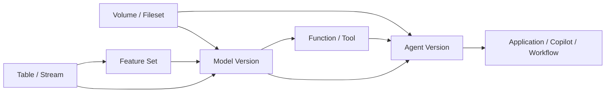
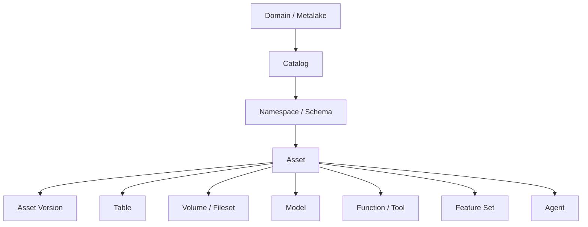

# AI 时代 Catalog Service 统一治理非表资产方案摘要

更新日期：2026-05-06

## 执行摘要

本文是 `ai-asset` 目录下的汇报摘要版，目标是用一份较短文档回答三个问题：

1. 为什么 Catalog Service 需要引入非表资产治理
2. 推荐的数据模型和治理主线是什么
3. 技术落地时建议按什么顺序推进

本文不展开长篇场景推演、完整表设计和 API 细节。对应专题内容请分别阅读：

- [catalog-service-ai-non-table-assets-necessity-and-scenarios.md](./catalog-service-ai-non-table-assets-necessity-and-scenarios.md)
- [catalog-service-ai-non-table-assets-data-model-design.md](./catalog-service-ai-non-table-assets-data-model-design.md)
- [catalog-service-non-table-assets-rest-api-design.md](./catalog-service-non-table-assets-rest-api-design.md)
- [catalog-service-ai-non-table-assets-technical-solution.md](./catalog-service-ai-non-table-assets-technical-solution.md)

---

## 1. 核心判断

过去 Catalog Service 主要解决“有哪些表、表在哪里、谁能访问、表之间如何依赖”。  
但在 AI 时代，真实业务链路已经演进为：

`data -> feature -> model -> tool -> agent -> application`

如果 Catalog Service 仍然只识别表资产，就会出现以下问题：

- 模型、知识库、工具、Agent 无法统一发现
- 端到端依赖链断裂，无法完成影响分析
- 权限、审计、发布、审批分散在多个系统中
- 资产复用效率低，重复建设严重

因此，Catalog Service 需要从“表目录”演进为“统一资产控制面”。

建议纳入的一等资产包括：

- `table`
- `volume/fileset`
- `feature_set`
- `model`
- `function/tool`
- `agent`

---

## 2. 推荐方案

### 2.1 推荐对象层级

推荐统一主线如下：

`domain(or metalake) -> catalog -> namespace(schema) -> asset -> asset_version`

其中：

- `domain`：组织、租户或环境边界
- `catalog`：资产治理空间
- `namespace`：catalog 下的逻辑分组
- `asset`：统一资产身份
- `asset_version`：统一治理版本

### 2.2 推荐建模原则

推荐遵循以下四个原则：

1. 统一资产主线：所有一等资产先进入统一 `asset` 体系
2. 强语义字段结构化：高频查询、授权、审批字段不能长期塞进 `properties_json`
3. 版本治理统一：所有需要审批、发布、回滚的对象共享统一 `asset_versions`
4. 横切治理单独建模：关系、权限、策略、绑定、审计、事件独立建表

### 2.3 推荐数据模型结构

建议采用三层结构：

1. 统一资产核
   - `domains / catalogs / namespaces / assets / asset_versions`
2. 类型扩展层
   - `table_assets / volume_assets / model_assets / function_assets / feature_set_assets / agent_assets`
3. 横切治理层
   - `relations / grants / policies / policy_bindings / external_bindings / audit_logs / event_outbox`

一句话总结：

**用统一 `assets` 承接共性，用类型扩展表承接差异，用统一治理层承接依赖、权限和审计。**

---

## 3. 关键参考判断

### 3.1 Unity Catalog 的启发

适合作为以下方面的参考：

- 面向用户的对象目录体验
- `catalog -> schema -> object` 层级组织
- `volume / function / model` 作为正式对象的产品化呈现

### 3.2 Gravitino 的启发

适合作为以下方面的参考：

- 统一元对象抽象
- 审计、软删除、版本等治理字段设计
- 面向平台的统一治理思路

### 3.3 最终取舍

推荐不是直接照抄其中任意一个，而是：

- 吸收 Unity Catalog 的对象体验和层级心智
- 吸收 Gravitino 的统一治理抽象
- 在此基础上补齐统一 `asset`、统一 `asset_version`、统一 `relations` 能力

---

## 4. 两张关键图

### 4.1 业务链路图

这张图表达的是：  
Catalog Service 不再只需要看见表，而要能看见数据到模型、工具、Agent 的完整链路。

### 4.2 推荐对象层级图

这张图表达的是：  
所有对象先进入统一 `asset` 主干，再通过类型扩展表达差异。

---

## 5. 为什么推荐统一 `asset`

如果继续采用“每类对象一套完全独立主表”的方式，短期实现会更直接，但中长期会遇到几个问题：

- 跨类型搜索和聚合查询复杂
- 统一权限和统一审批难落地
- 关系图谱无法围绕统一主键建立
- 新增资产类型时会重复接入治理能力

而采用“统一资产主表 + 类型扩展表”的方式，优势更明显：

- 统一搜索更容易
- 统一授权和审批更自然
- 统一关系图更清晰
- 新资产类型接入成本更低

因此，推荐主干设计为：

**统一资产核承接共性，类型扩展表承接强语义。**

---

## 6. 为什么关系和治理能力要单独建模

`model` 依赖 `feature_set`、`agent` 使用 `tool`、`tool` 读取 `volume`，这些都不是某个资产自己的内部属性，而是资产之间的边。

同样地，以下能力也天然是横切的：

- 授权
- 审批
- 风险策略
- 外部绑定
- 审计
- 事件分发

如果这些能力被分散塞进各类资产表中，会导致：

- 设计重复
- 语义不统一
- 查询复杂
- 新资产接入成本高

因此推荐单独建设：

- `relations`
- `grants`
- `policies`
- `policy_bindings`
- `external_bindings`
- `audit_logs`
- `event_outbox`

---

## 7. 推荐 API 方向

REST API 建议采用“双层设计”：

- 对外保留对象型 API
  - `/models`
  - `/functions`
  - `/volumes`
  - `/feature-sets`
  - `/agents`
- 对内沉淀统一治理主线
  - `/assets`
  - `/asset-versions`
  - `/relations`
  - `/grants`
  - `/policies`
  - `/bindings`

这样可以同时满足：

- 面向用户的对象语义清晰
- 面向平台的治理逻辑统一

### 7.1 对外对象 API

建议对外保留按对象类型组织的资源，便于用户理解和接入：

- `/models`
- `/functions`
- `/tools`
- `/volumes`
- `/feature-sets`
- `/agents`

这些接口主要负责：

- 创建和查询具体对象
- 承接对象类型特有字段
- 保留清晰的产品化语义

### 7.2 对内统一治理 API

建议将平台级治理能力沉淀在统一资源主线上：

- `/assets`
- `/asset-versions`
- `/relations`
- `/grants`
- `/policies`
- `/policy-bindings`
- `/bindings`

这些接口主要负责：

- 统一版本治理
- 统一关系表达
- 统一授权与策略绑定
- 统一外部系统绑定

### 7.3 推荐资源映射关系

建议通过对象型 API 编排统一治理资源，形成如下映射关系：

| 对外对象 API | 内部统一治理资源 |
|---|---|
| `/models` | `assets + asset_versions + model_assets + model_version_details` |
| `/functions` | `assets + asset_versions + function_assets + function_version_details` |
| `/tools` | `assets + asset_versions + function_assets + function_version_details` |
| `/volumes` | `assets + volume_assets (+ asset_versions)` |
| `/feature-sets` | `assets + asset_versions + feature_set_assets + feature_version_details` |
| `/agents` | `assets + asset_versions + agent_assets + agent_version_details` |

这样设计的核心含义是：

- 对用户看到的是清晰对象
- 对平台复用的是统一治理能力

### 7.4 推荐的统一版本动作

非表资产普遍需要统一的版本动作，建议沉淀为通用接口：

- `POST /api/v1/asset-versions/{id}:submit`
- `POST /api/v1/asset-versions/{id}:approve`
- `POST /api/v1/asset-versions/{id}:publish`
- `POST /api/v1/asset-versions/{id}:deprecate`
- `POST /api/v1/assets/{assetId}:rollback`

同时允许保留少量对象专属动作，例如：

- model 的 alias 管理
- function/tool 的测试动作
- feature set 的校验动作
- agent 的评测和发布动作

### 7.5 推荐的 V1 API 范围

如果首期需要控制范围，建议 V1 至少覆盖：

- 组织与命名空间接口
- `assets`
- `asset_versions`
- `models / functions / volumes / feature-sets / agents`
- `relations`
- `grants`
- `policies`
- `bindings`

更完整的接口清单和 OpenAPI 示例，见：
[catalog-service-non-table-assets-rest-api-design.md](./catalog-service-non-table-assets-rest-api-design.md)

---

## 8. 技术落地边界

Catalog Service 推荐定位为控制面，而不是执行面。

它负责：

- 资产注册
- 元数据管理
- 版本治理
- 关系建模
- 权限与策略
- 审计与事件
- 外部绑定

它不负责：

- 模型推理
- 特征实时服务
- Tool 执行
- Agent Runtime
- 长流程编排执行

与外部系统的交互建议通过 `external_bindings + event_outbox` 解耦，不与主事务强绑定。

---

## 9. 推荐实施顺序

### 阶段一：统一资产核

先落：

- `domains`
- `catalogs`
- `namespaces`
- `assets`
- `asset_versions`

先纳入：

- `table`
- `volume`
- `model`
- `function`

### 阶段二：补齐横切治理能力

增加：

- `relations`
- `external_bindings`
- `policies`
- `policy_bindings`
- `grants`
- `audit_logs`
- `event_outbox`

### 阶段三：引入 AI-native 对象

纳入：

- `feature_set`
- `agent`

### 阶段四：增强搜索与图谱能力

逐步补齐：

- 统一搜索
- 图谱查询
- 影响分析
- 变更推荐
- Agent 依赖审计

---

## 10. 结论

AI 时代 Catalog Service 的关键变化，不是“多了几种对象”，而是治理边界发生了变化。

它不再只是表目录，而应成为统一资产控制面。

最终推荐方向可以概括为：

**以统一 `asset` 和 `asset_version` 为主干，以类型扩展表承接强语义，以统一关系和治理层串起数据、模型、工具、Agent 的完整治理链路。**
