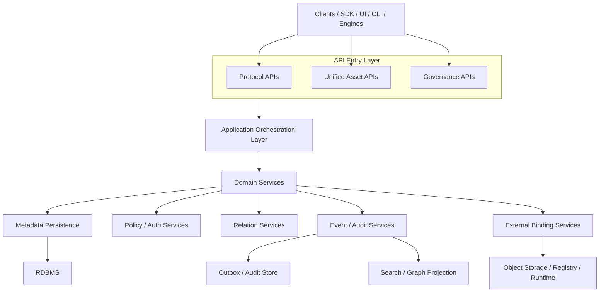
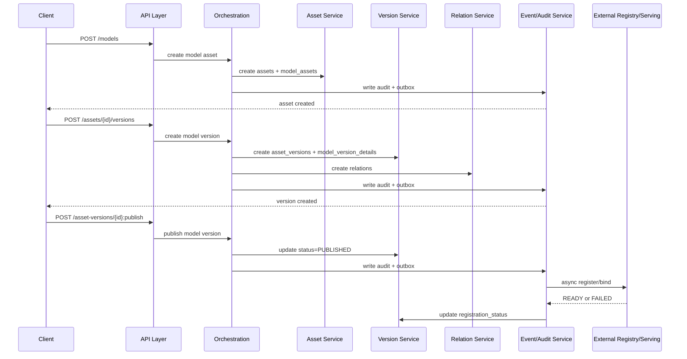
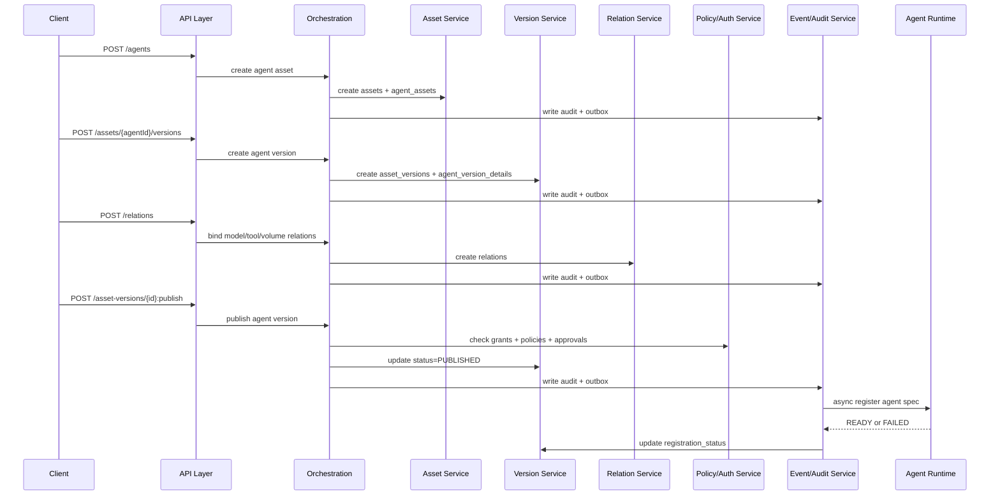

# Catalog Service 非表资产治理工程落地方案

更新日期：2026-05-06

## 1. 文档定位

本文只回答工程落地问题，不重复展开：

- 为什么要引入非表资产
- 完整数据模型细节
- 完整 REST API 清单

对应专题文档请参考：

- [catalog-service-ai-non-table-assets-necessity-and-scenarios.md](./catalog-service-ai-non-table-assets-necessity-and-scenarios.md)
- [catalog-service-ai-non-table-assets-data-model-design.md](./catalog-service-ai-non-table-assets-data-model-design.md)
- [catalog-service-non-table-assets-rest-api-design.md](./catalog-service-non-table-assets-rest-api-design.md)
- [catalog-service-ai-non-table-assets-report.md](./catalog-service-ai-non-table-assets-report.md)

本文聚焦四件事：

1. 系统架构怎么分层
2. 模块边界怎么划分
3. 事务、事件、外部绑定怎么处理
4. 研发如何分阶段推进

---

## 2. 核心定位

Catalog Service 的推荐定位是：

**统一资产元数据控制面，而不是执行平台。**

它负责：

- 资产注册
- 元数据管理
- 版本治理
- 关系建模
- 权限与策略
- 审计与事件
- 外部绑定

它不负责：

- 模型训练与推理
- 特征实时服务
- Tool 执行引擎
- Agent Runtime
- 长流程编排执行

这条边界很重要。工程实现上应始终坚持：

- Catalog 管控制面
- 外部系统管执行面

---

## 3. 总体架构

### 3.1 架构分层

建议采用以下分层：

1. API 入口层
2. 应用编排层
3. 领域服务层
4. 持久化与集成层
5. 外部系统层

### 3.2 分层职责

#### API 入口层

负责：

- 协议接入
- 鉴权前置
- 路由分发
- 统一响应包装

建议至少承接三类入口：

- 协议兼容 API
- 统一资产 API
- 管理治理 API

#### 应用编排层

负责：

- 参数校验
- 幂等控制
- 命名空间解析
- 事务编排
- 调用领域服务

这一层不沉淀核心业务状态，只负责把请求组织正确。

#### 领域服务层

负责：

- 资产领域语义
- 版本状态流转
- 关系处理
- 权限判定
- 策略判定
- 外部绑定状态管理

#### 持久化与集成层

负责：

- 元数据持久化
- 审计落库
- Outbox 事件落库
- 搜索索引投影
- 外部系统连接器

#### 外部系统层

典型对象包括：

- 对象存储
- Model Registry
- Feature Platform
- Function Runtime
- Agent Runtime

这些系统只通过绑定和事件与 Catalog 交互，不直接进入主事务。

### 3.3 架构关系图

---

## 4. 模块拆分建议

建议至少拆成以下模块。

### 4.1 `catalog-core`

负责：

- `domain / catalog / namespace`
- 命名空间解析
- 隔离边界校验

### 4.2 `asset-service`

负责：

- `assets`
- 资产创建、更新、下线
- 类型扩展对象挂接

### 4.3 `version-service`

负责：

- `asset_versions`
- 提交、审批、发布、回滚、废弃
- 类型化版本明细写入

### 4.4 `relation-service`

负责：

- `relations`
- 上下游关系查询
- 图谱投影

### 4.5 `policy-service`

负责：

- `policies`
- `policy_bindings`
- 规则校验

### 4.6 `auth-service`

负责：

- 主体识别
- 角色解析
- `grants` 判定
- 动作级授权

### 4.7 `credential-service`

负责：

- 临时凭证签发
- 凭证引用管理
- 凭证策略执行

### 4.8 `event-service`

负责：

- `event_outbox`
- 事件投递
- 重试和补偿
- 审计联动

### 4.9 `integration-service`

负责：

- `external_bindings`
- 外部系统注册与回写
- 同步状态维护

---

## 5. 存储与基础设施建议

### 5.1 推荐存储分工

| 组件 | 主要职责 |
|---|---|
| RDBMS | 元数据、版本、关系、授权、策略、审计、Outbox |
| Search | 关键字检索、筛选、聚合浏览 |
| Graph Layer | 复杂依赖遍历和影响分析 |
| Object Storage | 工件、快照、说明文档、大对象 |

### 5.2 为什么以 RDBMS 为主

一期最关键的是：

- 事务一致性
- 治理状态可追溯
- 审计闭环
- 事件可靠投递

所以建议以 RDBMS 作为控制面真相源。  
搜索和图能力都应建立在主存储之上，而不是反过来驱动主事务。

---

## 6. 事务与一致性

### 6.1 总体原则

不建议追求 Catalog 与外部系统之间的分布式强事务。  
推荐采用：

**本地事务 + Outbox + 异步同步 + 状态回写**

### 6.2 必须进入同一本地事务的内容

以下对象建议在同一本地事务中提交：

- `assets`
- `asset_versions`
- `relations`
- `grants`
- `policy_bindings`
- `external_bindings` 的登记记录
- `audit_logs`
- `event_outbox`

### 6.3 不建议纳入主事务的外部动作

以下动作建议异步处理：

- 上传模型工件
- 调外部 Model Registry 注册版本
- 调外部 Feature Platform 建立 serving binding
- 调 Runtime 注册 Tool
- 调 Agent Runtime 发布 Agent spec

### 6.4 状态拆分建议

建议至少拆成两类状态：

- `status`
  - 治理状态，如 `DRAFT/APPROVED/PUBLISHED/DEPRECATED`
- `registration_status`
  - 外部落地状态，如 `PENDING/READY/FAILED`

这样能清晰表达：

- 治理流程通过，但外部系统未就绪
- 元数据已创建，但外部注册失败
- 已发布，但外部 binding 尚未生效

### 6.5 推荐模式

#### 模式一：本地事务 + Outbox

适用于大多数资产变更：

1. 写主记录
2. 写关系或授权
3. 写审计
4. 写 Outbox
5. 提交事务
6. 异步消费事件

#### 模式二：Saga / 补偿式流程

适用于外部依赖较多的发布动作，例如 Agent 发布。

#### 模式三：最终一致性

适用于外部注册和运行时绑定。  
重点不是一步完成，而是：

- 状态可见
- 失败可重试
- 过程可审计

### 6.6 按资产类型的事务建议

| 资产类型 | 本地事务内必须完成 | 异步阶段建议完成 | 失败后的主要回写 |
|---|---|---|---|
| `MODEL` | `assets`、`asset_versions`、`model_version_details`、`relations`、`audit_logs`、`event_outbox` | 注册外部 registry、校验 artifact 可访问、绑定 serving | `registration_status=FAILED`，记录失败原因 |
| `FUNCTION/TOOL` | `assets`、`asset_versions`、`function_version_details`、`relations`、`audit_logs`、`event_outbox` | 注册 runtime、校验执行定义、同步 binding | `registration_status=FAILED`，保留可重试上下文 |
| `FEATURE_SET` | `assets`、`asset_versions`、`feature_version_details`、`relations`、`policies`、`audit_logs`、`event_outbox` | 同步 feature platform、校验 serving binding、生效 freshness/quality 投影 | `registration_status=FAILED`，标记 serving 未就绪 |
| `AGENT` | `assets`、`asset_versions`、`agent_version_details`、`relations`、`policy_bindings`、`audit_logs`、`event_outbox` | 注册 agent runtime、校验依赖完整性、绑定 memory/runtime | `registration_status=FAILED`，保留失败链路和重试入口 |

---

## 7. 事件与审计

### 7.1 事件模型

建议所有关键治理动作产出结构化事件，例如：

- `ASSET_CREATED`
- `ASSET_UPDATED`
- `ASSET_VERSION_CREATED`
- `ASSET_VERSION_PUBLISHED`
- `RELATION_CREATED`
- `BINDING_CREATED`
- `POLICY_BOUND`

### 7.2 审计模型

审计建议独立于普通日志，最少包含：

- 操作者
- 动作
- 资源类型
- 资源 ID
- 资源版本 ID
- 请求链路 ID
- 结果
- 细节
- 时间

### 7.3 事件与审计的区别

- 事件：面向系统协作与异步消费
- 审计：面向追责、排障和合规留痕

两者都重要，但不能互相替代。

---

## 8. 权限与策略落地建议

### 8.1 授权模型

建议统一动作模型，不按对象分别发明权限结构。

典型动作包括：

- `READ_METADATA`
- `READ_DATA`
- `WRITE_METADATA`
- `EXECUTE`
- `APPROVE`
- `PUBLISH`
- `GOVERN`
- `DELETE`

### 8.2 策略模型

策略建议独立建模，典型类型包括：

- `APPROVAL`
- `QUALITY`
- `RISK`
- `RETENTION`
- `GUARDRAIL`

### 8.3 推荐做法

- `grant` 管谁可以做什么
- `policy` 管满足什么规则才能做
- `policy_binding` 管规则挂到哪里

---

## 9. 外部绑定建议

### 9.1 绑定对象

典型绑定目标包括：

- 对象存储路径
- Model Registry 版本
- Serving Endpoint
- Feature Serving 实例
- Agent Runtime 实例

### 9.2 绑定原则

- Catalog 记录绑定关系，不内嵌外部实现
- 同步动作采用异步流程
- 绑定失败要能回写状态并支持重试

---

## 10. 分阶段实施方案

### 10.1 Phase 0：Table Catalog 基座

目标：

- 稳定 `domain / catalog / namespace`
- 打稳表资产目录能力
- 夯实权限、审计、事件基础设施

### 10.2 Phase 1：Volume 与 Model

目标：

- 引入文件型资产
- 打通模型资产与版本治理
- 建立 table/volume/model 基础关系

### 10.3 Phase 2：Function / Tool

目标：

- 引入可执行能力资产
- 支持执行权限和运行时绑定
- 建立 Tool 与 Agent、Model、Data 的关系

### 10.4 Phase 3：Feature Governance

目标：

- 引入 `feature_set`
- 管理来源、刷新、质量和 serving binding 元数据

### 10.5 Phase 4：Agent Governance

目标：

- 引入 `agent`
- 支持依赖管理、审批、风险策略和 runtime 绑定

### 10.6 Phase 5：高级治理

目标：

- 搜索增强
- 图谱增强
- 更复杂的审计与合规视图

## 11. 端到端时序示例

这一节给研发和联调用，用来把“原则”翻译成“请求怎么走、哪些对象写入、哪些事件发出”。

### 11.1 创建并发布一个 Model Version

典型流程：

1. 客户端调用 `POST /api/v1/models`
2. 创建 `assets` 与 `model_assets`
3. 写入 `audit_logs`
4. 产出 `ASSET_CREATED`
5. 客户端调用 `POST /api/v1/assets/{assetId}/versions`
6. 创建 `asset_versions` 与 `model_version_details`
7. 建立 `relations`
8. 产出 `ASSET_VERSION_CREATED`
9. 客户端调用 `POST /api/v1/asset-versions/{id}:publish`
10. 更新 `status=PUBLISHED`
11. 异步注册外部 registry 或 serving
12. 回写 `registration_status=READY/FAILED`

### 11.2 创建一个 Tool 并绑定 Runtime

典型流程：

1. 调 `POST /api/v1/functions` 或 `POST /api/v1/tools`
2. 创建 `assets` 与 `function_assets`
3. 创建版本 `asset_versions` 与 `function_version_details`
4. 调 `POST /api/v1/bindings`
5. 写入 `external_bindings`
6. 异步向 runtime 注册定义
7. 回写 binding 状态

重点检查：

- 输入输出 schema 是否完整
- `runtime_type` 是否明确
- `side_effect_level` 是否已标注
- 是否需要审批才能发布

### 11.3 创建一个 Agent 并挂接 Model / Tool / Knowledge

典型流程：

1. 调 `POST /api/v1/agents`
2. 创建 `assets` 与 `agent_assets`
3. 调 `POST /api/v1/assets/{assetId}/versions`
4. 创建 `asset_versions` 与 `agent_version_details`
5. 调 `POST /api/v1/relations`
6. 建立：
   - `AGENT_VERSION USES MODEL_VERSION`
   - `AGENT_VERSION USES TOOL_VERSION`
   - `AGENT_VERSION READS VOLUME_VERSION`
7. 调 `POST /api/v1/asset-versions/{id}:publish`
8. 校验依赖、审批策略、风险等级
9. 异步向 agent runtime 注册 spec
10. 回写 `registration_status`

### 11.4 联调时最容易漏的检查点

建议联调 checklist 至少覆盖：

- 是否写入统一 `assets`
- 是否写入正确的类型扩展表
- 是否创建了统一 `asset_versions`
- 是否补齐关系边
- 是否写入 `audit_logs`
- 是否写入 `event_outbox`
- 异步失败后是否回写 `registration_status`

---

## 12. 主要风险与规避建议

### 12.1 风险：范围失控

表现：

- 一期同时做数据模型、搜索、图谱、运行时、编排

建议：

- 一期只做控制面主干

### 12.2 风险：Catalog 被做成执行平台

表现：

- 把 Tool 执行、模型推理、Agent 编排都堆进 Catalog

建议：

- 坚持控制面与执行面分离

### 12.3 风险：统一抽象过度

表现：

- 所有字段都压进一个大 JSON

建议：

- 共性归统一主干，个性归类型扩展表

### 12.4 风险：外部系统耦合过深

表现：

- 把外部注册和主事务强绑定

建议：

- 采用 Outbox 和状态回写，保持最终一致性

---

## 13. 推荐研发顺序

1. 先做统一元数据主干
   - `domain / catalog / namespace / asset / asset_version`
2. 再做治理横切能力
   - `relations / grants / policies / bindings / audit / event`
3. 再做首批非表资产接入
   - `volume / model / function`
4. 再做 AI-native 资产
   - `feature_set / agent`
5. 最后增强搜索、图谱和高级治理

---

## 14. 结论

工程落地的关键，不是把所有 AI 能力都做进 Catalog，而是先把统一资产控制面的骨架搭好。

一句话总结：

**先把元数据、版本、关系、授权、审计和事件这条主干做稳，再通过绑定和异步集成去连接外部模型、特征、工具和 Agent 运行体系。**
