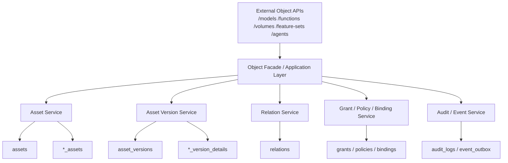

# 非表资产 Catalog Service REST API 设计建议

更新日期：2026-05-06

## 执行摘要

本文只回答 API 设计问题，不重复展开必要性论证、完整表设计和工程实施方案。

对应专题文档请参考：

- [catalog-service-ai-non-table-assets-necessity-and-scenarios.md](./catalog-service-ai-non-table-assets-necessity-and-scenarios.md)
- [catalog-service-ai-non-table-assets-data-model-design.md](./catalog-service-ai-non-table-assets-data-model-design.md)
- [catalog-service-ai-non-table-assets-technical-solution.md](./catalog-service-ai-non-table-assets-technical-solution.md)

本文聚焦一个具体问题：在 Catalog Service 纳入 `volume/fileset`、`model`、`function/tool`、`feature_set`、`agent` 等非表资产之后，REST API 应如何设计，才能同时满足面向用户的对象使用体验与面向平台的统一治理能力。

本文的核心判断如下：

- Unity Catalog 与 Gravitino 都已经支持部分非表资产 REST API，但两者都更偏“按对象类型提供资源接口”
- Unity Catalog 更偏面向用户的对象目录体验，API 风格更像对象型资源目录
- Gravitino 更偏面向平台的统一治理抽象，虽然对外仍按对象类型暴露接口，但内部语义更统一
- 如果我们的目标是 AI 时代统一治理非表资产的 Catalog Service，仅保留对象分散 API 还不够，需要进一步引入统一资产主线 API

推荐的 REST API 方向可以概括为：

- 对外保留类型化资源接口，保证对象体验清晰
- 对内建立统一 `assets / asset_versions / relations / grants / policies / bindings` 治理主线
- 形成“类型化对象 API + 统一治理 API”并存的双层设计

---

## 1. 设计背景与目标

在传统湖仓场景下，Catalog Service 的 REST API 主要围绕：

- `catalog`
- `schema`
- `table`
- `view`

展开。  
但在 AI 时代，Catalog Service 逐步纳入了更多非表资产，包括：

- `volume/fileset`
- `model`
- `function/tool`
- `feature_set`
- `agent`

这意味着 REST API 不再只服务于“表对象目录”，而需要支持以下更复杂的能力：

- 统一发现不同类型资产
- 统一管理资产版本
- 统一表达资产关系
- 统一执行授权、审批、发布和绑定动作
- 同时保持用户对不同资产类型的直观使用体验

因此，API 设计需要同时回答两个问题：

1. 面向用户，如何让不同非表资产仍然是容易理解、容易查找、容易操作的对象
2. 面向平台，如何让这些对象在版本、关系、权限、策略和审计层面走统一治理主线

---

## 2. 设计原则

针对非表资产的 REST API，建议遵循以下原则：

### 2.1 类型对象清晰

对用户而言，`model`、`function`、`volume`、`agent` 等对象应保持明确语义，而不是全部暴露为一个无差别的泛化资源。

### 2.2 治理主线统一

对平台而言，版本、关系、权限、策略、绑定、审计等横切治理能力应尽量通过统一 API 主线承接，而不应在每种资产类型上重复发明一套。

### 2.3 面向扩展

API 设计应支持后续新增：

- `prompt`
- `workflow`
- `evaluation`
- `dataset`
- `memory`

等 AI-native 资产类型，而不需要推翻整体接口风格。

### 2.4 对外体验与对内抽象分层

对外接口可以保留按对象类型组织的体验；  
但对内数据模型和治理能力应尽量围绕统一资产抽象组织。

---

## 3. Unity Catalog 的非表资产 REST API 设计

## 3.1 整体风格

Unity Catalog 的 REST API 更偏“按对象类型分别提供资源接口”。

也就是说，它不是先定义一个统一 `asset` 资源，再让所有对象挂在其下，而是直接围绕对象类型暴露接口，例如：

- `catalog`
- `schema`
- `volume`
- `function`
- `registered_model`
- `model_version`

它更像一组统一风格的对象资源 API，而不是统一资产主线 API。

## 3.2 对非表资产的典型设计方式

### `volume`

`volume` 作为 schema 下的一等对象存在，API 设计上通常会体现：

- 创建 volume
- 查询 volume
- 更新 volume 元数据
- 删除 volume

这种设计的特点是对象语义很明确，用户能够直观理解“这是一个目录型或文件型资产”。

### `function`

`function` 作为独立对象暴露，通常会有：

- 创建 function
- 查询 function
- 删除 function

其输入输出契约、参数和函数定义围绕 function 自身展开，而不是放入统一执行对象模型中。

### `registered_model` 与 `model_version`

这是 Unity Catalog 非表资产 API 中最有代表性的设计。

它把模型拆成两层：

- `registered_model`：模型本体
- `model_version`：模型版本

这意味着 model API 不是单一资源，而是：

- 先创建模型对象
- 再在模型对象下创建或查询版本对象

这种分层对用户来说很自然，也符合 model 生命周期特点。

## 3.3 这种设计的优点

- 对用户很直观
- 对象边界清晰
- 很适合 `catalog.schema.object` 目录型心智
- `volume / function / model` 等对象都可以作为正式目录对象来理解和使用

## 3.4 这种设计的局限

- 没有统一 `/assets` 主线
- 版本治理没有在所有对象上统一抽象
- 关系、权限、策略等能力更多依附于对象 API，而不是统一治理 API
- 如果后续继续纳入 `feature`、`agent`、`tool`，往往需要继续增加新的对象资源集合

## 3.5 对我们的启发

Unity Catalog 最值得借鉴的是：

- 面向用户的对象目录体验
- 清晰的命名空间层级
- `volume / function / model` 作为正式对象的产品化呈现方式

但它不适合作为统一治理 API 的完整参考。

---

## 4. Gravitino 的非表资产 REST API 设计

## 4.1 整体风格

Gravitino 的 REST API 对外看也主要是按对象类型暴露资源，例如：

- `fileset`
- `model`
- `function`
- `tag`
- `policy`

因此，Gravitino 对外也不是严格意义上的 unified asset API。

但它和 Unity Catalog 的差别在于：  
Gravitino 背后有更强的统一抽象，例如：

- `MetadataObject`
- `Entity`
- `SecurableObject`

这使得它虽然对外是对象型 API，但内部更接近统一治理平台。

## 4.2 对非表资产的典型设计方式

### `fileset`

`fileset` 是 Gravitino 对路径型或文件型资产的正式建模。  
它通常以独立对象资源暴露，而不是附着在 table 上。

### `model`

`model` 作为独立对象存在，并支持版本相关管理。  
相较 Unity Catalog，Gravitino 在内部对 version、properties、audit 和软删除的处理更统一。

### `function`

`function` 也是独立对象，并且具备较明显的版本化和定义管理语义。  
这说明它并不是把 function 仅仅看成 SQL 扩展，而是看成可治理对象。

### `tag / policy`

Gravitino 比 Unity Catalog 更自然地把治理型对象也暴露为 API 资源。  
这说明它的 REST API 不只关注数据对象，也关注治理对象。

## 4.3 这种设计的优点

- 更适合往统一治理平台演进
- 新增非表对象时更容易纳入统一元对象体系
- 更容易把权限、策略、审计等横切能力做成通用机制

## 4.4 这种设计的局限

- 对外仍然没有统一 `asset` 入口
- REST API 依然主要按对象类型分散组织
- 用户侧目录体验没有 Unity Catalog 那么强的产品感
- 对 `feature`、`agent` 这类 AI-native 对象也还不完整

## 4.5 对我们的启发

Gravitino 最值得借鉴的是：

- 内部统一抽象能力
- 统一治理字段与统一安全对象思路
- 非表资产进入主元数据体系，而不是作为外挂对象存在

相比 Unity Catalog，它更适合作为内部 API 统一治理设计的主参考。

---

## 5. Unity Catalog 与 Gravitino 的 REST API 对比

| 维度 | Unity Catalog | Gravitino | 对我们的启发 |
|---|---|---|---|
| API 整体风格 | 统一风格的对象资源 API | 建立在统一抽象上的对象资源 API | 对外可保留对象型 API |
| 是否有统一 `/assets` 主线 | 没有 | 没有 | 建议补充统一 `assets` 主线 |
| 非表对象覆盖 | `volume/function/model` 较成熟 | `fileset/model/function/tag/policy` 更系统 | 覆盖 `volume/model/function/tool/feature_set/agent` |
| 对用户的对象体验 | 更强 | 中等 | 对外对象体验可参考 Unity Catalog |
| 对内统一治理抽象 | 较弱 | 更强 | 对内治理抽象可参考 Gravitino |
| 统一版本治理 | 局部，主要在 model | 更统一，但仍按对象分散 | 建议统一 `asset_versions` |
| 统一关系治理 | 较弱 | 中等 | 建议单独设计 `relations` API |
| 统一权限/策略治理 | 偏对象型 | 治理抽象更强 | 建议单独设计 `grants / policies` API |

整体判断如下：

- Unity Catalog 更适合作为面向用户的对象 API 体验参考
- Gravitino 更适合作为面向平台的统一治理抽象参考
- 如果我们的目标是 AI 时代统一 Catalog Service，仅有对象型 API 还不够，需要进一步引入统一治理主线 API

---

## 6. 推荐的 REST API 设计方案

## 6.1 为什么采用“双层 API”设计

这里所说的“双层 API”，不是指要建设两套完全割裂的服务，而是指在同一套 Catalog Service 中区分两种视角：

- 面向用户的对象视角
- 面向平台的统一治理视角

对外，用户更容易理解的是：

- 创建一个 model
- 查询一个 function
- 发布一个 agent
- 查看一个 volume

因此，对外 API 更适合按对象类型组织，例如：

- `/models`
- `/functions`
- `/volumes`
- `/feature-sets`
- `/agents`

而对内，真正需要统一的不是对象名称本身，而是治理能力，包括：

- 统一版本治理
- 统一关系表达
- 统一授权控制
- 统一策略挂载
- 统一绑定、审计与事件分发

因此，对内应围绕统一治理主线组织，例如：

- `assets`
- `asset_versions`
- `relations`
- `grants`
- `policies`
- `bindings`

也就是说：

- 对外是“对象 API”
- 对内是“统一治理 API”

## 6.2 对外对象 API 与内部统一治理 API 的关系

这里的“内部统一治理 API”不一定要求物理上再走一次 HTTP 调用，更准确地说，它是一种统一资源模型和统一服务边界。

实践中通常有两种实现方式：

### 方式一：同一服务内的对象接口编排统一治理服务

例如：

`POST /models`

对外看是 model 接口，但内部实际会统一调用：

- 资产创建逻辑
- 类型扩展落库逻辑
- 审计记录逻辑
- 事件分发逻辑

也就是说，虽然入口是 `/models`，但底层不是 model 自己维护一整套独立治理逻辑，而是收敛到统一资产主线。

### 方式二：对象型 facade API 编排统一治理 API

如果系统拆分更细，也可以把对象 API 作为 facade，由其内部调用统一治理资源，例如：

- 先创建 `asset`
- 再创建 `asset_version`
- 再创建 `binding`
- 再写入 `relation`

这种方式更像真正意义上的“外部对象 API + 内部统一 API”。

两种方式本质上解决的是同一个问题：

**用户看到的是对象，平台内部复用的是统一治理能力。**

两种方式的主要区别在于：

- 方式一是在同一个服务内部，由对象接口直接编排统一治理服务，复用的是内部 service 或 module
- 方式二是把统一治理主线进一步抽成独立 API 或独立服务，由对象型 facade API 进行调用编排

前者实现更简单，适合一期建设；后者解耦更强，更适合后续平台化和服务化演进。

## 6.3 推荐的资源分层与映射关系

推荐的对外对象 API 与内部统一治理资源之间，可按下表理解：

| 对外对象 API | 内部统一治理资源 |
|---|---|
| `/models` | `assets + asset_versions + model_assets + model_version_details` |
| `/functions` | `assets + asset_versions + function_assets + function_version_details` |
| `/volumes` | `assets + volume_assets (+ asset_versions 可选)` |
| `/feature-sets` | `assets + asset_versions + feature_set_assets + feature_version_details` |
| `/agents` | `assets + asset_versions + agent_assets + agent_version_details` |

进一步看，所有对象共享同一批横切治理资源：

| 横切能力 | 统一治理资源 |
|---|---|
| 版本治理 | `asset_versions` |
| 关系治理 | `relations` |
| 授权治理 | `grants` |
| 策略治理 | `policies + policy_bindings` |
| 外部系统绑定 | `external_bindings` |
| 审计 | `audit_logs` |
| 事件分发 | `event_outbox` |

因此，双层 API 的核心不是做两套重复接口，而是：

- 对外保留对象型入口
- 对内复用统一治理资源

## 6.4 双层 API 调用关系图

可以用下面这张图来理解双层 API 的落地方式：



这张图表达的是：

- 对外入口仍然是用户容易理解的对象型 API
- 中间由对象 facade 或应用服务层负责组装调用
- 底层真正复用的是统一治理服务与统一数据模型
- 类型差异通过 `*_assets` 和 `*_version_details` 承接，横切治理能力通过统一资源承接

## 6.5 设计思路

推荐采用“双层 API”设计：

### 第一层：类型化对象 API

面向用户保留清晰对象体验，例如：

- `/models`
- `/functions`
- `/volumes`
- `/feature-sets`
- `/agents`

### 第二层：统一治理 API

面向平台提供统一治理主线，例如：

- `/assets`
- `/asset-versions`
- `/relations`
- `/grants`
- `/policies`
- `/bindings`

这样既能保留对象语义，又能避免治理能力分散在各类对象 API 里重复实现。

## 6.6 推荐的资源分层

### 组织与命名空间资源

- `GET /api/v1/domains`
- `GET /api/v1/catalogs`
- `GET /api/v1/namespaces`

### 统一资产资源

- `POST /api/v1/assets`
- `GET /api/v1/assets`
- `GET /api/v1/assets/{assetId}`
- `PATCH /api/v1/assets/{assetId}`
- `DELETE /api/v1/assets/{assetId}`

### 类型化对象资源

- `POST /api/v1/models`
- `GET /api/v1/models/{assetId}`
- `POST /api/v1/functions`
- `GET /api/v1/functions/{assetId}`
- `POST /api/v1/volumes`
- `GET /api/v1/volumes/{assetId}`
- `POST /api/v1/feature-sets`
- `GET /api/v1/feature-sets/{assetId}`
- `POST /api/v1/agents`
- `GET /api/v1/agents/{assetId}`

### 统一版本资源

- `POST /api/v1/assets/{assetId}/versions`
- `GET /api/v1/assets/{assetId}/versions`
- `GET /api/v1/asset-versions/{assetVersionId}`
- `PATCH /api/v1/asset-versions/{assetVersionId}`

### 统一关系资源

- `POST /api/v1/relations`
- `GET /api/v1/relations`
- `DELETE /api/v1/relations/{relationId}`

### 统一授权与策略资源

- `POST /api/v1/grants`
- `GET /api/v1/grants`
- `POST /api/v1/policies`
- `POST /api/v1/policy-bindings`

### 外部绑定资源

- `POST /api/v1/bindings`
- `GET /api/v1/bindings`
- `DELETE /api/v1/bindings/{bindingId}`

---

## 7. 典型请求链路示例

为了更直观地说明双层 API 的落地方式，下面给出几个典型请求链路示例。

## 7.1 创建 model

### 对外请求

```http
POST /api/v1/models
```

示例请求体：

```json
{
  "catalog": "ml",
  "namespace": "reco",
  "name": "user_ctr_model",
  "taskType": "RANKING",
  "framework": "XGBOOST",
  "owner": "reco_team"
}
```

### 内部落地

对外是 `/models`，但内部可统一拆解为：

1. 创建 `assets`
   - `asset_type = MODEL`
2. 创建 `model_assets`
3. 写入审计日志
4. 产生事件消息

这说明：

- 用户看到的是 model API
- 平台复用的是统一资产创建主线

## 7.2 创建 model version

### 对外请求

```http
POST /api/v1/models/{assetId}/versions
```

也可以支持统一版本入口：

```http
POST /api/v1/assets/{assetId}/versions
```

### 内部落地

内部统一拆解为：

1. 创建 `asset_versions`
2. 创建 `model_version_details`
3. 创建 `model_version_uris`
4. 创建 `model_version_aliases`
5. 写入审计日志
6. 产生事件消息

这说明：

- 对外仍然保留 model 视角
- 但版本治理已经统一复用 `asset_versions`

## 7.3 发布 agent version

### 对外请求

```http
POST /api/v1/agents/{assetId}/versions/{versionId}:publish
```

### 内部落地

内部统一拆解为：

1. 更新 `asset_versions.status`
2. 更新 `assets.current_version_id`
3. 校验关联 policy
4. 写入审计日志
5. 产生发布事件

这说明：

- 对外是 agent 发布动作
- 对内复用的是统一版本发布能力

## 7.4 给 model 绑定 serving

### 对外请求

```http
POST /api/v1/models/{assetId}/bindings
```

或统一入口：

```http
POST /api/v1/bindings
```

### 内部落地

1. 创建 `external_bindings`
2. 记录目标系统和绑定状态
3. 写入审计日志
4. 产生绑定事件

这说明：

- 对外可以保留类型对象入口
- 对内绑定能力统一复用

## 7.5 给 agent version 建立依赖关系

### 对外请求

```http
POST /api/v1/relations
```

示例请求体：

```json
{
  "relationType": "USES",
  "sourceAssetId": "agent_123",
  "sourceAssetVersionId": "agent_v5",
  "targetAssetId": "model_456",
  "targetAssetVersionId": "model_v12"
}
```

### 内部落地

1. 创建 `relations`
2. 触发依赖图更新
3. 写入审计日志

这说明：

- 关系能力不依附在单一对象类型内部
- 所有资产统一共享 `relations` 主线

---

## 8. OpenAPI 风格接口定义示例

下面给出三组示例接口，用于体现“双层 API”设计中：

- 对外对象型 API
- 统一版本治理 API
- 统一关系治理 API

这些示例不追求完整 OpenAPI 文档，而是作为接口风格参考。

## 8.1 `POST /api/v1/models`

```yaml
paths:
  /api/v1/models:
    post:
      summary: Create model asset
      operationId: createModel
      tags: [Models]
      requestBody:
        required: true
        content:
          application/json:
            schema:
              type: object
              required:
                - catalog
                - namespace
                - name
                - owner
              properties:
                catalog:
                  type: string
                namespace:
                  type: string
                name:
                  type: string
                displayName:
                  type: string
                description:
                  type: string
                owner:
                  type: string
                details:
                  type: object
                  properties:
                    taskType:
                      type: string
                    framework:
                      type: string
                    algorithm:
                      type: string
                    riskLevel:
                      type: string
      responses:
        '201':
          description: Created
          content:
            application/json:
              schema:
                $ref: '#/components/schemas/ModelAssetResponse'
```

这个接口体现的是：

- 对外仍然使用 `models` 资源
- 请求体中对象通用字段与类型特有字段分层表达
- 内部最终仍会落到 `assets + model_assets`

## 8.2 `POST /api/v1/assets/{assetId}/versions`

```yaml
paths:
  /api/v1/assets/{assetId}/versions:
    post:
      summary: Create asset version
      operationId: createAssetVersion
      tags: [AssetVersions]
      parameters:
        - name: assetId
          in: path
          required: true
          schema:
            type: string
      requestBody:
        required: true
        content:
          application/json:
            schema:
              type: object
              required:
                - version
              properties:
                version:
                  type: string
                versionLabel:
                  type: string
                description:
                  type: string
                details:
                  type: object
                  description: Type-specific version details
      responses:
        '201':
          description: Created
          content:
            application/json:
              schema:
                $ref: '#/components/schemas/AssetVersionResponse'
```

这个接口体现的是：

- 版本治理走统一主线
- 不同资产类型的版本差异通过 `details` 承接
- 内部最终会拆分到 `asset_versions + *_version_details`

## 8.3 `POST /api/v1/relations`

```yaml
paths:
  /api/v1/relations:
    post:
      summary: Create relation between assets
      operationId: createRelation
      tags: [Relations]
      requestBody:
        required: true
        content:
          application/json:
            schema:
              type: object
              required:
                - relationType
                - sourceAssetId
                - targetAssetId
              properties:
                relationType:
                  type: string
                  enum:
                    - DEPENDS_ON
                    - USES
                    - DERIVED_FROM
                    - BOUND_TO
                    - PRODUCES
                    - SERVES
                    - READS
                    - WRITES
                sourceAssetId:
                  type: string
                sourceAssetVersionId:
                  type: string
                targetAssetId:
                  type: string
                targetAssetVersionId:
                  type: string
                properties:
                  type: object
      responses:
        '201':
          description: Created
          content:
            application/json:
              schema:
                $ref: '#/components/schemas/RelationResponse'
```

这个接口体现的是：

- 关系能力不绑定在单一对象类型内部
- 所有资产统一共享 `relations` 主线
- 关系是统一治理能力，而不是对象的附属字段

## 8.4 统一响应 Schema 示例

```yaml
components:
  schemas:
    AssetBase:
      type: object
      properties:
        assetId:
          type: string
        assetType:
          type: string
        qualifiedName:
          type: string
        displayName:
          type: string
        owner:
          type: string
        status:
          type: string
        properties:
          type: object

    ModelAssetResponse:
      allOf:
        - $ref: '#/components/schemas/AssetBase'
        - type: object
          properties:
            details:
              type: object
              properties:
                taskType:
                  type: string
                framework:
                  type: string
                algorithm:
                  type: string
                riskLevel:
                  type: string

    AssetVersionResponse:
      type: object
      properties:
        assetVersionId:
          type: string
        assetId:
          type: string
        version:
          type: string
        versionLabel:
          type: string
        status:
          type: string
        details:
          type: object

    RelationResponse:
      type: object
      properties:
        relationId:
          type: string
        relationType:
          type: string
        sourceAssetId:
          type: string
        sourceAssetVersionId:
          type: string
        targetAssetId:
          type: string
        targetAssetVersionId:
          type: string
        properties:
          type: object
```

这个结构体现的是：

- 统一字段骨架稳定
- 类型差异通过 `details` 承接
- 关系资源独立成统一响应对象

---

## 9. 推荐的版本与动作接口

非表资产最关键的问题之一，是很多对象都有“版本”和“动作语义”，例如审批、发布、回滚、评测、切换。

因此建议把动作设计成统一版本动作接口，而不是每个对象重复发明一套。

推荐接口如下：

- `POST /api/v1/asset-versions/{id}:submit`
- `POST /api/v1/asset-versions/{id}:approve`
- `POST /api/v1/asset-versions/{id}:publish`
- `POST /api/v1/asset-versions/{id}:deprecate`
- `POST /api/v1/assets/{assetId}:rollback`

同时允许部分对象保留类型专属动作，例如：

- `POST /api/v1/models/{assetId}/aliases`
- `POST /api/v1/functions/{assetId}/versions/{id}:test`
- `POST /api/v1/feature-sets/{assetId}/versions/{id}:validate`
- `POST /api/v1/agents/{assetId}/versions/{id}:evaluate`

这种模式的好处是：

- 版本治理动作统一
- 对象特有动作仍可按类型扩展
- 用户体验与治理一致性兼顾

---

## 10. 推荐的响应结构

建议统一响应骨架，再通过 `details` 或 `versionDetails` 承接类型差异。

### 资产响应示例

```json
{
  "assetId": "model_123",
  "assetType": "MODEL",
  "qualifiedName": "prod.ml.reco.user_ctr_model",
  "status": "ACTIVE",
  "owner": "reco_team",
  "properties": {},
  "details": {
    "taskType": "RANKING",
    "framework": "XGBOOST"
  }
}
```

### 版本响应示例

```json
{
  "assetVersionId": "model_ver_12",
  "assetId": "model_123",
  "version": "v12",
  "status": "PUBLISHED",
  "versionLabel": "prod",
  "versionDetails": {
    "metrics": {
      "auc": 0.82
    },
    "artifactUri": "s3://bucket/model/v12"
  }
}
```

这样的设计可以同时满足：

- 统一治理字段稳定
- 类型字段保持清晰
- 后续新增类型时兼容性更好

---

## 11. 推荐方案的优点与注意点

## 11.1 优点

- 同时保留了面向用户的对象型 API 和面向平台的统一治理主线
- 更适合支持未来更多 AI-native 资产
- 统一版本、关系、权限、策略能力可以横向复用
- 对外对象语义清晰，不会因为统一抽象而完全失去类型感

## 11.2 注意点

- 不建议让统一 `/assets` 完全取代类型化对象 API，否则用户体验会变差
- 不建议让每个对象自己定义一套版本、审批、关系接口，否则治理能力会重新分散
- 不建议把所有类型字段都揉进统一资产响应顶层，否则接口会失去清晰边界

推荐的取舍是：

**对外对象清晰，对内治理统一。**

---

## 12. 结论

从现有开源实践看，Unity Catalog 和 Gravitino 都已经支持一定程度的非表资产 REST API，但整体仍然以“对象类型 API”为主，而不是“统一资产主线 API”。

其中：

- Unity Catalog 更适合作为面向用户的对象目录体验参考
- Gravitino 更适合作为面向平台的统一治理抽象参考

如果我们的目标是 AI 时代统一治理非表资产的 Catalog Service，推荐在两者基础上进一步演进，采用：

- **类型化对象 API**
- **统一治理 API**

并存的双层设计。

一句话总结：

**面向用户，非表资产仍然应是清晰可见的对象；面向平台，这些对象应统一纳入 `assets / asset_versions / relations / grants / policies / bindings` 的治理主线。**

---

## 13. 推荐完整 API 清单

下面给出一版适合作为 V1 讨论基础的完整 API 清单。  
其中：

- 组织与命名空间接口负责对象归属和路径组织
- 对象接口负责面向用户的资源体验
- 统一治理接口负责版本、关系、权限、策略、绑定等横切能力

## 13.1 接口目录总览表

| 分类 | 资源 | 主要接口 | 主要用途 |
|---|---|---|---|
| 组织层 | `domains` | `POST/GET/PATCH/DELETE /domains` | 管理组织或环境边界 |
| 组织层 | `catalogs` | `POST/GET/PATCH/DELETE /catalogs` | 管理资产空间 |
| 组织层 | `namespaces` | `POST/GET/PATCH/DELETE /namespaces` | 管理 catalog 内分组 |
| 统一资产层 | `assets` | `POST/GET/PATCH/DELETE /assets` | 管理统一资产身份与共性字段 |
| 统一版本层 | `asset_versions` | `POST /assets/{id}/versions`、`GET /asset-versions/{id}` | 管理统一版本治理主线 |
| 统一版本动作 | `asset version actions` | `:submit` `:approve` `:publish` `:deprecate` `:rollback` | 承接统一版本状态流转 |
| 对象层 | `models` | `POST/GET/PATCH/DELETE /models` | 面向用户管理模型资产 |
| 对象层 | `functions` | `POST/GET/PATCH/DELETE /functions` | 面向用户管理函数与工具 |
| 对象层 | `volumes` | `POST/GET/PATCH/DELETE /volumes` | 面向用户管理文件型资产 |
| 对象层 | `feature-sets` | `POST/GET/PATCH/DELETE /feature-sets` | 面向用户管理特征集资产 |
| 对象层 | `agents` | `POST/GET/PATCH/DELETE /agents` | 面向用户管理 Agent 资产 |
| 关系层 | `relations` | `POST/GET/DELETE /relations` | 管理统一依赖关系 |
| 图查询层 | `graph queries` | `/assets/{id}/upstreams` `/downstreams` `/graph` | 查询上下游与依赖图 |
| 授权层 | `grants` | `POST/GET/DELETE /grants` | 管理统一授权 |
| 策略层 | `policies` | `POST/GET/PATCH/DELETE /policies` | 管理治理策略定义 |
| 策略挂载层 | `policy_bindings` | `POST/GET/DELETE /policy-bindings` | 管理策略与资源绑定 |
| 绑定层 | `bindings` | `POST/GET/PATCH/DELETE /bindings` | 管理外部运行时、注册中心、服务绑定 |

## 13.2 组织与命名空间接口

### Domains

- `POST /api/v1/domains`
- `GET /api/v1/domains`
- `GET /api/v1/domains/{domainId}`
- `PATCH /api/v1/domains/{domainId}`
- `DELETE /api/v1/domains/{domainId}`

### Catalogs

- `POST /api/v1/catalogs`
- `GET /api/v1/catalogs`
- `GET /api/v1/catalogs/{catalogId}`
- `PATCH /api/v1/catalogs/{catalogId}`
- `DELETE /api/v1/catalogs/{catalogId}`

### Namespaces

- `POST /api/v1/namespaces`
- `GET /api/v1/namespaces`
- `GET /api/v1/namespaces/{namespaceId}`
- `PATCH /api/v1/namespaces/{namespaceId}`
- `DELETE /api/v1/namespaces/{namespaceId}`

## 13.3 统一资产接口

### Assets

- `POST /api/v1/assets`
- `GET /api/v1/assets`
- `GET /api/v1/assets/{assetId}`
- `PATCH /api/v1/assets/{assetId}`
- `DELETE /api/v1/assets/{assetId}`

建议列表接口支持如下查询参数：

- `assetType`
- `catalog`
- `namespace`
- `owner`
- `status`
- `tag`
- `keyword`

### Asset Versions

- `POST /api/v1/assets/{assetId}/versions`
- `GET /api/v1/assets/{assetId}/versions`
- `GET /api/v1/asset-versions/{assetVersionId}`
- `PATCH /api/v1/asset-versions/{assetVersionId}`

### Asset Version Actions

- `POST /api/v1/asset-versions/{assetVersionId}:submit`
- `POST /api/v1/asset-versions/{assetVersionId}:approve`
- `POST /api/v1/asset-versions/{assetVersionId}:publish`
- `POST /api/v1/asset-versions/{assetVersionId}:deprecate`
- `POST /api/v1/assets/{assetId}:rollback`

## 13.4 面向用户的对象接口

### Models

- `POST /api/v1/models`
- `GET /api/v1/models`
- `GET /api/v1/models/{assetId}`
- `PATCH /api/v1/models/{assetId}`
- `DELETE /api/v1/models/{assetId}`
- `POST /api/v1/models/{assetId}/versions`
- `GET /api/v1/models/{assetId}/versions`
- `POST /api/v1/models/{assetId}/aliases`
- `GET /api/v1/models/{assetId}/aliases`

### Functions / Tools

- `POST /api/v1/functions`
- `GET /api/v1/functions`
- `GET /api/v1/functions/{assetId}`
- `PATCH /api/v1/functions/{assetId}`
- `DELETE /api/v1/functions/{assetId}`
- `POST /api/v1/functions/{assetId}/versions`
- `GET /api/v1/functions/{assetId}/versions`
- `POST /api/v1/functions/{assetId}/versions/{assetVersionId}:test`

如果需要单独强调 tool，也可以提供：

- `POST /api/v1/tools`
- `GET /api/v1/tools`
- `GET /api/v1/tools/{assetId}`

但更推荐内部统一为 `function/tool` 父模型，对外按产品需求决定是否拆分。

### Volumes

- `POST /api/v1/volumes`
- `GET /api/v1/volumes`
- `GET /api/v1/volumes/{assetId}`
- `PATCH /api/v1/volumes/{assetId}`
- `DELETE /api/v1/volumes/{assetId}`

### Feature Sets

- `POST /api/v1/feature-sets`
- `GET /api/v1/feature-sets`
- `GET /api/v1/feature-sets/{assetId}`
- `PATCH /api/v1/feature-sets/{assetId}`
- `DELETE /api/v1/feature-sets/{assetId}`
- `POST /api/v1/feature-sets/{assetId}/versions`
- `GET /api/v1/feature-sets/{assetId}/versions`
- `POST /api/v1/feature-sets/{assetId}/versions/{assetVersionId}:validate`

### Agents

- `POST /api/v1/agents`
- `GET /api/v1/agents`
- `GET /api/v1/agents/{assetId}`
- `PATCH /api/v1/agents/{assetId}`
- `DELETE /api/v1/agents/{assetId}`
- `POST /api/v1/agents/{assetId}/versions`
- `GET /api/v1/agents/{assetId}/versions`
- `POST /api/v1/agents/{assetId}/versions/{assetVersionId}:evaluate`
- `POST /api/v1/agents/{assetId}/versions/{assetVersionId}:publish`

## 13.5 统一关系接口

### Relations

- `POST /api/v1/relations`
- `GET /api/v1/relations`
- `GET /api/v1/relations/{relationId}`
- `DELETE /api/v1/relations/{relationId}`

### Graph / Dependency Queries

- `GET /api/v1/assets/{assetId}/upstreams`
- `GET /api/v1/assets/{assetId}/downstreams`
- `GET /api/v1/assets/{assetId}/graph`

## 13.6 统一授权与策略接口

### Grants

- `POST /api/v1/grants`
- `GET /api/v1/grants`
- `GET /api/v1/grants/{grantId}`
- `DELETE /api/v1/grants/{grantId}`

也可以提供资源视角接口：

- `GET /api/v1/assets/{assetId}/grants`
- `POST /api/v1/assets/{assetId}/grants`

### Policies

- `POST /api/v1/policies`
- `GET /api/v1/policies`
- `GET /api/v1/policies/{policyId}`
- `PATCH /api/v1/policies/{policyId}`
- `DELETE /api/v1/policies/{policyId}`

### Policy Bindings

- `POST /api/v1/policy-bindings`
- `GET /api/v1/policy-bindings`
- `DELETE /api/v1/policy-bindings/{policyBindingId}`

也可以提供资源视角接口：

- `GET /api/v1/assets/{assetId}/policies`
- `POST /api/v1/assets/{assetId}/policies`

## 13.7 外部绑定接口

### Bindings

- `POST /api/v1/bindings`
- `GET /api/v1/bindings`
- `GET /api/v1/bindings/{bindingId}`
- `PATCH /api/v1/bindings/{bindingId}`
- `DELETE /api/v1/bindings/{bindingId}`

也可以提供资源视角接口：

- `GET /api/v1/assets/{assetId}/bindings`
- `POST /api/v1/assets/{assetId}/bindings`

## 13.8 推荐的最小 V1 范围

如果首期希望控制复杂度，建议最小范围如下：

### 必做

- `domains / catalogs / namespaces`
- `assets`
- `asset_versions`
- `models / functions / volumes / feature-sets / agents`
- `relations`
- `grants`
- `policies`
- `bindings`

### 二期增强

- `upstreams / downstreams / graph`
- 类型专属动作接口
- 更完整的资源视角接口
- 批量操作接口

这样可以先把统一治理主线和主要非表资产对象跑通，再逐步增强更复杂的图查询与治理动作。
