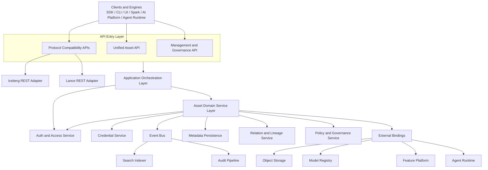
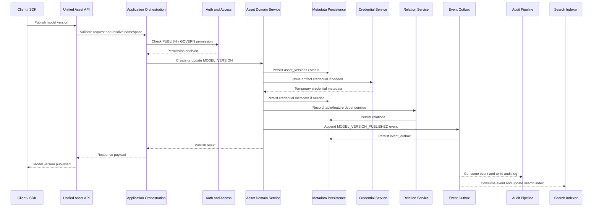
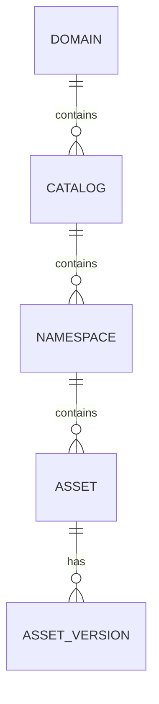
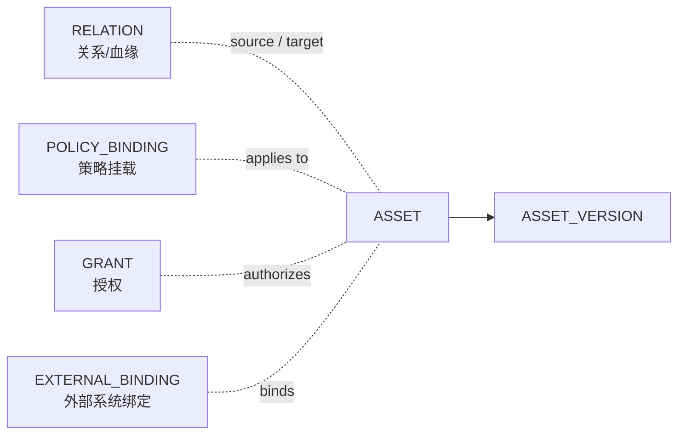
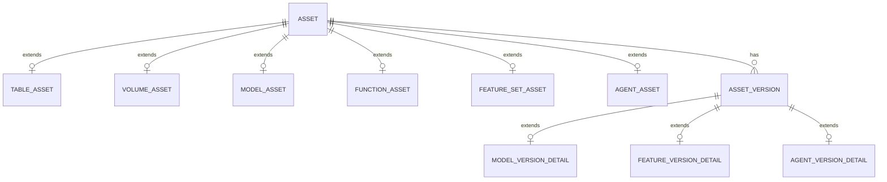

# Catalog Service 扩展技术方案

更新日期：2026-04-24

## 0. 文档说明

本文基于前期调研结论，给出自研 Catalog Service 从 `table catalog` 演进为统一资产控制面的研发落地方案。重点回答以下问题：

- 如何在不破坏表目录主路径的前提下，扩展到 `volume`、`model`、`function/tool`、`feature`、`agent` 等非表资产。
- 如何设计统一对象模型、权限模型、事件审计、关系血缘、凭证与外部绑定。
- 如何按阶段落地，避免首期范围过大或把 Catalog Service 做成执行平台。

如果读者有关系型数据库内核背景，可以先把本文方案粗略类比为“更通用的系统目录 + 权限系统 + 审计系统 + 元数据控制面”。传统数据库系统目录主要管理 table、index、view、function 等数据库对象；本文的 Catalog Service 则把管理范围扩展到 table、volume、model、feature set、function/tool、agent 等数据与 AI 资产。

---

## 1. 方案摘要

### 1.1 核心定位

Catalog Service 的目标不是直接建设一个“大而全 AI 平台”，而是建设一个可分阶段演进的 `metadata control plane`。它负责统一资产的注册、命名、授权、审计、发现、关系、生命周期和外部系统绑定，不直接承载模型推理、特征 Serving、Agent 编排等主要执行逻辑。

更直观地说，Catalog Service 负责回答“资产是什么、在哪里、谁负责、谁能用、依赖谁、谁用它、有没有审批和审计”这些问题；执行系统负责回答“怎么真正计算、推理、Serving 或编排执行”这些问题。

核心原则如下：

- `table-first`，但不是 `table-only`。
- 控制面与执行面分离，Catalog 管资产定义、元数据、关系和权限，Runtime 管执行。
- 统一对象模型优先于单点资产 CRUD。
- 统一权限、事件、审计、关系模型优先于高阶搜索和复杂血缘分析。
- `agent` 首先作为治理对象进入 Catalog，而不是作为运行时实例进入 Catalog。

### 1.2 推荐演进路线

| 阶段 | 主题 | 主要目标 |
|---|---|---|
| Phase 0 | Table Catalog 基座 | 做稳 domain/catalog/namespace、table/view、Iceberg REST、权限、凭证、事件审计 |
| Phase 1 | Volume 与 Model | 支持文件/工件类资产、模型注册、模型版本、模型工件引用和基础血缘 |
| Phase 2 | Function / Tool | 支持可调用能力的注册、授权、依赖关系和调用审计 |
| Phase 3 | Feature Governance | 支持 feature set、feature version、来源、质量、freshness 和 serving binding 元数据 |
| Phase 4 | Agent Governance | 支持 agent spec、版本、模型/工具/知识绑定、风险策略和审批 |
| Phase 5 | 高级治理 | 补齐统一搜索、血缘图、审计查询、sharing、federation、system tables |

### 1.3 首期最小可行范围

如果第一阶段目标是把统一控制面跑起来，建议首期优先落地以下主线：

- 主对象：`domains`、`catalogs`、`namespaces`、`assets`。
- 强版本化对象：`asset_versions`。
- 关系与血缘基础：`relations`。
- 权限控制：`principals`、`roles`、`grants`。
- 事件与审计：`event_outbox`、`audit_logs`。
- 外部接入：`external_bindings`。

搜索索引、图数据库加速、复杂审批编排、在线执行和 serving 能力可以后置，但统一主对象、版本、关系、授权、事件、审计这些基础结构最好从第一阶段就固定下来。

---

## 2. 范围与术语

### 2.1 设计目标

- 统一管理表与非表资产的元数据。
- 为多类资产提供统一命名空间、权限、策略、审计、事件、关系和生命周期管理。
- 保留开放表协议兼容能力，首期明确适配 Iceberg REST 与 Lance 协议。
- 支持接入外部 model registry、feature platform、agent runtime、object storage。
- 支持统一搜索与发现，但搜索可以作为异步索引能力逐步增强。
- 支持资产版本、审批、发布、回滚和治理状态流转。

### 2.2 非目标

- 首期不实现完整 feature store serving。
- 首期不实现 model serving。
- 首期不实现 agent runtime 或 workflow orchestration。
- 不承诺跨所有 asset/backend 的全局事务。
- 不把 Catalog Service 扩展成通用计算引擎。

上述非目标的含义是：首期 Catalog Service 不直接负责“运行”这些能力，而是负责登记和治理它们。例如，Catalog 可以记录 feature set 定义、模型版本、Agent spec、工件 URI、依赖关系、权限和审计，也可以通过 binding 对接外部 feature platform、model serving 或 agent runtime；但不在自身内部实现在线特征查询、模型推理服务、Agent 对话执行或长流程编排。

### 2.3 非表资产的直观理解

| 资产 | 直观定义 | Catalog 首期职责 | 不建议首期承载 |
|---|---|---|---|
| `model` | 模型资产 | 管模型身份、版本、工件 URI、负责人、审批状态、依赖关系 | 模型推理服务 |
| `feature` / `feature set` | 特征资产 | 管来源、计算定义、质量要求、版本、被哪些模型使用 | 在线/离线 feature serving 引擎 |
| `function` / `tool` | 可调用能力 | 管函数定义、输入输出、权限、运行后端绑定、调用审计 | 通用函数执行平台 |
| `agent` | 智能体定义资产 | 管 spec、版本、模型/工具/知识依赖、风险策略、审批 | Agent runtime、长任务状态、沙箱调度 |

从常见依赖关系看，可以抽象为两段：

```text
table / dataset -> feature -> model
model + function/tool + knowledge/policy -> agent
```

也就是说，`feature` 通常来源于底层数据，`model` 通常依赖 feature 或训练数据，`agent` 通常组合 model、function/tool、知识和策略。这里表达的是治理视角下的依赖关系，不表示 `function/tool` 一定由 `model` 产生。

### 2.4 核心术语

| 术语 | 本文定义 |
|---|---|
| `catalog service` | 面向数据与 AI 资产的元数据控制面，不只是单一表目录 |
| `table catalog` | 以 table/view/namespace 为核心对象的目录能力，通常服务 Iceberg/Hive 等表格式协议 |
| `asset` | 被统一登记、命名、授权、审计、发现的治理对象总称 |
| `non-table asset` | 不以 table/view 为主要语义承载的资产，例如 volume、model、feature set、function、agent |
| `control plane` | 负责元数据、权限、策略、审计、事件、凭证、关系、生命周期等治理职责 |
| `data plane` / `runtime` | 负责计算、推理、特征服务、工具执行、Agent 编排等运行时行为 |
| `domain` / `realm` / `metalake` | 比 catalog 更高一层的组织或租户边界 |
| `catalog` | 资产治理与接入边界，位于 domain 下 |
| `namespace` / `schema` | catalog 下的逻辑分组层 |
| `asset type` | 资产类型，例如 `TABLE`、`MODEL`、`FEATURE_SET`、`FUNCTION`、`AGENT` |
| `asset version` | 可追踪、可审批、可回滚的控制面版本，不等同于底层引擎内部版本 |
| `binding` | Catalog 资产与外部执行系统、存储系统或注册系统之间的绑定 |
| `lineage` / `relation` | 跨资产关系；`lineage` 强调生产依赖，`relation` 范围更宽 |

---

## 3. 外部参考与设计结论

### 3.1 官方项目观察

| 项目 | 官方能力现状 | 对自研方案的启发 |
|---|---|---|
| Apache Gravitino | 定位为 federated metadata lake，已有 model/model version 方向，AI asset management 仍在演进 | 统一对象模型和模型元数据管理值得参考；feature/agent 不宜首期重做完整平台 |
| Apache Polaris | 强项是 Iceberg table catalog、RBAC、federation；securable object 主要围绕 catalog/namespace/table/view/policy | 适合作为 table catalog 和双层角色模型参考，但不是完整 AI 资产控制面 |
| Unity Catalog | 已覆盖 tables、volumes/files、functions、models；feature tables、lineage API、change events 等仍在演进 | 非表资产扩展更适合先做 volume/model/function，再做 feature 和高级治理 |

### 3.2 设计映射

| 参考依据 | 设计结论 |
|---|---|
| Gravitino 已有 model catalog | `MODEL` 应作为第一批非表资产 |
| Polaris RBAC 采用 principal role 与 catalog role | 权限模型建议采用平台角色 + 目录角色的双层结构 |
| Polaris federation 聚焦 external Iceberg REST catalog | federation 更适合作为 table catalog 中后期扩展，不是首期必做 |
| Unity Catalog 将 tables/views/volumes/functions/models 放入统一命名空间 | 自研应坚持统一命名空间和统一治理面，而不是为每类资产拆系统 |
| Unity Catalog roadmap 中 feature、lineage、change events 成熟度低于 model/function/volume | 演进路线应先 `model/function`，后 `feature`，再补高级治理 |

---

## 4. 总体架构

### 4.1 架构分层



### 4.2 分层职责

理解这张架构图时，可以先抓住一条主线：上层 API 接请求，中间应用层做校验和编排，领域服务层处理资产语义，底层持久化和事件系统保证元数据、关系、权限、审计可追溯；外部 runtime 只通过 binding 接入，不进入 Catalog 主事务模型。

| 分层 | 负责什么 | 不负责什么 / 边界 |
|---|---|---|
| Clients and Engines | 发起调用的客户端或引擎，例如 SDK、CLI、UI、Spark、AI Platform、Agent Runtime | 不属于 Catalog 内核，只是 Catalog 能力的消费者 |
| API Entry Layer | 统一承接外部请求，路由到协议兼容 API、统一资产 API 或治理管理 API | 不承载复杂业务规则，只做入口协议、鉴权前置、路由和响应包装 |
| Protocol Compatibility APIs | 兼容 Iceberg、Lance 等生态协议，把外部协议语义适配到内部对象模型 | 不把所有治理能力强行塞进某个外部协议 |
| Unified Asset API | 面向 `Asset` / `AssetVersion` 的通用创建、查询、更新、版本、关系接口 | 不表达某个外部协议的全部细节 |
| Management and Governance API | 管理权限、策略、审批、审计、凭证、外部绑定等治理能力 | 不直接执行模型推理、特征 serving、函数运行或 Agent 编排 |
| Application Orchestration Layer | 做请求编排、参数校验、幂等、统一错误模型、租户解析和命名空间解析 | 不保存核心业务状态，不直接决定资产生命周期语义 |
| Asset Domain Service Layer | 承载资产生命周期、版本、状态流转、审批、发布、废弃等核心业务语义 | 不处理外部协议适配细节，也不执行 runtime 任务 |
| Auth and Access Service | 识别主体、解析角色、判断 grant、执行 policy 拦截并返回权限决策 | 不保存资产主体数据，不替代业务层状态机 |
| Metadata Persistence | 作为控制面元数据真相源，保存 domain、catalog、namespace、asset、version、grant、policy 等结构化数据 | 不承担全文搜索、多跳图分析或大对象工件存储 |
| Relation and Lineage Service | 管理资产级和版本级关系，例如依赖、引用、使用、生产、绑定、血缘 | 不把关系隐藏在 `assets.properties` 中，也不首期承诺完整图数据库能力 |
| Policy and Governance Service | 管理权限之外的治理规则，例如审批规则、质量门禁、生命周期策略、风险策略 | 不直接授予权限，授权仍由 grant/action 模型表达 |
| Credential Service | 根据身份、资源、动作和策略下发短期凭证，避免长期密钥散落在调用方 | 不保存或暴露长期业务密钥，不绕过权限判断 |
| Event Bus / Audit Pipeline | 通过 outbox 产生结构化事件，驱动搜索、血缘、审计、通知等下游 | 不把普通日志当作审计真相源，也不让异步下游阻塞主请求 |
| External Bindings | 记录 Catalog 资产与对象存储、模型注册中心、特征平台、函数 runtime、Agent runtime 的绑定关系 | 不把外部系统实现内嵌进 Catalog |

架构图中 Application Orchestration Layer 和 Asset Domain Service Layer 都指向 Auth and Access Service，并不表示简单重复鉴权，而是表示权限能力集中复用、调用粒度不同：

- Application Orchestration Layer 侧重入口级和请求级拦截，例如身份是否有效、是否能访问目标 catalog/namespace、是否具备发起该类操作的基础权限。
- Asset Domain Service Layer 侧重业务语义级判断，例如某个资产状态是否允许发布、版本流转是否需要审批、依赖资产是否允许被引用、特定 policy 是否命中。

### 4.3 典型请求链路

以“发布一个模型版本”为例：

1. 客户端调用 Unified Asset API。
2. Application Orchestration Layer 完成参数校验、幂等键校验、命名空间解析。
3. Auth and Access Service 判断调用方是否具备 `PUBLISH` 或 `GOVERN` 权限。
4. Asset Domain Service 创建或更新 `MODEL_VERSION`。
5. Metadata Persistence 写入 `asset_versions` 等主记录，作为控制面真相源。
6. Credential Service 为模型工件 URI 生成必要的临时访问凭证，必要的凭证元数据写入持久化层。
7. Relation Service 记录 `table -> model version`、`feature set -> model version` 等依赖，并写入 `relations`。
8. Event Outbox 写入 `MODEL_VERSION_PUBLISHED` 事件。
9. Audit Pipeline 写入审计记录，Search Indexer 异步更新索引。

这个链路里，Catalog 并没有执行模型推理，也没有启动训练任务。它只是完成模型版本在控制面里的登记、授权判断、工件凭证、依赖关系、事件和审计闭环。

这里的命名空间解析类似数据库里的 name resolution：例如把 `prod.ml_platform.recommendation.user_ctr_model` 解析为 `domain=prod`、`catalog=ml_platform`、`namespace=recommendation`、`asset=user_ctr_model`，再进一步查到内部 `domain_id`、`catalog_id`、`namespace_id` 和 `asset_id`，供权限判断、事务写入和关系记录使用。

对应时序如下：



这张时序图可以分成两段理解：

- 同步主链路：Client 发起请求后，API Entry Layer 和 Application Orchestration Layer 负责接入、校验、命名空间解析和权限检查；Asset Domain Service 协同 Metadata Persistence 在主事务内完成模型版本登记、必要的凭证元数据、依赖关系和事件 outbox 写入。
- 异步后处理：请求返回后，Audit Pipeline、Search Indexer 等组件消费 outbox 事件，完成审计落库、搜索索引更新和后续血缘图同步。这样可以减少主请求链路耗时，同时保证下游能力可以基于结构化事件补齐。

因此，发布模型版本的关键闭环是“主记录先一致写入，事件再可靠驱动下游”，而不是在一次同步请求里完成所有搜索、血缘和审计分析工作。

---

## 5. 核心对象模型

### 5.1 顶层对象层级



推荐主层级：

```text
domain -> catalog -> namespace -> asset -> asset_version
```

这一层级比传统 `catalog -> schema -> table` 更通用，原因是它既能承载表目录，也能承载模型、函数、特征、Agent 等资产。

可以把 `asset` 理解为“所有可治理对象的统一身份”。无论底层是表、模型、函数还是 Agent，只要它需要被命名、授权、搜索、审计或建立关系，就应该先在 `assets` 中拥有一条主记录。

各层对象可简要理解为：

| 对象 | 简要说明 |
|---|---|
| `domain` | 顶层隔离边界，可对应租户、环境、组织或大的业务域 |
| `catalog` | 资产治理与接入边界，可对应某类表目录、某类存储边界或某个业务域 |
| `namespace` | catalog 下的逻辑分组层，可对应 team、project、schema 或主题域 |
| `asset` | 统一资产主对象，承载 table、model、function、feature set、agent 等可治理对象 |
| `asset_version` | 资产的治理版本，用于表达可审批、可发布、可回滚的版本单元 |

除上述主层级外，Catalog 还需要围绕 `asset` 建立一组治理关联对象。它们不是 `asset` 的下级对象，而是引用或作用于 `asset` 的横向能力：

可以把它们理解为独立的关系记录、授权记录、策略挂载记录和外部系统绑定记录；它们都与 `asset` 有关，但不属于 `domain -> catalog -> namespace -> asset -> asset_version` 这条主层级中的下一层。



因此可以把模型分成两类理解：

- 主层级对象：`domain`、`catalog`、`namespace`、`asset`、`asset_version`。
- 治理关联对象：`relation`、`policy_binding`、`grant`、`external_binding`。

### 5.2 `Asset` 抽象

`Asset` 只承载所有资产共有字段，不承载所有类型的专属语义。

设计上可以类比数据库系统目录：通用对象信息放在统一主目录里，不同对象类型的专属信息放在专属目录表里。这样既能统一权限、搜索、审计和关系，又不会把所有类型差异压进一个不可控的大 JSON 字段。

| 字段 | 说明 |
|---|---|
| `asset_id` | 全局唯一 ID |
| `domain_id` / `catalog_id` / `namespace_id` | 所属层级 |
| `asset_type` | 资产类型 |
| `name` / `full_name` | 短名与全限定名 |
| `owner` | 责任主体，参考 Unity Catalog、Polaris 等实现中 owner/role 作为治理主语义 |
| `comment` / `description` | 面向发现和治理的说明信息 |
| `status` | 资产级治理状态，例如 active、deprecated、deleted |
| `lifecycle_state` | 可选，表达软删除、归档、恢复中等系统生命周期状态 |
| `storage_location` | 可选，资产级默认存储位置或根路径；仅对 volume/table/model artifact 等需要存储语义的资产使用 |
| `external_id` / `provider` | 可选，外部系统中的 ID 与来源系统，服务 federation 或 registry 对接 |
| `tags` | 标签 |
| `properties` | 少量扩展属性，不承载核心结构化语义 |
| `created_by` / `created_at` | 创建信息 |
| `updated_by` / `updated_at` | 更新信息 |

设计约束：

- 共性字段放 `assets`。
- 类型关键字段放类型扩展结构，不要全部塞进 `assets.properties`。
- 版本、关系、策略、授权、事件、审计保持独立结构化存储。
- `storage_location`、`external_id` 这类字段可以放在主表，但必须保持可选，避免把所有资产都强行套入存储或外部 registry 语义。

### 5.3 `AssetVersion` 抽象

`AssetVersion` 是控制面治理版本，不等同于底层引擎内部版本。例如：

- Table 的 Iceberg snapshot 是底层表格式版本，不必默认映射为 `AssetVersion`。
- Model 的业务版本、工件版本适合作为 `AssetVersion`。
- Agent 的 spec revision 适合作为 `AssetVersion`。
- Feature set 的定义版本适合作为 `AssetVersion`。

建议字段：

| 字段 | 说明 |
|---|---|
| `asset_version_id` | 版本唯一 ID |
| `asset_id` | 所属资产 |
| `version` | 业务版本号 |
| `version_aliases` | 可选，版本别名，例如 `champion`、`candidate`、`prod` |
| `status` | 治理状态，例如 draft、approved、published、deprecated |
| `registration_status` | 可选，注册或物化状态，例如 pending、ready、failed；用于区分治理状态与后台处理状态 |
| `source_uri` | 可选，原始来源 URI，例如训练产物、上传路径或外部 registry 源路径 |
| `storage_location` | 可选，Catalog 管理后的工件或定义快照位置 |
| `artifact_uris` | 可选，多工件 URI 映射，例如 model binary、tokenizer、config、signature |
| `schema_snapshot` / `spec_snapshot` | schema 或 spec 快照，可选 |
| `run_id` / `job_id` | 可选，训练任务、构建任务或发布任务 ID |
| `metrics` | 可选，模型指标、质量指标或评估摘要 |
| `properties` | 少量版本扩展属性 |
| `approval_info` | 审批信息 |
| `created_by` / `created_at` | 创建信息 |

参考现有实现后，`AssetVersion` 建议补充三条约束：

- 区分 `status` 与 `registration_status`：前者表达治理状态，后者表达后台注册、复制、校验等处理状态，避免“已审批但工件复制失败”这类场景无法表达。
- 区分 `source_uri` 与 `storage_location`：前者是原始来源，后者是 Catalog 管理或复制后的稳定位置，便于支持外部 registry 与托管工件两种模式。
- 支持 `version_aliases` 与 `artifact_uris`：前者借鉴模型注册中心常见的别名能力，后者避免一个版本只能挂一个工件 URI。

### 5.4 参考实现校准

| 参考实现 | 可借鉴点 | 对本文模型的影响 |
|---|---|---|
| Unity Catalog | 资产通常具备 name、catalog/schema、owner、comment、created/updated 信息；model version 具备 source、run_id、status、storage_location 等字段 | `Asset` 补充 owner、comment、created_by/updated_by；`AssetVersion` 区分 source 与 storage_location，并保留后台状态 |
| Apache Gravitino | Model 与 ModelVersion 分离，ModelVersion 支持 aliases、comment、properties 以及多个 URI | `AssetVersion` 增加 `version_aliases`、`artifact_uris`、`properties` |
| Apache Polaris | Table/generic table 更关注 catalog/namespace/table 等 securable object 与底层协议边界 | `Asset` 保持通用治理抽象，底层格式细节不进入主表 |

### 5.5 不同资产如何关联到 `Asset`

不同资产类型通过 `assets.asset_type` 与统一 `Asset` 抽象关联。实现上建议采用“主表 + 类型扩展表 + 版本扩展表”的模式：



关联规则如下：

- `assets` 保存所有资产共有字段，例如名称、类型、owner、状态、标签、创建更新时间。
- `asset_type` 决定资产使用哪一套类型扩展结构，例如 `MODEL` 对应 `model_assets`，`FUNCTION` 对应 `function_assets`。
- 类型扩展表与 `assets` 通过同一个 `asset_id` 一对一关联，保存该类型的强语义字段。
- 需要版本治理的资产通过 `asset_versions` 建立版本；版本强语义字段再进入版本扩展表。
- 关系、授权、策略、审计、外部绑定都优先引用 `asset_id` 或 `asset_version_id`，而不是直接引用类型扩展表。

建议映射如下：

| 资产类型 | `assets.asset_type` | 类型扩展表 | 版本扩展表 | 说明 |
|---|---|---|---|---|
| Table | `TABLE` | `table_assets` | 通常不需要首期单独建；底层 snapshot 由表格式管理 | 表协议字段、format、storage location、schema 摘要放扩展表 |
| Volume | `VOLUME` | `volume_assets` | 可选 | 根路径、存储 provider、凭证策略放扩展表 |
| Model | `MODEL` | `model_assets` | `model_version_details` | 模型框架、任务类型、默认 registry 放资产扩展；工件、指标、run_id 放版本扩展 |
| Function / Tool | `FUNCTION` | `function_assets` | 可选 `function_version_details` | 输入输出 schema、运行后端、执行约束放扩展表 |
| Feature Set | `FEATURE_SET` | `feature_set_assets` | `feature_version_details` | 实体键、特征 schema、freshness、质量规则放扩展表或版本扩展 |
| Agent | `AGENT` | `agent_assets` | `agent_version_details` | Agent 类型、风险等级放资产扩展；spec、依赖、策略快照放版本扩展 |

这个模式的好处是：统一治理能力只需要面向 `asset_id` 和 `asset_version_id`，同时每种资产仍然保留清晰的强类型字段，不会退化成一个难以约束的 `properties` 大字段。

研发实现时可以遵循一个判断标准：如果某个字段会被频繁查询、校验、授权、索引或作为 API 契约的一部分，就应优先进入类型扩展表；只有少量低频、非关键、弱约束字段才适合放入 `properties`。

### 5.6 资产子类型

| 类型 | 关键语义 | 建议首期能力 |
|---|---|---|
| `TABLE` | 表、视图、底层表格式引用 | 元数据、权限、表协议适配、审计 |
| `VOLUME` | 文件目录、模型工件、配置包等对象存储引用 | 路径、凭证、生命周期、审计 |
| `MODEL` / `MODEL_VERSION` | 模型身份、版本、工件、训练数据和指标 | 注册、版本、审批、工件 URI、基础血缘 |
| `FUNCTION` | 可调用能力定义 | 输入输出 schema、执行权限、运行后端绑定、调用审计 |
| `FEATURE_SET` / `FEATURE_VERSION` | 特征集合、定义版本、质量和 freshness | 来源、质量指标、版本、与模型关系 |
| `AGENT` / `AGENT_VERSION` | Agent 定义、依赖、风险策略 | spec、版本、模型/工具/知识绑定、审批 |

---

## 6. 关系与血缘模型

### 6.1 通用关系类型

| 关系类型 | 含义 | 示例 |
|---|---|---|
| `DERIVED_FROM` | 由某资产生产而来 | model version derived from table |
| `DEPENDS_ON` | 运行或定义上依赖 | agent depends on function |
| `USES` | 消费或使用 | model uses feature set |
| `PRODUCES` | 产出 | pipeline produces table |
| `BOUND_TO` | 绑定外部系统 | model bound to model registry |
| `OWNS` | 归属关系 | team owns namespace |
| `GOVERNS` | 治理策略作用关系 | policy governs asset |
| `REFERENCES` | 弱引用 | function references volume |

关系不要塞进资产属性，原因是：

- 关系需要独立查询，例如影响分析、依赖图、血缘路径。
- 关系可能发生在资产级，也可能发生在版本级。
- 关系需要单独审计和事件化。
- 关系天然适合后续同步到图数据库或搜索索引。

### 6.2 关系存储建议

建议以 RDBMS 关系表作为真相源：

| 字段 | 说明 |
|---|---|
| `relation_id` | 关系唯一 ID |
| `relation_type` | 关系类型 |
| `source_asset_id` | 来源资产 |
| `source_asset_version_id` | 来源资产版本，可选 |
| `target_asset_id` | 目标资产 |
| `target_asset_version_id` | 目标资产版本，可选 |
| `properties` | 少量关系属性 |
| `created_by` / `created_at` | 创建信息 |

关系粒度建议：

- 稳定归属、宽泛引用、治理挂载可放在资产级。
- 模型训练数据、特征定义、Agent spec 依赖、函数实现依赖应尽量放在版本级。
- 查询接口需要同时支持资产级和版本级，并明确是否包含版本展开。

---

## 7. 命名空间与隔离

### 7.1 命名形式

建议统一使用：

```text
domain.catalog.namespace.asset
domain.catalog.namespace.asset:version
```

示例：

```text
prod.ml_platform.recommendation.user_ctr_model
prod.ml_platform.recommendation.user_ctr_model:v12
prod.analytics.ads.click_log
prod.ai_tools.common.text_embedding
```

### 7.2 隔离层级

| 层级 | 隔离含义 |
|---|---|
| `domain` | 租户、环境、组织或大的业务边界 |
| `catalog` | 存储、协议、业务域或治理边界 |
| `namespace` | 团队、项目、主题域或 schema 边界 |
| `asset` | 具体治理对象 |
| `asset_version` | 可审批、可发布、可回滚的版本单元 |

不建议为 table、model、function、agent 拆多套命名体系，否则权限、搜索、血缘、审计和 UI 都会出现重复实现。

---

## 8. 权限与治理设计

### 8.1 角色模型

建议采用双层角色：

| 角色类型 | 作用范围 | 示例 |
|---|---|---|
| Platform Role | 平台级管理能力 | platform admin、security admin、audit viewer |
| Catalog Role | 具体 catalog/namespace/asset 范围内的权限集合 | owner、developer、consumer、approver |

这一设计既能支持平台级治理，也能避免每个 catalog 都重新实现一套身份体系。

可以把双层角色简单理解为：

- `Platform Role` 解决“谁可以管理整个平台”的问题，例如全局配置、安全治理、审计查看。
- `Catalog Role` 解决“谁可以在某个 catalog / namespace / asset 范围内做什么”的问题，例如 owner、developer、approver。

如果用关系型数据库内核做类比，`Platform Role` 更接近 cluster/admin 级角色，`Catalog Role` 更接近 database/schema/table owner 或对象级权限角色。两者分开设计，可以避免把平台治理权限和业务范围内的资产权限混在一层角色里。

### 8.2 动作模型

建议统一动作集合：

| 动作 | 含义 |
|---|---|
| `READ_METADATA` | 读取元数据 |
| `READ_DATA` | 读取底层数据或工件 |
| `WRITE_METADATA` | 创建或更新元数据 |
| `EXECUTE` | 执行 function/tool 或触发外部能力 |
| `APPROVE` | 审批版本、策略或发布 |
| `PUBLISH` | 发布版本 |
| `GOVERN` | 管理策略、标签、授权和生命周期 |
| `DELETE` | 删除或废弃资产 |

`grants` 负责“谁对什么资源可做什么动作”，`policies` 负责“在什么附加条件下允许或禁止”。

### 8.3 Policy 设计

Policy 应作为一等对象，而不是零散配置。建议支持：

这里的“一等对象”可以理解为：Policy 应该有独立 ID、独立存储、独立查询、独立审计和独立挂载关系，而不是散落在某个 `asset` 的 `properties` 里当作附属配置。这样做的好处是策略可复用、可统一变更、可追踪版本和影响范围，也更容易回答“某条 policy 当前作用于哪些资产”这类治理问题。

| Policy 类型 | 说明 |
|---|---|
| Access Policy | 条件化访问，例如标签、环境、时间、主体属性 |
| Lifecycle Policy | 生命周期规则，例如过期、废弃、归档 |
| Approval Policy | 审批门禁，例如模型发布必须负责人审批 |
| Quality Policy | 质量门禁，例如 feature freshness 或数据质量阈值 |
| Risk Policy | 高风险 agent/function 的执行限制 |

冲突处理建议：

- 显式 deny 优先。
- 更具体范围优先。
- 高风险动作采用更严格策略。
- 策略命中结果必须可解释、可审计。

---

## 9. API 设计

### 9.1 API 分层

| API 家族 | 目标 |
|---|---|
| Protocol Compatibility APIs | 兼容 Iceberg REST、Lance 等生态协议 |
| Unified Asset API | 面向统一资产模型的 CRUD、版本、关系、搜索 |
| Management and Governance API | 权限、策略、审批、审计、凭证、外部绑定 |

协议兼容 API 不应吞掉统一资产 API 的语义。Iceberg、Lance 等协议差异应放在 adapter 中处理，治理主语义仍回到统一对象模型。

### 9.2 资源族建议

这里的“资源族”可以理解为统一 API 设计中的对象分组方式：先按核心治理对象划分资源，例如 `assets`、`versions`、`relations`、`policies`、`grants`、`bindings`，再围绕每类资源设计创建、查询、更新、挂载等接口，而不是按零散功能逐个堆叠接口。

| 资源族 | 示例接口 |
|---|---|
| Domain / Catalog / Namespace | `/domains`、`/catalogs`、`/namespaces` |
| Asset | `/assets`、`/assets/{asset_id}` |
| Version | `/assets/{asset_id}/versions` |
| Relation | `/relations`、`/assets/{asset_id}/relations` |
| Policy | `/policies`、`/policy-bindings` |
| Grant | `/grants` |
| Credential | `/credentials/temporary` |
| Event / Audit | `/events`、`/audit-logs` |
| Binding | `/external-bindings` |

### 9.3 示例接口

创建模型：

```http
POST /api/v1/assets
Content-Type: application/json

{
  "catalog": "ml_platform",
  "namespace": "recommendation",
  "asset_type": "MODEL",
  "name": "user_ctr_model",
  "owner": "team-reco",
  "description": "User CTR prediction model"
}
```

发布模型版本：

```http
POST /api/v1/assets/{asset_id}/versions
Content-Type: application/json

{
  "version": "v12",
  "artifact_uri": "s3://model-registry/reco/user_ctr_model/v12",
  "status": "PUBLISHED",
  "metrics": {
    "auc": 0.823
  }
}
```

创建关系：

```http
POST /api/v1/relations
Content-Type: application/json

{
  "relation_type": "DERIVED_FROM",
  "source_asset_id": "table_click_log",
  "target_asset_id": "model_user_ctr",
  "target_asset_version_id": "model_user_ctr_v12"
}
```

---

## 10. 事件与审计设计

### 10.1 事件模型

所有关键变更都应写入 `event_outbox`，再由异步组件投递到搜索、血缘、审计、通知等下游。

这里的 `event_outbox` 可以理解为控制面元数据变更的可靠事件出口。业务表更新与 outbox 写入应尽量放在同一个事务内完成，避免出现“资产已经发布，但搜索、血缘、审计下游完全不知道”的不一致。

建议事件类型：

| 事件 | 触发场景 |
|---|---|
| `ASSET_CREATED` | 资产创建 |
| `ASSET_UPDATED` | 资产元数据更新 |
| `ASSET_DEPRECATED` | 资产废弃 |
| `ASSET_VERSION_CREATED` | 版本创建 |
| `ASSET_VERSION_APPROVED` | 版本审批通过 |
| `ASSET_VERSION_PUBLISHED` | 版本发布 |
| `RELATION_CREATED` | 关系创建 |
| `POLICY_BOUND` | 策略挂载 |
| `GRANT_CHANGED` | 授权变化 |
| `CREDENTIAL_ISSUED` | 临时凭证下发 |

### 10.2 统一事件头

| 字段 | 说明 |
|---|---|
| `event_id` | 事件唯一 ID |
| `event_type` | 事件类型 |
| `occurred_at` | 发生时间 |
| `actor` | 操作主体 |
| `resource_type` | 资源类型 |
| `resource_id` | 资源 ID |
| `resource_version_id` | 资源版本 ID，可选 |
| `trace_id` | 链路追踪 ID |
| `request_id` | 请求 ID |

### 10.3 事件与审计的区别

事件面向系统集成，审计面向追责和合规。两者可以来自同一次业务操作，但不应该互相替代。

| 项目 | 事件 | 审计 |
|---|---|---|
| 目标 | 驱动下游异步处理 | 留存可追责证据 |
| 数据形态 | 面向系统消费 | 面向查询、合规和追溯 |
| 保留策略 | 可按业务需要裁剪 | 通常需要更长保留 |
| 可靠性要求 | 至少一次投递、可重放 | 不可篡改、可解释 |

事件和审计可以来自同一次业务操作，但不应只依赖普通业务日志拼接。

例如发布模型版本时，事件用于驱动搜索索引和血缘图更新；审计用于回答“谁在什么时间发布了哪个版本、当时是否命中审批策略、操作结果是什么”。

---

## 11. 搜索、血缘与发现

### 11.1 血缘范围

首期血缘不需要做到完整图分析，但需要覆盖基础关系：

| 关系 | 简要说明 |
|---|---|
| `table/dataset -> feature set` | 表示某组特征来源于哪些底层表或数据集 |
| `table/dataset -> model version` | 表示某个模型版本直接使用了哪些训练数据或基础数据来源 |
| `feature set -> model version` | 表示某个模型版本依赖哪些特征集合 |
| `model/function/knowledge -> agent version` | 表示某个 Agent 版本组合依赖了哪些模型、工具能力或知识源 |
| `asset -> external binding` | 表示某个资产实际绑定到哪个外部系统、存储位置或运行平台 |

这些关系一开始就应结构化保存，否则后续即使资产接入完成，也会因为历史数据缺失而难以补齐影响分析。

### 11.2 搜索索引

搜索索引建议异步构建，不作为元数据真相源。索引内容可包括：

- 资产名称、描述、标签、owner。
- 资产类型、状态、catalog、namespace。
- 最新版本摘要。
- 关键关系摘要。
- 权限过滤字段。

搜索主要服务资产发现、治理看板、影响分析入口和 UI 体验，不承担主事务写入。

---

## 12. 凭证与外部绑定

### 12.1 Temporary Credential

Catalog 不应把长期密钥暴露给调用方。建议由 Credential Service 根据资产、动作、调用主体和策略动态下发短期凭证。

典型场景：

- 读取表数据。
- 读取模型工件。
- 上传模型版本。
- 访问 feature 离线产物。
- 调用外部 function runtime。

### 12.2 外部绑定

`external_bindings` 用于表达 Catalog 资产与外部系统之间的连接关系。

| 绑定对象 | 示例 |
|---|---|
| Object Storage | `s3://bucket/path`、`oss://bucket/path` |
| Model Registry | MLflow registry、内部模型仓库 |
| Feature Platform | Feature store、离线特征平台 |
| Function Runtime | Serverless、Kubernetes job、内部工具平台 |
| Agent Runtime | 内部 Agent 平台、工作流平台 |

绑定关系应成为一等对象，而不是散落在资产属性里。

---

## 13. 存储模型建议

### 13.1 推荐存储分工

| 存储 | 适合承载 | 不适合承载 |
|---|---|---|
| RDBMS | 控制面真相源、事务一致性、层级对象、授权、事件、审计 | 大规模图遍历、复杂全文搜索 |
| Search Engine | 资产发现、模糊搜索、标签筛选、聚合查询 | 主记录真相源 |
| Graph DB | 复杂 lineage 查询、多跳关系遍历、影响分析 | 首期主事务存储 |
| Object Storage | 模型工件、配置快照、schema 文档、审批材料 | 控制面关系约束 |

首期建议采用“RDBMS 为主，搜索与图为增强，对象存储为附件载体”的路径。

### 13.2 核心表

| 表 | 职责 |
|---|---|
| `domains` | 顶层隔离边界 |
| `catalogs` | catalog 边界 |
| `namespaces` | 命名空间 |
| `assets` | 统一资产主表 |
| `asset_versions` | 资产版本 |
| `relations` | 资产/版本关系 |
| `principals` | 用户、组、服务账号 |
| `roles` | 平台角色和目录角色 |
| `grants` | 授权 |
| `policies` | 策略定义 |
| `policy_bindings` | 策略挂载 |
| `external_bindings` | 外部系统绑定 |
| `event_outbox` | 结构化事件 |
| `audit_logs` | 审计记录 |

---

## 14. 事务与一致性建议

### 14.1 总体原则

AI 相关资产接入 Catalog Service 时，建议把事务管理分成两层看：

- Catalog 内部元数据事务。
- Catalog 与外部 model registry、feature platform、function runtime、agent runtime 之间的一致性。

首期不建议追求跨 Catalog 数据库与外部 AI 系统的全局分布式事务。更稳妥的做法是：

- Catalog 自身元数据写入使用本地数据库事务。
- 外部系统交互使用“状态机 + event outbox + 异步重试/补偿”。
- Catalog 只保证控制面真相源一致，不承诺所有外部 runtime 在同一事务内完成。

### 14.2 必须进入同一本地事务的内容

以下内容建议在 Metadata Persistence 中通过同一个本地事务提交：

- `assets` / `asset_versions`
- `relations`
- `grants` / `policy_bindings`，如果本次请求涉及授权或策略变更
- `external_bindings`，如果本次请求只是登记绑定关系
- `event_outbox`
- `audit_logs`，或者最小审计主记录

以“发布模型版本”为例，至少应保证以下记录在一个事务中完成：

- 写入 `asset_versions`
- 写入必要的状态变更
- 写入 `relations`
- 写入 `event_outbox`

这样可以保证：只要控制面主记录提交成功，下游就一定能从 outbox 感知到这次变更。

### 14.3 不建议纳入主事务的外部动作

以下动作不建议和 Catalog 主库事务强绑定：

- 上传模型工件到对象存储
- 调用外部 model registry 注册版本
- 调用 feature platform 创建或刷新 serving binding
- 调用 function runtime 注册可执行定义
- 调用 agent runtime 发布 agent spec

推荐做法是：

1. Catalog 先在本地事务中落主记录。
2. 将外部注册状态标记为 `PENDING` 或 `REGISTERING`。
3. 写入 `event_outbox`。
4. 由异步 worker 消费事件并调用外部系统。
5. 成功后更新为 `READY` 或维持 `PUBLISHED`。
6. 失败后更新为 `FAILED`，记录错误信息，并允许重试或补偿。

### 14.4 为什么需要状态拆分

建议明确区分：

- `status`：治理状态，例如 `DRAFT`、`APPROVED`、`PUBLISHED`、`DEPRECATED`
- `registration_status`：外部落地状态，例如 `PENDING`、`READY`、`FAILED`

这样可以表达以下常见场景：

- 版本审批通过了，但外部 registry 注册失败。
- Agent spec 已经登记，但 runtime 还没有部署完成。
- Feature binding 已创建，但外部 serving 还未生效。

这类状态拆分比把所有结果压成一个字段更容易排障，也更方便审计和重试。

### 14.5 推荐模式

#### 模式一：本地事务 + Outbox

这是所有资产接入的基础模式。

同步请求内完成：

- 参数校验
- 权限判断
- 元数据主表写入
- 关系写入
- `event_outbox` 写入
- 提交事务

异步处理完成：

- 调用外部 registry / runtime / platform
- 更新外部注册状态
- 写新的事件和审计

#### 模式二：Saga / 补偿式流程

适合步骤较多、外部依赖较多的资产，例如 Agent。

以发布 Agent 版本为例：

1. Catalog 创建 `AGENT_VERSION`，状态为 `DRAFT`
2. 审批通过后改为 `APPROVED`
3. 异步调用 agent runtime 注册 spec
4. 成功则更新 `registration_status=READY`
5. 失败则更新 `registration_status=FAILED`
6. 如果存在部分成功的外部操作，则执行解绑或撤销补偿

#### 模式三：最终一致性

适合 model registry、feature platform、agent runtime 这类外部平台接入。

这里的重点不是“所有系统同时成功”，而是：

- 状态可见
- 失败可重试
- 过程可审计
- 结果可恢复

### 14.6 按资产类型的事务建议

| 资产类型 | 同步事务内建议完成 | 异步阶段建议完成 |
|---|---|---|
| `MODEL` / `MODEL_VERSION` | 写模型主记录、版本、关系、事件、审计主记录 | 校验工件 URI、注册外部 model registry、回写 `registration_status` |
| `FEATURE_SET` / `FEATURE_VERSION` | 写特征主记录、版本、来源关系、质量规则、binding 元数据、事件 | 通知 feature platform、校验 serving binding 是否可用 |
| `FUNCTION` | 写函数定义、runtime binding、执行策略、事件 | 向外部 runtime 注册函数定义、回写状态 |
| `AGENT` / `AGENT_VERSION` | 写 Agent 主记录、版本、model/tool/knowledge relations、风险策略快照、事件 | 调 agent runtime 注册 spec、检查依赖是否齐全、更新 `registration_status` |

### 14.7 推荐事务边界

建议明确三条边界：

- Catalog DB 事务边界：保证元数据、关系、事件的一致写入。
- 外部系统调用边界：不进入主事务，只做异步执行和状态回写。
- 用户可见状态边界：通过 `status` 和 `registration_status` 告诉用户当前处于“已登记”“已审批”“外部注册中”“外部注册失败”等状态。

### 14.8 一个推荐状态机示例

以 `MODEL_VERSION` 为例，可采用如下状态机：

```text
DRAFT
-> APPROVED
-> PUBLISHED + registration_status=PENDING
-> PUBLISHED + registration_status=READY
or
-> PUBLISHED + registration_status=FAILED
```

这能让用户明确知道失败发生在治理流程、外部注册流程还是后续运行准备流程。

### 14.9 数据库内核视角类比

如果用关系型数据库内核做类比，可以这样理解：

- 本地事务类似更新 system catalog。
- `event_outbox` 类似可靠的元数据变更事件出口。
- 外部 registry / runtime 类似 FDW、外部存储或外部服务，不适合纳入内核主事务。
- `status` / `registration_status` 类似“DDL 已提交”和“外部对象已实际就绪”的两阶段可见状态。

一句话总结：Catalog 应作为元数据事务中心，而不是分布式两阶段提交协调器。

---

## 15. 模块拆分建议

| 模块 | 职责 |
|---|---|
| `catalog-core` | domain/catalog/namespace 管理 |
| `asset-service` | 资产 CRUD、状态流转、类型扩展 |
| `version-service` | 版本发布、审批、回滚语义 |
| `relation-service` | 关系与基础血缘 |
| `policy-service` | 策略对象与策略挂载 |
| `auth-service` | principal、role、grant、权限判断 |
| `credential-service` | 临时凭证下发 |
| `search-service` | 搜索索引与查询 |
| `event-service` | 事件 outbox、投递和重放 |
| `integration-service` | 外部 registry/runtime/storage 绑定 |

---

## 16. 分阶段实施方案

### 16.1 Phase 0：Table Catalog 基座

范围：

- domain/catalog/namespace。
- table/view。
- Iceberg REST 兼容层。
- Platform Role + Catalog Role。
- policy 基础模型。
- temporary credential。
- event outbox 与 audit。

验收标准：

- 稳定支持 table 元数据管理。
- 权限模型贯通。
- SDK 和控制面 API 基本可用。
- 为后续 `Asset` 扩展留好 schema 和服务边界。

### 16.2 Phase 1：Volume 与 Model

范围：

- `VOLUME`。
- `MODEL` / `MODEL_VERSION`。
- artifact credential。
- model lifecycle。
- model lineage 基础关系。

验收标准：

- model 可注册、可版本化、可审批。
- model 工件路径纳入统一凭证和审计。
- table -> model 的基础依赖可表达。

### 16.3 Phase 2：Function / Tool

范围：

- `FUNCTION`。
- execute permission。
- sandbox/runtime metadata。
- function relation 与 usage audit。

验收标准：

- function 资产可登记与授权。
- 能表达 tool 与 model/agent 的依赖关系。
- 调用记录可审计。

### 16.4 Phase 3：Feature Governance

范围：

- `FEATURE_SET`。
- `FEATURE_VERSION`。
- freshness、quality、serving binding。

验收标准：

- feature 作为治理对象稳定存在。
- feature -> model 关系可追踪。
- 不要求内建 feature serving。

### 16.5 Phase 4：Agent Governance

范围：

- `AGENT`。
- `AGENT_VERSION`。
- model/tool/knowledge/runtime binding。
- risk policy。
- approval flow。

验收标准：

- agent 可登记、审批、搜索、审计。
- agent 依赖图完整。
- 通过 binding 对接外部 agent runtime。

### 16.6 Phase 5：高级治理

范围：

- 统一 lineage graph。
- 搜索增强。
- 分类分级。
- sharing / federation。
- system tables。
- 审计查询能力。

---

## 17. 风险与规避

| 风险 | 表现 | 规避建议 |
|---|---|---|
| 资产模型过早发散 | 首期引入太多资产类型，核心服务复杂度爆炸 | 严格按阶段推进，先稳定统一 Asset、关系、授权、事件和审计底座 |
| Agent 边界失控 | Catalog 被迫承接 runtime、沙箱、长流程状态 | Agent 只作为治理对象，runtime 外置，通过 binding 对接 |
| Feature 设计过重 | Catalog 被 feature serving 和物化调度拖入执行面 | 先做 feature governance，不做 serving 引擎 |
| 血缘与搜索补晚 | 资产接入后无法做发现和影响分析 | 首期就建立关系表、事件模型和基础索引入口 |
| 统一抽象过度 | 类型语义全部压进 properties | 共性进 Asset，关键类型字段进类型扩展结构 |
| 版本语义混淆 | AssetVersion 与底层 snapshot/spec revision 混为一谈 | 明确 AssetVersion 是控制面治理版本 |
| 权限、动作、策略不对齐 | 授权结果难解释、难审计 | 统一动作模型，grant 管授权，policy 管条件 |
| 事件与审计不完整 | 下游只能依赖日志拼接 | 所有关键变更写 event_outbox，审计独立落表 |
| 协议兼容适配失真 | 把所有协议强行塞进同一接口语义 | 顶层保留三类 API，协议差异在 adapter 内处理 |
| 首期范围失控 | 同时做对象模型、搜索、图、serving、agent runtime | 首期只交付统一主对象、版本、关系、授权、事件、审计主线 |

### 17.1 常见误区补充

| 误区 | 更准确的理解 |
|---|---|
| Catalog Service 要负责执行所有东西 | Catalog 是控制面，不是执行面；推理、serving、函数执行、Agent 编排应由外部 runtime 承担 |
| 统一 `Asset` 就是把所有字段塞进一个 JSON | 统一的是身份、命名、权限、审计和关系；类型强语义应进入类型扩展表 |
| Table snapshot 就是 `AssetVersion` | Table snapshot 是底层表格式版本，`AssetVersion` 是控制面治理版本，二者可以关联但不应混同 |
| Feature 一接入就要做完整 Feature Store | 首期更适合做 feature governance，serving 能力通过外部 feature platform binding 对接 |
| Agent 接入就要记录所有运行状态 | Catalog 管 Agent 定义、版本、依赖和策略，运行实例和长任务状态属于 Agent Runtime |

---

## 18. 待确认问题

进入实现前建议团队先确认：

1. 第一阶段明确支持 Iceberg 与 Lance；仍需进一步确认两类协议在首期的能力范围是否完全对齐，还是采用“共同主线 + 各自增量能力”的适配策略。
2. `Domain` 直接对应租户、环境，还是业务域。
3. 模型工件由 Catalog 托管，还是只保存外部引用。
4. Function 是否允许平台侧执行，还是只记录元数据和执行后端绑定。
5. Feature 首期只做 governance，还是需要最小 serving binding。
6. Agent 只治理 spec，还是需要记录部分运行历史摘要。
7. 审批流内建，还是对接外部流程系统。

---

## 19. 推荐研发落地顺序

1. 核心 schema：`domain/catalog/namespace/asset/version/relation/policy`。
2. 权限体系：`principal/role/grant/action`。
3. 事件与审计：`event_outbox/audit_logs`。
4. Table protocol adapter：优先 Iceberg REST。
5. Volume 与 Model。
6. Function / Tool。
7. Feature Governance。
8. Agent Governance。
9. Search 与 Lineage Graph 增强。

这条顺序能先确保基础结构正确，后续每种新资产都在稳定底座上扩展，而不是为每类资产重新发明一套主流程。

---

## 20. 参考文档

### 内部文档

- [catalog-service-design-report.md](./catalog-service-design-report.md)
- [gravitino-research.md](./gravitino-research.md)
- [polaris-research-report.md](./polaris-research-report.md)
- [unitycatalog-project-analysis.md](./unitycatalog-project-analysis.md)
- [unitycatalog-open-source-vs-enterprise-comparison.md](./unity_catalog/unitycatalog-open-source-vs-enterprise-comparison.md)

### 官方文档与代码仓

- Apache Gravitino Overview: https://gravitino.apache.org/docs/0.6.1-incubating/overview/
- Apache Gravitino Model Catalog: https://gravitino.apache.org/docs/1.0.1/manage-model-metadata-using-gravitino/
- Apache Gravitino GitHub: https://github.com/apache/gravitino
- Apache Polaris RBAC: https://polaris.apache.org/in-dev/unreleased/managing-security/access-control/
- Apache Polaris Iceberg REST Federation: https://polaris.apache.org/in-dev/unreleased/federation/iceberg-rest-federation/
- Apache Polaris Generic Table: https://polaris.apache.org/in-dev/unreleased/generic-table/
- Apache Polaris GitHub: https://github.com/apache/polaris
- Unity Catalog official repo: https://github.com/unitycatalog/unitycatalog
- Unity Catalog OpenAPI: https://github.com/unitycatalog/unitycatalog/blob/main/api/all.yaml
- Unity Catalog OSS roadmap: https://github.com/unitycatalog/unitycatalog/blob/main/roadmap.md
- Databricks Unity Catalog docs: https://docs.databricks.com/aws/en/data-governance/unity-catalog

---

## 21. 总结

本文方案的核心目标，是把 Catalog Service 从单纯的 table catalog 演进为统一的数据与 AI 资产控制面。它不是要替代 model serving、feature serving、agent runtime 等执行系统，而是要统一承载资产命名、权限、关系、版本、事件、审计和外部绑定这些治理能力。

设计上最关键的几点是：

- 坚持控制面与执行面分离。
- 用 `domain -> catalog -> namespace -> asset -> asset_version` 作为统一主层级。
- 用 `Asset` 主表加类型扩展表、`AssetVersion` 加版本扩展表来承载多种资产类型。
- 把关系、权限、策略、事件、审计和外部绑定都设计成围绕 `asset_id` / `asset_version_id` 展开的横向治理能力。
- 把 Metadata Persistence 作为控制面真相源，把 `event_outbox` 作为可靠的结构化事件出口。

落地上，建议坚持分阶段推进：先做稳 Table Catalog 基座，同时明确支持 Iceberg 与 Lance 协议；再逐步接入 Volume、Model、Function/Tool、Feature Governance 和 Agent Governance；最后补齐搜索、复杂血缘、sharing、federation 和高级审计能力。这样可以在不牺牲长期统一性的前提下，把首期范围控制在可实施、可验证、可演进的范围内。
