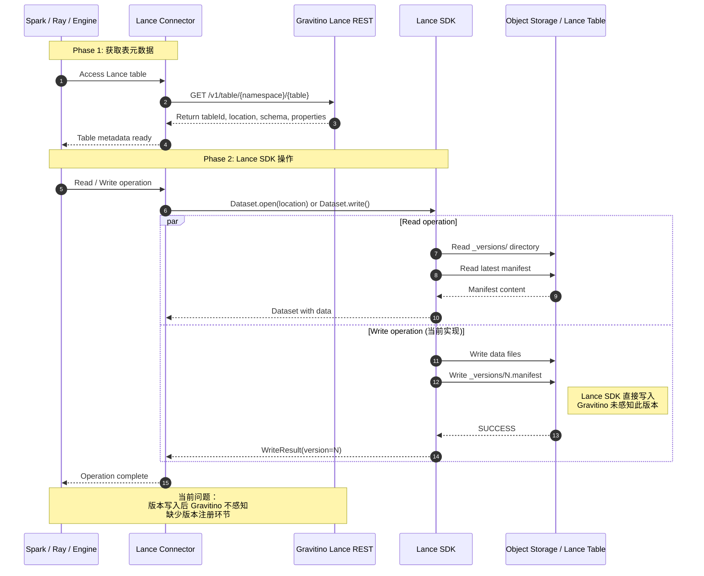
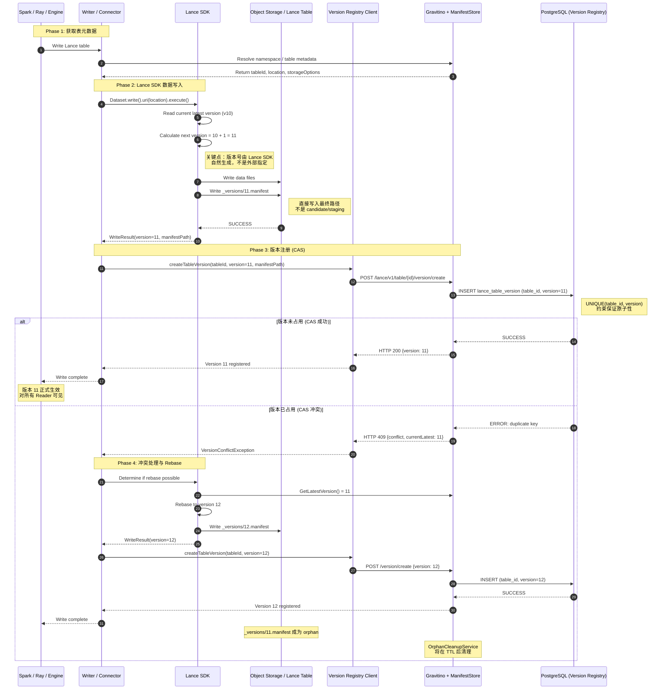

# Lance Catalog-Aware Table Commits 调研报告

## 执行摘要

Lance 当前最自然的提交模式是 `Storage-managed`：writer 直接写数据文件与 manifest，并通过 `_versions` 形成新版本。这一路线实现简单，也保留了 Lance 依赖递增版本号、`_versions` 和 manifest naming scheme 建立起来的自描述版本语义；但在引入 Catalog 治理后，会暴露出权限前置、审计、血缘、下游触发和多表协调方面的缺口。

围绕这一问题，公开讨论可归纳为五类方案：`Storage-managed`、`Storage-managed + Catalog Notification`、`Implementation-managed`、`CommitTable / Catalog-Aware Commit`、`ManifestStore / Catalog Intercept Commit`。其中，`Implementation-managed` 虽然控制范围最大，但会将最新版本认定权交给 Catalog pointer，从而侵入 Lance 现有版本语义；`Storage-managed + Catalog Notification` 只能提供事后补偿式治理，不适合作为最终提交架构。

本文结论是：**Lance 更适合采用“Catalog 参与版本协调，而非 Catalog 接管 latest pointer”的路线。** 因此，推荐将 **ManifestStore / Catalog Intercept Commit** 作为长期方向，将 **CommitTable** 视为可以接受但更适合作为上层统一提交入口的方案。

------

## 1. 文档目的与范围

本文基于 Lance 社区关于 Catalog-Aware Table Commits 的公开讨论，回答以下问题：

1. Lance 当前如何提交表版本。
2. 引入 Catalog 后，提交路径为何会成为关键设计点。
3. 不同方案分别解决什么问题、相互之间是什么关系。
4. 哪条路线更适合作为 Lance 的长期方向。

说明：本文中的部分方案命名和分层属于工程分析抽象，不完全等同于 Lance 社区已定稿的正式规范。

------

## 2. 当前机制与问题

### 2.1 Lance 当前提交机制

Lance 当前更自然的使用方式，是由上层引擎或 Lance SDK 直接修改底层存储中的 Lance 表，并通过写入新的 manifest 形成新版本。简化后的流程如下：

```text
Engine / Lance SDK
  -> 读取当前最新 manifest
  -> 写入数据文件、删除文件或索引文件
  -> 生成 transaction
  -> 生成新的 manifest
  -> 提交到 _versions 目录
  -> 形成新的表版本
```

这里的 `transaction` 可以理解为一份结构化提交对象，其中描述了：

```text
本次读取的基线版本
操作类型
新增、删除或重写的元数据
必要的冲突检测信息
```

在这一模式下，最新版本主要由 Lance 自身的 `_versions` 目录和 manifest naming scheme 决定，而不是由外部 Catalog pointer 决定。Lance 依赖底层存储提供的原子能力保证并发提交安全，例如：

```text
put-if-not-exists
rename-if-not-exists
```

因此，原始 Lance 并不是没有元数据管理，而是主要负责**表格式自身的元数据管理**，包括：

```text
manifest
schema
fragment / deletion metadata
index metadata
transaction / conflict resolution 所需信息
```

它缺少的不是表内版本管理能力，而是统一的 Catalog / Namespace 治理层，例如：

```text
统一权限
统一审计
统一血缘
多表原子提交
下游触发
组织级策略控制
```

### 2.2 引入 Catalog 后的关键问题

当 Lance 需要接入 Catalog 治理时，直接 `Storage-managed` 会暴露四类问题。

#### Catalog 可见性不足

如果某个任务直接写入：

```text
_versions/10.manifest
```

那么 Lance 表已经更新到 `v10`，但 Catalog 可能并不知道这次提交已经发生。

#### 权限控制无法前置

如果 commit 直接发生在存储层，Catalog 无法在提交前统一判断：

```text
用户是否有写权限
schema 变更是否合法
是否允许删除数据
是否符合治理策略
```

#### 审计与血缘不完整

如果提交没有经过 Catalog，Catalog 很难稳定记录：

```text
谁提交的
何时提交的
提交了什么操作
影响了哪些数据
产生了哪个新版本
```

#### 下游触发不可靠

很多治理动作依赖“表已经发生变更”这一事实，例如：

```text
索引刷新
缓存失效
质量检查
血缘更新
训练任务触发
```

如果 Catalog 未感知 commit，这些流程就可能漏触发或晚触发。

------

## 3. 方案分类与关系

结合公开讨论与工程实现视角，本文将相关方案归纳为五类：

```text
方案一：Storage-managed table
方案二：Storage-managed + Catalog Notification
方案三：Implementation-managed table
方案四：CommitTable / Catalog-Aware Commit
方案五：ManifestStore / Catalog Intercept Commit
```

这些方案并不是彼此完全独立的平行选项，而是围绕同一个问题的不同层次回答：

> Catalog 应该以什么方式介入 Lance 表提交，既增强治理能力，又尽量不破坏 Lance 原生版本语义。

从讨论层次上看：

```text
方案一、二、三、四：
  更偏高层提交模式
  主要回答“提交入口在哪里”“Catalog 扮演什么角色”

方案五：
  更偏底层版本协调机制
  主要回答“Catalog 参与后，新版本如何安全生效”
```

因此，方案四和方案五在工程实现上并不冲突。常见做法是：

```text
对外暴露 CommitTable 这类上层接口
对内复用 ManifestStore / CommitHandler / TableVersion 这类底层机制
```

------

## 4. 各方案分析

### 4.1 方案一：Storage-managed table

`Storage-managed` 是 Lance 当前最自然的模式：客户端直接修改 Lance 表，并向 `_versions` 目录提交新的 manifest。

```text
Engine / Lance SDK
  -> 直接修改 Lance 表
  -> 提交新的 manifest 到 _versions
```

优点：

```text
实现简单
不强依赖 Catalog
保留 Lance 自描述能力
```

不足：

```text
Catalog 不一定感知 commit
权限控制无法前置
审计和血缘可能缺失
下游触发不可靠
```

它更适合作为基线方案，而不是强治理平台的最终方案。

### 4.2 方案二：Storage-managed + Catalog Notification

这是对 `Storage-managed` 的增强：引擎先直接提交 Lance 表，再在提交成功后通知 Catalog。

```text
Engine / Lance SDK
  -> 直接提交 Lance 表
  -> 提交成功后通知 Catalog
  -> Catalog 记录版本变化、审计和血缘
```

最小例子如下。假设表 `image_embeddings` 当前版本为 `v10`，writer 先按 Lance 原生方式直接写入新的 `11.manifest`，再通知 Catalog：

```text
table_id = image_embeddings
old_version = 10
new_version = 11
manifest_location = .../11.manifest
operation_type = append
```

这一模式可以补做审计、血缘更新和下游事件触发；但如果通知失败、延迟或被绕过，Catalog 看到的状态就可能晚于甚至偏离底层 Lance 表的真实状态。

因此，它的本质仍然是：Catalog 是**事后观察者**，不是**提交控制者**。适合作为补充治理机制，不适合作为最终提交架构。

### 4.3 方案三：Implementation-managed table

`Implementation-managed` 更接近 **Iceberg 的 latest-pointer / implementation-managed 控制模型**。这里说“更接近 Iceberg”，指的是**控制模型层面**的相似，即都由 Catalog / metastore 持有较强的最新版本认定权；它并不等同于“完全对齐 Iceberg REST Catalog 的具体实现路径”。

这一控制模型的核心包括：

```text
1. 当前最新版本不是单纯由存储目录解析出来，
   而是由 Catalog / metastore 维护的 pointer 决定

2. commit 是否成功，不只取决于 manifest 是否写入存储，
   还取决于 Catalog 是否接受并切换到该新版本

3. 客户端需要通过 Catalog / metastore 获取当前生效版本

4. Catalog / metastore 不只是注册与发现层，
   也是 latest version 的 source of truth
```

例如，Catalog 中可能维护：

```text
latest_manifest_location = s3://bucket/table/_versions/10.manifest
```

writer 要 append 一批新数据时，不再自己写出 `11.manifest` 就视为提交完成，而是先把提交请求交给 Catalog。随后由 Catalog：

```text
1. 读取 latest pointer
2. 基于当前版本组织本次提交
3. 生成或接收新的 manifest
4. 写入底层存储
5. 切换 latest pointer
```

优点：

```text
Catalog 完整可见
权限控制集中
审计能力强
下游触发可靠
同时掌握最新版本认定权
```

不足：

```text
削弱 Lance 的自描述能力
与 branching 配合复杂
可能形成两套 truth
对 Lance 原生版本语义侵入最大
```

这里的“两套 truth”指的是：存储结构认为 `main` 最新是 `v10`，但 Catalog pointer 可能仍认为最新是 `v9`。原因在于，即使提交统一经过 Catalog，提交流程通常仍涉及两个一致性域：对象存储 / 文件系统中的 manifest 与数据文件，以及 Catalog / metastore 中的 latest pointer。二者各自可以原子，但通常缺少一个跨存储与 Catalog 的统一事务来保证“写入 manifest”和“切换 latest pointer”整体同时成功或同时回滚。

因此，方案三虽然控制范围最大，但对 Lance 原生版本语义侵入也最大，不建议作为长期方向。

### 4.4 方案四：CommitTable / Catalog-Aware Commit

`CommitTable` 可以理解为一个新增的 Catalog / Namespace 提交能力入口。与方案三不同，它不必要求 Catalog latest pointer 成为唯一 truth；与方案一不同，它把提交动作收口到 Catalog。

```text
Engine / Writer
  -> 构造 CommitTable(request)
  -> 调用 Catalog / Namespace
  -> 服务端执行完整提交流程
  -> 返回新版本结果
```

如果某个引擎当前并不是通过 Lance Namespace / REST 提交表，而是直接使用 Lance SDK 或直接写存储，那么采用这一模式通常需要额外适配新的提交入口。

从讨论意图看，`CommitTable(request)` 的理想链路大致如下：

```text
Client / Engine
  -> 构造 CommitTable(request)
  -> 发给 Catalog / Namespace
  -> 服务端做鉴权、冲突检测、必要时 rebase
  -> 服务端生成或组织生成新 manifest
  -> 服务端按 Lance commit protocol 提交
  -> 返回 committed result
```

但需要区分两层含义：

```text
#5229 中的 CommitTable：
  更偏 transaction-level commit
  即 Catalog 接收 Lance transaction，
  并由服务端执行完整 Lance commit protocol

当前公开 Namespace 规范中的 BatchCommitTables / CommitTableOperation：
  更偏 metadata-level / TableVersion-level batch commit
```

因此，不能简单认为 Lance 已经完整落地了 `#5229` 中设想的 transaction-level `CommitTable` API。

假设表 `image_embeddings` 当前版本为 `v10`，writer 要 append 一批新数据。最小流程是：

```text
1. writer 读取 v10
2. writer 生成 append transaction
3. writer 调用 Catalog.CommitTable(transaction)
4. Catalog 检查权限、策略、冲突
5. Catalog 生成或组织生成新 manifest
6. Catalog 完成提交，返回新版本
```

方案四比方案五更重，一个重要原因是它要求 Catalog 更深地介入冲突处理。当两个 writer 同时基于 `v10` 提交时，Catalog 端必须承接 Lance 原本的并发提交语义，通常应复用或实现与 Lance 一致的：

```text
冲突检测
rebase
重试逻辑
```

优点：

```text
Catalog 可以前置权限控制
Catalog 可以完整审计
Catalog 可以触发下游流程
比 Implementation-managed 对 Lance 侵入更低
```

局限性：

```text
Catalog 需要更深地理解 Lance transaction
服务端必须承接 Lance 冲突检测、rebase 和重试语义
实现复杂度高于纯版本协调接口
```

从公开信息看，`CommitTable` 仍更像设计提案，而不是已经完整落地的稳定 API。当前公开规范中更明确落地的是 `CreateTableVersion`、`BatchCreateTableVersions`、`CommitTableOperation` 等偏 TableVersion / metadata-level 的接口。

因此，若采用方案四，更稳妥的工程落地方式通常是：

```text
对外提供 CommitTable
对内复用 ManifestStore / CommitHandler / TableVersion
继续保留 Lance 递增版本号与 _versions 语义
```

### 4.5 方案五：ManifestStore / Catalog Intercept Commit

`ManifestStore / Catalog Intercept Commit` 不是 `#5229` 中直接列出的正式方案名称，而是基于后续公开讨论整理出的工程抽象。它描述的是一种**比 CommitTable 更底层的版本协调方向**：Catalog 不一定直接接管完整 transaction，而是在 manifest 版本创建阶段介入。

这里所谓“更偏底层版本协调机制”，是指方案五关注的重点不再是“对外暴露什么提交 API”，而是“一个新版本如何被原子登记、正式生效，以及并发 writer 和多表版本如何协调”。因此，它更像可被 `CommitTable`、`BatchCommitTables` 等上层接口复用的底层规则。

时间线上，`ManifestStore` 相关思路并不是到 `#5849` 才第一次出现。更早在 2023 年的 `#1183` 中，Lance 就已经提出 `ExternalManifestStore` / `ExternalManifestCommitHandler` 路线，最初主要用于在 S3 缺少原子条件写时协调并发提交。到 2026 年的 `#5849`，讨论重点已经转向：是否要把这一路线从较窄的外部提交协调机制，提升成更正式、更通用的 `ManifestStore` 概念，以支撑多表事务、Directory Namespace 和 Catalog 集成等更广场景。

ManifestStore 可理解为管理 `version -> manifest_location` 映射的版本协调层。它更接近“版本登记处”，而不是 manifest 内容存储本身。

一个最小接口可以抽象为：

```text
GetLatestVersion(table_id) -> (version, manifest_location)
GetVersion(table_id, version) -> manifest_location
CreateVersionIfNotExists(table_id, version, manifest_location)
ListVersions(table_id)
```

从当前公开讨论看，Lance 已存在 `ExternalManifestStore` 抽象；当前 Namespace 规范里也已公开更明确的 TableVersion 级接口，例如：

```text
CreateTableVersion
ListTableVersions
DescribeTableVersion
BatchCreateTableVersions
```

这些接口的共同特点是：它们更像“登记已有 manifest”，而不是“根据 transaction 生成 manifest”。因此，从当前公开讨论和接口形态看，**ManifestStore 的职责边界比“谁来生成 manifest”更明确，而 manifest 具体必须由哪一侧生成，并没有被公开规范强制写死**。更自然、也更符合当前 `ExternalManifestStore` / `TableVersion` 模型的实现方式，是由 writer / runtime 侧生成候选 manifest，再由 ManifestStore 完成版本登记与生效协调。

假设表 `image_embeddings` 当前版本为 `v10`，writer 要 append 一批新数据。方案五中的最小流程是：

```text
1. writer 读取当前最新版本
2. writer 基于该版本生成 transaction
3. writer 写入 data / index / deletion files
4. writer 生成新 manifest，并先写入对象存储
5. writer 调用 ManifestStore：
     CreateVersionIfNotExists(table_id, version=11, manifest_location=...)
6. 创建成功，则 v11 生效
7. 创建失败，则进入冲突处理 / 重试
```

这里 Catalog 接管的是：**一个新版本是否可以登记成功并正式生效**。

因此，方案五不会消除 Lance 原有并发冲突，而是把“哪个版本号已被占用”这一事实统一交给 ManifestStore 判断。职责可以拆分为：

```text
ManifestStore：
  判断版本号是否已被占用
  负责 version -> manifest_location 的原子登记

Lance Runtime / CommitHandler：
  根据最新版本执行冲突检测、rebase 和重试
```

主要优点：

```text
保留 Lance 递增版本号、_versions 和 manifest naming 语义
不依赖 Catalog latest pointer 认定当前版本
比 Implementation-managed 更少侵入 Lance 原生模型
Catalog 可以介入版本登记、权限、审计和并发协调
更适合作为多表事务和批量版本创建的基础能力
可作为 CommitTable 等上层接口的底层协调机制
```

主要不足：

```text
仍然存在跨存储与 Catalog 的一致性恢复问题
需要 Lance / connector 侧改造提交路径
需要对象存储权限模型配合，避免绕过 Catalog
多表事务和批量版本登记会增加实现复杂度
对最终用户来说不如统一 Commit API 直观，通常还需要上层接口封装
```

这说明 `ManifestStore / Catalog Intercept Commit` 并不是“完美方案”。更准确地说，它不是零代价方案，而是当前几类方案中“代价相对可控、整体平衡最好”的折中方案。

与 Iceberg REST Catalog 相比，方案五在方向上有相似之处：二者都体现了“Catalog 进入提交链路，并由服务端承担协调与治理职责”的思路。但二者的介入层次并不相同：

```text
Iceberg REST Catalog：
  client 提交 requirements / updates
  catalog 服务端写 root metadata
  catalog 服务端完成 metadata commit

Lance 方案五：
  writer / runtime 生成候选 manifest
  catalog / manifeststore 负责 version -> manifest_location 的原子登记
  catalog / manifeststore 决定新版本能否正式生效
```

因此，更准确的说法是：

```text
Iceberg REST Catalog：
  更偏 metadata commit

Lance 方案五：
  更偏 version registration / version activation
```

Lance 社区并不是没有参考 Iceberg REST Catalog，而是在参考之后有意识地没有完全对齐。`#5229` 早期的 `Implementation-managed` 思路就明确借鉴了 Iceberg 式 latest pointer 控制模型；但后续讨论逐渐收敛到这样一个判断：社区希望保留 Lance 基于递增版本号、`_versions` 和 manifest naming scheme 建立起来的版本发现、branching、time-travel、rollback 和 version comparison 语义。`#5849` 进一步指出，如果为了 Catalog-aware commit 转向 pointer-based latest version 模型，就会引入两套差异很大的 commit path，并增加冲突解决和历史版本管理复杂度。

与方案四相比，方案五更轻。方案四接管的是**一次完整表提交**，方案五接管的是**一个新版本是否正式生效**。因此，方案四是表级提交接口，方案五是底层版本协调接口；二者在工程上并不冲突，反而常见组合方式是：

```text
对外暴露 CommitTable
对内复用 ManifestStore / CommitHandler / TableVersion
```

在多表事务和分区表场景中，`BatchCreateTableVersions`、`BatchCommitTables` 这类能力的意义在于：

```text
让多个版本登记操作具备原子性
要么全部成功
要么全部失败
```

不过，方案五同样涉及存储与 Catalog 两个一致性域，因此仍需处理：

```text
manifest 已写入，但版本登记失败
版本已登记，但 manifest 不可读
失败后的临时 manifest 清理
重试是否幂等
```

但这里的风险形态与方案三不同。方案三更偏“Catalog pointer 与 storage 可能分别认定不同 latest version”，从而形成两套 latest truth；方案五更偏“候选 manifest 的落盘状态”与“版本登记是否生效”之间的一致性问题。因此，方案五并非没有跨系统一致性风险，但通常不会像方案三那样天然引入对 latest version 的双重定义。

### 4.6 扩展讨论：Catalog-Generated Manifest / Server-Executed Commit

在方案五基础上，还可以进一步设想一种更重的服务端变体：**不再由 writer / runtime 侧生成候选 manifest，而是由 Catalog / Namespace 服务端接收 transaction 或 updates，并负责生成 manifest，再完成版本登记与生效。**

其典型流程可以概括为：

```text
writer / engine
  -> 提交 transaction / updates / context
  -> Catalog / Namespace 服务端读取当前版本
  -> 服务端做权限校验、冲突检测、必要时 rebase
  -> 服务端生成新 manifest
  -> 服务端完成 version -> manifest_location 登记
  -> 新版本生效
```

这一方向可以理解为：在方案五的“版本登记协调”基础上，再把 manifest 构造职责前移到 Catalog 侧。它与 Iceberg REST Catalog 在形态上更接近，因为 Iceberg REST Catalog 官方强调的是 `requirements / updates` 驱动的服务端 metadata commit，并由 catalog service 写 root metadata。

从关系上看，它更像是：

```text
方案四的更强实现形态：
  Catalog 不仅接收 CommitTable，还亲自生成 manifest

方案五的更重服务端变体：
  Catalog 不仅负责版本登记，还负责 transaction -> manifest 的求值与构造
```

优点：

```text
治理能力最完整
更适合作为统一跨引擎提交协议
引擎侧可以减少对 Lance manifest 生成细节的理解负担
```

代价：

```text
Catalog 服务端会显著变重
需要深度理解 Lance transaction、manifest 构造、冲突检测、rebase 和重试语义
对 Lance 原生 storage-first / storage-resolved 版本语义的侵入更大
整体上更接近 Iceberg REST Catalog 式的 server-executed commit 路线
```

此外，这一路线如果要真正落地，通常也不只是自研 Catalog 一侧适配即可，Lance 侧本身也需要进一步提供更稳定的服务端提交抽象，例如将 `transaction -> manifest` 求值、冲突检测、rebase 和 commit 语义，更清晰地沉淀为可被服务端复用的库能力或协议能力。

在并发冲突场景下，Catalog 服务端也不能只做“版本登记”，还必须真正理解 Lance transaction 语义，才能判断某个提交在最新版本变化后是否还能继续应用、是否可以 rebase，以及如何生成新的 manifest。这一点与 Iceberg REST Catalog 在思路上相似：后者同样不是只做 pointer 切换，而是要理解 `requirements` 与 `updates` 所表达的 metadata update 语义。

从更高一层看，这也是为什么可以说：**Iceberg 更天然适合重 Catalog / server-executed commit 模型，而 Lance 如果走同一路线，代价会更大。** 原因不在于 Iceberg 的服务端实现一定更轻，而在于它从规范层就已经把 Catalog 参与 commit 定义进协议里。相比之下，Lance 当前更原生的仍然是 storage-managed、incremental version numbers、`_versions` 和 manifest naming scheme 驱动的提交模型。也就是说，Iceberg 是沿着自身既有方向继续做重服务端提交，而 Lance 若走同一路线，则需要在现有 storage-first / storage-resolved 模型之上额外补出一层服务端提交协议和执行抽象。

因此，这一方向可视为**“向 Iceberg REST Catalog 靠拢的重服务端实现形态”**。它在治理控制上最彻底，但也比本文主推荐的 `ManifestStore / Catalog Intercept Commit` 更重、更复杂，不宜作为当前 Lance 路线的优先推荐。

------

## 5. 方案对比

### 5.1 总体对比

| 方案 | 提交入口 | 最新版本认定 | Catalog 角色 | 治理能力 | 对 Lance 原生语义侵入性 | storage-only 可读性 | 并发冲突处理职责 | 多表事务支持潜力 | 引擎接入改造量 | 实现复杂度 | 主要问题 |
| --- | --- | --- | --- | --- | --- | --- | --- | --- | --- | --- | --- |
| Storage-managed | Engine / SDK 直接提交 | `_versions` | 无或旁路 | 弱 | 低 | 高 | Lance Runtime / SDK | 弱 | 低 | 低 | Catalog 不可见 |
| Storage-managed + Notification | Engine / SDK 直接提交，再通知 Catalog | `_versions` | 事后观察者 | 弱到中 | 低 | 高 | Lance Runtime / SDK | 弱 | 低到中 | 低 | 通知可能失败或滞后 |
| Implementation-managed | Engine 通过 Catalog 提交 | Catalog latest pointer | 提交控制者 + 最新版本认定者 | 强 | 高 | 低 | Catalog / Implementation | 中到强 | 高 | 高 | 削弱 Lance 自描述能力，branching 复杂 |
| CommitTable | Engine 把 transaction 交给 Catalog，由 Catalog 提交 Lance | `_versions` manifest 规则 | 提交入口和执行者 | 强 | 中 | 中到高 | Catalog 服务端 | 中 | 高 | 高 | Catalog 需要理解 transaction 和 commit protocol |
| ManifestStore / Intercept | Writer / Runtime 生成 manifest，Catalog 参与版本登记 | Lance 递增版本语义 + 版本登记 | 版本协调者 | 强 | 低到中 | 高 | Lance Runtime + ManifestStore 分工 | 强 | 中 | 中高 | 需要定义一致的版本协调接口 |
| Catalog-Generated Manifest | Engine 提交 transaction / updates，由 Catalog 生成 manifest | 视实现而定 | 提交入口 + manifest 生成者 + 版本协调者 | 很强 | 中到高 | 中 | Catalog 服务端 | 强 | 很高 | 很高 | 服务端显著变重，更接近 Iceberg REST |

### 5.2 核心差异

谁执行提交：

```text
Storage-managed：
  Engine / SDK

Implementation-managed：
  Catalog / Namespace

CommitTable：
  Catalog / Namespace

ManifestStore / Intercept：
  Lance Runtime 与 Catalog ManifestStore 协同
```

谁决定最新版本：

```text
Storage-managed：
  存储结构本身

Implementation-managed：
  Catalog latest pointer

CommitTable：
  Lance 的 _versions / manifest 规则

ManifestStore / Intercept：
  Lance 递增版本语义 + 版本登记结果
```

治理能力与侵入性对比结论：

```text
控制范围最大、治理最彻底：
  Implementation-managed

治理强且较好保留 Lance 版本语义：
  CommitTable / ManifestStore

轻量但治理弱：
  Storage-managed / Storage-managed + Notification
```

### 5.3 参考实现补充：基于开源 Gravitino 的方案五 PoC 验证

> **重要说明**：本节描述的实现状态是基于开源 Apache Gravitino 项目进行的 **本地 PoC（Proof of Concept）验证**，而非 Lance 社区或 Gravitino 官方的正式发布版本。该 PoC 旨在验证方案五（ManifestStore / Catalog Intercept Commit）的工程可行性和技术细节。

**PoC 背景**：

```text
验证目标：
  在开源 Gravitino 项目基础上，验证方案五的核心能力可实现性

验证范围：
  1. 版本注册 CAS 机制
  2. 幂等重试设计
  3. Orphan manifest 清理
  4. REST API 设计
  5. Connector 集成模式

验证环境：
  基于 Apache Gravitino 0.x 版本
  在 gravitino/lance 模块中新增实现代码
  
项目位置：
  D:\project\gravitino\lance\
```

**开源 Gravitino 官方当前能力**：

从 Apache Gravitino 官方公开资料看，Gravitino 已提供 Lance REST service、namespace / table 管理能力，以及 Spark、Ray 等引擎通过 Lance REST 接入 Gravitino 的路径。因此，Gravitino 官方当前更明确对应的是：

```text
Catalog / Namespace 入口
表注册、发现和治理层
引擎访问 Lance 的统一 REST 接入面
```

**本 PoC 新增的能力（非官方发布）**：

```text
在 lance-common 和 lance-rest-server 模块中新增：

lance-common/
├── service/
│   └── LanceTableVersionService.java         -- 版本注册服务接口
│   └── impl/LanceTableVersionServiceImpl.java -- CAS 实现
├── model/
│   └── CreateTableVersionRequest.java        -- 注册请求模型
│   └── CreateTableVersionResponse.java       -- 注册响应模型
├── handler/
│   └ LanceVersionRecoveryHandler.java        -- Orphan 清理
│   └ LanceManifestStoreCommitHandler.java    -- 完整提交流程
├── client/
│   └ LanceTableVersionClient.java            -- HTTP Client
├── integration/
│   └ LanceVersionRegistrationAdapter.java    -- Connector 集成适配器
├── mapper/
│   └ LanceTableVersionMapper.java            -- MyBatis Mapper
└── session/
    └── ManifestStoreSqlSessionFactoryHelper.java -- DB 会话管理

lance-rest-server/
├── service/rest/
│   └── LanceTableVersionOperations.java      -- REST 端点实现

新增数据库表：
├── lance_table_version                       -- 版本注册表
└── lance_version_audit_log                   -- 审计日志表
```

如果只从”Gravitino 当前作为 Lance Catalog 到底干了什么”来理解，更适合直接看当前流程图：



这张流程图表达的是：

```text
当前 Gravitino Lance REST 的定位：

1. 元数据入口：
   - 提供 Namespace / Table 的注册、发现和管理
   - 返回表的 location、schema、properties

2. 数据操作：
   - Lance SDK 直接读写底层存储
   - 写入新版本时 Gravitino 未参与

3. 缺失的能力：
   - 版本生效控制（不知道哪个版本已提交）
   - 版本注册与原子登记
   - 并发 Writer 冲突协调
   - 权限前置控制（写入已经完成才感知）
   - 完整审计（谁、何时、提交了什么）

因此，Gravitino 当前更像 “Catalog / REST 入口”，而不是 “版本登记协调层”
```

如果在 Gravitino 上验证方案五的可行性，则流程会进一步演化为：



这张目标流程图表达的是：

```text
关键设计要点：

1. 版本号来源：
   - Lance SDK 在 execute() 后自然生成版本号
   - 通过 dataset.version() 返回给 Writer
   - 不是 ManifestStore 分配，不是外部指定

2. manifest 写入：
   - Lance SDK 直接写入最终路径 _versions/{version}.manifest
   - 不是先写入 staging/candidate 位置
   - 注册失败时文件已存在，成为 orphan manifest

3. 版本注册（CAS）：
   - Gravitino 负责 version -> manifest_location 的原子登记
   - 数据库 UNIQUE 约束保证并发安全
   - 第一个注册成功，后续返回 409 Conflict

4. 冲突处理：
   - Lance Runtime / SDK 判断是否可 rebase
   - 如果可 rebase：重新写入新版本
   - 如果不可 rebase：transaction 失败

5. Orphan 处理：
   - 注册失败产生的 orphan manifest
   - 由 OrphanCleanupService 后台清理
   - TTL 通常为 24 小时

角色分工：
  Lance SDK: 数据写入、版本号生成、manifest 写入、冲突 rebase
  Gravitino: 版本原子登记、并发协调、权限控制、审计日志
```

这里也解释了一个容易混淆的问题：既然 Gravitino 已经具备统一治理 Lance 的能力，为什么还需要 `ManifestStore`。原因在于，这两者解决的不是同一层问题。Gravitino 当前更偏”管表”，即管理 namespace、table、catalog metadata 和统一访问入口；而 `ManifestStore` 更偏”管版本生效”，即控制 `version -> manifest_location` 如何原子登记、并发 writer 谁能占用新版本号，以及多个版本如何批量原子生效。前者解决的是 Catalog 接入与治理入口问题，后者解决的是提交控制与版本协调问题。因此，已有 Gravitino 并不意味着已经具备了方案五所要求的版本登记协调能力；相反，Gravitino 正好可以作为补齐这层能力的承载平台。

这意味着，开源 Gravitino 已具备承载 Lance Catalog-aware 路线的基础设施。本 PoC 在此基础上验证了方案五的核心能力实现，详见第 9 章。

------

## 6. 最终方案推荐

基于当前公开讨论与工程可行性分析，本文建议将 **ManifestStore / Catalog Intercept Commit** 作为最终推荐方向，将 **CommitTable** 视为可接受但更适合作为上层接口的方案。

### 6.1 主推荐：ManifestStore / Catalog Intercept Commit

推荐理由：

```text
保留 Lance 增量版本号和 manifest 命名语义
保留 Lance 原生 time-travel / rollback / version comparison 能力
避免引入 Iceberg 式 latest pointer
更适合 branching 场景
便于 Catalog 介入版本登记、冲突协调、审计和权限控制
与 #5849 中 ManifestStore 的公开演进方向更一致
也与当前 Namespace TableVersion 接口方向更接近
```

这里需要强调的是，主推荐并不意味着“完美方案”。更准确地说，`ManifestStore / Catalog Intercept Commit` 是当前几类方案中，在治理能力、实现代价和 Lance 原生语义保留之间平衡最好的一种。

其核心是：

```text
Lance Runtime 继续负责 transaction 语义、manifest 生成、冲突检测和 rebase
Catalog / ManifestStore 负责 version -> manifest_location 的原子登记
谁能让新版本生效，由 ManifestStore / TableVersion 机制统一协调
```

从工程落地角度看，这一方向已经具备自研 Catalog 对接 Lance 的现实基础。原因在于：Lance 表格式本身、`ExternalManifestStore` 路线，以及当前公开的 `CreateTableVersion` / `ListTableVersions` / `DescribeTableVersion` / `BatchCreateTableVersions` 等接口，已经共同提供了“版本登记 + 外部协调”的基础能力。

更具体地说，自研 Catalog 可以在此基础上实现：

```text
version -> manifest_location 的版本登记
版本冲突协调
权限控制与审计
多表原子版本提交
与对象存储权限隔离配合的生效控制
```

需要注意的是，这意味着“可以完成对接”，但不意味着 Lance 已经提供了一套开箱即用的完整服务端实现。自研 Catalog 仍需要补齐 ManifestStore 服务层、对象存储权限隔离、一致性恢复机制，以及 writer / runtime 侧的接入适配。

### 6.2 次优方案：CommitTable

`CommitTable` 适合作为架构接口层、Catalog-facing submit API，或 ManifestStore 之上的上层封装。它的价值在于统一提交入口、前置权限控制、统一审计和下游触发。

其约束在于：

```text
对外提供 CommitTable
对内复用 ManifestStore / CommitHandler
继续保留 Lance 递增版本号与 _versions 语义
```

### 6.3 不推荐作为最终方向：Implementation-managed table

`Implementation-managed` 的问题不在于治理能力不强，而在于它通过 latest pointer 重新定义最新版本语义，会显著侵入 Lance 当前依赖 `_versions` 和递增版本号建立起来的模型。因此，它虽然控制范围最大，但不适合作为 Lance 的长期方向。

### 6.4 Storage-managed + Notification 的定位

`Storage-managed + Notification` 适合作为低成本补充治理机制，但不应作为最终提交架构。它适合补审计、补血缘、补事件通知，不适合承担最终一致性与前置控制职责。

### 6.5 采用 ManifestStore / Catalog Intercept 的前提与风险

虽然 ManifestStore / Catalog Intercept 更适合作为长期方向，但落地时仍需明确几个前提。

第一，需要明确 storage 与 ManifestStore 的 source-of-truth 边界：

```text
Storage：
  保存 manifest 文件和物理数据

ManifestStore / Catalog：
  负责版本登记、并发协调、权限控制和审计
```

二者之间需要有一致性恢复机制，避免出现 manifest 已写入对象存储但版本登记失败，或者版本已登记但 manifest 不可读的情况。

第二，需要明确并发冲突后的处理语义：

```text
版本号已存在时如何处理
哪些 transaction 可以 rebase
哪些冲突必须失败
重试是否幂等
失败后是否需要清理临时 manifest
```

第三，需要配合对象存储权限控制。如果普通 writer 仍可直接写 `_versions`，就仍然可以绕过 Catalog / ManifestStore 直接提交。

第四，需要考虑 Catalog / ManifestStore 不可用时的读取语义。理想情况下，Lance 表仍应尽量保留 storage-only 可读能力，避免完全丧失开放表格式的可移植性。

------

## 7. 结论

围绕 Lance Catalog-aware commit 的公开讨论，核心并不是否定“Catalog 参与 commit”本身，而是在避免将 Lance 改造成类似 Iceberg 的 pointer-based latest version 模型。

更合理的方向是：

```text
保留 Lance 递增版本号、_versions 和 manifest 命名规则
让 Catalog / Namespace 参与提交入口或版本登记
通过 ManifestStore / TableVersion 机制完成并发协调与治理控制
必要时在其上封装 CommitTable / CommitAsset 作为上层 API
```

因此，Lance 更适合采用“Catalog 参与版本协调，而非 Catalog 接管 latest pointer”的路线。这一路线既能增强 Catalog 的治理能力，又能保留 Lance 的开放表格式、自描述版本、time-travel、rollback、version comparison、branching 和冲突处理语义。

------

## 8. 参考资料

### 8.1 Lance 公开讨论与规范

1. Lance Discussion #5229  
   `Catalog-Aware Table Commits`  
   https://github.com/lance-format/lance/discussions/5229

2. Lance Discussion #5849  
   `Formalizing the ManifestStore Concept`  
   https://github.com/lance-format/lance/discussions/5849

3. Lance Discussion #6005  
   `Completed Inline Table Maintenance`  
   https://github.com/lance-format/lance/discussions/6005

4. Lance Issue #1183  
   `RFC: S3 concurrent writer via dynamoDB`  
   https://github.com/lance-format/lance/issues/1183

5. Lance Table Transactions 文档  
   https://lance.org/format/table/transaction/

6. Lance Namespace Client Operations  
   https://lance.org/format/namespace/client/operations/

7. Lance Namespace REST Implementation Spec  
   https://lance.org/format/namespace/rest/impl-spec/

8. Lance Namespace Directory Catalog Spec  
   https://lance.org/format/namespace/dir/catalog-spec/

9. Lance `CreateTableVersionRequest` 模型  
   https://lance.org/format/namespace/client/operations/models/CreateTableVersionRequest/

10. Lance `CommitTableOperation` 模型  
    https://lance.org/format/namespace/client/operations/models/CommitTableOperation/

11. Lance `ExternalManifestCommitHandler` 文档  
    https://docs.rs/lance-table/latest/lance_table/io/commit/external_manifest/struct.ExternalManifestCommitHandler.html

### 8.2 Iceberg 公开规范

1. Apache Iceberg Table Spec  
   https://iceberg.apache.org/spec/

2. Apache Iceberg Spec - Metastore Tables  
   https://iceberg.apache.org/spec/#metastore-tables

3. Apache Iceberg REST Catalog Spec  
   https://iceberg.apache.org/rest-catalog-spec/

4. Iceberg `UpdateTableRequest` Javadoc  
   https://iceberg.apache.org/javadoc/0.14.0/org/apache/iceberg/rest/requests/UpdateTableRequest.html

5. Iceberg `UpdateRequirement` Javadoc  
   https://iceberg.apache.org/javadoc/1.4.0/org/apache/iceberg/UpdateRequirement.html

### 8.3 Gravitino 公开资料

1. Gravitino Generic Lakehouse Catalog  
   https://gravitino.apache.org/docs/next/lakehouse-generic-catalog/

2. Gravitino Lance REST Service  
   https://gravitino.apache.org/docs/next/lance-rest-service

3. Gravitino Lance REST Integration  
   https://gravitino.apache.org/docs/1.2.0/lance-rest-integration/

4. Gravitino Lance Table Support  
   https://gravitino.apache.org/docs/next/lance-table-support/

------

## 9. PoC 验证总结

本章节总结基于开源 Apache Gravitino 项目进行的方案五本地 PoC 验证结果。

### 9.1 PoC 概述

```text
基础项目：Apache Gravitino (开源)
PoC 模块：gravitino/lance/
验证时间：2026-05-18 ~ 2026-05-19
验证状态：核心能力验证完成（约 85%）

新增模块：
  lance-common/         -- 共享组件、服务、模型
  lance-rest-server/    -- REST API 服务端

测试覆盖：单元测试 + E2E 测试（PostgreSQL + H2）
```

### 9.2 接口来源说明

**Lance 官方 Namespace 规范接口：**
```text
CreateTableVersion      -- 创建表版本
ListTableVersions       -- 列出表版本
DescribeTableVersion    -- 描述表版本
BatchCreateTableVersions -- 批量创建表版本
```
参考：https://lance.org/format/namespace/client/operations/models/CreateTableVersionRequest/

**PoC 辅助接口（非官方规范，仅为实现便利）：**
```text
GetLatestVersion(table_id) -> (version, manifest_location)
GetVersion(table_id, version) -> manifest_location
```

PoC 在 Lance 官方规范基础上实现的具体能力：
- CAS 机制（数据库 UNIQUE 约束）
- idempotencyKey 幂等性保证
- Orphan manifest 清理
- 审计日志

### 9.3 核心设计

**版本注册流程：**
```text
1. Lance SDK 写入数据，生成 manifest，返回版本号
2. Connector 调用 REST API 注册版本（CAS）
3. 数据库 UNIQUE(table_id, version) 保证原子性
4. 注册成功 → 版本生效；注册失败 → 返回冲突信息
```

**数据库表结构：**
```text
lance_table_version:
  - table_id, version (UNIQUE 约束)
  - manifest_path, manifest_size, e_tag
  - idempotency_key (UNIQUE 约束)
  - status: created/committed/aborted
  - commit_time, deleted_at (软删除)
```

**模块结构：**
```text
lance-common:
  - LanceTableVersionService: 版本注册服务
  - LanceTableVersionClient: HTTP Client
  - LanceVersionRecoveryHandler: Orphan 清理
  - LanceVersionRegistrationAdapter: Connector 集成

lance-rest-server:
  - LanceTableVersionOperations: REST 端点
```

**关键设计点：**
- Non-blocking：注册失败不阻塞写入成功
- 幂等重试：idempotencyKey + requestHash
- Orphan 清理：TTL + 后台扫描

### 9.4 验证结果

| 能力 | 验证方法 | 结果 |
|------|----------|------|
| CAS 版本注册 | PostgreSQL UNIQUE 约束 | ✓ 通过 |
| 幂等重试 | idempotencyKey 测试 | ✓ 通过 |
| 冲突检测 | testVersionConflict | ✓ 409 + currentLatest |
| 批量提交 | BatchCreateTableVersions | ✓ 事务原子性 |
| Orphan 清理 | LanceVersionRecoveryHandler | ✓ 清理逻辑正确 |

关键验证点：
- ✓ 注册模式：Lance SDK 生成版本号，Gravitino 只登记
- ✓ CAS 并发控制：UNIQUE(table_id, version) 约束有效
- ✓ 幂等设计：idempotencyKey 保证安全重试
- ✓ Orphan 处理：TTL 清理 + 一致性检测

### 9.5 待完善能力

| 能力 | 状态 | 方案 |
|------|------|------|
| 对象存储权限隔离 | 设计 | IAM policy 限制 _versions/ 写权限 |
| Manifest 暂存模式 | 接口定义 | staging → commit 流程 |
| Storage-only 可读性 | 讨论 | Registry 失败后 fallback 到 _versions/ |
| 生产级 Connector | 验证 | Spark/Flink 完整集成 |
| 权限控制 | 配置 | RBAC + Gravitino PermissionManager |
| 监控告警 | 指标定义 | Prometheus + Micrometer |

### 9.6 结论

PoC 验证了方案五（ManifestStore / Catalog Intercept Commit）的工程可行性：
- Gravitino 可作为 ManifestStore 承载平台
- 与 Lance 原生语义兼容
- 核心并发控制和幂等机制有效

后续建议：
- Apache Gravitino 社区可考虑纳入正式版本
- Lance 社区可参考 PoC 设计标准化 ManifestStore 接口

---

**文档结束**

> 本文档基于 Lance 社区公开讨论和本地 PoC 验证编写，旨在为 Lance Catalog-Aware Table Commits 提供完整的技术分析和实现参考。
