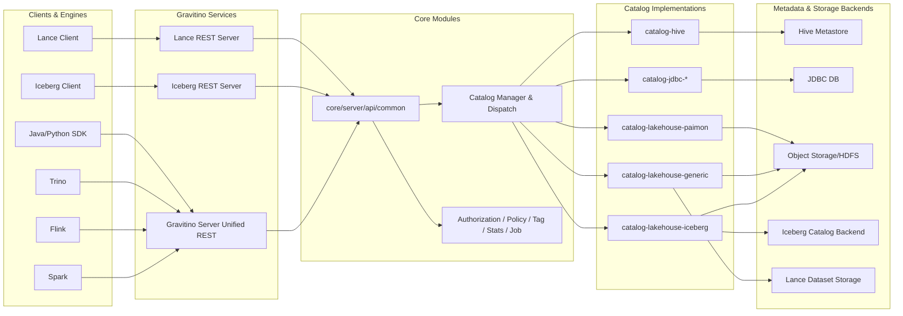
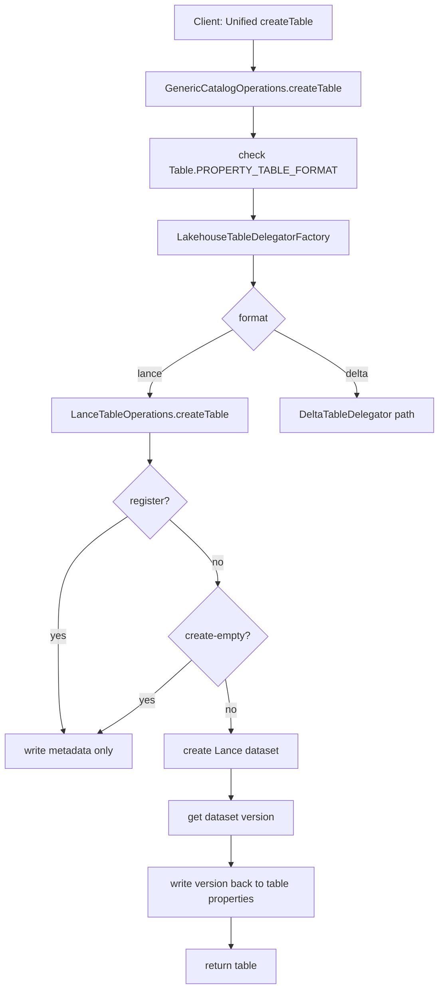
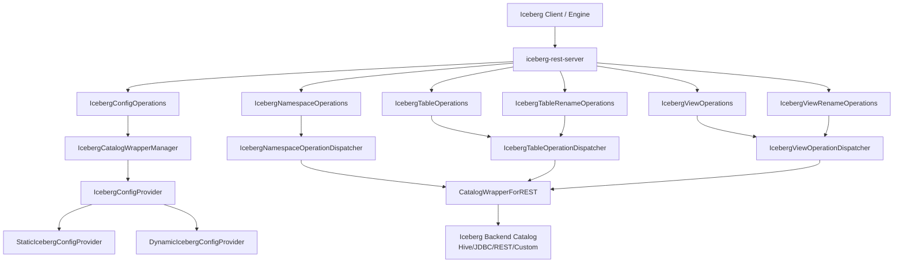
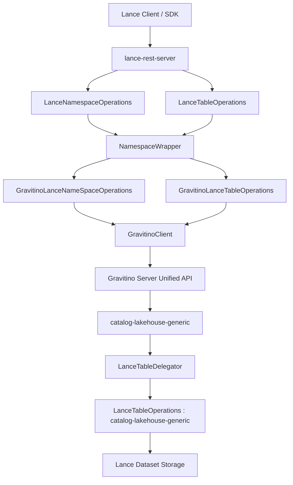
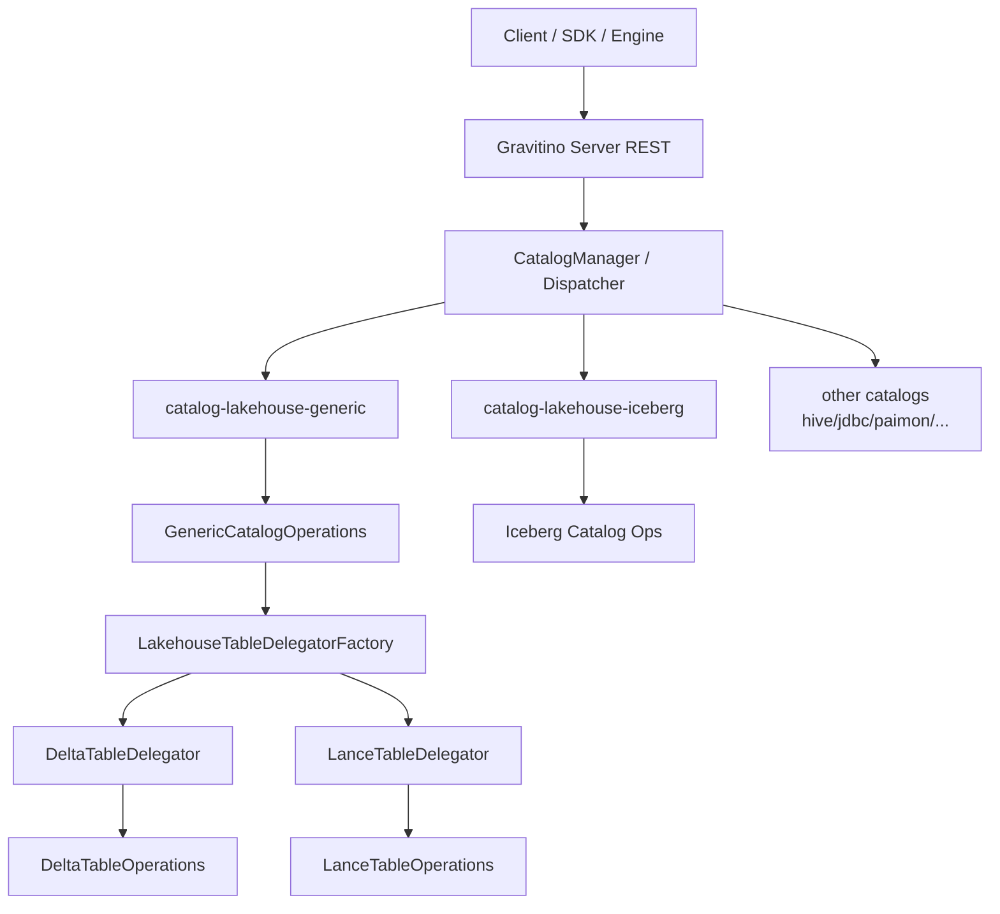
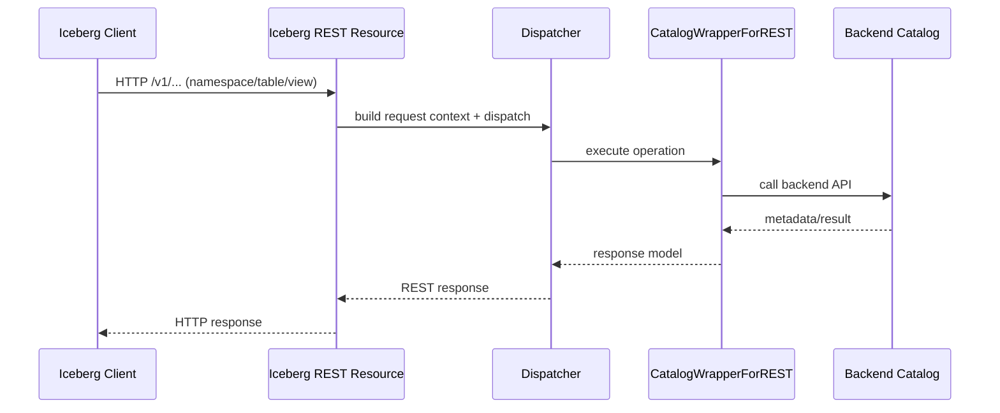
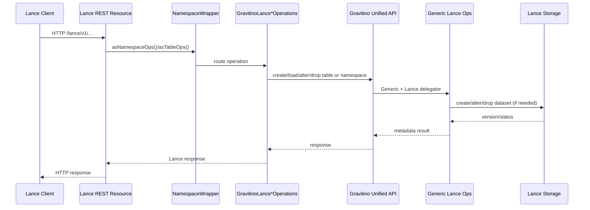
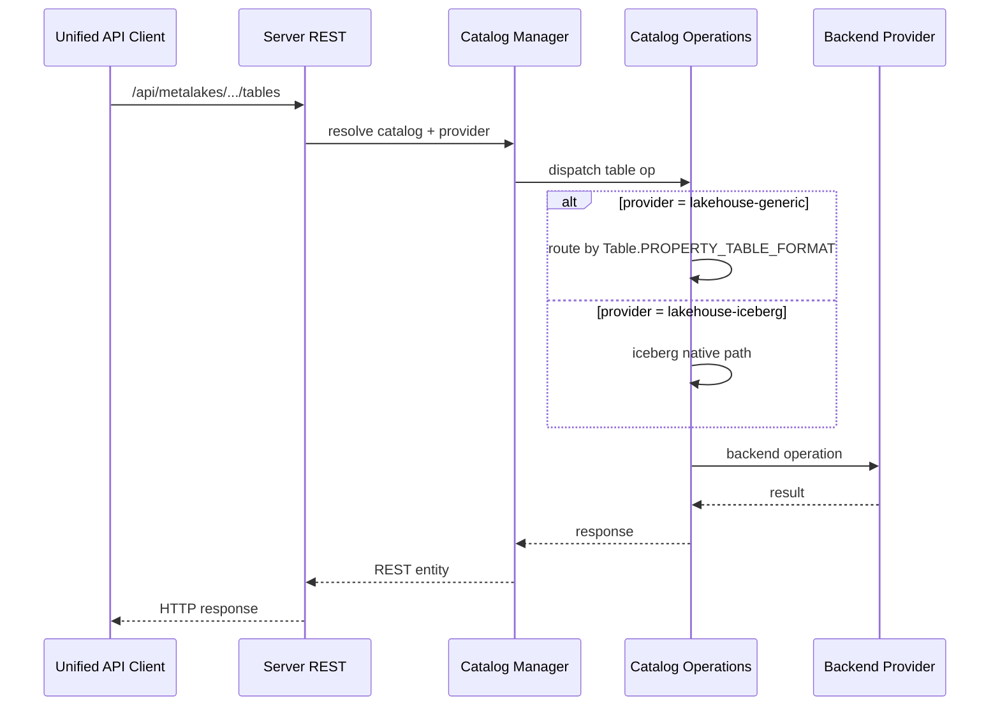

# Gravitino 深度研究报告

---

## 1. 报告目标与证据口径

### 1.1 对齐原始调研目标

1. 多格式数据支持与架构实现（重点：Iceberg、Lance）
2. API 协议策略与功能支持度（重点：Iceberg REST、Lance REST、统一 API 一致性）
3. 计算引擎适配与迁移成本（重点：Spark）

### 1.2 证据口径（统一说明）

为避免“对外承诺”与“代码现状”混淆，本文采用双口径并行：

1. 对外支持范围：按仓库文档声明解读。
2. 实现细节与边界：按源码校准解读。

若两者存在偏差，本文会明确标注“文档承诺 vs 源码现状”。

### 1.3 版本边界

- 源码校准材料显示当前仓库构建版本：`1.3.0-SNAPSHOT`。
- 可读版材料中存在发布版视角（如 1.2.x）。

本文不强行合并为单一版本结论，而是以“能力机制是否存在”和“文档是否承诺”分别说明，确保结论可追溯。

---

## 2. 执行摘要

### 2.1 一句话结论

Gravitino 在 Iceberg 与 Lance 上是**双轨并行架构**，而不是“统一抽象下能力完全等价”。

### 2.2 三个关键判断

1. Iceberg 路线更偏标准协议兼容，能力面更完整，迁移更稳。
2. Lance 路线更偏统一治理接入，语义约束和能力边界更明显。
3. 统一 API 统一的是入口，不是跨格式语义；Spark 是最优先接入面。

### 2.3 直接可执行建议

1. 若目标是低风险迁移：优先 `Iceberg REST` 路径。
2. 若目标是统一目录治理：采用 Spark Connector / Flink Catalog Store，但需接受“跨格式不等价”。
3. 若 Lance 占比高：使用“Gravitino 治理 + Lance 专用链路”，并做专项一致性验证。

---

## 3. 多格式支持与架构实现

### 3.1 架构总览（结论）

Gravitino 对 Iceberg 与 Lance 的实现路径并不对称：

1. Iceberg：独立 catalog 模块 + 独立 Iceberg REST 服务。
2. Lance：Generic Lakehouse 插件分派 + 独立 Lance REST 服务。

这不是“同一抽象在不同格式上的平铺”，而是“统一控制面 + 分格式实现路径”。

### 3.2 模块级实现地图



### 3.3 Iceberg 与 Lance 路径对比

| 维度 | Iceberg 路径 | Lance 路径 | Gravitino 统一 API 路径 |
|---|---|---|---|
| 统一 API 内实现 | 原生独立模块 | Generic 插件路由（`format=lance`） | 核心 `server/api/common` + `CatalogManager/Dispatcher` 统一入口 |
| 主要访问入口 | `iceberg-rest-server` | `lance-rest-server` | `Gravitino Server REST/OpenAPI` |
| 设计目标 | 原生协议兼容 + 企业增强 | namespace/table 生命周期管理 + 元数据协同 | 跨 catalog 控制面治理（命名空间、表、权限、标签、统计等） |
| 语义复杂度 | 资源族完整度较高 | 约束更多，路径分支更多 | 统一入口最稳定，但不承诺跨格式语义完全等价 |

### 3.4 Generic 插件机制（源码实现）

Generic catalog 的关键行为：

1. 建表时必须提供 `Table.PROPERTY_TABLE_FORMAT`。
2. 按 `table format` 从缓存路由到具体 delegator。
3. delegator 由 `LakehouseTableDelegatorFactory` 通过 `ServiceLoader` 加载。

校准结论：

- Generic 扩展点是通用的。
- 当前实际注册委托主要是 Delta 与 Lance。
- Iceberg 不走 Generic 插件面。

### 3.5 Lance 的元数据与数据协同（核心流程）

Lance 在 `create/alter/drop` 上存在“控制面元数据 + 底层 dataset”协同：

1. `register=true`：只写 Gravitino 元数据。
2. `create-empty=true`：只写元数据，不建 dataset。
3. 普通 `create`：先建 Lance dataset，再回写版本属性。
4. `alter`：先改 dataset 再更元数据，存在原子性边界。



---

## 4. API 协议策略与功能支持度

### 4.1 三层 API 面（必须拆开看）

1. Gravitino 统一 REST/OpenAPI（控制面）
2. Iceberg REST（标准协议兼容面）
3. Lance REST（Lance namespace/table 适配面）

### 4.2 协议定位与支持结论

| 协议层 | 定位 | 覆盖判断 |
|---|---|---|
| 统一 REST/OpenAPI | Gravitino 控制与治理 API | 覆盖面广，但不是 Iceberg/Lance 原生协议 |
| Iceberg REST | 面向 Iceberg 客户端协议兼容 | namespace/table/view 主能力覆盖较完整，但存在明确未实现项 |
| Lance REST | Lance 目录与表生命周期适配 | 聚焦 namespace/table，能力边界明确 |

### 4.3 Iceberg REST 模块实现图



### 4.4 Lance REST 模块实现图



### 4.5 统一 API 模块实现图



### 4.6 请求调用图（从请求到后端）

#### 4.6.1 Iceberg REST 请求调用图



#### 4.6.2 Lance REST 请求调用图



#### 4.6.3 统一 API 表操作调用图



### 4.7 Iceberg REST 与 Lance REST 端点能力对比

> 说明：此表按“资源族/能力粒度”组织，避免只列 URL 而缺失语义。

| 协议 | 资源族 | 典型能力 | 支持状态 | 备注 |
|---|---|---|---|---|
| Iceberg REST | Config | endpoint 探测、能力声明、view endpoint 声明 | 支持 | 存在默认 endpoint 清单 |
| Iceberg REST | Namespace | list/create/load/drop/update | 主能力支持 | 以标准 namespace 语义为主 |
| Iceberg REST | Table | create/load/update/drop/rename/exists 等 | 主能力支持 | 与后端 catalog 能力相关 |
| Iceberg REST | View | create/load/update/drop/rename/exists | 主能力支持 | 文档仍列出 `register view` 未实现 |
| Iceberg REST | 全局能力 | 多表事务、分页 | 未完全支持 | 文档明确未实现项 |
| Lance REST | Namespace | list/describe/create/drop/exists/list tables | 支持 | namespace 层级有硬约束 |
| Lance REST | Table | describe/create/create-empty/register/deregister/exists/drop | 支持 | create 语义有分支 |
| Lance REST | Schema 变更 | drop_columns/alter_columns | 部分支持 | `alter_columns` 当前主要是 rename 语义 |

### 4.8 统一 API 一致性评估（重点问题）

| 统一操作 | Iceberg | Lance | 一致性结论 |
|---|---|---|---|
| 建表 | 标准路径明确 | `register/create-empty/create` 多分支 | 名称一致、语义不一致 |
| 改表 | 相对完整 | 能力面更窄 | 不一致 |
| 视图 | 有明确资源族 | 无等价能力 | 不一致 |
| 命名空间 | 标准语义更强 | 层级约束更强 | 不一致 |
| 一致性保障 | 相对成熟 | 协同链路更长，边界更敏感 | 不一致 |

结论：统一 API 更接近“统一入口层”，不是“统一语义层”。

---

## 5. 计算引擎适配与迁移成本

### 5.1 Spark：两条主路径

1. Gravitino Spark Connector（统一访问入口）
2. Spark 原生 Iceberg RESTCatalog（最小改动迁移）

#### 5.1.1 Spark 配置示例（Connector 路径）

```properties
spark.plugins=org.apache.gravitino.spark.connector.plugin.GravitinoSparkPlugin
spark.sql.gravitino.uri=http://gravitino-host:8090
spark.sql.gravitino.metalake=test
spark.sql.gravitino.enableIcebergSupport=true
spark.sql.gravitino.client.socketTimeoutMs=60000
spark.sql.gravitino.client.connectionTimeoutMs=60000
spark.jars=/opt/jars/gravitino-spark-connector-runtime-3.5-<version>.jar,/opt/jars/<iceberg-runtime-jar>.jar
```

#### 5.1.2 Spark 配置示例（Iceberg REST 最小改动路径）

```properties
spark.sql.catalog.iceberg_rest=org.apache.iceberg.spark.SparkCatalog
spark.sql.catalog.iceberg_rest.type=rest
spark.sql.catalog.iceberg_rest.uri=http://gravitino-iceberg-rest-host:9001/iceberg/
spark.sql.catalog.iceberg_rest.warehouse=hive_backend
```

### 5.2 Flink / Trino 适配差异

| 引擎 | 适配方式 | 主要改造点 | 成本判断 |
|---|---|---|---|
| Spark | Connector 或原生 Iceberg REST | 插件、catalog、依赖配置 | 低~中 |
| Flink | Catalog Store | 平台配置改造为主 | 中 |
| Trino | 版本匹配 connector + 动态 catalog | 插件安装、版本匹配、运维联动 | 中高 |

### 5.3 迁移矩阵

| 当前现状 | 目标路径 | 预计工作量 | 主要原因 |
|---|---|---:|---|
| 现有 Spark Iceberg 作业 | 切 Gravitino Iceberg REST | 低 | SQL 基本不变，改 catalog 配置为主 |
| Spark 多目录分散接入 | 切 Spark Connector | 中 | 需插件化、统一命名与会话配置 |
| Flink 原生 catalog 管理 | 切 Catalog Store | 中 | 平台配置改造 |
| Trino 既有 catalogs | 切 Gravitino Trino connector | 中高 | 版本段包管理 + 动态 catalog 运维 |
| Lance 为主数据面 | 追求与 Iceberg 完全等价 | 高/高风险 | 路径与语义差异天然存在 |

---

## 6. 架构差异与工程影响

### 6.1 设计策略

1. Iceberg：标准兼容优先，辅以增强能力。
2. Lance：统一治理接入优先，辅以专用 REST。
3. 统一 API：控制面统一，允许能力非对称演进。

### 6.2 工程影响

1. Iceberg 适合作为低风险迁移主路径。
2. Lance 适合纳入治理，但必须接受功能边界与语义差异。
3. 项目治理上要显式区分“统一入口”和“统一语义”。

---

## 7. 风险与实施建议

### 7.1 关键风险

1. 把“统一 API”误读为“跨格式完全等价”。
2. 混用发布文档结论与源码快照结论。
3. 在 Lance 场景低估一致性验证成本。

### 7.2 建议执行顺序

1. 先定业务目标：最小迁移 / 统一治理 / Lance 主导。
2. 再选技术路径：Iceberg REST 优先，Lance 专项接入。
3. 最后验证：围绕 DDL/DML 语义、失败回滚、元数据一致性做端到端回归。

---

## 8. 证据索引（关键文件）

### 8.1 源码侧

- `gradle.properties`
- `settings.gradle.kts`
- `catalogs/catalog-lakehouse-generic/src/main/java/org/apache/gravitino/catalog/lakehouse/generic/GenericCatalogOperations.java`
- `catalogs/catalog-lakehouse-generic/src/main/java/org/apache/gravitino/catalog/lakehouse/generic/LakehouseTableDelegatorFactory.java`
- `catalogs/catalog-lakehouse-generic/src/main/resources/META-INF/services/org.apache.gravitino.catalog.lakehouse.generic.LakehouseTableDelegator`
- `catalogs/catalog-lakehouse-generic/src/main/java/org/apache/gravitino/catalog/lakehouse/lance/LanceTableOperations.java`
- `lance/lance-rest-server/src/main/java/org/apache/gravitino/lance/service/rest/LanceNamespaceOperations.java`
- `lance/lance-rest-server/src/main/java/org/apache/gravitino/lance/service/rest/LanceTableOperations.java`
- `lance/lance-common/src/main/java/org/apache/gravitino/lance/common/ops/gravitino/GravitinoLanceNameSpaceOperations.java`
- `lance/lance-common/src/main/java/org/apache/gravitino/lance/common/ops/gravitino/GravitinoLanceTableOperations.java`
- `iceberg/iceberg-rest-server/src/main/java/org/apache/gravitino/iceberg/service/rest/IcebergConfigOperations.java`
- `iceberg/iceberg-rest-server/src/main/java/org/apache/gravitino/iceberg/service/rest/IcebergNamespaceOperations.java`
- `iceberg/iceberg-rest-server/src/main/java/org/apache/gravitino/iceberg/service/rest/IcebergTableOperations.java`
- `iceberg/iceberg-rest-server/src/main/java/org/apache/gravitino/iceberg/service/rest/IcebergTableRenameOperations.java`
- `iceberg/iceberg-rest-server/src/main/java/org/apache/gravitino/iceberg/service/rest/IcebergViewOperations.java`
- `iceberg/iceberg-rest-server/src/main/java/org/apache/gravitino/iceberg/service/rest/IcebergViewRenameOperations.java`

### 8.2 文档侧

- `docs/open-api/*.yaml`
- `docs/iceberg-rest-service.md`
- `docs/lance-rest-service.md`
- `docs/lance-rest-integration.md`
- `docs/spark-connector/spark-connector.md`
- `docs/flink-connector/flink-connector.md`
- `docs/trino-connector/installation.md`
- `docs/trino-connector/supported-catalog.md`

---

## 9. 最终结论（30 秒版）

Gravitino 对 Iceberg 和 Lance 采用的是双轨架构，不是同一内核下的完全等价支持。  
Iceberg 路线更成熟、迁移风险更低，适合优先落地；Lance 路线更偏治理接入，语义边界更强。  
如果我们追求快速收益，先把现有 Iceberg 作业切到 Gravitino Iceberg REST；若做统一治理，再逐步接 Spark/Flink 并对 Lance 场景做专项一致性验证。


