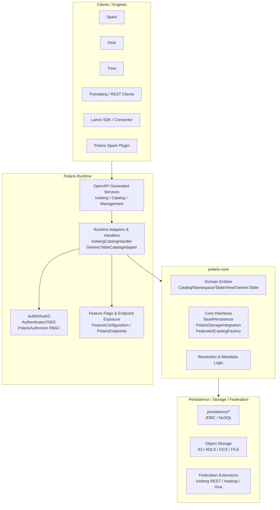
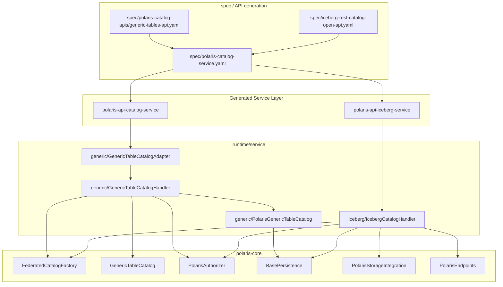
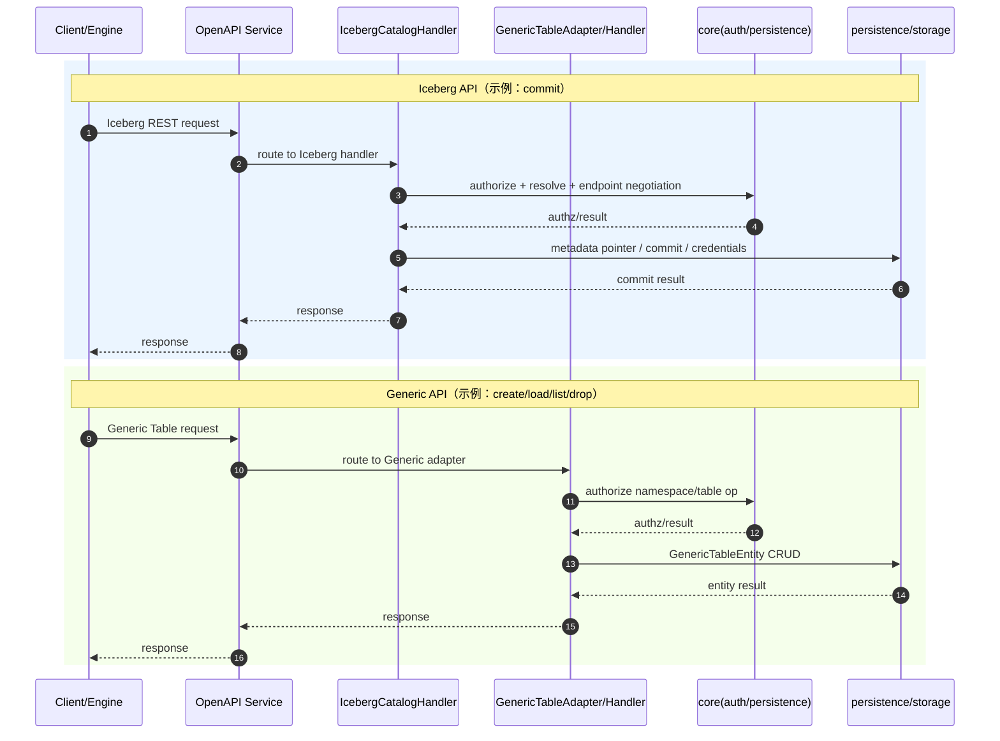
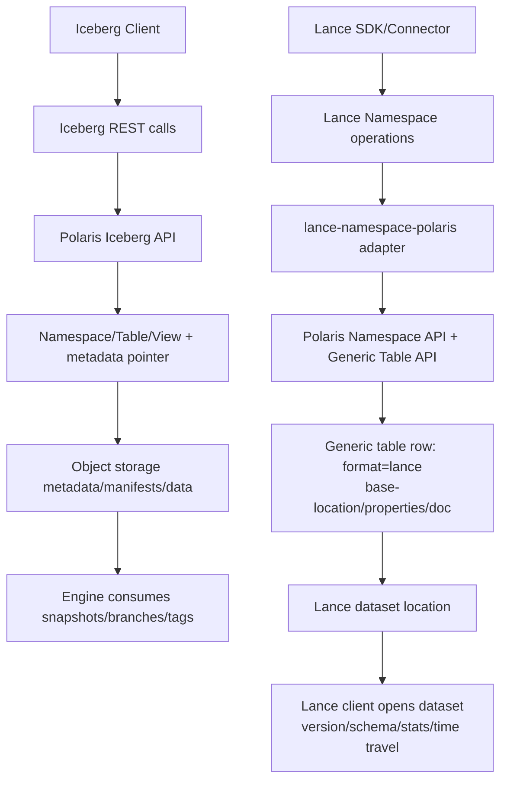

# Polaris 研究报告

---

## 1. 报告目标与证据口径

### 1.1 报告目标（与原任务一致）

1. 多格式数据支持与架构实现  
2. API 协议策略与功能支持度（重点：Iceberg REST、Lance 接入路径、统一 API 一致性）  
3. 计算引擎适配与迁移成本（重点：Spark）

### 1.2 报告方法

1. 以源码证据作为实现事实基线（仓库 `version.txt` 为 `1.4.0-SNAPSHOT`）。  
2. 采用面向迁移的分析结构与评估视角。  
3. 对“文档叙述”和“源码实现”冲突处逐项校准。  
4. 完善关键图表与链路说明，确保本文件可独立阅读。

### 1.3 证据分级

1. 一级证据：仓库源码与 OpenAPI 规范（`spec/`、`runtime/`、`polaris-core/`、`plugins/`）。  
2. 二级证据：站点文档与博客（`site/content/...`）。  
3. 三级证据：外部生态规范（Iceberg/Lance 引擎与协议文档）。

---

## 2. 执行摘要

1. Polaris 的一等公民能力是 Iceberg REST Catalog；模块、规范、运行时链路一致。  
2. Generic Table 是非 Iceberg 格式的轻量元数据层，核心是 `Create/Load/List/Drop`，不是等价事务目录。  
3. Lance 在当前仓库证据中是“通过 Generic Table API 的集成方案”，不是 Polaris 内建的 Lance 原生协议服务端。  
4. “统一 API”是治理控制面统一（catalog/namespace、认证鉴权、RBAC、服务装配），不是所有格式语义完全统一。  
5. Generic Table 的凭证下发需要校准：规范已预留访问委托头与 `storage-access-configs`，但当前服务实现未完整填充。  
6. Spark 适配呈双路径：Iceberg REST 直连迁移成本低；Generic/Delta/Hudi/Paimon 走插件路径，能力和限制更明确。

---

## 3. 版本基线与边界

### 3.1 版本口径

1. 本文档按当前仓库源码基线解释实现：`1.4.0-SNAPSHOT`。  
2. 原研究报告中的“1.3.0 稳定版”结论作为历史公开文档口径，不再作为唯一实现依据。  
3. 对外陈述建议使用“双口径”：  
   - 源码口径：当前仓库已实现内容。  
   - 稳定版口径：公开发布文档与下载工件可见内容。

### 3.2 边界与不确定项

1. 本文重点讨论目录控制面，不等价于格式数据面的全部语义。  
2. 未发现对外 gRPC 的明确公开实现证据（无 `.proto` 服务链路与公开模块声明）。  
3. Lance 深语义能力以 Lance 生态客户端/SDK 为主，非 Polaris 目录层直接承载。

---

## 4. 多格式支持与架构实现

### 4.1 模块分层（源码）

1. API 生成层：`polaris-api-management-service`、`polaris-api-iceberg-service`、`polaris-api-catalog-service`。  
2. 运行时服务层：`runtime/service`（业务实现）、`runtime/server`（Quarkus 装配）。  
3. 核心领域层：`polaris-core`（实体、RBAC、抽象接口）。  
4. 持久化与联邦扩展：`persistence/*`、`extensions/federation/*`。  
5. 客户端插件层：`plugins/spark/*`。

### 4.2 关键扩展点（源码类）

1. 鉴权：`PolarisAuthorizer`  
2. 持久化：`BasePersistence`  
3. 存储集成：`PolarisStorageIntegration`  
4. 联邦工厂：`FederatedCatalogFactory`

### 4.3 Polaris 整体架构图（完善版）



### 4.4 Iceberg 与 Generic 实现链路图



### 4.5 请求调用对比（Iceberg vs Generic）



### 4.6 元数据管理与“转换”流程



### 4.7 多格式能力矩阵

| 格式/接入层 | 在 Polaris 中的接入方式 | 目录层读写语义 | Polaris 掌握的元数据深度 | 关键边界 |
|---|---|---|---|---|
| Iceberg 内部目录 | 原生 Iceberg REST Catalog | 强，含 namespace/table/view 与 commit 语义 | 强，含 metadata pointer、权限与凭证边界 | 维护作业（如清理/压缩）不由 Polaris 执行 |
| Iceberg 外部/联邦目录 | 外部目录或联邦连接 | 只读或受远端能力约束 | 中，本地治理 + 远端行为 | 能力受远端目录实现影响 |
| Generic Table | Polaris 自定义 API | 轻，核心 CRUD（Create/Load/List/Drop） | 弱，`name/format/base-location/properties/doc` | 无统一 schema/partition/commit 语义 |
| Lance 经 Polaris 集成 | `format=lance` + Generic Table 映射 | 声明式注册/发现为主 | 弱到中，主要是 location + properties | 非 Polaris 原生 Lance 协议服务端 |

---

## 5. API 协议策略与功能支持度

### 5.1 协议面全景

1. Iceberg REST Catalog API（核心）  
2. Polaris Catalog API（`/polaris/v1/...`，含 Generic Table）  
3. Polaris Management API（`/api/management/v1/...`）  
4. OAuth token endpoint（`/v1/oauth/tokens`，聚合规范中标注过 deprecation 说明）

### 5.2 端点覆盖校准（源码可证）

已纳入主干能力：  
1. config  
2. namespace/table/view 主路径  
3. table credentials  
4. table metrics  
5. commit transaction  
6. generic-tables  
7. policies

在聚合规范中明确“Not implemented in Polaris”的路径：  
1. `/tables/{table}/plan`  
2. `/tables/{table}/plan/{plan-id}`  
3. `/tables/{table}/tasks`

### 5.3 代表性端点与功能对比表（完善版）

| 相对路径 | 方法 | 功能 | Iceberg/Lance/Generic 语义对照 |
|---|---|---|---|
| `/api/catalog/v1/oauth/tokens` | POST | client credentials 换 token | 统一认证入口 |
| `/api/catalog/v1/{catalog}/namespaces` | GET/POST | 列表/创建 namespace | Iceberg 与 Lance 适配都可复用 namespace 层 |
| `/api/catalog/v1/{catalog}/namespaces/{ns}/tables` | GET/POST | Iceberg 表列表/创建 | Iceberg 深语义主链路 |
| `/api/catalog/v1/{catalog}/transactions/commit` | POST | 提交事务 | Iceberg 关键能力，Generic 无同级语义 |
| `/api/catalog/v1/{catalog}/namespaces/{ns}/tables/{table}/credentials` | GET | 表凭证下发 | Iceberg 已实现链路 |
| `/api/catalog/polaris/v1/{catalog}/namespaces/{ns}/generic-tables` | GET/POST | Generic Table 列表/创建 | 非 Iceberg 表注册入口（含 `format=lance`） |
| `/api/catalog/polaris/v1/{catalog}/namespaces/{ns}/generic-tables/{table}` | GET/DELETE | Generic Table 读取/删除 | 轻量元数据语义，不等价 Lance 深语义 |
| `/api/management/v1/catalogs` | GET/POST | Catalog 治理 | 与格式无关，控制面能力 |

### 5.4 统一 API 一致性（核心判断）

一致的部分：  
1. namespace 层级组织  
2. 认证鉴权入口  
3. RBAC/Principal/Role/Grant 治理  
4. 运行时装配范式（Adapter/Handler + Core）

不一致的部分：  
1. Iceberg 有 commit/transaction/view/metrics/credentials 等深语义路径。  
2. Generic/Lance 映射主链路聚焦元数据注册发现，不具备同级事务语义。  
3. Lance 深语义（version/schema/stats/time-travel）主要在 Lance 客户端与数据面承载。

结论：Polaris 实现的是“控制面统一”，不是“数据面语义对等统一”。

### 5.5 “规范已定义 vs 实现已落地”校准（重点）

1. Generic Table 规范里存在访问委托头与 `storage-access-configs` 字段。  
2. 当前运行时 `GenericTableCatalogAdapter/Handler` 链路未完整兑现该字段回填。  
3. 结论应写为“契约已预留、实现未完整落地”，避免“完全不支持”的绝对化表述。

---

## 6. 计算引擎适配与迁移成本

### 6.1 Spark 适配：两条路径

路径 A：Iceberg REST 直连（推荐用于 Iceberg-only）  
1. 使用 `org.apache.iceberg.rest.RESTCatalog`。  
2. 主要改动是 Catalog 配置与认证参数。  
3. 迁移成本低，行为与现有 Iceberg 生态一致。

路径 B：Polaris Spark 插件（用于 Generic/Delta/Hudi/Paimon）  
1. 使用 `org.apache.polaris.spark.SparkCatalog`。  
2. 插件实现含格式分支处理。  
3. 已知限制更明显（例如部分操作不支持、非 Iceberg 建表需显式 location）。

### 6.2 Spark 配置示例（Iceberg-only）

```properties
spark.sql.extensions=org.apache.iceberg.spark.extensions.IcebergSparkSessionExtensions
spark.sql.catalog.prod=org.apache.iceberg.spark.SparkCatalog
spark.sql.catalog.prod.catalog-impl=org.apache.iceberg.rest.RESTCatalog
spark.sql.catalog.prod.uri=http://localhost:8181/api/catalog
spark.sql.catalog.prod.warehouse=quickstart_catalog
spark.sql.catalog.prod.credential=${USER_CLIENT_ID}:${USER_CLIENT_SECRET}
spark.sql.catalog.prod.scope=PRINCIPAL_ROLE:ALL
spark.sql.catalog.prod.token-refresh-enabled=true
spark.sql.catalog.prod.header.X-Iceberg-Access-Delegation=vended-credentials
```

### 6.3 Spark 配置示例（Polaris 插件 + Delta/Generic）

```properties
spark.sql.extensions=org.apache.iceberg.spark.extensions.IcebergSparkSessionExtensions,io.delta.sql.DeltaSparkSessionExtension
spark.sql.catalog.spark_catalog=org.apache.spark.sql.delta.catalog.DeltaCatalog
spark.sql.catalog.polaris=org.apache.polaris.spark.SparkCatalog
spark.sql.catalog.polaris.uri=http://localhost:8181/api/catalog
spark.sql.catalog.polaris.warehouse=quickstart_catalog
spark.sql.catalog.polaris.credential=${USER_CLIENT_ID}:${USER_CLIENT_SECRET}
spark.sql.catalog.polaris.scope=PRINCIPAL_ROLE:ALL
spark.sql.catalog.polaris.token-refresh-enabled=true
```

### 6.4 Flink 与 Trino（Iceberg 主路径）

Flink 示例：

```sql
CREATE CATALOG polaris WITH (
  'type'='iceberg',
  'catalog-type'='rest',
  'uri'='http://localhost:8181/api/catalog',
  'credential'='client_id:client_secret'
);
```

Trino 示例：

```properties
connector.name=iceberg
iceberg.catalog.type=rest
iceberg.rest-catalog.uri=http://localhost:8181/api/catalog
iceberg.rest-catalog.warehouse=quickstart_catalog
iceberg.rest-catalog.security=OAUTH2
iceberg.rest-catalog.oauth2.credential=client_id:client_secret
iceberg.rest-catalog.oauth2.token-refresh-enabled=true
iceberg.rest-catalog.vended-credentials-enabled=true
```

### 6.5 迁移成本矩阵

| 引擎 | Iceberg 迁移 | Generic/Lance 迁移 | 成本结论 | 主要风险 |
|---|---|---|---|---|
| Spark | REST Catalog 直连成熟 | 依赖 Polaris 插件与格式分支 | 低到中 | 版本矩阵与功能限制 |
| Flink | 标准 Iceberg REST 路径 | 缺少同等级 Generic/Lance 官方客户端 | 低（Iceberg）/中高（Lance） | namespace 映射与运维复杂度 |
| Trino | Iceberg REST properties 切换 | Lance 需额外连接器生态 | 低（Iceberg）/高（Lance） | OAuth2、vended credentials 与 connector 兼容性 |

---

## 7. 风险与关键校准项

1. 版本基线：以仓库 `1.4.0-SNAPSHOT` 为实现事实基线，`1.3.0` 作为稳定版文档口径。  
2. Generic 凭证结论：改为“规范预留、实现未完整落地”。  
3. Spark Generic 能力：补充 Delta/Hudi/Paimon helper 分支事实，不只 Delta。  
4. Lance 证据等级：区分“核心源码实现”与“站点博客/集成说明”。  
5. Iceberg 覆盖度表达：明确列出 `plan/tasks` 等未实现端点，避免笼统描述。

---

## 8. 实施建议（面向落地）

1. 将 Polaris 首先作为 Iceberg 控制面标准化枢纽落地。  
2. 把 Lance 作为第二阶段接入，明确“控制面在 Polaris，深语义在 Lance SDK/Connector”的双层分工。  
3. 对外文档固定三段描述：  
   - 支持范围：Iceberg 原生 + Generic 注册 + Lance 映射。  
   - 一致性边界：控制面统一，数据面不对等。  
   - 迁移策略：Iceberg 先行，Generic/Lance 按引擎补插件与适配。

---

## 9. 证据索引（关键文件）

### 9.1 版本与模块

1. `version.txt`  
2. `README.md`  
3. `api/README.md`  
4. `settings.gradle.kts`

### 9.2 API 规范

1. `spec/polaris-catalog-service.yaml`  
2. `spec/iceberg-rest-catalog-open-api.yaml`  
3. `spec/polaris-catalog-apis/generic-tables-api.yaml`  
4. `spec/polaris-management-service.yml`

### 9.3 运行时实现

1. `runtime/service/.../catalog/iceberg/IcebergCatalogHandler.java`  
2. `runtime/service/.../catalog/generic/GenericTableCatalogAdapter.java`  
3. `runtime/service/.../catalog/generic/GenericTableCatalogHandler.java`  
4. `runtime/service/.../catalog/generic/PolarisGenericTableCatalog.java`

### 9.4 核心接口与实体

1. `polaris-core/.../catalog/GenericTableCatalog.java`  
2. `polaris-core/.../catalog/FederatedCatalogFactory.java`  
3. `polaris-core/.../auth/PolarisAuthorizer.java`  
4. `polaris-core/.../entity/table/GenericTableEntity.java`  
5. `polaris-core/.../rest/PolarisEndpoints.java`  
6. `polaris-core/.../config/FeatureConfiguration.java`

### 9.5 引擎与插件

1. `plugins/spark/README.md`  
2. `plugins/spark/v3.5/spark/.../SparkCatalog.java`  
3. `plugins/spark/v3.5/spark/.../PolarisSparkCatalog.java`  
4. `plugins/spark/v3.5/spark/.../DeltaHelper.java`  
5. `plugins/spark/v3.5/spark/.../HudiHelper.java`  
6. `plugins/spark/v3.5/spark/.../PaimonHelper.java`

### 9.6 Lance 集成说明（文档证据）

1. `site/content/blog/2026/01/06/lance-integration.md`

---

## 10. 最终结论（30 秒版）

> Polaris 在当前源码层面的主能力是 Iceberg REST Catalog。  
> Generic Table 提供非 Iceberg 数据格式的轻量注册与发现能力（Create/Load/List/Drop），与 Iceberg 的事务提交、视图、深层元数据语义不对等。  
> Lance 在当前证据中主要体现为通过 Generic Table API 的映射式接入，而非 Polaris 核心运行时内建的 Lance 原生协议服务端。  
> 因而，“统一 API”应理解为控制面统一，而不是不同数据格式的数据面语义完全统一。


