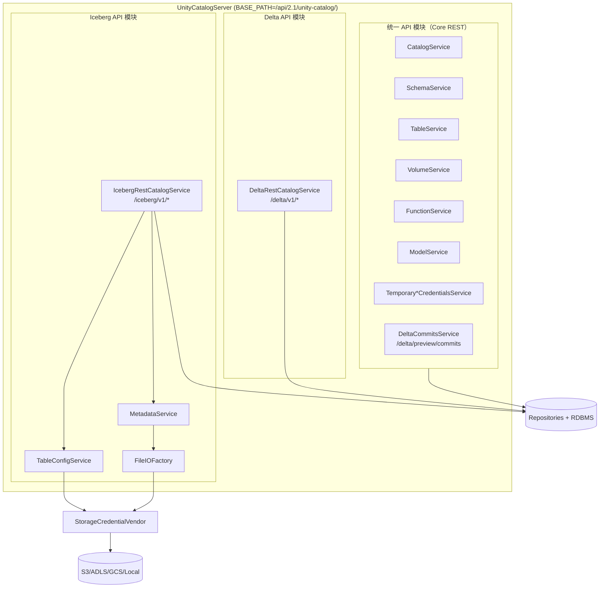
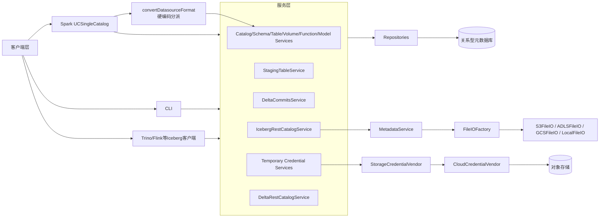
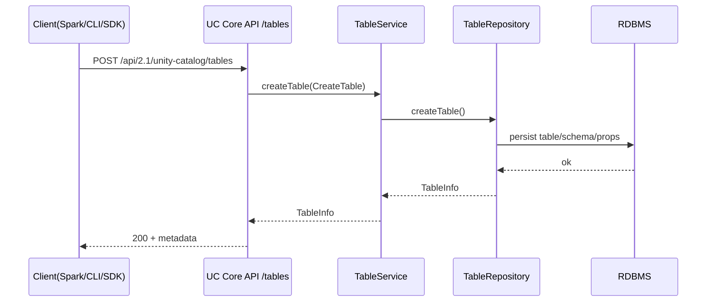
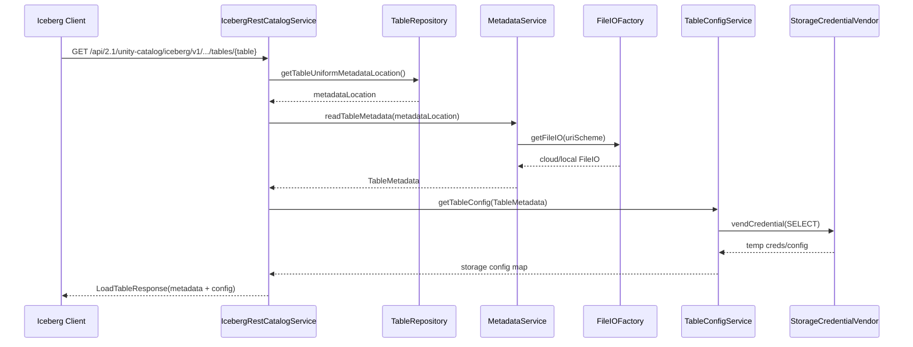
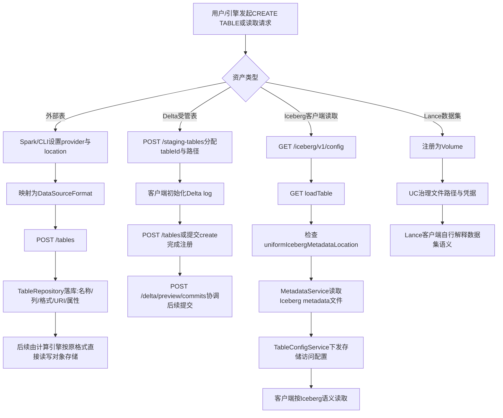

# Unity Catalog 技术研究报告

---


## 1. 报告目标与证据口径

### 1.1 研究边界

- 本报告以开源仓库源码与仓库内文档为主证据。
- 若涉及“托管版/产品版”能力，仅作为对照，不替代开源实现结论。
- 对未在源码或仓库文档明确给出的能力，统一标记为“公开资料未指定/未发现”。

### 1.2 仓库事实（可复核）

- 版本：`version.sbt` -> `ThisBuild / version := "0.5.0-SNAPSHOT"`
- 连接器目录：`connectors/spark`（无 `connectors/flink`、`connectors/trino`）
- 关键模块：`server`、`client`、`pythonClient`、`cli`、`spark`、`integration-tests`、`apiDocs`
- 核心服务装配入口：`server/src/main/java/io/unitycatalog/server/UnityCatalogServer.java`

### 1.3 服务装配结论

`UnityCatalogServer` 在统一网关 `BASE_PATH=/api/2.1/unity-catalog/` 下装配多类协议服务：

- Core REST（catalog/schema/table/volume/function/model 等）
- 临时凭据（table/volume/path）
- Delta preview commits（`/delta/preview/commits`）
- Iceberg REST（`/iceberg/v1/*`）
- Delta REST（`/delta/v1/*`）

这说明“统一”是同一入口下的多协议并挂，而非单一协议覆盖全部语义。

---


## 2. 执行摘要

1. **Unity Catalog** 支持“表数据 + 文件数据 + AI 资产（函数/模型）”。
2. **Iceberg 支持属于协议适配层**：通过 `IcebergRestCatalogService` 暴露 `/iceberg/v1/*` 子集端点，且以 `uniformIcebergMetadataLocation` 决定表是否对 Iceberg 客户端可见。
3. **Lance 在当前公开实现中定位为 Volume 资产治理**：可纳入命名空间、权限与凭据治理，但未发现 Lance 原生表 API 或 Lance REST Catalog 端点。
4. **统一 API 的真实策略是“统一控制面 + 分协议数据面”**：Core REST、Iceberg REST、Delta REST/preview 并存，不同格式的操作深度不等价。
5. **引擎适配以 Spark 为一等公民**：仓库有 `connectors/spark` 与完整集成文档；Trino 走 Iceberg REST；Flink 在本仓库内无专属连接器实现，工程上需按 Iceberg REST 路径自行验证版本矩阵。

---

## 3. 多格式支持与架构实现

### 2.1 支持矩阵

  | 对象 | 归属层 | 是否可直接作为 /tables 的 data_source_format | 主要入口 | 结论 |
  |---|---|---|---|---|
  | DELTA | 表格式 | 是 | /tables（含 managed delta 路径） | 一等公民 |
  | PARQUET | 表格式 | 是 | /tables | 外部表可用 |
  | ORC | 表格式 | 是 | /tables | 外部表可用 |
  | JSON | 表格式/文件 | 是（表） | /tables 或 /volumes | 表/文件双路径 |
  | CSV | 表格式 | 是 | /tables | 外部表可用 |
  | AVRO | 表格式 | 是 | /tables | 外部表可用 |
  | TEXT | 表格式/文件 | 是（表） | /tables 或 /volumes | 表/文件双路径 |
  | Iceberg | 协议层 | 否 | /iceberg/v1/* | 协议适配，不是 provider 枚举 |
  | Hudi | 声明层 | 否（当前仓库未见可核验表创建路径） | README/主页声明 | 公开实现细节不足 |
  | Lance | 文件资产层 | 否 | /volumes | 当前定位为 Volume 数据集 |
  | PDF等文件 | 文件资产层 | 否 | /volumes | 受治理但非表语义 |

**关键校准**：`/tables` 创建路径可证实的 `DataSourceFormat` 仅 7 种；Iceberg 与 Lance 不应和这 7 种在同一层“provider 枚举”中并列。

### 2.2 图 1：Iceberg API 与统一 API 模块实现图



解读：Core/Delta/Iceberg 在网关层并列；Iceberg 额外依赖元数据读取与对象存储配置下发链路。

### 2.3 图 2：源码级架构与扩展点



解读：公开实现的“扩展”主要体现为协议适配模块与 FileIO 分派；未见通用第三方格式 SPI 注册机制。

### 2.4 图 3：统一 API（创建外部表）请求调用图



解读：外部表路径本质是“格式标注 + 元数据落库 + 权限治理”，不是统一的格式转换流水线。

### 2.5 图 4：Iceberg API（load table）请求调用图



解读：Iceberg 访问依赖 Uniform 元数据位置字段，且当前实现对凭据下发呈只读导向。

### 2.6 图 5：元数据管理与格式转换流程



解读：公开资料里真正成体系的“跨语义暴露”是 Delta→UniForm→Iceberg 读取桥接；Lance 当前是 Volume 治理路径。


---

## 4. API 协议策略与功能支持度

### 3.1 协议分层

当前可核验协议族：

1. Core UC REST（`api/all.yaml`）
2. Iceberg REST（`/iceberg/v1/*`，兼容子集）
3. Delta REST（`api/delta.yaml` + `DeltaRestCatalogService`）
4. Delta preview commits（`/delta/preview/commits`）

### 3.2 API 端点与能力对照表（详细版）

| 协议族 | 代表端点 | 方法 | 主要能力 | 当前实现状态 | 备注 |
|---|---|---|---|---|---|
| UC Core REST | `/catalogs` `/schemas` `/tables` `/volumes` `/functions` `/models` | `GET/POST/PATCH/DELETE` | 目录控制面、外部表、Volume、函数模型治理 | 完整主控制面 | `/tables` 不等于所有格式同级表协议 |
| Delta staging | `/staging-tables` | `POST` | 受管 Delta 预创建（分配 tableId/路径） | 可见，规范为 Proposed | 受管表路径前置步骤 |
| Delta commits preview | `/delta/preview/commits` | `GET/POST` | 提交协调与状态回填 | 预览/演进路径 | 与通用表协议不等价 |
| Delta REST | `/delta/v1/config` `/delta/v1/catalogs/.../tables/...` | `GET/...` | Delta 专用协议面 | 开源 Java 服务侧已见关键实现入口 | 不是 Iceberg/Lance 通用协议 |
| Iceberg REST config | `/iceberg/v1/config` | `GET` | 暴露目录前缀和端点能力 | 已实现 | 需 `warehouse` 参数 |
| Iceberg REST namespace | `/iceberg/v1/catalogs/{catalog}/namespaces...` | `GET` | 命名空间查询 | 已实现子集 | 不支持多层嵌套 namespace |
| Iceberg REST table read | `HEAD/GET .../tables/{table}` | `HEAD/GET` | 表存在检查、加载元数据 | 已实现，读路径优先 | 依赖 `uniformIcebergMetadataLocation` |
| Iceberg REST view/metrics | `GET .../views/{view}` `POST .../metrics` | `GET/POST` | 视图/指标端点占位 | 有端点但能力有限 | 视图与指标语义仍较弱 |
| Volume API | `/volumes` `/temporary-volume-credentials` | `GET/POST/PATCH/DELETE` `POST` | 非表资产治理、路径与凭据管理 | 已实现 | Lance 当前归属该层 |
| Hive metastore 兼容 | 主页/README 声明 | 未公开端点细表 | 历史生态兼容声明 | 公开细节不足 | 需额外证据方可做端点级结论 |
| Lance 原生 REST | 未发现 | 未发现 | Lance 表协议 | 当前未公开 | 仅能确认 Volume 路径 |

### 3.3 原生标准 API 完备性判断

- **Iceberg REST**：当前是兼容子集，不是完整标准面；读路径明显强于写路径。
- **Hive metastore**：有兼容声明，但公开资料不足以形成端点级完整矩阵。
- **Lance REST**：当前公开资料未发现原生协议面。

### 3.4 统一 API 一致性（重点）

统一性体现在：

- 统一命名空间与对象治理模型
- 统一鉴权、权限模型、临时凭据下发
- 统一网关和资源管理

不一致体现在：

- Delta：有专门 staging/commit 协议链路
- Iceberg：通过 Uniform 元数据与 REST 适配提供可消费面
- Lance：当前是 Volume 容器治理，不具备同等级表操作语义

因此，统一 API 的准确表述应为：**控制面统一，数据面按协议分层并存在能力深浅差异**。

### 3.5 统一 API 策略对照表

| 对象/格式 | 统一 API 策略 | 语义真正落点 | 优势 | 代价 |
|---|---|---|---|---|
| Delta 受管表 | 自定义协调协议 | UC 协调提交 + Delta 日志维护状态 | 治理与提交可集中纳入目录层 | 协议并非通用标准，跨引擎需专门适配 |
| Iceberg/UniForm | 标准协议适配 | Iceberg 元数据 + Iceberg 客户端解释 | 多引擎可复用 Iceberg 生态 | 当前开源面偏读、可见性受 Uniform 元数据约束 |
| Lance/非表格文件 | Volume 容器治理 | 外部客户端解释文件/目录 | 快速纳入治理、权限与凭据统一 | 缺少表级 schema/快照/DML 一致性 |

### 3.6 Time Travel 语义边界（重点补充）

- Iceberg：公开实现主要是 `loadTable` 返回标准元数据，时间旅行能力更多由 Iceberg 客户端基于元数据解释实现，而非 UC 提供额外统一时间旅行 API。
- Lance：因无公开 Lance 原生表协议，无法在当前资料下确认“通过 UC 原生 Lance API 做时间旅行”的路径。

---

## 5. 计算引擎适配与迁移成本

### 4.1 Spark（一等公民）

证据链：

- 模块：`connectors/spark`
- 文档：`docs/integrations/unity-catalog-spark.md`
- 核心类：`io.unitycatalog.spark.UCSingleCatalog`

`spark-sql` 示例（仓库文档风格）：

```bash
bin/spark-sql --name "local-uc-test" \
  --master "local[*]" \
  --packages "io.delta:delta-spark_2.13:4.0.0,io.unitycatalog:unitycatalog-spark_2.13:0.3.0" \
  --conf "spark.sql.extensions=io.delta.sql.DeltaSparkSessionExtension" \
  --conf "spark.sql.catalog.<catalog_name>=io.unitycatalog.spark.UCSingleCatalog" \
  --conf "spark.sql.catalog.<catalog_name>.uri=http://localhost:8080" \
  --conf "spark.sql.catalog.<catalog_name>.token=" \
  --conf "spark.sql.defaultCatalog=<catalog_name>"
```

`spark-defaults.conf` 最小模板：

```properties
spark.sql.extensions=io.delta.sql.DeltaSparkSessionExtension
spark.sql.catalog.spark_catalog=io.unitycatalog.spark.UCSingleCatalog

spark.sql.catalog.unity=io.unitycatalog.spark.UCSingleCatalog
spark.sql.catalog.unity.uri=http://localhost:8080
spark.sql.catalog.unity.token=
spark.sql.defaultCatalog=unity

spark.jars.packages=io.delta:delta-spark_2.12:3.2.1,io.unitycatalog:unitycatalog-spark_2.12:0.2.0

# 如使用 S3 再增加
spark.hadoop.fs.s3.impl=org.apache.hadoop.fs.s3a.S3AFileSystem
```

PySpark 最小示例：

```python
from pyspark.sql import SparkSession

spark = SparkSession.builder.getOrCreate()

spark.sql("SHOW SCHEMAS").show()

spark.sql("""
CREATE TABLE demo.mytable (
  id INT,
  desc STRING
)
USING delta
LOCATION '/tmp/tables/mytable'
""")

spark.sql("INSERT INTO demo.mytable VALUES (1, 'test 1')")
spark.table("default.marksheet").show(5)
```

源码边界（需在迁移评估中显式纳入）：

- `alterTable`、`renameTable` 等能力仍存在未实现分支
- 嵌套 namespace 不支持
- managed 表路径仅支持 Delta

### 4.2 Trino（Iceberg REST 路径）

`iceberg.properties` 示例：

```properties
connector.name=iceberg
iceberg.catalog.type=rest
iceberg.rest-catalog.uri=http://127.0.0.1:8080/api/2.1/unity-catalog/iceberg
iceberg.rest-catalog.security=OAUTH2
iceberg.rest-catalog.oauth2.token=not_used
```

结论：Trino 适配消费的是 Iceberg 协议面，不是 UC 自定义表协议面。

### 4.3 Flink（仓库内无专属连接器实现）

本仓库事实：

- 无 `connectors/flink`
- `docs/integrations/index.md` 未给出 Flink 专属一手集成文档

工程推断路径（需自行验证）：

```sql
CREATE CATALOG uc WITH (
  'type'='iceberg',
  'catalog-type'='rest',
  'uri'='http://127.0.0.1:8080/api/2.1/unity-catalog/iceberg'
);
```

### 4.4 迁移成本对比表

| 引擎 | 接入路径 | 依赖与配置复杂度 | 可访问能力面 | 主要风险 | 迁移成本 |
|---|---|---|---|---|---|
| Spark | `UCSingleCatalog` | 中（依赖/JAR/认证/对象存储配置） | Delta 最完整 + 7 种外部表格式 | 部分 DDL 未实现；managed 仅 Delta | 低-中 |
| Trino | Iceberg REST | 中（catalog 配置较直接） | Iceberg 或 UniForm 暴露面 | 受 Iceberg REST 子集和 Uniform 可见性约束 | 中 |
| Flink | Iceberg REST（推断路径） | 中-高（需自行补齐版本矩阵） | Iceberg 或 UniForm 暴露面 | 仓库缺少一手实现与官方实操文档 | 中-高 |


---

## 6. 关键结论

### 5.1 关键结论

1. 多格式支持不能只看市场描述，必须分三层：
   - 表创建枚举层（7 种）
   - 标准协议适配层（Iceberg）
   - 文件资产治理层（Volume，含 Lance）
2. 统一 API 不是同构 API：统一的是治理框架，不是每个格式都具备等价 CRUD/事务/时间旅行能力。
3. 开源实现与托管形态存在能力差异，架构评估必须先锁定发行形态。

### 5.2 关键图表与阅读指引

本报告包含关键图表并配套解释，包括：

- Iceberg API 与统一 API 模块图
- 源码级模块与扩展点图
- 外部表创建调用图
- Iceberg load table 调用图
- 元数据与格式转换流程图
- Unity 整体架构图
- 引擎迁移决策流图

并为每张图新增了解读段，确保图表不是“贴图”而是“可读证据”。

---

## 7. 风险与实施建议

### 6.1 仍未闭环的问题

1. 公开源码未展示通用第三方格式 SPI/插件注册机制。
2. Lance 原生表协议与 REST 端点在公开资料中未出现。
3. Hive metastore 兼容虽有声明，但缺乏端点级公开对照材料。
4. Flink 缺少本仓库内专属连接器与一手集成文档。

### 6.2 工程化建议

1. 若目标是“格式无差别统一表 API”，需设计并实现格式 SPI 与一致性测试矩阵。
2. 若目标是“多引擎共享”，优先增强 Uniform/Iceberg 写路径与兼容性验证。
3. 若目标包含 Lance 表级治理，需新增 Lance Catalog/REST 协议层，而不止 Volume 治理。
4. 补齐 Flink 官方集成文档与 CI 场景，降低迁移评估不确定性。

---

## 8. 证据索引（关键文件）

- `version.sbt`
- `build.sbt`
- `api/all.yaml`
- `api/delta.yaml`
- `spec/protocols/ManagedTablesSpec.md`
- `server/src/main/java/io/unitycatalog/server/UnityCatalogServer.java`
- `server/src/main/java/io/unitycatalog/server/service/IcebergRestCatalogService.java`
- `server/src/main/java/io/unitycatalog/server/service/delta/DeltaRestCatalogService.java`
- `server/src/main/java/io/unitycatalog/server/service/iceberg/MetadataService.java`
- `server/src/main/java/io/unitycatalog/server/service/iceberg/FileIOFactory.java`
- `server/src/main/java/io/unitycatalog/server/service/iceberg/TableConfigService.java`
- `server/src/main/java/io/unitycatalog/server/persist/TableRepository.java`
- `connectors/spark/src/main/scala/io/unitycatalog/spark/UCSingleCatalog.scala`
- `docs/usage/volumes.md`
- `docs/usage/tables/uniform.md`
- `docs/integrations/unity-catalog-spark.md`
- `docs/integrations/unity-catalog-trino.md`
- `docs/integrations/index.md`


