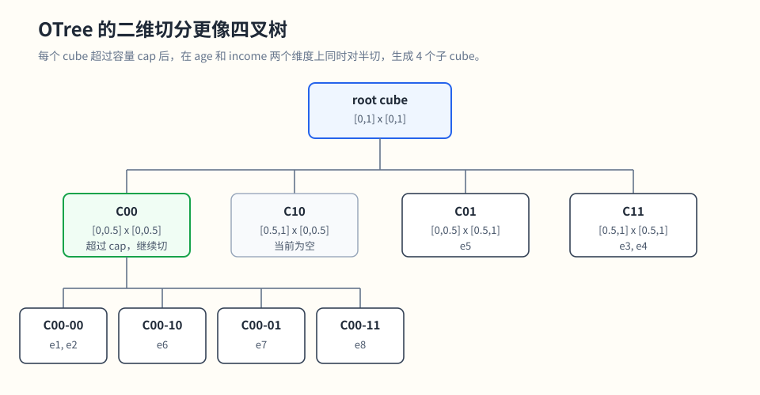

# 数据聚簇技术调研：

## 1. 引入

数据聚簇想解决的问题很直接：

> 让逻辑上相关、值域上邻近的数据，尽量在物理上也邻近存储。

如果做到这点，查询时就更容易：

- 少读文件
- 少读无关数据
- 更有效地利用 `min/max` 之类的文件统计信息

更准确的理解是：聚簇希望让连续或相近的值域范围在物理上也尽量集中。例如不同年龄段内的数据尽可能聚集，而不是让某个年龄段的数据分散到所有文件里。

一个更典型的场景是连续范围过滤：

- `age between 20 and 30`
- `income between 10w and 30w`

如果这个连续范围内的数据被打散在所有文件里，查询几乎要全扫；如果这部分数据集中在少量文件里，查询就能少读很多数据。


因此，所谓聚簇，本质上是在回答这个问题：

> 如何把逻辑值域上的邻近关系，尽量转化成物理存储上的邻近关系？

如果两行数据在所有聚簇键列上的取值，能够被某个紧致的超矩形所覆盖，那么它们应当尽可能落在同一个或相邻的物理存储单元（如文件、块、排序区间）中。换言之，对选择性较高、与聚簇键匹配的轴对齐范围查询，理想情况下可以显著减少需要访问的物理单元。

可以先把几类聚簇算法放到同一个视角里理解：

- `Z-order`：把多维坐标压成一个一维排序键，再按这个键重排数据
- `Hilbert curve`：同样属于空间填充曲线，把多维空间映射成一维顺序，但更强调邻近性保留
- `Qbeast OTree`：不先拉平成一条线，而是直接把空间递归切成树

---

## 2. 算法介绍

## 2.1 Z-order：最容易理解和落地的空间填充曲线

### 核心原理

Z-order 也叫 `Morton order`。它的做法是：

1. 先把每一维的原始值映射到可比较的整数坐标
2. 再把各维坐标的二进制位按高位到低位交错拼接
3. 得到一个可以排序的一维 `Z-order key`
4. 最后按这个 key 对数据或文件进行重排

以二维空间为例，如果两个点在多个维度上的高位前缀相同，它们通常会先落在同一个粗粒度空间区域里，排序后也更可能靠近。反过来，如果某个范围查询只覆盖少量空间区域，那么这些区域中的数据也更可能集中在少量连续的排序区间和文件中。

交错位：

```text
x(3): 0 1 1
y(6): 1 1 0
interleave -> 0 1 1 1 1 0 = 30

x(3): 0 1 1
y(7): 1 1 1
interleave -> 0 1 1 1 1 1 = 31

x(4): 1 0 0
y(7): 1 1 1
interleave -> 1 1 0 1 0 1 = 53
```

这样每个二维点都得到一个一维编号。比如 `(3,6)` 和 `(3,7)` 的高位前缀完全相同，所以编号也连续；而 `(4,7)` 虽然在二维空间里和 `(3,7)` 相邻，但因为跨过了某个高位边界，编号会从 `31` 跳到 `53`。

这说明 Z-order 保留的是“前缀意义上的空间局部性”，不是严格的距离保持。相同高位前缀的数据通常会聚在一起，但空间上相邻的点并不保证在一维排序后仍然相邻，尤其是在象限或子象限边界附近会出现明显跳跃。

### 它如何帮助查询

如果数据按 Z-order 写入文件，那么：

- 同一片空间区域的数据更可能落在相邻文件
- 每个文件的列统计信息更“紧”
- 多列过滤时更容易跳过不相关文件

它的收益主要体现在：

- `file pruning` 更有效
- 扫描字节数下降
- 多列过滤比单列排序更均衡

### 算法本身的成本

Z-order 的算法计算开销相对最轻，主要可以分成三层：

- 预处理：把原始列值离散化或标准化
- 编码计算：计算 `Z-order key`
- 布局成本：排序和重写数据

也就是说，它的难点通常不在编码计算本身，而在数据重排这一层。

### 增量数据怎么处理

Z-order 本身没有天然的增量布局维护能力。新数据通常先按普通方式写入，后续再通过 `OPTIMIZE ... ZORDER BY` 或类似重写任务，重新融入既有布局。

### 优点和限制

优点：

- 简单直接
- 编码成本低
- 工程实现成熟
- 很适合作为空间聚簇的起点

限制：

- 局部性保留不是最优
- 象限边界处可能出现明显跳跃
- 维度一多，效果会被稀释
- 持续增量写入后布局容易退化

一句话理解：

> Z-order 的本质，是把多列值压成一个可排序的一维键，再借助文件重排提升跳读能力。

---

## 2.2 Hilbert Curve：更强调邻近性保留的空间填充曲线

### 核心原理

Hilbert curve 和 Z-order 都属于 `Space Filling Curve`。两者的共同目标是：把二维或更高维空间中的点映射成一维顺序，使存储系统可以按一个排序键组织数据。

这个目标本身就是有损近似：多维空间里的邻近关系不可能被一条一维顺序完整保留。空间填充曲线能做的是尽量让局部区域映射到较少的一维区间，而不是保证所有近邻点在一维上都近。

差异在于映射方式。

`Z-order` 的理论基础是位交错：把每个维度的坐标二进制位按高低位交错拼起来。这样做计算很便宜，但在边界附近会出现明显跳跃。

`Hilbert curve` 的理论基础是递归构造一条连续路径。它把空间不断细分成小格子，同时要求曲线进入、遍历、离开子空间时尽量保持连续方向。这样会减少 Z-order 那种跨象限跳跃，因此通常更容易保留空间局部性。


简单说：

- `Z-order`：通过位交错得到顺序，计算简单，但局部性保留较粗
- `Hilbert`：通过递归连续路径得到顺序，计算更重，但局部性更好

如果从过程上理解，可以拆成四步：

1. 把参与聚簇的列离散化到有限网格
2. 在网格上构造 Hilbert 访问路径
3. 每个格子获得一个 `Hilbert index`
4. 数据按 `Hilbert index` 排序写入

但 Hilbert 仍然不是严格的空间距离保持。它只能缓解 Z-order 那种明显的跨象限跳跃，不能消除多维空间线性化本身的信息损失。一个多维范围查询映射到 Hilbert 顺序后，仍然可能被拆成多个一维区间；维度越高、查询范围越复杂，这种局部性损失也越明显。

### 它如何帮助查询

Hilbert 的核心优势在于更强的局部性保留。因为它构造的是一条尽量连续、少跳跃的访问路径，所以原本在空间里相邻的一片区域，映射到一维顺序后，通常也更容易保持连续区间，而不是被切得很碎。

意味着：

- 读的连续块更少
- 文件命中更集中
- 读放大更低

因此，在多维范围过滤场景下，Hilbert 通常会比 Z-order 得到更紧凑的布局。

这里的“更强”是相对于 Z-order 的经验和理论性质。它通常能让局部区域映射得更集中，但收益仍然受维度数量、查询形状和数据分布影响。

### 算法本身的成本

Hilbert 的算法计算开销明显高于 Z-order，主要也可以分成三层：

- 预处理：把原始列值离散化到有限网格
- 编码计算：构建路径，计算 `Hilbert index`
- 布局成本：排序和重写数据

也就是说，它和 Z-order 一样也要面对排序和重写，但 `Hilbert index` 的计算本身更复杂，因为里面包含递归路径和坐标变换。

### 增量数据怎么处理

Hilbert 对增量数据的处理方式，和 Z-order 很接近。新数据先写入，后续再通过重写或 recluster 任务统一计算新的 Hilbert 顺序并整理文件。

也就是说，它同样缺少天然的增量布局维护能力，布局质量能否保持主要取决于后台重写频率。

### 优点和限制

优点：

- 局部性通常优于 Z-order
- 多列范围过滤下往往更有效
- 查询区域映射到一维后更不容易被切碎

限制：

- `Hilbert index` 计算比 Z-order 更复杂，构建成本更高
- 对增量写入没有天然优势，想维持布局效果仍然主要依赖重写
- 高维场景下仍会退化，无法避免多维空间线性化的信息损失
- 收益主要体现在多列范围过滤场景里；如果查询模式简单，未必能明显优于 Z-order

一句话理解：

> Hilbert 可以看成比 Z-order 更强调局部性保留的空间曲线：目标相同，但仍然只是对多维邻近关系的近似线性化。

---

## 2.3 Qbeast OTree：把多维空间切成树

### 核心原理

Qbeast OTree 不先把多维空间拉平成一条线，而是：

1. 先把聚簇列映射到一个有界的标准化空间，通常每一维都落到 `[0,1]`
2. 把整个 `n` 维标准化空间看成根节点 `root cube`
3. 当前 `cube` 还不足以容纳或区分这些数据时，就继续往下切成更小的子 `cube`
4. 按固定规则递归切分空间：每次都把当前空间在每一维上对半切开，因此一维切成 2 段，二维切成 4 个子方块，三维切成 8 个子立方体
5. 数据按 `cube` 组织成 `block`，并最终写入真实文件
6. 读写和后续优化都围绕这棵树进行

理解 OTree 时，最重要的是先分清三层结构：`cube`、`block` 和 `file`。

- `cube` 是逻辑空间节点。它对应 n 维空间中的一个子区域，比如二维时就是一个矩形区域，三维时就是一个立方体或长方体区域。OTree 的递归切分发生在这一层。
- `block` 是围绕某个 `cube` 组织出来的数据单元。一个 `cube` 里的数据不一定只形成一个 `block`，数据量变大或后续优化后，可能拆成多个 `block`。
- `file` 是最终落盘的物理文件。一个文件可以承载一个或多个 `block`，这些 `block` 也可能来自不同的 `cube`。

所以 OTree 的关系不是“一个 cube 就等于一个文件”，而是：

```text
cube -> block -> file
```

`cube` 负责表达多维空间位置，`block` 负责承载 cube 下的数据片段，`file` 负责真实存储。这样设计的好处是，**查询时可以先根据过滤条件定位相关** `cube`，再找到这些 `cube` 对应的 `block` 和 `file`；但它也意味着逻辑空间上的邻近，不等于物理文件上一定完全重合。

### OTree 示例

下面用一个二维例子把 OTree 的流程串起来。假设聚簇列是 `age` 和 `income`，它们都已经被归一化到 `[0,1]`，并且每个 `cube` 最多直接容纳 4 条记录。

**第一步，数据先进入根空间：**

```text
root cube = [0,1] x [0,1]

数据映射后：
e1 -> (age=0.12, income=0.18)
e2 -> (age=0.16, income=0.22)
e3 -> (age=0.68, income=0.74)
e4 -> (age=0.72, income=0.66)
e5 -> (age=0.18, income=0.78)
```

此时 root cube 中有 5 条记录，超过了预设容量 `cap=4`，所以 root 触发切分。

**第二步，OTree 在每个维度上对半切。二维时一次切分会得到 `2^2 = 4` 个等大小、互不重叠的子 `cube`；三维时会得到 `2^3 = 8` 个子 `cube`。**

```text
income
  ^
  |
1 +-----------------------+-----------------------+
  | C01                   | C11                   |
  | [0,0.5] x [0.5,1]     | [0.5,1] x [0.5,1]     |
  | e5                    | e3, e4                |
0.5+-----------------------+-----------------------+
  | C00                   | C10                   |
  | [0,0.5] x [0,0.5]     | [0.5,1] x [0,0.5]     |
  | e1, e2                |                       |
0 +-----------------------+-----------------------+--> age
  0                      0.5                      1
```

切分后，每条记录只需要根据坐标落入对应子空间。

**第三步，如果某个子 `cube` 后续又超过 `cap`，就在这个子空间里继续等分切。比如还有 3 条落在 `C00` 的记录：**

```text
e6 -> (age=0.32, income=0.12)
e7 -> (age=0.10, income=0.34)
e8 -> (age=0.38, income=0.42)
```

此时 `C00` 中共有 5 条记录，超过 `cap=4`，所以 `C00` 继续切成 4 个更小的子 `cube`：

```text
C00 = [0,0.5] x [0,0.5]

income
  ^
0.5 +----------------+----------------+
    | C00-01         | C00-11         |
    | [0,0.25]       | [0.25,0.5]     |
    | x [0.25,0.5]   | x [0.25,0.5]   |
    | e7             | e8             |
0.25+----------------+----------------+
    | C00-00         | C00-10         |
    | [0,0.25]       | [0.25,0.5]     |
    | x [0,0.25]     | x [0,0.25]     |
    | e1, e2         | e6             |
  0 +----------------+----------------+--> age
    0               0.25             0.5
```

这里可以看出：

- 同一多维子空间内的数据容易进入同一个 cube
- 但这不代表它们永远留在同一个最细 cube，只是更可能先共享更高层空间

如果换成树形视角，二维 OTree 每次不是切成 2 个子节点，而是切成 `2^2 = 4` 个子 `cube`，所以它更像四叉树：



**第四步，数据不是简单“到了某个 cube 就整批塞进去”，而是还要结合 `payload / maxWeight / offset` 决定停在哪一层。可以把它理解成：一部分数据保留在当前 cube 的 `payload`，放不下或需要继续下沉的数据进入更细的子 cube。**

```text
cube C00-00 [0,0.25] x [0,0.25]
|-- payload: [e1]        # 当前层保留的数据
|-- maxWeight: 10        # 当前层 payload 的权重边界
|-- offset: [e2, ...]    # 需要继续下沉的数据
`-- children
    |-- cube C00-00-00
    |-- cube C00-00-01
    |-- cube C00-00-10
    `-- cube C00-00-11
```

可以先粗略理解成：

- `payload`：当前层保留的数据
- `maxWeight`：决定后续数据是停在本层还是继续往子 cube 下沉
- `offset`：当前层还没直接消化掉的数据

**最后，真正落盘时不是 “一个 cube = 一个文件”，而是 `cube -> block -> file`：**

```text
cube C00-00
|-- block C00-00-1 -> file-1.parquet
`-- block C00-00-2 -> file-3.parquet

cube C11
`-- block C11-1  -> file-1.parquet

file-1.parquet: [block C00-00-1][block C11-1]
file-3.parquet: [block C00-00-2]
```

这说明：

- 一个 cube 可能对应多个 blocks
- 一个 block 属于某个 cube
- 一个文件里可以混有多个 cube 的 blocks

所以 OTree 逻辑上虽然按空间组织得很清楚，但物理上仍然可能逐渐碎片化。

### 它如何帮助查询

OTree 的强项不只是改善物理聚集度，而是让查询更直接地命中空间节点。

- 传统聚簇方案通常是“先看文件值域，再决定读不读文件”；

- OTree 则是“先把查询映射到多维空间，定位命中的 cubes，再找到相关 blocks/files”，因此它比传统聚簇更早一步介入查询裁剪。

### 为什么它更适合采样

OTree 的另一个特点是采样能力。原因不是“随便拿一个 cube 就能代表全表”，而是：

- `cube` 提供空间分组
- `weight` 提供随机分层

所以采样时不需要先把全量数据读出来再随机抽，父节点保留的数据对所有子节点的数据具有代表性。

简单说：

> cube 解决“按多维空间区域组织数据”，weight 解决“采样别只看到某个局部区域”。

### 算法本身的成本

OTree 的算法成本也可以分成三层：

- 预处理：把聚簇列映射到标准化空间
- 空间组织：根据坐标定位 `cube`，再结合 `payload / maxWeight / offset` 决定数据停在哪一层
- 布局与维护：把数据组织成 `block`、写入文件，并在后续持续处理碎片化和 revision 演化

也就是说，它的难点不只是一次写入怎么落盘，而是整套空间组织和后续维护都会更复杂。

### 增量数据怎么处理

OTree 对增量数据的处理，和 Z-order/Hilbert 不一样。新记录不是简单写完以后下次全表重排，而是会按当前空间划分和节点状态，插入到对应 cube 或层级中，必要时再触发进一步切分、revision 演化或后台整理。

也就是说，它更接近“写入时就参与布局维护”。

### 优点和限制

优点：

- 天然支持多维空间划分
- 多维范围查询更直观
- 原生支持更强的采样能力
- revision 机制允许空间定义演化

限制：

- 系统复杂度高
- 物理布局仍可能碎片化
- 读写协议、元数据和优化过程都更重
- 理解和实现门槛明显更高

一句话理解：

> OTree 不是另一种排序曲线，而是一种把多维空间直接切成树的布局和索引体系。

## 3. 总结对比

| 维度 | Z-order | Hilbert Curve | Qbeast OTree |
|---|---|---|---|
| 基本思想 | 多维坐标交错编码成一维 | 用连续空间填充曲线线性化空间 | 递归切分 n 维空间并组织成树 |
| 数据组织 | 以排序键重排文件 | 以曲线顺序重排文件 | 按 cube / tree node 组织数据 |
| 结构特征 | 一维排序键 | 一维路径编号 | 树形空间结构 |
| 查询收益 | 好 | 多列范围过滤通常更好 | 多维范围过滤和采样通常最强 |
| file pruning / 读放大 | 好 | 通常优于 Z-order | 很强 |
| 算法计算开销 | 低 | 中到高 | 高 |
| 增量数据处理 | 主要依赖后续重写 | 主要依赖后续重写 | 写入时就参与空间维护 |
| 重写 / 维护开销 | 低，但依赖周期性重写 | 中，收益要靠 workload 证明 | 高，协议和元数据都更重 |
| 持续写入下稳定性 | 一般，容易退化 | 一般，容易退化 | 中到高 |
| 采样能力 | 无原生优势 | 无原生优势 | 强，是核心亮点之一 |
| 理解难度 | 低 | 中 | 高 |

如果只用一句话概括：

- `Z-order` 是最直接的多维排序布局
- `Hilbert` 是更强调局部性的空间曲线
- `OTree` 是把多维布局升级成树形空间组织
