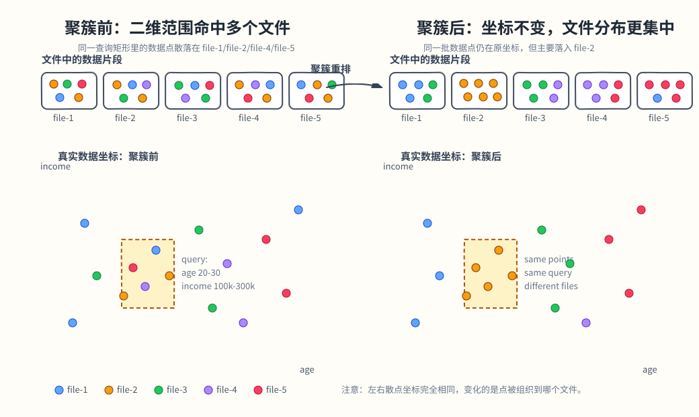
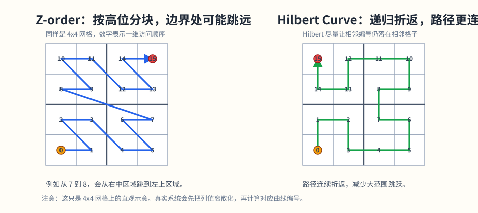

# 数据聚簇技术调研：

## 1. 引入

数据聚簇想解决的问题很直接：

> 让逻辑上相关、值域上邻近的数据，尽量在物理上也邻近存储。

如果做到这点，查询时就更容易：

- 少读文件
- 少读无关数据
- 更有效地利用 `min/max` 之类的文件统计信息

更准确的理解是：聚簇希望让连续或相近的值域范围在物理上也尽量集中。例如不同年龄段内的数据尽可能聚集，而不是让某个年龄段的数据分散到所有文件里。

一个更典型的场景是连续范围过滤：

- `age between 20 and 30`
- `income between 10w and 30w`

如果这个连续范围内的数据被打散在所有文件里，查询几乎要全扫；如果这部分数据集中在少量文件里，查询就能少读很多数据。



因此，所谓聚簇，本质上是在回答这个问题：

> 如何把逻辑值域上的邻近关系，尽量转化成物理存储上的邻近关系？

如果两行数据在所有聚簇键列上的取值，能够被某个紧致的超矩形所覆盖，那么它们应当尽可能落在同一个或相邻的物理存储单元（如文件、块、排序区间）中。换言之，任何一个轴对齐的范围查询，理想情况下都只需要访问极少量物理单元。

可以先把几类聚簇算法放到同一个视角里理解：

- `Z-order`：把多维坐标压成一个一维排序键，再按这个键重排数据
- `Hilbert curve`：同样属于空间填充曲线，把多维空间映射成一维顺序，但更强调邻近性保留
- `Qbeast OTree`：不先拉平成一条线，而是直接把空间递归切成树
- `XSTORE MCK`：不先构造树，而是先把数据切成一批多维块，再利用块级范围过滤

---

## 2. 算法介绍

## 2.1 Z-order：最容易理解和落地的空间填充曲线

### 核心原理

Z-order 也叫 `Morton order`。它的做法是：

1. 先把每一维值离散化或标准化
2. 把每一维的二进制位交错拼接
3. 得到一个一维排序键
4. 按这个键重排数据

交错位：

```text
x(3): 0 1 1
y(6): 1 1 0
interleave -> 0 1 1 1 1 0 = 30

x(3): 0 1 1
y(7): 1 1 1
interleave -> 0 1 1 1 1 1 = 31

x(4): 1 0 0
y(7): 1 1 1
interleave -> 1 1 0 1 0 1 = 53
```

这样每个二维点都得到一个一维编号。越高位代表越粗粒度的空间划分，所以如果两个点在每一维的高位前缀都相同，它们的 Z-order 编号通常也会比较接近。

但这不是严格的“空间距离保持”。Z-order 只是保留了一部分前缀层面的空间局部性，在边界附近会出现明显跳跃。

### 它如何帮助查询

如果数据按 Z-order 写入文件，那么：

- 同一片空间区域的数据更可能落在相邻文件
- 每个文件的列统计信息更“紧”
- 多列过滤时更容易跳过不相关文件

它的收益主要体现在：

- `file pruning` 更有效
- 扫描字节数下降
- 多列过滤比单列排序更均衡

### 算法本身的成本

Z-order 的算法计算开销相对最轻，主要可以分成三层：

- 预处理：把原始列值离散化或标准化
- 编码计算：计算 `Z-order key`
- 布局成本：排序和重写数据

也就是说，它的难点通常不在编码计算本身，而在数据重排这一层。

### 增量数据怎么处理

Z-order 本身没有天然的增量布局维护能力。新数据通常先按普通方式写入，后续再通过 `OPTIMIZE ... ZORDER BY` 或类似重写任务，重新融入既有布局。

### 优点和限制

优点：

- 简单直接
- 编码成本低
- 工程实现成熟
- 很适合作为空间聚簇的起点

限制：

- 局部性保留不是最优
- 象限边界处可能出现明显跳跃
- 维度一多，效果会被稀释
- 持续增量写入后布局容易退化

一句话理解：

> Z-order 的本质，是把多列值压成一个可排序的一维键，再借助文件重排提升跳读能力。

---

## 2.2 Hilbert Curve：更强调邻近性保留的空间填充曲线

### 核心原理

Hilbert curve 和 Z-order 都属于 `Space Filling Curve`。两者的共同目标是：把二维或更高维空间中的点映射成一维顺序，使存储系统可以按一个排序键组织数据。

这个目标本身就是有损近似：多维空间里的邻近关系不可能被一条一维顺序完整保留。空间填充曲线能做的是尽量让局部区域映射到较少的一维区间，而不是保证所有近邻点在一维上都近。

差异在于映射方式。

`Z-order` 的理论基础是位交错：把每个维度的坐标二进制位按高低位交错拼起来。这样做计算很便宜，但在边界附近会出现明显跳跃。

`Hilbert curve` 的理论基础是递归构造一条连续路径。它把空间不断细分成小格子，同时要求曲线进入、遍历、离开子空间时尽量保持连续方向。这样会减少 Z-order 那种跨象限跳跃，因此通常更容易保留空间局部性。



简单说：

- `Z-order`：通过位交错得到顺序，计算简单，但局部性保留较粗
- `Hilbert`：通过递归连续路径得到顺序，计算更重，但局部性更好

如果从过程上理解，可以拆成四步：

1. 把参与聚簇的列离散化到有限网格
2. 在网格上构造 Hilbert 访问路径
3. 每个格子获得一个 `Hilbert index`
4. 数据按 `Hilbert index` 排序写入

这也是为什么 Hilbert 通常比 Z-order 更强调邻近性保留：它在构造顺序时，会主动让路径尽量连续，例如`(3,7)` 到 `(4,7)`，减少象限边界两侧编号突然拉开的情况，而不是只依赖位交错后的编码前缀。

### 它如何帮助查询

Hilbert 的核心优势在于更强的局部性保留。因为它构造的是一条尽量连续、少跳跃的访问路径，所以原本在空间里相邻的一片区域，映射到一维顺序后，通常也更容易保持连续区间，而不是被切得很碎。

意味着：

- 读的连续块更少
- 文件命中更集中
- 读放大更低

因此，在多维范围过滤场景下，Hilbert 通常会比 Z-order 得到更紧凑的布局。

这里的“更强”是相对于 Z-order 的经验和理论性质，不代表 Hilbert 可以消除多维到一维的损失。维度增加以后，局部区域被一维曲线切碎的概率仍然会上升，查询范围映射成的一维区间也可能变多，这就是空间曲线在高维场景下会退化的原因之一。

### 算法本身的成本

Hilbert 的算法计算开销明显高于 Z-order，主要也可以分成三层：

- 预处理：把原始列值离散化到有限网格
- 编码计算：构建路径，计算 `Hilbert index`
- 布局成本：排序和重写数据

也就是说，它和 Z-order 一样也要面对排序和重写，但 `Hilbert index` 的计算本身更复杂，因为里面包含递归路径和坐标变换。

### 增量数据怎么处理

Hilbert 对增量数据的处理方式，和 Z-order 很接近。新数据先写入，后续再通过重写或 recluster 任务统一计算新的 Hilbert 顺序并整理文件。

也就是说，它同样缺少天然的增量布局维护能力，布局质量能否保持主要取决于后台重写频率。

### 优点和限制

优点：

- 局部性通常优于 Z-order
- 多列范围过滤下往往更有效
- 查询区域映射到一维后更不容易被切碎

限制：

- `Hilbert index` 计算比 Z-order 更复杂，构建成本更高
- 对增量写入没有天然优势，想维持布局效果仍然主要依赖重写
- 高维场景下仍会退化，无法避免多维空间线性化的信息损失
- 收益主要体现在多列范围过滤场景里；如果查询模式简单，未必能明显优于 Z-order

一句话理解：

> Hilbert 可以看成比 Z-order 更强调局部性保留的空间曲线：目标相同，但仍然只是对多维邻近关系的近似线性化。

---

## 2.3 Qbeast OTree：把多维空间切成树

### 核心原理

Qbeast OTree 不先把多维空间拉平成一条线，而是：

1. 先把聚簇列映射到一个有界的标准化空间，通常每一维都落到 `[0,1]`
2. 把整个 `n` 维标准化空间看成根节点 `root cube`
3. 当前 `cube` 还不足以容纳或区分这些数据时，就继续往下切成更小的子 `cube`
4. 按固定规则递归切分空间：每次都把当前空间在每一维上对半切开，因此一维切成 2 段，二维切成 4 个子方块，三维切成 8 个子立方体
5. 数据按 `cube` 组织成 `block`，并最终写入真实文件
6. 读写和后续优化都围绕这棵树进行

OTree 并不严格保证邻近的数据都聚簇在同一个文件里。它更准确地说，是先按多维空间划分把数据放入对应的空间区域、`cube` 或父子 `cube` 中；但真正落盘时，数据还会进一步拆成 `block`，并分布到真实文件里，所以“落在相近空间区域”不等于“文件上一定完全重合”。

这也是它和前面几种聚簇思路最不一样的地方：`Z-order`、`Hilbert`更像先决定一维顺序，再围绕这个顺序整理文件；`OTree` 则是先定义多维空间结构，再让数据直接按这套空间结构组织起来。

它和传统多维索引也不完全一样。传统索引通常是“索引是索引，数据是数据”；而 `OTree` 更像把空间划分、数据布局和读取裁剪揉在一起，数据布局本身就是索引的一部分。

### cube 的结构

Qbeast 里几个关键概念是：

- `cube`：树中的一个节点，对应一个 n 维子空间
- `payload`：这个 cube 当前保留的那部分数据
- `weight`：写入时给记录分配的随机权重
- `maxWeight`：当前 cube payload 中最大的权重
- `offset`：还没在这一层直接消化掉的数据
- `revision`：一次索引配置版本

如果按“空间怎么切、数据怎么下沉、最后怎么落盘”来画，一个简化过程可以表示成这样。

第一步，先把聚簇列映射到标准化空间。假设有两列 `age` 和 `income`，都被归一化到 `[0,1]`：

```text
root cube = [0,1] x [0,1]

数据映射后：
e1 -> (age=0.12, income=0.18)
e2 -> (age=0.16, income=0.22)
e3 -> (age=0.68, income=0.74)
e4 -> (age=0.72, income=0.66)
e5 -> (age=0.18, income=0.78)
```

第二步，根空间在每个维度上都对半切。二维时，一次切分会得到 4 个子 `cube`：

```text
income
  ^
  |        C01              C11
  |  [0,0.5]x[0.5,1]  [0.5,1]x[0.5,1]
0.5 +----------------+----------------+
  |        C00              C10
  |  [0,0.5]x[0,0.5]  [0.5,1]x[0,0.5]
  +----------------+----------------+--> age
  0               0.5               1

e1=(0.12,0.18) -> C00
e2=(0.16,0.22) -> C00
e3=(0.68,0.74) -> C11
e4=(0.72,0.66) -> C11
e5=(0.18,0.78) -> C01
```

如果某个 `cube` 还需要继续细分，就在这个子空间内继续对每个维度对半切。比如 `C00` 内有较多数据，则继续切成 4 个更小的二维子 `cube`：

```text
C00 = [0,0.5] x [0,0.5]

income
  ^
0.5 +---------+---------+
    | C00-01  | C00-11  |
0.25+---------+---------+
    | C00-00  | C00-10  |
  0 +---------+---------+--> age
    0        0.25      0.5

e1=(0.12,0.18) -> C00-00
e2=(0.16,0.22) -> C00-00
```

这里可以看出：

- 同一多维子空间内的数据容易进入同一个 cube
- 但这不代表它们永远留在同一个最细 cube，只是更可能先共享更高层空间

第三步，数据不是简单“到了某个 cube 就整批塞进去”，而是还要结合 `payload / maxWeight / offset` 决定停在哪一层：

```text
cube C00-00 [0,0.25] x [0,0.25]
|-- payload: [e1]
|-- maxWeight: 10
|-- offset: [e2, ...]
`-- children
    |-- cube C00-00-00
    |-- cube C00-00-01
    |-- cube C00-00-10
    `-- cube C00-00-11
```

可以先粗略理解成：

- `payload`：当前层保留的数据
- `maxWeight`：决定后续数据是停在本层还是继续往子 cube 下沉
- `offset`：当前层还没直接消化掉的数据

最后，真正落盘时不是 “一个 cube = 一个文件”，而是 `cube -> block -> file`：

```text
cube C00-00
|-- block C00-00-1 -> file-1.parquet
`-- block C00-00-2 -> file-3.parquet

cube C11
`-- block C11-1  -> file-1.parquet

file-1.parquet: [block C00-00-1][block C11-1]
file-3.parquet: [block C00-00-2]
```

这说明：

- 一个 cube 可能对应多个 blocks
- 一个 block 属于某个 cube
- 一个文件里可以混有多个 cube 的 blocks

所以 OTree 逻辑上虽然按空间组织得很清楚，但物理上仍然可能逐渐碎片化。

`cube` 是逻辑空间节点；`block` 是围绕 cube 组织出来的物理数据单元；真实文件承载这些 blocks。cube 不等于物理文件，但 cube 的划分会参与并影响物理数据布局。

### 它如何帮助查询

OTree 的强项不只是改善物理聚集度，而是让查询更直接地命中空间节点。

传统聚簇方案通常是“先看文件值域，再决定读不读文件”；OTree 则是“先把查询映射到多维空间，定位命中的 cubes，再找到相关 blocks/files”，因此它比传统聚簇更早一步介入查询裁剪。

相比线性化方案，它更像：

- 先把过滤条件映射到多维空间区域
- 再定位命中的 cubes
- 然后只读取相关 cube 对应的数据块

这让它在复杂多维范围查询上更有优势。

### 为什么它更适合采样

OTree 的另一个特点是采样能力。原因不是“随便拿一个 cube 就能代表全表”，而是：

- `cube` 提供空间分组
- `weight` 提供随机分层

所以采样时不需要先把全量数据读出来再随机抽，父节点保留的数据对所有子节点的数据具有代表性。

简单说：

> cube 解决“按多维空间区域组织数据”，weight 解决“采样别只看到某个局部区域”。

### 算法本身的成本

OTree 的算法成本也可以分成三层：

- 预处理：把聚簇列映射到标准化空间
- 空间组织：根据坐标定位 `cube`，再结合 `payload / maxWeight / offset` 决定数据停在哪一层
- 布局与维护：把数据组织成 `block`、写入文件，并在后续持续处理碎片化和 revision 演化

也就是说，它的难点不只是一次写入怎么落盘，而是整套空间组织和后续维护都会更复杂。

### 增量数据怎么处理

OTree 对增量数据的处理，和 Z-order/Hilbert 不一样。新记录不是简单写完以后下次全表重排，而是会按当前空间划分和节点状态，插入到对应 cube 或层级中，必要时再触发进一步切分、revision 演化或后台整理。

也就是说，它更接近“写入时就参与布局维护”。

### 优点和限制

优点：

- 天然支持多维空间划分
- 多维范围查询更直观
- 原生支持更强的采样能力
- revision 机制允许空间定义演化

限制：

- 系统复杂度高
- 物理布局仍可能碎片化
- 读写协议、元数据和优化过程都更重
- 理解和实现门槛明显更高

一句话理解：

> OTree 不是另一种排序曲线，而是一种把多维空间直接切成树的布局和索引体系。

---

## 2.4 XSTORE MCK：按多维块组织数据

### 核心原理

XStore 列存储表原本使用 `PCK (Partial Cluster Key)`。它的做法更像传统多列字典序排序：

- 先按第一列排序
- 只有第一列相同时，才继续看第二列
- 第二列相同时，再看第三列

所以如果第一列是高基数列，数据会先被第一列切成非常细的顺序片段。第二列、第三列虽然也参与排序，但它们主要是在每个第一列局部片段内部起作用。此时查询如果主要过滤第二列、第三列，而不约束第一列，就很难形成连续、集中的扫描范围，块级 `min/max` 也更容易变宽或重叠。

`MCK` 的目标就是缓解 `PCK` 这种字典序排序带来的前导列偏置：它不再只依赖一个全局多列排序顺序，而是先形成多维块，再尽量让块在多个聚簇列上的范围都更可裁剪。核心思想是换一种组织方式：

> 不再只是按多列字典序排序，而是把数据划分成一批多维块，并尽量让不同块在聚簇列上的 `min/max` 范围彼此不重叠。

这样做的目标是让查询时的 `rough_check` 更有效：

- 先看一个块在各聚簇列上的 `min/max`
- 如果它和查询条件明显不相交，就整块跳过
- 只扫描真正可能命中的那些块

### 块划分算法

XStore 的实现背景里有 LSM 分层，因此它会把 `MCK` 放到 compaction / 层级整理过程中使用，MCK与LSM本身关联不大：不同层会分别组织数据，较低层数据量更大时更适合用 `MCK` 发挥作用；较高层比如 `L0` 数据量较小，通常仍沿用原有的 `PCK` 思路。

如果以某一层的大批量数据为对象，MCK 的组织过程可以简化理解为四步：

1. 先决定要划分成多少个块

块数与这些因素有关：

- 聚簇键数量 `M`
- 当前层总行数 `N`
- 默认 计算单元`CU` 大小 `S`，例如 `60000`
- 每块包含的 `CU` 数量 `P`，默认通常为 `2`

这里的 `P` 可以理解成块粒度控制参数：

- `P` 越小，块越细，过滤潜力越强
- `P` 越大，块越粗，管理成本更低

理想情况下，`P = 1` 会让块之间更容易形成不重叠范围，但也更容易带来数据倾斜或碎片化；因此实际实现里常取一个折中值。

如果每个维度都切成相同数量的区间，可以先估算每个维度上的块数：

```text
block_count_per_dim = ceil((N / (S * P)) ^ (1 / M))
```

其中：

- `N`：当前参与整理的数据总行数
- `S`：一个 `CU` 的默认行数
- `P`：每个块包含的 `CU` 数量
- `M`：聚簇键列数量，也就是多维空间的维度数

直观理解是：`N / (S * P)` 先估算总共需要多少个多维块；再开 `M` 次方，把这些块尽量均匀分摊到每个维度上。

2. 再根据数据范围计算每个块的边界

边界不是运行时临时挑出来的，而是根据：

- 当前层数据范围
- 块数
- 聚簇列数量

共同确定的。可以把它理解成：先在多维空间里划出一批块，每条数据后续都要落入其中某一个块。

对第 `i` 个聚簇列，先根据这一列的取值范围计算每个区间的宽度：

```text
delta_i = (max_i - min_i) / block_count_per_dim
```

然后第 `k` 个区间的边界可以表示成：

```text
[min_i + k * delta_i, min_i + (k + 1) * delta_i)
```

也就是说，每一维先被切成 `block_count_per_dim` 个连续区间，多维块则由各维区间组合而成。二维时就是把平面切成一组矩形块；三维时就是切成一组立方体或长方体块。

如果用一个二维例子表示：

```text
income ^
       |
   B1  |  B2
  +----+----+
  |    |    |
  |    |    |
  +----+----+
  |    |    |
  |    |    |
  +----+----+----> age
   B3  |  B4
```

例如：

- `B1`：`age in [20,30]` 且 `income in [30w,50w]`
- `B2`：`age in [30,40]` 且 `income in [30w,50w]`
- `B3`：`age in [20,30]` 且 `income in [10w,30w]`
- `B4`：`age in [30,40]` 且 `income in [10w,30w]`

这样一来，每条数据先看自己的 `(age, income)` 落在哪个矩形块里，再进入对应的块；查询时也可以先判断查询条件和哪些块的范围相交。

3. 然后按块把数据分配和排序

- 每条数据先判断自己属于哪个块
- 同一个块内，再按聚簇键顺序排列

也就是说，`MCK` 不是完全放弃排序，而是变成“先分块，再块内排序”。

4. 最后为这些块建立便于跳读的统计信息

- 为聚簇键生成 `min/max` 索引
- 查询时可以先对块做快速过滤
- 只读取可能命中的 `CU` 或数据块

### 它如何帮助查询

`MCK` 帮助查询的关键，不是让所有数据都严格按单一顺序排得更漂亮，而是让不同块之间更容易形成彼此分离的值域。

所以它更像：

- 先把数据切成一批多维块
- 再利用这些块的 `min/max` 做快速排除

和前面的 `Z-order`、`Hilbert` 相比，它更强调“块之间的值域分离”；和 `OTree` 相比，它又没有显式树结构，而更接近“多维分块 + 块级索引”。

如果把它和 `OTree` 直接对比，最关键的区别有四点：

- `MCK` 先把整层数据切成一批块，再利用块的 `min/max` 做过滤；`OTree` 则先定义树形空间结构，再让数据沿着这棵树落到不同 `cube`
- `MCK` 的块边界更像一次批量整理时算出来的分块结果；`OTree` 的 `cube` 边界则来自固定的根空间和递归切分规则
- `MCK` 查询时主要是“先看块的 `min/max`，再决定读不读”；`OTree` 查询时则是“先把查询映射到空间区域，再定位命中的 `cube`”
- `MCK` 更像“多维分块 + 块级索引”；`OTree` 更像“多维空间树 + 数据布局协议”

### 算法本身的成本

`MCK` 的算法成本也可以分成三层：

- 预处理：统计当前层的数据范围，并决定块数、块边界和每块包含的 `CU` 数量
- 分块组织：判断每条数据属于哪个块，并在块内继续按聚簇键排序
- 布局与维护：生成块级 `min/max` 索引，并在后续 compaction 或层级合并时维护这些块结构

也就是说，它的难点不在单条记录的编码，而在“如何把整层数据切成一批边界合适、范围尽量不重叠的块”。

### 增量数据怎么处理

`MCK` 对增量数据没有天然的处理能力。

就 XStore 的 LSM 实现而言，新写入数据先进入较高层；当数据继续向更低层合并、数据量变大时，才会重新按 `MCK` 的规则全量分块和整理。也就是说，它不是每来一小批新数据就立刻重算所有块，而是依赖后续批量整理来重新形成较好的多维块布局。

### 优点和限制

优点：

- 比单纯按多列优先级排序更能兼顾多列过滤
- 块之间如果范围分离得好，`min/max` 过滤会更有效
- 查询时可以先在块级做快速排除，再读更少的数据

限制：

- 块边界设计不好时，块之间仍可能出现较多范围重叠
- 参数例如块数、`P` 的设置会直接影响过滤效果和数据倾斜
- 对增量写入没有天然的细粒度维护能力，更多依赖后续分层整理

 

## 3. 总结对比

| 维度 | Z-order | Hilbert Curve | Qbeast OTree | XSTORE MCK |
|---|---|---|---|---|
| 基本思想 | 多维坐标交错编码成一维 | 用连续空间填充曲线线性化空间 | 递归切分 n 维空间并组织成树 | 按多维块组织数据并利用块级范围过滤 |
| 数据组织 | 以排序键重排文件 | 以曲线顺序重排文件 | 按 cube / tree node 组织数据 | 先分块，再块内排序 |
| 结构特征 | 一维排序键 | 一维路径编号 | 树形空间结构 | 多维块 + 块级 `min/max` |
| 查询收益 | 好 | 多列范围过滤通常更好 | 多维范围过滤和采样通常最强 | 块之间范围分离得好时效果很强 |
| file pruning / 读放大 | 好 | 通常优于 Z-order | 很强 | 好，依赖块边界质量 |
| 算法计算开销 | 低 | 中到高 | 高 | 中 |
| 增量数据处理 | 主要依赖后续重写 | 主要依赖后续重写 | 写入时就参与空间维护 | 依赖批量整理；在 XStore 中通常结合 LSM compaction 使用 |
| 重写 / 维护开销 | 低，但依赖周期性重写 | 中，收益要靠 workload 证明 | 高，协议和元数据都更重 | 中到高，依赖块重组和统计信息维护 |
| 持续写入下稳定性 | 一般，容易退化 | 一般，容易退化 | 中到高 | 中，取决于批量整理频率 |
| 采样能力 | 无原生优势 | 无原生优势 | 强，是核心亮点之一 | 无原生优势 |
| 理解难度 | 低 | 中 | 高 | 中 |

如果只用一句话概括：

- `Z-order` 是最直接的多维排序布局
- `Hilbert` 是更强调局部性的空间曲线
- `OTree` 是把多维布局升级成树形空间组织
- `XSTORE MCK` 是按多维块组织数据，再利用块级范围做过滤
