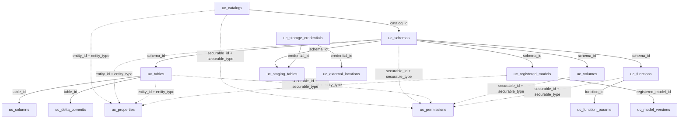

# Catalog 后端存储字段清单

> 范围：Unity Catalog OSS、Apache Gravitino relational backend、Apache Polaris relational JDBC backend 的核心后端元数据表。
> 字段名根据公开 DAO、schema、源码材料归一化整理。不同版本或数据库方言下，少数字段名可能略有差异。

## Unity Catalog OSS

Unity Catalog OSS 使用按资源类型拆分的 Hibernate DAO 表，并配合共享扩展表。

| 表 | 字段 |
| --- | --- |
| `uc_catalogs` | `id`, `name`, `comment`, `owner`, `created_at`, `created_by`, `updated_at`, `updated_by`, `storage_root`, `storage_location` |
| `uc_schemas` | `id`, `name`, `catalog_id`, `comment`, `owner`, `created_at`, `created_by`, `updated_at`, `updated_by`, `storage_root`, `storage_location` |
| `uc_tables` | `id`, `name`, `schema_id`, `type`, `owner`, `created_at`, `created_by`, `updated_at`, `updated_by`, `data_source_format`, `comment`, `url`, `column_count`, `uniform_iceberg_metadata_location`, `uniform_iceberg_converted_delta_version`, `uniform_iceberg_converted_delta_timestamp` |
| `uc_columns` | `id`, `name`, `table_id`, `ordinal_position`, `type_text`, `type_json`, `type_name`, `type_precision`, `type_scale`, `type_interval_type`, `nullable`, `comment`, `partition_index` |
| `uc_properties` | `id`, `entity_id`, `entity_type`, `property_key`, `property_value` |
| `uc_volumes` | `id`, `name`, `schema_id`, `comment`, `storage_location`, `owner`, `created_at`, `created_by`, `updated_at`, `updated_by`, `volume_type` |
| `uc_functions` | `id`, `name`, `schema_id`, `comment`, `owner`, `created_at`, `created_by`, `updated_at`, `updated_by`, `data_type`, `full_data_type`, `external_language`, `is_deterministic`, `is_null_call`, `parameter_style`, `routine_body`, `routine_definition`, `sql_data_access`, `security_type`, `specific_name` |
| `uc_function_params` | `id`, `name`, `function_id`, `input_or_return`, `type_text`, `type_json`, `type_name`, `type_precision`, `type_scale`, `type_interval_type`, `position`, `parameter_mode`, `parameter_type`, `parameter_default`, `comment` |
| `uc_registered_models` | `id`, `name`, `schema_id`, `owner`, `created_at`, `created_by`, `updated_at`, `updated_by`, `comment`, `url`, `max_version_number` |
| `uc_model_versions` | `id`, `name`, `registered_model_id`, `version`, `source`, `run_id`, `status`, `comment`, `storage_location`, `created_at`, `created_by`, `updated_at`, `updated_by` |
| `uc_storage_credentials` | `id`, `name`, `comment`, `owner`, `created_at`, `created_by`, `updated_at`, `updated_by`, `credential_type`, `credential` |
| `uc_external_locations` | `id`, `name`, `comment`, `owner`, `created_at`, `created_by`, `updated_at`, `updated_by`, `url`, `credential_id` |
| `uc_permissions` | `id`, `principal`, `securable_type`, `securable_id`, `privilege`, `created_at`, `created_by`, `updated_at`, `updated_by` |
| `uc_staging_tables` | `id`, `name`, `schema_id`, `staging_location`, `credential_id`, `created_at`, `created_by`, `updated_at`, `updated_by` |
| `uc_delta_commits` | `id`, `table_id`, `commit_version`, `commit_timestamp`, `commit_filename`, `commit_filesize`, `commit_file_modification_timestamp`, `created_at` |

## Apache Gravitino

Gravitino relational backend 将对象身份记录和版本化元数据记录分开存储。JSON 字段用于保留 provider-specific 或结构化元数据。

| 表 | 字段 |
| --- | --- |
| `metalake_meta` | `metalake_id`, `metalake_name`, `metalake_comment`, `properties`, `audit_info`, `schema_version`, `current_version`, `last_version`, `deleted_at` |
| `catalog_meta` | `catalog_id`, `catalog_name`, `metalake_id`, `type`, `provider`, `catalog_comment`, `properties`, `audit_info`, `current_version`, `last_version`, `deleted_at` |
| `schema_meta` | `schema_id`, `schema_name`, `metalake_id`, `catalog_id`, `schema_comment`, `properties`, `audit_info`, `current_version`, `last_version`, `deleted_at` |
| `table_meta` | `table_id`, `table_name`, `metalake_id`, `catalog_id`, `schema_id`, `audit_info`, `current_version`, `last_version`, `deleted_at` |
| `table_version` | `table_id`, `format`, `properties`, `partitioning`, `distribution`, `sort_orders`, `indexes`, `comment`, `version`, `last_version`, `deleted_at` |
| `table_column` | `id`, `column_id`, `table_id`, `metalake_id`, `catalog_id`, `schema_id`, `table_version`, `column_name`, `column_position`, `column_type`, `column_comment`, `nullable`, `auto_increment`, `default_value`, `column_op_type`, `audit_info`, `deleted_at` |
| `fileset_meta` | `fileset_id`, `fileset_name`, `metalake_id`, `catalog_id`, `schema_id`, `type`, `audit_info`, `current_version`, `last_version`, `deleted_at` |
| `fileset_version` | `fileset_id`, `metalake_id`, `catalog_id`, `schema_id`, `version`, `fileset_comment`, `storage_location`, `properties`, `deleted_at` |
| `topic_meta` | `topic_id`, `topic_name`, `metalake_id`, `catalog_id`, `schema_id`, `audit_info`, `current_version`, `last_version`, `deleted_at` |
| `topic_version` | `topic_id`, `metalake_id`, `catalog_id`, `schema_id`, `version`, `topic_comment`, `properties`, `deleted_at` |
| `model_meta` | `model_id`, `model_name`, `metalake_id`, `catalog_id`, `schema_id`, `audit_info`, `current_version`, `last_version`, `deleted_at` |
| `model_version` | `model_id`, `version`, `model_comment`, `properties`, `uri`, `aliases`, `deleted_at` |
| `function_meta` | `function_id`, `function_name`, `metalake_id`, `catalog_id`, `schema_id`, `audit_info`, `current_version`, `last_version`, `deleted_at` |
| `function_version` | `function_id`, `version`, `function_comment`, `return_type`, `argument_types`, `properties`, `deleted_at` |
| `tag_meta` | `tag_id`, `tag_name`, `metalake_id`, `comment`, `properties`, `audit_info`, `current_version`, `last_version`, `deleted_at` |
| `tag_metadata_object_rel` | `tag_id`, `metadata_object_id`, `metadata_object_type`, `audit_info`, `current_version`, `last_version`, `deleted_at` |
| `policy_meta` | `policy_id`, `policy_name`, `metalake_id`, `policy_type`, `content`, `comment`, `properties`, `audit_info`, `current_version`, `last_version`, `deleted_at` |
| `policy_metadata_object_rel` | `policy_id`, `metadata_object_id`, `metadata_object_type`, `audit_info`, `current_version`, `last_version`, `deleted_at` |
| `role_meta` | `role_id`, `role_name`, `metalake_id`, `properties`, `audit_info`, `current_version`, `last_version`, `deleted_at` |
| `user_meta` | `user_id`, `user_name`, `metalake_id`, `audit_info`, `current_version`, `last_version`, `deleted_at` |
| `group_meta` | `group_id`, `group_name`, `metalake_id`, `audit_info`, `current_version`, `last_version`, `deleted_at` |
| `user_role_rel` | `user_id`, `role_id`, `metalake_id`, `audit_info`, `current_version`, `last_version`, `deleted_at` |
| `group_role_rel` | `group_id`, `role_id`, `metalake_id`, `audit_info`, `current_version`, `last_version`, `deleted_at` |
| `securable_object` | `id`, `metalake_id`, `object_id`, `object_type`, `parent_id`, `parent_type`, `name`, `full_name`, `audit_info`, `current_version`, `last_version`, `deleted_at` |
| `owner_meta` | `id`, `metalake_id`, `metadata_object_id`, `metadata_object_type`, `owner_name`, `owner_type`, `audit_info`, `current_version`, `last_version`, `deleted_at` |
| `statistic_meta` | `id`, `metalake_id`, `metadata_object_id`, `metadata_object_type`, `statistic_name`, `statistic_value`, `statistic_type`, `audit_info`, `current_version`, `last_version`, `deleted_at` |
| `credential_meta` | `credential_id`, `credential_name`, `metalake_id`, `credential_type`, `comment`, `properties`, `audit_info`, `current_version`, `last_version`, `deleted_at` |

## Apache Polaris

Polaris relational JDBC 将大多数业务对象存放在一张通用实体表中。`type_code` 和 `sub_type_code` 用来判断一行记录是 catalog、namespace、table-like object、principal、role、policy、task 等。

| 表 | 字段 |
| --- | --- |
| `version` | `version_key`, `version_value` |
| `entities` | `realm_id`, `catalog_id`, `id`, `parent_id`, `name`, `entity_version`, `type_code`, `sub_type_code`, `create_timestamp`, `drop_timestamp`, `purge_timestamp`, `to_purge_timestamp`, `last_update_timestamp`, `properties`, `internal_properties`, `grant_records_version`, `location_without_scheme` |
| `grant_records` | `realm_id`, `securable_catalog_id`, `securable_id`, `grantee_catalog_id`, `grantee_id`, `privilege_code` |
| `principal_authentication_data` | `realm_id`, `principal_id`, `principal_client_id`, `main_secret_hash`, `secondary_secret_hash`, `secret_salt` |
| `policy_mapping_record` | `realm_id`, `target_catalog_id`, `target_id`, `policy_type_code`, `policy_catalog_id`, `policy_id`, `parameters` |
| `events` | `realm_id`, `catalog_id`, `event_id`, `request_id`, `event_type`, `timestamp_ms`, `principal_name`, `resource_type`, `resource_identifier`, `additional_properties` |
| `idempotency_records` | `realm_id`, `idempotency_key`, `operation_type`, `resource_id`, `http_status`, `error_subtype`, `response_summary`, `response_headers`, `finalized_at`, `created_at`, `updated_at`, `heartbeat_at`, `executor_id`, `expires_at` |
| `scan_metrics_report` | `report_id`, `realm_id`, `catalog_id`, `catalog_name`, `namespace`, `table_name`, `timestamp_ms`, `principal_name`, `request_id`, `otel_trace_id`, `otel_span_id`, `report_trace_id`, `snapshot_id`, `schema_id`, 以及 scan metric payload 字段 |
| `scan_metrics_report_roles` | `realm_id`, `report_id`, `role_name` |
| `commit_metrics_report` | `report_id`, `realm_id`, `catalog_id`, `catalog_name`, `namespace`, `table_name`, `timestamp_ms`, `principal_name`, `request_id`, `otel_trace_id`, `otel_span_id`, `report_trace_id`, `snapshot_id`, 以及 commit metric payload 字段 |
| `commit_metrics_report_roles` | `realm_id`, `report_id`, `role_name` |

## 备注

- Unity Catalog：schema 按资产类型显式拆表。`uc_properties` 是共享扩展属性表。
- Gravitino：对象身份和可变版本内容分离。`*_meta` 表保存身份和当前版本指针；`*_version` 表保存版本化内容。
- Polaris：catalog、namespace、table、view、principal、role、policy 都存放在 `entities` 中；权限和 policy mapping 使用独立关系表。
- 精确 SQL 类型、约束、索引需要以目标版本和数据库方言对应的 migration 文件为准。

## ERD 级表设计

下面表格使用逻辑类型：

- `uuid`：UUID 类标识符。
- `long`：长整型标识符或时间戳。
- `int`：整型编码、版本号或位置。
- `string`：varchar/text。
- `json`：JSON/JSONB/CLOB 序列化结构。
- `bool`：布尔值。
- `timestamp`：SQL timestamp 或基于 epoch 的时间戳，取决于具体实现。

### Unity Catalog OSS ERD

#### Unity Catalog OSS 表关系图

Unity Catalog OSS 的关系模型是典型的“资源类型拆表”：目录、schema、表、字段、函数、模型、volume 等都有各自的物理表；`uc_properties` 和 `uc_permissions` 通过 `entity_id` / `securable_id` 做多态引用。



#### `uc_catalogs`

| 字段 | 类型 | 键 | 说明 |
| --- | --- | --- | --- |
| `id` | uuid | PK | Catalog ID |
| `name` | string | 近似 UK | Catalog 名称 |
| `comment` | string |  | 描述 |
| `owner` | string |  | owner principal |
| `created_at` | timestamp |  | 创建时间 |
| `created_by` | string |  | 创建者 |
| `updated_at` | timestamp |  | 更新时间 |
| `updated_by` | string |  | 更新者 |
| `storage_root` | string |  | managed storage 根路径 |
| `storage_location` | string |  | 存储位置 |

关系：`uc_schemas` 的父对象。

#### `uc_schemas`

| 字段 | 类型 | 键 | 说明 |
| --- | --- | --- | --- |
| `id` | uuid | PK | Schema ID |
| `name` | string | 与 `catalog_id` 组成 UK | Schema 名称 |
| `catalog_id` | uuid | FK | 引用 `uc_catalogs.id` |
| `comment` | string |  | 描述 |
| `owner` | string |  | owner principal |
| `created_at` | timestamp |  | 创建时间 |
| `created_by` | string |  | 创建者 |
| `updated_at` | timestamp |  | 更新时间 |
| `updated_by` | string |  | 更新者 |
| `storage_root` | string |  | managed storage 根路径 |
| `storage_location` | string |  | 存储位置 |

关系：`uc_tables`、`uc_volumes`、`uc_functions`、`uc_registered_models` 的父对象。

#### `uc_tables`

| 字段 | 类型 | 键 | 说明 |
| --- | --- | --- | --- |
| `id` | uuid | PK | Table ID |
| `name` | string | 与 `schema_id` 组成 UK | 表名 |
| `schema_id` | uuid | FK | 引用 `uc_schemas.id` |
| `type` | string |  | managed/external 等表类型 |
| `owner` | string |  | owner principal |
| `created_at` | timestamp |  | 创建时间 |
| `created_by` | string |  | 创建者 |
| `updated_at` | timestamp |  | 更新时间 |
| `updated_by` | string |  | 更新者 |
| `data_source_format` | string |  | DELTA/PARQUET/CSV/etc. |
| `comment` | string |  | 描述 |
| `url` | string |  | 存储位置 |
| `column_count` | int |  | 缓存的字段数量 |
| `uniform_iceberg_metadata_location` | string |  | UniForm 对应的 Iceberg metadata 指针 |
| `uniform_iceberg_converted_delta_version` | long |  | 转换到 Iceberg 的 Delta 版本 |
| `uniform_iceberg_converted_delta_timestamp` | timestamp |  | 转换时间 |

关系：`uc_columns` 的父对象；通过 `uc_properties(entity_type='TABLE')` 扩展；被 Delta commit/staging 辅助逻辑引用。

#### `uc_columns`

| 字段 | 类型 | 键 | 说明 |
| --- | --- | --- | --- |
| `id` | uuid | PK | 字段行 ID |
| `name` | string | 与 `table_id`、`ordinal_position` 组成 UK | 字段名 |
| `table_id` | uuid | FK | 引用 `uc_tables.id` |
| `ordinal_position` | int | 与 `table_id`、`name` 组成 UK | 字段顺序 |
| `type_text` | string |  | 可读类型文本 |
| `type_json` | json |  | 结构化类型 |
| `type_name` | string |  | primitive/root 类型名 |
| `type_precision` | int |  | Decimal/string 精度 |
| `type_scale` | int |  | Decimal scale |
| `type_interval_type` | string |  | Interval qualifier |
| `nullable` | bool |  | 是否可为 null |
| `comment` | string |  | 字段注释 |
| `partition_index` | int |  | 如果是分区字段，则表示分区顺序 |

#### `uc_properties`

| 字段 | 类型 | 键 | 说明 |
| --- | --- | --- | --- |
| `id` | uuid | PK | 属性行 ID |
| `entity_id` | uuid | 与 `entity_type`、`property_key` 组成 UK | 目标对象 ID |
| `entity_type` | string | UK | 目标类型：table/catalog 等 |
| `property_key` | string | UK | 属性 key |
| `property_value` | string |  | 属性 value |

关系：catalog/schema/table/model 等对象共用的多态扩展属性侧表。

#### `uc_volumes`

| 字段 | 类型 | 键 | 说明 |
| --- | --- | --- | --- |
| `id` | uuid | PK | Volume ID |
| `name` | string | 与 `schema_id` 组成 UK | Volume 名称 |
| `schema_id` | uuid | FK | 引用 `uc_schemas.id` |
| `comment` | string |  | 描述 |
| `storage_location` | string |  | 目录位置 |
| `owner` | string |  | owner principal |
| `created_at` | timestamp |  | 创建时间 |
| `created_by` | string |  | 创建者 |
| `updated_at` | timestamp |  | 更新时间 |
| `updated_by` | string |  | 更新者 |
| `volume_type` | string |  | managed/external volume 类型 |

#### `uc_functions`

| 字段 | 类型 | 键 | 说明 |
| --- | --- | --- | --- |
| `id` | uuid | PK | Function ID |
| `name` | string | 与 `schema_id` 组成 UK | Function 名称 |
| `schema_id` | uuid | FK | 引用 `uc_schemas.id` |
| `comment` | string |  | 描述 |
| `owner` | string |  | owner principal |
| `created_at` | long |  | 创建时间，epoch millis |
| `created_by` | string |  | 创建者 |
| `updated_at` | long |  | 更新时间，epoch millis |
| `updated_by` | string |  | 更新者 |
| `data_type` | string |  | 返回值 root 类型 |
| `full_data_type` | string |  | 返回值类型文本 |
| `external_language` | string |  | Python/SQL/etc. |
| `is_deterministic` | bool |  | 是否确定性函数 |
| `is_null_call` | bool |  | null 入参调用行为 |
| `parameter_style` | string |  | 参数风格 |
| `routine_body` | string |  | SQL/external 函数体类型 |
| `routine_definition` | string |  | 函数体 |
| `sql_data_access` | string |  | SQL 访问模式枚举 |
| `security_type` | string |  | definer/invoker 安全模式 |
| `specific_name` | string |  | 具体函数名 |

关系：`uc_function_params` 的父对象。

#### `uc_function_params`

| 字段 | 类型 | 键 | 说明 |
| --- | --- | --- | --- |
| `id` | uuid | PK | 参数 ID |
| `name` | string |  | 参数名 |
| `function_id` | uuid | FK | 引用 `uc_functions.id` |
| `input_or_return` | string |  | INPUT 或 RETURN |
| `type_text` | string |  | 类型文本 |
| `type_json` | json |  | 结构化类型 |
| `type_name` | string |  | 类型枚举/名称 |
| `type_precision` | int |  | 精度 |
| `type_scale` | int |  | scale |
| `type_interval_type` | string |  | interval qualifier |
| `position` | int |  | 参数顺序 |
| `parameter_mode` | string |  | IN/OUT/etc. |
| `parameter_type` | string |  | 参数种类 |
| `parameter_default` | string |  | 默认值 |
| `comment` | string |  | 注释 |

#### `uc_registered_models`

| 字段 | 类型 | 键 | 说明 |
| --- | --- | --- | --- |
| `id` | uuid | PK | Model ID |
| `name` | string | 与 `schema_id` 组成 UK | 注册模型名称 |
| `schema_id` | uuid | FK | 引用 `uc_schemas.id` |
| `owner` | string |  | owner principal |
| `created_at` | timestamp |  | 创建时间 |
| `created_by` | string |  | 创建者 |
| `updated_at` | timestamp |  | 更新时间 |
| `updated_by` | string |  | 更新者 |
| `comment` | string |  | 描述 |
| `url` | string |  | 模型制品根路径 |
| `max_version_number` | long |  | 最新分配的版本号 |

关系：`uc_model_versions` 的父对象。

#### `uc_model_versions`

| 字段 | 类型 | 键 | 说明 |
| --- | --- | --- | --- |
| `id` | uuid | PK | 模型版本行 ID |
| `name` | string |  | 版本显示名/名称（如存在） |
| `registered_model_id` | uuid | FK | 引用 `uc_registered_models.id` |
| `version` | long | 与 `registered_model_id` 组成 UK | 版本号 |
| `source` | string |  | 来源路径/URI |
| `run_id` | string |  | 训练 run ID |
| `status` | string |  | 版本状态 |
| `comment` | string |  | 描述 |
| `storage_location` | string |  | 制品位置 |
| `created_at` | timestamp |  | 创建时间 |
| `created_by` | string |  | 创建者 |
| `updated_at` | timestamp |  | 更新时间 |
| `updated_by` | string |  | 更新者 |

### Gravitino ERD

Gravitino 使用 `deleted_at` 表示软删除，使用 `current_version` / `last_version` 支撑乐观更新和版本化元数据模式。

#### Gravitino 表关系图

Gravitino 的核心模式是“身份表 + 版本表”：`*_meta` 表保存对象 identity、层级归属、审计信息和版本指针；`*_version` 表保存可变内容。治理对象如 tag、policy、owner、statistic、role relation 通过对象 ID 和对象类型做通用关联。

```mermaid
flowchart TB
    METALAKE["metalake_meta"] -->|metalake_id| CATALOG["catalog_meta"]
    CATALOG -->|catalog_id| SCHEMA["schema_meta"]

    SCHEMA -->|schema_id| TABLE_META["table_meta"]
    TABLE_META -->|table_id + version| TABLE_VERSION["table_version"]
    TABLE_META -->|table_id + table_version| TABLE_COLUMN["table_column"]

    SCHEMA -->|schema_id| FILESET_META["fileset_meta"]
    FILESET_META -->|fileset_id + version| FILESET_VERSION["fileset_version"]
    SCHEMA -->|schema_id| TOPIC_META["topic_meta"]
    TOPIC_META -->|topic_id + version| TOPIC_VERSION["topic_version"]
    SCHEMA -->|schema_id| MODEL_META["model_meta"]
    MODEL_META -->|model_id + version| MODEL_VERSION["model_version"]
    SCHEMA -->|schema_id| FUNCTION_META["function_meta"]
    FUNCTION_META -->|function_id + version| FUNCTION_VERSION["function_version"]

    METALAKE -->|metalake_id| TAG_META["tag_meta"]
    TAG_META -->|tag_id| TAG_REL["tag_metadata_object_rel"]
    METALAKE -->|metalake_id| POLICY_META["policy_meta"]
    POLICY_META -->|policy_id| POLICY_REL["policy_metadata_object_rel"]

    METALAKE -->|metalake_id| ROLE_META["role_meta"]
    METALAKE -->|metalake_id| USER_META["user_meta"]
    METALAKE -->|metalake_id| GROUP_META["group_meta"]
    USER_META -->|user_id| USER_ROLE_REL["user_role_rel"]
    ROLE_META -->|role_id| USER_ROLE_REL
    GROUP_META -->|group_id| GROUP_ROLE_REL["group_role_rel"]
    ROLE_META -->|role_id| GROUP_ROLE_REL

    METALAKE -->|metalake_id| SECURABLE_OBJECT["securable_object"]
    METALAKE -->|metalake_id| OWNER_META["owner_meta"]
    METALAKE -->|metalake_id| STATISTIC_META["statistic_meta"]
    METALAKE -->|metalake_id| CREDENTIAL_META["credential_meta"]

    TABLE_META -.->|metadata_object_id + type| TAG_REL
    TABLE_META -.->|metadata_object_id + type| POLICY_REL
    TABLE_META -.->|metadata_object_id + type| OWNER_META
    TABLE_META -.->|metadata_object_id + type| STATISTIC_META
```



#### 核心层级

| 表 | 主键 | 重要键 | 字段 |
| --- | --- | --- | --- |
| `metalake_meta` | `metalake_id` | UK `metalake_name` | `metalake_id`, `metalake_name`, `metalake_comment`, `properties`, `audit_info`, `schema_version`, `current_version`, `last_version`, `deleted_at` |
| `catalog_meta` | `catalog_id` | FK `metalake_id`; UK-ish `metalake_id,catalog_name` | `catalog_id`, `catalog_name`, `metalake_id`, `type`, `provider`, `catalog_comment`, `properties`, `audit_info`, `current_version`, `last_version`, `deleted_at` |
| `schema_meta` | `schema_id` | FK `metalake_id,catalog_id`; UK-ish `catalog_id,schema_name` | `schema_id`, `schema_name`, `metalake_id`, `catalog_id`, `schema_comment`, `properties`, `audit_info`, `current_version`, `last_version`, `deleted_at` |

#### 表元数据

| 表 | 主键 | 重要键 | 字段 |
| --- | --- | --- | --- |
| `table_meta` | `table_id` | FK `metalake_id,catalog_id,schema_id`; UK-ish `schema_id,table_name` | `table_id`, `table_name`, `metalake_id`, `catalog_id`, `schema_id`, `audit_info`, `current_version`, `last_version`, `deleted_at` |
| `table_version` | `table_id,version` | FK `table_id` | `table_id`, `format`, `properties`, `partitioning`, `distribution`, `sort_orders`, `indexes`, `comment`, `version`, `last_version`, `deleted_at` |
| `table_column` | `id` | FK `table_id`; 版本键 `table_id,table_version,column_id` | `id`, `column_id`, `table_id`, `metalake_id`, `catalog_id`, `schema_id`, `table_version`, `column_name`, `column_position`, `column_type`, `column_comment`, `nullable`, `auto_increment`, `default_value`, `column_op_type`, `audit_info`, `deleted_at` |

关系模式：

```text
metalake_meta
  -> catalog_meta
      -> schema_meta
          -> table_meta
              -> table_version
              -> table_column
```

#### 非表资产

| 表 | 主键 | 重要键 | 字段 |
| --- | --- | --- | --- |
| `fileset_meta` | `fileset_id` | FK `schema_id`; UK-ish `schema_id,fileset_name` | `fileset_id`, `fileset_name`, `metalake_id`, `catalog_id`, `schema_id`, `type`, `audit_info`, `current_version`, `last_version`, `deleted_at` |
| `fileset_version` | `fileset_id,version` | FK `fileset_id` | `fileset_id`, `metalake_id`, `catalog_id`, `schema_id`, `version`, `fileset_comment`, `storage_location`, `properties`, `deleted_at` |
| `topic_meta` | `topic_id` | FK `schema_id`; UK-ish `schema_id,topic_name` | `topic_id`, `topic_name`, `metalake_id`, `catalog_id`, `schema_id`, `audit_info`, `current_version`, `last_version`, `deleted_at` |
| `topic_version` | `topic_id,version` | FK `topic_id` | `topic_id`, `metalake_id`, `catalog_id`, `schema_id`, `version`, `topic_comment`, `properties`, `deleted_at` |
| `model_meta` | `model_id` | FK `schema_id`; UK-ish `schema_id,model_name` | `model_id`, `model_name`, `metalake_id`, `catalog_id`, `schema_id`, `audit_info`, `current_version`, `last_version`, `deleted_at` |
| `model_version` | `model_id,version` | FK `model_id` | `model_id`, `version`, `model_comment`, `properties`, `uri`, `aliases`, `deleted_at` |
| `function_meta` | `function_id` | FK `schema_id`; UK-ish `schema_id,function_name` | `function_id`, `function_name`, `metalake_id`, `catalog_id`, `schema_id`, `audit_info`, `current_version`, `last_version`, `deleted_at` |
| `function_version` | `function_id,version` | FK `function_id` | `function_id`, `version`, `function_comment`, `return_type`, `argument_types`, `properties`, `deleted_at` |

#### 治理与安全

| 表 | 主键 | 重要键 | 字段 |
| --- | --- | --- | --- |
| `tag_meta` | `tag_id` | FK `metalake_id`; UK-ish `metalake_id,tag_name` | `tag_id`, `tag_name`, `metalake_id`, `comment`, `properties`, `audit_info`, `current_version`, `last_version`, `deleted_at` |
| `tag_metadata_object_rel` | 复合键 | FK `tag_id`; 目标 `metadata_object_id,metadata_object_type` | `tag_id`, `metadata_object_id`, `metadata_object_type`, `audit_info`, `current_version`, `last_version`, `deleted_at` |
| `policy_meta` | `policy_id` | FK `metalake_id`; UK-ish `metalake_id,policy_name` | `policy_id`, `policy_name`, `metalake_id`, `policy_type`, `content`, `comment`, `properties`, `audit_info`, `current_version`, `last_version`, `deleted_at` |
| `policy_metadata_object_rel` | 复合键 | FK `policy_id`; 目标 `metadata_object_id,metadata_object_type` | `policy_id`, `metadata_object_id`, `metadata_object_type`, `audit_info`, `current_version`, `last_version`, `deleted_at` |
| `role_meta` | `role_id` | FK `metalake_id`; UK-ish `metalake_id,role_name` | `role_id`, `role_name`, `metalake_id`, `properties`, `audit_info`, `current_version`, `last_version`, `deleted_at` |
| `user_meta` | `user_id` | FK `metalake_id`; UK-ish `metalake_id,user_name` | `user_id`, `user_name`, `metalake_id`, `audit_info`, `current_version`, `last_version`, `deleted_at` |
| `group_meta` | `group_id` | FK `metalake_id`; UK-ish `metalake_id,group_name` | `group_id`, `group_name`, `metalake_id`, `audit_info`, `current_version`, `last_version`, `deleted_at` |
| `user_role_rel` | `user_id,role_id` | FK `user_id`, `role_id` | `user_id`, `role_id`, `metalake_id`, `audit_info`, `current_version`, `last_version`, `deleted_at` |
| `group_role_rel` | `group_id,role_id` | FK `group_id`, `role_id` | `group_id`, `role_id`, `metalake_id`, `audit_info`, `current_version`, `last_version`, `deleted_at` |
| `securable_object` | `id` | 目标 `object_id,object_type` | `id`, `metalake_id`, `object_id`, `object_type`, `parent_id`, `parent_type`, `name`, `full_name`, `audit_info`, `current_version`, `last_version`, `deleted_at` |
| `owner_meta` | `id` | 目标 `metadata_object_id,metadata_object_type` | `id`, `metalake_id`, `metadata_object_id`, `metadata_object_type`, `owner_name`, `owner_type`, `audit_info`, `current_version`, `last_version`, `deleted_at` |
| `statistic_meta` | `id` | 目标 `metadata_object_id,metadata_object_type` | `id`, `metalake_id`, `metadata_object_id`, `metadata_object_type`, `statistic_name`, `statistic_value`, `statistic_type`, `audit_info`, `current_version`, `last_version`, `deleted_at` |
| `credential_meta` | `credential_id` | FK-ish `metalake_id` | `credential_id`, `credential_name`, `metalake_id`, `credential_type`, `comment`, `properties`, `audit_info`, `current_version`, `last_version`, `deleted_at` |

### Polaris ERD

Polaris 的物理表数量较少，因为大多数对象共用 `entities`。

#### Polaris 表关系图

Polaris 的关系模型以 `entities` 为中心：catalog、namespace、table-like、principal、role、policy、task 等都落在同一张实体表里。`grant_records`、`policy_mapping_record`、`principal_authentication_data` 等表通过不同语义的 ID 字段引用 `entities`。

```mermaid
flowchart TB
    VERSION["version"]
    ENTITIES["entities"]
    PARENT_REF["parent_id"]

    ENTITIES -->|父子层级引用| PARENT_REF
    PARENT_REF -->|指向父实体| ENTITIES

    PRINCIPAL_AUTH["principal_authentication_data"]
    ENTITIES -->|principal_id| PRINCIPAL_AUTH

    GRANT_RECORDS["grant_records"]
    SECURABLE_REF["securable_catalog_id / securable_id"]
    GRANTEE_REF["grantee_catalog_id / grantee_id"]
    ENTITIES -->|被授权对象| SECURABLE_REF
    SECURABLE_REF --> GRANT_RECORDS
    ENTITIES -->|被授权主体| GRANTEE_REF
    GRANTEE_REF --> GRANT_RECORDS

    POLICY_MAPPING["policy_mapping_record"]
    TARGET_REF["target_catalog_id / target_id"]
    POLICY_REF["policy_catalog_id / policy_id"]
    ENTITIES -->|目标对象| TARGET_REF
    TARGET_REF --> POLICY_MAPPING
    ENTITIES -->|policy 实体| POLICY_REF
    POLICY_REF --> POLICY_MAPPING

    EVENTS["events"]
    IDEMPOTENCY["idempotency_records"]
    SCAN_METRICS["scan_metrics_report"]
    SCAN_ROLES["scan_metrics_report_roles"]
    COMMIT_METRICS["commit_metrics_report"]
    COMMIT_ROLES["commit_metrics_report_roles"]

    ENTITIES -.->|catalog/resource 语义关联| EVENTS
    ENTITIES -.->|resource_id 语义关联| IDEMPOTENCY
    ENTITIES -.->|catalog/table 语义关联| SCAN_METRICS
    SCAN_METRICS -->|report_id| SCAN_ROLES
    ENTITIES -.->|catalog/table 语义关联| COMMIT_METRICS
    COMMIT_METRICS -->|report_id| COMMIT_ROLES
```



#### `version`

| 字段 | 类型 | 键 | 说明 |
| --- | --- | --- | --- |
| `version_key` | string | PK | Schema 版本 key |
| `version_value` | int |  | Schema 版本值 |

#### `entities`

| 字段 | 类型 | 键 | 说明 |
| --- | --- | --- | --- |
| `realm_id` | string | 与 `id` 组成 PK；与路径字段组成唯一键 | 多租户 realm |
| `catalog_id` | long | 路径字段之一 | Catalog 作用域 ID |
| `id` | long | 与 `realm_id` 组成 PK | 实体 ID |
| `parent_id` | long | 路径字段之一 | 父实体 ID |
| `name` | string | 路径字段之一 | 实体名称 |
| `entity_version` | int |  | 实体乐观锁/版本字段 |
| `type_code` | int | 路径字段之一 | 实体类型 |
| `sub_type_code` | int |  | 实体子类型 |
| `create_timestamp` | long |  | 创建时间，epoch millis |
| `drop_timestamp` | long |  | drop 时间，epoch millis |
| `purge_timestamp` | long |  | purge 时间，epoch millis |
| `to_purge_timestamp` | long |  | 计划 purge 时间，epoch millis |
| `last_update_timestamp` | long |  | 最后更新时间，epoch millis |
| `properties` | json |  | 公开属性 |
| `internal_properties` | json |  | 内部元数据 |
| `grant_records_version` | int |  | 授权缓存失效/版本号 |
| `location_without_scheme` | string | IDX | location 查询优化字段 |

主键：`(realm_id, id)`。

路径唯一键：`(realm_id, catalog_id, parent_id, type_code, name)`。

重要实体类型包括：`CATALOG`、`NAMESPACE`、`TABLE_LIKE`、`PRINCIPAL`、`PRINCIPAL_ROLE`、`CATALOG_ROLE`、`POLICY`、`TASK`、`FILE`。

#### `grant_records`

| 字段 | 类型 | 键 | 说明 |
| --- | --- | --- | --- |
| `realm_id` | string | 复合 PK | Realm |
| `securable_catalog_id` | long | 复合 PK | 被授权对象 catalog ID |
| `securable_id` | long | 复合 PK | 被授权对象实体 ID |
| `grantee_catalog_id` | long | 复合 PK | 被授权方 catalog ID |
| `grantee_id` | long | 复合 PK | principal/principal-role/catalog-role 实体 ID |
| `privilege_code` | int | 复合 PK | 权限枚举编码 |

#### `principal_authentication_data`

| 字段 | 类型 | 键 | 说明 |
| --- | --- | --- | --- |
| `realm_id` | string | 与 `principal_client_id` 组成 PK | Realm |
| `principal_id` | long | 近似 FK，指向 `entities.id` | Principal 实体 ID |
| `principal_client_id` | string | 与 `realm_id` 组成 PK | OAuth/client ID |
| `main_secret_hash` | string |  | 主 secret hash |
| `secondary_secret_hash` | string |  | 备用 secret hash |
| `secret_salt` | string |  | secret salt |

#### `policy_mapping_record`

| 字段 | 类型 | 键 | 说明 |
| --- | --- | --- | --- |
| `realm_id` | string | 复合 PK | Realm |
| `target_catalog_id` | long | 复合 PK | 目标 catalog ID |
| `target_id` | long | 复合 PK | 目标实体 ID |
| `policy_type_code` | int | 复合 PK | Policy 类型编码 |
| `policy_catalog_id` | long | 复合 PK | Policy catalog ID |
| `policy_id` | long | 复合 PK | Policy 实体 ID |
| `parameters` | json |  | 绑定参数 |

#### `events`

| 字段 | 类型 | 键 | 说明 |
| --- | --- | --- | --- |
| `realm_id` | string |  | Realm |
| `catalog_id` | string |  | 事件层保存的 catalog ID/名称 |
| `event_id` | string | PK | 事件 ID |
| `request_id` | string |  | 请求关联 ID |
| `event_type` | string |  | 事件类型 |
| `timestamp_ms` | long |  | 事件时间 |
| `principal_name` | string |  | 操作者 |
| `resource_type` | string |  | 资源类型 |
| `resource_identifier` | string |  | 资源路径/ID |
| `additional_properties` | json |  | 额外 payload |

#### `idempotency_records`

| 字段 | 类型 | 键 | 说明 |
| --- | --- | --- | --- |
| `realm_id` | string | 与 `idempotency_key` 组成 PK；与 `expires_at` 组成索引 | Realm |
| `idempotency_key` | string | 与 `realm_id` 组成 PK | 客户端幂等 key |
| `operation_type` | string |  | 操作类型 |
| `resource_id` | string |  | 从请求派生的资源 ID |
| `http_status` | int |  | 已保存的响应状态 |
| `error_subtype` | string |  | 错误子类型 |
| `response_summary` | string |  | 已保存的响应摘要 |
| `response_headers` | string |  | 已保存的响应头 |
| `finalized_at` | timestamp |  | 完成时间 |
| `created_at` | timestamp |  | 创建时间 |
| `updated_at` | timestamp |  | 更新时间 |
| `heartbeat_at` | timestamp |  | 进行中 heartbeat |
| `executor_id` | string |  | executor/owner |
| `expires_at` | timestamp | IDX | 过期/清理时间 |

#### Metrics 表

| 表 | 键 | 字段 |
| --- | --- | --- |
| `scan_metrics_report` | `report_id` | `report_id`, `realm_id`, `catalog_id`, `catalog_name`, `namespace`, `table_name`, `timestamp_ms`, `principal_name`, `request_id`, `otel_trace_id`, `otel_span_id`, `report_trace_id`, `snapshot_id`, `schema_id`, 以及扫描指标 payload 字段 |
| `scan_metrics_report_roles` | `realm_id,report_id,role_name` | `realm_id`, `report_id`, `role_name` |
| `commit_metrics_report` | `report_id` | `report_id`, `realm_id`, `catalog_id`, `catalog_name`, `namespace`, `table_name`, `timestamp_ms`, `principal_name`, `request_id`, `otel_trace_id`, `otel_span_id`, `report_trace_id`, `snapshot_id`, 以及提交指标 payload 字段 |
| `commit_metrics_report_roles` | `realm_id,report_id,role_name` | `realm_id`, `report_id`, `role_name` |

### 高层关系图

下图只表达三类项目的核心存储关系，不展开所有治理、安全、审计、metric 辅助表。

- Unity Catalog OSS：按资源类型拆表，catalog/schema/table/column 等层级关系比较直接。
- Apache Gravitino：以 metalake 为顶层命名空间，`*_meta` 表保存对象身份和当前版本指针，`*_version` 表保存可变内容。
- Apache Polaris：多数对象统一存放在 `entities` 表中，通过 `parent_id` 表达层级，通过 `type_code`/`sub_type_code` 区分 catalog、namespace、table-like、principal、role、policy 等实体类型；权限和 policy 绑定再由独立关系表引用 `entities`。

```mermaid
flowchart TB
    subgraph UC["Unity Catalog OSS"]
        UC_CATALOGS["uc_catalogs"] --> UC_SCHEMAS["uc_schemas"]
        UC_SCHEMAS --> UC_TABLES["uc_tables"]
        UC_TABLES --> UC_COLUMNS["uc_columns"]
        UC_SCHEMAS --> UC_VOLUMES["uc_volumes"]
        UC_SCHEMAS --> UC_FUNCTIONS["uc_functions"]
        UC_FUNCTIONS --> UC_FUNCTION_PARAMS["uc_function_params"]
        UC_SCHEMAS --> UC_REGISTERED_MODELS["uc_registered_models"]
        UC_REGISTERED_MODELS --> UC_MODEL_VERSIONS["uc_model_versions"]
    end

    subgraph GRAVITINO["Apache Gravitino"]
        GRAVITINO_METALAKE["metalake_meta"] --> GRAVITINO_CATALOG["catalog_meta"]
        GRAVITINO_CATALOG --> GRAVITINO_SCHEMA["schema_meta"]
        GRAVITINO_SCHEMA --> GRAVITINO_TABLE_META["table_meta"]
        GRAVITINO_TABLE_META --> GRAVITINO_TABLE_VERSION["table_version"]
        GRAVITINO_TABLE_META --> GRAVITINO_TABLE_COLUMN["table_column"]
    end

    subgraph POLARIS["Apache Polaris"]
        POLARIS_ENTITIES["entities"]
        POLARIS_PARENT_REF["parent_id"]
        POLARIS_SECURABLE_REF["securable_catalog_id / securable_id"]
        POLARIS_GRANTEE_REF["grantee_catalog_id / grantee_id"]
        POLARIS_ENTITIES -->|父子层级引用| POLARIS_PARENT_REF
        POLARIS_PARENT_REF -->|指向父实体| POLARIS_ENTITIES
        POLARIS_ENTITIES -->|被授权对象引用| POLARIS_SECURABLE_REF
        POLARIS_ENTITIES -->|被授权主体引用| POLARIS_GRANTEE_REF
        POLARIS_SECURABLE_REF --> POLARIS_GRANT_RECORDS["grant_records"]
        POLARIS_GRANTEE_REF --> POLARIS_GRANT_RECORDS
        POLARIS_ENTITIES -->|目标对象| POLARIS_POLICY_MAPPING["policy_mapping_record"]
        POLARIS_POLICY_MAPPING -->|绑定 policy| POLARIS_ENTITIES
    end
```



