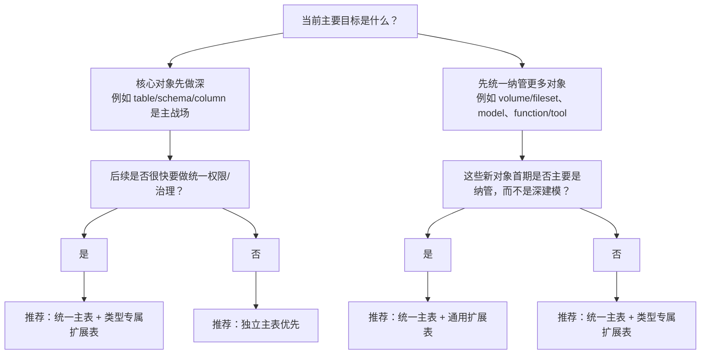

# 自研 Catalog 数据模型方案评审文档

## 1. 文档目的

本文用于评审自研 Catalog Service 的三类核心数据模型方案：

- 方案 A1：`统一主表 + 通用扩展表`
- 方案 A2：`统一主表 + 类型专属扩展表`
- 方案 B：`独立主表`

本文目标不是抽象讨论“哪种方案更先进”，而是帮助团队回答下面几个实际问题：

- 当前阶段应该优先选哪种方案
- 为什么这么选
- 不同方案分别适合什么场景
- 需要承担什么成本和风险
- 后续如果需求变化，如何平滑演进

参考材料：

- `Industry/data-model/open-source-catalog-backend-data-model-current-state.md`
- `Industry/data-model/catalog-backend-storage-fields.md`

---

## 2. 执行摘要

本文同时覆盖：

- 湖仓核心资产：`catalog/schema/table/column`
- 非表资产：`volume/fileset`、`model`、`function/tool`、`feature_set`、`agent` 等

结论先行：

- 轻量纳管优先：`统一主表 + 通用扩展表`
- 统一对象层 + 结构化建模优先：`统一主表 + 类型专属扩展表`
- 强语义和长期演进优先：在 `统一主表 + 类型专属扩展表` 下继续扩展子表和版本表

结合当前场景，文档默认前提收敛为：

- 表资产是必选能力，且需要作为核心对象支持
- 非表资产优先范围包括：`volume/fileset`、`model`、`function/tool`、`feature_set`、`agent`

这不是“只做轻量纳管型非表资产”的场景，而是“表资产 + 一组中高复杂度非表资产”并行演进的场景。

当前场景结论：

- 不建议把 `统一主表 + 通用扩展表` 作为默认起步方案
- `统一主表 + 类型专属扩展表` 比通用扩展表方案更稳，但仍需要治理边界
- 推荐 `统一主表 + 类型专属扩展表`
- `volume/fileset` 可相对轻量接入
- `model`、`function/tool`、`feature_set`、`agent` 应预留专属结构与版本/治理扩展空间

### 2.1 先给结论

- 如果当前阶段更看重 `table/schema/column` 等核心对象深建模、查询直观、排障效率和长期稳态维护，优先选择 `独立主表`
- 如果当前阶段更看重快速纳管更多对象，且对象整体偏轻，优先选择 `统一主表 + 通用扩展表`
- 如果当前阶段既希望保留统一对象层，又希望复杂对象有专属结构，优先选择 `统一主表 + 类型专属扩展表`
- 如果希望兼顾强语义建模、统一治理、后续权限和版本化演进，推荐采用 `统一主表 + 类型专属扩展表`，并按需扩展子表与版本表

### 2.2 推荐落地结论

对大多数自研 Catalog，推荐的默认方向是：

```text
统一身份层
+ 类型专属扩展表
+ 权限/治理关系层
+ 必要时增加版本层
```

这套结构的含义是：

- 统一身份层：承接目录、对象树、治理挂点
- 类型专属扩展表：承接对象主要语义字段
- 独立关系层：承接权限、标签、策略、血缘
- 子表或版本表：承接继续变重的对象能力和历史
- 低频弱语义属性：按需补充，不作为主推荐结构的前置组成部分

### 2.3 一句话判断规则

- 想先做稳：优先 `独立主表`
- 想先做广：优先 `统一主表 + 通用扩展表`
- 想保留统一对象层、又不想过度弱化语义：优先 `统一主表 + 类型专属扩展表`
- 想兼顾长期演进：优先 `统一主表 + 类型专属扩展表`

---

## 3. 方案定义

### 3.1 方案 A1：统一主表 + 通用扩展表

核心思路：

- 所有对象先进入统一主表，例如 `asset`
- 通过 `type`、`subtype` 区分 table、view、model、function、fileset、dashboard 等对象
- 通用字段放主表
- 大部分差异字段放入通用扩展表、属性表或 JSON 扩展字段

示意：

```text
asset
  - id
  - type
  - subtype
  - parent_id
  - name
  - full_name
  - owner
  - status
  - created_at
  - updated_at

asset_extension
  - asset_id
  - key
  - value

```

补充说明：高频查询、排序或关联字段不要长期留在 `key/value` 结构中。

### 3.2 方案 A2：统一主表 + 类型专属扩展表

核心思路：

- 所有对象先进入统一主表，例如 `asset`
- 通用字段继续放主表
- 不同对象类型拥有自己的类型专属扩展表

示意：

```text
asset
  - id
  - type
  - parent_id
  - name
  - full_name
  - owner
  - status

table_asset_ext
model_asset_ext
function_asset_ext
feature_set_ext
agent_ext
```

这类方案比“统一主表 + 通用扩展表”更强，因为对象的主要差异不再全部挤进一个通用扩展结构里；但它仍然保留统一对象层带来的统一目录、统一治理和统一权限挂点优势。

### 3.3 方案 B：独立主表

核心思路：

- 不同对象分别建独立主表
- 每类对象承载自己的强语义字段
- 通用但弱语义的附加属性通过共享扩展表补充

示意：

```text
catalogs
schemas
tables
columns
models
functions
filesets

asset_properties
  - object_id
  - object_type
  - property_key
  - property_value
```

### 3.4 与开源路线的对应关系

| 开源项目 | 更接近的路线 | 主要特点 |
| --- | --- | --- |
| Unity Catalog OSS | 独立主表 | 资源分表、结构清晰、查询直观 |
| Apache Gravitino | 独立主表 + 版本表 | 强调版本化、联邦接入、provider 边界 |
| Apache Polaris | 统一主表 / 统一实体层 | 强调统一权限、policy、控制面关系建模 |

补充说明：

- `统一主表 + 类型专属扩展表` 没有完全一一对应的开源原型
- 但它是很多自研系统里常见的中间形态，本质上是在“统一对象层”和“强语义对象层”之间做折中

---

## 4. 当前对象特征

### 4.1 非表资产的分类与建模复杂性

非表资产的差异很大，建议结合当前优先对象做粗分类：

| 类型 | 典型对象 | 建模特点 | 更适合的起步方式 |
| --- | --- | --- | --- |
| A 类：相对轻量 | `volume`、`fileset` | 以位置、生命周期、归属关系为主，弱版本化，结构相对稳定 | 可从 `统一主表 + 通用扩展表` 或 `统一主表 + 类型专属扩展表` 起步 |
| B 类：中复杂度 | `model`、`function/tool`、`feature_set` | 有版本、参数、输入输出、依赖关系或外部系统关联 | 更适合 `统一主表 + 类型专属扩展表`，并预留子表与版本表 |
| C 类：高复杂度 | `agent` | 可能包含工具绑定、子 Agent、执行状态、调用链、权限和血缘 | 更建议从 `统一主表 + 类型专属扩展表` 起步，并预留专属子表或运行态结构 |

放到当前优先级里看：

- `volume/fileset`：可先纳管、后增强
- `model/function/tool/feature_set`：大概率要继续深建模
- `agent`：最容易被低估，后续复杂度上升最快

结合“表资产必须支持”这个前提，当前对象组合更接近“核心表资产 + 一批中高复杂度非表资产”。因此不建议以纯 `统一主表 + 通用扩展表` 起步，更适合从 `统一主表 + 类型专属扩展表` 出发，并按需扩展子表和版本表。

---

## 5. 方案选择决策树

### 5.1 快速决策树



### 5.2 分步判断

重点只看四件事：

1. 核心对象是不是少而重  
如果是，偏 `独立主表`

2. 新对象首期是“深建模”还是“先纳管”  
先纳管偏 A1 或 A2；一开始就要深建模偏 A2 或 B

3. 权限、policy、tag、lineage 是否很快会成为核心能力  
如果是，尽早设计统一 identity / securable object 层

4. 团队更愿意先承担哪类复杂度  
前期抽象更轻偏 A1；统一对象层和对象语义兼顾偏 A2；正式建模优先偏 B

---

## 6. 核心对比

| 维度 | 统一主表 + 通用扩展表 | 统一主表 + 类型专属扩展表 | 独立主表 |
| --- | --- | --- | --- |
| 模型风格 | 统一实体模型 + 通用扩展层 | 统一实体模型 + 类型专属扩展层 | 强类型对象模型 |
| 新增资产类型 | 通常最快 | 较快，但要补对应扩展表 | 通常最慢，往往要新增主表及配套实现 |
| 新增对象字段 | 低频字段接入最轻 | 低频字段仍较轻，强语义字段可放专属扩展表 | 强语义字段落地最规范 |
| 查询可读性 | 最依赖 `type/subtype` 和扩展字段解释 | 比通用扩展表更清楚 | 通常最直观 |
| 数据约束能力 | 最弱 | 中等，可在类型扩展表中加强约束 | 通常最强 |
| 索引设计 | 最容易折中 | 比通用扩展表更好控制 | 通常最精准 |
| 调试排障 | 最依赖统一模型纪律 | 好于通用扩展表 | 通常最直观 |
| 跨类型统一治理 | 最容易统一建设 | 也容易统一建设 | 也能做，但常需额外统一对象层 |
| 统一权限建模 | 最自然 | 也比较自然 | 也能统一，但常需额外授权抽象层 |
| 对象语义表达 | 最容易被抽平 | 能保留较多对象语义 | 通常最清晰 |
| 前期开发速度 | 在“先纳管、后深化”前提下最快 | 介于通用扩展表和独立主表之间 | 在“正式建模优先”前提下启动成本更高 |
| 长期可维护性 | 对象复杂度持续上升时最易累积问题 | 明显好于通用扩展表，但边界仍需治理 | 对象边界稳定时通常最稳 |
| 多租户隔离 | `tenant_id + type` 行级隔离实现简单，但租户间争抢同一索引 | 与通用扩展表类似，但可在专属扩展表中做局部优化 | 可按租户做 schema 隔离或表名前缀，但跨租户通用能力需额外处理 |
| 跨类型聚合统计 | 单表 `GROUP BY type` 即可，SQL 最直观 | 仍然比较直观 | 通常需要 UNION 多表或应用层聚合 |
| DDL 变更影响面 | 主表或通用扩展表变更影响面最大 | 主表影响面大，专属扩展表影响面相对收敛 | 每次只改对应对象表，影响范围小但迁移脚本多 |
| 对象标识符设计 | 统一 `asset_id`，但不同类型对象的 `full_name` 语义差异需额外处理；跨类型强引用用 `asset_id + type` | 与通用扩展表类似，但跨类型引用在专属扩展表中可局部优化 | 每类对象有独立主键体系，`full_name` 语义自然；跨对象强引用需组合字段 |

### 6.1 如何理解这张表

- 这不是绝对结论，而是默认趋势
- `统一主表 + 通用扩展表` 的优势通常出现在“对象类型多、首期纳管优先、对象整体偏轻”的场景
- `统一主表 + 类型专属扩展表` 适合“需要统一对象层，但又不想把复杂对象全部压平”的场景
- `独立主表` 的优势通常出现在“核心对象少但重、强语义建模优先、排障和长期维护优先”的场景
- 如果系统本来就计划引入统一 identity 层和统一权限层，后两类方案在治理能力上的差距会缩小

---

## 7. 不同方案分别适合什么场景

### 7.1 更适合统一主表 + 通用扩展表的情况

- 未来对象类型预计较多，并且会持续增长
- 很多对象首期只需要被纳管，而不需要深建模
- 希望优先做统一目录、统一搜索、统一标签、统一权限挂接
- 更重视统一 control plane，而不是核心对象深建模

### 7.2 更适合统一主表 + 类型专属扩展表的情况

- 希望保留统一对象层和统一治理挂点
- 但对象之间的差异已经明显大于“少量扩展字段”能承受的范围
- 不希望 `model`、`function/tool`、`feature_set`、`agent` 这类对象长期落在一个通用扩展结构里
- 希望先把复杂对象的主要语义保住

### 7.3 更适合独立主表的情况

- 当前主战场主要是 `catalog/schema/table/column`
- 核心对象后续会持续做深
- 强约束、强索引、强语义和排障效率很重要
- 团队更看重中长期稳态维护，而不是前期快速铺开对象类型

### 7.4 更适合在 A2 下继续扩展子表或版本表的情况

- 既要核心对象深建模，又要统一权限、统一治理、统一对象树
- 既要支持表类资产，又预计后续会逐步增加非表资产
- 希望主结构仍保持统一对象层
- 接受在 `统一主表 + 类型专属扩展表` 之下继续增加子表、版本表和运行态结构

## 8. 典型需求用例对比

### 8.1 新增一种资产类型

示例：新增 `volume/fileset`、`model`、`function/tool`、`feature_set`、`agent`

`统一主表 + 通用扩展表`：

- 增加 `type/subtype`
- 复用现有对象注册、搜索、标签、权限挂载框架
- 首期通常不一定要新增主表，扩展字段先承接属性

`统一主表 + 类型专属扩展表`：

- 保留统一 `asset` 主表
- 新增对象时补对应的类型专属扩展表
- 比通用扩展表方案更能保留对象语义

`独立主表`：

- 往往要新增对应主表
- 补迁移、索引、约束、DAO、接口和测试
- 但如果该对象有对象专属的核心语义，例如 `model` 的版本与 artifact、`function/tool` 的输入输出与绑定关系、`feature_set` 的结构与来源关系，独立主表的设计会更自然

结论：

- 新对象如果是“先纳管、后增强”，通用扩展表方案最快
- 如果既要统一对象层，又希望对象差异有结构化承载，类型专属扩展表方案更稳
- 新对象如果一开始就很重，`统一主表 + 类型专属扩展表` 并预留子表/版本表，或直接独立主表，都更稳

### 8.2 给核心对象新增强语义字段

示例：给 `table` 增加 `snapshot_id`、`metadata_location`

`统一主表 + 通用扩展表`：

- 可以先放扩展表或属性表
- 前期接入快
- 但高频查询、约束、排序、权限判断一旦依赖这些字段，后续常要升级成强结构

`统一主表 + 类型专属扩展表`：

- 可以先放到对应类型的扩展表
- 比通用扩展表更容易保持结构清晰
- 如果字段最终成为核心强语义字段，仍可能继续升级为独立主表字段或版本表字段

`独立主表`：

- 通常直接新增真实列，或加到对象版本表
- 需要补迁移和兼容处理
- 后续查询、索引、约束和排障更自然

结论：

- 低频、弱约束字段：通用扩展表方案最灵活
- 中间态强语义字段：类型专属扩展表方案更合适
- 高频、强语义字段：独立主表更稳

### 8.3 引入统一权限模型

示例：role、grant、policy、继承授权

`统一主表 + 通用扩展表`：

- 更容易快速抽象统一 `securable object`
- 适合统一 control plane
- 但对象专属权限语义变深后，类型分支会变多

`统一主表 + 类型专属扩展表`：

- 仍然保留统一权限挂点
- 比通用扩展表方案更容易把对象差异落到各自扩展表中
- 但最终如果权限语义非常对象专属，仍需要更强的专属建模

`独立主表`：

- 对象专属权限更容易贴近业务语义
- 但跨类型统一授权通常要额外抽象层

结论：

- 权限重点是统一 control plane：两类统一主表方案都更顺
- 如果又要保留统一对象层、又要承载对象差异，类型专属扩展表方案更平衡
- 权限重点是核心对象精细语义：独立主表更自然

### 8.4 支持对象历史与版本

`统一主表 + 通用扩展表`：

- 能做，但通常要额外设计版本层
- 如果大量可变内容都在扩展字段里，版本化结构容易偏松散

`统一主表 + 类型专属扩展表`：

- 也需要额外设计版本层
- 但比通用扩展表方案更容易围绕对象类型建立结构化版本表

`独立主表`：

- 更容易引入 `*_version` 模型
- 历史记录和演进路径更清楚

结论：

- 版本历史是核心能力时，类型专属扩展表方案已经明显好于通用扩展表方案
- 如果历史和演进是主能力，`统一主表 + 类型专属扩展表` 并配套版本表，或独立主表，仍然更合适

### 8.5 做跨类型统一搜索

`统一主表 + 通用扩展表`：

- 首期更容易快速做统一搜索

`统一主表 + 类型专属扩展表`：

- 仍然容易先做统一搜索
- 同时可以在对象专属扩展表中承载更结构化的检索字段

`独立主表`：

- 通常需要补统一检索层或聚合层

结论：

- 首期统一目录搜索：两类统一主表方案都更顺
- 如果既要统一搜索又要更清楚的结构，类型专属扩展表方案更平衡
- 后期复杂搜索：三类方案最终都可能需要专门检索层

### 8.6 本节总结

| 关注点 | 更优先考虑的方案 |
| --- | --- |
| 新对象先纳管 | `统一主表 + 通用扩展表` |
| 新对象要保留对象语义 | `统一主表 + 类型专属扩展表` |
| 高频强语义字段 | `独立主表` |
| 统一权限、统一搜索 | 两类统一主表方案都更顺 |
| 历史、版本、重对象演进 | `统一主表 + 类型专属扩展表` + 版本表，或 `独立主表` |

---

## 9. 成本拆解

### 9.1 成本总表

| 成本维度 | 统一主表 + 通用扩展表 | 统一主表 + 类型专属扩展表 | 独立主表 |
| --- | --- | --- | --- |
| 前期抽象设计成本 | 中到高，需要先定义统一对象边界和通用扩展策略 | 高，需要同时定义统一对象边界和类型扩展边界 | 中，重点是把核心对象各自建模清楚 |
| 新增对象类型成本 | 通常最低 | 中，需要补类型专属扩展表和映射 | 通常最高 |
| 新增对象字段成本 | 低到中，弱语义字段最灵活 | 中，字段归属更清楚但仍要维护扩展表结构 | 中 |
| 数据库变更成本 | 前期较低，后期可能回迁 | 中，主表变更少但专属扩展表会持续增加 | 前期较高，路径更明确 |
| CRUD 开发成本 | 低到中，通用复用最多 | 中，通用流程与类型分支并存 | 中到高，对象专属逻辑更多 |
| 统一搜索接入成本 | 通常最低 | 低到中 | 中 |
| 权限接入成本 | 通常最低 | 低到中 | 中 |
| 测试成本 | 前期较低，后期受类型分支影响上升 | 中，既要测统一层也要测类型扩展 | 前期较高，后期更稳定 |
| 排障成本 | 中到高，最依赖模型纪律 | 中，比通用扩展表方案更容易定位问题 | 通常较低到中 |
| 后期改造成本 | 常见为“从弱结构升级强结构” | 常见为“把部分类型升级为独立主表或版本表” | 常见为“补统一治理层” |

### 9.2 成本结论

- `统一主表 + 通用扩展表` 通常把收益放在“前期接入最快、统一治理接入最快”
- `统一主表 + 类型专属扩展表` 更像“前期多做一点类型边界设计，换后续少回拆”
- `独立主表` 通常把收益放在“后期强语义维护、排障和演进更稳”
- 三类方案本质上是在不同阶段支付复杂度：A1 偏后移，A2 更均衡，B 偏前置

### 9.3 评审时建议重点问的四个问题

1. 我们当前最贵的成本是什么  
是快速接入新对象，还是后续深建模、排障和演进？

2. 我们当前最怕的风险是什么  
是前期投入过重，还是后期复杂度失控？

3. 我们愿意把复杂度放在哪一侧  
是前期正式建模，还是后期治理回拆？

4. 非表资产的构成是什么样的  
是低复杂度对象为主，还是中高复杂度对象占比更高？这会直接影响”接入效率”和”后续回拆成本”的权衡。

### 9.4 DDL 变更影响面补充

- 两类统一主表方案里，主表 `asset` 是共用入口，主表 DDL 变更影响面最大
- 类型专属扩展表的 DDL 变更只影响对应对象类型，风险明显小于主表
- 独立主表的单次变更影响最小，但迁移次数通常更多

建议：把统一主表做薄，只保留跨对象共用的最小字段集，把对象专属字段尽量放在类型扩展表中。

### 9.5 本节总结

| 方案 | 主要成本放在哪 |
| --- | --- |
| `统一主表 + 通用扩展表` | 前期最轻，后期最容易补强结构 |
| `统一主表 + 类型专属扩展表` | 前期多做边界设计，后期更均衡 |
| `独立主表` | 前期正式建模更重，后期维护更稳 |

---

## 10. 风险与失败模式

### 10.1 统一主表 + 通用扩展表的典型风险

1. 通用扩展字段失控  
越来越多字段进入 `properties`、JSON 或通用扩展表，真实业务语义逐渐分散

2. 强语义字段长期留在弱结构中  
后续查询、索引、约束和权限判断会越来越复杂

3. 类型分支膨胀  
service、DAO、校验、权限里出现越来越多 `if type == ...`

4. 核心对象被过度抽平  
table、model、function 等复杂对象被迫长期共用弱语义模型

5. 最终不得不回拆  
当某类对象变重时，只能重新拆出类型专属扩展表、独立主表或版本表

6. EAV 模式陷阱  
如果扩展表采用 `key/value` 行存储，高频查询、排序、关联和约束都会明显变差。适合低频弱语义属性，不适合核心查询字段。

### 10.2 统一主表 + 类型专属扩展表的典型风险

1. 统一层和专属层边界不清  
哪些字段该留在 `asset`，哪些字段该进入类型扩展表，如果规则不清，很容易反复搬迁

2. 类型扩展表逐步膨胀  
虽然比通用扩展表更稳，但复杂对象一多，类型扩展表也可能继续走向“大而杂”

3. 统一模型和专属模型双重复杂度并存  
既要维护统一对象层，又要维护类型专属逻辑，团队理解成本会上升

4. 某些对象迟早仍要升级为独立主表  
当对象进入高频查询、强约束、强版本化阶段，类型扩展表仍可能不够用

5. 容易误以为已经完成长期分层  
如果把 A2 当成最终态，而不再定义后续升级路径，后面仍可能积累结构债务

### 10.3 独立主表的典型风险

1. 表数量持续增长  
对象一多，物理表、迁移、DAO、接口都会增加

2. 通用能力重复实现  
如果没有统一对象层，搜索、标签、权限、审计等能力容易重复接入

3. 横切治理能力割裂  
不同对象在 tag、policy、lineage、ownership 上的接入方式可能不一致

4. 权限模型分散  
如果权限直接跟对象表强绑定，后续跨类型统一授权会越来越难

5. 新对象接入越来越慢  
每次新增对象都可能需要一整套正式建模流程

### 10.4 风险控制建议

- 高频查询字段不要长期留在通用扩展属性里
- 权限、tag、policy、lineage 尽量走独立关系层
- 提前定义“什么字段必须升级成真实列”
- 提前定义“什么对象必须拆出类型专属扩展表、独立主表或版本表”

### 10.5 本节总结

| 方案 | 最常见风险 | 控制重点 |
| --- | --- | --- |
| `统一主表 + 通用扩展表` | 字段失控、类型分支膨胀 | 尽早升级真实列或专属结构 |
| `统一主表 + 类型专属扩展表` | 边界不清、扩展表膨胀 | 提前定义字段归属和升级规则 |
| `独立主表` | 表太多、治理能力分散 | 尽早补统一身份层和关系层 |

---

## 11. 权限与治理视角的建议

无论最终选择哪种对象模型，都不建议把权限直接揉进业务主表。

推荐单独设计：

```text
securable_object
  - object_id
  - object_type
  - parent_object_id
  - full_name
  - owner
  - status

principal
role
grant_record
policy
policy_binding
tag_binding
lineage_edge
ownership_binding
```

这样做的好处是：

- 业务对象边界保持清晰
- 权限模型保持统一
- 后续继承授权、统一审计、统一策略更顺
- 即使对象层走独立主表，也不会把权限做散

补充说明：`securable_object` 本身也有维护成本。如果首期对象类型很少、近期又没有跨类型统一授权需求，这一层不一定要一开始就做得很重。它与 `asset_identity` 可以一一关联，但职责不同：前者面向权限，后者面向业务对象身份。

---

## 12. 结构演进路径与触发条件

### 12.1 从统一主表 + 通用扩展表演进到统一主表 + 类型专属扩展表

典型路径：

1. 先用统一主表承接对象身份和基础纳管
2. 当某类对象开始变重时，先拆出类型专属扩展表
3. 再进一步，把高频强语义字段升级为独立主表或版本表
4. 权限、tag、policy、lineage 保持独立关系层

适合触发升级的信号：

- 某类对象专属字段明显变多
- 高频查询越来越依赖通用扩展字段或 JSON 属性
- 该对象的权限规则开始大量特化
- 该对象需要独立版本历史
- 该对象成为单独性能热点

### 12.2 在统一主表 + 类型专属扩展表下继续扩展子表和版本表

典型路径：

1. 保留统一对象层，继续承接统一目录和统一挂点
2. 对中高复杂度对象维持类型专属扩展表
3. 当某类对象进入高频查询、强约束、强版本化阶段时，在该对象下增加专属子表或版本表
4. 权限、tag、policy、lineage 继续走独立关系层

适合触发升级的信号：

- 类型专属扩展表开始承载大量核心查询字段
- 该对象需要更强的约束、索引和独立生命周期
- 该对象的版本、权限或性能优化逻辑明显独立于其他对象
- 该对象已经从“统一纳管对象”变成“需要专属子结构的核心业务对象”

### 12.3 从独立主表演进到统一治理层

典型路径：

1. 保留现有强类型对象主表
2. 补统一 identity / object reference 层
3. 把权限、tag、policy、lineage 统一挂到这层之上
4. 需要跨类型统一检索时，再补统一检索层

适合触发统一抽象的信号：

- 多类对象都要支持相同治理能力
- 权限和策略开始跨类型统一管理
- 搜索和目录展示开始跨类型统一
- 新对象接入时重复工作越来越多

### 12.4 建议提前约定的演进阈值

- 某类对象专属字段明显增多时，先判断是拆出类型专属扩展表，还是直接升级为独立主表
- 高频查询开始依赖通用扩展字段或 JSON 属性时，优先升级为真实列或专属结构
- 某类对象同时出现“字段变多、查询变重、需要历史”三个信号时，应尽早补版本表
- 对象类型持续增加、跨类型治理需求明显增多时，优先补统一 identity / securable object 层
- 新对象接入重复工作持续偏高时，考虑补统一接入层

### 12.5 本节总结

| 当前起点 | 后续更常见的演进方向 |
| --- | --- |
| `统一主表 + 通用扩展表` | 升级为 `统一主表 + 类型专属扩展表` |
| `统一主表 + 类型专属扩展表` | 增加子表、版本表、运行态结构 |
| `独立主表` | 补统一身份层、统一治理层、统一检索层 |

---

## 13. 能力扩展方式对比

新增能力时，三类方案的默认落点不同：

- `统一主表 + 通用扩展表`：先落统一层，再补对象特化
- `统一主表 + 类型专属扩展表`：先落统一层，再收敛到类型扩展层
- `独立主表`：先落对象内，再补统一层

### 13.1 从新增能力角度的直接对比

| 新增能力场景 | 统一主表 + 通用扩展表 | 统一主表 + 类型专属扩展表 | 独立主表 |
| --- | --- | --- | --- |
| 新增统一 tag | 最容易，直接挂统一对象 | 容易，统一入口不变 | 能做，但通常要补统一对象引用 |
| 新增统一权限挂载 | 最容易，先建统一授权关系 | 容易，且更方便承载对象差异 | 能做，但通常要补 `securable object` |
| 新增跨类型搜索 | 更容易快速起步 | 也较顺，且结构更清楚 | 往往要补统一索引层 |
| 新增对象专属字段 | 可先放通用扩展层，但后期可能回拆 | 更自然，直接进类型扩展表 | 更自然，直接加列或子表 |
| 新增对象历史 / version | 要补专门版本层 | 容易先补类型版本层 | 更自然，直接给对象加 version 表 |
| 新增复杂对象专属规则 | 最容易出现更多类型分支 | 好于通用扩展表，但复杂对象最终仍可能升级 | 更自然，直接落在对象域内 |
| 新增统一治理能力 | 最顺 | 较顺 | 通常要补统一治理层 |
| 接入低复杂度非表资产 | 首期最顺 | 也顺，但设计略重 | 建表成本可接受，但通常不划算 |
| 接入中高复杂度非表资产 | 先接最快，但后期更容易碰到上限 | 从设计期更平衡 | 从设计期更匹配，但建模成本更高 |

### 13.2 新增能力时的实现分层建议

无论最终选择哪种主模型，建议从一开始就把新增能力分成三类来实现。

第一类：统一横切能力

- tag
- policy
- grant
- ownership
- lineage
- audit
- search index

建议：

- 用独立关系层实现
- 不要因为图省事直接揉进业务主表

第二类：对象专属核心能力

- `table_version`
- `partition_spec`
- `model_version`
- `function_param`
- `snapshot metadata`

建议：

- 落对象专属主表、子表或版本表
- 不要长期塞在 properties 或通用扩展字段里

第三类：低频弱语义扩展能力

- 附加展示属性
- 第三方同步字段
- 临时纳管属性

建议：

- 放扩展表或 properties
- 但要提前定义升级规则

### 13.3 这部分对方案选择的意义

如果未来新增能力以横切能力为主，两类统一主表方案都更顺；如果横切能力又明显依赖对象差异，A2 更稳；如果新增能力以对象专属深能力为主，独立主表更顺。

如果两类能力都会持续出现，结论仍然是：主结构选 A2，子表、版本表和关系层按需扩展。

### 13.4 本节总结

| 新增能力类型 | 更顺的路径 |
| --- | --- |
| 横切能力：tag、policy、统一搜索 | 两类统一主表方案 |
| 对象差异明显的治理能力 | `统一主表 + 类型专属扩展表` |
| 对象专属深能力：版本、复杂查询、性能优化 | `独立主表` 或 A2 下继续扩展子表/版本表 |

---

## 14. 推荐落地方案

### 14.1 推荐结构

```text
asset_identity（统一身份层）
  - id
  - type
  - subtype
  - parent_id
  - name
  - full_name
  - status
  - owner
  - created_at
  - updated_at

table_asset_ext / model_asset_ext / function_asset_ext / schema_asset_ext / catalog_asset_ext
  - 承载对象专属强语义字段

volume_asset_ext / feature_set_ext
  - 承载低中复杂度对象的类型专属结构

agent_ext（Agent 类型专属扩展表）
  - agent_id（引用 asset_identity.id）
  - system_instruction（主系统 prompt，可版本化）
  - llm_provider / model_name
  - tool_binding（工具绑定关系，通常为独立子表）
  - memory_config（记忆/知识库配置）
  - quota_config（调用配额和操作权限配置）
  # 继续变重后，可拆出以下子表：
  # agent_tool_binding / agent_sub_agent_relation / agent_execution_log / agent_call_chain_lineage

asset_properties（通用扩展属性）
  - asset_id
  - property_key
  - property_value

securable_object（统一安全对象层）
  # 与 asset_identity 的关系：securable_object.object_id = asset_identity.id
  # securable_object 是 asset_identity 在权限视角的投影，承载权限、授权、策略相关字段
  - object_id（引用 asset_identity.id）
  - object_type
  - parent_object_id
  - full_name
  - owner
  - status
  # 以下关系表通过 object_id 关联到 securable_object
  grant_record / role_binding / policy_binding / tag_binding / lineage_edge / ownership_binding

table_version / model_version / function_version
  - 按需增加
```

**关于 securable_object 与 asset_identity 的关系说明**

`asset_identity` 是业务对象的统一身份层，承载对象树和元数据；`securable_object` 是权限视角的投影，承载权限、策略和授权相关字段。两者通过 `object_id = asset_identity.id` 关联。

这种分离的好处是：
- 业务对象边界（`asset_identity`）和权限对象边界（`securable_object`）可以独立演进
- 即使业务主表走独立主表，权限层仍然可以统一
- `securable_object` 只放权限相关字段，保持轻量

如果首期只有 2~3 类核心对象且没有跨类型统一授权需求，`securable_object` 可以做薄（只建立基本投影关系），后续再补全策略字段。

### 14.2 推荐原则

- 统一身份层只放统一对象树和统一挂点必需字段
- 高频查询字段不要塞进 `properties`
- 强语义字段不要长期留在弱结构里
- 权限和治理单独建关系层
- 核心对象如果需要历史，尽早设计版本层

### 14.3 为什么推荐这一方案

- 统一对象层还在，治理和搜索更容易统一
- 大多数对象可以先落在类型专属扩展表中
- 继续变重的对象还能自然扩展子表、版本表和运行态结构

### 14.4 这种方案为什么也可能变乱

`统一主表 + 类型专属扩展表` 并不天然简单。它的价值在于保留统一对象层，同时让不同对象有结构化承载；但如果边界不清，也很容易逐步膨胀。

最常见的失控方式包括：

- 统一身份层放入过多业务字段
- 独立主表、类型专属扩展表和通用扩展属性边界不清
- 本应升级为真实列的字段长期停留在类型专属扩展表或通用扩展属性里
- 权限和治理一部分走统一关系层，一部分直接揉进业务主表
- 同一个对象一部分走统一逻辑，一部分走专属逻辑，但没有明确规则

如果出现这些情况，这种方案就会变成：

- 既不像统一主表那样轻
- 也不像独立主表那样清楚
- 而是多层都有数据、多处都有逻辑、边界越来越模糊

### 14.5 如何避免这种方案失控

如果采用这种方案，建议一开始就约束好下面四条边界：

1. 统一身份层做薄  
只放统一对象树和统一挂点必需字段，例如 `id`、`type`、`parent_id`、`name/full_name`、`owner`、`status`、审计字段。

2. 类型专属扩展表做实  
强语义字段优先进入对象专属扩展表，例如：
- table 的 `format/location/schema version`
- model 的 `version/artifact/framework`
- function/tool 的 `input/output/runtime binding`
- feature_set 的 `definition/source relation`
- agent 的 `tool binding/execution config`

3. 扩展表做克制  
类型专属扩展表承载对象主要语义字段；通用扩展属性只承载低频、弱约束、易变化属性，并提前定义“什么字段必须升级成真实列、什么情况下要继续拆子表或版本表”。

4. 权限与治理关系保持统一  
`grant/policy/tag/lineage/ownership` 统一走关系层，不直接揉进业务主表。

### 14.6 对当前方案落地的提醒

当前更稳的做法不是过早把所有复杂对象都独立主表化，而是先把 `统一主表 + 类型专属扩展表` 做扎实：

- 很薄的统一身份层
- 类型专属扩展表承接对象主要语义结构
- 收敛使用通用扩展属性表
- 统一的权限与治理关系层
- 按需增加子表、版本表和运行态结构

---

## 15. 开源社区演进观察

| 项目 | 更接近的路线 | 启发 |
| --- | --- | --- |
| Unity Catalog | 独立主表 | 保持对象分表，再补治理与生产能力 |
| Gravitino | 独立主表 + 版本表 | 保持对象分表，再补版本、联邦和治理能力 |
| Polaris | 统一主表 / 统一实体层 | 保持统一对象层，再补统一授权和控制面能力 |

整体启发：

- 没有哪一条路线会自然淘汰另外两条
- 更现实的方向是按对象层、统一身份层、治理关系层、必要版本层分层演进
- 对当前场景来说，这会进一步支持 `统一主表 + 类型专属扩展表` 作为主方案

---

## 16. 评审建议输出模板

建议最终评审结论按下面模板落地：

1. 当前阶段判断  
我们当前是“核心对象少但重”，还是“对象类型多且增长快”

2. 本期优先级  
本期最重要的 3 个目标是什么，例如：
- 核心表资产深建模
- 统一权限挂接
- 快速纳管非表资产

3. 可接受的复杂度位置  
我们更愿意承担前期正式建模成本，还是后期统一模型治理成本

4. 方案选择  
本期最终选择：
- `统一主表 + 通用扩展表`
- `统一主表 + 类型专属扩展表`
- `独立主表`

5. 本期明确不做什么  
例如：
- 暂不做全量版本化
- 暂不做所有非表对象深建模
- 暂不把权限揉进业务主表

6. 下次复盘触发点  
例如：
- 新增对象类型超过 N 类
- 某类对象专属字段超过 N 个
- 高频查询大量依赖扩展字段
- 权限和治理开始跨三类以上对象统一管理

7. 当前对象组合判断
- 表资产是否仍然是核心对象
- 非表资产是否仍以 `volume/fileset`、`model`、`function/tool`、`feature_set`、`agent` 为主
- 如果对象范围变化，是否需要重新评估方案

---

## 17. 最终建议

如果当前阶段仍以 `catalog/schema/table/column` 等核心湖仓对象为主，同时需要尽快纳入 `volume/fileset`、`model`、`function/tool`、`feature_set`、`agent` 这组非表资产，推荐的主方案是：

`统一主表 + 类型专属扩展表`

对应的推荐结构是：

```text
统一身份层
+ 类型专属扩展表
+ 权限/治理关系层
+ 必要时补版本层
```

建议按对象类型这样落地：

- `table/schema/column`：继续作为核心强语义对象建模，挂在统一身份层之下
- `volume/fileset`：可先停留在 `asset + 类型专属扩展表`，按轻量对象接入
- `model/function/tool/feature_set`：优先放在类型专属扩展表中，并为后续子表、版本表预留空间
- `agent`：不要按轻量扩展对象看待，直接预留专属子表或运行态结构
- 低频弱语义属性：按需补充，不作为主推荐结构的前置组成部分
- 统一目录、统一权限、统一标签、统一血缘：统一通过身份层和关系层承接，不直接揉进业务主表

不建议直接采用：

- 纯 `统一主表 + 通用扩展表`：更容易在表资产和复杂非表资产上过早碰到结构上限
- 纯 `独立主表`：对象语义最强，但更容易把统一治理和统一控制面能力做重

一句话总结：

在当前场景下，最合适的不是一开始全部独立主表，也不是长期停留在通用扩展结构里，而是以 `统一主表 + 类型专属扩展表` 作为主方案，再按需扩展子表、版本表和运行态结构。
