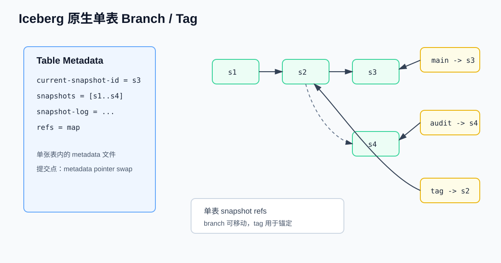
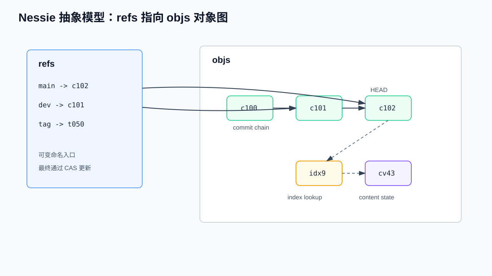
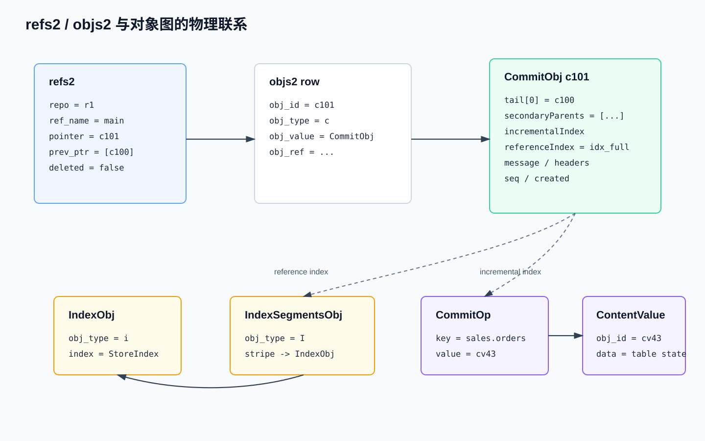
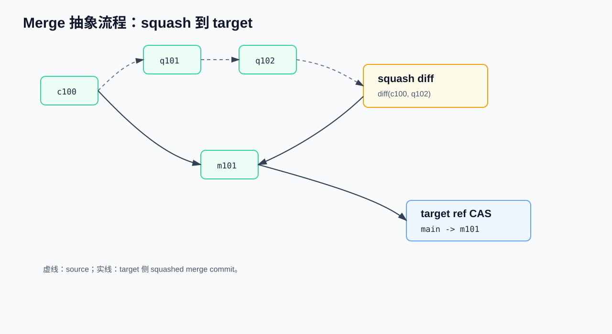
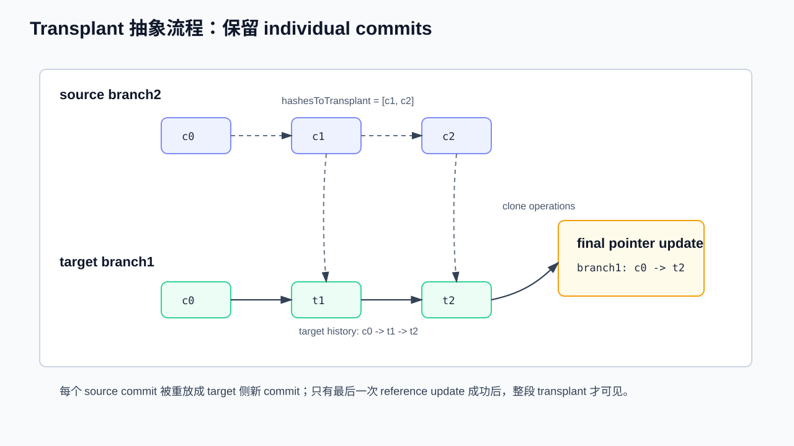

# Nessie Catalog 级 Git-Like 原理与实现流程

> 面向已有 CS / DB / Catalog 基础知识的开发者。本文说明 Iceberg 单表 branch/tag 与 Nessie Catalog 级版本控制的差异，并按源码核验 `commit`、`branch`、`merge`、`transplant`、OCC/CAS、`refs2`/`objs2`、protobuf 对象序列化以及 namespace 冲突语义。
>
> 源码核验基线：本地 `projectnessie/nessie@d10c0f6748d595d82482be335382581c4ce48300`，提交时间 `2026-05-12 08:59:25 +0200`。官方文档核验时间：2026-05-14，重点参考 Project Nessie 的 About、Transactions、Spec、Commit Kernel 与 CLI merge 文档，以及 Apache Iceberg branching/tagging 和 releases 文档。

---

## 0. 从 Iceberg 单表版本到 Nessie Catalog 版本

Iceberg 原生版本控制的边界是单张表。每张表都有自己的 table metadata JSON；写入、删除、重写或 schema/spec 变更会生成新的 metadata 文件，再由 catalog 原子替换当前 metadata 文件位置。Iceberg branch/tag 是 table metadata 内的 snapshot reference，用于给单表 snapshot 建立命名引用。



Apache Iceberg 1.1.0 引入了 snapshot references 和 `ManageSnapshots` 中的 branch/tag 操作；1.2.0 继续补充 branch commit、Spark SQL 读写 branch/tag、以及创建、替换、删除 branch/tag 的 DDL。讨论数据结构时，核心入口是 `TableMetadata.refs()` 中的 `Map<String, SnapshotRef>`。

| 字段 | 含义 |
|---|---|
| `TableMetadata.currentSnapshotId` | 当前主分支 snapshot；规范要求它与 `refs.main.snapshotId` 一致 |
| `TableMetadata.snapshots` | 表 metadata 中保留的 snapshot 列表 |
| `TableMetadata.snapshotLog` | snapshot 变更日志 |
| `TableMetadata.refs` | `Map<String, SnapshotRef>`，保存单表 branch/tag |
| `SnapshotRef.snapshotId` | 该 ref 指向的 snapshot id |
| `SnapshotRef.type` | `BRANCH` 或 `TAG` |
| `SnapshotRef.minSnapshotsToKeep` | branch 的最小保留 snapshot 数 |
| `SnapshotRef.maxSnapshotAgeMs` | branch 的 snapshot 最大保留时间 |
| `SnapshotRef.maxRefAgeMs` | ref 自身最大保留时间；`main` 不过期 |

简化后的 Iceberg branch/tag 创建形态如下：

```text
table.manageSnapshots()
  .createBranch("audit", 43)
  .setMinSnapshotsToKeep("audit", 2)
  .setMaxSnapshotAgeMs("audit", 3600000)
  .setMaxRefAgeMs("audit", 604800000)
  .commit();

table.manageSnapshots()
  .createTag("eom_2026_04", 40)
  .setMaxRefAgeMs("eom_2026_04", 180L * 24 * 3600 * 1000)
  .commit();
```

对应 metadata 可理解为：

```text
refs:
  main:
    type = branch
    snapshot-id = 43
  audit:
    type = branch
    snapshot-id = 43
    min-snapshots-to-keep = 2
    max-snapshot-age-ms = 3600000
    max-ref-age-ms = 604800000
  eom_2026_04:
    type = tag
    snapshot-id = 40
    max-ref-age-ms = 15552000000
```

Iceberg 读写时通常显式选择 table ref，而不是切换全局 checkout 上下文：

```text
table.newScan().useRef("audit");
table.newAppend().toBranch("audit").appendFile(file).commit();

SELECT * FROM db.table VERSION AS OF 'audit';
INSERT INTO db.table.branch_audit VALUES (...);
```

这个模型只能表达单表状态：

```text
sales.orders:
  refs.main  -> snapshot 43
  refs.audit -> snapshot 44
  refs.eom   -> snapshot 40
```

Nessie 要表达的是 catalog-wide 状态，即同一个 branch HEAD 下多张表、视图、namespace 的一致快照：

```text
catalog branch qa:
  sales.orders    -> orders snapshot 44
  sales.customers -> customers snapshot 18
  sales.payments  -> payments snapshot 9
```

因此，Nessie 的事务边界是整个 catalog branch 的 HEAD pointer，而不是单张 Iceberg 表的 metadata pointer。

---

## 1. Nessie 的核心抽象

Nessie 可以先抽象成两类入口：

```text
refs: 命名引用。每个 branch/tag/internal ref 保存一个可变 pointer。
objs: 对象图。保存 commit、content value、index、tag、ref metadata 等 typed objects。
```



`refs` 中的每条记录都是一个命名 pointer：

```text
refs/heads/main -> c102
refs/heads/qa   -> q201
refs/tags/eom   -> t050
int/refs         -> internal commit chain
```

对 branch 来说，pointer 通常指向 `CommitObj`。读请求从 branch 名解析到 HEAD commit，再通过 commit 的 index 找到各个 `ContentKey` 的当前 value。写请求先构造新的不可变对象，最后通过一次 reference pointer 更新让这些对象从目标 branch 可达。

`objs` 是统一对象图。不同对象通过 `obj_type` 区分，并通过 `ObjId` 互相引用：

```text
Reference(refs/heads/main).pointer
  -> CommitObj c102
       tail[0] -> CommitObj c101
       referenceIndex / referenceIndexStripes -> IndexObj / IndexSegmentsObj
       incrementalIndex -> CommitOp(sales.orders)
  -> CommitOp.value = ContentValueObj cv_orders_v43
  -> ContentValueObj.data = IcebergTable(metadataLocation=..., snapshotId=43, ...)
```

几个容易混淆的标识需要分开：

| 概念 | 作用 |
|---|---|
| reference name | `refs/heads/main`、`refs/tags/eom` 或 `int/refs`，是命名入口 |
| `ObjId` | 存储对象 ID，连接 `refs2.pointer`、`CommitObj.tail`、index segment、`ContentValueObj` 等对象 |
| `ContentKey` | Catalog 对象名，例如 `sales.orders`、`sales.daily_view`、`sales` namespace |
| `content id` | 逻辑内容对象 ID，用于跨 rename / branch 识别同一张表、视图或 namespace |
| `payload` | 内容类型编码，决定 `ContentValueObj.data` 按 Iceberg table、view、namespace 等哪种模型解释 |

一次读 `sales.orders` 的逻辑路径是：

```text
refs/heads/main
  -> CommitObj c102
  -> index lookup("sales.orders")
  -> CommitOp(value=cv_orders_v43, payload=ICEBERG_TABLE, contentId=<uuid>)
  -> ContentValueObj cv_orders_v43
  -> IcebergTable(metadataLocation=orders/v43.metadata.json, snapshotId=43, ...)
```

Nessie commit 接收的操作是 key 级操作：`Put`、`Delete` 和 `Unchanged`。一个 Nessie commit 中同一个 `ContentKey` 只能出现一次。`Unchanged` 用于表达“我读过这个 key，它必须仍未变化”的隔离语义；它参与冲突检测，但服务端不会把 `Unchanged` 作为持久化的 content 变更写入 commit。

---

## 2. 物理存储、Java 对象与 protobuf

本章以 JDBC2 后端为例。JDBC2 主要用 `refs2` 和 `objs2` 承载 Nessie 对象图；其他后端有不同物理介质，但对象模型、序列化和 reference 更新语义基本一致。



### 2.1 `refs2` 与 `Reference`

JDBC2 的 reference 表为 `refs2`：

```sql
refs2(
  repo,
  ref_name,
  pointer,
  ext_info,
  prev_ptr,
  created_at,
  deleted,
  primary key(repo, ref_name)
)
```

persist 层的 `Reference` 是一个 generic named pointer，即一套通用的“名字 -> 对象 ID”结构。它可以表示 branch、tag 和内部 reference：

| `Reference` 字段 | `refs2` 字段 | 含义 |
|---|---|---|
| `name` | `ref_name` | 引用名。branch 常用 `refs/heads/<name>`，tag 常用 `refs/tags/<name>`，内部引用以 `int/` 开头 |
| `pointer` | `pointer` | 当前指向的 `ObjId`；branch 通常指向 `CommitObj` |
| `deleted` | `deleted` | 软删除标志 |
| `createdAtMicros` | `created_at` | 创建时间，微秒 epoch |
| `extendedInfoObj` | `ext_info` | 可选扩展信息对象 |
| `previousPointers` | `prev_ptr` | 最近旧 HEAD 列表，protobuf 分隔序列化为二进制 |
| 无 | `repo` | 后端分区字段，用于同一数据库承载多个 repository |

这就是“`refs2` 与 `Reference` 有两组字段”的原因：`refs2` 是 JDBC2 物理表结构，`Reference` 是跨后端的 Java/persist 层抽象。物理表需要 `repo`、SQL 类型和列名；Java 对象只保留通用语义字段。

`prev_ptr` 保存最近旧 pointer 列表，并给每个旧 pointer 带时间戳。它不是 `CommitObj.tail` 父链的重复：`tail` 是 commit 历史；`prev_ptr` 是 named reference 自身最近几次 pointer 更新的短历史。branch pointer 可以因为 commit、assign、恢复、删除/重建等动作跳到不在当前父链上的对象，`prev_ptr` 主要服务短窗口内的 reference history、恢复诊断和容错判断。

`Reference.forNewPointer()` 的当前默认保留策略是：

| 配置项 | 默认值 | 含义 |
|---|---:|---|
| `ref-previous-head-count` | `20` | 最多保留 20 个旧 pointer |
| `ref-previous-head-time-span-seconds` | `300` | 只保留最近 300 秒窗口内的旧 pointer |

只有 pointer 真实变化时，旧 pointer 才会被压入 `previousPointers`。如果超过数量或时间窗口，列表会被截断。

还要区分 `Reference` 与 `RefObj`。`Reference` 是 `refs2` 当前行抽象，承载 branch/tag 当前 pointer；`RefObj` 是 `objs2` 中 `obj_type='r'` 的标准对象，用于内部 `int/refs` 链记录 reference 创建/删除等管理信息，其中 `initialPointer` 表示 reference 创建时的 HEAD，不跟踪该 reference 的当前 HEAD。

### 2.2 `objs2`、`obj_value` 与对象类型

JDBC2 的对象表为 `objs2`：

```sql
objs2(
  repo,
  obj_id,
  obj_type,
  obj_vers,
  obj_value,
  obj_ref,
  primary key(repo, obj_id)
)
```

| 字段 | 含义 |
|---|---|
| `repo` | repository 标识 |
| `obj_id` | 对象 ID，当前标准对象通常由 SHA-256 hasher 生成，常见长度为 32 bytes |
| `obj_type` | 对象类型短码 |
| `obj_vers` | 少数可更新或自定义对象的版本 token |
| `obj_value` | protobuf 二进制序列化后的对象内容 |
| `obj_ref` | 对象引用时间或可达性相关时间，主要服务 cleanup |

`objs2` 是通用对象表，不为 `CommitObj`、`ContentValueObj`、`IndexObj` 分别建表。`obj_type` 说明这一行是哪类标准对象，`obj_value` 保存该对象按 protobuf schema 序列化后的 bytes。

Protocol Buffers，简称 protobuf，是一种用 `.proto` 文件定义字段和消息结构、由生成代码读写的紧凑二进制序列化格式。Nessie 在 `storage.proto` 中定义 `ObjProto`，其中 oneof 可以是 `CommitProto`、`ContentValueProto`、`IndexProto`、`IndexSegmentsProto`、`RefProto`、`TagProto` 等。后端只保存 bytes；字段解释由 `ProtoSerialization.serializeObj()` / `deserializeObj()` 完成。

标准对象类型如下：

| 类型 | 短码 | Java 对象 | `obj_value` 中的 protobuf 形态 |
|---|---:|---|---|
| `REF` | `r` | `RefObj` | `ObjProto.ref` / `RefProto` |
| `COMMIT` | `c` | `CommitObj` | `ObjProto.commit` / `CommitProto` |
| `TAG` | `t` | `TagObj` | `ObjProto.tag` / `TagProto` |
| `VALUE` | `v` | `ContentValueObj` | `ObjProto.content_value` / `ContentValueProto` |
| `STRING` | `s` | `StringObj` | `ObjProto.string_data` / `StringProto` |
| `INDEX_SEGMENTS` | `I` | `IndexSegmentsObj` | `ObjProto.index_segments` / `IndexSegmentsProto` |
| `INDEX` | `i` | `IndexObj` | `ObjProto.index` / `IndexProto` |
| `UNIQUE` | `u` | `UniqueIdObj` | `ObjProto.uniqueId` / `UniqueIdProto` |

例如 `obj_type='c'` 时，`obj_value` 里是 `CommitProto`，包含 `created`、`seq`、`tail`、`secondary_parents`、`headers`、`message`、`reference_index`、`reference_index_stripes`、`incremental_index`、`incomplete_index`、`commit_type` 等字段。`CommitObj` 没有独立物理表；它与 `objs2` 的关联就是 `obj_type='c'` 加上 `obj_value` 的 protobuf 内容。

对象之间的物理连接由 `ObjId` 字段承载：

```text
refs2.pointer
  -> objs2(obj_id=<commit>, obj_type='c')
CommitObj.tail / secondaryParents
  -> other CommitObj ObjIds
CommitObj.referenceIndex / IndexStripe.segment
  -> IndexObj or IndexSegmentsObj ObjIds
CommitOp.value
  -> ContentValueObj ObjId
ContentValueObj.data
  -> content-specific protobuf bytes, e.g. Iceberg table/view/namespace state
```

标准对象的 `ObjId` 不是简单对整行 `obj_value` 直接求 hash。不同对象定义自己的语义 hash 输入：

| 对象 | ObjId hash 输入 |
|---|---|
| `ContentValueObj` | `VALUE + contentId + payload + data` |
| `IndexObj` | `INDEX + index bytes` |
| `IndexSegmentsObj` | `INDEX_SEGMENTS + stripes` |
| `RefObj` | `REF + name + initialPointer + createdAtMicros` |
| `CommitObj` | `COMMIT + parent + message + headers + add/remove ops` |

这使得部分派生字段或引用时间可以在不改变版本语义的前提下补齐或更新；决定 commit 内容语义的是父链、message、headers 和 key 级 operations。

### 2.3 `CommitObj`、`CommitOp`、`ContentValueObj`、Index

`CommitObj` 是版本链节点，也是恢复 HEAD 对应完整 catalog state 的索引入口。核心字段如下：

| 字段 | 含义 |
|---|---|
| `id` | commit 对象 ID，也就是 `objs2.obj_id` |
| `referenced` | 对象引用时间或可达性相关时间，对应 `objs2.obj_ref` |
| `created` | commit 创建时间 |
| `seq` | commit 序号，用于排序和遍历优化 |
| `tail` | 主父链信息；`directParent()` 取 `tail[0]`，为空时为 `EMPTY_OBJ_ID`。默认每个 commit 最多携带 `parents-per-commit=20` 个父链条目，最近父提交在前 |
| `secondaryParents` | 附加父信息，例如 merge 来源 HEAD；主 log 遍历仍主要沿 `tail[0]` |
| `headers` | commit header map |
| `message` | commit message |
| `referenceIndex` | 外置完整 index 入口，可指向 `IndexObj` 或 `IndexSegmentsObj` |
| `referenceIndexStripes` | 内嵌在 commit 中的 index stripe 目录 |
| `incrementalIndex` | 当前 commit 的增量 index bytes |
| `incompleteIndex` | 当前 commit 是否缺少完整 index |
| `commitType` | commit 类型，例如 `NORMAL` 或内部 commit |

`CommitOp` 不是单独的 `objs2` 行，而是存放在 `CommitObj.incrementalIndex` 或完整 index 中的值。它表示某个 StoreKey/ContentKey 的状态操作：

| 字段 | 含义 |
|---|---|
| `action` | `ADD`、`REMOVE`、`INCREMENTAL_ADD`、`INCREMENTAL_REMOVE`、`NONE` |
| `payload` | content 类型 payload，例如 Iceberg table、view、namespace |
| `value` | 指向 `ContentValueObj` 的 `ObjId`；删除时可为空 |
| `contentId` | logical content id，用于跨 rename / branch 跟踪同一内容对象 |

`ADD` 和 `REMOVE` 表示当前 commit 的真实操作。`INCREMENTAL_ADD` 和 `INCREMENTAL_REMOVE` 表示来自历史 commit、仍暂存在 incremental index 中的条目。`NONE` 通常出现在完整 reference index 中，表示 key 当前存在，但不是本 commit 的操作。

`ContentValueObj` 保存某个 ContentKey 在某个版本上的 on-reference content state：

| 字段 | 含义 |
|---|---|
| `id` | value 对象 ID，也就是 `objs2.obj_id` |
| `referenced` | 对象引用时间或可达性相关时间 |
| `contentId` | logical content id |
| `payload` | content 类型 payload |
| `data` | content-specific protobuf bytes |

Iceberg table 的 `data` 由 `servers/store-proto/.../table.proto` 中的 `Content` / `IcebergRefState` 表达，主要包含：

| 字段 | Iceberg 语义 |
|---|---|
| `metadataLocation` | 当前 Iceberg metadata JSON 文件位置 |
| `snapshotId` | 当前 snapshot id |
| `schemaId` | 当前 schema id |
| `specId` | 当前 partition spec id |
| `sortOrderId` | 当前 sort order id |
| `id` | content id |

namespace 在 Nessie 中也是一种 `Content`，`NamespaceSerializer.payload()` 返回 `4`。它的 `data` 很小：

| 字段 | Namespace 语义 |
|---|---|
| `id` | content id，用于跟踪该 namespace content |
| `elements` | namespace 路径元素，例如 `["sales"]` 或 `["sales","prod"]` |
| `properties` | namespace 属性 map，例如 `location` 和用户自定义键值 |

因此，`ContentValueObj` 不存储数据文件列表，也不存储“namespace 下有哪些表、view、子 namespace”的目录清单。表和视图通常保存元数据指针及表格式状态；namespace 保存路径元素和属性。子对象是否存在，需要从完整 catalog index 中按 `ContentKey` 前缀查询。

Nessie 通过 incremental index 和 reference index 降低读、diff、merge、OCC 的成本。给定一个 commit，它的有效 catalog state 可理解为：

```text
complete state = reference index baseline + incremental index updates
```

| 对象或字段 | 存放位置 | 存什么 |
|---|---|---|
| `CommitObj.incrementalIndex` | commit 对象内的 bytes | 当前 commit 的 `ADD/REMOVE`，以及尚未 spill 的历史 `INCREMENTAL_ADD/INCREMENTAL_REMOVE` |
| `CommitObj.referenceIndex` | commit 对象内的 `ObjId` | 外置 reference index 入口；可指向单个 `IndexObj` 或 `IndexSegmentsObj` |
| `CommitObj.referenceIndexStripes` | commit 对象内的 stripe 列表 | 当 stripe 数量不多时，直接内嵌 `[firstKey,lastKey] -> segment` 目录 |
| `IndexObj.index` | `objs2` 中 `obj_type='i'` 的对象 | 一个序列化后的 `StoreIndex<CommitOp>`，可表示完整 index 或 key range segment |
| `IndexSegmentsObj.stripes` | `objs2` 中 `obj_type='I'` 的对象 | 多个 `IndexStripe`，用于在 stripe 目录太大时外置目录本身 |
| `IndexStripe.segment` | `IndexStripe` 字段 | 指向保存该 key range index 数据的 `IndexObj` |

当前默认阈值包括 `max-incremental-index-size=50*1024`、`max-serialized-index-size=200*1024`、`max-reference-stripes-per-commit=50`。这些阈值是序列化大小或 stripe 数量阈值，不是 commit 数量阈值。incremental index 过大时，历史增量会被 spill 到 reference index；当前 commit 的 `ADD/REMOVE` 仍留在新的 incremental index 中。

---

## 3. 并发控制与可见性

Nessie 写入的可见性来自两个层次：

```text
先写 objs，再更新 refs.pointer。
CAS 成功前，新对象不可从目标 branch 的 HEAD 到达。
CAS 成功后，新 HEAD 及其可达对象成为该 branch 的可见 catalog 状态。
```

OCC 和 CAS 解决不同问题：

| 机制 | 判断对象 | 判断问题 |
|---|---|---|
| OCC | `ContentKey` 的 expected state | 当前 catalog state 是否仍满足提交者假设 |
| CAS | `Reference.pointer` | 目标 branch 是否仍处于本次构造 commit 时读取到的 HEAD |

一次 commit 中，客户端会携带它认为某个 key 仍应满足的 expected 信息，例如旧 `ContentValueObj.id`、`contentId`、`payload`。服务端基于当前 HEAD 的完整 index 查找同一 `ContentKey` 的当前 `CommitOp`，再判断 expected 是否仍成立。

| 概念 | 是什么 | 在 OCC/CAS 中与谁比较 |
|---|---|---|
| HEAD | 某个 branch 当前 `refs2.pointer` 指向的 `CommitObj.id` | CAS 的 expected pointer |
| state / view | 从 HEAD 的 index 解析出的完整 catalog 快照，形态是 `ContentKey -> CommitOp` | OCC 查询 `state[ContentKey]` |
| `ContentKey` | Catalog 对象名，例如 `sales.orders`、某个 view、某个 namespace | OCC 的冲突粒度 |
| `expected value` | 提交者认为该 key 当前仍应指向的旧 `ContentValueObj.id` | 与当前 `CommitOp.value` 比较，不一致返回 `VALUE_DIFFERS` |
| `content id` | 逻辑内容对象 ID | 与当前 `CommitOp.contentId` 比较，不一致返回 `CONTENT_ID_DIFFERS` |
| `payload` | 内容类型编码 | 与当前 `CommitOp.payload` 比较，不一致返回 `PAYLOAD_DIFFERS` |
| `metadataLocation` | Iceberg table state 中的 metadata JSON 位置 | Nessie 不解析 JSON；它通过 `ContentValueObj.id` 间接参与 value 比较 |

OCC 的冲突粒度是 `ContentKey`。这可以类比为“修改同一个 catalog 文件会冲突”，但不是行级、manifest 级、partition 级或 data file 级。更细的同表并发 append / overwrite 语义由 Iceberg 自身的 snapshot validation 负责。

namespace 需要特别说明。`Namespace` 不是文件系统目录清单，它本身也是一个 content key。`sales` namespace 的 value 只包含 `elements=["sales"]` 和 `properties={...}`。因此：

```text
commit A 修改 sales.orders
commit B 修改 sales.customers
```

即使两个对象都位于 `sales` namespace 下，也不会因为共享 namespace 而发生 Nessie OCC 冲突。它们是两个不同的 `ContentKey`。

会冲突或失败的 namespace 场景有两类：

| 场景 | 原因 |
|---|---|
| 两个提交同时修改同一个 namespace content，例如都更新 `sales` 的 properties | 它们修改同一个 `ContentKey=sales` 的 namespace value，expected value 可能不再匹配 |
| 创建表/视图时父 namespace 不存在或不是 namespace | namespace validation 返回 `NAMESPACE_ABSENT` 或 `NOT_A_NAMESPACE` |
| 删除 namespace 时其下仍有 live content key | 前缀扫描完整 index 后返回 `NAMESPACE_NOT_EMPTY` |

这些约束不同于“同一 namespace 下任意不同表都冲突”。

---

## 4. 操作流程

### 4.1 Commit 到 branch

场景：`main` 当前指向 `c100`，`sales.orders` 当前为 `cv_orders_v42`，客户端希望提交 `cv_orders_v43`。


抽象流程：

```text
1. Read HEAD
   Ccurrent = refs/heads/main.pointer = c100

2. Build View
   由 c100 的 index 构建 state(c100) = ContentKey -> CommitOp

3. OCC
   校验本次提交携带的 expected state 是否匹配 state(c100)
   若同一 ContentKey 的 value/contentId/payload 已变化，返回 conflict

4. Write Objs
   写入新 ContentValueObj、CommitObj 和必要的 IndexObj / IndexSegmentsObj
   新 CommitObj 的 tail[0] = c100

5. CAS
   将 refs/heads/main.pointer 从 c100 更新到 c101
   成功后 c101 可见；失败则重读最新 HEAD 并重新做 OCC/构造
```

记录变化可以简化为：

```text
refs2 before:
  refs/heads/main.pointer = c100
  prev_ptr = [...]

objs2 add:
  cv_orders_v43:
    obj_type = v
    data = IcebergTable(metadataLocation=orders/v43.metadata.json, snapshotId=43, ...)

  c101:
    obj_type = c
    tail[0] = c100
    incrementalIndex:
      sales.orders -> CommitOp(ADD, payload=ICEBERG_TABLE, value=cv_orders_v43, contentId=<uuid>)

refs2 after:
  refs/heads/main.pointer = c101
  prev_ptr starts with c100
```

CAS 失败不等于业务冲突。若并发提交改的是不同 `ContentKey`，服务端可基于新 HEAD 重新构造 commit 并重试；若并发提交改的是同一 `ContentKey`，重读后 OCC 会失败并返回 key/value 冲突。

### 4.2 创建 branch

从 `main` 创建 `qa` branch 的核心成本是新增命名入口，不复制已有对象图：

```text
T0:
  refs/heads/main.pointer = c100

T1:
  refs/heads/main.pointer = c100
  refs/heads/qa.pointer   = c100
```

后续在 `qa` 上提交时，两条 branch 才开始分叉：

```text
main: c100 -> m101
qa:   c100 -> q101
```

实现层还会维护内部 `int/refs`，用 `RefObj` 记录 reference 创建/删除等管理信息。这服务于 reference 列表、恢复和一致性，不改变 branch 创建的抽象成本：新 branch 复用已有 HEAD 对象图。

常见失败分支包括同名 reference 已存在、base ref 不存在、并发创建同名 ref 只有一个成功。

### 4.3 Merge

场景：`qa` 从 `main@c100` 分出后产生两个提交：

```text
main: c100
qa:   c100 -> q101 -> q102
```



当前实现中，`VersionStoreImpl.merge()` 走 `MergeSquashImpl`。merge 的可见产物是 target 侧一个 squashed merge commit，而不是把 target pointer 直接改成 source HEAD，也不是生成 Git 式双父主链 commit。

流程如下：

```text
1. 解析 sourceHead=q102、targetHead=c100。
2. 找到共同祖先 commonAncestor=c100。
3. 计算 source 相对 commonAncestor 的 diff，即 q101/q102 的累计 key 级变更。
4. 在 target 当前 state 上做 ContentKey 冲突检查和 namespace 约束校验。
5. 构造 target-side squashed merge commit m101：
     tail[0] = targetHead
     secondaryParents = [sourceHead]
     incrementalIndex = squash(diff(c100, q102))
6. 最终一次 reference update：
     refs/heads/main.pointer: c100 -> m101
```

如果 merge 期间 `main` 已经前进到 `m200`，Nessie 不能直接把 `main` 指到 `q102`，也不能继续使用基于旧 `c100` 构造的 merge commit。它需要以 `m200` 为 target HEAD 重新计算 merge base、source diff、OCC / namespace 约束，并生成新的 target-side squashed merge commit。

`MergeBehavior` 可以影响单 key 冲突处理：

| 行为 | 含义 |
|---|---|
| `NORMAL` | 默认行为；target 上同一 content 有冲突变更时 merge 失败 |
| `FORCE` | 使用 source 侧内容覆盖 target 侧同 key 内容 |
| `DROP` | 丢弃该 key 的 source 侧变更，不让它导致整个 merge 失败 |

merge 的可见性是原子的。当前 merge 是一个 squashed commit，所以不存在“`c1'` 已在 main 可见、`c2'` 失败”的 target 可见历史。如果冲突、校验失败、dry-run 或最终 reference pointer 更新失败，`main` 不会前进，`refs2.prev_ptr` 也不会因为这次失败的 merge 新增 target 旧 HEAD。某些路径可能已经把候选对象写入 `objs2`，例如最终 CAS 失败前已经写入了 `m101`，但这些对象不在 `refs2.pointer` 可达链上，不会出现在 `main` 的 commit log 中。

### 4.4 Transplant

场景：`branch2` 从 `branch1@c0` 分出后产生两个提交，需要把这两个提交按原提交边界重放到 `branch1`：

```text
branch1: c0
branch2: c0 -> c1 -> c2

transplant [c1, c2] from branch2 into branch1
```



当前 transplant 走 `TransplantIndividualImpl`，更接近 Git cherry-pick 一段连续提交。请求显式传入 `hashesToTransplant` 和 `fromRefName`；它不会自动选择 source branch 上所有还未合入的提交。

流程如下：

```text
1. 解析 source ref 和 target branch，确认 target 是 branch。
2. 校验 hashesToTransplant 非空，并且请求中的 commit hash 连续、有序：
     [c1, c2] 要满足 c2.directParent == c1
3. 从 target 当前 HEAD 开始逐个 clone source commit operations：
     c1 -> t1(parent = c0)
     c2 -> t2(parent = t1)
4. 每一步都基于 target 当前 catalog state 做 ContentKey / namespace 冲突校验。
5. 最终只在 finishMergeTransplant() 中更新一次 target reference：
     refs/heads/branch1.pointer: c0 -> t2
```

成功后 target 历史是：

```text
branch1: c0 -> t1 -> t2
branch2: c0 -> c1 -> c2
```

`t1/t2` 是 target 侧新 commit，不是原来的 `c1/c2`。通常不应把共同基点 `c0` 放进 `hashesToTransplant`；它是 base，不是要 replay 的增量提交。

transplant 的可见性也由最后一次 reference pointer 更新决定。实现会在循环中逐个构造并可能预写 `t1/t2` 对象，但只有最后一个 transplanted commit 成为 `refs2.pointer` 后，target branch 才整体前进。如果 `t1` 已经写入 `objs2`、`t2` 构造或校验失败，`branch1` 不会停在 `t1`；`t1` 也不会出现在 `branch1` 的 commit log 中。换句话说，失败时通常不是物理删除已写对象的“回滚”，而是通过“不更新 target reference pointer”保证可见状态原子不变。

### 4.5 Merge、Transplant 与 Git 的差异

Nessie API 有 merge 和 transplant，没有暴露独立的 Git 式 rebase API。旧文档中把 merge 描述成“rebase + fast-forward merge”，主要是为了说明它会把 source 变更应用到 target 当前 HEAD 上；从当前源码看，应区分为：

| 操作 | 当前产物 | source 范围 | target 可见时机 |
|---|---|---|---|
| merge | 一个 target-side squashed merge commit | 从 `fromHash` 回溯到与 target 的共同祖先之间的累计变更 | 最终 target ref 更新成功后一次性可见 |
| transplant | 保留 individual commits | 请求中显式给出的、连续且有序的 commit hash 列表 | 最后一个 transplanted commit 成为 target HEAD 后整体可见 |

这个限制是多层共同约束。v2 client / REST 层会拒绝 `keepIndividualCommits(true)` 做 merge；v1 兼容层也拒绝 individual merge，并要求 transplant 是 unsquashed。存储层把 merge 路由到 `MergeSquashImpl`，把 transplant 路由到 `TransplantIndividualImpl`。

与传统 Git merge 的差异如下：

| 维度 | Git | Nessie |
|---|---|---|
| 主对象 | 文件树 / blob / commit graph | Catalog `ContentKey -> content value` |
| merge 结果 | 通常生成双父 merge commit | 当前 merge 生成一个 squashed target-side commit；transplant 可保留逐个 commit |
| 主父链 | commit graph 可天然多父 | 主链保持单父，附加父通过 `secondaryParents` 表达 |
| 冲突粒度 | 文件/行/自定义 merge driver | `ContentKey`、`payload`、`contentId`、`value` |

---

## 5. 源码锚点与参考资料

Nessie 本地源码锚点：

| 主题 | 文件 |
|---|---|
| `Reference` generic named pointer 与 `prev_ptr` 策略 | `versioned/storage/common/src/main/java/org/projectnessie/versioned/storage/common/persist/Reference.java` |
| `StoreConfig` 默认阈值 | `versioned/storage/common/src/main/java/org/projectnessie/versioned/storage/common/config/StoreConfig.java` |
| JDBC2 `refs2` / `objs2` 表结构 | `versioned/storage/jdbc2/src/main/java/org/projectnessie/versioned/storage/jdbc2/Jdbc2Backend.java` |
| JDBC2 reference 反序列化 | `versioned/storage/jdbc2/src/main/java/org/projectnessie/versioned/storage/jdbc2/Jdbc2Serde.java` |
| protobuf 对象序列化 | `versioned/storage/common-serialize/src/main/java/org/projectnessie/versioned/storage/serialize/ProtoSerialization.java` |
| 存储对象 protobuf schema | `versioned/storage/common-proto/src/main/proto/org/projectnessie/versioned/storage/common/proto/storage.proto` |
| content state protobuf schema | `servers/store-proto/src/main/proto/org/projectnessie/server/store/proto/table.proto` |
| `CommitObj` / index 说明 | `versioned/storage/common/src/main/java/org/projectnessie/versioned/storage/common/objtypes/CommitObj.java` |
| `CommitOp` 字段和 action | `versioned/storage/common/src/main/java/org/projectnessie/versioned/storage/common/objtypes/CommitOp.java` |
| `ContentValueObj` 字段和 ObjId hash | `versioned/storage/common/src/main/java/org/projectnessie/versioned/storage/common/objtypes/ContentValueObj.java` |
| `RefObj` 与 `Reference` 的区别 | `versioned/storage/common/src/main/java/org/projectnessie/versioned/storage/common/objtypes/RefObj.java` |
| namespace 序列化 | `servers/store/src/main/java/org/projectnessie/server/store/NamespaceSerializer.java` |
| Iceberg table 序列化 | `servers/store/src/main/java/org/projectnessie/server/store/IcebergTableSerializer.java` |
| namespace 校验、merge/transplant finish | `versioned/storage/store/src/main/java/org/projectnessie/versioned/storage/versionstore/BaseCommitHelper.java` |
| merge squash 实现 | `versioned/storage/store/src/main/java/org/projectnessie/versioned/storage/versionstore/MergeSquashImpl.java`、`BaseMergeTransplantSquash.java` |
| transplant individual 实现 | `versioned/storage/store/src/main/java/org/projectnessie/versioned/storage/versionstore/TransplantIndividualImpl.java` |
| Nessie spec 中 namespace 与 `Unchanged` 规则 | `api/NESSIE-SPEC-2-0.md` |

官方资料：

- Project Nessie About：<https://projectnessie.org/guides/about/>
- Project Nessie Transactions：<https://projectnessie.org/guides/transactions/>
- Project Nessie Specification：<https://projectnessie.org/develop/spec/>
- Project Nessie Commit Kernel：<https://projectnessie.org/develop/kernel/>
- Project Nessie CLI Merge 文档：<https://projectnessie.org/nessie-latest/cli/#merge-branch>
- Apache Iceberg Branching and Tagging：<https://iceberg.apache.org/docs/latest/branching/>
- Apache Iceberg Releases：<https://iceberg.apache.org/releases/>
- Nessie 源码基线：<https://github.com/projectnessie/nessie/tree/d10c0f6748d595d82482be335382581c4ce48300>
