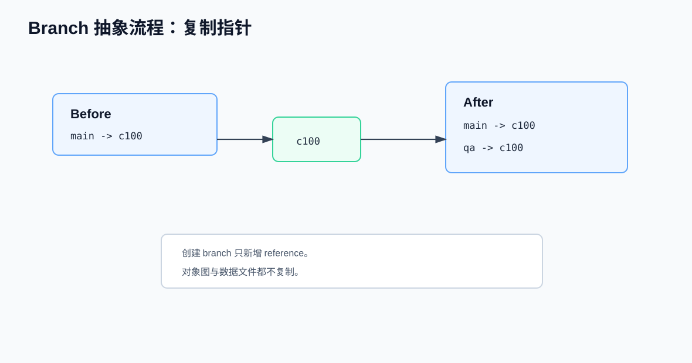
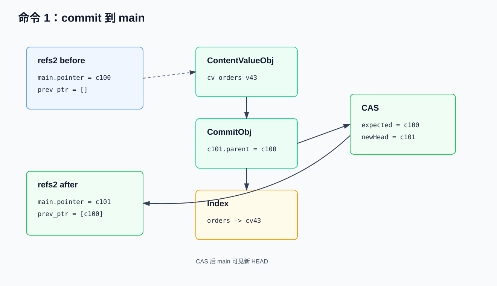
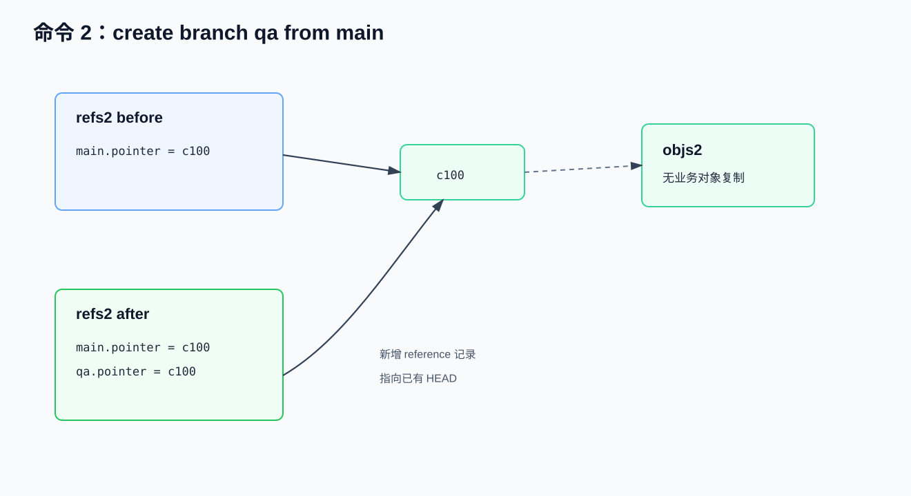
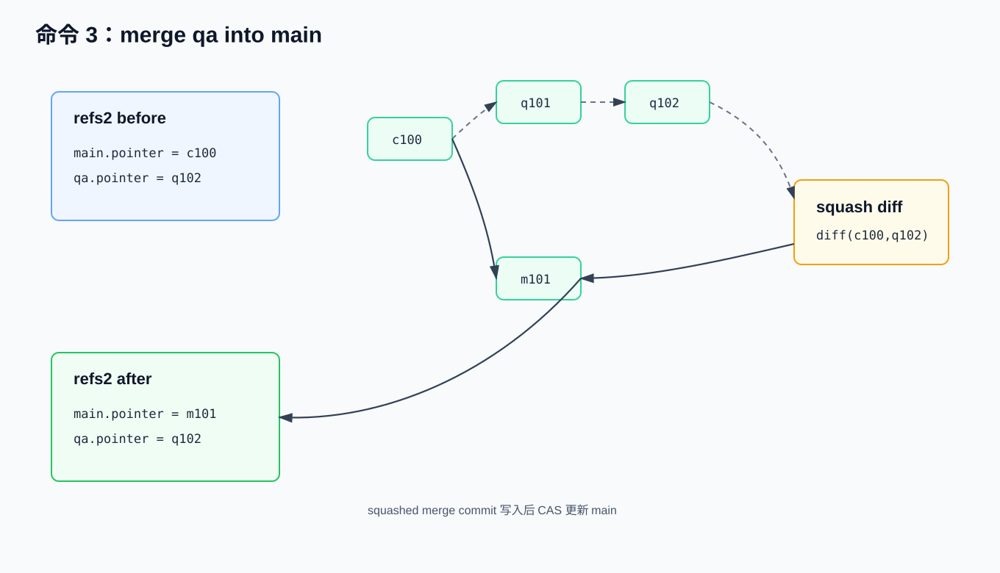
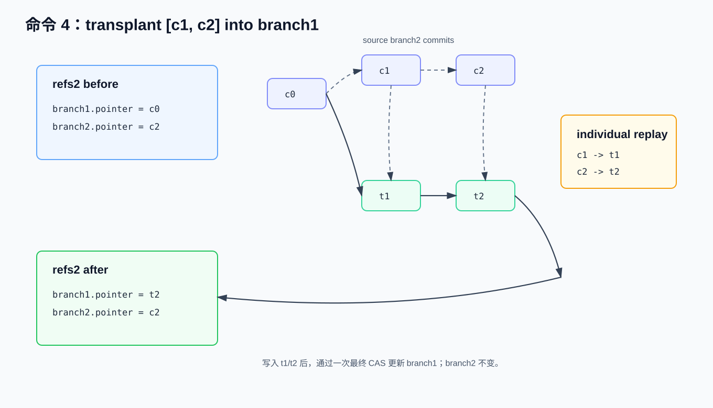

# Nessie Catalog 级 Git-Like 原理与实现流程

> 面向已有 CS / DB / Catalog 基础知识的开发者。本文先说明 Iceberg 单表版本控制，再说明 Nessie 如何把版本控制提升到 Catalog 层，覆盖 `refs`、`objs`、`CommitObj`、`ContentValueObj`、`IndexObj`、OCC、CAS、commit / branch / merge / transplant 数据流以及物理存储结构。
> Nessie 源码核验版本：初版核验 `projectnessie/nessie@3de486e26aa0809bb07be3fa46eeeb24e4d2c318`（2026-04-29）；本次复核使用 `origin/main@006a5387187999599b9b1c9009d8c38fc5f49844`（2026-05-11），并参考官方当前文档，重点核验 namespace、merge/transplant、`refs2`/`objs2` 与 index 结构。

---

## 0. Iceberg 原生单表 Branch / Tag

Iceberg 的版本控制边界是单张表。每张表都有自己的 table metadata JSON；写入、删除、重写或 schema/spec 变更会生成新的 metadata 文件，再由 catalog 原子替换当前 metadata 文件位置。Branch/tag 是 table metadata 内的 snapshot reference，用于给单表 snapshot 建立命名引用。


### 0.1 功能与逻辑结构

Iceberg 的 branch/tag 核心能力在 Iceberg 1.1.0 引入。官方 release note 显示，Apache Iceberg 1.1.0 于 2022-11-28 发布，加入了用于跟踪 tag / branch 的 snapshot references，以及 `ManageSnapshots` 中的 branch / tag 操作。Iceberg 1.2.0 于 2023-03-20 发布，继续补充 branch commit、Spark SQL 读写 branch/tag、以及创建、替换、删除 branch/tag 的 DDL。因此，讨论 table metadata 内的 branch/tag 数据结构时，起点是 1.1.0；讨论 Spark SQL 层较完整的使用体验时，通常从 1.2.0 开始。

源码入口有两个。`SnapshotRef.java` 定义 branch/tag reference 类型及保留策略字段；`TableMetadata.java` 持有 `refs` 映射并将其作为 table metadata 的一部分。

从最新 Iceberg 源码和规范看，原生 branch/tag 的核心结构是 `TableMetadata.refs()` 中的 `Map<String, SnapshotRef>`。例如：`SnapshotRef.type` 区分 `BRANCH` 与 `TAG`，`SnapshotRef.snapshotId` 指向具体 snapshot。

| 字段 | 含义 |
|---|---|
| `TableMetadata.currentSnapshotId` | 当前主分支 snapshot；规范要求它与 `refs.main.snapshotId` 一致 |
| `TableMetadata.snapshots` | 表 metadata 中保留的 snapshot 列表 |
| `TableMetadata.snapshotLog` | snapshot 变更日志 |
| `TableMetadata.refs` | `Map<String, SnapshotRef>`，保存单表 branch/tag |
| `SnapshotRef.snapshotId` | 该 ref 指向的 snapshot id |
| `SnapshotRef.type` | `BRANCH` 或 `TAG` |
| `SnapshotRef.minSnapshotsToKeep` | branch 的最小保留 snapshot 数 |
| `SnapshotRef.maxSnapshotAgeMs` | branch 的 snapshot 最大保留时间 |
| `SnapshotRef.maxRefAgeMs` | ref 自身最大保留时间；`main` 不过期 |

Branch 是可移动的 snapshot reference，指向某条单表 snapshot lineage 的 head。Tag 是命名 snapshot reference，主要用于审计、发布点和保留策略。二者都是单表 metadata 内的引用，不复制数据文件。

### 0.2 创建与切换示例

Iceberg Java API 使用 `ManageSnapshots` / `SnapshotManager` 管理 refs：

```text
table.manageSnapshots()
  .createBranch("audit", 43)
  .setMinSnapshotsToKeep("audit", 2)
  .setMaxSnapshotAgeMs("audit", 3600000)
  .setMaxRefAgeMs("audit", 604800000)
  .commit();

table.manageSnapshots()
  .createTag("eom_2026_04", 40)
  .setMaxRefAgeMs("eom_2026_04", 180L * 24 * 3600 * 1000)
  .commit();
```

对应的 metadata 变化可以简化表示为：

```text
refs:
  main:
    type = branch
    snapshot-id = 43
  audit:
    type = branch
    snapshot-id = 43
    min-snapshots-to-keep = 2
    max-snapshot-age-ms = 3600000
    max-ref-age-ms = 604800000
  eom_2026_04:
    type = tag
    snapshot-id = 40
    max-ref-age-ms = 15552000000
```

Iceberg 通常没有全局“checkout”式切换上下文；读写时显式选择 ref：

```text
// Java read
table.newScan().useRef("audit");

// Java write
table.newAppend().toBranch("audit").appendFile(file).commit();

-- Spark SQL read
SELECT * FROM db.table VERSION AS OF 'audit';

-- Spark SQL write
INSERT INTO db.table.branch_audit VALUES (...);
```

推进 branch 可以通过写入该 branch、`replaceBranch` 或 fast-forward 完成；tag 通常用于固定历史点，不用于持续写入。

### 0.3 能力边界

```text
sales.orders:
  refs.main  -> snapshot 43
  refs.audit -> snapshot 44
  refs.eom   -> snapshot 40
```

以上只表示 `sales.orders` 一张表的 snapshot references，不能表达下列 catalog-wide 状态：

```text
catalog branch qa:
  sales.orders    -> orders snapshot 44
  sales.customers -> customers snapshot 18
  sales.payments  -> payments snapshot 9
```

后者需要 Catalog 层版本控制。Nessie 的事务边界是整个 catalog branch 的 HEAD pointer，而不是单张 Iceberg 表的 metadata pointer。

---

## 1. Nessie 的抽象模型

Nessie 的核心存储模型可以先抽象为两类入口：

```text
refs：命名引用表。每个 branch/tag/internal ref 保存一个可变 pointer。
objs：对象表。保存 commit、content value、index、tag、ref metadata 等对象。
```


### 1.1 `refs`：Catalog 状态的命名入口

`refs` 中的每条记录都是一个命名 pointer：

```text
refs/heads/main -> c102
refs/heads/qa   -> q201
refs/tags/eom   -> t050
```

对 branch 来说，pointer 通常指向 `CommitObj`。读请求从 branch 名解析到 HEAD commit，再通过 commit 的 index 找到各个 `ContentKey` 的当前 value。写请求先构造新的对象图，最后通过 CAS 更新目标 branch 的 pointer。

`refs` 的抽象职责：

| 职责 | 说明 |
|---|---|
| 命名入口 | 将用户可见 branch/tag 名映射到对象图入口 |
| 可见性边界 | branch 的可见状态由 pointer 指向的 HEAD 决定 |
| 并发控制 | 最终提交通过 reference pointer CAS 完成 |
| 分支隔离 | 不同 branch 通过不同 pointer 进入同一组对象图 |

### 1.2 `objs`：Catalog 状态的对象图

`objs` 是统一对象表。不同对象通过 `obj_type` 区分，并通过 `ObjId` 相互引用：

```text
CommitObj c102
  -> parent CommitObj c101
  -> incremental/full index
  -> CommitOp(sales.orders).value = ContentValueObj cv_orders_v43

ContentValueObj cv_orders_v43
  -> IcebergTable(metadataLocation=orders/v43.metadata.json, snapshotId=43, ...)
```

`objs` 中对象之间形成一张由 `ObjId` 连接的对象图。HEAD commit 表示一个 catalog snapshot，index 表示 `ContentKey -> content value` 映射，content value 表示表、视图或 namespace 的 on-reference 元数据状态。例如：落到 JDBC2 后端时，对象统一存放在 `objs2` 中；对象连接由 `refs2.pointer`、`CommitObj.tail`、`CommitObj.referenceIndex`、index bytes 中的 `CommitOp.value` 等字段保存。

Nessie 的原子可见性来自以下规则：

```text
先写 objs，再 CAS refs.pointer。
CAS 成功前，新对象不可从目标 branch 的 HEAD 到达。
CAS 成功后，新的 HEAD 及其可达对象成为该 branch 的可见 catalog 状态。
```

### 1.3 `CommitObj`、`ContentValueObj`、`IndexObj` 的关系

这几类对象共同表达 Nessie 的版本链和 catalog state：

| 对象 | 逻辑作用 | 主要物理引用 |
|---|---|---|
| `CommitObj` | 版本链节点，表示一次 catalog commit | `tail[0]` 指向父 commit；`referenceIndex` 或 `referenceIndexStripes` 指向完整索引；`incrementalIndex` 内嵌本次变更 |
| `CommitOp` | index 中的 key 级操作，不是单独 `objs` 行 | `value` 字段指向 `ContentValueObj` 的 `ObjId` |
| `ContentValueObj` | 某个 ContentKey 在某个版本上的 content state | `data` 保存 Iceberg table/view/namespace 等序列化内容 |
| `IndexObj` | 保存序列化后的 StoreIndex 片段或完整索引 | 被 `CommitObj.referenceIndex` 或 `IndexStripe.segment` 引用 |
| `IndexSegmentsObj` | 保存多个 index stripe 的元信息 | 每个 stripe 再指向一个 `IndexObj` |

读取 `sales.orders` 时，逻辑路径为：

```text
refs/heads/main
  -> CommitObj c102
  -> index lookup("sales.orders")
  -> CommitOp(value=cv_orders_v43)
  -> ContentValueObj cv_orders_v43
  -> IcebergTable(metadataLocation=..., snapshotId=...)
```

---

## 2. 抽象流程：commit、branch、merge、transplant

本章只说明业务时序和 `refs` / `objs` 的逻辑变化，字段级结构在后续章节展开。

### 2.1 一次 commit 的时序

场景：`main` 当前指向 `c100`，`sales.orders` 当前为 `cv_orders_v42`。客户端希望提交 `cv_orders_v43`。


```text
1[Read HEAD]
   读取目标 ref。
   Ccurrent = main.pointer
   第一次循环中 Ccurrent = c100；CAS 失败后的重试循环中 Ccurrent = 最新 HEAD。

2[Build View]
   由 Ccurrent 的 index 构建完整 catalog 视图。
   state(Ccurrent) = ContentKey -> CommitOp

3[OCC]
   校验本次提交携带的 expected state 是否仍匹配 state(Ccurrent)。

   3.1[OCC 冲突]
      同一 ContentKey 的 value / content id / payload 已变化。
      返回 VALUE_DIFFERS / CONTENT_ID_DIFFERS / PAYLOAD_DIFFERS 等冲突。

   3.2[OCC 通过]
      进入 4[Write Objs]。

4[Write Objs]
   预写本次提交需要的新对象：
      - ContentValueObj(new value)
      - CommitObj Cnext(parent = Ccurrent)
      - 必要的 IndexObj / IndexSegmentsObj

5[CAS]
   CAS main: Ccurrent -> Cnext

   5.1[CAS 成功]
      main.pointer = Cnext
      Cnext 成为 main 的可见 HEAD。

   5.2[CAS 失败]
      main.pointer 已从 Ccurrent 前进到其他 HEAD。
      已预写的 Cnext 不成为 main 的可见 HEAD。
      回到 1[Read HEAD]，读取最新 HEAD，并重新执行 2[Build View] 和 3[OCC]。
```

Nessie Catalog 层的 `content state` 是某个 `ContentKey` 在某个 commit 上的 on-reference 状态。以 Iceberg 表为例：`ContentValueObj.data` 保存 `IcebergTable(metadataLocation=orders/v42.metadata.json, snapshotId=42, ...)`，其中 `metadataLocation` 指向 Iceberg metadata JSON。

这些概念之间的关系可以按读取路径理解。HEAD 是入口，state / view 是从 HEAD 解析出的完整 catalog 快照。OCC 不直接比较 Iceberg metadata JSON 文件，而是比较该快照中某个 `ContentKey` 当前对应的 `CommitOp` 与客户端提交携带的 expected 信息。

```text
HEAD / commit id
  -> 完整 catalog state / view
    -> ContentKey 对应的 CommitOp
      -> CommitOp.value = ContentValueObj.id
        -> ContentValueObj(contentId, payload, data)
          -> IcebergTable(metadataLocation, snapshotId, schemaId, specId, sortOrderId, ...)
```

| 概念 | 是什么 / 包含哪些信息 | 在 OCC / CAS 中与谁比较 |
|---|---|---|
| HEAD | 某个 branch 当前 `refs.pointer` 指向的 `CommitObj.id`。例如：`main.pointer=c100`。 | CAS 用它作为 expected pointer：`WHERE pointer = Ccurrent` |
| state / view | 从 HEAD 的 index 解析出的完整 catalog 快照。例如：形态是 `ContentKey -> CommitOp`。 | OCC 查询 `state(Ccurrent)[ContentKey]`，得到当前 `value/contentId/payload` |
| `ContentKey` | Catalog 对象名。例如：`sales.orders`、某个 view、某个 namespace。 | OCC 的冲突粒度；同一 `ContentKey` 的 catalog state 被改动即可能冲突 |
| `expected value` | 客户端认为该 key 当前仍应指向的旧 `ContentValueObj.id`。例如：`cv_orders_v42`。 | 与 `state(Ccurrent)[key].value` 比较，不一致返回 `VALUE_DIFFERS` |
| `content id` | 逻辑内容对象 ID，用于跨 rename / branch 识别同一个表、view 或 namespace。例如：rename 前后的表保留同一 content id。 | 与 `state(Ccurrent)[key].contentId` 比较，不一致返回 `CONTENT_ID_DIFFERS` |
| `payload` | 内容类型编码，决定 content data 应按哪种模型解释。例如：Iceberg table、view、namespace 对应不同 payload。 | 与 `state(Ccurrent)[key].payload` 比较，不一致返回 `PAYLOAD_DIFFERS` |
| `ContentValueObj.data` | 具体 content state。例如：Iceberg 表时是 `IcebergTable(metadataLocation, snapshotId, schemaId, specId, sortOrderId, ...)`。 | 不直接逐字段比较；其序列化内容参与 `ContentValueObj.id`，从而体现在 value 比较中 |
| `metadataLocation` | `IcebergTable` data 内的字段。例如：它指向 Iceberg metadata JSON 文件。 | Nessie 不解析该 JSON；它通过 `ContentValueObj.id` 间接参与 OCC |

OCC 的冲突粒度是 `ContentKey`。例如：`sales.orders`、某个 view 或 namespace 各自作为独立 key 参与冲突判断。Nessie 判断的是“这个 catalog 对象的状态是否仍等于提交者声明的 expected state”，不是判断 Iceberg manifest、partition、data file 或 row 级别的重叠；更细的同表并发 append / overwrite 语义由 Iceberg 的 snapshot validation 负责。

需要特别区分 namespace 与文件系统目录的类比。`Namespace` 在 Nessie 中也是一种 `Content`，payload id 为 `4`；它的 on-reference state 由 content id、路径元素 `elements` 和 `properties` 组成。例如：服务端序列化时写入的是 `id + Namespace(elements, properties)`，不是“该 namespace 下有哪些表、view、子 namespace”的目录清单。子对象是否存在，需要从完整 catalog index 中按 `ContentKey` 前缀查询。因此，两个提交分别修改 `sales.orders` 与 `sales.customers`，即使二者都位于 `sales` namespace 下，也不会仅因共享 namespace 而发生 OCC 冲突。

namespace 自身被修改时仍按同一个 `ContentKey` 冲突。`properties` 是任意字符串键值 map，常见键包括 `location` 和业务自定义属性。Iceberg REST 读取 namespace 时，如果存储属性中没有 `location`，服务端可能按 warehouse 配置计算返回值；这不表示 namespace content 保存了子表清单。例如：两个提交同时更新 `sales` namespace 的 properties，一个设置 `location=s3://lake/sales/`，另一个增删自定义属性，都会生成同一 namespace key 上的新 `ContentValueObj`；若两边 expected value 不再匹配，就会返回 `VALUE_DIFFERS` 或相关 key 冲突。namespace 还参与 catalog 约束校验：创建表/视图时父 namespace 必须存在且类型必须是 `NAMESPACE`；删除 namespace 时该 namespace 下不能仍有 live content key，否则会产生 `NAMESPACE_ABSENT`、`NOT_A_NAMESPACE`、`NAMESPACE_NOT_EMPTY` 等冲突。这些约束冲突不同于“同一 namespace 下任意不同表都冲突”。

| 时刻 | `refs` 状态 | `objs` 变化 | 可见状态 |
|---|---|---|---|
| T0 | `main -> c100` | 已有 `c100`、`cv_orders_v42`、相关 index | `orders=v42` |
| T1 | `main -> c100` | 新写入 `cv_orders_v43`、`c101`、必要 index | 仍为 `orders=v42` |
| T2 成功 | `main -> c101` | T1 对象从 `main` 可达 | `orders=v43` |
| T2 CAS 失败 | `main -> c200` | T1 对象不可从 `main` 到达 | 重新基于 `c200` 校验和重建 |

OCC 与 CAS 的职责不同：

| 机制 | 判断对象 | 判断问题 |
|---|---|---|
| OCC | ContentKey 的 expected state | 当前 catalog state 是否仍满足提交假设 |
| CAS | Reference pointer | 目标 branch 是否仍处于本次构造 commit 时读取到的 HEAD |

### 2.2 创建 branch 的时序

场景：从 `main` 创建 `qa`。



```text
T0:
  refs.main = c100

T1:
  refs.main = c100
  refs.qa   = c100
```

抽象上，branch 创建只增加一个命名入口，不复制 commit、index、content value 或底层数据文件。后续提交才会让两个 branch 的 pointer 分别前进：

```text
main: c100 -> m101
qa:   c100 -> q101
```

实现层还会维护内部引用索引。例如：内部 reference 会记录 reference 创建/删除相关日志。这些内部对象服务于 reference 管理，不改变 branch 创建的抽象成本：新 branch 复用已有 HEAD 对象图。

### 2.3 merge 的时序

场景：`qa` 从 `main@c100` 分出后产生两个提交：


```text
main: c100
qa:   c100 -> q101 -> q102
```

将 `qa` merge 到 `main` 的抽象流程：

```text
1. 找到 source 和 target 的共同祖先 c100。
2. 取出 source 上相对 c100 的变更：q101、q102。
3. 在 target 当前 HEAD 上计算 source 相对共同祖先的 diff / CommitOp。
4. 基于 target 当前 catalog state 做冲突检查和 namespace 约束校验。
5. 当前实现将这些变更压成一个 target 侧 squashed merge commit，例如 m101。
6. 最后一次性更新 target ref：main -> m101。
```

Nessie merge 的关键是把 source 相对共同祖先的变更应用到目标分支，而不是直接把目标 pointer 改成 source HEAD。原因是 merge 期间 target 可能已经有新提交：

```text
main: c100 -> m200
qa:   c100 -> q101 -> q102
```

此时正确做法是以 `m200` 为 target 起点重新计算 merge base、source diff 和冲突，再生成新的 target-side merge commit。当前 `VersionStoreImpl.merge()` 使用 `MergeSquashImpl`，v2 客户端和 REST 层也限制 merge 只能是 squashed merge。例如：`keepIndividualCommits(true)` 会被拒绝，`CommitObj.secondaryParents` 记录 merge 来源 HEAD。如果希望保留 source 的逐个 commit 边界，应使用 transplant。

merge 的可见性仍是原子的。merge 会先构造候选对象并检查冲突；只有无冲突、非 dry-run 且最终 reference pointer 更新成功时，target branch 才前进。如果中途冲突、校验失败或最终 CAS/update 失败，`main` 不会出现“只应用了前半段”的可见历史。某些后端/路径可能已经预写了不可达对象，但这些对象不在 `refs2.pointer` 可达链上，不会出现在 target branch 的 commit log 中。

### 2.4 transplant 的时序

场景：`branch2` 从 `branch1@c0` 分出后产生两个提交，需要把这两个提交按原提交边界移植到 `branch1`：


```text
branch1: c0
branch2: c0 -> c1 -> c2

transplant [c1, c2] from branch2 into branch1
```

transplant 的抽象流程：

```text
1. 解析 source ref 和 target branch，确认 target 是 branch。
2. 校验 hashesToTransplant 非空、在 fromRefName 上可解析、并且按旧到新顺序连续。
   例如 [c1, c2] 会检查 c2.directParent == c1。
3. 从 target 当前 HEAD 开始逐个 clone source commit 的 operations：
      c1 -> t1(parent = c0)
      c2 -> t2(parent = t1)
4. 每一步都基于 target 当前 catalog state 做 ContentKey / namespace 冲突校验。
5. 最后通过一次 reference update 让 target branch 指向最后一个新 commit：
      branch1 -> t2
```

成功后 target 历史是 `branch1: c0 -> t1 -> t2`，其中 `t1/t2` 是 target 侧新 commit，不是原来的 `c1/c2`。source branch 保持不变。通常不要把共同基点 `c0` 放进 `hashesToTransplant`；它是 base，不是要 replay 的增量提交。若从 `branch2` 传入 `[c1, c2]` 并 transplant 到仍在 `c0` 的 `branch1`，只要权限、引用解析和冲突校验都通过，这条路径会成功。

transplant 也按最终 reference pointer 更新决定可见性。实现会逐个构造候选 commit，但对外可见的 target branch HEAD 只有在最后一个 transplanted commit 成为 `refs2.pointer` 后才前进；失败时 target branch 不会停在中间的 `t1`。

### 2.5 merge、transplant 与 rebase 的关系

Nessie API 中有 merge 和 transplant，没有暴露独立的 Git 式 `rebase` API。旧 v1 HTTP 文档曾把 merge 描述成“rebase + fast-forward merge”，主要是为了说明它会把 source 变更应用到 target 当前 HEAD 上；当前代码层面应区分：

| 操作 | 当前产物 | source 范围 | target 可见时机 |
|---|---|---|---|
| merge | 一个 squashed merge commit | 从 `fromHash` 回溯到与 target 的共同祖先之间的变更 | 最终 target ref 更新成功后一次性可见 |
| transplant | 保留 individual commits | 请求中显式给出的、连续且有序的 commit hash 列表 | 只有最后一个 transplanted commit 成为 target HEAD 后才整体可见 |

这个限制不是单纯客户端行为，而是多层共同约束。v2 REST/combined client 在调用 `keepIndividualCommits(true)` 做 merge 时直接抛错。v1 REST 兼容层保留了 deprecated 参数，但通过 `validateKeepIndividual(merge, false, "Merge", "squashed")` 拒绝 individual merge，同时要求 transplant 只能是 unsquashed。存储层把 merge 路由到 `MergeSquashImpl`，把 transplant 路由到 `TransplantIndividualImpl`，没有提供 non-squash merge 或 squash transplant 的实现入口。

该行为从 PR #7035 开始进入主线，PR 于 2023-06-23 合入，并随 `nessie-0.62.0` 在同日发布。那次改动让 merge base 识别尊重 merge parents，从而支持对同一 source branch 的增量 merge；同时移除了“individual merge”和“squashed transplant”两种模式，使 V2 API 只保留当前行为。显式在 v2 client 中抛出 `Commits are always squashed during merge operations.` 的代码来自 PR #7516，PR 于 2023-09-20 合入；它只是把已经固定的服务端/存储层行为提前到客户端校验。

transplant 更接近 Git 的 cherry-pick，即把一段提交重放到另一条分支顶部。例如：调用路径是 `/history/transplant` 或 Java builder `transplantCommitsIntoBranch()`，请求中显式传入 `hashesToTransplant` 和 `fromRefName`。它不会自动选择“source branch 上所有还没有合入的提交”，也不会生成 squash commit。

### 2.6 merge 与 Git 双父提交的差异

Nessie 的主 commit 链保持单父链。merge 或 transplant 生成的 target commit 以 target 当前 HEAD 为直接父。`CommitObj.secondaryParents` 可以记录 merge 来源；读路径、log 主链遍历和 index 构建主要沿 `tail[0]` 前进。

这与传统 Git merge commit 的差异如下：

| 维度 | Git | Nessie |
|---|---|---|
| 主对象 | 文件树 / blob / commit graph | Catalog ContentKey -> content value |
| merge 结果 | 通常生成双父 merge commit | 当前 merge 生成一个 squashed target-side commit；transplant 可保留逐个 commit |
| 主父链 | commit graph 可天然多父 | 主链保持单父，附加父通过 `secondaryParents` 表达 |
| 冲突粒度 | 文件/行/自定义 merge driver | ContentKey、payload、contentId、value |

---

## 3. 物理表到 Java 对象


JDBC2 后端主要用 `refs2` 和 `objs2` 两张表承载 Nessie 的持久化对象图。`refs2` 保存命名引用的当前状态，`objs2` 保存 commit、content value、index、tag 等对象的序列化内容。Java/persist 层的 `Reference`、`CommitObj`、`ContentValueObj`、`IndexObj` 等对象，是对这些表行和二进制字段的类型化解释。

### 3.1 `refs2` 表与 `Reference`

在 JDBC2 后端，reference 物理表为 `refs2`：

```sql
refs2(
  repo,
  ref_name,
  pointer,
  ext_info,
  prev_ptr,
  created_at,
  deleted,
  primary key(repo, ref_name)
)
```

`Reference` 是 generic named pointer，核心字段如下：

| 字段 | 含义 |
|---|---|
| `name` | 引用名。branch 常用 `refs/heads/<name>`，tag 常用 `refs/tags/<name>`，内部引用以 `int/` 开头 |
| `pointer` | 当前指向的 `ObjId`；branch 通常指向 `CommitObj` |
| `deleted` | 软删除标志 |
| `createdAtMicros` | 创建时间，微秒 epoch |
| `extendedInfoObj` | 可选扩展信息对象 |
| `previousPointers` | 最近旧 HEAD 列表，用于恢复、容错和 reference 历史处理 |

`Reference` 是 generic named pointer，同一套命名指针结构可承载 branch、tag 和内部 reference。例如：`refs/heads/<name>` 通常指向 `COMMIT`，`refs/tags/<name>` 可指向 tag 或 commit，`int/` 前缀用于内部引用。`refs2` 是物理表，`Reference` 是 persist 层的一行抽象。例如：表中的 `repo` 是多 repository 分区字段，不属于单个 `Reference` 对象本身；`pointer` 保存对象图入口的 `ObjId`，`prev_ptr` 和 `ext_info` 分别序列化为 `previousPointers` 与 `extendedInfoObj`。

`prev_ptr` 保存最近旧 pointer 列表，并带有时间戳；它不是 `CommitObj.tail` 父链的重复。branch pointer 可能因为 assign、删除/重建或内部恢复而跳到一个不在当前 commit 父链上的对象，旧 HEAD 列表服务一致性检查、短时间窗口内的 reference history 和恢复诊断。例如：当前默认配置保留最近 `20` 个旧 pointer，并限制在最近 `300` 秒窗口内，配置项分别是 `ref-previous-head-count` 与 `ref-previous-head-time-span-seconds`。

### 3.2 `objs2` 表与对象类型

在 JDBC2 后端，对象物理表为 `objs2`：

```sql
objs2(
  repo,
  obj_id,
  obj_type,
  obj_vers,
  obj_value,
  obj_ref,
  primary key(repo, obj_id)
)
```

| 字段 | 含义 |
|---|---|
| `repo` | repository 标识 |
| `obj_id` | 对象 ID，当前实现使用 SHA-256 hasher 生成，通常为 32 bytes |
| `obj_type` | 对象类型短码 |
| `obj_vers` | 少数可更新对象的版本 token |
| `obj_value` | protobuf / 二进制序列化后的对象内容 |
| `obj_ref` | 对象最后写入或引用时间，主要服务 cleanup |

`objs2` 是通用对象表，不为 `CommitObj`、`ContentValueObj`、`IndexObj` 等分别建物理表。`obj_type` 说明这一行是什么标准对象，`obj_value` 保存该对象按 protobuf schema 序列化后的二进制内容。例如：`obj_type='c'` 时，`obj_value` 中包含 `CommitProto(created, seq, tail, secondaryParents, headers, message, referenceIndex, incrementalIndex, ...)`。protobuf 即 Protocol Buffers，是一种用 `.proto` schema 定义字段、由生成代码读写的二进制序列化格式；后端只稳定保存 bytes，字段解释由 Nessie 的序列化代码完成。

对象之间的连接由 typed object 内部的 `ObjId` 字段承载。例如：`refs2.pointer` 进入当前 HEAD commit，`CommitObj.tail` 和 `secondaryParents` 指向其他 commit，`CommitObj.referenceIndex` 或 `referenceIndexStripes.segment` 指向 index 对象，index 中的 `CommitOp.value` 指向 `ContentValueObj.id`。Nessie 先写入这些不可变对象，再通过一次 reference pointer 更新决定它们是否从某个 branch 可达。

标准对象类型：

| 类型 | 短码 | 对应对象 |
|---|---:|---|
| `REF` | `r` | `RefObj` |
| `COMMIT` | `c` | `CommitObj` |
| `TAG` | `t` | `TagObj` |
| `VALUE` | `v` | `ContentValueObj` |
| `STRING` | `s` | `StringObj` |
| `INDEX_SEGMENTS` | `I` | `IndexSegmentsObj` |
| `INDEX` | `i` | `IndexObj` |
| `UNIQUE` | `u` | `UniqueIdObj` |

`ObjIdHasherImpl` 使用 SHA-256，但对象 ID 不是对整行 `obj_value` 直接求 hash。不同对象定义自己的语义 hash 输入：

| 对象 | ObjId hash 输入 |
|---|---|
| `ContentValueObj` | `VALUE + contentId + payload + data` |
| `IndexObj` | `INDEX + index bytes` |
| `IndexSegmentsObj` | `INDEX_SEGMENTS + stripes` |
| `RefObj` | `REF + name + initialPointer + createdAtMicros` |
| `CommitObj` | `COMMIT + parent + message + headers + add/remove ops` |

因此，部分派生字段可以在不改变版本语义的前提下被补齐或更新。例如：完整 index 物化相关字段可以变化；语义上决定 commit 内容的是 parent、message、headers 和 key 级 operations。

### 3.3 `CommitObj`

`CommitObj` 是 Java/persist 层的 catalog 版本链节点，不是一张独立物理表。落到 JDBC2 后端时，它是 `objs2` 中 `obj_type='c'` 的一行；字段内容位于 `obj_value` 的 `CommitProto` 二进制里。核心字段如下：

| 字段 | 含义 |
|---|---|
| `id` | commit 对象 ID |
| `referenced` | 对象引用时间或可达性相关时间 |
| `created` | commit 创建时间 |
| `seq` | commit 序号，用于排序和遍历优化 |
| `tail` | 主父链信息；`directParent()` 取 `tail[0]`，为空时为 `EMPTY_OBJ_ID` |
| `secondaryParents` | 附加父信息，例如 merge 来源 commit |
| `headers` | commit header map |
| `message` | commit message |
| `referenceIndex` | 指向完整 index 的 `ObjId`；可指向 `IndexObj` 或 `IndexSegmentsObj` |
| `referenceIndexStripes` | 内嵌在 commit 中的 index stripes |
| `incrementalIndex` | 当前 commit 的增量 index bytes |
| `incompleteIndex` | 当前 commit 是否缺少完整 index |
| `commitType` | commit 类型 |

`CommitObj` 同时承担两类职责：

| 职责 | 说明 |
|---|---|
| 历史节点 | 通过 `tail` 连接父 commit，形成 branch 的主历史 |
| 状态索引入口 | 通过 `incrementalIndex`、`referenceIndex`、`referenceIndexStripes` 帮助恢复 HEAD 对应的完整 catalog state |

### 3.4 `CommitOp`

`CommitOp` 不是单独的 `objs2` 行，而是存放在 `CommitObj.incrementalIndex` 或完整 index 中的值。它表示某个 StoreKey / ContentKey 的状态操作。

| 字段 | 含义 |
|---|---|
| `action` | `ADD`、`REMOVE`、`INCREMENTAL_ADD`、`INCREMENTAL_REMOVE`、`NONE` |
| `payload` | content 类型 payload，例如 Iceberg table、view、namespace |
| `value` | 指向 `ContentValueObj` 的 `ObjId`；删除时可为空 |
| `contentId` | logical content id，用于跨 rename / branch 跟踪同一内容对象 |

`ADD` 和 `REMOVE` 表示当前 commit 的真实操作。`INCREMENTAL_ADD` 和 `INCREMENTAL_REMOVE` 表示来自历史 commit 的增量项。`NONE` 常用于完整 index，表示 key 当前存在，但不是本 commit 的操作。

### 3.5 `ContentValueObj`

`ContentValueObj` 保存某个 ContentKey 在某个版本上的 on-reference content state：

| 字段 | 含义 |
|---|---|
| `id` | value 对象 ID |
| `referenced` | 对象引用时间或可达性相关时间 |
| `contentId` | logical content id |
| `payload` | content 类型 payload |
| `data` | 序列化后的 content 数据 |

以 Iceberg 表为例，`data` 中的 API model 主要字段为：

| 字段 | Iceberg 语义 |
|---|---|
| `metadataLocation` | 当前 Iceberg metadata JSON 文件位置 |
| `snapshotId` | 当前 snapshot id |
| `schemaId` | 当前 schema id |
| `specId` | 当前 partition spec id |
| `sortOrderId` | 当前 sort order id |
| `id` | content id |

namespace 作为 content 时也存放在 `ContentValueObj.data` 中，但字段很少：

| 字段 | Namespace 语义 |
|---|---|
| `id` | content id，跨 rename / branch 跟踪该 namespace content |
| `elements` | namespace 路径元素，例如 `["sales"]` 或 `["sales","prod"]` |
| `properties` | namespace 属性 map，例如 `location` 和用户自定义键值 |

因此，`ContentValueObj` 不存储数据文件列表，也不存储“namespace 下有哪些表”的目录清单。它存储的是某个 catalog content 的 on-reference 元数据状态。例如：表和视图通常保存元数据指针及表格式状态，namespace 保存路径元素和属性。

### 3.6 `IndexObj` 与 `IndexSegmentsObj`

Nessie 需要高效回答三个问题：

```text
1. 给定 HEAD，某个 ContentKey 当前指向哪个 ContentValueObj？
2. 两个 HEAD 之间哪些 ContentKey 不同？
3. 一次提交的 expected state 是否仍成立？
```

如果每次都从 HEAD 扫描完整历史，成本会随 commit 数增长。Nessie 通过 `incrementalIndex` 与 reference index 的分层结构降低读、diff、merge、OCC 的成本。给定一个 commit，它的有效 catalog state 可以理解为：

```text
complete state = reference index baseline + incremental index updates
```

reference index baseline 可以不存在。不存在时，`incrementalIndex` 就是相对于空基线积累的变更；存在时，`incrementalIndex` 是相对于已物化 baseline 的变更。

三类 index 相关结构分别承担不同职责：

| 对象或字段 | 存放位置 | 存什么 |
|---|---|---|
| `CommitObj.incrementalIndex` | commit 对象内的 bytes | 当前 commit 的 `ADD/REMOVE`，以及尚未 spill 的历史 `INCREMENTAL_ADD/INCREMENTAL_REMOVE` |
| `CommitObj.referenceIndex` | commit 对象内的 `ObjId` | 外置 reference index 的入口；读路径支持它指向单个 `IndexObj` 或 `IndexSegmentsObj` |
| `CommitObj.referenceIndexStripes` | commit 对象内的 stripe 列表 | 当 stripe 数量不多时，直接内嵌 `[firstKey,lastKey] -> segment` 目录 |
| `IndexObj.index` | `objs2` 中 `obj_type='i'` 的对象 | 一个序列化后的 `StoreIndex<CommitOp>`；可表示完整 index，也可表示某个 key range segment |
| `IndexSegmentsObj.stripes` | `objs2` 中 `obj_type='I'` 的对象 | 多个 `IndexStripe`，用于在 stripe 目录太大时外置目录本身 |
| `IndexStripe.segment` | `IndexStripe` 字段 | 指向保存该 key range index 数据的 `IndexObj` |

`stripe` 是按 key range 切出的分片描述，包含 `firstKey`、`lastKey` 和 `segment`。`segment` 是实际保存这一段 index bytes 的 `IndexObj.id`。因此，`referenceIndexStripes` 与 `referenceIndex -> IndexSegmentsObj` 都表达同一个逻辑 reference index。例如：stripe 目录可以内嵌在 commit 中，也可以外置成 `IndexSegmentsObj`；真正的 index 数据仍在各个 `IndexObj` segment 中。读完整 state 时，Nessie 会先按 `referenceIndex` 或 `referenceIndexStripes` 找到 baseline，再把 `incrementalIndex` 覆盖到 baseline 之上。

`CommitOp.action` 要按“当前 commit 的 incremental index 视角”理解。当前 commit 自己新增或删除的 key 在 `incrementalIndex` 中使用 `ADD` / `REMOVE`。构造子 commit 时，父 commit incremental index 中原本的 `ADD` / `REMOVE` 会作为历史项转成 `INCREMENTAL_ADD` / `INCREMENTAL_REMOVE`，子 commit 自己的新操作仍以 `ADD` / `REMOVE` 写入。这个转换不会回写祖先 commit 对象，只发生在新 commit 的 index 构造过程中。随着 commit 链增长，HEAD 的 `incrementalIndex` 可能包含多代祖先尚未物化的 `INCREMENTAL_*` 项；已经 spill 到 reference index 的历史项不再保留为 incremental action，而是在 reference index 中以 `NONE` 表示“该 key 当前存在，但不是本 commit 的操作”。被删除的 key 会从 reference index 中移除。

当前默认配置中，`max-incremental-index-size` 为 `50 * 1024`，`max-serialized-index-size` 为 `200 * 1024`，`max-reference-stripes-per-commit` 为 `50`。这些阈值是序列化大小或 stripe 数量阈值，不是 commit 数量阈值。写 commit 时，如果 `incrementalIndex` 超过可接受大小，存储层会捕获对象过大错误并执行 spill。例如：当前 commit 的 `ADD/REMOVE` 留在新的小 `incrementalIndex` 中，历史 `INCREMENTAL_ADD/INCREMENTAL_REMOVE` 被合并进 reference index。若原本没有 reference index，就新建 baseline；若已有 reference index，就只更新被历史增量触及的 key range。reference index segment 超过 `max-serialized-index-size` 时会继续按 key range 拆分；stripe 数量不超过 `max-reference-stripes-per-commit` 时，commit 直接保存 `referenceIndexStripes`，超过时再把 stripe 目录外置为 `IndexSegmentsObj` 并由 `referenceIndex` 指向。

`CommitOp.value -> ContentValueObj.id` 是 key 到内容状态的主要物理链接。`IndexObj` 和 `IndexSegmentsObj` 不直接表示业务内容，而是加速从 commit HEAD 到 ContentKey 状态的解析。

---

## 4. 四个命令的数据流与记录变化

本章沿用第二章的简单例子，把 `commit`、`create branch`、`merge`、`transplant` 拆开，展示每个命令执行期间 `refs2`、`objs2` 和对象字段的变化。

### 4.1 命令一：commit 到 `main`

示例命令语义：

```text
commit main:
  sales.orders expected=cv_orders_v42 -> cv_orders_v43
```



字段含义如下：

| 项 | 示例值 | 含义 |
|---|---|---|
| `ContentKey` | `sales.orders` | Catalog 中的对象名 |
| `payload` | `ICEBERG_TABLE` | Content 类型 |
| `contentId` | `orders-content-id` | 逻辑内容对象 ID |
| `expected value` | `cv_orders_v42` | 提交者认为当前 key 仍应指向的旧 `ContentValueObj.id`。用于冲突校验，不作为 `CommitOp` 字段持久化 |
| `new value` | `cv_orders_v43` | 本次提交要写入的新 `ContentValueObj.id` |

执行前：

```text
refs2:
  ref_name = refs/heads/main
  pointer  = c100
  prev_ptr = []

objs2:
  c100
  cv_orders_v42
  index(c100): sales.orders -> cv_orders_v42
```

执行中先写入对象：

```text
objs2 add:
  cv_orders_v43:
    obj_type = v
    data = IcebergTable(metadataLocation=orders/v43.metadata.json, snapshotId=43, ...)

  c101:
    obj_type = c
    tail[0] = c100
    incrementalIndex:
      sales.orders -> CommitOp(ADD, payload=ICEBERG_TABLE, value=cv_orders_v43, contentId=<orders UUID>)

  optional index objects:
    保存完整 index 或 key range segment
```

最后更新 reference：

```sql
UPDATE refs2
SET pointer = 'c101', prev_ptr = ['c100']
WHERE ref_name = 'refs/heads/main'
  AND pointer = 'c100'
  AND deleted = false;
```

结果分支：

| 分支 | 结果 |
|---|---|
| OCC 失败 | 未写入可见 commit，返回 key/value 冲突 |
| OCC 成功、CAS 成功 | `main.pointer=c101`，`sales.orders` 新状态可见 |
| OCC 成功、CAS 失败、并发提交改的是不同 `ContentKey` | 重新以新 HEAD 构造 commit 并重试 |
| OCC 成功、CAS 失败、并发提交改的是同一 `ContentKey` | 重读后 OCC 失败，返回 `VALUE_DIFFERS` |

### 4.2 命令二：从 `main` 创建 `qa` branch

示例命令语义：

```text
create branch qa from main
```



执行前：

```text
refs2:
  refs/heads/main.pointer = c100

objs2:
  c100 及其可达对象图
```

执行后：

```text
refs2:
  refs/heads/main.pointer = c100
  refs/heads/qa.pointer   = c100

objs2:
  业务对象图不复制
```

Branch 创建的关键点是新增命名入口，而不是复制 catalog 状态。后续在 `qa` 上 commit 时，才会出现：

```text
main: c100
qa:   c100 -> q101
```

可能的失败分支：

| 分支 | 结果 |
|---|---|
| `qa` 已存在 | 返回 reference already exists |
| base ref 不存在 | 返回 not found |
| 并发创建同名 ref | 只有一个创建成功，另一个冲突 |

### 4.3 命令三：merge `qa` 到 `main`

示例初始状态：

```text
main: c100
qa:   c100 -> q101 -> q102
```

示例命令语义：

```text
merge qa into main
```



merge 记录会写在 target 侧；当前实现的可见产物是一个 squashed merge commit。

执行过程：

```text
1. 读取 sourceHead = q102，targetHead = c100。
2. 找到 commonAncestor = c100。
3. 提取 source 相对 c100 的累计变更，等价于 q101、q102 中的 CommitOp 差异。
4. 将 source 相对 commonAncestor 的 diff 应用到 target 当前状态。
5. 当前实现写入一个 target 侧 squashed merge commit：m101。
6. CAS refs/heads/main.pointer: c100 -> m101。
```

记录变化：

```text
refs2 before:
  refs/heads/main.pointer = c100
  refs/heads/qa.pointer   = q102

objs2 add:
  m101:
    tail[0] = c100
    secondaryParents = [q102]
    incrementalIndex = squash(diff(c100, q102))

refs2 after:
  refs/heads/main.pointer = m101
  refs/heads/qa.pointer   = q102
```

如果 merge 期间 `main` 已经前进到 `m200`，Nessie 不能直接把 `main` 指到 `q102`，也不能继续使用基于旧 `c100` 构造的 merge commit。它需要重新以 `m200` 为 target HEAD，重新计算共同祖先、source diff、OCC / namespace 约束，并最终 CAS 到新的 target-side squashed merge commit。

结果分支：

| 分支 | 结果 |
|---|---|
| source 变更与 target 当前状态无冲突，CAS 成功 | `main` 前进到 squashed merge commit |
| target 已前进但不同 key | 重新计算 diff 并生成新的 squashed merge commit 后可成功 |
| target 已前进且同 key value 冲突 | 返回 merge conflict |
| source/target ref 不存在 | 返回 not found |

### 4.4 命令四：transplant `[c1,c2]` 到 `branch1`

示例初始状态：

```text
branch1: c0
branch2: c0 -> c1 -> c2
```

示例命令语义：

```text
transplant [c1, c2] from branch2 into branch1
```



执行过程：

```text
1. 读取 source commits = [c1, c2]，targetHead = c0。
2. 校验 c1/c2 能在 branch2 上解析，并且传入顺序连续、有序。
3. clone c1 的 operations 到 target 当前 HEAD，写入 t1(parent=c0)。
4. clone c2 的 operations 到 t1 之上，写入 t2(parent=t1)。
5. CAS refs/heads/branch1.pointer: c0 -> t2。
```

记录变化：

```text
refs2 before:
  refs/heads/branch1.pointer = c0
  refs/heads/branch2.pointer = c2

objs2 add:
  t1:
    tail[0] = c0
    incrementalIndex = clone(ops(c1))

  t2:
    tail[0] = t1
    incrementalIndex = clone(ops(c2))

refs2 after:
  refs/heads/branch1.pointer = t2
  refs/heads/branch2.pointer = c2
```

SQL 形态上，最终可见性仍由一次 reference update 决定：

```sql
UPDATE refs2
SET pointer = 't2', prev_ptr = ['c0', ...]
WHERE ref_name = 'refs/heads/branch1'
  AND pointer = 'c0'
  AND deleted = false;
```

结果分支：

| 分支 | 结果 |
|---|---|
| `[c1,c2]` 连续、有序且无冲突，CAS 成功 | `branch1` 前进到 `t2`，历史为 `c0 -> t1 -> t2` |
| 传入 `[c0,c1,c2]` | 通常不应这样传；`c0` 是共同基点，不是要 replay 的增量提交 |
| commit hash 不在 `fromRefName` 可解析范围内 | 返回 not found / bad request 类错误 |
| hash 序列不连续或顺序错误 | 返回 transplant 序列校验错误 |
| target 当前状态与某个 source commit 的 key 变更冲突 | 整次 transplant 失败，target pointer 不会停在中间 commit |

---

## 5. 参考资料

Iceberg 官方资料：

- Apache Iceberg Releases：<https://iceberg.apache.org/releases/>
- Apache Iceberg Reliability：<https://iceberg.apache.org/docs/latest/reliability/>
- Apache Iceberg Branching and Tagging：<https://iceberg.apache.org/docs/latest/branching/>
- Apache Iceberg Java API Quickstart：<https://iceberg.apache.org/docs/latest/java-api-quickstart/>
- Apache Iceberg Table Spec：<https://iceberg.apache.org/spec/>
- Iceberg `SnapshotRef` 最新源码：<https://github.com/apache/iceberg/blob/main/api/src/main/java/org/apache/iceberg/SnapshotRef.java>
- Iceberg `TableMetadata` 最新源码：<https://github.com/apache/iceberg/blob/main/core/src/main/java/org/apache/iceberg/TableMetadata.java>
- Iceberg `ManageSnapshots` 最新源码：<https://github.com/apache/iceberg/blob/main/api/src/main/java/org/apache/iceberg/ManageSnapshots.java>
- Iceberg `SnapshotManager` 最新源码：<https://github.com/apache/iceberg/blob/main/core/src/main/java/org/apache/iceberg/SnapshotManager.java>

Nessie 官方资料：

- Project Nessie：<https://projectnessie.org/>
- Nessie Spec：<https://projectnessie.org/develop/spec/>
- Nessie Content Types：<https://projectnessie.org/develop/content-types/>
- Nessie Transactions：<https://projectnessie.org/guides/transactions/>
- Nessie Iceberg REST guide：<https://projectnessie.org/guides/iceberg-rest/>
- Nessie Commit Kernel：<https://projectnessie.org/develop/kernel/>
- Nessie Release Notes 0.50.0 to 0.69.2：<https://projectnessie.org/releases-0.69/>
- Nessie PR #7035：<https://github.com/projectnessie/nessie/pull/7035>
- Nessie PR #7516：<https://github.com/projectnessie/nessie/pull/7516>
- Nessie issue #4562：<https://github.com/projectnessie/nessie/issues/4562>

Nessie 源码核验版本：

- 初版核验 repository：<https://github.com/projectnessie/nessie/tree/3de486e26aa0809bb07be3fa46eeeb24e4d2c318>
- 本次复核 `origin/main@006a5387187999599b9b1c9009d8c38fc5f49844`（2026-05-11）：<https://github.com/projectnessie/nessie/tree/006a5387187999599b9b1c9009d8c38fc5f49844>
- `Persist`：<https://github.com/projectnessie/nessie/blob/006a5387187999599b9b1c9009d8c38fc5f49844/versioned/storage/common/src/main/java/org/projectnessie/versioned/storage/common/persist/Persist.java>
- `Reference`：<https://github.com/projectnessie/nessie/blob/006a5387187999599b9b1c9009d8c38fc5f49844/versioned/storage/common/src/main/java/org/projectnessie/versioned/storage/common/persist/Reference.java>
- `ObjIdHasherImpl`：<https://github.com/projectnessie/nessie/blob/006a5387187999599b9b1c9009d8c38fc5f49844/versioned/storage/common/src/main/java/org/projectnessie/versioned/storage/common/persist/ObjIdHasherImpl.java>
- `CommitObj`：<https://github.com/projectnessie/nessie/blob/006a5387187999599b9b1c9009d8c38fc5f49844/versioned/storage/common/src/main/java/org/projectnessie/versioned/storage/common/objtypes/CommitObj.java>
- `CommitOp`：<https://github.com/projectnessie/nessie/blob/006a5387187999599b9b1c9009d8c38fc5f49844/versioned/storage/common/src/main/java/org/projectnessie/versioned/storage/common/objtypes/CommitOp.java>
- `ContentValueObj`：<https://github.com/projectnessie/nessie/blob/006a5387187999599b9b1c9009d8c38fc5f49844/versioned/storage/common/src/main/java/org/projectnessie/versioned/storage/common/objtypes/ContentValueObj.java>
- `IndexObj`：<https://github.com/projectnessie/nessie/blob/006a5387187999599b9b1c9009d8c38fc5f49844/versioned/storage/common/src/main/java/org/projectnessie/versioned/storage/common/objtypes/IndexObj.java>
- `IndexSegmentsObj`：<https://github.com/projectnessie/nessie/blob/006a5387187999599b9b1c9009d8c38fc5f49844/versioned/storage/common/src/main/java/org/projectnessie/versioned/storage/common/objtypes/IndexSegmentsObj.java>
- `IndexStripe`：<https://github.com/projectnessie/nessie/blob/006a5387187999599b9b1c9009d8c38fc5f49844/versioned/storage/common/src/main/java/org/projectnessie/versioned/storage/common/objtypes/IndexStripe.java>
- `CommitLogicImpl`：<https://github.com/projectnessie/nessie/blob/006a5387187999599b9b1c9009d8c38fc5f49844/versioned/storage/common/src/main/java/org/projectnessie/versioned/storage/common/logic/CommitLogicImpl.java>
- `Namespace`：<https://github.com/projectnessie/nessie/blob/006a5387187999599b9b1c9009d8c38fc5f49844/api/model/src/main/java/org/projectnessie/model/Namespace.java>
- `NamespaceSerializer`：<https://github.com/projectnessie/nessie/blob/006a5387187999599b9b1c9009d8c38fc5f49844/servers/store/src/main/java/org/projectnessie/server/store/NamespaceSerializer.java>
- `BaseCommitHelper`：<https://github.com/projectnessie/nessie/blob/006a5387187999599b9b1c9009d8c38fc5f49844/versioned/storage/store/src/main/java/org/projectnessie/versioned/storage/versionstore/BaseCommitHelper.java>
- `VersionStoreImpl`：<https://github.com/projectnessie/nessie/blob/006a5387187999599b9b1c9009d8c38fc5f49844/versioned/storage/store/src/main/java/org/projectnessie/versioned/storage/versionstore/VersionStoreImpl.java>
- `MergeSquashImpl`：<https://github.com/projectnessie/nessie/blob/006a5387187999599b9b1c9009d8c38fc5f49844/versioned/storage/store/src/main/java/org/projectnessie/versioned/storage/versionstore/MergeSquashImpl.java>
- `BaseMergeTransplantSquash`：<https://github.com/projectnessie/nessie/blob/006a5387187999599b9b1c9009d8c38fc5f49844/versioned/storage/store/src/main/java/org/projectnessie/versioned/storage/versionstore/BaseMergeTransplantSquash.java>
- `TransplantIndividualImpl`：<https://github.com/projectnessie/nessie/blob/006a5387187999599b9b1c9009d8c38fc5f49844/versioned/storage/store/src/main/java/org/projectnessie/versioned/storage/versionstore/TransplantIndividualImpl.java>
- v2 `HttpMergeReference`：<https://github.com/projectnessie/nessie/blob/006a5387187999599b9b1c9009d8c38fc5f49844/api/client/src/main/java/org/projectnessie/client/rest/v2/HttpMergeReference.java>
- v2 `HttpTransplantCommits`：<https://github.com/projectnessie/nessie/blob/006a5387187999599b9b1c9009d8c38fc5f49844/api/client/src/main/java/org/projectnessie/client/rest/v2/HttpTransplantCommits.java>
- v1 `RestTreeResource`：<https://github.com/projectnessie/nessie/blob/006a5387187999599b9b1c9009d8c38fc5f49844/servers/rest-services/src/main/java/org/projectnessie/services/rest/RestTreeResource.java>
- `ProtoSerialization`：<https://github.com/projectnessie/nessie/blob/006a5387187999599b9b1c9009d8c38fc5f49844/versioned/storage/common-serialize/src/main/java/org/projectnessie/versioned/storage/serialize/ProtoSerialization.java>
- `storage.proto`：<https://github.com/projectnessie/nessie/blob/006a5387187999599b9b1c9009d8c38fc5f49844/versioned/storage/common-proto/src/main/proto/org/projectnessie/versioned/storage/common/proto/storage.proto>
- `MergeBase`：<https://github.com/projectnessie/nessie/blob/006a5387187999599b9b1c9009d8c38fc5f49844/versioned/storage/common/src/main/java/org/projectnessie/versioned/storage/common/logic/MergeBase.java>
- `CommitRetry`：<https://github.com/projectnessie/nessie/blob/006a5387187999599b9b1c9009d8c38fc5f49844/versioned/storage/common/src/main/java/org/projectnessie/versioned/storage/common/logic/CommitRetry.java>
- `StoreConfig`：<https://github.com/projectnessie/nessie/blob/006a5387187999599b9b1c9009d8c38fc5f49844/versioned/storage/common/src/main/java/org/projectnessie/versioned/storage/common/config/StoreConfig.java>
- JDBC2 backend schema：<https://github.com/projectnessie/nessie/blob/006a5387187999599b9b1c9009d8c38fc5f49844/versioned/storage/jdbc2/src/main/java/org/projectnessie/versioned/storage/jdbc2/Jdbc2Backend.java>
- JDBC2 constants：<https://github.com/projectnessie/nessie/blob/006a5387187999599b9b1c9009d8c38fc5f49844/versioned/storage/jdbc2/src/main/java/org/projectnessie/versioned/storage/jdbc2/SqlConstants.java>
- API model `IcebergTable` / `Content`：<https://github.com/projectnessie/nessie/tree/006a5387187999599b9b1c9009d8c38fc5f49844/api/model/src/main/java/org/projectnessie/model>
