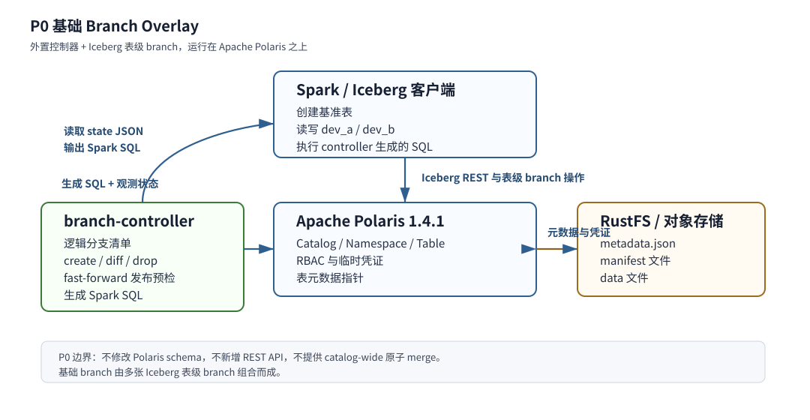

# Polaris Branch Overlay Demo 调研验证与实现设计

> 调研与设计日期：2026-05-19。本文基于 `3. Lakehouse_GitLike_Evolution_Roadmap_And_Design_Options.md` 的演进判断，选择 Apache Polaris 作为主流 Catalog 基线，验证“在非 Git-like Catalog 上补最小 branch 能力”的可行性，并给出可继续二次开发的 demo 设计。

## 1. 方向选择与结论

本轮选择的方向是：**基于 Apache Polaris 1.4.1 做外置 Branch Overlay，复用 Iceberg 表级 branch，验证主流 Catalog 上 basic branch 工作流的可行性**。

基线产品选择 **Apache Polaris**，实现方法选择 **不改 Polaris core 的外置 `branch-controller` + Iceberg 表级 branch 编排**。P0 demo 的重点不是完整 Git-like merge，也不是 Nessie-like commit graph，而是验证：

- 可以在同一个 Polaris catalog 中创建多个 logical branch，例如 `dev_a`、`dev_b`。
- 不同 branch 可以分别访问、分别写入、分别推进。
- main 不受 branch 写入影响。
- branch 发布到 main 时可以做 fast-forward preflight；main 已漂移则拒绝，main 未漂移则生成逐表 fast-forward SQL。

这个方向的价值在于，它能用较低侵入度验证第 3 篇提出的“主流 Catalog 渐进补 Git-like”的路线。如果 P0 workflow 成立，再考虑 P1 sidecar service 或 P2 Polaris 内置 version-store。

## 2. 产品对比与基线选择

| 产品 / 路线 | 是否适合作为本轮基线 | 判断 |
|---|---:|---|
| Apache Polaris | 是 | 代表 Iceberg REST-first 主流 Catalog；已有治理控制面，但缺少 catalog-wide branch，正好验证渐进增强路线。 |
| Project Nessie | 否，作为语义参照 | 已经原生 Git-like，适合作为 branch/commit/merge 语义标尺，不适合作为“改造主流 Catalog”的验证对象。 |
| Unity Catalog OSS | 否 | 多模态资产与 Delta CMT 很有价值，但协议侵入、客户端要求和实现链路更重，不适合 2 人日最小 demo。 |
| Lakekeeper | 可替代但本轮不选 | 同属 Iceberg REST Catalog，安全与 Rust 实现突出；但 Polaris 在 policy、federation、Generic Table 等演进面更适合作为研究对象。 |
| lakeFS | 否 | Git-like 位于对象存储层，适合文件集合版本控制；本轮研究边界是 Catalog 元数据层 branch。 |
| Lance + Polaris Generic Table | 否，作为对比 | 能登记 Lance 表，但不提供提交协调；适合作为后续非 Iceberg 资产兼容方向，不适合 P0 branch publish。 |

选择 Polaris 的关键理由不是它已经有 branch，而是它**缺少 branch 但具备足够多可复用控制面能力**。这能让 demo 清楚地区分：哪些能力是 Polaris 已有的，哪些是 P0 外置增量，哪些必须等到 P2 才能进入 Polaris 内核。

## 3. Polaris 现有能力与复用判断

Polaris 在本轮方案中不是被改造成 Nessie，而是作为真实运行的主流 Iceberg REST Catalog 基线。P0 demo 要回答的问题是：不侵入 Polaris core 时，能否利用 Polaris 已经具备的 Catalog 能力和 Iceberg 表级 branch primitive，构造一个能演示多个 branch 独立访问、独立推进的最小工作流。

Polaris 当前能力可分为三类：第一类直接复用，第二类只作为后续产品化接口预留，第三类不适合作为 P0 branch 机制。

| Polaris / Iceberg 能力 | P0 是否复用 | 判断 |
|---|---:|---|
| Iceberg REST Catalog | 是 | Polaris 继续作为表发现、加载、提交和存储凭证下发入口；branch controller 不绕过 Catalog 直接改对象存储。 |
| Iceberg 表级 branch/tag | 是 | 这是 P0 的核心 primitive。每个 logical branch 映射为一组同名 Iceberg table branch。 |
| Table commit / metadata pointer 原子更新 | 是 | 单表写入仍由 Iceberg/Polaris 保证；P0 不重写表提交协议。 |
| Catalog / Namespace / Table 实体模型 | 是 | 继续使用现有 catalog tree；不新增 Polaris 实体，不迁移 DB schema。 |
| RBAC 与 credential vending | 是，透明沿用 | 仍按 Polaris 原有表权限和临时凭证访问数据；P0 不做 branch-specific ACL。 |
| Policy 框架 | 暂不实现，只预留 | branch protection、retention、required checks 后续可挂接 policy；P0 不改 policy。 |
| Federation | 不复用 | Federation 解决外部 Catalog 接入，不提供同一 Catalog 内的 branch 视图。 |
| Generic Table / Lance | 不复用 | Generic Table 适合登记 Lance/Delta 等非 Iceberg 表，但缺少 commit coordination，不适合 P0 branch publish。 |

这个复用策略的边界很重要：**P0 的 branch 是 Catalog 外部编排出来的 logical branch，不是 Polaris 内置 ref。** 它复用 Iceberg 表级 branch 的隔离能力，用一个 manifest 把多张表的同名 branch 组合成业务上可理解的一条 branch。这样可以低成本验证开发体验和流程价值，同时避免一开始就触碰 Polaris 的核心持久化模型。

P0 是纯增量方案。新增内容仅包括 `Demo/branch_on_polaris/controller`、branch manifest、状态采集约定和 SQL 编排，不修改 Polaris 源码、不修改 Polaris 数据库、不新增 REST API。它适合验证“多个 branch 可以分别访问、分别推进”的基本能力。

P1 是 sidecar 方案。若 P0 工作流成立，可把本地 JSON manifest 移到 sidecar DB，并暴露 `create/list/status/diff/publish/drop` API。P1 仍不要求 Polaris core ref-aware，但可以补审计、幂等、锁和 UI。

P2 才是侵入式 Polaris 内置版本层。它需要新增 `catalog_refs`、`catalog_commits`、`catalog_content_values`、`catalog_commit_ops`、`branch_policies`、`gc_roots` 等结构，并让 `listTables/loadTable/commitTable/rename/drop/loadCredentials/policy` 等路径全部携带 ref 上下文。P2 才能接近 Nessie-like catalog-wide commit graph，本轮不实现。

本轮也明确不选两种捷径：不选 branch-as-catalog，因为它复制 catalog 配置和对象身份，验证的是环境复制而不是零拷贝 branch；不选 namespace-as-branch，因为它污染业务 namespace，且无法覆盖跨 namespace 的一致 branch view。

## 4. P0 Basic Branch Overlay Demo 总体方案

P0 demo 的目标是实现一个最小但完整的 Basic Branch 工作流：在同一个 Polaris catalog 中，为一组 Iceberg 表创建多个 logical branch，例如 `dev_a`、`dev_b`；不同 branch 可以被分别读写和推进；main 不受 branch 写入影响；当某个 branch 需要发布时，可以执行 fast-forward preflight，并在满足条件时生成逐表 fast-forward SQL。

P0 不要求完整 merge，也不承诺跨表原子发布。fast-forward 只作为受控发布动作：如果 main 上某张表自 branch 创建以来已经前进，发布会被拒绝；如果所有表仍停留在 branch 创建时的 base，controller 才生成 fast-forward SQL。

### 4.1 架构图



系统分三层：Polaris 负责现有 Catalog 控制面，Iceberg 表级 branch 负责单表隔离，`branch-controller` 负责把多张表的 branch 组合成 logical branch。这个分层让 demo 能真实跑在 Polaris 上，同时把“Catalog 内置版本层”延后到 P2。

### 4.2 Logical branch 模型

一个 logical branch 是一组表级 branch 的集合。假设 branch 名为 `dev_a`，表集合为 `sales.orders`、`sales.customers`，则 controller 创建如下映射：

```text
logical branch dev_a
  sales.orders    -> Iceberg branch dev_a
  sales.customers -> Iceberg branch dev_a

logical branch dev_b
  sales.orders    -> Iceberg branch dev_b
  sales.customers -> Iceberg branch dev_b
```

`dev_a` 和 `dev_b` 可以分别推进：`dev_a` 可只修改 `orders`，`dev_b` 可同时修改 `orders` 和 `customers`。controller 不要求两个 branch 同步，也不要求所有表每次都变化。manifest 记录每个 branch 创建时的 base 状态，用于后续 diff 和 fast-forward preflight。

### 4.3 运行流程

```text
1. bootstrap
   启动 Polaris quickstart + RustFS，配置 Spark/Iceberg 访问 quickstart_catalog。

2. create base tables
   在 main 上创建 sales.orders 与 sales.customers，写入初始数据。

3. collect base state
   采集每张表 main ref 当前 snapshot_id，并可附带 metadata_location、schema_id 作为诊断字段。

4. create logical branch
   branch-controller create dev_a --tables sales.orders,sales.customers
   branch-controller create dev_b --tables sales.orders,sales.customers

5. branch read/write
   Spark 按 Iceberg branch ref 读写 dev_a 或 dev_b。
   main、dev_a、dev_b 的可见状态应彼此隔离。

6. status / diff
   controller 对比 manifest base 与当前 branch head，展示哪些表变化。

7. publish fast-forward
   controller 重新采集 main 当前状态。
   若 main 仍等于 base，则生成 fast_forward SQL。
   若任一表 main 已漂移，则拒绝发布并报告冲突。

8. drop branch
   删除 logical branch manifest，并生成每张表的 DROP BRANCH SQL。
```

### 4.4 数据与状态流

P0 使用两个外部状态文件。第一个是 branch manifest，由 controller 维护，是 logical branch 的权威记录。第二个是 table state JSON，由 Spark/Iceberg/REST 采集产生，是 controller 做 diff 和 preflight 的输入。

```json
{
  "catalog": "polaris",
  "branches": {
    "dev_a": {
      "created_at": "2026-05-19T00:00:00Z",
      "tables": {
        "sales.orders": {
          "branch_ref": "dev_a",
          "base": {
            "snapshot_id": "1001",
            "metadata_location": "s3://warehouse/sales/orders/metadata/v1.metadata.json",
            "schema_id": "0"
          }
        }
      }
    }
  }
}
```

```json
{
  "tables": {
    "sales.orders": {
      "snapshot_id": "1002",
      "metadata_location": "s3://warehouse/sales/orders/metadata/v2.metadata.json",
      "schema_id": "0"
    }
  }
}
```

状态采集在 P0 中可以先由脚本或人工命令完成。后续 P1 再把采集逻辑封装成 connector，例如通过 Spark SQL metadata table、Iceberg Java API 或 REST load table 返回值自动生成。

### 4.5 Fast-forward 语义

P0 的 fast-forward 是“发布保护”而不是完整 merge。算法如下：

```text
for each table in logical branch:
    base = manifest.branches[branch].tables[table].base
    current_main = collected_main_state.tables[table]

    if current_main.snapshot_id != base.snapshot_id:
        reject publish

if all tables pass:
    emit CALL catalog.system.fast_forward(table, 'main', branch)
```

这个设计确保不会覆盖 main 上已经发生的新提交。真实 Iceberg table branch 写入会更新表 metadata 文件，即使 main ref 没有前进，因此 P0 runtime 的发布保护以 ref 级 snapshot_id 为准；metadata_location 只作为诊断字段。它仍然不是跨表原子操作，因为 fast-forward SQL 是逐表执行的；但它足以验证本轮重点：多个 branch 可以隔离推进，且发布前能检测 main 漂移。

## 5. 二次开发详细设计

本轮二次开发的主体是 `Demo/branch_on_polaris/controller/branch_controller.py`。它是一个外置 CLI，不嵌入 Polaris 服务进程，不修改 Polaris REST handler。后续如果 P0 验证成功，再把同样的模型迁移到 sidecar service。

### 5.1 代码结构

```text
Demo/branch_on_polaris/
  controller/
    README.md
    branch_controller.py
    examples/
      base-state.json
      branch-head-state.json
      drifted-main-state.json
  runtime/
    workflows/run-p0-overlay.ps1
    bin/
    spark/
    tools/
  polaris-src/
```

`branch_controller.py` 的职责拆分如下：

| 模块职责 | 当前/计划实现 |
|---|---|
| Manifest IO | 读取、写入 `branches.json`，维护 catalog 与 branch 记录。 |
| State IO | 读取 table state JSON，校验 `snapshot_id`，并保留 `metadata_location` 等诊断字段。 |
| Branch create | 记录 base 状态，生成每张表的 `CREATE BRANCH` SQL。 |
| Branch status/diff | 对比 base 与 branch head，输出 changed/unchanged/missing。 |
| Fast-forward preflight | 对比 base 与 current main，发现漂移即拒绝发布。 |
| SQL generation | 生成 `CREATE BRANCH`、`fast_forward`、`DROP BRANCH` SQL。 |
| 多 branch 支持 | manifest 的 `branches` map 天然支持多个 branch 并存。 |

### 5.2 CLI 设计

P0 CLI 保留简单命令，避免提前设计服务端 API。

```bash
python Demo/branch_on_polaris/controller/branch_controller.py init \
  --catalog polaris

python Demo/branch_on_polaris/controller/branch_controller.py create dev_a \
  --tables sales.orders,sales.customers \
  --state-file Demo/branch_on_polaris/controller/examples/base-state.json

python Demo/branch_on_polaris/controller/branch_controller.py create dev_b \
  --tables sales.orders,sales.customers \
  --state-file Demo/branch_on_polaris/controller/examples/base-state.json

python Demo/branch_on_polaris/controller/branch_controller.py diff dev_a \
  --state-file Demo/branch_on_polaris/controller/examples/branch-head-state.json

python Demo/branch_on_polaris/controller/branch_controller.py publish-ff dev_a \
  --state-file Demo/branch_on_polaris/controller/examples/base-state.json

python Demo/branch_on_polaris/controller/branch_controller.py drop dev_a
```

`create` 是幂等边界最敏感的命令。默认情况下，如果 branch 已存在则拒绝覆盖；只有显式 `--replace` 才重建 manifest 记录。`publish-ff` 在检测到任何表漂移时返回非零退出码，便于脚本和 CI 识别失败。

### 5.3 Spark SQL 生成约定

创建 branch 时生成：

```sql
ALTER TABLE polaris.sales.orders CREATE BRANCH dev_a;
ALTER TABLE polaris.sales.customers CREATE BRANCH dev_a;
```

发布 branch 时生成：

```sql
CALL polaris.system.fast_forward('sales.orders', 'main', 'dev_a');
CALL polaris.system.fast_forward('sales.customers', 'main', 'dev_a');
```

删除 branch 时生成：

```sql
ALTER TABLE polaris.sales.orders DROP BRANCH dev_a;
ALTER TABLE polaris.sales.customers DROP BRANCH dev_a;
```

实际 Spark 版本和 Iceberg extension 对 SQL 语法可能有细小差异。因此 P0 controller 的 SQL 输出是 demo script 的输入，而不是隐藏在代码内部直接执行。这样做便于在 Spark/Iceberg 版本差异下快速调整。

### 5.4 状态采集设计

P0 原型暂时不绑定具体采集方式，只要求输入标准 JSON。实链路开发时，优先按以下顺序实现：

1. Spark SQL 采集：通过 Iceberg metadata tables 输出 ref 级 `snapshot_id`，并可附带 `metadata_location`、`schema_id` 作为诊断字段。
2. REST 采集：直接调用 Polaris/Iceberg REST load table，读取 metadata location 与 table metadata。
3. Java/Python API 采集：用 Iceberg API 加载表对象，读取 refs、current snapshot 和 metadata file location。

状态采集只读，不修改表。采集结果进入 controller 后，controller 不解析完整 Iceberg metadata JSON，只比较足够稳定的指针字段。这符合 P0 的定位：验证 branch 编排，不实现语义 merge。

### 5.5 多 branch 独立推进验证

P0 必须至少验证两个 branch：`dev_a` 与 `dev_b`。建议 demo 数据流如下：

```text
main:  orders=v1, customers=v1

create dev_a from main
create dev_b from main

dev_a: append orders -> orders=v2a, customers=v1
dev_b: add column customers -> orders=v1, customers=v2b

main remains: orders=v1, customers=v1
```

验证点：

- 读 main 时看不到 `dev_a` / `dev_b` 的变化。
- 读 `dev_a` 时只看到 `dev_a` 的变化。
- 读 `dev_b` 时只看到 `dev_b` 的变化。
- `branch-controller diff dev_a` 和 `diff dev_b` 输出不同的 changed table 集合。
- `publish-ff dev_a` 只在 main 未漂移时生成发布 SQL。

### 5.6 测试与验收

本轮代码侧测试分两层。

第一层是离线 controller 测试，已经可以在没有 Polaris runtime 的情况下执行：

```bash
python -m py_compile Demo/branch_on_polaris/controller/branch_controller.py
python Demo/branch_on_polaris/controller/branch_controller.py --manifest <tmp> init --catalog polaris
python Demo/branch_on_polaris/controller/branch_controller.py --manifest <tmp> create dev_a --tables sales.orders,sales.customers --state-file Demo/branch_on_polaris/controller/examples/base-state.json
python Demo/branch_on_polaris/controller/branch_controller.py --manifest <tmp> diff dev_a --state-file Demo/branch_on_polaris/controller/examples/branch-head-state.json
python Demo/branch_on_polaris/controller/branch_controller.py --manifest <tmp> publish-ff dev_a --state-file Demo/branch_on_polaris/controller/examples/base-state.json
python Demo/branch_on_polaris/controller/branch_controller.py --manifest <tmp> publish-ff dev_a --state-file Demo/branch_on_polaris/controller/examples/drifted-main-state.json
```

第二层是 Polaris 实链路验收：启动 Polaris quickstart + RustFS，用 Spark/Iceberg 创建两张表，采集真实 state JSON，跑通 `dev_a` 与 `dev_b` 的隔离读写、diff、fast-forward preflight 和冲突拒绝。

验收完成的标准是：多个 branch 能并存；每个 branch 能被单独访问和推进；main 不被 branch 写入污染；fast-forward 在 main 漂移时拒绝，在 main 未漂移时生成发布 SQL。

## 6. 环境配置

P0 demo 的强制依赖已具备：

| 项目 | 当前状态 |
|---|---|
| Git | `git version 2.53.0.windows.3` |
| Python | `Python 3.14.4` |
| curl | `curl 8.18.0` |
| JDK | `java version "21.0.11" 2026-04-21 LTS` |
| Docker CLI / daemon | Client `29.4.3`，Server `Docker Desktop 4.73.1` |
| Docker Compose | `Docker Compose version v5.1.3` |
| jq | `jq-1.8.1` |
| 网络 | GitHub、GHCR、Docker Hub Registry、Maven Central、PyPI 均可达 |
| 端口 | `8181`、`8182`、`9000`、`9001` 均未被占用 |
| Docker 容器 | 当前无运行中容器，未发现 demo 端口冲突 |

当前结论：可以直接进入 Polaris quickstart、RustFS 和 Spark/Iceberg 联调。

默认 demo 使用 RustFS，不需要真实 S3。若后续改接真实 S3，再额外准备 bucket 或测试路径、IAM / STS 凭证，以及临时文件与测试表的清理策略。

## 7. 当前 demo 目标、实现与验证结果

### 7.1 当前 demo 的目标

当前 demo 的目标不是实现完整 Git-like Catalog，而是把第 4 章的 P0 Basic Branch Overlay 跑成可复现闭环。它验证四件事：

1. 在同一个 Polaris catalog 中，能为一组 Iceberg 表创建多个 logical branch。
2. logical branch 可以通过同名 Iceberg 表级 branch 实现隔离读写。
3. 外置 controller 能记录 branch 创建时的 base state，并基于真实 Iceberg ref state 做 diff 与 fast-forward preflight。
4. 当 main 已经漂移时，controller 能拒绝发布，避免覆盖 main 上的新提交。

当前 demo 明确不验证完整 merge、不验证跨表原子发布、不验证 branch 级权限、retention、GC reachability，也不把 Polaris 改造成 Nessie-like commit graph。

### 7.2 当前目录与实际实现

当前 demo 已整理到 `Demo/branch_on_polaris`，结构如下：

```text
Demo/branch_on_polaris/
  README.md
  controller/
    branch_controller.py
    README.md
    examples/
      base-state.json
      branch-head-state.json
      drifted-main-state.json
  runtime/
    docker-compose.yml
    workflows/run-p0-overlay.ps1
    bin/
      invoke-spark-sql.ps1
      collect-table-state.ps1
      spark-catalog-config.ps1
      test-runtime-smoke.ps1
    spark/
      01-init-main-tables.sql
      02-check-branches.sql
      03-advance-branches.sql
    tools/
      collect_iceberg_ref_state.py
  polaris-src/
    Apache Polaris 源码快照，已通过 .gitignore 排除，不纳入本仓库版本管理
```

文档架构图仍位于 `Industry/git-like/cjy_src/Polaris_Branch_Overlay_Demo_src/p0_branch_overlay_architecture.svg`，因为它是本文档引用资产，而不是 demo runtime 运行依赖。

`controller/branch_controller.py` 是 P0 的功能代码。它维护本地 logical branch manifest，支持：

| 命令 | 作用 | 输出 / 行为 |
|---|---|---|
| `init` | 初始化 manifest | 写入 catalog 与空 branch map |
| `create` | 记录 logical branch 的表集合和 base state | 生成逐表 `ALTER TABLE ... CREATE BRANCH` SQL |
| `diff` | 对比 branch head 与 base | 输出 changed / unchanged / missing |
| `publish-ff` | 对比 current main 与 base | 未漂移则生成 `CALL ... fast_forward` SQL，漂移则 exit code `2` |
| `drop` | 删除 logical branch 记录 | 生成逐表 `DROP BRANCH` SQL |

`runtime/` 是真实联调环境。它启动 Polaris 1.4.1、RustFS、初始化 catalog 与权限，并通过临时 Spark SQL client 执行 Iceberg SQL。`runtime/tools/collect_iceberg_ref_state.py` 在 Spark 容器内读取 Iceberg metadata tables，例如 `sales.orders.refs`，采集 ref 级 `snapshot_id`，并可附带 `metadata_location`、`schema_id` 作为诊断字段。

### 7.3 当前 P0 闭环流程

端到端命令是：

```powershell
powershell -ExecutionPolicy Bypass -File Demo/branch_on_polaris/runtime/workflows/run-p0-overlay.ps1
```

如果 Polaris/RustFS 已经启动，可使用：

```powershell
powershell -ExecutionPolicy Bypass -File Demo/branch_on_polaris/runtime/workflows/run-p0-overlay.ps1 -SkipComposeUp
```

该 workflow 实际执行如下步骤：

1. 用 `01-init-main-tables.sql` 在 main 上重建 `sales.orders` 与 `sales.customers`。
2. 用 `collect-table-state.ps1` 采集 main ref 的 base snapshot，写入 `runtime/generated/state/main-base.json`。
3. 调用 `branch_controller.py init/create` 创建 `dev_a`、`dev_b` logical branch manifest。
4. 执行 controller 生成的 `create-dev-a.sql` 与 `create-dev-b.sql`，创建 Iceberg 表级 branch。
5. 用 `03-advance-branches.sql` 分别推进 branch：`dev_a` 只修改 `orders`，`dev_b` 只修改 `customers`。
6. 分别采集 `dev_a`、`dev_b`、`main` 的 ref state。
7. 调用 `diff dev_a` 与 `diff dev_b`，验证两个 logical branch 的 changed table 集合不同。
8. 对 `dev_a` 执行 `publish-ff`，main 未漂移时生成并执行 fast-forward SQL。
9. 再用 `dev_a` 发布后的 main state 对 `dev_b` 执行 `publish-ff`，此时因 `orders` main 已漂移而拒绝发布。

### 7.4 已完成与已验证结果

当前已完成：

- `controller/branch_controller.py` 的 CLI 命令与 manifest 模型。
- 真实 Spark/Iceberg ref state 采集器。
- Docker Compose runtime：Polaris、RustFS、catalog 初始化、Spark SQL client。
- 端到端 P0 workflow。
- 文档路径整理：demo runtime 和 controller 归入 `Demo/branch_on_polaris`，文档 SVG 留在 `Industry/git-like/cjy_src`。

当前已验证：

- Python 编译：`branch_controller.py` 与 `collect_iceberg_ref_state.py` 可通过 `python -m py_compile`。
- PowerShell 解析：`run-p0-overlay.ps1`、`invoke-spark-sql.ps1`、`collect-table-state.ps1`、`test-runtime-smoke.ps1`、`spark-catalog-config.ps1` 可被 PowerShell 解析。
- controller 离线验证：可完成 `init/create/publish-ff`，并在 drifted main 样例上以 exit code `2` 拒绝发布。
- runtime 实链路验证：`run-p0-overlay.ps1 -SkipComposeUp` 已跑通。验证结果包括：
  - `dev_a` 与 `dev_b` 能作为 Iceberg 表级 branch 并存。
  - `dev_a` 写入 `orders` 后，main 与 `dev_b` 读不到该变更。
  - `dev_b` 写入 `customers` 后，main 与 `dev_a` 读不到该变更。
  - `diff dev_a` 只显示 `orders` 变化，`diff dev_b` 只显示 `customers` 变化。
  - `publish-ff dev_a` 通过，并执行 `CALL polaris.system.fast_forward(...)`。
  - `publish-ff dev_b` 在 `dev_a` 发布后检测到 main 漂移并拒绝。

当前 runtime 仍有一个非阻塞 warning：Spark/Iceberg 尝试上报 write metrics 到 Polaris 时，root principal 缺少 `REPORT_WRITE_METRICS` 权限。该 warning 不影响 P0 的建表、branch、读写、state 采集、fast-forward 与冲突拒绝验证。

### 7.5 当前实现的边界与现实性判断

当前 demo 沿用 Iceberg 表级 branch。换句话说，`branch_controller.py` 确实是在外部记录“某个 logical branch 管理哪些表，以及这些表在创建 branch 时的 base snapshot”。这对 P0 很直接，因为它只需要验证少量表上的隔离读写和 fast-forward preflight。

但这个模型不适合作为大规模生产最终形态。如果每个 logical branch 都显式记录几乎所有表，问题会很快出现：

- branch 创建成本与 catalog 表数量线性相关。
- manifest 体积会随着 branch 数量和表数量相乘增长。
- 新增表、删除表、rename、namespace 变更都要同步到每个 branch 的 manifest。
- 权限、retention、GC roots、审计和冲突检测都会落到外置状态上，难以成为 Polaris 的权威行为。
- 逐表 fast-forward 无法提供 catalog-wide 原子发布。

因此，P0 的结论不是“外置 manifest 管全表可生产化”，而是“在不改 Polaris core 的前提下，Iceberg 表级 branch 可以被编排成最小 logical branch 工作流”。这为 P1/P2 提供了验证样本，但 P1/P2 不能简单放大 P0 manifest。

## 8. 后续设计

### 8.1 与第 4 章 P0 方案的对照

第 4 章定义的是最小可验证工作流。后续设计需要保留它验证过的语义，但替换不适合规模化的实现方式。

| 第 4 章 P0 能力 | 当前实现 | 后续演进 |
|---|---|---|
| logical branch | 外置 JSON manifest 记录 branch 到表集合的映射 | P1 使用 sidecar DB；P2 内置到 Polaris ref-aware 元数据模型 |
| base state | 每个 branch 记录每张表的 base snapshot | P1 改为 branch root + 增量表变更；P2 改为 catalog commit graph |
| branch read/write | Spark 直接读写 Iceberg 表级 branch | P1 继续复用；P2 让 `loadTable/commitTable` 原生携带 ref context |
| diff | 比较 base 与 branch head snapshot | P1 提供 API 化 diff；P2 支持 catalog-wide diff 与 commit-level diff |
| publish | 逐表 fast-forward SQL | P1 可加锁和发布计划；P2 才能提供 catalog-wide 原子 merge |
| state authority | 外置 manifest | P1 是 sidecar 权威；P2 是 Polaris 权威 |

### 8.2 P1 Sidecar 设计

P1 的目标是把 P0 从脚本原型升级为可服务化的外置控制面，但仍不修改 Polaris core。P1 适合验证产品体验、API 形态、审计和运行稳定性。

P1 建议提供以下 API：

| API | 作用 |
|---|---|
| `POST /branches` | 创建 logical branch |
| `GET /branches` | 列出 branch |
| `GET /branches/{branch}` | 查看 branch metadata 与状态 |
| `POST /branches/{branch}/diff` | 计算 branch 与 base 或 main 的差异 |
| `POST /branches/{branch}/publish-plan` | 生成 fast-forward 发布计划 |
| `POST /branches/{branch}/publish` | 执行受控发布 |
| `DELETE /branches/{branch}` | 删除 logical branch 与可选表级 branch |

P1 不应继续保存“每个 branch 管理所有表”的完整副本。更现实的模型是：

```text
branch
  id
  name
  base_catalog_snapshot
  created_at
  created_by

branch_table_delta
  branch_id
  table_id
  operation: ADD | MODIFY | DROP | RENAME | UNCHANGED_MARKER
  base_snapshot_id
  branch_snapshot_id
  last_observed_at

branch_policy
  branch_id
  retention
  publish_rule
  required_checks
```

读取 branch view 时，sidecar 以 main/catalog baseline 加上 branch delta 生成视图。多数表未变化时不写 delta；只有被修改、删除、rename 或显式加入 branch 工作集的表进入 delta。这样才能避免 “branch 数量 × catalog 表数量” 的状态爆炸。

P1 技术栈建议：

- 服务端优先 Java/Kotlin + Quarkus，原因是 Polaris 本身是 JVM/Quarkus 体系，Iceberg Java API 成熟，后续迁移到 Polaris core 的模型阻力更小。
- 存储优先 PostgreSQL；本地 demo 可使用 SQLite 或 H2，但不要作为生产假设。
- 状态采集优先 Iceberg Java API 或 REST load table；Spark SQL 采集保留为验证工具，不作为服务端关键路径。
- 编排脚本仍可保留 PowerShell/Bash，但只作为 demo harness，不进入核心产品实现。

P1 需要补齐的工程能力：

- 幂等 create/drop/publish。
- branch name 与 table branch name 的映射和转义规则。
- 发布锁，避免同一 branch 或同一表并发 publish。
- 审计记录，包括谁创建 branch、谁发布、发布了哪些表。
- branch 保护规则，例如禁止直接发布到 main、要求检查通过。
- 清理策略，避免孤立 Iceberg table branch 长期堆积。

P1 的边界仍然要清楚：它可以改善产品体验和管理能力，但只要 Polaris core 不理解 ref，`listTables/loadTable/commitTable` 就仍然不是原生 branch-aware。跨表原子 merge 也仍然无法由 P1 严格保证。

### 8.3 P2 Polaris 内置版本层设计

P2 是完整 Git-like Catalog 的方向。它不再把 branch 当作外置 manifest，而是在 Polaris 内部引入 ref-aware 元数据模型。

P2 需要新增或等价表达以下核心结构：

```text
catalog_refs
  ref_id
  catalog_id
  name
  type: BRANCH | TAG
  head_commit_id
  created_at
  updated_at

catalog_commits
  commit_id
  catalog_id
  parent_commit_id
  author
  message
  created_at

catalog_content_values
  commit_id
  content_key
  table_id
  metadata_location
  snapshot_id
  schema_id
  content_status

catalog_commit_ops
  commit_id
  op_type: PUT | DELETE | RENAME
  content_key
  old_value
  new_value

branch_policies
  ref_id
  protection_rule
  retention_rule
  required_checks

gc_roots
  ref_id
  reachable_snapshot_or_metadata
```

P2 的 API 语义需要覆盖：

- `listTables(ref)`：列出某个 ref 上可见的表。
- `loadTable(ref, table)`：按 ref 解析表 metadata pointer。
- `commitTable(ref, table, expected_base, new_metadata)`：在 ref 上做 OCC 提交。
- `rename/drop(ref, table)`：在 ref 上产生 catalog commit。
- `merge(source_ref, target_ref)`：生成并提交 catalog-wide merge commit。
- `diff(left_ref, right_ref)`：按 content key 输出表级差异。
- `loadCredentials(ref, table)`：凭证下发与 ref 上下文保持一致。
- `policy(ref)`：branch protection、retention、required checks 原生化。

P2 技术栈应沿用 Polaris core 的 Java/Quarkus 实现和现有 persistence 扩展方式，不建议继续使用 Python/PowerShell。Python/PowerShell 在当前 demo 中只是验证工具；P2 必须进入 Polaris 的权限、事务、持久化、事件和 REST handler 体系。

### 8.4 P1 到 P2 的迁移策略

P1 到 P2 不应直接迁移脚本，而应迁移语义和数据模型：

1. 保持 P0/P1 已验证的用户语义：create、diff、publish、drop。
2. 把 P1 sidecar DB 中的 branch、delta、policy 映射到 P2 的 refs、commits、content values。
3. 把 P1 的 publish-plan 升级为 P2 merge-plan。
4. 把 P1 的逐表 fast-forward 改为 P2 catalog commit。
5. 把 P1 的外部锁改为 Polaris persistence 层的条件更新或事务。
6. 把 P1 的审计表接入 Polaris event/audit 体系。

迁移时要避免两类设计债：

- 不要把 P1 的“表级 delta 表”直接塞进 Polaris 现有 table entity 行里，否则会污染 Polaris 当前 catalog tree。
- 不要把 branch-as-catalog 或 namespace-as-branch 当作 P2，因为它们复制环境或污染业务 namespace，不能提供真正 catalog-wide branch view。

### 8.5 当前代码与脚本的保留策略

当前 P0 中应长期保留的内容：

- `controller/branch_controller.py`：作为语义原型和回归样例保留。
- `runtime/tools/collect_iceberg_ref_state.py`：作为调试和验证工具保留。
- `runtime/workflows/run-p0-overlay.ps1`：作为本地 smoke workflow 保留。
- `runtime/spark/*.sql`：作为最小演示数据流保留。

当前 P0 中不应延续到生产核心的内容：

- 本地 JSON manifest。
- PowerShell 作为核心服务编排语言。
- Spark SQL 作为服务端状态采集关键路径。
- 每个 branch 显式保存全表集合。

后续如果进入 P1，建议新建 `sidecar/` 模块，以 Java/Kotlin + Quarkus + PostgreSQL 实现服务端；当前 Python controller 只作为 CLI 兼容层或测试 oracle。后续如果进入 P2，建议直接在 `polaris-src/` 对照 Polaris persistence、catalog handler、policy 和 REST API 路径做设计 spike，再决定是否 fork/patch Polaris core。
