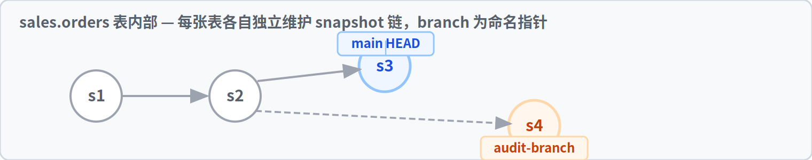
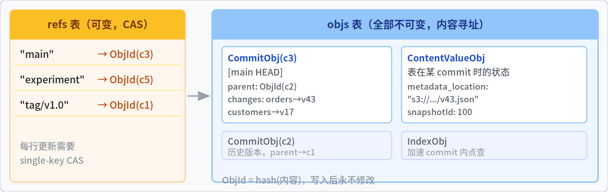
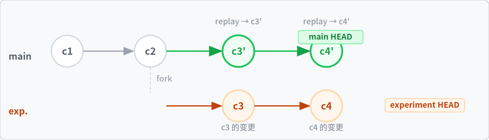
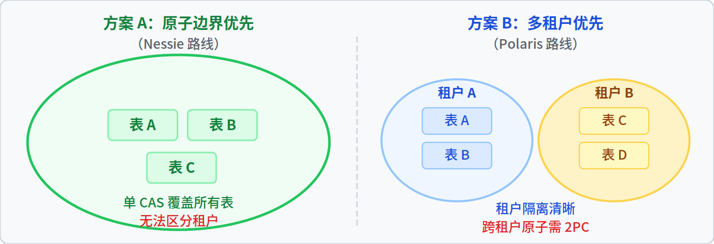

# Catalog 层 Git-like 能力分析报告（v4）

> 面向有 CS/AI 背景但不熟悉 Lakehouse / Catalog 的读者。本报告聚焦四个核心问题，对必需的领域概念做最小程度的解释，不引入与主题无关的产品对比与生态扫描。

---

## 目录

0. [背景概念](#0-背景概念)
1. [Catalog 层 Git-like 能力需求分析](#2-catalog-层-git-like-能力需求分析)
2. [基于 Iceberg 现有能力的 branch 实现路径](#3-基于-iceberg-现有能力的-branch-实现路径)
3. [Nessie 的 branch / merge 实现原理](#4-nessie-的-branch--merge-实现原理)
4. [branch/merge、跨表原子性与多租户的关系](#5-branchmerge跨表原子性与多租户的关系)
5. [结论摘要](#6-结论摘要)

---

## 0. 背景概念

本章仅解释后续各章中高频使用的领域概念。对于更熟悉该领域的读者，可跳过本章直接阅读第 1 章。

**[参考 · 图1：Lakehouse 整体架构关系](src/fig1_architecture.html)**

---

### 0.1 Lakehouse 的数据分层结构

现代 Lakehouse 体系由四层组成，各层职责明确分离：

```
┌─────────────────────────────────────────────┐
│ 计算引擎层：Spark / Trino / Flink            │
│  执行 SQL 查询与 ETL 任务的程序运行环境       │
├─────────────────────────────────────────────┤
│ Catalog 层：Nessie / Polaris / Hive 等       │
│  维护"表名 → 当前有效 metadata 路径"的映射   │
├─────────────────────────────────────────────┤
│ 表格式层：Apache Iceberg                     │
│  定义 Parquet 文件如何组织成可查询的表        │
├─────────────────────────────────────────────┤
│ 对象存储层：S3 / GCS / ADLS                  │
│  存放所有 Parquet 文件与 metadata 文件        │
└─────────────────────────────────────────────┘
```

各层之间的调用关系：引擎向 Catalog 询问"该表当前的 metadata 文件在哪"，得到路径后直接访问对象存储读写数据；引擎写完新数据后，通知 Catalog 原子地更新路径指针。

---

### 0.2 核心术语

**对象存储（S3 / GCS / ADLS）**：云上的 KV 文件系统。只支持写入新文件、读取文件、删除文件，不支持原地修改。每次"修改"等价于写一个新文件，旧文件保留。这种性质被称为不可变（immutable）。

**Parquet 文件**：列式存储格式，是对象存储中实际承载数据的文件。一张表对应若干个 Parquet 文件，文件一旦写入不可更改。

**Apache Iceberg（表格式）**：定义"一组 Parquet 文件如何组织成一张可被 SQL 查询的表"的规范。其核心数据结构是一棵不可变的元数据树：

```
metadata.json (v3)   ← Catalog 当前指向此版本
   └── manifest list
        └── manifest file
             └── data files (.parquet)

metadata.json (v2)   ← 历史版本，保留供 time travel 使用
metadata.json (v1)   ← 历史版本
```

每次执行 INSERT / UPDATE / DELETE，Iceberg 生成一个新的 `metadata.json`，旧版本永不修改。每个 `metadata.json` 描述的表状态称为一个 **snapshot**。

**Catalog（目录服务）**：`metadata.json` 文件名中含版本号与 UUID，单从对象存储无法判断哪个版本当前有效。Catalog 是一个外部服务，唯一职责是维护如下映射并保证更新的原子性：

```
sales.orders   →  s3://warehouse/sales/orders/metadata/v43-abc.json
sales.customers →  s3://warehouse/sales/customers/metadata/v17-xyz.json
```

每次写表，引擎执行两个步骤：（1）将新 `metadata.json` 写入对象存储；（2）向 Catalog 请求将映射从旧路径原子替换为新路径（compare-and-swap，CAS）。该"CAS 翻指针"操作是 Iceberg ACID 保证的基础。

**compare-and-swap（CAS）**：一种条件更新操作，语义为"若当前值等于期望值，则替换为新值；否则拒绝"。单 key 的 CAS 在任何 KV 存储中天然是原子的，无需锁或多行事务。

**Iceberg REST Catalog（IRC）spec**：Catalog 的标准 HTTP API 规范，工业事实标准。任何支持 IRC 的引擎可接入任何兼容的 Catalog 实现。

**WAP（Write-Audit-Publish）**：一种数据发布模式。先将数据写入对用户不可见的隔离区域，执行数据质量校验，通过后原子切换为正式版本；校验失败则丢弃，正式数据完全不受影响。这是贯穿本报告的核心应用场景。

---

### 0.3 相关角色说明

**ETL（Extract-Transform-Load）**：数据处理流水线程序，由数据工程师编写，在 Spark / Flink 上运行。从源系统抽取数据，经清洗转换后写入目标表。在 Nessie 场景中，ETL 程序就是向某个 branch 提交数据变更的写端。

**DBA（数据库管理员）**：负责监控数据平台健康状态、处理事故（如误删表后回滚）以及管理权限。在 Lakehouse 语境下，DBA 通过 SQL 工具操控 Spark / Trino，通过 Nessie CLI 查看 commit log 并执行 revert。

---

## 1. Catalog 层 Git-like 能力需求分析

本章分析 Git 的哪些能力在 Catalog 层有对应需求，哪些不需要，以及各能力之间的优先级关系。

---

### 1.1 Git 命令向 Catalog 层的映射

下表将 Git 常用命令逐一对照 Catalog 层的等价语义，并按必要性分级：

| Git 概念 | 在 Catalog 层的对应 | 优先级 |
|---|---|---|
| `commit`（原子保存一组变更）| 单次提交可变更多张表，全部可见或全部不可见 | 最小必要 |
| `branch`（建独立工作线）| 在 main 之外建隔离视图，写入对生产用户不可见 | 最小必要 |
| `merge`（并回主线）| 将隔离视图的变更原子暴露给生产用户 | 最小必要 |
| `log` / `history`（查变更历史）| commit log，用于审计与事故定位 | 必要 |
| `diff`（对比两版本差异）| 查看两个 ref 之间哪些表有变更（表名级别） | 必要 |
| `revert` / `reset`（回退历史版本）| 事故回滚至某个 commit | 必要 |
| `tag`（打不可变名字）| 为数据快照打永久标签（如季度报表） | 有用，可后置 |
| `cherry-pick` / `transplant`（移植单个 commit）| 选择性将某个 commit 复制到另一 branch | 有用，低频 |
| `rebase`（重写历史）| 不适用——数据历史不应被重写 | 不实现 |
| `stash`（临时存档）| 不适用——数据不在客户端 | 不实现 |
| 三方文本 merge | 行级数据 merge | 不在 Catalog 层实现（见 2.3 节） |

---

### 1.2 三类驱动场景说明

以下三个场景说明为何 commit / branch / merge 同时为必要能力，而非仅有 branch 就够。

**场景一：WAP（Write-Audit-Publish）**

完整的 WAP 流程需要以下能力按序执行：

```
步骤 1  从 main 创建隔离 branch qa     → 需要：branch（零复制成本）
步骤 2  ETL 向 qa 上的多张表写入数据   → 需要：写入对 main 用户不可见
步骤 3  执行数据质量校验
步骤 4a 校验通过 → qa 状态原子切换至 main  → 需要：merge，且必须是原子的
步骤 4b 校验失败 → 丢弃 qa             → 需要：branch 删除零成本，main 不受影响
```

若没有 merge，branch 中的数据无法安全发布到 main，分支成为死分支。Iceberg 表级的 `fast_forward` 存储过程提供了 merge 的退化形式（单表 fast-forward），是单表 WAP 的基础。

**场景二：多表一致性发布**

数据仓中事实表与维度表需要同时切换到新版本。例：商品维度表的分类标准从 v1 升至 v2，下游多张销售明细事实表均引用该分类。若无法原子切换，将出现"事实表已使用 v2 分类，维度表仍显示 v1"的不一致状态，下游报表 JOIN 结果出错。

这要求 commit 能在单次原子操作内同时变更多张表，而 Iceberg 的单表 CAS 无法保证跨表原子性。

**场景三：审计与回滚**

一次 ETL 误操作删除了生产表 `orders` 中的数据。处置需要：（1）通过 log 找到责任人、时间点、受影响表；（2）通过 log + diff 定位事故 commit；（3）通过 revert 将 main 回退至事故前的 commit。三项能力缺一不可。

---

### 1.3 Catalog 层 merge 与 Git 文本 merge 的本质差异

Git 的三方 merge 可以自动合并文本内容——A 修改了文件第 10 行、B 修改了第 50 行，Git 能自动合成两份修改。这种能力不应在 Catalog 层实现，原因有二：

第一，Catalog 层只能感知"哪张表的 metadata 指针变了"，无法看到"表内哪行数据变了"。承担 PB 级 Parquet 文件的行级 diff/merge 是计算密集型操作，属于计算引擎（Spark / Trino）的职责。

第二，数据冲突的解决是业务规则。两个 branch 分别对同一行赋予不同值，应取哪个由业务逻辑决定，不是技术层可以自动完成的。

因此，Catalog 层的 merge 必须限定为 **metadata key（表名）级别的冲突检测**：两个 branch 均修改了同一张表的 metadata 指针，则报冲突让用户决定；修改了不同的表，则全部并入。行级冲突由引擎或上层应用处理。

---

### 1.4 最小必要能力清单

综合以上三个场景，Catalog 层 Git-like 的最小必要集合为：

| 能力 | 说明 | 分级 |
|---|---|---|
| catalog-wide commit | 单次提交可原子变更多张表 | 最小必要 |
| branch | 创建/删除零成本，不复制数据 | 最小必要 |
| 隔离 | branch 上的写入对其他 branch 完全不可见 | 最小必要 |
| merge（fast-forward） | 将 branch 状态原子推进至目标 branch | 最小必要 |
| merge（含冲突检测，表名级） | 检测两 branch 均修改了同一张表时报冲突 | 最小必要 |
| commit log / diff / revert | 历史查看、差异比较、版本回退 | 必要 |
| tag | 为某个 commit 打不可变名字 | 有用，可后置 |
| cherry-pick / transplant | 跨 branch 移植单个 commit | 有用，低频 |
| 行级自动 merge | 数据级三方合并 | 不在 Catalog 层实现 |

**对自研 Catalog 的含义**：规划版本控制功能时，可优先实现"最小必要"的六项，tag 与 cherry-pick 可在第二阶段按需追加。行级自动 merge 不应进入 Catalog 层的需求范围。

---

## 2. 基于 Iceberg 现有能力的 branch 实现路径

本章分析在不引入 Nessie 的前提下，利用 Iceberg 1.2+ 原生表级 branch 及标准 IRC，能在 Catalog 层实现多大范围的 Git-like 能力，以及其边界在哪里。

**[参考 · 图2：不可变对象、可变指针与指针翻转](src/fig2_immutable_pointer.html)**（步骤 ① ② ③）

---

### 2.1 Iceberg 单表 branch 的现有能力

Iceberg 1.2 起在单张表内引入了 branch 和 tag——它们是表内 snapshot 链上的命名指针：




使用方式：

```sql
-- 在 audit-branch 上写入数据（WAP 写步骤）
SET spark.wap.branch = audit-branch;
INSERT INTO prod.sales.orders VALUES (...);

-- 校验通过后，将 main 推进到 audit-branch 的 HEAD
CALL catalog.system.fast_forward('prod.sales.orders', 'main', 'audit-branch');
```

Iceberg 在每张表内部实现了一套微型 Git，但**每张表的 branch 命名空间彼此独立**，多张表之间没有共享的版本树。

---

### 2.2 单表 branch 的能力边界

**可覆盖的场景**：单表 WAP、单表 time travel、单表回滚。若业务的全部版本化需求均在单张表内，则 Iceberg 原生能力已满足，无需额外的 Catalog 增强。

**无法覆盖的场景**：

- **跨表一致性**：两张表各自在表内建了名为 `v2_release` 的 branch，但两者不属于同一版本树——它们的 HEAD 是独立的 snapshot 指针，无法保证同时切换到 main。
- **catalog-wide 一致视图**：在某个逻辑 branch 上同时读 `sales.orders` 和 `sales.customers`，二者看到的不是同一时刻的快照。
- **catalog-wide commit log**：哪些表在同一次 commit 里被一同修改的信息，在 Iceberg 单表 branch 模型中根本不存在。

根本原因：Iceberg 将 branch 概念定义在"单表 metadata.json 内部的 snapshot refs map"中，没有跨表的 commit 对象。

---

### 2.3 在 Catalog 层拼装 catalog-wide branch 的两种思路

**思路 A：Catalog 层维护 branch 映射表**

让 Catalog 在现有 RDBMS 中新增一张映射表：

```
catalog_branch_pointer
 (catalog_branch_name,  table_name)  →  iceberg_table_branch_name

示例：
 ("qa",  "sales.orders")    →  "orders_iceberg_branch_qa"
 ("qa",  "sales.customers") →  "customers_iceberg_branch_qa"
```

引擎请求 `loadTable("sales.orders", branch="qa")` 时，Catalog 路由到对应的 Iceberg 表级 branch。

思路 A 的能力上限：可为用户提供"catalog 有统一 branch 名"的体验，单表 WAP 可用统一名称管理。

思路 A 无法解决的问题：

- **跨表原子性**：将 branch `qa` merge 进 main，须对每张表各调一次 `fast_forward`。这是一连串独立的单表 CAS，第 5 张表失败时前 4 张已提交，无法回滚。要使多次表级 CAS 表现为原子，唯一出路是引入**两阶段提交（2PC）**——Catalog 作为协调者，依次向所有表发送 prepare，全部成功后再统一 commit，任何失败则 abort 所有。2PC 引入了协调者故障、参与者超时、网络分区等一系列工程复杂度，远超表面看到的"多调几次 fast_forward"。
- **catalog-wide commit log**：每张表的 snapshot 链各自独立，"Catalog 层的 commit"不是真实存在的对象，无法表达"这五张表是同一次提交的结果"。
- **diff / revert**：`diff(refA, refB)` 须扫描所有表；revert 须对每张表各执行一次 rollback，一致性仍依赖 2PC。

**思路 B：Catalog 自建版本指针层**

让 Catalog 自己维护一套 commit 链结构：

```
catalog_commit 表
 commit_id   parent_commit_id   timestamp
 c1          c0                 2026-04-01 10:00

catalog_commit_entries 表
 commit_id   table_name         metadata_location
 c1          sales.orders       s3://.../v43.json
 c1          sales.customers    s3://.../v17.json
```

branch 指针指向某个 `commit_id`；merge 将源 branch 的 commit 链 replay 到目标 branch；OCC 校验在 replay 时检测同一张表是否已被并行修改。

这正是 Nessie 的设计。**只要认真实现 catalog-wide branch + 多表原子 commit，最终必然得到一套"维护不可变 commit 对象 + 可变 branch 指针 + OCC 校验"的版本引擎**——这是系统结构决定的，而非产品偏好。

---

### 2.4 两种思路的工程边界对比

| 维度 | 思路 A（基于 Iceberg 单表 branch） | 思路 B（自建版本引擎，即 Nessie 路线） |
|---|---|---|
| 是否需要修改 IRC 协议 | 仅扩展 branch 参数 | 必须扩展（IRC 无 commit / branch 概念）|
| 跨表原子性 | 需引入 2PC | 内置 |
| catalog-wide commit log | 不存在，须另建 | 内置 |
| 存储模型变化 | 在现有 RDBMS 中增加映射表 | 需新增 commit 链 + refs 表 |
| WAP（单表） | 支持 | 支持 |
| WAP（多表，跨管道原子发布） | 不支持（除非引入 2PC） | 支持 |
| 工程复杂度 | 低至中 | 高 |
| 主要故障模式 | 2PC 协调者故障 | OCC 重试耗尽 |

**对自研 Catalog 的含义**：若当前仍在标准 IRC 路线上，思路 A 是合理的阶段性起点，实现成本低、标准兼容好，可覆盖大多数单表 WAP 场景。只有当"多表跨管道原子发布"被确认为核心需求时，才有必要迁移至思路 B（即 Nessie 路线的版本引擎）。这次迁移不是在现有 RDBMS schema 上增加几列，而是引入独立的 commit 链存储和 OCC 校验层，属于一次架构跃迁。

---

## 3. Nessie 的 branch / merge 实现原理

Nessie 是将上一章"思路 B"付诸实践的项目。本章按"设计原理 → 数据结构 → 写入链路 → 各操作实现 → 具体案例"的顺序展开。

**[参考 · 图2：不可变对象、可变指针与指针翻转](src/fig2_immutable_pointer.html)**（步骤 ④ ⑤）  
**[参考 · 图3：Nessie Git-like 操作清单](src/fig3_operations.html)**  
**[参考 · 图4：并发 Commit 冲突时间线](src/fig4_concurrent_commit.html)**  
**[参考 · 图5：Merge Replay 与 WAP 流程](src/fig5_merge_wap.html)**

---

### 3.1 设计原理：将所有写入分解为幂等 KV 写 + 单次 CAS

Nessie 的核心设计可用一句话概括：**将 Catalog 的所有写入分解为大量幂等 KV 写，加上最后一次 single-key CAS**。

分解的动机：分布式 KV 存储（DynamoDB、Bigtable、Cassandra）能提供的最强一致性原语是 single-key CAS，它们不支持跨 key 的 ACID 事务。若 Catalog 设计要求多行事务，后端必须是 PostgreSQL 类关系数据库，扩展性受限。Nessie 通过将"需要原子性的操作"压缩到一次 CAS，使任何支持 conditional put 的 KV 存储均可作为后端。

实现该目标需要两个技术要点：

**内容寻址（Content-Addressable Storage）**：每个不可变对象的 ID 由对象内容的哈希推导。相同内容必然得到相同 ID，因此向同一 key 重复写入无任何副作用——**写入幂等**。

**不可变对象图 + 可变指针**：所有历史数据（commit 节点、表的 metadata 位置、索引）均为不可变对象，写入后不再修改。唯一可变的是 branch / tag 指针。变更 branch HEAD = 对指针执行一次 single-key CAS。

这与 Git 的对象模型是同构的：Git 的 blob / tree / commit 全部为内容寻址不可变对象，HEAD / refs/heads/main 为可变指针。Nessie 将该模型应用于表 metadata 层，与 Git 不共享实现代码，但底层原语相同。

---

### 3.2 数据结构：两张逻辑表

Nessie 的后端在逻辑上只需要两张表（在 PostgreSQL / DynamoDB / RocksDB 中的物化方式各有不同，但语义相同）：




**refs 表**：存储 branch / tag 名字到 CommitObj ID 的映射。每个 branch 是其中一行；更新该行须通过 single-key CAS。

**objs 表**：存储所有不可变对象，对象 ID 由内容哈希推导。包含三类核心对象：

- **CommitObj**：一个 commit 节点。包含父 commit ID（沿 parent 指针可追溯任意深度的历史）、本次变更集（哪些表的 metadata 指针变更为何值）、提交者与时间戳。
- **ContentValueObj**：记录一张表在某个 commit 时刻的状态——主要是 Iceberg `metadata.json` 的 S3 路径，以及 snapshotId / schemaId 等关键 ID。
- **IndexObj**：加速"在 commit X 上查表 Y 当前状态"的索引对象，避免每次都从根 commit 沿链扫描。

需要特别注意：**Nessie 不存储 Iceberg 的数据文件，也不存储 metadata.json 的内容本身**，只存储"指向 metadata.json 的路径"。metadata.json 及 Parquet 文件均在 S3 上，由 Iceberg 库负责读写。Nessie 是一个版本化的"指针目录"。

---

### 3.3 写入链路：单次 commit 的完整流程

```python
def commit(branch_name, operations, expected_branch_head):
    for attempt in range(commit_retries):

        # 步骤 1：读当前 branch HEAD
        current_head_id = refs[branch_name]
        if current_head_id != expected_branch_head:
            raise BranchHeadChanged      # 客户端基于的状态已过期

        # 步骤 2：OCC 校验（乐观并发控制）
        for op in operations:
            current_state = lookup_at_commit(current_head_id, op.table)
            if op.expected_content != current_state:
                raise NessieConflictException  # 该表已被并行写入
            # expected_content 包含 snapshotId / schemaId / partitionSpecId / sortOrderId

        # 步骤 3：写不可变对象（幂等）
        new_content_objs = [build_content_obj(op) for op in operations]
        new_commit_obj   = build_commit_obj(parent=current_head_id, changes=operations)
        for obj in new_content_objs + [new_commit_obj]:
            objs.put(obj.id, obj)        # 相同内容相同 ID，重复写无副作用

        # 步骤 4：唯一的原子操作——single-key CAS 翻转 branch 指针
        ok = refs.compare_and_swap(
            key      = branch_name,
            expected = current_head_id,
            new      = new_commit_obj.id,
        )
        if ok:
            return new_commit_obj.id     # 提交成功
        else:
            sleep(backoff(attempt))
            continue                     # CAS 失败，指数退避后重试

    raise CommitTimeoutException
```

三个关键性质：

- **步骤 3 的所有重 IO 在 CAS 之前完成，且幂等**。CAS 失败时无需回滚——已写入的对象无任何 ref 指向，成为孤儿对象，由后台 GC 定期清理。
- **步骤 4 是系统中唯一需要原子性的操作**。这正是 DynamoDB / Bigtable / Cassandra 等无事务 KV 均可作为后端的原因——它们均支持 conditional put（CAS）。
- **步骤 2 的 OCC 校验**：客户端提交时须提供"基于的旧状态"（expected_content），服务端比对当前状态是否一致，不一致则拒绝。OCC（Optimistic Concurrency Control，乐观并发控制）相比悲观锁（写前加锁）在多分支并发场景下吞吐更高，冲突由重试而非阻塞处理。

---

### 3.4 branch 创建与删除

```python
def create_branch(new_name, source_ref):
    source_head_id = refs[source_ref]
    refs.put(new_name, source_head_id)   # refs 表新增一行
    # 不复制任何 CommitObj 或 ContentValueObj

def delete_branch(name):
    del refs[name]                       # refs 表删除一行
    # 相关孤儿对象由后台 GC 清理
```

创建 branch 时，新 branch 与源 branch 指向同一个 CommitObj，两者共享全部历史。"branch"在 Nessie 中只是 refs 表里的一行，持有一个 ObjId。这是"branch 零成本"的实现基础：无论仓库中存有多少张表，创建分支的开销仅为 refs 表的一次写操作。

---

### 3.5 merge：replay 模式与冲突检测

Nessie 的 merge 采用 **replay 模式**：将源 branch 上从分叉点（fork point）之后的 commit 序列，按时间顺序在目标 branch 上逐一重放。每次 replay 均经历完整的 OCC 校验。




replay 过程中，对每个 commit 所涉及的每个 ContentKey（表名）执行 OCC 校验：当前目标 branch 上这张表的状态，是否与源 branch 分叉时一致？若一致则 replay 成功；若目标 branch 在分叉后有并行写入，则产生**冲突**，由用户决定如何处理。

与 Git 的差异：Git merge 产生一个双亲 merge commit，保留"历史在此汇合"的拓扑信息。Nessie 的所有 commit 均为单 parent——replay 产生的 c3'、c4' 在 main 上表现为普通线性 commit。这使 commit 链查询始终为单链遍历，索引结构简单，代价是丢失了历史汇合的拓扑信息。

---

### 3.6 Nessie 实现的全部 Git-like 操作

**[参考 · 图3：Nessie Git-like 操作清单](src/fig3_operations.html)**（点击各操作卡片查看实现伪代码与关键性质）

以下表格汇总各操作与其底层实现的对应关系：

| 操作 | 底层实现 |
|---|---|
| commit | CommitObj 包含多张表的变更集 → 单次 CAS 翻转 refs 指针 |
| branch 创建 | refs 表新增一行，指向同一 CommitObj |
| branch 删除 | refs 表删除一行；孤儿对象由 GC 清理 |
| merge（fast-forward）| refs.cas(target, expected=old_head, new=source_head) |
| merge（含冲突检测）| replay 时对每个 commit 执行 OCC 校验 |
| commit log | 沿 CommitObj.parent 字段单链遍历 |
| diff(refA, refB) | 比较两个 ref 指向 commit 的 StoreIndex |
| revert（硬重置）| refs.cas(branch, expected=current, new=旧 commit_id) |
| revert（软 revert）| commit 一次逆操作，历史链保留 |
| tag | refs 表新增一行，标记为不可变（后续 CAS 被拒绝）|
| transplant | 从任意 ref 挑选 commit，replay 到目标 branch |

---

### 3.7 并发冲突案例：两个 writer 同时向同一 branch 提交

**[参考 · 图4：并发 Commit 冲突时间线](src/fig4_concurrent_commit.html)**（分步动画演示）

**初始状态**：
- branch `main` HEAD = c0
- `sales.orders` 的 metadata 指针 = `s3://.../v10.json`，Iceberg snapshotId = 100

**两个并发 writer**：
- Writer A：修改 `sales.orders`（v11，snapshotId=101）+ `sales.customers`（v5）
- Writer B：修改 `sales.orders`（v12，snapshotId=102），独立写入，不知道 A 的存在

**时间线**：

```
t=0  refs: main → c0

t=1  A 读 main → c0
     A 向 S3 写 v11.json、v5.json
     A 写 objs:  CommitObj(commit_A)、ContentValueObj(orders→v11)、ContentValueObj(customers→v5)

t=2  B 读 main → c0（A 的 CAS 尚未完成，B 读到旧值）
     B 向 S3 写 v12.json
     B 写 objs:  CommitObj(commit_B)、ContentValueObj(orders→v12)

t=3  A 发起 CAS: refs.cas("main", expected=c0, new=commit_A)  → 成功
     refs: main → commit_A

t=4  B 发起 CAS: refs.cas("main", expected=c0, new=commit_B)  → 失败
     （main 现为 commit_A，不等于期望值 c0）
     B 进入重试

t=5  B 重试：读 main → commit_A
     查 orders 当前状态 → snapshotId=101（A 已写入）
     B 的 expected_content={snapshotId=100}，与当前不符
     → OCC 校验失败，抛 NessieConflictException
```

**最终状态**：main 指向 commit_A；orders 指向 v11.json；commit_B 与 v12.json 成为孤儿对象，等待 GC。

**三个关键观察**：

1. A 和 B 向 objs 写入的操作完全不互斥，可真正并发执行——竞争点仅在步骤 4 的 CAS。
2. 冲突检测分为两层：CAS 层（branch HEAD 是否仍为 c0）与 OCC 层（snapshotId 是否仍为 100），两层校验共同保障数据正确性。
3. 若 A 和 B 修改的是不同的表（无 ContentKey 重叠），则 B 重试时 OCC 校验全部通过，B 成功提交，两次提交被序列化为"先 A 后 B"。这是多 branch 并发写入时 Nessie 高吞吐目标的成立基础。

**对自研 Catalog 的含义**：Nessie 的这套原语（两张逻辑表 + 幂等写 + 单 CAS）可直接作为自研版本引擎的参考原型。ObjId 哈希算法可换用 BLAKE3 / SHA-256，后端可换用 PostgreSQL / DynamoDB，核心逻辑不变。移植难度最高的部分是 OCC 校验中的 `expectedContent` 字段——它与 Iceberg 的 snapshotId / schemaId 紧耦合，支持其他表格式时须为每种格式重新设计等价的 on-reference-state 校验模型。

---

## 4. branch/merge、跨表原子性与多租户的关系

本章回答 branch/merge 这一能力需求，与跨表原子性、多租户两个架构目标之间的结构关系，以及 Nessie 在三者之间做出取舍的技术原因。

---

### 4.1 三个概念的定义

**branch / merge**：在同一版本树上维护多条并行历史，通过 merge 将某条历史并入另一条。所需原语：不可变 commit + 可变 branch 指针 + CAS。

**跨表原子性**：多张表的元数据变更要么全部生效、要么全部不生效，对外不会观察到中间状态。所需原语：单次原子操作能同时变更多个（table → metadata）映射。

**多租户**：在同一个 Catalog 服务实例中，不同租户（组织、团队、项目）拥有彼此隔离的命名空间，互相不可见、不干扰。所需机制：租户作为一级抽象贯穿数据结构与接口设计。

---

### 4.2 三者之间的结构关系

**branch/merge 与跨表原子性：强关联，实现上是同一件事的两面。**

要使 branch 上的多表变更在 merge 时原子可见，merge 操作本身就必须是"将多张表的指针一次切换到位"——这正是跨表原子性。Nessie 的 commit 同时包含多张表的变更，CAS 一次完成翻转，branch+merge 能力与跨表原子性在实现层面不可分割。

**多租户与跨表原子性：在 single-CAS 原语下本质冲突。**

跨表原子性要求所有参与提交的表共享一个原子边界（一个大圆圈圈住所有表）。多租户要求不同租户之间的数据严格隔离（多个不相交的小圆圈）。




两者叠加会产生矛盾：若原子边界 = 整个 catalog（大圆圈），则所有租户共享同一版本树和 CAS 序列，隔离破裂；若原子边界 = 每租户各自（多个小圆圈），则跨租户的多表原子提交须引入分布式事务（2PC / Saga）来协调多个 catalog 实例。

**这是一个由 single-CAS 原语决定的结构性约束**：原子边界宽度与隔离边界数量在单 CAS 模型下成反比，无法同时极致。

**branch/merge 与多租户：弱关联，可以共存。**

若接受"每个租户内部各自有 branch/merge"，两者不冲突——每个租户拥有独立的版本树，版本树内部具备完整的 branch / merge / 多表原子性。Polaris / Lakekeeper 的模型即是如此：每个 Catalog（或 Project）是一个租户单位，内部支持 IRC 的 `commitTransaction`（单次引擎会话内的多表原子），但跨租户的多表原子提交不存在。

---

### 4.3 Nessie 的取舍：放弃多租户，换取最大原子边界

Nessie 的选择是**单 repository**——整个服务实例内只有一棵 commit 树、一组 refs 指针，所有表共享同一原子边界。技术原因可分三层：

**第一层：核心场景驱动**。Nessie 被定位为单一组织内部的 DataOps catalog，服务组织内的数据管道。该场景下多租户隔离几乎不是真实需求；多表一致性发布才是。若引入多租户必须放弃跨表原子性，则对核心用户是净负收益。

**第二层：保留 single-key CAS 的架构简洁性**。Nessie 整个系统的后端兼容性红利来自"唯一原子操作是单 key CAS"——这使 DynamoDB / Cassandra / Bigtable 等无事务 KV 均可作为后端，commit 路径上无任何加锁或分布式协调开销。引入跨租户原子必然引入 2PC，该红利全部消失——Nessie 将退化为依赖关系数据库 + 多行事务的普通 RDBMS catalog，整个架构基础需重建。

**第三层：多租户有运维层面的替代方案，跨表原子没有**。多租户需求可通过"为每个租户部署独立的 Nessie server + 数据库"来满足——运营成本上升，但功能可用，且每个租户内部仍具备完整的 catalog-wide 原子和 branch/merge 能力。反之，若选择多租户优先的架构，跨表原子性无法在事后补充（须改协议、改存储模型、引入 2PC）。

---

### 4.4 主流 Catalog 的相反取舍

| 系统 | 多租户模型 | 跨表原子的边界 |
|---|---|---|
| Nessie | 无（单 repository）| catalog-wide，覆盖所有表 |
| Polaris | 有（Catalog 为租户单位）| 单次引擎会话内（IRC `commitTransaction`）|
| Lakekeeper | 有（Project 为租户单位）| 同 Polaris |
| Unity Catalog | 有（三级层次：Metastore/Catalog/Schema）| 同 Polaris |

IRC spec 的 `commitTransaction` 端点允许引擎在单次 HTTP 请求内原子提交对多张表的修改，服务端用 RDBMS 多行事务保障原子性。但其原子边界仅限于"这一次 HTTP 请求"，无法覆盖"两个独立的 ETL 管道在不同时刻分别修改了部分表，要求它们对下游统一可见"——后者需要 catalog-wide branch + merge。主流 Catalog 接受了"原子性只在单次会话内"的弱化，以换取多租户和 IRC 标准兼容性。

---

### 4.5 对自研 Catalog 的含义

若自研 Catalog 同时需要多租户 SaaS 和 catalog-wide 多表原子发布，需明确认识到**在 single-CAS 原语下两者不可同时极致**，只有两个方向的折中：

- **降级原子性**：每租户内实现 catalog-wide 原子，跨租户不保证原子。这是 Polaris 的路线。
- **降级隔离粒度**：将"租户"概念定义为 namespace 级而非 Catalog 级，在同一版本树中通过 RBAC 实现软隔离。可保留 Nessie 的多表原子能力，但租户之间在 commit 序列号和并发瓶颈上仍共享，该折中 Nessie 本身也未实现，须自研。

不存在同时实现两个极致目标的第三条路。该决策应在详细设计开始之前确认，选择方向后续所有存储设计、API 设计和一致性模型均以此为前提。

---

## 5. 结论摘要

| 章节 | 核心结论 |
|---|---|
| 第 1 章：能力需求 | 最小必要集：catalog-wide commit + 零成本 branch + 隔离 + merge（含表名级冲突检测）+ commit log / diff / revert。仅有 branch 不足以完成 WAP，merge 是必要能力。行级数据 merge 不应在 Catalog 层实现。|
| 第 2 章：Iceberg 路径 | 单表 WAP 可用 Iceberg 原生 branch + fast_forward 实现，无需 Catalog 增强。catalog-wide 多表原子 branch/merge 无法基于 Iceberg 单表 branch 直接构建：思路 A 需引入 2PC，思路 B 的推演终点即为 Nessie。|
| 第 3 章：Nessie 实现 | 两张逻辑表（refs 可变 + objs 不可变内容寻址），commit 流程为"大量幂等 KV 写 + 唯一一次 single-key CAS"，merge 为 replay + ContentKey 级 OCC 冲突检测。所有 Git-like 操作均为上述原语的组合应用。|
| 第 4 章：三者关系 | branch/merge 与跨表原子性强关联，实现上不可分离。多租户与跨表原子性在 single-CAS 原语下本质冲突。Nessie 以放弃多租户换取最大原子边界，是核心场景驱动的合理取舍，主流 Catalog 选择了相反方向。|

---

## 参考资料

### Iceberg 表格式与 Catalog

- Iceberg 官方规范（含 metadata.json 原子 swap 机制）：https://iceberg.apache.org/spec/
- Iceberg REST Catalog Spec：https://iceberg.apache.org/rest-catalog-spec/
- Iceberg 表级 Branch and Tagging：https://iceberg.apache.org/docs/latest/branching/
- Iceberg Multi-Table Transaction Proposal（Issue #10617）：https://github.com/apache/iceberg/issues/10617

### Project Nessie

- Nessie Commit Kernel 文档：https://projectnessie.org/develop/kernel/
- Nessie Transactions Guide：https://projectnessie.org/guides/transactions/
- Project 内 v4 报告（详细源码路径与字段说明）：`/mnt/project/Nessie_Research_Report_v4_final.md`

### 参考对照

- Apache Polaris 1.0 release：https://www.snowflake.com/en/engineering-blog/apache-polaris-1-0-release-open-source-catalog/
- lakeFS Iceberg REST Catalog 实现（外部视角的 catalog 设计参考）：https://lakefs.io/blog/how-we-built-lakefs-iceberg-catalog/

---

*文档版本：v4.1 / 2026-04-27*  
*主要变更（v4.0）：内嵌 SVG 改为外部 PNG 文件引用（解决 Typora 渲染问题）；重绘全部示意图（字号统一 13-14px，消除文字重叠）；第 1 章改为第 0 章；各章节编号整体前移一位。*

---

## 资源文件说明

本报告的配图分为两类，均存放在 `src/` 目录：

**静态 PNG 图**（文档内嵌，直接显示）：

| 文件 | 对应章节 |
|---|---|
| `src/fig_2_1_iceberg_branch.png` | §2.1 Iceberg 单表 branch 示意 |
| `src/fig_3_2_nessie_tables.png` | §3.2 Nessie 两张逻辑表结构 |
| `src/fig_3_5_merge_replay.png` | §3.5 Merge Replay 示意 |
| `src/fig_4_2_atomic_tenant.png` | §4.2 原子边界与多租户取舍 |

**交互式 HTML 图**（点击链接在浏览器中打开）：

| 文件 | 说明 |
|---|---|
| `src/fig1_architecture.html` | Lakehouse 整体架构（含角色说明）|
| `src/fig2_immutable_pointer.html` | 不可变对象 / 可变指针 / 指针翻转（5 步） |
| `src/fig3_operations.html` | Nessie Git-like 操作清单（可点击） |
| `src/fig4_concurrent_commit.html` | 并发 commit 冲突时间线（分步动画）|
| `src/fig5_merge_wap.html` | Merge Replay + WAP 完整流程 |

*文档版本：v4.1 / 2026-04-27*
