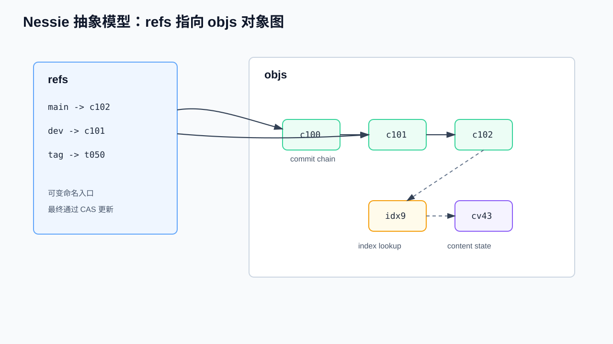
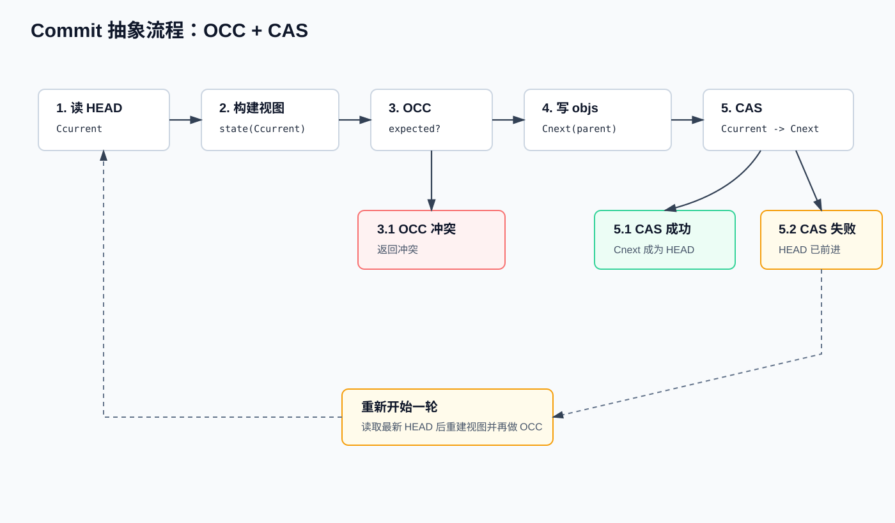
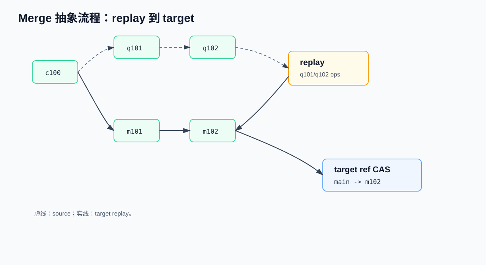
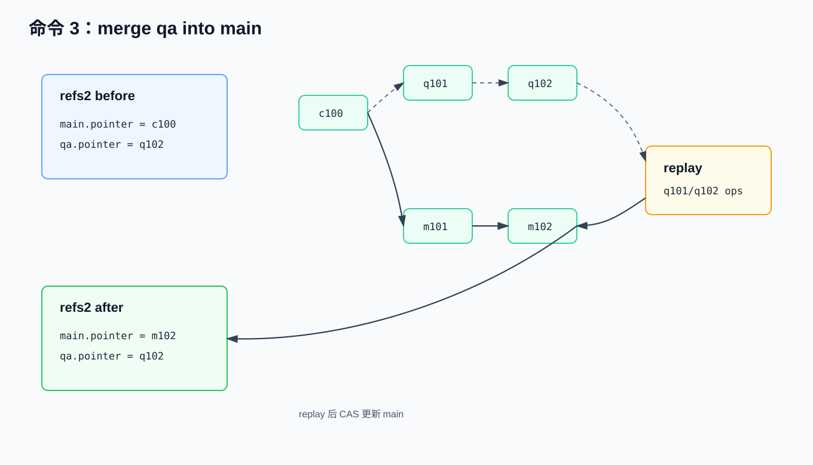

# Nessie Catalog 级 Git-Like 原理与实现流程

> 面向已有 CS / DB / Catalog 基础知识的开发者。本文先说明 Iceberg 原生单表版本控制，再说明 Nessie 如何把版本控制提升到 Catalog 层，覆盖 `refs`、`objs`、`CommitObj`、`ContentValueObj`、`IndexObj`、OCC、CAS、commit / branch / merge 数据流以及物理存储结构。  
> Nessie 源码核验版本：`projectnessie/nessie@3de486e26aa0809bb07be3fa46eeeb24e4d2c318`。  

---

## 0. Iceberg 原生单表 Branch / Tag

Iceberg 的版本控制边界是单张表。每张表都有自己的 table metadata JSON；写入、删除、重写或 schema/spec 变更会生成新的 metadata 文件，并由 catalog 原子替换当前 metadata 文件位置。Branch/tag 是 table metadata 内的 snapshot reference，用于给单表 snapshot 建立命名引用。


### 0.1 功能与逻辑结构

Iceberg 的 branch/tag 核心能力在 Iceberg 1.1.0 引入。官方 release note 显示，Apache Iceberg 1.1.0 于 2022-11-28 发布，并加入了用于跟踪 tag / branch 的 snapshot references，以及 `ManageSnapshots` 中的 branch / tag 操作。Iceberg 1.2.0 于 2023-03-20 发布，在此基础上补充了更完整的 branch commit 支持、Spark SQL 读写 branch/tag、以及创建、替换、删除 branch/tag 的 DDL 扩展。因此，若讨论 table metadata 内的 branch/tag 数据结构，起点是 1.1.0；若讨论 Spark SQL 层较完整的使用体验，通常从 1.2.0 开始。

源码入口：[`SnapshotRef.java`](https://github.com/apache/iceberg/blob/main/api/src/main/java/org/apache/iceberg/SnapshotRef.java) 定义 branch/tag reference 类型及保留策略字段；[`TableMetadata.java`](https://github.com/apache/iceberg/blob/main/core/src/main/java/org/apache/iceberg/TableMetadata.java) 持有 `refs` 映射并将其作为 table metadata 的一部分。

从最新 Iceberg 源码和规范看，原生 branch/tag 的核心结构是 `TableMetadata.refs()` 中的 `Map<String, SnapshotRef>`。`SnapshotRef` 同时表示 branch 和 tag。

| 字段 | 含义 |
|---|---|
| `TableMetadata.currentSnapshotId` | 当前主分支 snapshot；规范要求它与 `refs.main.snapshotId` 一致 |
| `TableMetadata.snapshots` | 表 metadata 中保留的 snapshot 列表 |
| `TableMetadata.snapshotLog` | snapshot 变更日志 |
| `TableMetadata.refs` | `Map<String, SnapshotRef>`，保存单表 branch/tag |
| `SnapshotRef.snapshotId` | 该 ref 指向的 snapshot id |
| `SnapshotRef.type` | `BRANCH` 或 `TAG` |
| `SnapshotRef.minSnapshotsToKeep` | branch 的最小保留 snapshot 数 |
| `SnapshotRef.maxSnapshotAgeMs` | branch 的 snapshot 最大保留时间 |
| `SnapshotRef.maxRefAgeMs` | ref 自身最大保留时间；`main` 不过期 |

Branch 是可移动的 snapshot reference，指向某条单表 snapshot lineage 的 head。Tag 是命名 snapshot reference，主要用于审计、发布点和保留策略。二者都是单表 metadata 内的引用，不复制数据文件。

### 0.2 创建与切换示例

Iceberg Java API 使用 `ManageSnapshots` / `SnapshotManager` 管理 refs：

```text
table.manageSnapshots()
  .createBranch("audit", 43)
  .setMinSnapshotsToKeep("audit", 2)
  .setMaxSnapshotAgeMs("audit", 3600000)
  .setMaxRefAgeMs("audit", 604800000)
  .commit();

table.manageSnapshots()
  .createTag("eom_2026_04", 40)
  .setMaxRefAgeMs("eom_2026_04", 180L * 24 * 3600 * 1000)
  .commit();
```

对应的 metadata 变化可以简化表示为：

```text
refs:
  main:
    type = branch
    snapshot-id = 43
  audit:
    type = branch
    snapshot-id = 43
    min-snapshots-to-keep = 2
    max-snapshot-age-ms = 3600000
    max-ref-age-ms = 604800000
  eom_2026_04:
    type = tag
    snapshot-id = 40
    max-ref-age-ms = 15552000000
```

Iceberg 通常没有全局“checkout”式切换上下文；读写时显式选择 ref：

```text
// Java read
table.newScan().useRef("audit");

// Java write
table.newAppend().toBranch("audit").appendFile(file).commit();

-- Spark SQL read
SELECT * FROM db.table VERSION AS OF 'audit';

-- Spark SQL write
INSERT INTO db.table.branch_audit VALUES (...);
```

推进 branch 可以通过写入该 branch、`replaceBranch` 或 fast-forward 完成；tag 通常用于固定历史点，不用于持续写入。

### 0.3 能力边界

```text
sales.orders:
  refs.main  -> snapshot 43
  refs.audit -> snapshot 44
  refs.eom   -> snapshot 40
```

以上只表示 `sales.orders` 一张表的 snapshot references，不能表达下列 catalog-wide 状态：

```text
catalog branch qa:
  sales.orders    -> orders snapshot 44
  sales.customers -> customers snapshot 18
  sales.payments  -> payments snapshot 9
```

后者需要 Catalog 层版本控制。Nessie 的事务边界是整个 catalog branch 的 HEAD pointer，而不是单张 Iceberg 表的 metadata pointer。

---

## 1. Nessie 的抽象模型

Nessie 的核心存储模型可以抽象为两类逻辑表：

```text
refs：命名引用表。每个 branch/tag/internal ref 保存一个可变 pointer。
objs：对象表。保存 commit、content value、index、tag、ref metadata 等对象。
```



### 1.1 `refs`：Catalog 状态的命名入口

`refs` 中的每条记录是一个命名 pointer：

```text
refs/heads/main -> c102
refs/heads/qa   -> q201
refs/tags/eom   -> t050
```

对 branch 来说，pointer 通常指向 `CommitObj`。读请求从 branch 名开始，解析到 HEAD commit，再通过 commit 的 index 找到各个 ContentKey 的当前 value。写请求先构造新的对象图，最后通过 CAS 更新目标 branch 的 pointer。

`refs` 的抽象职责：

| 职责 | 说明 |
|---|---|
| 命名入口 | 将用户可见 branch/tag 名映射到对象图入口 |
| 可见性边界 | branch 的可见状态由 pointer 指向的 HEAD 决定 |
| 并发控制 | 最终提交通过 reference pointer CAS 完成 |
| 分支隔离 | 不同 branch 通过不同 pointer 进入同一组对象图 |

### 1.2 `objs`：Catalog 状态的对象图

`objs` 是统一对象表。不同对象通过 `obj_type` 区分，通过 `ObjId` 相互引用：

```text
CommitObj c102
  -> parent CommitObj c101
  -> incremental/full index
  -> CommitOp(sales.orders).value = ContentValueObj cv_orders_v43

ContentValueObj cv_orders_v43
  -> IcebergTable(metadataLocation=orders/v43.metadata.json, snapshotId=43, ...)
```

`objs` 中对象之间的联系分为两层：

| 联系类型 | 说明 |
|---|---|
| 逻辑联系 | HEAD commit 表示一个 catalog snapshot；index 表示 ContentKey 到当前 content value 的映射；content value 表示表、视图或 namespace 的元数据状态 |
| 物理联系 | 对象均存放在 `objs2` 中；对象之间通过 `ObjId` 字段或序列化 index bytes 引用；通常没有数据库外键 |

Nessie 的原子可见性来自以下规则：

```text
先写 objs，再 CAS refs.pointer。
CAS 成功前，新对象不可从目标 branch 的 HEAD 到达。
CAS 成功后，新的 HEAD 及其可达对象成为该 branch 的可见 catalog 状态。
```

### 1.3 `CommitObj`、`ContentValueObj`、`IndexObj` 的关系

三类对象的关系是理解 Nessie 的关键：

| 对象 | 逻辑作用 | 主要物理引用 |
|---|---|---|
| `CommitObj` | 版本链节点，表示一次 catalog commit | `tail[0]` 指向父 commit；`referenceIndex` 或 `referenceIndexStripes` 指向完整索引；`incrementalIndex` 内嵌本次变更 |
| `CommitOp` | index 中的 key 级操作，不是单独 `objs` 行 | `value` 字段指向 `ContentValueObj` 的 `ObjId` |
| `ContentValueObj` | 某个 ContentKey 在某个版本上的 content state | `data` 保存 Iceberg table/view/namespace 等序列化内容 |
| `IndexObj` | 保存序列化后的 StoreIndex 片段或完整索引 | 被 `CommitObj.referenceIndex` 或 `IndexStripe.segment` 引用 |
| `IndexSegmentsObj` | 保存多个 index stripe 的元信息 | 每个 stripe 再指向一个 `IndexObj` |

读取 `sales.orders` 时，逻辑路径为：

```text
refs/heads/main
  -> CommitObj c102
  -> index lookup("sales.orders")
  -> CommitOp(value=cv_orders_v43)
  -> ContentValueObj cv_orders_v43
  -> IcebergTable(metadataLocation=..., snapshotId=...)
```

---

## 2. 抽象流程：commit、branch、merge

本章只说明业务时序和 `refs` / `objs` 的逻辑变化，字段级结构在后续章节展开。

### 2.1 一次 commit 的时序

场景：`main` 当前指向 `c100`，`sales.orders` 当前为 `cv_orders_v42`。客户端希望提交 `cv_orders_v43`。



```text
1[Read HEAD]
   读取目标 ref。
   Ccurrent = main.pointer
   第一次循环中 Ccurrent = c100；CAS 失败后的重试循环中 Ccurrent = 最新 HEAD。

2[Build View]
   由 Ccurrent 的 index 构建完整 catalog 视图。
   state(Ccurrent) = ContentKey -> CommitOp

3[OCC]
   校验本次提交携带的 expected state 是否仍匹配 state(Ccurrent)。

   3.1[OCC 冲突]
      同一 ContentKey 的 value / content id / payload 已变化。
      返回 VALUE_DIFFERS / CONTENT_ID_DIFFERS / PAYLOAD_DIFFERS 等冲突。

   3.2[OCC 通过]
      进入 4[Write Objs]。

4[Write Objs]
   预写本次提交需要的新对象：
      - ContentValueObj(new value)
      - CommitObj Cnext(parent = Ccurrent)
      - 必要的 IndexObj / IndexSegmentsObj

5[CAS]
   CAS main: Ccurrent -> Cnext

   5.1[CAS 成功]
      main.pointer = Cnext
      Cnext 成为 main 的可见 HEAD。

   5.2[CAS 失败]
      main.pointer 已从 Ccurrent 前进到其他 HEAD。
      已预写的 Cnext 不成为 main 的可见 HEAD。
      回到 1[Read HEAD]，读取最新 HEAD，并重新执行 2[Build View] 和 3[OCC]。
```

Nessie Catalog 层的 `content state` 包括 `expected value`、`content id`、`payload`，间接描述和指向 Iceberg metadata JSON 文件。以 Iceberg 表为例，`ContentValueObj.data` 中保存 `IcebergTable(metadataLocation=orders/v42.metadata.json, snapshotId=42, ...)`，其中 `metadataLocation` 指向 Iceberg metadata JSON。

这些概念之间的关系可以按读取路径理解。HEAD 是入口，state / view 是从 HEAD 解析出的完整 catalog 快照；OCC 不直接比较 Iceberg metadata JSON 文件，而是比较该快照中某个 `ContentKey` 当前对应的 `CommitOp` 与客户端提交携带的 expected 信息。

```text
HEAD / commit id
  -> 完整 catalog state / view
    -> ContentKey 对应的 CommitOp
      -> CommitOp.value = ContentValueObj.id
        -> ContentValueObj(contentId, payload, data)
          -> IcebergTable(metadataLocation, snapshotId, schemaId, specId, sortOrderId, ...)
```

| 概念 | 是什么 / 包含哪些信息 | 在 OCC / CAS 中与谁比较 |
|---|---|---|
| HEAD | 某个 branch 当前 `refs.pointer` 指向的 `CommitObj.id`；例如 `main.pointer=c100` | CAS 用它作为 expected pointer：`WHERE pointer = Ccurrent` |
| state / view | 从 HEAD 的 index 解析出的完整 catalog 快照；形态是 `ContentKey -> CommitOp` | OCC 查询 `state(Ccurrent)[ContentKey]`，得到当前 `value/contentId/payload` |
| `ContentKey` | Catalog 对象名；例如 `sales.orders`、某个 view、某个 namespace | OCC 的冲突粒度；同一 `ContentKey` 的 catalog state 被改动即可能冲突 |
| `expected value` | 客户端认为该 key 当前仍应指向的旧 `ContentValueObj.id`；例如 `cv_orders_v42` | 与 `state(Ccurrent)[key].value` 比较，不一致返回 `VALUE_DIFFERS` |
| `content id` | 逻辑内容对象 ID；用于跨 rename / branch 识别同一个表、view 或 namespace | 与 `state(Ccurrent)[key].contentId` 比较，不一致返回 `CONTENT_ID_DIFFERS` |
| `payload` | 内容类型编码；决定 content data 应按 Iceberg table、view、namespace 等哪种模型解释 | 与 `state(Ccurrent)[key].payload` 比较，不一致返回 `PAYLOAD_DIFFERS` |
| `ContentValueObj.data` | 具体 content state；Iceberg 表时是 `IcebergTable(metadataLocation, snapshotId, schemaId, specId, sortOrderId, ...)` | 不直接逐字段比较；其序列化内容参与 `ContentValueObj.id`，从而体现在 value 比较中 |
| `metadataLocation` | `IcebergTable` data 内的字段，指向 Iceberg metadata JSON 文件 | Nessie 不解析该 JSON；它通过 `ContentValueObj.id` 间接参与 OCC |

OCC 的冲突粒度是 `ContentKey`，例如 `sales.orders`、某个 view 或 namespace。Nessie 判断的是“这个 catalog 对象的状态是否仍等于提交者声明的 expected state”，不是判断 Iceberg manifest、partition、data file 或 row 级别的重叠。更细的同表并发 append / overwrite 语义由 Iceberg 自己的 snapshot validation 负责。

| 时刻 | `refs` 状态 | `objs` 变化 | 可见状态 |
|---|---|---|---|
| T0 | `main -> c100` | 已有 `c100`、`cv_orders_v42`、相关 index | `orders=v42` |
| T1 | `main -> c100` | 新写入 `cv_orders_v43`、`c101`、必要 index | 仍为 `orders=v42` |
| T2 成功 | `main -> c101` | T1 对象从 `main` 可达 | `orders=v43` |
| T2 CAS 失败 | `main -> c200` | T1 对象不可从 `main` 到达 | 重新基于 `c200` 校验和重建 |

OCC 与 CAS 的职责不同：

| 机制 | 判断对象 | 判断问题 |
|---|---|---|
| OCC | ContentKey 的 expected state | 当前 catalog state 是否仍满足提交假设 |
| CAS | Reference pointer | 目标 branch 是否仍处于本次构造 commit 时读取到的 HEAD |

### 2.2 创建 branch 的时序

场景：从 `main` 创建 `qa`。


```text
T0:
  refs.main = c100

T1:
  refs.main = c100
  refs.qa   = c100
```

抽象上，branch 创建只增加一个命名入口，不复制 commit、index、content value 或底层数据文件。后续提交才会让两个 branch 的 pointer 分别前进：

```text
main: c100 -> m101
qa:   c100 -> q101

实现层还会维护内部引用索引，例如通过内部 reference 记录 reference 创建/删除相关日志。这些内部对象服务于 reference 管理，不改变 branch 创建的抽象成本：新 branch 复用已有 HEAD 对象图。

### 2.3 merge 的时序

场景：`qa` 从 `main@c100` 分出后产生两个提交：



```text
main: c100
qa:   c100 -> q101 -> q102
```

将 `qa` merge 到 `main` 的抽象流程：

```text
1. 找到 source 和 target 的共同祖先 c100。
2. 取出 source 上相对 c100 的变更：q101、q102。
3. 在 target 当前 HEAD 上 replay 这些 CommitOp。
4. 每一步 replay 都基于 target 当前 catalog state 做冲突检查。
5. 写入 target 侧的新 commit 对象，例如 m101、m102。
6. CAS 更新 target ref：main -> m102。
```

Nessie merge 的关键是 replay 到目标分支，而不是直接把目标 pointer 改成 source HEAD。原因是 merge 期间 target 可能已经有新提交：

```text
main: c100 -> m200
qa:   c100 -> q101 -> q102
```

此时正确做法是以 `m200` 为 target 起点重新 replay `q101/q102` 的变更，并检查这些变更是否与 `m200` 中已发生的变更冲突。

### 2.4 merge 与 Git 双父提交的差异

Nessie 的主 commit 链保持单父链。merge replay 生成的 target commit 以 target 当前 HEAD 为直接父。`CommitObj.secondaryParents` 可以记录 merge 来源，但读路径、log 主链遍历和 index 构建主要沿 `tail[0]` 前进。

这与传统 Git merge commit 的差异如下：

| 维度 | Git | Nessie |
|---|---|---|
| 主对象 | 文件树 / blob / commit graph | Catalog ContentKey -> content value |
| merge 结果 | 通常生成双父 merge commit | 将 source operations replay 到 target branch |
| 主父链 | commit graph 可天然多父 | 主链保持单父，附加父通过 `secondaryParents` 表达 |
| 冲突粒度 | 文件/行/自定义 merge driver | ContentKey、payload、contentId、value |

---

## 3. 具体结构：`refs2`、`objs2` 与对象字段


### 3.1 `refs2` 表与 `Reference`

在 JDBC2 后端，reference 物理表为 `refs2`：

```sql
refs2(
  repo,
  ref_name,
  pointer,
  ext_info,
  prev_ptr,
  created_at,
  deleted,
  primary key(repo, ref_name)
)
```

`Reference` 是 generic named pointer，核心字段如下：

| 字段 | 含义 |
|---|---|
| `name` | 引用名。branch 常用 `refs/heads/<name>`，tag 常用 `refs/tags/<name>`，内部引用以 `int/` 开头 |
| `pointer` | 当前指向的 `ObjId`；branch 通常指向 `CommitObj` |
| `deleted` | 软删除标志 |
| `createdAtMicros` | 创建时间，微秒 epoch |
| `extendedInfoObj` | 可选扩展信息对象 |
| `previousPointers` | 最近旧 HEAD 列表，用于恢复、容错和 reference 历史处理 |

`refs2.pointer` 是从命名 ref 到 `objs2.obj_id` 的物理入口。后端没有要求用数据库外键维护该关系；一致性由 Nessie 的写入顺序和 CAS 协议保证。

### 3.2 `objs2` 表与对象类型

在 JDBC2 后端，对象物理表为 `objs2`：

```sql
objs2(
  repo,
  obj_id,
  obj_type,
  obj_vers,
  obj_value,
  obj_ref,
  primary key(repo, obj_id)
)
```

| 字段 | 含义 |
|---|---|
| `repo` | repository 标识 |
| `obj_id` | 对象 ID，当前实现使用 SHA-256 hasher 生成，通常为 32 bytes |
| `obj_type` | 对象类型短码 |
| `obj_vers` | 少数可更新对象的版本 token |
| `obj_value` | protobuf / 二进制序列化后的对象内容 |
| `obj_ref` | 对象最后写入或引用时间，主要服务 cleanup |

标准对象类型：

| 类型 | 短码 | 对应对象 |
|---|---:|---|
| `REF` | `r` | `RefObj` |
| `COMMIT` | `c` | `CommitObj` |
| `TAG` | `t` | `TagObj` |
| `VALUE` | `v` | `ContentValueObj` |
| `STRING` | `s` | `StringObj` |
| `INDEX_SEGMENTS` | `I` | `IndexSegmentsObj` |
| `INDEX` | `i` | `IndexObj` |
| `UNIQUE` | `u` | `UniqueIdObj` |

`ObjIdHasherImpl` 使用 SHA-256，但对象 ID 不是对整行 `obj_value` 直接求 hash。不同对象定义自己的语义 hash 输入：

| 对象 | ObjId hash 输入 |
|---|---|
| `ContentValueObj` | `VALUE + contentId + payload + data` |
| `IndexObj` | `INDEX + index bytes` |
| `IndexSegmentsObj` | `INDEX_SEGMENTS + stripes` |
| `RefObj` | `REF + name + initialPointer + createdAtMicros` |
| `CommitObj` | `COMMIT + parent + message + headers + add/remove ops` |

因此，部分派生字段可以在不改变版本语义的前提下被补齐或更新，例如完整 index 物化相关字段。语义上决定 commit 内容的是 parent、message、headers 和 key 级 operations。

### 3.3 `CommitObj`

`CommitObj` 是 catalog 版本链节点，核心字段如下：

| 字段 | 含义 |
|---|---|
| `id` | commit 对象 ID |
| `referenced` | 对象引用时间或可达性相关时间 |
| `created` | commit 创建时间 |
| `seq` | commit 序号，用于排序和遍历优化 |
| `tail` | 主父链信息；`directParent()` 取 `tail[0]`，为空时为 `EMPTY_OBJ_ID` |
| `secondaryParents` | 附加父信息，例如 merge 来源 commit |
| `headers` | commit header map |
| `message` | commit message |
| `referenceIndex` | 指向完整 index 的 `ObjId`；可指向 `IndexObj` 或 `IndexSegmentsObj` |
| `referenceIndexStripes` | 内嵌在 commit 中的 index stripes |
| `incrementalIndex` | 当前 commit 的增量 index bytes |
| `incompleteIndex` | 当前 commit 是否缺少完整 index |
| `commitType` | commit 类型 |

`CommitObj` 同时承担两类职责：

| 职责 | 说明 |
|---|---|
| 历史节点 | 通过 `tail` 连接父 commit，形成 branch 的主历史 |
| 状态索引入口 | 通过 `incrementalIndex`、`referenceIndex`、`referenceIndexStripes` 帮助恢复 HEAD 对应的完整 catalog state |

### 3.4 `CommitOp`

`CommitOp` 不是单独的 `objs2` 行，而是存放在 `CommitObj.incrementalIndex` 或完整 index 中的值。它表示某个 StoreKey / ContentKey 的状态操作。

| 字段 | 含义 |
|---|---|
| `action` | `ADD`、`REMOVE`、`INCREMENTAL_ADD`、`INCREMENTAL_REMOVE`、`NONE` |
| `payload` | content 类型 payload，例如 Iceberg table、view、namespace |
| `value` | 指向 `ContentValueObj` 的 `ObjId`；删除时可为空 |
| `contentId` | logical content id，用于跨 rename / branch 跟踪同一内容对象 |

`ADD` 和 `REMOVE` 表示当前 commit 的真实操作。`INCREMENTAL_ADD` 和 `INCREMENTAL_REMOVE` 表示来自历史 commit 的增量项。`NONE` 常用于完整 index，表示 key 当前存在，但不是本 commit 的操作。

### 3.5 `ContentValueObj`

`ContentValueObj` 保存某个 ContentKey 在某个版本上的 on-reference content state：

| 字段 | 含义 |
|---|---|
| `id` | value 对象 ID |
| `referenced` | 对象引用时间或可达性相关时间 |
| `contentId` | logical content id |
| `payload` | content 类型 payload |
| `data` | 序列化后的 content 数据 |

以 Iceberg 表为例，`data` 中的 API model 主要字段为：

| 字段 | Iceberg 语义 |
|---|---|
| `metadataLocation` | 当前 Iceberg metadata JSON 文件位置 |
| `snapshotId` | 当前 snapshot id |
| `schemaId` | 当前 schema id |
| `specId` | 当前 partition spec id |
| `sortOrderId` | 当前 sort order id |
| `id` | content id |

因此，对 Nessie 来说，`ContentValueObj` 并不存储数据文件列表；它存储的是某个 catalog content 的元数据指针和表格式状态。

### 3.6 `IndexObj` 与 `IndexSegmentsObj`

Nessie 需要高效回答三个问题：

```text
1. 给定 HEAD，某个 ContentKey 当前指向哪个 ContentValueObj？
2. 两个 HEAD 之间哪些 ContentKey 不同？
3. 一次提交的 expected state 是否仍成立？
```

如果每次都从 HEAD 扫描完整历史，成本会随 commit 数增长。Nessie 通过增量索引和完整索引降低读、diff、merge、OCC 的成本。

| 对象或字段 | 作用 |
|---|---|
| `CommitObj.incrementalIndex` | 保存当前 commit 以及自上次完整 index 以来的增量变更 |
| `CommitObj.referenceIndex` | 指向完整 index 对象；可为 `IndexObj` 或 `IndexSegmentsObj` |
| `CommitObj.referenceIndexStripes` | 当 stripes 数量较小时，直接内嵌在 commit 中 |
| `IndexObj.index` | 一个序列化后的 StoreIndex |
| `IndexSegmentsObj.stripes` | 多个 `IndexStripe`，每个包含 `firstKey`、`lastKey`、`segment` |
| `IndexStripe.segment` | 指向保存该 key range 索引片段的 `IndexObj` |

`CommitOp.value -> ContentValueObj.id` 是 key 到内容状态的主要物理链接。`IndexObj` 和 `IndexSegmentsObj` 不直接表示业务内容，而是加速从 commit HEAD 到 ContentKey 状态的解析。

当前默认配置中，`max-incremental-index-size` 为 `50 * 1024`，`max-serialized-index-size` 为 `200 * 1024`，`max-reference-stripes-per-commit` 为 `50`。这些阈值决定增量 index 何时需要外置或物化为完整 index，以及完整 index 是否需要分段。

---

## 4. 三个命令的数据流与记录变化

本章沿用第二章的简单例子，但把 `commit`、`create branch`、`merge` 拆开，展示每个命令执行期间 `refs2`、`objs2` 和对象字段的变化。

### 4.1 命令一：commit 到 `main`

示例命令语义：

```text
commit main:
  sales.orders expected=cv_orders_v42 -> cv_orders_v43
```


字段级含义：

| 项 | 示例值 | 含义 |
|---|---|---|
| `ContentKey` | `sales.orders` | Catalog 中的对象名 |
| `payload` | `ICEBERG_TABLE` | Content 类型 |
| `contentId` | `orders-content-id` | 逻辑内容对象 ID |
| `expected value` | `cv_orders_v42` | 提交者认为当前 key 仍应指向的旧 `ContentValueObj.id` |
| `new value` | `cv_orders_v43` | 本次提交要写入的新 `ContentValueObj.id` |

执行前：

```text
refs2:
  ref_name = refs/heads/main
  pointer  = c100
  prev_ptr = []

objs2:
  c100
  cv_orders_v42
  index(c100): sales.orders -> cv_orders_v42
```

执行中先写入对象：

```text
objs2 add:
  cv_orders_v43:
    obj_type = v
    data = IcebergTable(metadataLocation=orders/v43.metadata.json, snapshotId=43, ...)

  c101:
    obj_type = c
    tail[0] = c100
    incrementalIndex:
      sales.orders -> CommitOp(ADD, value=cv_orders_v43, expected=cv_orders_v42)

  idx_new:
    sales.orders -> cv_orders_v43
```

最后更新 reference：

```sql
UPDATE refs2
SET pointer = 'c101', prev_ptr = ['c100']
WHERE ref_name = 'refs/heads/main'
  AND pointer = 'c100'
  AND deleted = false;
```

结果分支：

| 分支 | 结果 |
|---|---|
| OCC 失败 | 未写入可见 commit，返回 key/value 冲突 |
| OCC 成功、CAS 成功 | `main.pointer=c101`，`sales.orders` 新状态可见 |
| OCC 成功、CAS 失败、并发提交改的是不同 `ContentKey` | 重新以新 HEAD 构造 commit 并重试 |
| OCC 成功、CAS 失败、并发提交改的是同一 `ContentKey` | 重读后 OCC 失败，返回 `VALUE_DIFFERS` |

### 4.2 命令二：从 `main` 创建 `qa` branch

示例命令语义：

```text
create branch qa from main
```


执行前：

```text
refs2:
  refs/heads/main.pointer = c100

objs2:
  c100 及其可达对象图
```

执行后：

```text
refs2:
  refs/heads/main.pointer = c100
  refs/heads/qa.pointer   = c100

objs2:
  业务对象图不复制
```

Branch 创建的关键点是新增命名入口，而不是复制 catalog 状态。后续在 `qa` 上 commit 时，才会出现：

```text
main: c100
qa:   c100 -> q101
```

可能的失败分支：

| 分支 | 结果 |
|---|---|
| `qa` 已存在 | 返回 reference already exists |
| base ref 不存在 | 返回 not found |
| 并发创建同名 ref | 只有一个创建成功，另一个冲突 |

### 4.3 命令三：merge `qa` 到 `main`

示例初始状态：

```text
main: c100
qa:   c100 -> q101 -> q102
```

示例命令语义：

```text
merge qa into main
```



执行过程：

```text
1. 读取 sourceHead = q102，targetHead = c100。
2. 找到 commonAncestor = c100。
3. 提取 q101、q102 中的 CommitOp。
4. 将这些 CommitOp replay 到 target 当前状态。
5. 写入 target 侧 commit：m101、m102。
6. CAS refs/heads/main.pointer: c100 -> m102。
```

记录变化：

```text
refs2 before:
  refs/heads/main.pointer = c100
  refs/heads/qa.pointer   = q102

objs2 add:
  m101:
    tail[0] = c100
    secondaryParents = [q101]
    incrementalIndex = replay(q101.ops)

  m102:
    tail[0] = m101
    secondaryParents = [q102]
    incrementalIndex = replay(q102.ops)

refs2 after:
  refs/heads/main.pointer = m102
  refs/heads/qa.pointer   = q102
```

如果 merge 期间 `main` 已经前进到 `m200`，Nessie 不能直接把 `main` 指到 `q102`。它需要重新以 `m200` 为 target HEAD，重新计算共同祖先、replay source operations、执行 OCC，并最终 CAS 到新的 target-side replay commit。

结果分支：

| 分支 | 结果 |
|---|---|
| source 变更与 target 当前状态无冲突，CAS 成功 | `main` 前进到 replay 后的新 HEAD |
| target 已前进但不同 key | 重新 replay 后可成功 |
| target 已前进且同 key value 冲突 | 返回 merge conflict |
| source/target ref 不存在 | 返回 not found |

---

## 8. 参考资料

Iceberg 官方资料：

- Apache Iceberg Releases：<https://iceberg.apache.org/releases/>
- Apache Iceberg Reliability：<https://iceberg.apache.org/docs/latest/reliability/>
- Apache Iceberg Branching and Tagging：<https://iceberg.apache.org/docs/latest/branching/>
- Apache Iceberg Java API Quickstart：<https://iceberg.apache.org/docs/latest/java-api-quickstart/>
- Apache Iceberg Table Spec：<https://iceberg.apache.org/spec/>
- Iceberg `SnapshotRef` 最新源码：<https://github.com/apache/iceberg/blob/main/api/src/main/java/org/apache/iceberg/SnapshotRef.java>
- Iceberg `TableMetadata` 最新源码：<https://github.com/apache/iceberg/blob/main/core/src/main/java/org/apache/iceberg/TableMetadata.java>
- Iceberg `ManageSnapshots` 最新源码：<https://github.com/apache/iceberg/blob/main/api/src/main/java/org/apache/iceberg/ManageSnapshots.java>
- Iceberg `SnapshotManager` 最新源码：<https://github.com/apache/iceberg/blob/main/core/src/main/java/org/apache/iceberg/SnapshotManager.java>

Iceberg branch/tag 第三方介绍：

- Dremio: Exploring Branches & Tags in Apache Iceberg Using Spark：<https://www.dremio.com/blog/exploring-branch-tags-in-apache-iceberg-using-spark/>
- Starburst: How Apache Iceberg Branching Transforms Data Management：<https://www.starburst.io/blog/iceberg-branching-data-management/>
- 腾讯云开发者社区：一文搞懂 Iceberg 的 branch 和 tags：<https://cloud.tencent.com/developer/article/2520801>
- Apache Doris 文档：Iceberg Catalog 管理 Branch & Tag：<https://doris.apache.org/zh-CN/docs/3.x/lakehouse/catalogs/iceberg-catalog/>

Nessie 官方资料：

- Project Nessie：<https://projectnessie.org/>
- Nessie Transactions：<https://projectnessie.org/nessie-latest/transactions/>
- Nessie Iceberg REST guide：<https://projectnessie.org/nessie-latest/guides/iceberg-rest/>
- Nessie Commit Kernel：<https://projectnessie.org/nessie-latest/develop/kernel/>
- Dremio: Lakehouse Catalogs 101 - Project Nessie：<https://www.dremio.com/blog/lakehouse-catalogs-101-project-nessie/>

Nessie 源码核验版本：

- Nessie repository：<https://github.com/projectnessie/nessie/tree/3de486e26aa0809bb07be3fa46eeeb24e4d2c318>
- `Persist`：<https://github.com/projectnessie/nessie/blob/3de486e26aa0809bb07be3fa46eeeb24e4d2c318/versioned/storage/common/src/main/java/org/projectnessie/versioned/storage/common/persist/Persist.java>
- `Reference`：<https://github.com/projectnessie/nessie/blob/3de486e26aa0809bb07be3fa46eeeb24e4d2c318/versioned/storage/common/src/main/java/org/projectnessie/versioned/storage/common/persist/Reference.java>
- `ObjIdHasherImpl`：<https://github.com/projectnessie/nessie/blob/3de486e26aa0809bb07be3fa46eeeb24e4d2c318/versioned/storage/common/src/main/java/org/projectnessie/versioned/storage/common/persist/ObjIdHasherImpl.java>
- `CommitObj`：<https://github.com/projectnessie/nessie/blob/3de486e26aa0809bb07be3fa46eeeb24e4d2c318/versioned/storage/common/src/main/java/org/projectnessie/versioned/storage/common/objtypes/CommitObj.java>
- `CommitOp`：<https://github.com/projectnessie/nessie/blob/3de486e26aa0809bb07be3fa46eeeb24e4d2c318/versioned/storage/common/src/main/java/org/projectnessie/versioned/storage/common/objtypes/CommitOp.java>
- `ContentValueObj`：<https://github.com/projectnessie/nessie/blob/3de486e26aa0809bb07be3fa46eeeb24e4d2c318/versioned/storage/common/src/main/java/org/projectnessie/versioned/storage/common/objtypes/ContentValueObj.java>
- `IndexObj`：<https://github.com/projectnessie/nessie/blob/3de486e26aa0809bb07be3fa46eeeb24e4d2c318/versioned/storage/common/src/main/java/org/projectnessie/versioned/storage/common/objtypes/IndexObj.java>
- `IndexSegmentsObj`：<https://github.com/projectnessie/nessie/blob/3de486e26aa0809bb07be3fa46eeeb24e4d2c318/versioned/storage/common/src/main/java/org/projectnessie/versioned/storage/common/objtypes/IndexSegmentsObj.java>
- `IndexStripe`：<https://github.com/projectnessie/nessie/blob/3de486e26aa0809bb07be3fa46eeeb24e4d2c318/versioned/storage/common/src/main/java/org/projectnessie/versioned/storage/common/objtypes/IndexStripe.java>
- `CommitLogicImpl`：<https://github.com/projectnessie/nessie/blob/3de486e26aa0809bb07be3fa46eeeb24e4d2c318/versioned/storage/common/src/main/java/org/projectnessie/versioned/storage/common/logic/CommitLogicImpl.java>
- `MergeBase`：<https://github.com/projectnessie/nessie/blob/3de486e26aa0809bb07be3fa46eeeb24e4d2c318/versioned/storage/common/src/main/java/org/projectnessie/versioned/storage/common/logic/MergeBase.java>
- `CommitRetry`：<https://github.com/projectnessie/nessie/blob/3de486e26aa0809bb07be3fa46eeeb24e4d2c318/versioned/storage/common/src/main/java/org/projectnessie/versioned/storage/common/logic/CommitRetry.java>
- `StoreConfig`：<https://github.com/projectnessie/nessie/blob/3de486e26aa0809bb07be3fa46eeeb24e4d2c318/versioned/storage/common/src/main/java/org/projectnessie/versioned/storage/common/config/StoreConfig.java>
- JDBC2 backend schema：<https://github.com/projectnessie/nessie/blob/3de486e26aa0809bb07be3fa46eeeb24e4d2c318/versioned/storage/jdbc2/src/main/java/org/projectnessie/versioned/storage/jdbc2/Jdbc2Backend.java>
- JDBC2 constants：<https://github.com/projectnessie/nessie/blob/3de486e26aa0809bb07be3fa46eeeb24e4d2c318/versioned/storage/jdbc2/src/main/java/org/projectnessie/versioned/storage/jdbc2/SqlConstants.java>
- API model `IcebergTable` / `Content`：<https://github.com/projectnessie/nessie/tree/3de486e26aa0809bb07be3fa46eeeb24e4d2c318/api/model/src/main/java/org/projectnessie/model>

本地材料：

- `Industry/nessie-research.md`
- `Industry/git-like/Catalog_GitLike_Research_Report.md`

本文图表资源：

- `gitlike_src/00_iceberg_single_table_versioning.svg`
- `gitlike_src/01_nessie_refs_objs_abstract.svg`
- `gitlike_src/02a_commit_abstract_flow.svg`
- `gitlike_src/02b_branch_abstract_flow.svg`
- `gitlike_src/02c_merge_abstract_flow.svg`
- `gitlike_src/03_object_graph_detailed.svg`
- `gitlike_src/05_commit_command_records.svg`
- `gitlike_src/06_branch_command_records.svg`
- `gitlike_src/07_merge_command_records.svg`
