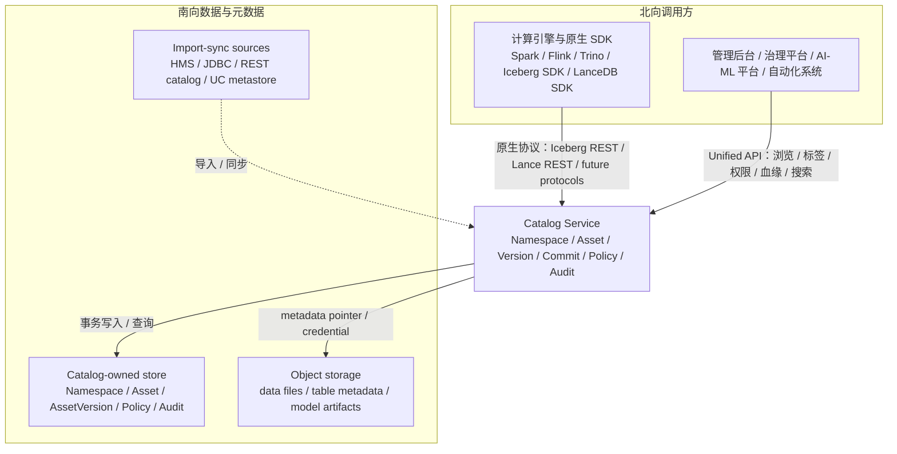
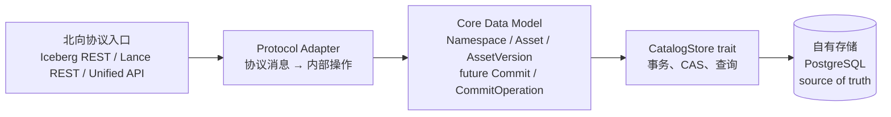
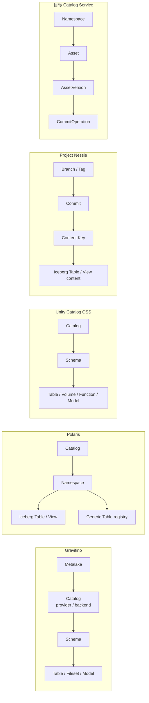
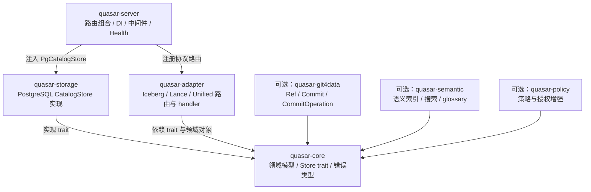

# Lakehouse Catalog Service 架构目标与开源项目适配性评估

> 本文档讨论一个面向 Lakehouse 的独立 Catalog Service 应具备什么架构目标，并据此分析 Apache Gravitino、Apache Polaris、Unity Catalog OSS、Project Nessie 在哪些方面适合作为参考或组件，哪些方面不适合作为直接底座。
>
> 分析对象：Apache Gravitino、Apache Polaris、Unity Catalog OSS、Project Nessie。
>
> 校准原则：开源项目能力以官方文档、官方博客、官方 GitHub roadmap 为准；目标架构以一个面向多表格式、多资产、Git4Data 与 Semantic-aware 演进的 Catalog Service 为准（校准时间：2026-04-30）。

---

## Executive Summary

本文从 Lakehouse Catalog Service 目标架构出发，评估 Gravitino、Polaris、Unity Catalog OSS 与 Nessie 的适配性。结论是：四者都有可借鉴能力，但第一性抽象分别偏向联邦 catalog、Iceberg REST、多资产治理 metastore 和 Iceberg-oriented version store。若目标是协议优先、自包含、多资产平等，并可演进 Git4Data / Semantic-aware，核心内核更适合自研，开源项目分层复用。

---

## 核心结论

**面向 Lakehouse 的 Catalog Service 选型，核心判断标准是项目的第一性抽象是否匹配目标架构，而不是单纯比较功能清单。**

一个面向 Lakehouse 的 Catalog Service，不只是表名到存储路径的映射表，也不是单纯的数据治理门户。它处在计算引擎、表格式、对象存储、权限治理和数据资产管理之间，承担元数据控制面职责：

- 向北服务计算引擎、SDK、管理后台、治理系统和 AI/ML 平台；
- 向南管理表格式 metadata、对象存储位置、权限凭证、外部 metastore 导入与存量资产迁移；
- 在中间提供命名、发现、提交、版本、权限、审计、血缘、治理和未来 Git4Data / Semantic-aware 能力。

据此，开源项目的适配性可以概括为：

| 项目 | 适合作为参考的部分 | 不适合作为直接底座的部分 |
|------|--------------------|--------------------------|
| Gravitino | 多 catalog 联邦、connector 体系、Fileset / Model catalog、统一入口治理 | catalog-of-catalogs、外部 backend、资产语义分散 |
| Polaris | Iceberg REST Catalog、安全、RBAC、policy、credential vending、生产级 Iceberg 服务端实践 | Iceberg-first、Generic Table 语义薄、非通用版本内核 |
| Unity Catalog OSS | 多资产治理目录、table/file/function/model 统一治理形态、AI 资产管理经验 | 三层治理对象模型、非统一 AssetVersion / CommitOperation 内核 |
| Nessie | Git-like branch/tag/commit/version-store、乐观冲突控制、跨表一致视图 | Git4Data 强、多资产和多格式 content model 窄 |

因此，合理策略是：

1. 从 Catalog Service 的目标架构出发定义自己的核心模型；
2. 对成熟开源项目做分层借鉴；
3. 避免把不匹配的第一性抽象引入核心路径；
4. 在核心模型中提前容纳多资产、版本、治理和语义能力。

---

## 一、Catalog Service 在 Lakehouse 架构中的定位

### 1.1 发展背景：从 Hive Metastore 到独立 Catalog Service

Catalog Service 的发展可以用一条主线理解：HMS 先承担 Hive 生态事实上的表级元数据服务，开放湖表格式随后把 snapshot、manifest、transaction log、dataset version 等格式元数据放到对象存储或格式文件中，而 catalog 继续负责命名空间、表发现、当前 metadata pointer、提交入口和权限治理。

因此，早期湖表格式通常先复用 HMS 或引擎内置 catalog，以获得 Spark、Hive、Flink 等生态兼容。但随着 Iceberg、Lance、Delta、Hudi、Paimon 等格式进入多引擎、多语言和平台化场景，catalog 需要从"兼容元数据库"演进为独立服务：统一暴露标准协议，承载 server-side commit、credential vending、权限、审计、缓存、迁移和治理能力。

Iceberg REST Catalog 和 Lance REST Namespace 这类协议的价值，正在于把 catalog 从引擎本地实现或 HMS 兼容层中抽出来，使不同客户端通过标准接口访问同一套元数据控制面。

所以，现代 Lakehouse Catalog Service 的发展脉络可以概括为：

```text
Hive/HMS 时代
  表、分区、location、SerDe 元数据服务
        |
        v
湖表格式时代
  表格式 metadata 文件 + catalog 保存当前指针和命名空间
        |
        v
开放 Catalog Service 时代
  标准协议 + 多引擎互操作 + 权限/credential + 治理 + 版本演进
```

这一背景决定了 Catalog Service 的核心问题不是"是否还需要 HMS"，而是"哪些元数据应由现代 Catalog Service 自己掌握，哪些存量系统只作为兼容、迁移、导入或同步来源"。

### 1.2 Catalog Service 是 Lakehouse 的元数据控制面

Lakehouse 通常把数据文件、表格式 metadata、计算引擎和治理系统解耦。对象存储保存数据文件和格式 metadata 文件，计算引擎负责读写与执行，表格式定义 schema、snapshot、manifest、transaction 等语义，而 Catalog Service 负责把这些对象组织成可发现、可提交、可治理的资产空间。

可以把 Catalog Service 放在如下位置。下图强调的是北向协议入口、治理入口与南向数据/元数据来源之间的数据流关系：



它不是数据面：查询扫描、数据文件读写、向量检索、模型推理不应由 Catalog Service 承担。它也不只是一个元数据库：Catalog Service 需要表达协议语义、并发提交、权限策略、资产关系和版本演进。

### 1.3 北向协作：协议入口与治理入口分离

北向接口面向两类调用方：

| 北向对象 | 典型调用方 | 需要的能力 |
|----------|------------|------------|
| 原生格式客户端与引擎 | Spark、Flink、Trino、Iceberg SDK、Lance/LanceDB SDK | 按格式标准协议完成 create/load/commit/list/drop、版本查询、namespace 管理 |
| 管理、治理和平台系统 | 数据门户、权限平台、审计系统、血缘系统、AI/ML 平台 | 跨格式资产浏览、owner/tag/property、权限、审计、血缘、搜索、质量状态、语义解释 |

因此目标 Catalog Service 不应强迫所有客户端改用一套私有统一 API。更合理的方式是：

- Iceberg 表走 Iceberg REST Catalog；
- Lance 表走 Lance REST Namespace；
- 未来其他格式优先尊重其原生 catalog / namespace / transaction 边界；
- Unified API 只承载跨格式、跨资产的治理公共子集。

这里的统一不是抹平所有格式差异，而是在不破坏原生协议的前提下，把治理、发现和管理能力沉淀到公共层。

### 1.4 南向协作：控制元数据所有权，而不是代理所有系统

南向协作包括三种关系：

| 南向关系 | 说明 | 架构影响 |
|----------|------|----------|
| 自有元数据存储 | Catalog Service 自己保存 namespace、asset、version、commit、policy、audit 等控制面状态 | 是核心 source of truth |
| 表格式与对象存储 | 表格式 metadata 和数据文件仍按 Iceberg/Lance 等格式规范存放在对象存储中 | Catalog 保存 pointer、状态和治理信息，不接管数据面 |
| 外部系统导入或同步 | 存量 HMS/JDBC/REST catalog/UC metastore 可迁移、导入、同步，或通过工具做离线适配 | 不应默认成为 core read/write path 的必需 backend |

Catalog Service 可以处理外部系统的存量数据，但不等于要采用联邦代理模式。若外部 metastore 成为实时读写 backend，Catalog Service 的一致性、版本语义、审计边界和未来 Git4Data 能力都会受制于多个 backend 的行为差异。

### 1.5 Catalog Service 的设计目标

从上述定位出发，Catalog Service 的设计目标应分成两类：基础工程性要求和功能性要求。前者决定它能否作为生产级元数据控制面稳定运行，后者决定它能否承载多格式、多资产、治理和未来 Git4Data / Semantic-aware 演进。

**第一类：基础工程性要求**

| 要求 | 含义 |
|------|------|
| 高可用 | Catalog Service 是引擎提交、加载表、权限校验和资产发现的关键路径，应支持多实例部署、故障切换和无状态横向扩展 |
| 一致性与并发控制 | 元数据提交、版本推进、权限变更需要明确事务边界和乐观/悲观并发控制，避免双写、丢提交和脏读 |
| 可恢复 | 元数据存储、迁移任务、后台维护任务应支持备份恢复、幂等重试和故障后状态校验 |
| 可观测 | 需要暴露 metrics、logs、traces、审计事件和关键业务指标，便于定位提交失败、权限拒绝、backend 延迟和同步异常 |
| 安全基线 | 支持认证、授权、最小权限、密钥/credential 管理和审计追踪 |
| 可运维边界 | 核心服务依赖应克制，部署拓扑清晰，避免把外部 metastore、connector 平台或完整治理控制面变成必需运行条件 |

**第二类：功能性要求**

| 要求 | 含义 |
|------|------|
| 协议优先 + 治理公共子集 | 原生协议服务引擎，Unified API 服务治理与管理 |
| 格式无关、资产无关的核心模型 | 表、模型、特征、文件集、向量索引、指标等都是一等资产 |
| 最小自包含存储 | 核心元数据由 Catalog Service 自己掌握，不要求每种格式已有外部 catalog backend |
| 版本与提交可演进 | 资产版本、commit graph、branch/tag、diff/merge/rollback 能在核心模型上自然扩展 |
| Semantic-aware 可演进 | 资产描述、schema、版本、血缘、标签、业务 glossary、embedding 等能形成统一资产图 |

---

## 二、目标 Catalog Service 的核心架构要求

### 2.1 请求链路：协议入口最终受核心模型约束

Catalog Service 最核心的工作链路，是把北向协议消息转换成内部领域操作，再通过自有存储维护元数据状态。协议入口可以是 Iceberg REST、Lance REST Namespace 或 Unified API；真正决定系统能否持续演进的，是 adapter 与后端存储之间的 core data model。



这张图要表达三点：

1. 北向协议兼容本身不是充分差异。无论是 UC、Polaris、Gravitino，还是目标 Catalog Service，都会把某种协议请求映射为内部对象和存储操作。
2. 真正关键的是内部模型是否把 `Asset`、`AssetVersion`、未来 `CommitOperation` 作为稳定内核。如果模型只围绕某一种表格式、某一种三层命名对象或某一种外部 backend 组织，后续新增资产类型、统一版本、Git4Data 和 Semantic-aware 都会变成跨层重构。
3. 后端数据库不是简单的配置库，而是 Catalog Service 的元数据 source of truth。它保存的 schema 直接反映 core model；core model 设计不合理时，改动会同时影响协议适配、领域服务、存储接口、DDL、迁移脚本、兼容 API 和历史数据。

### 2.2 协议优先，不等于放弃统一治理

目标架构需要同时提供两类入口：

| 接口类型 | 面向对象 | 职责 |
|----------|----------|------|
| 原生协议接口 | Iceberg/Lance/未来格式的原生客户端与引擎 | 保持建表、提交、加载、版本、namespace 等格式特有语义 |
| Unified API | 管理后台、数据平台、治理服务、自动化系统 | 提供跨格式、跨资产的公共子集能力，例如浏览、属性、说明、标签、owner、权限、审计、血缘、搜索 |

这样的好处是：引擎仍然使用熟悉的生态协议，平台侧又能获得统一治理视图。反过来，如果从一开始把所有格式都塞进一个私有 API，会增加引擎接入成本，也容易丢失表格式自身的 transaction、snapshot、version 等语义。

### 2.3 核心模型应让各类资产平等

目标 Catalog Service 不应停留在 table catalog，也不应让 Iceberg、Lance、Model 或 Feature 中任何一类资产成为隐含中心。更合适的核心模型是：

```text
Namespace
  └─ Asset
       ├─ asset_type: table | model | feature | fileset | vector_index | metric | ...
       ├─ asset_subtype: iceberg | lance | mlflow | ...
       └─ AssetVersion
```

数据建模上可以采用"通用主表 + 类型扩展表"：

```text
assets                    # 所有资产共享的身份、类型、说明、属性、审计字段
  ├─ tabular_assets        # table 专有字段：location、metadata_location、schema_snapshot...
  ├─ model_assets          # model 专有字段：artifact_uri、framework、signature...
  ├─ feature_assets        # feature 专有字段：entity、feature_type、serving info...
  └─ vector_index_assets   # vector index 专有字段：embedding_dim、metric、index_type...

asset_versions                    # 所有资产共享的版本身份、排序、属性、创建时间
  ├─ tabular_asset_versions        # table 版本字段
  ├─ model_asset_versions          # model 版本字段
  └─ feature_asset_versions        # feature 版本字段
```

这种模式表达的是：通用主表负责"这是一个什么资产"，扩展表负责"这种资产有哪些专有字段"。表资产不会污染模型资产，模型资产也不会反过来约束表资产；未来新增资产类型时，优先增加扩展表和 adapter，而不是重写核心身份模型。

### 2.4 最小自包含存储

"最小自包含"不是说功能少，而是说 Catalog 元数据所有权边界清晰：

- Catalog Service 自己保存 Namespace、Asset、AssetVersion、权限、审计、未来 commit graph；
- 对象存储保存表格式自身的数据和 metadata 文件；
- 不要求 Iceberg 必须已有 HMS/JDBC/REST backend，也不要求 Lance/模型/特征必须已有外部 catalog service；
- 外部 catalog / metastore 的数据可以通过迁移工具、导入任务或同步任务进入目标 Catalog；
- 外部系统不默认成为 core read/write path 的必需 backend。

也就是说，外部系统可以迁入或同步元数据，但核心读写路径应由目标 Catalog Service 自己控制。这样一致性、版本、治理和未来 Git4Data 语义才不会被多个外部 backend 的差异打散。

### 2.5 Git4Data 与 Semantic-aware 是核心模型问题

Git4Data 不是单表版本号，也不是 Iceberg 表内 snapshot reference。它需要整个 Catalog 以 version store 方式工作：

```text
Ref
  ├─ name
  ├─ type: branch | tag
  └─ head_commit_id

Commit
  ├─ id
  ├─ parent_commit_id
  ├─ author / message / created_at
  └─ expected_parent_hash

CommitOperation
  ├─ commit_id
  ├─ asset_key
  ├─ op: put | delete | unmodified
  ├─ old_asset_version_id
  └─ new_asset_version_id
```

Semantic-aware 也不是简单加一个搜索服务。它需要把以下信息统一到一个可索引、可推理的资产图中：

- Asset 身份、类型、格式、业务描述、owner、tags；
- schema / embedding / feature definition / model card / metric definition；
- AssetVersion 与变更历史；
- lineage、quality、usage、policy；
- 用户查询、业务 glossary、自然语言解释。

如果底层模型没有统一 Asset、AssetVersion 和 CommitOperation，后续 Git4Data 与 Semantic-aware 很容易变成外挂索引或侵入式重构。

### 2.6 基础工程要求与轻量工程边界

"轻量工程边界"不是说能力目标轻，而是说基础工程要求要通过清晰、克制的运行时边界实现。Catalog Service 作为生产元数据控制面，首先要满足高可用、一致性、可恢复、可观测和安全基线；在这个前提下，系统边界应保持简单：

- **单一服务边界**：核心 Catalog 以一个服务提供，不要求部署一组独立控制面服务；
- **单一元数据 source of truth**：Catalog 元数据以自有存储为准，不要求每种格式再绑定一个外部 catalog backend；
- **无状态高可用**：服务实例本身无状态，通过多副本部署、负载均衡和数据库事务约束实现横向扩展与故障切换；
- **明确并发边界**：提交、版本推进和权限变更通过事务、CAS 或乐观锁表达，避免把一致性寄托给多个外部 backend；
- **可恢复与可观测**：迁移、导入、维护任务应具备幂等性和状态记录，服务应暴露 metrics、logs、traces 和审计事件；
- **适配器扩展**：Iceberg、Lance、未来格式和资产类型通过 adapter / feature 扩展；
- **可选能力模块化**：Git4Data、Semantic index、lineage、policy、维护任务可以在核心模型上演进，但不强制所有部署一开始就承担完整治理平台运行成本。

---

## 三、开源项目适配性分析

本节的判断以官方文档、官方 release notes、官方 GitHub repository / roadmap 为依据。由于开源项目演进较快，本文明确采用如下资料口径：

| 项目 | 本文采用的版本或资料口径 | 说明 |
|------|--------------------------|------|
| Apache Gravitino | 1.2.0 官方文档与下载页 | 用于判断 metalake/catalog/entity store、Iceberg backend、Lance REST service、Fileset/Model catalog |
| Apache Polaris | 1.4.0 官方文档与下载页 | 用于判断 Iceberg REST、RBAC/policy、credential vending、Generic Table、Lance integration |
| Unity Catalog OSS | v0.4.1 GitHub release、官方文档与 roadmap | 用于判断 UC 三层命名、多资产治理、Iceberg/HMS 兼容和治理 roadmap |
| Project Nessie | 0.107.5 GitHub release、官方文档与 spec | 用于判断 branch/tag/commit、content model、expectedHash 和 Iceberg REST 集成 |

四个开源项目的核心抽象差异可以先概括为：



### 3.1 Gravitino：适合联邦治理参考，不适合自包含多资产内核

Gravitino 的项目画像可以概括为：

| 维度 | 说明 |
|------|------|
| 架构目标 | 构建 federated metadata lake，在一个 metalake 下统一管理多 catalog、多引擎、多数据源和多类型元数据 |
| 核心抽象 | `Metalake -> Catalog -> Schema -> Table/Fileset/Model/...`，Catalog 带有 type、provider 和 backend properties |
| 能力边界 | 擅长统一入口、connector 管理、跨系统治理和多 backend 接入；具体表格式或外部系统语义通常由 provider/backend 决定 |
| 演进取向 | 继续扩展 catalog provider、connector、metadata type、REST service 和治理控制面能力 |
| 最适合借鉴 | 联邦治理、connector 组织、Fileset/Model catalog、统一 metadata portal 的设计经验 |

Gravitino 的优势是能力宽。它支持多 catalog、多类型元数据，也有 Lance REST service、Generic Lakehouse、Fileset catalog、Model catalog。它自己的 entity store 也可以使用 PostgreSQL 等关系型后端。

这对以下场景非常合适：

- 需要统一接入已有 HMS、JDBC、Iceberg REST、关系型数据库、文件集、模型等多类系统；
- 希望在一个 metalake 下做多 catalog 联邦管理；
- 存量系统很多，不希望迁移元数据 source of truth；
- 需要参考 fileset/model 这类非表资产的 catalog 组织方式。

但 Gravitino 的第一性抽象是 catalog-of-catalogs：

```text
Metalake
  └─ Catalog(type/provider/properties)
       └─ Schema
            ├─ Table / Fileset / Model / ...
            └─ 各 catalog provider 或 backend 决定具体语义
```

这与目标 Catalog Service 的自包含多资产内核存在三类冲突。

**第一，Iceberg 仍依赖 catalog backend。**

官方 Iceberg catalog 文档说明 Gravitino Iceberg catalog works as a catalog proxy，backend 可为 Hive、JDBC、REST，且 `catalog-backend` 是必填项。也就是说，Gravitino 的 entity store 不能简单替代 HMS 或 Iceberg JDBC catalog 中的 Iceberg 元数据。

若目标是自包含实现 Iceberg REST Catalog，则 Catalog 指针、CAS、资产身份、版本记录应由 Catalog Service 自己维护。采用 Gravitino 作为底座，需要接受：

- Iceberg metadata 的 source of truth 仍在外部 backend；
- Gravitino entity store 保存控制面对象；
- connector 与 backend 之间存在一致性和排障边界。

**第二，Lance 支持走 Gravitino 层级与辅助服务。**

Gravitino Lance REST service 官方说明它实现 Lance REST API，并把 metadata stored in Gravitino；但它仍要求 Gravitino server、metalake、catalog，并把 Lance namespace 映射到 Gravitino 的 catalog/schema/table 层级。官方文档也列出当前 namespace 层级限制：tables 位于 `catalog/schema` 下，不能任意深层嵌套。

如果目标模型是 `Namespace -> Asset -> AssetVersion`，Lance REST Namespace 更适合直接映射到这个资产内核，而不是先进入 metalake/catalog/schema/table 模型。

**第三，多资产能力以不同 catalog 类型分散承载。**

Gravitino Fileset catalog 和 Model catalog 都有参考价值，但它们沿用 catalog/schema/fileset、catalog/schema/model 这样的三层模型。对目标 Catalog Service 来说，模型、文件集、表、特征、向量索引都应进入同一个 Asset registry，再由类型明细表扩展。

如果采用 Gravitino，未来要实现统一 Asset 视图、跨资产版本、Git4Data、Semantic-aware discovery，就需要在 Gravitino 既有 catalog 层级外再建一层 Asset/Version/Commit 语义。这样不是复用核心，而是在 Gravitino 旁边再造一个新的 catalog kernel。

**结论**：Gravitino 适合作为统一元数据控制面、联邦治理和多 connector 参考；不适合作为自包含多资产 Catalog Service 的核心底座。

### 3.2 Polaris：适合 Iceberg REST 生产实践，不适合多格式资产内核

Polaris 的项目画像可以概括为：

| 维度 | 说明 |
|------|------|
| 架构目标 | 构建面向 Apache Iceberg 的开放 REST Catalog，重点解决 Iceberg 表管理、安全、权限和存储访问控制 |
| 核心抽象 | Catalog、namespace、Iceberg table/view、generic table、principal/role/policy 等 Iceberg-first catalog 对象 |
| 能力边界 | Iceberg REST、RBAC、policy、credential vending 等能力较强；非 Iceberg 表主要通过 Generic Table 登记和发现 |
| 演进取向 | 围绕 Iceberg catalog 的生产化、安全治理、存储 credential、policy 和多引擎互操作继续增强 |
| 最适合借鉴 | Iceberg REST 服务端实现、访问控制、credential vending、policy、生产级部署和安全治理实践 |

Polaris 的优势非常明确：它是 Iceberg-first REST Catalog，在 Iceberg REST、安全、RBAC、policy、credential vending 等方面更贴近生产 Iceberg catalog。

这对以下场景非常合适：

- 主要目标是建设生产级 Iceberg REST Catalog；
- 需要 Iceberg 表的权限、policy、credential vending；
- 需要参考 Iceberg catalog server 的工程组织方式；
- 非 Iceberg 表只需要轻量登记和发现。

Polaris 也不是"只支持 Iceberg"。官方 Generic Table 文档说明 generic tables 是 non-Iceberg tables，可用于 Delta、CSV 等；官方 Lance 博客也展示了 Lance integration。

但 Generic Table 的定位是轻量注册层。官方限制包括：

- 没有 schema 或 partition 这类规范信息；
- 没有 commit coordination；
- 没有 update capability，更新需要 drop + create；
- Generic Table API 不支持 credential vending；
- properties 由 client 或 engine 自行解释。

这说明 Polaris 的通用能力不是一个完整的多格式资产内核，而是让非 Iceberg 表能被登记、发现和列出。它不能直接承载目标 Catalog Service 需要的：

- 通用 `AssetVersion`；
- Lance declare/register/version 语义；
- 同一 Namespace 下跨格式同名资产；
- model/feature/vector_index 等非表资产；
- catalog-level Git4Data。

如果在 Polaris 上扩展目标能力，需要改动的不只是加几个 API：

1. 把 Polaris entity/metastore 从 Iceberg table + generic table 扩展成通用 Asset registry；
2. 让 Iceberg table、Generic Table、未来 Model/Feature 等共享同一套 AssetVersion；
3. 给 Generic Table 补 update、commit coordination、版本状态和冲突检测；
4. 处理 Iceberg 表自身 branch/tag 与 catalog-level Git4Data branch/tag 的语义关系；
5. 让 RBAC、policy、credential vending 与跨格式、跨资产模型一致。

这些改造会把 Polaris 从 Iceberg REST Catalog 改造成另一个通用 catalog kernel。作为 Iceberg 子系统和安全治理参考，Polaris 很有价值；作为多格式、多资产、Git4Data 内核底座则不匹配。

**结论**：Polaris 是 Iceberg catalog 的重要参考对象，但不是多格式、多资产、Git4Data Catalog Service 的合适底座。

### 3.3 Unity Catalog OSS：适合多资产治理参考，不适合统一版本内核

Unity Catalog OSS 的项目画像可以概括为：

| 维度 | 说明 |
|------|------|
| 架构目标 | 构建 Open, Multimodal Catalog for Data & AI，用统一接口治理数据与 AI 资产 |
| 核心抽象 | `Catalog -> Schema -> assets` 的三层命名空间，资产包括 tables、volumes/files、functions、models 等 |
| 能力边界 | 多资产治理形态最完整，兼容 HMS API 和 Iceberg REST；核心模型仍是 UC 三层命名与治理 metastore |
| 演进取向 | 持续补齐权限、治理、lineage、monitoring、feature tables、data monitors、sharing、federation 等平台能力 |
| 最适合借鉴 | 多资产治理目录、模型/文件/函数管理、AI 资产治理、权限与审计接口设计 |

Unity Catalog OSS 是几个项目中最接近"多资产目录"的方案。官方文档称它是 Open, Multimodal Catalog for Data & AI，支持 tables、files/volumes、functions、AI models；Quickstart 也说明其结构是三层命名空间：

```text
Catalog
  └─ Schema
       └─ assets like tables, volumes, functions, models
```

这对以下场景非常合适：

- 目标是建设数据与 AI 资产治理目录；
- 需要 table、volume/file、function、model 等统一管理体验；
- 希望参考模型注册、文件治理、权限和审计接口；
- 生态入口可以围绕 UC API、HMS API、Iceberg REST 等多种入口展开。

但它仍不适合作为目标 Catalog Service 的底座，原因不是资产类型不够，也不是缺少原生协议兼容入口，而是核心模型与未来版本内核目标不同。

**第一，北向原生协议兼容不是主要差异。**

如果只看 Iceberg REST 这类北向入口，Unity Catalog OSS 与目标 Catalog Service 是同类能力：UC 官方文档说明其开源实现兼容 Apache Hive metastore API 和 Apache Iceberg REST catalog API；目标 Catalog Service 也希望 Iceberg 客户端继续走 Iceberg REST Catalog，而不是改用私有统一 API。

因此，差异也不应简单写成"UC 会把协议请求映射到自己的 core data model，而目标 Catalog Service 会映射到自己的 core data model"。这件事两者都会做。真正需要比较的是：内部模型是否把多格式资产的版本、提交、冲突检测和跨资产变更作为一等语义。

在 UC 中，核心对象是 `Catalog -> Schema -> Table/Volume/Function/Model`。它可以承载多资产治理，也可以通过兼容接口接收外部协议请求；但其版本语义仍分散在不同对象类型里，例如 table 的存储位置和格式属性、model 的 model version、volume/file 的路径语义等。目标 Catalog Service 的要求更具体：无论入口来自 Iceberg REST、Lance REST Namespace 还是 Unified API，最终都要能落到统一的 `AssetVersion`，并进一步支持 catalog-level `CommitOperation`、branch/tag、diff/merge/rollback。

Lance 场景可以说明这个差异。Lance Unity Catalog integration 不是把 Lance 变成 UC 原生格式，而是把 Lance table 表示为 UC 的 external table：`table_type` 设为 `EXTERNAL`，`storage_location` 指向 Lance table root，`properties` 中用 `table_type=lance` 标记；官方集成文档还说明 UC 不原生识别 `LANCE` data source format，因此 `data_source_format` 设为 `TEXT`，实际格式依赖属性判断。这个能力很适合把 Lance table 登记进 UC 治理目录，但它不是一个共享的、格式无关的 AssetVersion / CommitOperation 内核。

**第二，UC 的多资产模型不是通用 AssetVersion kernel。**

UC 有 registered model 和 model version，但这是 ML model registry 的生命周期语义，不是所有资产统一的版本注册表。目标 Catalog Service 的 `AssetVersion` 需要同时服务：

- Lance dataset version；
- Iceberg metadata pointer / CAS commit；
- model version；
- feature definition version；
- 未来 Git4Data commit operation 的内容状态。

如果基于 UC，需要把 tables、volumes、functions、models 等对象都改造成 branch-aware、versioned、commit-addressable 的对象。这会穿透 UC 的存储层、API、权限、模型版本语义和兼容接口。

**第三，UC OSS 的治理能力仍在演进。**

官方 roadmap 中 row filters、column masks、ABAC、lineage、feature tables、data monitors 等仍有待完成项。若目标是未来治理能力，可以参考 UC；但不应为了未来治理能力，提前承接一个较重的 JVM 多资产平台和其 API 约束。

**结论**：Unity Catalog OSS 是多资产治理形态的重要参考；它在北向原生协议兼容上与目标 Catalog Service 并不矛盾，但其三层治理对象模型不是统一 AssetVersion / CommitOperation 内核的合适底座。

### 3.4 Nessie：最值得参考的 Git4Data 对象，但多资产通用性不足

Nessie 的项目画像可以概括为：

| 维度 | 说明 |
|------|------|
| 架构目标 | 为 Data Lake 提供 Git-like branch、tag、commit 和一致性版本视图 |
| 核心抽象 | Branch、Tag、Hash、Commit、Content Key、Put/Delete/Unmodified operation、expectedHash |
| 能力边界 | Git-like version store 能力成熟；官方内容模型主要增强 Iceberg tables/views |
| 演进取向 | 围绕 version store、Iceberg 集成、分支/合并/冲突检测和多引擎一致视图继续演进 |
| 最适合借鉴 | refs、commit log、parent chain、commit operation、expectedHash、merge/replay 和冲突检测 |

Nessie 是这组项目中唯一真正 Git4Data-first 的项目。官方介绍明确说它提供 Git-like branches & tags，核心概念包括 Commit、Branch、Tag、Hash；Commit 是所有表在某一时间点的一致快照。Nessie spec 定义了 Put、Delete、Unmodified 等 commit operations，并通过 `expectedHash` 做乐观冲突检测。

Nessie 对目标 Catalog Service 的参考价值很高：

- refs 指向 commit；
- commit log 和 parent chain；
- Put/Delete/Unmodified 操作模型；
- `expectedHash` 乐观锁；
- merge/replay 与冲突检测；
- 用 commit 表达跨表一致状态。

但 Nessie 不能直接作为完整底座。

1. **官方内容类型集中在 Iceberg tables/views**  
   Nessie spec 写明当前 content types 是 Iceberg Table 和 Iceberg View。Iceberg Table state 包含 metadata pointer、snapshot id、schema id、partition spec id、sort order id。这对 Iceberg 非常合理，但不是格式无关资产模型。

2. **缺少 Lance / AI 资产的一等内容模型**  
   Lance 自身有 dataset version 和 tag，也有 Lance REST Namespace。目标 Catalog Service 需要让 Lance declare/register/version 进入统一 AssetVersion 和 commit operation。Nessie 现成 content model 无法直接表达 Lance table、Lance index、model、feature、vector index 等资产。

3. **Iceberg REST 集成带有 Nessie 自身语义**  
   Nessie Iceberg REST 文档说明，Nessie 通过 URI 表达 branch/tag，并为保持一致性返回与 Nessie commit 对应的单一 Iceberg snapshot。这适合 Nessie + Iceberg，但不是"各协议一等入口 + 通用资产内核"的完整目标。

4. **直接 fork Nessie 会受限于 Nessie content model**  
   后续每增加一种资产，都需要扩展 Nessie content type、commit state、客户端协议和 engine 集成。这样会削弱从一开始设计通用 Asset/AssetVersion/Commit 模型的优势。

**结论**：Nessie 是 Git4Data 的最佳参考实现，不是多格式、多资产、Semantic-aware Catalog Service 的直接底座。

---

## 四、综合对比：适配点与不适配点

| 维度 | Gravitino | Polaris | Unity Catalog OSS | Nessie | 目标 Catalog Service |
|------|-----------|---------|-------------------|--------|----------------------|
| 第一性抽象 | Metalake + 多 Catalog | Iceberg REST Catalog | 多资产治理目录 | Git-like version store | 协议优先的多资产 catalog kernel |
| 适合参考 | 联邦、多 connector、fileset/model | Iceberg REST、安全、credential vending | 多资产治理、AI assets | branch/tag/commit/version-store | 自有目标 |
| 多表格式 | 多 connector / backend | Iceberg 强，Generic Table beta | 多格式表与 UC 资产 | 主要 Iceberg | 原生协议 adapter + Unified 治理公共子集 |
| 非表资产 | Fileset / Model catalog | 非一等重点 | Volume / Function / Model | 非重点 | 主表 + 类型扩展表 |
| 存储边界 | entity store + 外部 backend | Polaris metastore | UC metastore | version store | 自包含 source of truth + 外部导入/同步 |
| 标准协议策略 | 统一 API + 兼容/辅助服务 | Iceberg REST 强 | UC API + HMS/Iceberg REST 兼容入口 | Nessie API + Iceberg REST | 各生态标准协议一等实现，Unified API 只做公共治理面 |
| Git4Data | 不是核心模型 | 不是核心模型 | 不是核心模型 | 核心能力 | 作为 core 演进目标 |
| Semantic-aware | 可做治理增强，但资产分散 | 资产语义面偏窄 | 多资产语义较好，但不 branch-aware | 版本强，语义面窄 | 统一资产图上自然扩展 |
| 技术栈 | Java/JVM | Java/Quarkus | Java/sbt 为主 | Java/Quarkus | 可选择 Rust 等轻量服务端实现 |
| 作为底座的主要问题 | backend/connector 语义分散，工程边界较重 | Iceberg-first，通用层太薄 | API/治理体系较重，版本内核不匹配 | Git4Data 强但多资产弱 | 目标形态 |

---

## 五、运维与生态维度

架构抽象匹配度决定项目是否适合作为核心底座，但真实选型还要看运维、生态和迁移成本。本文不把这些维度作为替代判断标准，而是作为落地风险补充。

| 维度 | 需要确认的问题 | 对选型的影响 |
|------|----------------|--------------|
| 社区活跃度与 release frequency | 官方 release 是否持续、issue/PR 是否活跃、文档是否跟得上功能变化 | Gravitino 1.2.0、Polaris 1.4.0、Unity Catalog OSS v0.4.1、Nessie 0.107.5 都有近期官方版本口径；但采纳前仍应按当时日期复核 release cadence 和维护状态 |
| 生产部署案例 | 是否有与自身规模、引擎组合、对象存储、权限模型相近的公开或可验证案例 | 生产案例能降低工程风险，但不能弥补核心抽象不匹配；尤其是多资产、Git4Data、Semantic-aware 目标需要单独 PoC |
| 商业支持选项 | 是否有厂商发行版、托管服务、企业支持或内部团队可长期维护 | Apache / OSS 项目本身不等于商业 SLA；商业产品与开源版本的功能边界也可能不同，需要逐项核对 |
| 迁入成本 | 现有 HMS/JDBC/REST catalog、UC metastore、Iceberg/Nessie 仓库如何迁移、导入或同步 | 联邦型项目迁入存量系统较容易；自包含目标架构需要一次性定义资产身份、版本和权限的迁移规则 |
| 迁出成本 | 元数据、权限、审计、版本历史是否能导出为中立模型 | 若直接采用某项目的专有第一性抽象，迁出时需要把 metalake/catalog、UC schema、Iceberg table 或 Nessie content 重新映射到目标 Asset/AssetVersion |

从运维生态看，各项目的优势也不同：

| 项目 | 运维 / 生态优势 | 主要风险 | 迁移判断 |
|------|------------------|----------|----------|
| Gravitino | 多 connector 与联邦接入适合接管存量系统，统一入口价值高 | 运行时需要理解 entity store、catalog provider、外部 backend 的多层边界 | 适合存量 catalog 统一入口；若目标是自包含内核，迁入后仍要重建 Asset/Version 语义 |
| Polaris | Iceberg REST、RBAC、policy、credential vending 与 Iceberg 生产路径贴近 | 非 Iceberg 能力主要是登记/发现，不是完整多资产内核 | 适合 Iceberg-first 场景；迁出到通用多资产模型时需补 AssetVersion 与非表资产 |
| Unity Catalog OSS | 多资产治理形态完整，AI/data governance 方向清晰，HMS/Iceberg REST 兼容入口有生态价值 | 三层治理对象模型不是统一 AssetVersion / CommitOperation 内核，开源版治理 roadmap 仍在演进 | 适合借鉴治理对象与 API；若要统一版本内核和 Git4Data，需要重映射 tables/volumes/functions/models |
| Nessie | Git-like version store 成熟，是 Git4Data 最好的参考对象 | content model 主要面向 Iceberg tables/views，多资产表达不足 | 适合 Iceberg Git-like 场景；迁入多资产 Catalog Service 时需要扩展 content model 或转译为 Asset/CommitOperation |

因此，运维和生态维度不会推翻前文结论：这些项目可以降低局部工程风险，但不应因为社区成熟或某一类生产实践成熟，就把不匹配的核心抽象放进目标 Catalog Service 的核心路径。

---

## 六、Quasar 作为目标 Catalog Service 的落地方案

Quasar 是上述目标 Catalog Service 的一个具体落地方案，目前处于内部设计与早期实现阶段，尚不应被表述为成熟生产发行版。它面向 Lakehouse 架构中的独立通用 Catalog Service，而不是某个表格式的附属 metastore；当前优先覆盖 Iceberg REST Catalog 与 Lance REST Namespace 两类标准协议，后续在同一核心模型上扩展更多表格式、非表资产、Git4Data 和 Semantic-aware 能力。

Quasar 的价值不在于重新实现所有开源项目已有能力，而在于从一开始把核心模型放在正确位置。它的架构目标可以展开为以下几层。

**协议优先。** Iceberg 表遵循 Iceberg REST Catalog，Lance 表遵循 Lance REST Namespace。协议适配层负责保留各格式自己的 create、load、commit、version、namespace 等语义，而不是要求引擎和 SDK 改用一套私有统一 API。未来新增 Delta、Hudi、Paimon 或其他资产类型时，也应优先尊重各自生态已经形成的协议、metadata 边界和客户端习惯。

**治理公共子集。** 原生协议服务计算引擎，Unified API 服务管理后台、数据平台和治理系统。Unified API 不负责替代 Iceberg 或 Lance 的完整表格式语义，而是沉淀跨格式、跨资产的公共治理能力，例如资产发现、浏览、属性、标签、owner、权限、审计、血缘、搜索和质量状态。

**各类资产平等。** Quasar 的核心模型采用 `Namespace -> Asset -> AssetVersion`。表、模型、特征、文件集、向量索引、指标等都是一等 Asset；Iceberg、Lance、MLflow 等只是 `asset_subtype` 或类型扩展的一部分。这样的模型避免让 Iceberg table、UC model 或某一种已有对象成为隐含中心，也方便后续通过"通用主表 + 类型扩展表"新增资产类型。

**自有 source of truth。** Quasar 的 PostgreSQL 保存自己的 Namespace、Asset、AssetVersion、权限、审计和未来 commit graph。对象存储仍保存表格式自身的数据文件和 metadata 文件；外部 HMS、JDBC catalog、Iceberg REST catalog、UC metastore 可以作为迁移、导入或同步来源，但不成为 Quasar core read/write path 的必需 backend。这样 Quasar 才能掌握一致性、版本、权限和审计边界。

**面向演进的内核。** Git4Data、Semantic-aware discovery、lineage、policy、治理与审计不应作为外围补丁存在。Git4Data 需要 `Ref / Commit / CommitOperation` 能自然关联到 AssetVersion；Semantic-aware 需要资产描述、schema、版本、血缘、标签、业务 glossary 和 embedding 等信息形成统一资产图。Quasar 从核心模型阶段预留这些边界，后续演进成本会低于在既有 catalog-of-catalogs、Iceberg-first 或 UC metastore 模型上做侵入式重构。

**轻量工程边界。** Quasar 采用 Rust 单服务、无状态部署和 PostgreSQL 自包含元数据存储，核心依赖保持克制。这个选择服务于 Catalog Service 的工程要求：短请求低延迟、高并发、强类型协议适配、清晰依赖方向、易于多副本部署和故障恢复。复杂能力不直接压进 core，而是分层演进：

- **Adapter 层**承载协议和格式差异：Iceberg REST、Lance REST Namespace、未来 Delta/Hudi/Paimon 或模型注册接口，都通过 adapter 把外部协议映射到统一的 Namespace/Asset/AssetVersion，不让 core 绑定某个格式的对象模型；
- **后台任务**承载异步和重型流程：外部 metastore 导入、周期同步、元数据校验、孤儿资产检查、lineage 采集、索引构建、统计信息刷新、审计归档等，不进入用户请求的同步关键路径；
- **可选模块**承载高级治理能力：Git4Data、Semantic index、policy engine、credential vending、数据质量、变更事件、通知集成等可以按部署场景启用，而不是成为所有最小部署的必需组件。

这种分层使 core 始终聚焦身份、版本、事务、权限和审计等稳定语义，同时给多格式、多资产和治理能力留下演进空间。

工程实现上，Quasar 可以采用与上述边界一致的 crate 分层。下图表达的是运行时依赖方向：adapter 只依赖 core trait，server 负责把 storage 注入 adapter，高级能力通过独立模块或 feature 注册进来。



详细 crate 结构可以落到如下工程组织：

```text
quasar/
├── quasar-core          # 核心领域模型与 trait 定义
│                        # - Namespace / Asset / AssetVersion 等领域对象
│                        # - AssetType / AssetFormat 枚举
│                        # - CatalogStore trait（存储抽象）
│                        # - 协议无关的错误类型 StoreError
│                        # - 不依赖具体框架或存储实现
│
├── quasar-storage       # 存储层实现
│                        # - PostgreSQL 实现 CatalogStore trait
│                        # - 目标 DDL 初始化脚本
│                        # - 连接池管理
│
├── quasar-adapter       # 协议适配层
│   ├── iceberg          # Iceberg REST Catalog 适配
│   │                    # - /iceberg/v1/... 路由与 handler
│   │                    # - 查询时注入 asset_type='table' AND asset_subtype='iceberg'
│   │                    # - CAS commit 协调
│   │                    # - 创建表资产时同时写 assets + tabular_assets
│   │
│   ├── lance            # Lance REST Namespace 适配
│   │                    # - /lance/v1/... 路由与 handler
│   │                    # - 查询时注入 asset_type='table' AND asset_subtype='lance'
│   │                    # - 创建表资产时同时写 assets + tabular_assets
│   │                    # - 创建版本时同时写 asset_versions + tabular_asset_versions
│   │
│   └── unified          # Unified REST API 适配（可通过 feature 启用）
│                        # - /unified/v1/... 路由与 handler
│                        # - RFC 7807 Problem Details 错误格式
│                        # - Iceberg current_version 读取（对象存储）
│                        # - Lance current_version 查询（数据库）
│
└── quasar-server        # 服务入口
                         # - axum 路由注册与中间件
                         # - feature flag 条件合并路由
                         # - Health / Readiness 端点
```

这套分层直接对应前面的设计目标：`quasar-core` 固化格式无关、资产无关的稳定语义；`quasar-storage` 负责自包含 source of truth；`quasar-adapter` 把外部协议差异收敛到 adapter 层；`quasar-server` 只做依赖注入、路由组合和运行时开关。高级能力可以继续沿这个方向扩展，例如 `quasar-git4data` 提供 refs/commits/commit_operations，`quasar-semantic` 提供语义索引与搜索，`quasar-policy` 提供策略与授权增强；这些模块启用时再注册 API、初始化存储扩展或启动后台任务，未启用时不进入核心读写路径。

Quasar 与开源项目的关系应是"借鉴成熟模块，而不是继承不匹配的核心抽象"：

| 开源项目 | Quasar 应借鉴的内容 | Quasar 不应继承的内容 |
|----------|---------------------|------------------------|
| Gravitino | 联邦接入思路、Fileset/Model catalog、connector 经验 | catalog-of-catalogs 作为核心 source of truth |
| Polaris | Iceberg REST、RBAC/policy、credential vending、生产级服务端实践 | Iceberg-first entity model 和过薄的 Generic Table 语义 |
| Unity Catalog OSS | 多资产治理、模型/文件/函数管理、治理 API 与协议兼容经验 | UC 三层对象模型作为统一版本内核 |
| Nessie | branch/tag/commit、expectedHash、merge/replay、version-store 机制 | 主要面向 Iceberg Table/View 的 content model |

因此，Quasar 的合理路径是：自研 core data model 和 storage boundary，在协议 adapter、治理接口和 Git4Data 机制上吸收开源项目的成熟经验。

---

## 七、结论

**一句话回答：**

> 面向 Lakehouse 的 Catalog Service 应首先明确自己的架构目标：它是元数据控制面，北向同时服务原生协议客户端和统一治理系统，南向管理自有元数据、表格式 metadata、对象存储和存量外部系统导入；核心模型应支持多格式、多资产、版本、治理、Git4Data 与 Semantic-aware 演进。Gravitino、Polaris、Unity Catalog OSS、Nessie 都有值得借鉴的成熟能力，但它们的第一性抽象分别服务于联邦 catalog、Iceberg REST、多资产治理 metastore 和 Iceberg-oriented version store。若目标是一个协议优先、自包含、各类资产平等、可演进 Git4Data/Semantic-aware 的 Catalog Service，应该自研核心内核，并分层吸收这些开源项目的经验。

---

## Quasar 设计依据

- `docs/ARCHITECTURE.md`：项目定位、协议开放、模型通用、自包含存储与可扩展目标。
- `docs/v2/V2_REQUIREMENTS.md`：Unified API、`assets` 通用注册表、`tabular_assets`、`asset_versions`、`tabular_asset_versions` 等目标模型。
- `docs/v2/V2_DESIGN.md`：V2 目标 DDL、core model、store trait、标准协议适配器与 Unified API 设计。
- `research/Industry/git-like/Catalog_GitLike_Research_Report.md`：Catalog 层 Git-like 能力、Nessie version-store 机制、merge/replay/OCC 分析。

## 外部官方资料校准依据

- Apache Gravitino server configuration：<https://gravitino.apache.org/docs/1.2.0/gravitino-server-config/>
- Apache Gravitino downloads：<https://gravitino.apache.org/downloads>
- Apache Gravitino GitHub repository：<https://github.com/apache/gravitino>
- Apache Gravitino relational backend storage：<https://gravitino.apache.org/docs/1.2.0/how-to-use-relational-backend-storage/>
- Apache Gravitino relational metadata operations：<https://gravitino.apache.org/docs/1.2.0/manage-relational-metadata-using-gravitino/>
- Apache Gravitino Iceberg catalog：<https://gravitino.apache.org/docs/1.2.0/lakehouse-iceberg-catalog/>
- Apache Gravitino Generic Lakehouse Catalog：<https://gravitino.apache.org/docs/1.2.0/lakehouse-generic-catalog/>
- Apache Gravitino Lance REST service：<https://gravitino.apache.org/docs/1.2.0/lance-rest-service/>
- Apache Gravitino Fileset catalog：<https://gravitino.apache.org/docs/1.2.0/fileset-catalog/>
- Apache Gravitino Model catalog：<https://gravitino.apache.org/docs/1.0.1/manage-model-metadata-using-gravitino/>
- Apache Gravitino Spark connector：<https://gravitino.apache.org/docs/1.0.0/spark-connector/spark-connector>
- Apache Gravitino Flink Hive catalog connector：<https://gravitino.apache.org/docs/1.2.0/flink-connector/flink-catalog-hive>
- Apache Polaris 1.4 documentation：<https://polaris.apache.org/releases/1.4.0/>
- Apache Polaris downloads：<https://polaris.apache.org/downloads/>
- Apache Polaris GitHub repository：<https://github.com/apache/polaris>
- Apache Polaris entities：<https://polaris.apache.org/releases/1.3.0/entities/>
- Apache Polaris metastores：<https://polaris.apache.org/in-dev/unreleased/metastores/>
- Apache Polaris Generic Table：<https://polaris.apache.org/releases/1.4.0/generic-table/>
- Apache Polaris and Lance official blog：<https://polaris.apache.org/blog/2026/01/06/apache-polaris-and-lance-bringing-ai-native-storage-to-the-open-multimodal-lakehouse/>
- Unity Catalog documentation：<https://docs.unitycatalog.io/>
- Unity Catalog OSS v0.4.1 release：<https://github.com/unitycatalog/unitycatalog/releases/tag/v0.4.1>
- Unity Catalog GitHub repository：<https://github.com/unitycatalog/unitycatalog>
- Unity Catalog quickstart / structure：<https://docs.unitycatalog.io/quickstart/>
- Unity Catalog volumes：<https://docs.unitycatalog.io/usage/volumes/>
- Unity Catalog roadmap：<https://github.com/unitycatalog/unitycatalog/blob/main/roadmap.md>
- Project Nessie introduction：<https://projectnessie.org/guides/introduction/>
- Project Nessie release notes：<https://projectnessie.org/releases/>
- Project Nessie 0.107.5 GitHub release：<https://github.com/projectnessie/nessie/releases/tag/nessie-0.107.5>
- Project Nessie GitHub repository：<https://github.com/projectnessie/nessie>
- Project Nessie specification：<https://projectnessie.org/develop/spec/>
- Project Nessie Iceberg REST guide：<https://projectnessie.org/guides/iceberg-rest/>
- Apache Hive Metastore administration：<https://hive.apache.org/docs/latest/admin/adminmanual-metastore-administration/>
- Apache Hive design / Metastore：<https://hive.apache.org/development/desingdocs/design/>
- Apache Iceberg catalogs overview：<https://apache.github.io/iceberg/catalog/>
- Apache Iceberg Hive integration：<https://iceberg.apache.org/docs/1.10.0/hive/>
- Apache Spark documentation：<https://spark.apache.org/documentation.html>
- Apache Iceberg Java API：<https://iceberg.apache.org/docs/latest/api/>
- Iceberg REST Catalog specification：<https://iceberg.apache.org/rest-catalog-spec/>
- Lance REST Namespace catalog spec：<https://lance.org/format/namespace/rest/catalog-spec/>
- Lance Unity Catalog integration：<https://lance.org/format/namespace/integrations/unity/>
- Lance dataset versioning：<https://lancedb.github.io/lance/quickstart/versioning/>

---

*文档版本：v4.3*
