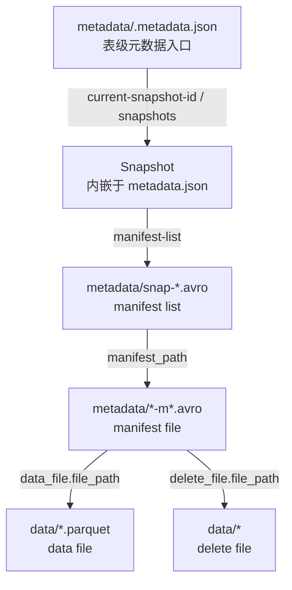
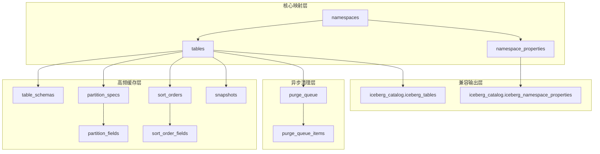

# GaussVector Iceberg Catalog 元信息表设计方案

## 1. 文档说明

本文档定义 GaussVector 单 Catalog 场景下的 Iceberg Catalog 元信息表设计方案。元信息表以 PostgreSQL extension 方式部署，在首期商用范围内提供当前指针维护、高频元数据缓存、CAS 提交、异步清理和 JDBC Catalog 兼容能力。

| 类型 | 范围 |
| --- | --- |
| 适用场景 | 单 Catalog；对象存储中的 `metadata.json` 作为 Iceberg 权威元信息；数据库保存当前指针、高频缓存和异步清理信息 |
| 暂不覆盖 | 多 Catalog、多租户隔离、文件级明细持久化、治理与血缘平台、执行引擎内部优化、操作审计、多版本 metadata 恢复 |

## 2. 背景与约束

Iceberg 的权威元信息位于对象存储中的 `metadata.json`。Catalog 数据库不应复制完整 Iceberg 元信息，而应稳定维护以下核心映射：

```text
namespace + table_name -> metadata_location
```

仅保存 `metadata_location` 可以满足最小正确性，但会增加 `load_table`、Schema 变更、Flush、查询规划和当前 Snapshot 定位的对象存储访问与 JSON 解析成本。因此，数据库额外保存高频缓存和异步清理信息。

### 2.1 Iceberg 元数据文件全景

Iceberg 元数据按职责分为以下四层：

| 层级 | 对象 | 主要职责 |
| --- | --- | --- |
| 表级入口层 | `metadata.json` | 作为 Iceberg 表的权威入口文件，记录表身份、表根路径、格式版本、当前 Schema、当前 Partition Spec、当前 Sort Order、当前 Snapshot 以及历史链路信息 |
| 版本组织层 | Snapshot、`snapshot-log`、`metadata-log` | 组织表级版本历史，描述当前版本、版本切换历史以及 metadata 文件演进链路 |
| 文件清单层 | manifest list、manifest file | 组织 Snapshot 引用的文件清单，记录数据文件、删除文件、分区信息和统计信息 |
| 数据文件层 | data file、delete file | 作为实际数据承载对象，保存业务数据和删除语义 |

文件引用关系可概括为：



本方案只持久化当前指针和高频缓存，不复制 manifest file、data file、delete file 明细。`metadata.json` 与数据库对象的映射如下：

| `metadata.json` 关键内容 | 作用 | 本方案对应字段或表 |
| --- | --- | --- |
| `table-uuid` | 表稳定身份 | `tables.table_uuid` |
| 当前 metadata 文件路径 | 当前权威入口 | `tables.metadata_location` |
| `last-sequence-number` | 当前表级最大提交序号 | `tables.last_sequence_number` |
| `current-schema-id` | 当前 Schema 指针 | `tables.current_schema_id` |
| `schemas` | Schema 历史集合 | `table_schemas` |
| `default-spec-id` | 当前分区规则指针 | `tables.default_spec_id` |
| `partition-specs` | 分区规则历史集合 | `partition_specs` + `partition_fields` |
| `default-sort-order-id` | 当前排序规则指针 | `tables.default_sort_order_id` |
| `sort-orders` | 排序规则历史集合 | `sort_orders` + `sort_order_fields` |
| `current-snapshot-id` | 当前 Snapshot 指针 | `tables.current_snapshot_id` |
| `snapshots` | Snapshot 历史集合 | `snapshots` |

其中，数据库缓存均为可重建派生数据。`snapshot-log` 与 `snapshots` 语义不等价：前者记录 current Snapshot 切换事件链，首期不单独持久化。

## 3. 设计原则

| 原则 | 说明 |
| --- | --- |
| 单 Catalog | 不设计 `catalog_instances`；底表不保存 `catalog_name`；兼容视图固定输出 `'default'` |
| 权威来源唯一 | 对象存储中的 `metadata.json` 是唯一权威来源；数据库中的结构缓存均可重建 |
| 缓存有边界 | 缓存 Schema、Partition Spec、Sort Order 和 Snapshot 摘要；不缓存 manifest、data file、delete file 明细 |
| CAS 提交 | 仅当当前 `metadata_location` 等于请求中的 `expected_metadata_location` 时提交新版本 |
| 事务解耦 | 对象存储写入与数据库事务不做分布式事务，失败后通过异步任务清理孤儿文件 |

表级提交采用以下执行模型：

```text
1. 事务外生成 metadata / data / manifest
2. 事务内更新数据库指针与缓存
3. 失败后异步清理孤儿文件
```

## 4. 首期范围边界

### 4.1 暂缓实现对象

| 对象 | 原因 |
| --- | --- |
| `catalog_instances` | 单 Catalog 场景不需要 |
| `snapshot_log` | 首期不要求查询 current Snapshot 切换事件链，暂不单独持久化 |
| `metadata_log` | 多版本 metadata 恢复能力暂不纳入首期 |
| `table_operation_log` | 操作审计能力暂不纳入首期 |
| `background_jobs` | 首期后台任务以异步清理为主 |
| `operation_locks` | 首期优先采用 CAS 和数据库锁 |
| `manifest_files` | 数据量大，不适合作为 Catalog 持久层 |
| `data_files` | 数据量大，不适合作为 Catalog 持久层 |
| `delete_files` | 数据量大，不适合作为 Catalog 持久层 |

### 4.2 索引操作边界

当前最小表集覆盖 Iceberg Catalog 主链路，不包含独立的业务索引元信息表。若首期索引操作只是数据库本地 `CREATE INDEX` / `DROP INDEX`，索引状态由 PostgreSQL 系统目录维护，无需在本方案中重复持久化。

若索引操作需要管理异步构建状态、索引文件位置、索引参数或与 Iceberg Snapshot 的绑定关系，则必须在索引接口契约明确后单独设计 `table_indexes` 表；该能力不能由现有 `tables` 或 `snapshots` 表替代。

## 5. 逻辑模型

### 5.1 总体分层与系统关系

Catalog 元信息模型由核心映射、高频缓存、异步清理和兼容输出四层组成：



## 6. 物理表设计

本章按“核心表 -> 高频缓存表 -> 异步清理表”的顺序展开，便于从主链路逐步理解整套模型。每张表均给出职责、字段说明、表说明和必要性。完整可执行 DDL 见第 10 章。

物理表建模遵循以下原则：

1. 需要按键查询、过滤、约束、独立更新或逐项执行的数据，拆分为普通列或明细表。
2. 仅作为 Iceberg 协议对象整体读取、整体返回和整体替换的数据，保留为 `JSONB`。
3. 对象存储中的 `metadata.json` 仍是权威来源，数据库中的结构缓存可以重建。

### 6.1 `namespaces`

#### 职责

1. 保存 Namespace 基本信息
2. 保存 Namespace 扩展属性
3. 作为 `tables` 的父对象

#### 表定义

```sql
CREATE TABLE iceberg_catalog.namespaces (
    namespace       TEXT PRIMARY KEY
);

CREATE TABLE iceberg_catalog.namespace_properties (
    namespace       TEXT NOT NULL,
    property_key    TEXT NOT NULL,
    property_value  TEXT NOT NULL,
    PRIMARY KEY (namespace, property_key),
    FOREIGN KEY (namespace)
        REFERENCES iceberg_catalog.namespaces(namespace)
        ON DELETE CASCADE
);
```

#### 字段说明

| 字段 | 类型 | 约束 | 使用场景 | 说明 |
| --- | --- | --- | --- | --- |
| `namespace` | `TEXT` | 主键，非空 | Namespace 创建、删除、查表归属、兼容视图查询 | Namespace 的唯一逻辑名称，是后续所有表对象进行归属和定位的基础键。 |

#### 表说明

`namespaces` 是 Catalog 的顶层逻辑对象表，只承载 Namespace 身份。Namespace 属性拆分到 `namespace_properties`，避免在主表中保存 JSONB。

#### 必要性

该表首期必须实现，原因如下：

1. Catalog 需要显式管理 Namespace 生命周期。
2. `tables` 需要稳定的父级归属关系。
3. 删除 Namespace 时需要依赖该表进行存在性和约束检查。

#### `namespace_properties`

#### 字段说明

| 字段 | 类型 | 约束 | 使用场景 | 说明 |
| --- | --- | --- | --- | --- |
| `namespace` | `TEXT` | 主键组成，外键 | Namespace 属性写入、删除和兼容视图查询 | 标识属性所属 Namespace。 |
| `property_key` | `TEXT` | 主键组成 | 按键更新属性、兼容视图输出 | Namespace 属性键，例如 `owner`、`comment`、`location`。 |
| `property_value` | `TEXT` | 非空 | 属性读取、兼容视图输出 | Namespace 属性值。Iceberg Namespace 属性本质为字符串键值对。 |

#### 表说明

`namespace_properties` 仅在需要 Namespace 属性接口或 JDBC 属性兼容视图时使用。采用键值子表后，可直接按属性键查询和更新，不需要解析 JSONB。

### 6.2 `tables`

#### 职责

1. 维护表逻辑身份
2. 维护当前 `metadata_location`
3. 维护当前摘要字段
4. 绑定本地 FDW 对象（可选）

#### 表定义

```sql
CREATE TABLE iceberg_catalog.tables (
    relid                       REGCLASS,
    namespace                   TEXT NOT NULL,
    table_name                  TEXT NOT NULL,
    table_uuid                  UUID NOT NULL,
    metadata_location           TEXT NOT NULL,
    last_sequence_number        BIGINT NOT NULL DEFAULT 0,
    current_schema_id           INT,
    current_snapshot_id         BIGINT,
    default_spec_id             INT,
    default_sort_order_id       INT,
    PRIMARY KEY (namespace, table_name),
    UNIQUE (table_uuid),
    UNIQUE (relid),
    FOREIGN KEY (namespace)
        REFERENCES iceberg_catalog.namespaces(namespace)
        ON DELETE RESTRICT
);
```

#### 字段说明

| 字段 | 类型 | 约束 | 使用场景 | 说明 |
| --- | --- | --- | --- | --- |
| `relid` | `REGCLASS` | 唯一，可空 | 本地 FDW 绑定、本地对象联动删除、内部对象映射 | 当 GaussVector 需要绑定数据库内本地 relation 时保留。纯外部 Iceberg 表通常没有本地对象，因此允许为空。 |
| `namespace` | `TEXT` | 非空，外键 | 表定位、按 Namespace 枚举、兼容视图输出 | 表所属 Namespace，与 `table_name` 共同构成 Catalog 逻辑主键。 |
| `table_name` | `TEXT` | 非空 | 表定位、对外查询、管理界面展示 | Catalog 侧逻辑表名，是大多数查询和兼容层直接使用的命名字段。 |
| `table_uuid` | `UUID` | 非空，唯一 | 注册表复用、跨重命名识别、稳定对象关联 | Iceberg 表稳定身份，必须来自 `metadata.json`，不能由数据库自行生成。 |
| `metadata_location` | `TEXT` | 非空 | `load_table`、`commit_table`、缓存修复、CAS 比较 | 当前生效的 `metadata.json` 路径，是 Catalog 正确性的核心指针字段。 |
| `last_sequence_number` | `BIGINT` | 非空，默认 `0` | V2 提交序号分配、Snapshot 序号校验、当前摘要读取 | 当前表级最大 sequence number。Iceberg V2 及以上提交需要维护；读取 V1 表时归一化为 `0`。 |
| `current_schema_id` | `INT` | 可空 | 当前列结构读取、`load_table` 响应、查询规划 | 指向当前生效的 Schema 版本，配合 `table_schemas` 快速获取列定义。 |
| `current_snapshot_id` | `BIGINT` | 可空 | 当前版本展示、写入结果返回、最近版本定位 | 指向当前生效 Snapshot；空表或尚未形成 Snapshot 的表允许为空。 |
| `default_spec_id` | `INT` | 可空 | Flush 写入、分区组织、查询规划 | 指向当前默认 Partition Spec，用于快速获取分区规则。 |
| `default_sort_order_id` | `INT` | 可空 | 当前排序规则读取、后续优化扩展 | 指向当前默认 Sort Order，要求与 `sort_orders` 缓存保持一致。 |

#### 表说明

`tables` 是整个元信息模型的核心表，负责保存表逻辑身份、当前 `metadata_location` 以及与当前版本相关的摘要字段。对外所有表级访问几乎都先命中该表，再决定是否读取缓存表或对象存储中的 `metadata.json`。

#### 必要性

该表首期必须实现，原因如下：

1. Catalog 正确性依赖 `namespace + table_name -> metadata_location` 的稳定映射。
2. `commit_table` 需要基于该表执行 CAS 提交。
3. `load_table` 需要从该表快速获取当前摘要字段。
4. 所有缓存表都需要通过 `table_uuid` 与该表关联。

#### 设计说明

1. 主键采用 `(namespace, table_name)`，而不是 `relid`
2. JDBC Catalog 兼容视图中的 `previous_metadata_location` 仅为保持列形状兼容，首期固定输出 `NULL`
3. 当前指针到缓存表的完整性约束在基础表创建后通过 `ALTER TABLE` 补充
4. `relid` 只是本地 relation 绑定信息，不作为权威身份；若本地 relation 被 `DROP`、重建或替换，应用必须同步清空或改写 `relid`，避免保留失效 OID
5. 首期不缓存 `last_updated_ms` 和表级 `properties`：前者不参与正确性，后者在当前接口范围内没有独立更新需求

### 6.3 高频缓存表

#### 6.3.1 `table_schemas`

```sql
CREATE TABLE iceberg_catalog.table_schemas (
    table_uuid          UUID NOT NULL,
    schema_id           INT NOT NULL,
    schema_json         JSONB NOT NULL,
    PRIMARY KEY (table_uuid, schema_id),
    FOREIGN KEY (table_uuid)
        REFERENCES iceberg_catalog.tables(table_uuid)
        ON DELETE CASCADE
);
```

| 字段 | 类型 | 约束 | 使用场景 | 说明 |
| --- | --- | --- | --- | --- |
| `table_uuid` | `UUID` | 主键组成，外键 | 按表加载 Schema、缓存关联、级联删除 | 标识该 Schema 记录属于哪张表，是缓存表的稳定关联键。 |
| `schema_id` | `INT` | 主键组成 | Schema 演进版本区分、当前 Schema 命中 | Iceberg Schema ID，用于区分不同版本的列结构。 |
| `schema_json` | `JSONB` | 非空 | `load_table` 返回、查询规划、加列校验 | 保存完整 Iceberg Schema。Schema 通常整体读取和替换，并且可能包含嵌套类型，因此保留协议结构比拆成字段明细表更直接。 |

#### 表说明

`table_schemas` 保存 Iceberg Schema 历史缓存，是 `tables.current_schema_id` 指向的目标表。`schema_json` 保留 Iceberg 协议原始结构，避免读取时重新拼装嵌套字段树。

#### 必要性

该表首期必须实现，原因如下：

1. `load_table` 高频返回当前 Schema。
2. 查询规划、字段展示和结构对比都依赖完整 Schema 定义。
3. `alter_table` 需要做 Schema 变更判断和缓存刷新。

#### 6.3.2 `partition_specs`

```sql
CREATE TABLE iceberg_catalog.partition_specs (
    table_uuid      UUID NOT NULL,
    spec_id         INT NOT NULL,
    PRIMARY KEY (table_uuid, spec_id),
    FOREIGN KEY (table_uuid)
        REFERENCES iceberg_catalog.tables(table_uuid)
        ON DELETE CASCADE
);

CREATE TABLE iceberg_catalog.partition_fields (
    table_uuid      UUID NOT NULL,
    spec_id         INT NOT NULL,
    field_id        INT NOT NULL,
    source_id       INT NOT NULL,
    field_name      TEXT NOT NULL,
    transform       TEXT NOT NULL,
    field_position  INT NOT NULL,
    PRIMARY KEY (table_uuid, spec_id, field_id),
    UNIQUE (table_uuid, spec_id, field_position),
    FOREIGN KEY (table_uuid, spec_id)
        REFERENCES iceberg_catalog.partition_specs(table_uuid, spec_id)
        ON DELETE CASCADE
);
```

| 字段 | 类型 | 约束 | 使用场景 | 说明 |
| --- | --- | --- | --- | --- |
| `table_uuid` | `UUID` | 主键组成，外键 | 按表读取分区规则、缓存关联、级联删除 | 标识该 Partition Spec 记录属于哪张表。 |
| `spec_id` | `INT` | 主键组成 | 分区规则版本区分、默认 Spec 命中 | Iceberg Partition Spec ID，用于区分不同分区规则版本。 |

#### 表说明

`partition_specs` 保存分区规则版本，是 `tables.default_spec_id` 指向的目标表。无分区表仍需要保留一条 Spec 主记录，但可以没有任何 `partition_fields` 明细。

##### `partition_fields`

**字段说明**

| 字段 | 类型 | 约束 | 使用场景 | 说明 |
| --- | --- | --- | --- | --- |
| `table_uuid` | `UUID` | 主键组成，外键组成 | 按表读取分区字段、级联删除 | 标识字段所属表。 |
| `spec_id` | `INT` | 主键组成，外键组成 | 按 Spec 版本读取字段 | 标识字段所属 Partition Spec。 |
| `field_id` | `INT` | 主键组成 | 分区字段稳定标识 | Iceberg Partition Field ID。 |
| `source_id` | `INT` | 非空 | 定位源列、校验 Schema 关联 | 对应 Schema 中的源 Field ID。 |
| `field_name` | `TEXT` | 非空 | 分区字段展示、协议对象还原 | 分区字段名称。 |
| `transform` | `TEXT` | 非空 | Flush 分区计算、查询规划 | Iceberg transform，例如 `identity`、`bucket[16]`、`day`。 |
| `field_position` | `INT` | 非空，Spec 内唯一 | 分区规则顺序还原 | 字段在 Partition Spec 中的顺序。 |

**表说明**

`partition_fields` 保存 Partition Spec 的字段明细。独立表能够自然表达多字段分区和无分区 Spec，也便于 Flush 与查询规划按 Spec 加载字段列表。

**独立明细表设计**

不建议把分区字段直接铺在 `partition_specs` 中，原因如下：

1. 一个 Partition Spec 可以包含多个分区字段，单行无法表达可变长度集合。
2. 无分区表也需要保留一条空 Spec 版本记录，不能依赖字段行表示 Spec 是否存在。
3. 如果让 `partition_specs` 每行表示一个分区字段，会重复保存 `table_uuid + spec_id`，弱化版本主表语义，并增加默认 Spec 外键设计复杂度。
4. 使用 `partition_specs` 作为版本主表、`partition_fields` 作为字段明细表，可以保持结构清晰，并支持后续按字段增加约束或索引。

#### 必要性

该表首期必须实现，原因如下：

1. Flush 写入需要当前默认分区规则。
2. 查询规划可能需要读取分区定义。
3. 分区规则数据量小、变更频率低，缓存收益高且一致性成本低。

#### 6.3.3 `sort_orders`

```sql
CREATE TABLE iceberg_catalog.sort_orders (
    table_uuid      UUID NOT NULL,
    order_id        INT NOT NULL,
    PRIMARY KEY (table_uuid, order_id),
    FOREIGN KEY (table_uuid)
        REFERENCES iceberg_catalog.tables(table_uuid)
        ON DELETE CASCADE
);

CREATE TABLE iceberg_catalog.sort_order_fields (
    table_uuid      UUID NOT NULL,
    order_id        INT NOT NULL,
    field_position  INT NOT NULL,
    source_id       INT NOT NULL,
    transform       TEXT NOT NULL,
    direction       TEXT NOT NULL,
    null_order      TEXT NOT NULL,
    PRIMARY KEY (table_uuid, order_id, field_position),
    FOREIGN KEY (table_uuid, order_id)
        REFERENCES iceberg_catalog.sort_orders(table_uuid, order_id)
        ON DELETE CASCADE,
    CHECK (direction IN ('asc', 'desc')),
    CHECK (null_order IN ('nulls-first', 'nulls-last'))
);
```

| 字段 | 类型 | 约束 | 使用场景 | 说明 |
| --- | --- | --- | --- | --- |
| `table_uuid` | `UUID` | 主键组成，外键 | 按表读取排序规则、缓存关联、级联删除 | 标识该 Sort Order 属于哪张表。 |
| `order_id` | `INT` | 主键组成 | 排序规则版本区分、默认 Sort Order 命中 | Iceberg Sort Order ID，用于区分不同排序策略。 |

#### 表说明

`sort_orders` 保存排序规则版本，是 `tables.default_sort_order_id` 指向的目标表。未配置排序规则时仍保留一条空 Sort Order 主记录。

##### `sort_order_fields`

**字段说明**

| 字段 | 类型 | 约束 | 使用场景 | 说明 |
| --- | --- | --- | --- | --- |
| `table_uuid` | `UUID` | 主键组成，外键组成 | 按表读取排序字段、级联删除 | 标识字段所属表。 |
| `order_id` | `INT` | 主键组成，外键组成 | 按 Sort Order 读取字段 | 标识字段所属 Sort Order。 |
| `field_position` | `INT` | 主键组成 | 排序规则顺序还原 | 字段在 Sort Order 中的顺序。 |
| `source_id` | `INT` | 非空 | 定位源列、校验 Schema 关联 | 对应 Schema 中的源 Field ID。 |
| `transform` | `TEXT` | 非空 | 排序键计算、查询规划 | Iceberg transform。 |
| `direction` | `TEXT` | 非空，枚举约束 | 排序规划 | 排序方向：`asc` 或 `desc`。 |
| `null_order` | `TEXT` | 非空，枚举约束 | 排序规划 | 空值顺序：`nulls-first` 或 `nulls-last`。 |

**表说明**

`sort_order_fields` 保存 Sort Order 的字段明细。独立表能够自然表达多字段排序和空 Sort Order，并支持查询规划按顺序加载排序键。

**独立明细表设计**

不建议把排序字段直接铺在 `sort_orders` 中，原因如下：

1. 一个 Sort Order 可以包含多个排序字段，单行无法表达可变长度集合。
2. 未配置排序规则时仍需要保留空 Sort Order 主记录。
3. 排序字段自身包含 `source_id`、`transform`、`direction` 和 `null_order`，需要按顺序参与查询规划。
4. 使用 `sort_orders` 作为版本主表、`sort_order_fields` 作为字段明细表，可以与 Partition Spec 保持一致的建模方式。

#### 必要性

该表首期必须实现，原因如下：

1. 主表已经保存 `default_sort_order_id`，需要有稳定的目标表承接。
2. Sort Order 数据规模小，落地成本低。
3. 后续排序写入、聚簇优化和执行层扩展会直接依赖该表。

#### 6.3.4 `snapshots`

```sql
CREATE TABLE iceberg_catalog.snapshots (
    table_uuid          UUID NOT NULL,
    snapshot_id         BIGINT NOT NULL,
    parent_snapshot_id  BIGINT,
    sequence_number     BIGINT NOT NULL,
    timestamp_ms        BIGINT NOT NULL,
    manifest_list       TEXT,
    operation           TEXT,
    PRIMARY KEY (table_uuid, snapshot_id),
    FOREIGN KEY (table_uuid)
        REFERENCES iceberg_catalog.tables(table_uuid)
        ON DELETE CASCADE
);
```

| 字段 | 类型 | 约束 | 使用场景 | 说明 |
| --- | --- | --- | --- | --- |
| `table_uuid` | `UUID` | 主键组成，外键 | 按表查询 Snapshot、缓存关联、级联删除 | 标识该 Snapshot 记录属于哪张表。 |
| `snapshot_id` | `BIGINT` | 主键组成 | 当前版本定位、历史版本查询 | Iceberg Snapshot 唯一标识。 |
| `parent_snapshot_id` | `BIGINT` | 可空 | 版本链路展示、回滚分析、Snapshot 过期处理 | 父 Snapshot ID。根 Snapshot 为空。考虑到缓存可能按窗口裁剪，不增加自引用外键。 |
| `sequence_number` | `BIGINT` | 非空 | V2 提交顺序、Manifest 继承语义、版本排序 | Iceberg V2 及以上用于标识表变更顺序的单调递增序号。读取 V1 表时由应用归一化为 `0`。 |
| `timestamp_ms` | `BIGINT` | 非空 | 最近提交排序、时间线展示、版本回溯 | Snapshot 的生成时间。 |
| `manifest_list` | `TEXT` | 可空 | 读取 Snapshot 文件清单、查询规划 | 指向该 Snapshot 的 manifest list 文件路径。Iceberg V2 快速路径直接使用该字段；旧格式缺失时回退解析 `metadata.json`。 |
| `operation` | `TEXT` | 可空 | 提交结果展示、版本解释、运维排障 | 从 Snapshot `summary.operation` 提取的常用摘要，例如 `append`、`replace`、`overwrite`、`delete`。完整 `summary` 不在首期重复持久化。 |

#### 表说明

`snapshots` 保存 Snapshot 摘要缓存，用于快速定位当前版本、展示版本链路、解释提交类型并获取 manifest list 入口。该表不是权威历史来源，而是数据库侧面向查询规划和运维的高价值缓存。

#### 必要性

该表首期必须实现，原因如下：

1. 当前 Snapshot 查询是高频路径。
2. 最近提交展示和写入结果回显都依赖 Snapshot 摘要。
3. 仅依赖 `metadata.json` 会显著增加对象存储访问与解析成本。

#### 说明

1. `snapshots` 是性能缓存表，不是权威历史来源；当前 Snapshot 统一由 `tables.current_snapshot_id` 指向
2. `snapshot_log` 与 `snapshots` 语义不等价；前者表示“某个 Snapshot 在何时成为 current”的事件链，后者保存 Snapshot 静态摘要与当前态
3. 首期查询重点是当前版本定位和最近提交展示，因此只落地 `snapshots`，暂不单独持久化 `snapshot_log`
4. 当需要支持回滚审计、时点回溯或分析 current Snapshot 切换历史时，再考虑引入 `snapshot_log`
5. 首期不缓存完整 `summary JSONB`，只提取高频使用的 `summary.operation`。`summary` 的统计键可扩展且不同操作不固定；后续需要直接展示提交统计或进行成本分析时再引入
6. 若明确支持 Iceberg V3 Row Lineage，再评估补充 `first_row_id`、`added_rows` 和 `key_id`

### 6.4 异步清理表

#### `purge_queue`

```sql
CREATE TABLE iceberg_catalog.purge_queue (
    id                  BIGSERIAL PRIMARY KEY,
    namespace           TEXT,
    table_name          TEXT,
    table_uuid          UUID,
    metadata_location   TEXT,
    purge_type          TEXT NOT NULL DEFAULT 'DROP_TABLE',
    status              TEXT NOT NULL DEFAULT 'PENDING',
    retry_count         INT NOT NULL DEFAULT 0,
    worker_id           TEXT,
    locked_at           TIMESTAMPTZ,
    created_at          TIMESTAMPTZ NOT NULL DEFAULT now(),
    CHECK (purge_type IN ('DROP_TABLE', 'ORPHAN_CLEANUP')),
    CHECK (status IN ('PENDING', 'RUNNING', 'SUCCEEDED', 'FAILED'))
);

CREATE TABLE iceberg_catalog.purge_queue_items (
    queue_id            BIGINT NOT NULL,
    item_id             BIGSERIAL,
    target_path         TEXT NOT NULL,
    target_type         TEXT NOT NULL,
    PRIMARY KEY (queue_id, item_id),
    FOREIGN KEY (queue_id)
        REFERENCES iceberg_catalog.purge_queue(id)
        ON DELETE CASCADE,
    CHECK (target_type IN ('FILE', 'PREFIX'))
);
```

| 字段 | 类型 | 约束 | 使用场景 | 说明 |
| --- | --- | --- | --- | --- |
| `id` | `BIGSERIAL` | 主键 | 任务调度、重试控制、运维查询 | 清理任务唯一标识。 |
| `namespace` | `TEXT` | 可空 | 按逻辑对象检索任务 | 清理目标所属 Namespace。CAS 失败产生的孤儿文件任务可以为空。 |
| `table_name` | `TEXT` | 可空 | 按逻辑对象检索任务 | 清理目标表名。CAS 失败产生的孤儿文件任务可以为空。 |
| `table_uuid` | `UUID` | 可空 | 稳定对象追踪 | 清理目标的稳定表身份。Catalog 记录删除后仍可用于问题定位。 |
| `metadata_location` | `TEXT` | 可空 | metadata 关联、失败定位 | 与清理任务关联的 metadata 文件路径。 |
| `purge_type` | `TEXT` | 非空，默认 `'DROP_TABLE'` | 任务分流、执行策略选择 | 区分整表删除清理和普通孤儿文件回收。 |
| `status` | `TEXT` | 非空，默认 `'PENDING'` | 调度、重试、监控 | 记录任务生命周期状态。 |
| `retry_count` | `INT` | 非空，默认 `0` | 重试次数控制、异常任务识别 | 记录当前任务已经尝试执行的次数。 |
| `worker_id` | `TEXT` | 可空 | 多 Worker 调度、节点归属识别 | 当前处理任务的 worker 或节点标识；任务待处理时为空。 |
| `locked_at` | `TIMESTAMPTZ` | 可空 | 抢锁超时判断、卡死任务识别 | 记录任务被锁定的时间；任务待处理时为空。 |
| `created_at` | `TIMESTAMPTZ` | 非空，默认 `now()` | 排序、延迟统计、超时判断 | 任务创建时间。 |

#### 表说明

`purge_queue` 是默认的异步清理任务主表，用于承载对象存储副作用治理任务。待删除对象拆分到 `purge_queue_items`，worker 不需要解析 JSONB。

##### `purge_queue_items`

**字段说明**

| 字段 | 类型 | 约束 | 使用场景 | 说明 |
| --- | --- | --- | --- | --- |
| `queue_id` | `BIGINT` | 主键组成，外键 | 任务关联、级联删除 | 标识该清理对象属于哪个任务。 |
| `item_id` | `BIGSERIAL` | 主键组成 | 清理对象唯一标识 | 系统自动生成的全局唯一 ID。同一任务内的 item 不保证连续，仅保证唯一。 |
| `target_path` | `TEXT` | 非空 | 对象存储删除 | 待删除文件路径或目录前缀。 |
| `target_type` | `TEXT` | 非空，枚举约束 | 选择删除策略 | `FILE` 表示删除单文件，`PREFIX` 表示按前缀删除。 |

**表说明**

`purge_queue_items` 保存 worker 实际执行的清理对象。任务入队时必须至少写入一条明细；该约束由应用事务保证。

#### 必要性

该表在“未引入外部统一任务系统”的前提下首期必须实现，原因如下：

1. 对象存储写入与数据库事务已经解耦，必须有异步清理能力兜底。
2. 失败场景会遗留 metadata、manifest、Parquet 等孤儿文件。
3. 商用环境要求清理任务可持久化、可重试、可追踪。

#### 说明

1. 首期必须具备异步清理能力
2. `purge_queue` 是默认实现，不是唯一实现方式
3. 如后续接入统一任务系统，可替换该物理表，但必须保留“可持久化、可重试、可追踪”的能力
4. 最大重试次数属于 worker 策略配置，不在单条任务中重复持久化

## 7. JDBC Catalog 兼容视图

### 7.1 `iceberg_tables`

```sql
CREATE OR REPLACE VIEW iceberg_catalog.iceberg_tables AS
SELECT
    'default'::TEXT AS catalog_name,
    namespace AS table_namespace,
    table_name,
    metadata_location,
    NULL::TEXT AS previous_metadata_location
FROM iceberg_catalog.tables;
```

| 输出列 | 来源 | 说明 |
| --- | --- | --- |
| `catalog_name` | 常量 `'default'` | 单 Catalog 兼容输出 |
| `table_namespace` | `tables.namespace` | Namespace |
| `table_name` | `tables.table_name` | 表名 |
| `metadata_location` | `tables.metadata_location` | 当前 metadata 文件 |
| `previous_metadata_location` | 常量 `NULL::TEXT` | 为保持 JDBC Catalog 列形状兼容而保留；首期不持久化上一版路径 |

### 7.2 `iceberg_namespace_properties`

```sql
CREATE OR REPLACE VIEW iceberg_catalog.iceberg_namespace_properties AS
SELECT
    'default'::TEXT AS catalog_name,
    namespace_properties.namespace,
    namespace_properties.property_key,
    namespace_properties.property_value
FROM iceberg_catalog.namespace_properties;
```

| 输出列 | 来源 | 说明 |
| --- | --- | --- |
| `catalog_name` | 常量 `'default'` | 单 Catalog 兼容输出 |
| `namespace` | `namespace_properties.namespace` | Namespace |
| `property_key` | `namespace_properties.property_key` | 属性键 |
| `property_value` | `namespace_properties.property_value` | 属性值 |

## 8. 核心操作流程

本章按表生命周期顺序说明主要流程，重点关注对象存储写入、数据库事务更新、缓存刷新和异步清理之间的边界。

### 8.1 `create_table`

1. 校验 Namespace
2. 事务外生成初始 `metadata.json`
3. 生成 `table_uuid`，解析 `last_sequence_number`、Schema、Spec、Sort Order 和 Snapshot
4. 事务内写入 `tables` 和缓存表
5. 需要时绑定本地对象

### 8.2 `register_table`

1. 输入现有 `metadata_location`
2. 读取并校验 `metadata.json`
3. 解析 `table_uuid`、`last_sequence_number`、Schema、Spec、Sort Order 和 Snapshot
4. 事务内写入 `tables` 和缓存表

关键要求：

```text
register_table 必须复用 metadata.json 中已有的 table_uuid
```

### 8.3 `load_table`

1. 查询 `tables`
2. 获取当前 `metadata_location` 与摘要字段
3. 优先从缓存表读取 Schema、Spec、Sort Order 和 Snapshot
4. 缓存缺失或校验失败时回退读取 `metadata.json`

### 8.4 `commit_table`

1. 读取当前 `metadata_location = L1`
2. 事务外生成新 metadata 文件 `L2`
3. 解析新 metadata
4. 事务内基于 `L1` 执行 CAS 更新
5. 成功后刷新摘要字段与缓存表
6. 失败时写入异步清理任务

核心 SQL：

```sql
UPDATE iceberg_catalog.tables
SET metadata_location = :new_metadata_location,
    last_sequence_number = :last_sequence_number,
    current_schema_id = :current_schema_id,
    current_snapshot_id = :current_snapshot_id,
    default_spec_id = :default_spec_id,
    default_sort_order_id = :default_sort_order_id
WHERE namespace = :namespace
  AND table_name = :table_name
  AND metadata_location = :expected_metadata_location;
```

### 8.5 `alter_table`

1. 读取当前 metadata
2. 事务外生成新 metadata
3. 事务内执行与 `commit_table` 相同的 CAS 与缓存刷新
4. 需要时同步本地对象结构

### 8.6 `flush_table`

1. 从 `tables` 读取当前摘要
2. 从 `partition_specs` 和 `partition_fields` 获取当前分区规则
3. 事务外写入 Parquet / manifest / metadata
4. 事务内执行 CAS 提交
5. 写入新的 `snapshots`
6. 失败时写入 `purge_queue`

### 8.7 `drop_table`

当 `purge = false` 时：

1. 删除 Catalog 记录
2. 删除本地对象绑定
3. 保留对象存储文件

当 `purge = true` 时：

1. 读取当前 `tables`、`snapshots` 等记录，预先收集待清理文件或目录前缀
2. 写入 `purge_queue` 和 `purge_queue_items`
3. 删除 Catalog 记录
4. 删除本地对象绑定

关键要求：

```text
drop purge 必须在删除 Catalog 记录前收集清理所需信息；不能依赖 CASCADE 删除后的残留数据再写入清理明细
```

## 9. 一致性与运维策略

### 9.1 数据库内部一致性

以下对象必须在同一事务内保持一致：

```text
tables.metadata_location
tables 当前摘要字段
table_schemas
partition_specs
partition_fields
sort_orders
sort_order_fields
snapshots
```

### 9.2 数据库与对象存储一致性

不做分布式事务，采用：

```text
对象存储先写入
数据库 CAS 提交
失败后异步清理
```

### 9.3 缓存修复

当缓存与 `metadata.json` 不一致时：

1. 读取 `tables.metadata_location`
2. 重新加载 `metadata.json`
3. 重新解析 Schema、Spec、Sort Order、Snapshot
4. 事务内刷新结构缓存表和 Snapshot 缓存

### 9.4 容量控制

默认建议：

1. `snapshots`：每表保留最近 100 条，或最近 100 条 + 最近 30 天

## 10. 可执行 DDL

以下 DDL 以 PostgreSQL 空库首次初始化为前提，可按顺序直接执行。兼容视图默认创建在 `iceberg_catalog` schema 下；如需暴露到 `public` 或 `pg_catalog`，应通过独立部署脚本处理。

```sql
CREATE SCHEMA IF NOT EXISTS iceberg_catalog;

CREATE TABLE iceberg_catalog.namespaces (
    namespace       TEXT PRIMARY KEY
);

CREATE TABLE iceberg_catalog.namespace_properties (
    namespace       TEXT NOT NULL,
    property_key    TEXT NOT NULL,
    property_value  TEXT NOT NULL,
    PRIMARY KEY (namespace, property_key),
    FOREIGN KEY (namespace)
        REFERENCES iceberg_catalog.namespaces(namespace)
        ON DELETE CASCADE
);

CREATE TABLE iceberg_catalog.tables (
    relid                       REGCLASS,
    namespace                   TEXT NOT NULL,
    table_name                  TEXT NOT NULL,
    table_uuid                  UUID NOT NULL,
    metadata_location           TEXT NOT NULL,
    last_sequence_number        BIGINT NOT NULL DEFAULT 0,
    current_schema_id           INT,
    current_snapshot_id         BIGINT,
    default_spec_id             INT,
    default_sort_order_id       INT,
    PRIMARY KEY (namespace, table_name),
    UNIQUE (table_uuid),
    UNIQUE (relid),
    FOREIGN KEY (namespace)
        REFERENCES iceberg_catalog.namespaces(namespace)
        ON DELETE RESTRICT
);

CREATE TABLE iceberg_catalog.table_schemas (
    table_uuid          UUID NOT NULL,
    schema_id           INT NOT NULL,
    schema_json         JSONB NOT NULL,
    PRIMARY KEY (table_uuid, schema_id),
    FOREIGN KEY (table_uuid)
        REFERENCES iceberg_catalog.tables(table_uuid)
        ON DELETE CASCADE
);

CREATE TABLE iceberg_catalog.partition_specs (
    table_uuid      UUID NOT NULL,
    spec_id         INT NOT NULL,
    PRIMARY KEY (table_uuid, spec_id),
    FOREIGN KEY (table_uuid)
        REFERENCES iceberg_catalog.tables(table_uuid)
        ON DELETE CASCADE
);

CREATE TABLE iceberg_catalog.partition_fields (
    table_uuid      UUID NOT NULL,
    spec_id         INT NOT NULL,
    field_id        INT NOT NULL,
    source_id       INT NOT NULL,
    field_name      TEXT NOT NULL,
    transform       TEXT NOT NULL,
    field_position  INT NOT NULL,
    PRIMARY KEY (table_uuid, spec_id, field_id),
    UNIQUE (table_uuid, spec_id, field_position),
    FOREIGN KEY (table_uuid, spec_id)
        REFERENCES iceberg_catalog.partition_specs(table_uuid, spec_id)
        ON DELETE CASCADE
);

CREATE TABLE iceberg_catalog.sort_orders (
    table_uuid      UUID NOT NULL,
    order_id        INT NOT NULL,
    PRIMARY KEY (table_uuid, order_id),
    FOREIGN KEY (table_uuid)
        REFERENCES iceberg_catalog.tables(table_uuid)
        ON DELETE CASCADE
);

CREATE TABLE iceberg_catalog.sort_order_fields (
    table_uuid      UUID NOT NULL,
    order_id        INT NOT NULL,
    field_position  INT NOT NULL,
    source_id       INT NOT NULL,
    transform       TEXT NOT NULL,
    direction       TEXT NOT NULL,
    null_order      TEXT NOT NULL,
    PRIMARY KEY (table_uuid, order_id, field_position),
    FOREIGN KEY (table_uuid, order_id)
        REFERENCES iceberg_catalog.sort_orders(table_uuid, order_id)
        ON DELETE CASCADE,
    CHECK (direction IN ('asc', 'desc')),
    CHECK (null_order IN ('nulls-first', 'nulls-last'))
);

CREATE TABLE iceberg_catalog.snapshots (
    table_uuid          UUID NOT NULL,
    snapshot_id         BIGINT NOT NULL,
    parent_snapshot_id  BIGINT,
    sequence_number     BIGINT NOT NULL,
    timestamp_ms        BIGINT NOT NULL,
    manifest_list       TEXT,
    operation           TEXT,
    PRIMARY KEY (table_uuid, snapshot_id),
    FOREIGN KEY (table_uuid)
        REFERENCES iceberg_catalog.tables(table_uuid)
        ON DELETE CASCADE
);

CREATE TABLE iceberg_catalog.purge_queue (
    id                  BIGSERIAL PRIMARY KEY,
    namespace           TEXT,
    table_name          TEXT,
    table_uuid          UUID,
    metadata_location   TEXT,
    purge_type          TEXT NOT NULL DEFAULT 'DROP_TABLE',
    status              TEXT NOT NULL DEFAULT 'PENDING',
    retry_count         INT NOT NULL DEFAULT 0,
    worker_id           TEXT,
    locked_at           TIMESTAMPTZ,
    created_at          TIMESTAMPTZ NOT NULL DEFAULT now(),
    CHECK (purge_type IN ('DROP_TABLE', 'ORPHAN_CLEANUP')),
    CHECK (status IN ('PENDING', 'RUNNING', 'SUCCEEDED', 'FAILED'))
);

CREATE TABLE iceberg_catalog.purge_queue_items (
    queue_id            BIGINT NOT NULL,
    item_id             BIGSERIAL,
    target_path         TEXT NOT NULL,
    target_type         TEXT NOT NULL,
    PRIMARY KEY (queue_id, item_id),
    FOREIGN KEY (queue_id)
        REFERENCES iceberg_catalog.purge_queue(id)
        ON DELETE CASCADE,
    CHECK (target_type IN ('FILE', 'PREFIX'))
);

ALTER TABLE iceberg_catalog.tables
ADD CONSTRAINT fk_tables_current_schema
FOREIGN KEY (table_uuid, current_schema_id)
REFERENCES iceberg_catalog.table_schemas(table_uuid, schema_id)
DEFERRABLE INITIALLY DEFERRED;

ALTER TABLE iceberg_catalog.tables
ADD CONSTRAINT fk_tables_default_spec
FOREIGN KEY (table_uuid, default_spec_id)
REFERENCES iceberg_catalog.partition_specs(table_uuid, spec_id)
DEFERRABLE INITIALLY DEFERRED;

ALTER TABLE iceberg_catalog.tables
ADD CONSTRAINT fk_tables_default_sort_order
FOREIGN KEY (table_uuid, default_sort_order_id)
REFERENCES iceberg_catalog.sort_orders(table_uuid, order_id)
DEFERRABLE INITIALLY DEFERRED;

ALTER TABLE iceberg_catalog.tables
ADD CONSTRAINT fk_tables_current_snapshot
FOREIGN KEY (table_uuid, current_snapshot_id)
REFERENCES iceberg_catalog.snapshots(table_uuid, snapshot_id)
DEFERRABLE INITIALLY DEFERRED;

CREATE INDEX idx_snapshots_table_time
ON iceberg_catalog.snapshots(table_uuid, timestamp_ms DESC);

CREATE INDEX idx_purge_queue_status
ON iceberg_catalog.purge_queue(status, created_at);

CREATE OR REPLACE VIEW iceberg_catalog.iceberg_tables AS
SELECT
    'default'::TEXT AS catalog_name,
    namespace AS table_namespace,
    table_name,
    metadata_location,
    NULL::TEXT AS previous_metadata_location
FROM iceberg_catalog.tables;

CREATE OR REPLACE VIEW iceberg_catalog.iceberg_namespace_properties AS
SELECT
    'default'::TEXT AS catalog_name,
    namespace_properties.namespace,
    namespace_properties.property_key,
    namespace_properties.property_value
FROM iceberg_catalog.namespace_properties;
```

## 11. Extension 安装与升级设计

第 10 章给出首次初始化 DDL，本章说明 PostgreSQL extension 的安装、升级和商用发布策略。

### 11.1 基本定位

`iceberg_catalog` 及其表、索引和视图是由 extension 管理的普通业务元信息对象，不属于 PostgreSQL 系统对象。若数据库中已存在同名 schema 或对象，extension 安装和升级可能失败。

本文以 `plugin_name` 代指实际 extension 名称，实现阶段替换为正式名称。

### 11.2 首期安装策略

1. `iceberg_catalog` 视为 extension 保留 schema
2. 安装前目标数据库中不应存在同名核心对象
3. 首期不支持自动接管既有 `iceberg_catalog.*` 对象
4. 若存在同名对象，应终止安装并人工迁移或清理

### 11.3 版本模型

1. extension 版本：通过 extension 升级脚本管理
2. 回填状态：如有必要，可通过轻量状态表记录异步回填进度

### 11.4 升级脚本组织方式

采用 PostgreSQL extension 标准升级机制：

1. 首次安装脚本：`plugin_name--1.0.sql`
2. 升级脚本：`plugin_name--1.0--1.1.sql`
3. 升级命令：`ALTER EXTENSION plugin_name UPDATE TO '1.1';`
4. 每个脚本只覆盖一个版本跃迁
5. 升级脚本只做结构变更和轻量初始化
6. 大规模回填通过升级后异步任务完成

### 11.5 稳定结构策略

1. `namespaces`、`namespace_properties`、`tables`、`table_schemas`、`partition_specs`、`partition_fields`、`sort_orders`、`sort_order_fields`、`snapshots`、`purge_queue`、`purge_queue_items` 发布后视为稳定结构
2. 小版本升级优先新增对象或新增可空列，避免删除列、重命名列和修改列类型
3. 批量修复、缓存重建和历史回填在升级后异步执行，避免升级脚本持有长事务

### 11.6 升级脚本边界

| 类型 | 操作 |
| --- | --- |
| 允许 | 新增表、新增可空列、新增索引、新增非破坏性约束、`CREATE OR REPLACE VIEW`、`GRANT`、`COMMENT`、少量静态配置修正 |
| 避免 | 大规模 `UPDATE` / `DELETE` / `INSERT`、删除列、重命名列、修改列类型、依赖全表扫描或长事务的数据修复 |

### 11.7 向后兼容与异步回填

升级顺序：

1. 先加新列、新表、新索引、新视图
2. 新代码兼容新旧结构
3. 异步回填历史数据
4. 验证稳定后再收紧约束或清理旧兼容逻辑

新增核心元信息结构时，优先增加并行表或补充表，通过兼容视图或运行时代码同时兼容新旧结构。历史缓存修复、状态回填和 `purge_queue_items` 补充等任务由运行时异步完成。

### 11.8 商用升级与失败处理

商用升级采用：

```text
forward-fix first
```

1. 不默认承诺自动 schema 回滚
2. 优先通过向后兼容 DDL、代码灰度和异步回填保证新版本可修复
3. 破坏性变更必须在维护窗口、备份完成、数据校验完成后执行

#### 升级前检查

至少检查：

1. 当前 extension 版本
2. `tables.current_*` 是否存在悬空指针
3. `purge_queue` 是否存在严重积压
4. 是否存在未完成回填任务
5. 备份或快照是否已完成

#### 失败分级处理

1. **DDL 事务内失败**：依赖 PostgreSQL 事务回滚，保留旧版本继续运行
2. **DDL 成功但回填失败**：不回滚 schema，记录失败状态并重试回填
3. **升级后运行时失败**：优先回退应用代码或兼容读逻辑，通过前向修复恢复

#### 验收基线

1. 升级前可备份
2. 升级中可检测
3. 升级后可验收
4. 失败后可前向修复
5. 破坏性变更有人工回退预案

## 12. 结论

### 12.1 方案收益

本方案在单 Catalog 场景下，以有限复杂度补齐了以下能力：

1. 当前元数据指针管理
2. 高频元数据缓存
3. Snapshot 查询加速
4. 异步清理
5. JDBC Catalog 兼容
6. extension 方式安装与升级

### 12.2 主要风险与应对

| 风险 | 应对 |
| --- | --- |
| `snapshots` 表膨胀 | 按数量或时间窗口裁剪 |
| 缓存不一致 | 以 `metadata.json` 为准并提供缓存修复 |
| 并发提交冲突 | `metadata_location` CAS |
| 对象存储孤儿文件 | 异步清理 |
| 升级失败 | 采用向后兼容 DDL + forward-fix first |
| 命名冲突 | `iceberg_catalog` 作为 extension 预留 schema |

### 12.3 推荐结论

建议首期采用本文定义的元信息表设计，并将其作为 PostgreSQL extension 管理的业务元信息 schema 落地。

首期建议实现：

```text
namespaces
namespace_properties
tables
table_schemas
partition_specs
partition_fields
sort_orders
sort_order_fields
snapshots
purge_queue
purge_queue_items
iceberg_catalog.iceberg_tables
iceberg_catalog.iceberg_namespace_properties
```

方案定位为：

```text
在单 Catalog 场景下，以最小商用复杂度满足 Iceberg Catalog 的正确性、性能、清理、兼容和 extension 升级要求。
```
