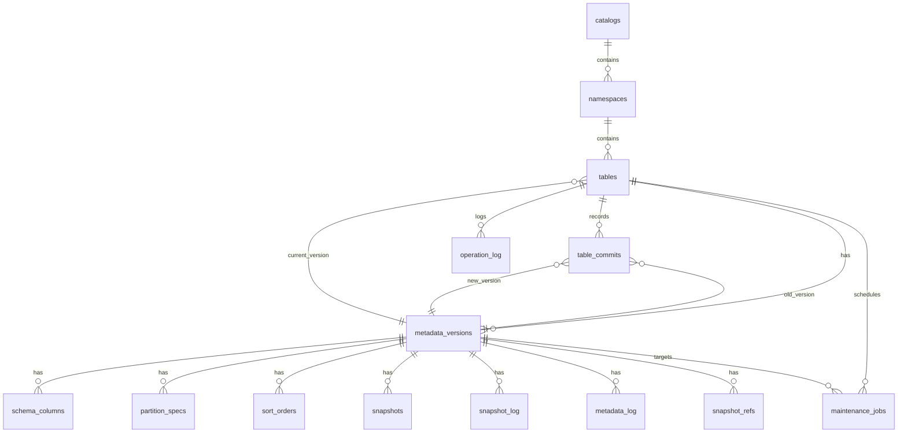

# Iceberg Catalog 元数据 Schema 设计

## 1. 设计原则

本文基于 `D:\project\postgres_extension_demo\METADATA_AND_FUNCTIONS.md` 的核心原则重新设计，但采用更明确的工程取舍：

1. `metadata.json` 仍然是 Iceberg 协议层的权威文件。
2. Iceberg Catalog 不能在常规查询路径上反复读取和解析 `metadata.json`。
3. 因此需要在 `create/register/commit` 时把 metadata 内容解析后持久化到数据库。
4. 数据库内不保存完整 `metadata.json` 原文，只保存少量摘要字段和结构化展开结果。
5. 能从外键关系稳定推导出来的字段，不在多张表重复保存。
6. `tables` 只保留 `current_metadata_version_id` 作为当前指针，当前 `metadata_location` 统一通过 `metadata_versions` 关联获取。

一句话概括：

```text
写入时解析，查询时读库；
存展开表和摘要字段，不存完整 metadata 原文；
能推导的字段不重复存。
```

## 2. 表分类

整套表分为 5 类：

| 分类 | 说明 | 表 |
|---|---|---|
| 基础注册层 | 维护当前 catalog / namespace / table 状态 | `catalogs`、`namespaces`、`tables` |
| 元数据版本层 | 保存每一版 metadata 的摘要字段 | `metadata_versions` |
| 元数据展开层 | 保存从 `metadata.json` 解析出的结构化内容 | `schema_columns`、`partition_specs`、`sort_orders`、`snapshots`、`snapshot_log`、`metadata_log`、`snapshot_refs` |
| 提交审计层 | 维护 commit 和操作日志 | `table_commits`、`operation_log` |
| 运维任务层 | 维护后台校验、修复、清理、重建任务 | `maintenance_jobs` |

## 3. 总体设计

### 3.1 为什么必须入库

如果每次 `load_table`、`describe_table`、`list_snapshots`、`show partitions` 都去对象存储读取并解析 `metadata.json`，会有几个明显问题：

1. 延迟高，且读路径依赖对象存储稳定性。
2. 大表 metadata 增长后，JSON 解析会成为热点。
3. `snapshot-log`、`metadata-log`、`refs`、schema 演进历史这类信息很难高效过滤和关联。
4. UI、系统视图、运维 SQL 都会重复做相同的解析工作。

因此采用：

```text
parse-on-write / parse-on-register
```

也就是：

1. 创建表时解析第一版 metadata。
2. 注册外部表时解析目标 metadata。
3. 每次 commit 新 metadata 时同步写入摘要和展开表。
4. 日常查询直接读数据库。

### 3.2 当前状态与历史版本分离

`iceberg_catalog.tables` 只保存当前生效状态。

`iceberg_catalog.metadata_versions` 保存每个 metadata 版本的摘要字段。

其余展开表全部通过 `metadata_version_id` 关联，表示“这些结构属于哪一版 metadata”。

其中：

1. schema 不再拆 `schema_defs`，直接以 `schema_columns` 承载。
2. snapshot 的 `summary` 直接保留在 `snapshots.summary JSONB`。
3. table `properties` 直接保留在 `metadata_versions.properties JSONB`。

这样处理的原因是：

1. `schema_defs` 只有版本内 `schema_id`，没有足够独立的信息密度。
2. `snapshot summary` 是否需要按 key 高频过滤，当前没有明确证据，先不拆 KV 表。
3. `properties` 通常是附加参数集合，直接保留 JSONB 更符合“少拆表”的原则。

### 3.3 当前状态主表只保留最小必要字段

`tables` 只回答两类问题：

1. 这张表当前是谁。
2. 这张表当前指向哪一个 metadata 版本。

凡是能通过 `current_metadata_version_id` 推导出来的字段，都不再塞回主表。

### 3.4 一致性边界

这里有一条必须明确的边界：

1. `tables.current_metadata_version_id` 只能指向 `metadata_versions.version_status = 'committed'` 的版本。

这条边界保证未提交版本不会进入对外可见状态。

工程上建议通过以下两种方式之一保证：

1. 在提交事务内同时更新 `tables` 与 `metadata_versions`
2. 增加 deferred trigger，在事务提交前校验上述条件

推荐直接采用第 2 种，把一致性规则固化到库内。这样即使上层实现遗漏，也不会把未提交版本暴露为当前版本。

示意实现如下：

```sql
CREATE OR REPLACE FUNCTION iceberg_catalog.check_current_metadata_consistency()
RETURNS trigger
LANGUAGE plpgsql
AS $$
DECLARE
    v_version_status TEXT;
BEGIN
    IF NEW.current_metadata_version_id IS NULL THEN
        RETURN NEW;
    END IF;

    SELECT mv.version_status
      INTO v_version_status
      FROM iceberg_catalog.metadata_versions mv
     WHERE mv.metadata_version_id = NEW.current_metadata_version_id;

    IF v_version_status IS DISTINCT FROM 'committed' THEN
        RAISE EXCEPTION 'current_metadata_version_id must reference a committed metadata version';
    END IF;

    RETURN NEW;
END;
$$;

CREATE CONSTRAINT TRIGGER trg_check_current_metadata_consistency
AFTER INSERT OR UPDATE OF current_metadata_version_id
ON iceberg_catalog.tables
DEFERRABLE INITIALLY DEFERRED
FOR EACH ROW
EXECUTE FUNCTION iceberg_catalog.check_current_metadata_consistency();
```

## 4. 表设计

---

## 5.1 `iceberg_catalog.catalogs`

### 表用途

维护 catalog 级别信息。

### 字段分类

1. 标识字段：`catalog_id`、`catalog_name`，用于唯一标识和命名 catalog。
2. 类型与状态字段：`catalog_type`、`state`，用于表达 catalog 形态和可用状态。
3. 配置字段：`storage_root`、`properties`，用于表达存储根路径和扩展参数。
4. 审计字段：`created_at`、`updated_at`，用于记录创建和变更时间。

### 字段说明

| 字段 | 类型 | 说明 |
|---|---|---|
| `catalog_id` | `BIGINT` | 主键，唯一标识一条 catalog 记录 |
| `catalog_name` | `TEXT` | catalog 的业务名称，在系统内要求唯一 |
| `catalog_type` | `TEXT` | catalog 的实现类型，用于区分内部 catalog、REST catalog 等接入形态 |
| `state` | `TEXT` | catalog 的当前状态，用于控制是否可读、可写或处于下线流程中 |
| `storage_root` | `TEXT` | catalog 默认使用的对象存储根路径，用作 namespace / table 路径规划基础 |
| `properties` | `JSONB` | catalog 级扩展参数，用于保存实现相关但不适合拆列的配置项 |
| `created_at` | `TIMESTAMPTZ` | 该 catalog 记录的创建时间 |
| `updated_at` | `TIMESTAMPTZ` | 该 catalog 记录最近一次更新时间 |

### DDL

```sql
CREATE TABLE iceberg_catalog.catalogs (
    catalog_id       BIGINT GENERATED ALWAYS AS IDENTITY PRIMARY KEY,
    catalog_name     TEXT NOT NULL,
    catalog_type     TEXT NOT NULL DEFAULT 'INTERNAL'
                     CHECK (catalog_type IN ('INTERNAL', 'REST', 'JDBC', 'FEDERATED')),
    state            TEXT NOT NULL DEFAULT 'ACTIVE'
                     CHECK (state IN ('ACTIVE', 'READ_ONLY', 'DISABLED', 'DROPPING')),
    storage_root     TEXT NOT NULL,
    properties       JSONB NOT NULL DEFAULT '{}'::jsonb,
    created_at       TIMESTAMPTZ NOT NULL DEFAULT NOW(),
    updated_at       TIMESTAMPTZ NOT NULL DEFAULT NOW(),
    CONSTRAINT uq_iceberg_catalog_catalogs_name UNIQUE (catalog_name)
);
```

## 5.2 `iceberg_catalog.namespaces`

### 表用途

维护 namespace 的逻辑定义和路径。

当前设计保留 `properties JSONB`，并通过兼容视图 `iceberg_namespace_properties` 使用 `jsonb_each_text` 展开。
如果后续 namespace 属性查询成为热点，再考虑拆分独立 KV 表。

### 字段分类

1. 标识字段：`namespace_id`、`namespace_name`，用于唯一标识和命名 namespace。
2. 归属字段：`catalog_id`，用于表达 namespace 隶属哪个 catalog。
3. 路径与配置字段：`namespace_path`、`properties`，用于表达路径前缀和扩展参数。
4. 审计字段：`created_at`、`updated_at`，用于记录创建和变更时间。

### 字段说明

| 字段 | 类型 | 说明 |
|---|---|---|
| `namespace_id` | `BIGINT` | 主键，唯一标识一条 namespace 记录 |
| `catalog_id` | `BIGINT` | 外键，指向所属的 catalog |
| `namespace_name` | `TEXT` | namespace 名称，在同一个 catalog 内要求唯一 |
| `namespace_path` | `TEXT` | namespace 对应的对象存储路径前缀，用于组织表路径 |
| `properties` | `JSONB` | namespace 级扩展参数，用于保存配额、标签或自定义配置 |
| `created_at` | `TIMESTAMPTZ` | 该 namespace 记录的创建时间 |
| `updated_at` | `TIMESTAMPTZ` | 该 namespace 记录最近一次更新时间 |

### DDL

```sql
CREATE TABLE iceberg_catalog.namespaces (
    namespace_id       BIGINT GENERATED ALWAYS AS IDENTITY PRIMARY KEY,
    catalog_id         BIGINT NOT NULL
                       REFERENCES iceberg_catalog.catalogs(catalog_id) ON DELETE RESTRICT,
    namespace_name     TEXT NOT NULL,
    namespace_path     TEXT NOT NULL,
    properties         JSONB NOT NULL DEFAULT '{}'::jsonb,
    created_at         TIMESTAMPTZ NOT NULL DEFAULT NOW(),
    updated_at         TIMESTAMPTZ NOT NULL DEFAULT NOW(),
    CONSTRAINT uq_iceberg_catalog_namespaces_name UNIQUE (catalog_id, namespace_name)
);

CREATE INDEX idx_iceberg_catalog_namespaces_catalog
    ON iceberg_catalog.namespaces(catalog_id);
```

---

## 5.3 `iceberg_catalog.tables`

### 表用途

维护当前生效状态，是 Catalog 的当前视图主表。
其中 `management_mode` 只表达 Catalog 是否拥有底层数据和 metadata 文件的生命周期管理权；
表的接入来源和写入来源由 `metadata_versions.ingest_source`、`table_commits.commit_kind` 表达。

### 字段分类

1. 标识字段：`table_id`、`table_name`、`table_uuid`，用于唯一标识 Iceberg 表。
2. 归属与绑定字段：`namespace_id`、`bound_relation`，用于表达表归属和本地关系绑定。
3. 形态与生命周期字段：`table_kind`、`management_mode`、`state`，用于表达表类型、生命周期管理权和当前状态。
4. 当前指针字段：`current_metadata_version_id`，用于表达当前生效 metadata 版本。
5. 审计字段：`created_by`、`updated_by`、`created_at`、`updated_at`，用于记录操作人和时间。

### 字段说明

| 字段 | 类型 | 说明 |
|---|---|---|
| `table_id` | `BIGINT` | 主键，唯一标识一张 Iceberg 表 |
| `namespace_id` | `BIGINT` | 外键，指向所属的 namespace |
| `table_name` | `TEXT` | 表名，在同一个 namespace 内要求唯一 |
| `table_uuid` | `UUID` | Iceberg 协议中的 table uuid，用于跨系统识别同一张表 |
| `bound_relation` | `REGCLASS` | 可选的本地关系对象绑定，用于把 catalog 表映射到本地关系对象 |
| `table_kind` | `TEXT` | 表对象类型，当前设计仅支持 `TABLE` |
| `management_mode` | `TEXT` | 生命周期管理模式，用于区分 Catalog 是否负责底层数据和 metadata 文件的生命周期管理 |
| `state` | `TEXT` | 表的当前状态，用于表达正常、只读、删除中、异常等运行状态 |
| `current_metadata_version_id` | `BIGINT` | 外键，指向当前对外生效的 metadata 版本 |
| `created_by` | `TEXT` | 创建该表记录的用户或系统主体 |
| `updated_by` | `TEXT` | 最近一次更新该表记录的用户或系统主体 |
| `created_at` | `TIMESTAMPTZ` | 该表记录的创建时间 |
| `updated_at` | `TIMESTAMPTZ` | 该表记录最近一次更新时间 |

### DDL

```sql
CREATE TABLE iceberg_catalog.tables (
    table_id                      BIGINT GENERATED ALWAYS AS IDENTITY PRIMARY KEY,
    namespace_id                  BIGINT NOT NULL
                                  REFERENCES iceberg_catalog.namespaces(namespace_id) ON DELETE RESTRICT,
    table_name                    TEXT NOT NULL,
    table_uuid                    UUID NOT NULL DEFAULT gen_random_uuid(),
    bound_relation                REGCLASS,
    table_kind                    TEXT NOT NULL DEFAULT 'TABLE'
                                  CHECK (table_kind = 'TABLE'),
    management_mode               TEXT NOT NULL DEFAULT 'MANAGED'
                                  CHECK (management_mode IN ('MANAGED', 'EXTERNAL')),
    state                         TEXT NOT NULL DEFAULT 'ACTIVE'
                                  CHECK (state IN ('ACTIVE', 'STAGED', 'READ_ONLY', 'DROPPING', 'DROPPED', 'ERROR')),
    current_metadata_version_id   BIGINT,
    created_by                    TEXT,
    updated_by                    TEXT,
    created_at                    TIMESTAMPTZ NOT NULL DEFAULT NOW(),
    updated_at                    TIMESTAMPTZ NOT NULL DEFAULT NOW(),
    CONSTRAINT uq_iceberg_catalog_tables_name UNIQUE (namespace_id, table_name),
    CONSTRAINT uq_iceberg_catalog_tables_uuid UNIQUE (table_uuid)
);

CREATE UNIQUE INDEX uq_iceberg_catalog_tables_bound_relation
    ON iceberg_catalog.tables(bound_relation)
    WHERE bound_relation IS NOT NULL;

CREATE INDEX idx_iceberg_catalog_tables_namespace
    ON iceberg_catalog.tables(namespace_id);
```

---

## 5.3A 兼容视图

### 视图用途

为了兼容 Iceberg JDBC Catalog 的典型访问方式，保留两张只读兼容视图：

1. `iceberg_tables`
2. `iceberg_namespace_properties`

### `iceberg_tables`

`previous_metadata_location` 不在主表中持久化，而是通过最近一次提交记录里的 `old_metadata_version_id` 反查得到。
如果旧版本已被清理（`old_metadata_version_id` 置为 NULL），则自动回落至更早的有效记录。

```sql
CREATE OR REPLACE VIEW iceberg_tables AS
WITH latest_prev AS (
    SELECT DISTINCT ON (tc.table_id)
        tc.table_id,
        mv_old.metadata_location AS previous_metadata_location
    FROM iceberg_catalog.table_commits tc
    JOIN iceberg_catalog.metadata_versions mv_old
      ON mv_old.metadata_version_id = tc.old_metadata_version_id
    ORDER BY tc.table_id, tc.committed_at DESC
)
SELECT
    c.catalog_name                         AS catalog_name,
    n.namespace_name                       AS table_namespace,
    t.table_name                           AS table_name,
    mv_cur.metadata_location               AS metadata_location,
    lp.previous_metadata_location          AS previous_metadata_location,
    'TABLE'::TEXT                          AS iceberg_type
FROM iceberg_catalog.tables t
JOIN iceberg_catalog.namespaces n
  ON n.namespace_id = t.namespace_id
JOIN iceberg_catalog.catalogs c
  ON c.catalog_id = n.catalog_id
JOIN iceberg_catalog.metadata_versions mv_cur
  ON mv_cur.metadata_version_id = t.current_metadata_version_id
LEFT JOIN latest_prev lp
  ON lp.table_id = t.table_id;
```

这个写法避免了按表逐行执行 `LATERAL` 子查询，更适合作为兼容视图长期使用。

### `iceberg_namespace_properties`

继续保留 `namespaces.properties JSONB`，并通过 `jsonb_each_text` 展开成 KV 兼容格式：

```sql
CREATE OR REPLACE VIEW iceberg_namespace_properties AS
SELECT
    c.catalog_name         AS catalog_name,
    n.namespace_name       AS namespace,
    p.key                  AS property_key,
    p.value                AS property_value
FROM iceberg_catalog.namespaces n
JOIN iceberg_catalog.catalogs c
  ON c.catalog_id = n.catalog_id
CROSS JOIN LATERAL jsonb_each_text(n.properties) AS p(key, value);
```

---

## 5.4 `iceberg_catalog.metadata_versions`

### 表用途

保存每一版 metadata 的摘要字段，不保存完整 `metadata.json` 原文。
同时通过 `version_status` 区分该版本是否只是已解析、已提交、已中止或已孤儿化。

### 字段分类

1. 标识字段：`metadata_version_id`、`table_id`、`version_no`，用于标识某张表的一版 metadata。
2. 文件与布局字段：`metadata_location`、`table_location`、`format_version`，用于表达 metadata 文件位置和表布局版本。
3. 摘要字段：`last_sequence_number`、`last_updated_ms`、`last_column_id`、`last_partition_id`、`current_schema_id`、`current_snapshot_id`、`default_spec_id`、`default_sort_order_id`，用于保存高频读取的 metadata 摘要。
4. 状态与来源字段：`version_status`、`ingest_source`、`content_hash`，用于表达版本生命周期状态和写入来源。
5. 配置与审计字段：`properties`、`ingested_at`，用于保存表属性和入库时间。

### 字段说明

| 字段 | 类型 | 说明 |
|---|---|---|
| `metadata_version_id` | `BIGINT` | 主键，唯一标识一版已入库的 metadata |
| `table_id` | `BIGINT` | 外键，指向该 metadata 所属的表 |
| `version_no` | `INTEGER` | 表内递增版本号，用于表达 metadata 演进顺序 |
| `metadata_location` | `TEXT` | 该版本 metadata 文件在对象存储中的完整路径 |
| `format_version` | `INTEGER` | Iceberg format version，用于区分 v1 / v2 元数据语义 |
| `table_location` | `TEXT` | metadata 中声明的表根路径 |
| `last_sequence_number` | `BIGINT` | metadata 摘要字段，表示当前已分配到的最大 sequence number |
| `last_updated_ms` | `BIGINT` | metadata 摘要字段，表示该版本 metadata 的更新时间戳 |
| `last_column_id` | `INTEGER` | metadata 摘要字段，表示当前已分配到的最大 column id |
| `last_partition_id` | `INTEGER` | metadata 摘要字段，Iceberg v2 下用于记录当前已分配到的最大 partition field id |
| `current_schema_id` | `INTEGER` | metadata 摘要字段，表示当前生效的 schema id |
| `current_snapshot_id` | `BIGINT` | metadata 摘要字段，表示当前生效的 snapshot id |
| `default_spec_id` | `INTEGER` | metadata 摘要字段，表示默认使用的 partition spec id |
| `default_sort_order_id` | `INTEGER` | metadata 摘要字段，表示默认使用的 sort order id |
| `version_status` | `TEXT` | 该 metadata 版本的生命周期状态，用于区分 `pending`、`committed`、`aborted`、`orphaned` |
| `properties` | `JSONB` | 该版本 metadata 中的 table properties 集合 |
| `content_hash` | `TEXT` | metadata 内容哈希，用于重复写入识别、校验或故障排查 |
| `ingest_source` | `TEXT` | 该版本写入库内的来源动作，如 `CREATE`、`REGISTER`、`COMMIT`、`REBUILD` |
| `ingested_at` | `TIMESTAMPTZ` | 该 metadata 版本完成入库的时间 |

### DDL

```sql
CREATE TABLE iceberg_catalog.metadata_versions (
    metadata_version_id      BIGINT GENERATED ALWAYS AS IDENTITY PRIMARY KEY,
    table_id                 BIGINT NOT NULL
                             REFERENCES iceberg_catalog.tables(table_id) ON DELETE CASCADE,
    version_no               INTEGER NOT NULL,
    metadata_location        TEXT NOT NULL,
    format_version           INTEGER NOT NULL
                             CHECK (format_version IN (1, 2)),
    table_location           TEXT NOT NULL,
    last_sequence_number     BIGINT,
    last_updated_ms          BIGINT,
    last_column_id           INTEGER,
    last_partition_id        INTEGER,
    current_schema_id        INTEGER,
    current_snapshot_id      BIGINT,
    default_spec_id          INTEGER,
    default_sort_order_id    INTEGER,
    version_status           TEXT NOT NULL DEFAULT 'pending'
                             CHECK (version_status IN ('pending', 'committed', 'aborted', 'orphaned')),
    properties               JSONB NOT NULL DEFAULT '{}'::jsonb,
    content_hash             TEXT,
    ingest_source            TEXT NOT NULL
                             CHECK (ingest_source IN ('CREATE', 'REGISTER', 'COMMIT', 'REBUILD')),
    ingested_at              TIMESTAMPTZ NOT NULL DEFAULT NOW(),
    CONSTRAINT ck_iceberg_catalog_metadata_versions_v2_partition
        CHECK (
            (format_version = 1)
            OR (format_version = 2 AND last_partition_id IS NOT NULL)
        ),
    CONSTRAINT uq_iceberg_catalog_metadata_versions_no UNIQUE (table_id, version_no),
    CONSTRAINT uq_iceberg_catalog_metadata_versions_loc UNIQUE (table_id, metadata_location)
);

CREATE INDEX idx_iceberg_catalog_metadata_versions_table_version
    ON iceberg_catalog.metadata_versions(table_id, version_no DESC);

CREATE INDEX idx_iceberg_catalog_metadata_versions_table_status
    ON iceberg_catalog.metadata_versions(table_id, version_status, version_no DESC);

ALTER TABLE iceberg_catalog.tables
ADD CONSTRAINT fk_iceberg_catalog_tables_current_metadata_version
FOREIGN KEY (current_metadata_version_id)
REFERENCES iceberg_catalog.metadata_versions(metadata_version_id)
ON DELETE RESTRICT
DEFERRABLE INITIALLY DEFERRED;
```

---

## 5.5 `iceberg_catalog.schema_columns`

### 表用途

按列展开 schema，用于 `DESCRIBE TABLE`、列检索和 schema 对比。

### 字段分类

1. 归属字段：`metadata_version_id`、`schema_id`，用于表达这些列属于哪一版 schema。
2. 列标识字段：`column_id`、`parent_column_id`、`column_name`、`full_path`，用于表达列层级和路径。
3. 列定义字段：`data_type`、`is_nullable`、`ordinal_position`、`doc_text`，用于表达列类型、顺序和注释。

### 字段说明

| 字段 | 类型 | 说明 |
|---|---|---|
| `metadata_version_id` | `BIGINT` | 外键，指向所属的 metadata 版本 |
| `schema_id` | `INTEGER` | 该列所属的 schema id |
| `column_id` | `INTEGER` | Iceberg 协议中的 column id，在同一 schema 内唯一 |
| `parent_column_id` | `INTEGER` | 父列的 column id，用于表达 struct / nested field 层级关系 |
| `column_name` | `TEXT` | 当前层级的列名，不含父路径 |
| `full_path` | `TEXT` | 列的完整路径，用于快速做列检索和层级展示 |
| `data_type` | `TEXT` | 列类型的文本化表示，保留解析后的类型信息 |
| `is_nullable` | `BOOLEAN` | 列是否允许为 NULL |
| `ordinal_position` | `INTEGER` | 列在当前 schema 中的显示顺序或定义顺序 |
| `doc_text` | `TEXT` | 列注释或文档说明 |

### DDL

```sql
CREATE TABLE iceberg_catalog.schema_columns (
    metadata_version_id   BIGINT NOT NULL,
    schema_id             INTEGER NOT NULL,
    column_id             INTEGER NOT NULL,
    parent_column_id      INTEGER,
    column_name           TEXT NOT NULL,
    full_path             TEXT NOT NULL,
    data_type             TEXT NOT NULL,
    is_nullable           BOOLEAN NOT NULL DEFAULT TRUE,
    ordinal_position      INTEGER NOT NULL,
    doc_text              TEXT,
    PRIMARY KEY (metadata_version_id, schema_id, column_id),
    CONSTRAINT fk_iceberg_catalog_schema_columns_metadata_version
        FOREIGN KEY (metadata_version_id)
        REFERENCES iceberg_catalog.metadata_versions(metadata_version_id)
        ON DELETE CASCADE
);

CREATE INDEX idx_iceberg_catalog_schema_columns_path
    ON iceberg_catalog.schema_columns(metadata_version_id, full_path);
```

---

## 5.6 `iceberg_catalog.partition_specs`

### 表用途

展开 `partition-specs`。

### 字段分类

1. 归属字段：`metadata_version_id`、`spec_id`，用于表达这些分区定义属于哪一版 spec。
2. 分区字段标识：`field_id`、`source_column_id`、`source_column_name`，用于标识分区字段和来源列。
3. 分区定义字段：`partition_name`、`transform_expr`、`ordinal_position`，用于表达分区名、变换和顺序。

### 字段说明

| 字段 | 类型 | 说明 |
|---|---|---|
| `metadata_version_id` | `BIGINT` | 外键，指向所属的 metadata 版本 |
| `spec_id` | `INTEGER` | partition spec 的标识符 |
| `field_id` | `INTEGER` | spec 内部分区字段的标识符 |
| `source_column_id` | `INTEGER` | 该分区字段来源的列 id |
| `source_column_name` | `TEXT` | 该分区字段来源的列名，便于直接展示和排查 |
| `partition_name` | `TEXT` | 分区字段在 spec 中的名称 |
| `transform_expr` | `TEXT` | 对来源列应用的分区变换表达式 |
| `ordinal_position` | `INTEGER` | 分区字段在当前 spec 中的定义顺序 |

### DDL

```sql
CREATE TABLE iceberg_catalog.partition_specs (
    metadata_version_id   BIGINT NOT NULL
                          REFERENCES iceberg_catalog.metadata_versions(metadata_version_id) ON DELETE CASCADE,
    spec_id               INTEGER NOT NULL,
    field_id              INTEGER NOT NULL,
    source_column_id      INTEGER NOT NULL,
    source_column_name    TEXT NOT NULL,
    partition_name        TEXT NOT NULL,
    transform_expr        TEXT NOT NULL,
    ordinal_position      INTEGER NOT NULL,
    PRIMARY KEY (metadata_version_id, spec_id, field_id)
);
```

---

## 5.7 `iceberg_catalog.sort_orders`

### 表用途

展开 `sort-orders`。

### 字段分类

1. 归属字段：`metadata_version_id`、`sort_order_id`，用于表达这些排序定义属于哪一版 sort order。
2. 排序字段标识：`field_seq`、`source_column_id`、`source_column_name`，用于标识排序字段和顺序。
3. 排序规则字段：`transform_expr`、`sort_direction`、`null_order`，用于表达排序变换和空值排序规则。

### 字段说明

| 字段 | 类型 | 说明 |
|---|---|---|
| `metadata_version_id` | `BIGINT` | 外键，指向所属的 metadata 版本 |
| `sort_order_id` | `INTEGER` | sort order 的标识符 |
| `field_seq` | `INTEGER` | 排序字段在当前 sort order 中的顺序号 |
| `source_column_id` | `INTEGER` | 该排序字段来源的列 id |
| `source_column_name` | `TEXT` | 该排序字段来源的列名，便于直接展示 |
| `transform_expr` | `TEXT` | 对来源列应用的排序变换表达式 |
| `sort_direction` | `TEXT` | 排序方向，取值为升序或降序 |
| `null_order` | `TEXT` | 空值排序规则，表示 NULL 在排序结果中的相对位置 |

### DDL

```sql
CREATE TABLE iceberg_catalog.sort_orders (
    metadata_version_id   BIGINT NOT NULL
                          REFERENCES iceberg_catalog.metadata_versions(metadata_version_id) ON DELETE CASCADE,
    sort_order_id         INTEGER NOT NULL,
    field_seq             INTEGER NOT NULL,
    source_column_id      INTEGER NOT NULL,
    source_column_name    TEXT NOT NULL,
    transform_expr        TEXT NOT NULL,
    sort_direction        TEXT NOT NULL
                          CHECK (sort_direction IN ('asc', 'desc')),
    null_order            TEXT NOT NULL
                          CHECK (null_order IN ('nulls-first', 'nulls-last')),
    PRIMARY KEY (metadata_version_id, sort_order_id, field_seq)
);
```

---

## 5.8 `iceberg_catalog.snapshots`

### 表用途

展开 `snapshots` 数组。

### 字段分类

1. 归属字段：`metadata_version_id`、`snapshot_id`，用于标识某版 metadata 下的一个 snapshot。
2. 快照血缘字段：`parent_snapshot_id`、`sequence_number`、`timestamp_ms`，用于表达快照链路和时间序列。
3. 快照内容字段：`schema_id`、`manifest_list`、`summary`，用于表达快照对应 schema、manifest 和摘要信息。

### 字段说明

| 字段 | 类型 | 说明 |
|---|---|---|
| `metadata_version_id` | `BIGINT` | 外键，指向所属的 metadata 版本 |
| `snapshot_id` | `BIGINT` | snapshot 的唯一标识符 |
| `parent_snapshot_id` | `BIGINT` | 父 snapshot 的标识符，用于构建快照血缘链 |
| `sequence_number` | `BIGINT` | snapshot 对应的 sequence number，用于表达写入顺序 |
| `timestamp_ms` | `BIGINT` | snapshot 生成时间的毫秒时间戳 |
| `schema_id` | `INTEGER` | Iceberg v2 下 snapshot 写入时对应的 schema id |
| `manifest_list` | `TEXT` | 该 snapshot 对应的 manifest list 文件路径 |
| `summary` | `JSONB` | snapshot summary 原样结构化保存，用于保留操作摘要、统计信息等内容 |

### DDL

```sql
CREATE TABLE iceberg_catalog.snapshots (
    metadata_version_id   BIGINT NOT NULL
                          REFERENCES iceberg_catalog.metadata_versions(metadata_version_id) ON DELETE CASCADE,
    snapshot_id           BIGINT NOT NULL,
    parent_snapshot_id    BIGINT,
    sequence_number       BIGINT,
    timestamp_ms          BIGINT NOT NULL,
    schema_id             INTEGER,
    manifest_list         TEXT NOT NULL,
    summary               JSONB NOT NULL DEFAULT '{}'::jsonb,
    PRIMARY KEY (metadata_version_id, snapshot_id)
);

CREATE INDEX idx_iceberg_catalog_snapshots_ts
    ON iceberg_catalog.snapshots(metadata_version_id, timestamp_ms DESC);
```

---

## 5.9 `iceberg_catalog.snapshot_log`

### 表用途

展开 `snapshot-log`，保存快照切换时间线。

### 字段分类

1. 归属字段：`metadata_version_id`，用于表达日志属于哪一版 metadata。
2. 时间线字段：`log_seq`、`snapshot_id`、`timestamp_ms`，用于表达快照切换顺序、目标快照和发生时间。

### 字段说明

| 字段 | 类型 | 说明 |
|---|---|---|
| `metadata_version_id` | `BIGINT` | 外键，指向所属的 metadata 版本 |
| `log_seq` | `INTEGER` | 日志项顺序号，用于还原 snapshot 切换时间线 |
| `snapshot_id` | `BIGINT` | 该日志项对应的 snapshot id |
| `timestamp_ms` | `BIGINT` | 该 snapshot 成为当前快照时的毫秒时间戳 |

### DDL

```sql
CREATE TABLE iceberg_catalog.snapshot_log (
    metadata_version_id   BIGINT NOT NULL
                          REFERENCES iceberg_catalog.metadata_versions(metadata_version_id) ON DELETE CASCADE,
    log_seq               INTEGER NOT NULL,
    snapshot_id           BIGINT NOT NULL,
    timestamp_ms          BIGINT NOT NULL,
    PRIMARY KEY (metadata_version_id, log_seq),
    CONSTRAINT fk_iceberg_catalog_snapshot_log_snapshot
        FOREIGN KEY (metadata_version_id, snapshot_id)
        REFERENCES iceberg_catalog.snapshots(metadata_version_id, snapshot_id)
        ON DELETE RESTRICT
);

CREATE INDEX idx_iceberg_catalog_snapshot_log_snapshot
    ON iceberg_catalog.snapshot_log(metadata_version_id, snapshot_id, timestamp_ms DESC);
```

---

## 5.10 `iceberg_catalog.metadata_log`

### 表用途

展开 `metadata-log`，保存 metadata 文件演进链路。

### 字段分类

1. 归属字段：`metadata_version_id`，用于表达日志属于哪一版 metadata。
2. 演进字段：`log_seq`、`metadata_file`、`timestamp_ms`，用于表达 metadata 文件切换顺序、文件路径和时间。

### 字段说明

| 字段 | 类型 | 说明 |
|---|---|---|
| `metadata_version_id` | `BIGINT` | 外键，指向所属的 metadata 版本 |
| `log_seq` | `INTEGER` | 日志项顺序号，用于还原 metadata 文件演进顺序 |
| `metadata_file` | `TEXT` | 历史 metadata 文件的完整路径 |
| `timestamp_ms` | `BIGINT` | 该 metadata 文件被记录到演进链上的毫秒时间戳 |

### DDL

```sql
CREATE TABLE iceberg_catalog.metadata_log (
    metadata_version_id   BIGINT NOT NULL
                          REFERENCES iceberg_catalog.metadata_versions(metadata_version_id) ON DELETE CASCADE,
    log_seq               INTEGER NOT NULL,
    metadata_file         TEXT NOT NULL,
    timestamp_ms          BIGINT NOT NULL,
    PRIMARY KEY (metadata_version_id, log_seq)
);
```

---

## 5.11 `iceberg_catalog.snapshot_refs`

### 表用途

展开 `refs`，支持 branch / tag 查询。

### 字段分类

1. 归属字段：`metadata_version_id`、`ref_name`，用于标识某版 metadata 下的一个 ref。
2. 引用目标字段：`ref_type`、`snapshot_id`，用于表达 ref 类型和指向的 snapshot。
3. 保留策略字段：`max_ref_age_ms`、`min_snapshots_to_keep`、`max_snapshot_age_ms`，用于表达 branch/tag 的保留策略。

### 字段说明

| 字段 | 类型 | 说明 |
|---|---|---|
| `metadata_version_id` | `BIGINT` | 外键，指向所属的 metadata 版本 |
| `ref_name` | `TEXT` | ref 名称，如 branch 名或 tag 名 |
| `ref_type` | `TEXT` | ref 类型，用于区分 `BRANCH` 与 `TAG` |
| `snapshot_id` | `BIGINT` | ref 当前指向的 snapshot id |
| `max_ref_age_ms` | `BIGINT` | ref 允许保留的最大年龄，主要用于 branch/tag 生命周期治理 |
| `min_snapshots_to_keep` | `INTEGER` | ref 保留策略中要求至少保留的 snapshot 数量 |
| `max_snapshot_age_ms` | `BIGINT` | ref 保留策略中允许的最大 snapshot 年龄 |

### DDL

```sql
CREATE TABLE iceberg_catalog.snapshot_refs (
    metadata_version_id      BIGINT NOT NULL
                             REFERENCES iceberg_catalog.metadata_versions(metadata_version_id) ON DELETE CASCADE,
    ref_name                 TEXT NOT NULL,
    ref_type                 TEXT NOT NULL
                             CHECK (ref_type IN ('BRANCH', 'TAG')),
    snapshot_id              BIGINT NOT NULL,
    max_ref_age_ms           BIGINT,
    min_snapshots_to_keep    INTEGER,
    max_snapshot_age_ms      BIGINT,
    PRIMARY KEY (metadata_version_id, ref_name),
    CONSTRAINT fk_iceberg_catalog_snapshot_refs_snapshot
        FOREIGN KEY (metadata_version_id, snapshot_id)
        REFERENCES iceberg_catalog.snapshots(metadata_version_id, snapshot_id)
        ON DELETE RESTRICT
);
```

---

## 5.12 `iceberg_catalog.table_commits`

### 表用途

维护 catalog 视角的一次提交结果，不重复保存 metadata 详细内容。

### 字段分类

1. 标识字段：`commit_id`，用于唯一标识一次 catalog 提交记录。
2. 提交对象字段：`table_id`、`old_metadata_version_id`、`new_metadata_version_id`，用于表达此次提交影响的表和版本切换关系。
3. 提交语义字段：`commit_kind`、`commit_message`，用于表达提交类型和业务说明。
4. 审计字段：`committed_by`、`committed_at`，用于记录执行者和提交时间。

### 字段说明

| 字段 | 类型 | 说明 |
|---|---|---|
| `commit_id` | `BIGINT` | 主键，唯一标识一次 catalog 提交记录 |
| `table_id` | `BIGINT` | 外键，指向本次提交影响的表 |
| `old_metadata_version_id` | `BIGINT` | 提交前版本的 metadata version id，用于回看版本切换来源 |
| `new_metadata_version_id` | `BIGINT` | 提交后版本的 metadata version id，表示新生效版本 |
| `commit_kind` | `TEXT` | 提交类型，用于区分 `CREATE`、`REGISTER`、`ALTER`、`FLUSH` 等动作 |
| `committed_by` | `TEXT` | 执行本次提交的用户或系统主体 |
| `commit_message` | `TEXT` | 本次提交的说明信息，可用于审计或问题排查 |
| `committed_at` | `TIMESTAMPTZ` | 本次提交完成的时间 |

### DDL

```sql
CREATE TABLE iceberg_catalog.table_commits (
    commit_id                   BIGINT GENERATED ALWAYS AS IDENTITY PRIMARY KEY,
    table_id                    BIGINT NOT NULL
                                REFERENCES iceberg_catalog.tables(table_id) ON DELETE CASCADE,
    old_metadata_version_id     BIGINT
                                REFERENCES iceberg_catalog.metadata_versions(metadata_version_id) ON DELETE SET NULL,
    new_metadata_version_id     BIGINT NOT NULL
                                REFERENCES iceberg_catalog.metadata_versions(metadata_version_id) ON DELETE RESTRICT,
    commit_kind                 TEXT NOT NULL
                                CHECK (commit_kind IN ('CREATE', 'REGISTER', 'ALTER', 'FLUSH', 'ROLLBACK', 'DROP')),
    committed_by                TEXT,
    commit_message              TEXT,
    committed_at                TIMESTAMPTZ NOT NULL DEFAULT NOW()
);

CREATE INDEX idx_iceberg_catalog_table_commits_table_time
    ON iceberg_catalog.table_commits(table_id, committed_at DESC);
```

---

## 5.13 `iceberg_catalog.operation_log`

### 表用途

保存 API 或 SQL 层面的操作记录，包括失败操作。

### 字段分类

1. 标识字段：`operation_id`，用于唯一标识一次操作。
2. 目标与来源字段：`table_id`、`request_source`、`operation_type`，用于表达操作对象、入口和动作类型。
3. CAS 上下文字段：`expected_metadata_version_id`、`target_metadata_version_id`，用于表达版本切换前后的预期和目标。
4. 结果字段：`operation_status`、`error_code`、`error_message`、`request_payload`、`result_payload`，用于表达执行结果和上下文。
5. 时序字段：`started_at`、`finished_at`，用于记录操作起止时间。

### 字段说明

| 字段 | 类型 | 说明 |
|---|---|---|
| `operation_id` | `UUID` | 主键，唯一标识一次 API 或 SQL 操作 |
| `table_id` | `BIGINT` | 外键，指向本次操作对应的表 |
| `request_source` | `TEXT` | 请求来源，用于区分 SQL、REST、FDW 或系统后台任务 |
| `operation_type` | `TEXT` | 操作类型，用于表达本次执行的是何种业务动作 |
| `expected_metadata_version_id` | `BIGINT` | CAS 语义下预期看到的当前 metadata version id |
| `target_metadata_version_id` | `BIGINT` | 本次操作尝试切换到的目标 metadata version id |
| `operation_status` | `TEXT` | 操作执行状态，用于区分处理中、成功、失败或取消 |
| `error_code` | `TEXT` | 失败时记录的错误码 |
| `error_message` | `TEXT` | 失败时记录的错误详情 |
| `request_payload` | `JSONB` | 操作请求上下文，保存原始输入或关键参数 |
| `result_payload` | `JSONB` | 操作结果上下文，保存返回结果或诊断信息 |
| `started_at` | `TIMESTAMPTZ` | 本次操作开始执行的时间 |
| `finished_at` | `TIMESTAMPTZ` | 本次操作结束执行的时间 |

### DDL

```sql
CREATE TABLE iceberg_catalog.operation_log (
    operation_id                UUID PRIMARY KEY DEFAULT gen_random_uuid(),
    table_id                    BIGINT
                                REFERENCES iceberg_catalog.tables(table_id) ON DELETE SET NULL,
    request_source              TEXT NOT NULL DEFAULT 'SQL'
                                CHECK (request_source IN ('SQL', 'REST', 'FDW', 'SYSTEM')),
    operation_type              TEXT NOT NULL,
    expected_metadata_version_id BIGINT
                                REFERENCES iceberg_catalog.metadata_versions(metadata_version_id) ON DELETE SET NULL,
    target_metadata_version_id   BIGINT
                                REFERENCES iceberg_catalog.metadata_versions(metadata_version_id) ON DELETE SET NULL,
    operation_status            TEXT NOT NULL
                                CHECK (operation_status IN ('PENDING', 'SUCCESS', 'FAILED', 'CANCELLED')),
    error_code                  TEXT,
    error_message               TEXT,
    request_payload             JSONB NOT NULL DEFAULT '{}'::jsonb,
    result_payload              JSONB NOT NULL DEFAULT '{}'::jsonb,
    started_at                  TIMESTAMPTZ NOT NULL DEFAULT NOW(),
    finished_at                 TIMESTAMPTZ
);

CREATE INDEX idx_iceberg_catalog_operation_log_table_time
    ON iceberg_catalog.operation_log(table_id, started_at DESC);
```

---

## 5.14 `iceberg_catalog.maintenance_jobs`

### 表用途

维护后台校验、修复、清理和重建任务。

### 字段分类

1. 标识字段：`job_id`、`job_type`，用于唯一标识任务及其类别。
2. 目标字段：`table_id`、`metadata_version_id`，用于表达任务作用对象。
3. 调度字段：`job_payload`、`job_status`、`retry_count`、`max_retry`、`not_before`，用于表达任务参数、调度状态和重试策略。
4. 执行字段：`locked_by`、`locked_at`，用于表达 worker 锁定信息。
5. 结果与审计字段：`last_error`、`created_at`、`finished_at`，用于表达执行结果和时间。

### 字段说明

| 字段 | 类型 | 说明 |
|---|---|---|
| `job_id` | `BIGINT` | 主键，唯一标识一条后台任务记录 |
| `job_type` | `TEXT` | 任务类型，用于区分解析、校验、清理、重建等后台动作 |
| `table_id` | `BIGINT` | 外键，指向该任务关联的表 |
| `metadata_version_id` | `BIGINT` | 外键，指向该任务关联的 metadata 版本 |
| `job_payload` | `JSONB` | 任务参数，保存 worker 执行所需的上下文输入 |
| `job_status` | `TEXT` | 任务状态，用于区分待执行、运行中、完成、失败或重试中 |
| `retry_count` | `INTEGER` | 当前已经发生的重试次数 |
| `max_retry` | `INTEGER` | 允许的最大重试次数 |
| `not_before` | `TIMESTAMPTZ` | 该任务最早允许被调度执行的时间 |
| `locked_by` | `TEXT` | 当前持有该任务执行锁的 worker 标识 |
| `locked_at` | `TIMESTAMPTZ` | 该任务被 worker 锁定的时间 |
| `last_error` | `TEXT` | 最近一次执行失败时记录的错误信息 |
| `created_at` | `TIMESTAMPTZ` | 该任务记录的创建时间 |
| `finished_at` | `TIMESTAMPTZ` | 该任务最终完成或终止的时间 |

### DDL

```sql
CREATE TABLE iceberg_catalog.maintenance_jobs (
    job_id                 BIGINT GENERATED ALWAYS AS IDENTITY PRIMARY KEY,
    job_type               TEXT NOT NULL
                           CHECK (job_type IN (
                               'PARSE_METADATA',
                               'REFRESH_METADATA_CACHE',
                               'REBUILD_EXPANDED_TABLES',
                               'VERIFY_METADATA',
                               'CLEAN_ORPHAN_FILES',
                               'PURGE_OBJECTS',
                               'PURGE_TABLE',
                               'REPAIR_POINTER'
                           )),
    table_id               BIGINT
                           REFERENCES iceberg_catalog.tables(table_id) ON DELETE SET NULL,
    metadata_version_id    BIGINT
                           REFERENCES iceberg_catalog.metadata_versions(metadata_version_id) ON DELETE SET NULL,
    job_payload            JSONB NOT NULL DEFAULT '{}'::jsonb,
    job_status             TEXT NOT NULL DEFAULT 'PENDING'
                           CHECK (job_status IN ('PENDING', 'RUNNING', 'DONE', 'FAILED', 'RETRY')),
    retry_count            INTEGER NOT NULL DEFAULT 0,
    max_retry              INTEGER NOT NULL DEFAULT 5,
    not_before             TIMESTAMPTZ NOT NULL DEFAULT NOW(),
    locked_by              TEXT,
    locked_at              TIMESTAMPTZ,
    last_error             TEXT,
    created_at             TIMESTAMPTZ NOT NULL DEFAULT NOW(),
    finished_at            TIMESTAMPTZ
);

CREATE INDEX idx_iceberg_catalog_maintenance_jobs_sched
    ON iceberg_catalog.maintenance_jobs(job_status, not_before, created_at);
```

## 5. 总 ER 图

说明：

1. `iceberg_tables`、`iceberg_namespace_properties` 是兼容视图，不作为实体表画入主 ER 边。



## 6. 推荐提交流程

### 6.1 create/register

1. 生成或读取目标 `metadata.json`
2. 先插入 `tables`，此时 `current_metadata_version_id` 为空（trigger 直接 return）
3. 解析摘要字段并插入 `metadata_versions`，初始 `version_status = 'pending'`
4. 解析并写入所有展开表
5. 回填 `tables.current_metadata_version_id`（deferred trigger 已注册，事务末统一校验）
6. 将该版本置为 `committed`（← 必须在 trigger 执行前完成，依赖 deferred 语义）
7. 插入 `table_commits`

### 6.2 commit/alter/flush

1. 读取当前 `tables.current_metadata_version_id = V1`，如需旧路径可再关联出 `L1`
2. 生成新 metadata `L2`
3. 解析 `L2` 摘要字段并插入 `metadata_versions`，初始 `version_status = 'pending'`
4. 解析 `L2` 并写入展开表
5. 执行基于 `current_metadata_version_id` 的 CAS 更新

```sql
UPDATE iceberg_catalog.tables
SET current_metadata_version_id = :new_metadata_version_id,
    updated_by = :actor,
    updated_at = NOW()
WHERE table_id = :table_id
  AND current_metadata_version_id = :expected_metadata_version_id;
```

6. 如果 CAS 成功：
   - 将 `metadata_versions.version_status` 从 `pending` 置为 `committed`
   - 保证事务提交时 `tables.current_metadata_version_id` 指向的是 `committed` 版本
   - 写入 `table_commits`

7. 如果 CAS 失败：
   - 将该版本置为 `aborted`，表示已解析但未提交成功
   - 如果对象存储侧 metadata 文件已经存在且需要后续清理，则进一步标记为 `orphaned`
   - 绝不能让该版本被 `tables.current_metadata_version_id` 引用

### 6.3 `previous_metadata_location` 查询方式

虽然主表不保存 `previous_metadata_location`，但可以通过最近一次提交记录反查：

```sql
SELECT mv_old.metadata_location AS previous_metadata_location
FROM iceberg_catalog.table_commits tc
JOIN iceberg_catalog.metadata_versions mv_old
  ON mv_old.metadata_version_id = tc.old_metadata_version_id
WHERE tc.table_id = :table_id
ORDER BY tc.committed_at DESC
LIMIT 1;
```

## 7. 为什么这版更适合 Iceberg Catalog

1. `metadata.json` 不再是查询时实时解析的大 JSON。
2. schema、partition、sort order、snapshots、`snapshot-log`、`metadata-log`、`refs` 都能直接入库查询。
3. 当前状态只放最少字段，主表更轻。
4. 版本摘要和展开结构分层清晰。
5. 数据库里不保留完整 metadata 原文，空间比“整份 JSON 入库”更可控。

## 8. 落地建议

建议分三阶段：

1. 第一阶段  
   `catalogs`、`namespaces`、`tables`、`metadata_versions`、`table_commits`

2. 第二阶段  
   `schema_columns`、`partition_specs`、`sort_orders`、`snapshots`

3. 第三阶段  
   `snapshot_log`、`metadata_log`、`snapshot_refs`、`operation_log`、`maintenance_jobs`

如果你更偏向一次性做全，也可以把第二、三阶段合并，因为当前目标已经很明确：

```text
metadata.json 里的内容要存起来，
但只存摘要和展开结构，
不把完整原文长期留在库里。
```
