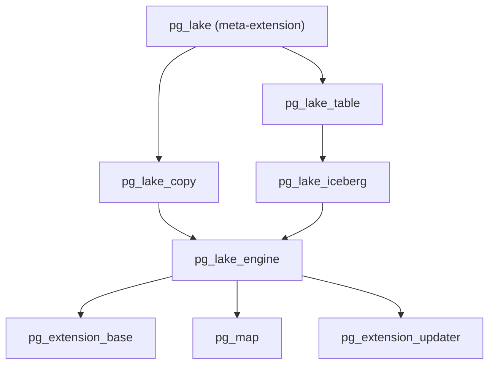
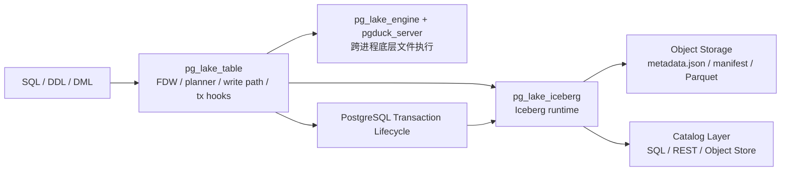
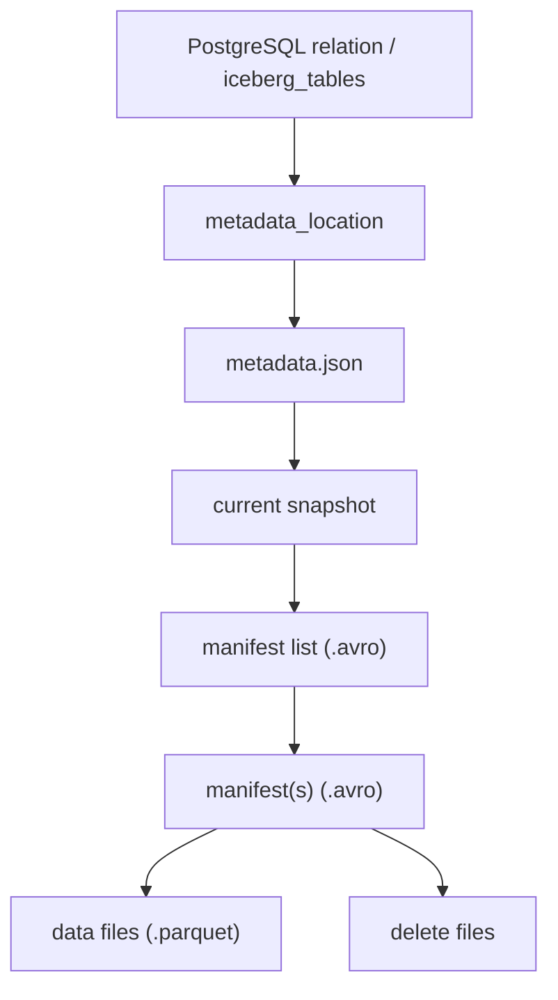
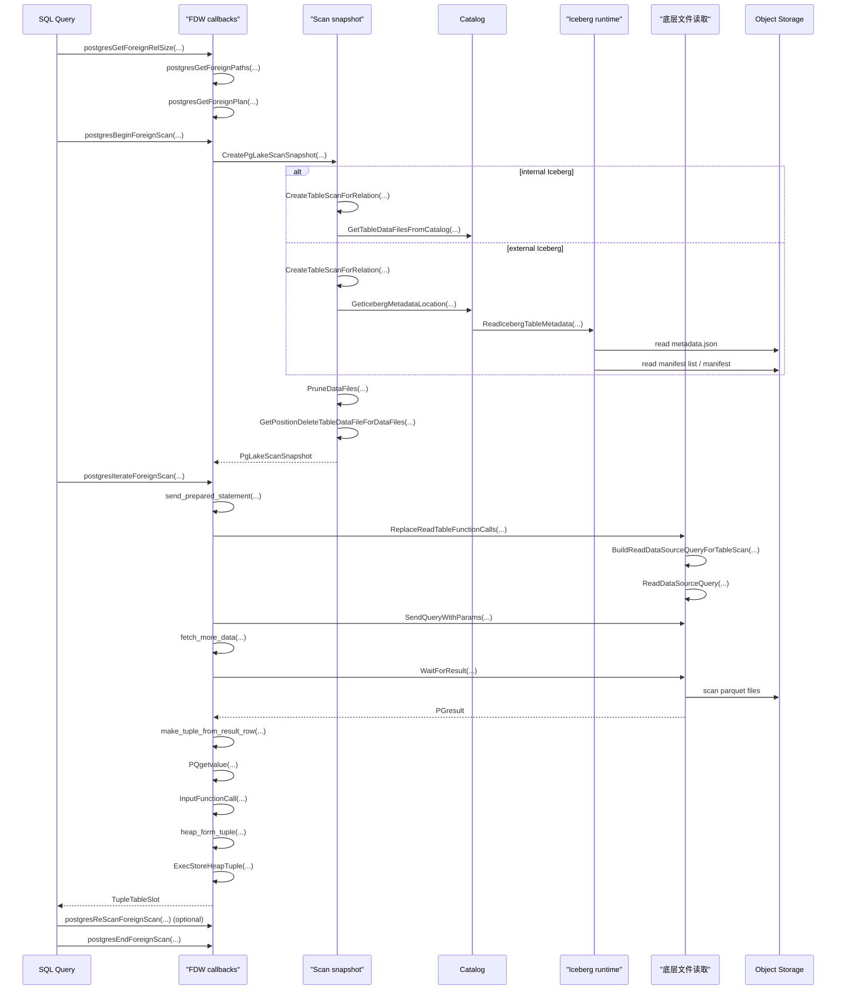
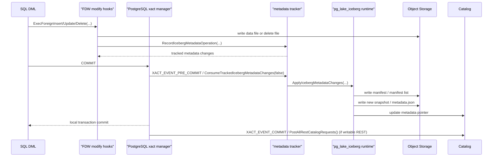
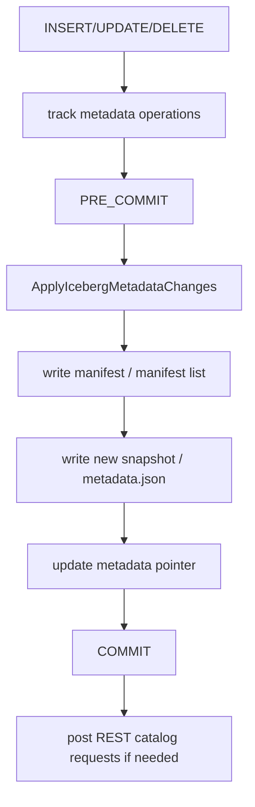

# `pg_lake` 架构与实现设计报告

- 主题：基于 `Snowflake-Labs/pg_lake` 源码，说明 `pg_lake` 的整体架构、对象模型、查询/写入主链、事务提交机制与关键模块
- 调研仓库：<https://github.com/Snowflake-Labs/pg_lake>
- 本次源码快照：`e367b8d401730bb7463ba93739580cf1caf8bbc8`

## 执行摘要

1. `pg_lake_iceberg` 是嵌入 PostgreSQL 扩展体系的内部自研 Iceberg metadata/runtime 层，覆盖当前读写主链所需能力，但不等同于完整 Apache Iceberg SDK。
2. 整体可分为四层：PostgreSQL 接入层、Iceberg runtime 层、公共基础设施层、底层文件执行层。
3. 读路径的核心是“relation -> 文件集合 -> 底层执行结果 -> PostgreSQL tuple”，而不是简单读取 Parquet 文件。
4. 写路径的核心是“事务内累计 metadata changes -> `PRE_COMMIT` 统一提交 Iceberg metadata”。
5. 从管理边界看，`pg_lake` 中的 Iceberg 表更适合先分成 `internal` 和 `external` 两大类：前者由本地 SQL catalog 与本地 metadata pointer 驱动，后者从外部 `metadata_location` 或外部 catalog 出发解析当前 snapshot。
6. 从事务边界看，`internal catalog` 路径的 metadata commit 主要收束在 PostgreSQL 本地事务内；而 `writable REST catalog` 仍存在 `COMMIT` 后外部 catalog 同步阶段，因此不具备单一跨系统原子提交语义。

---

## 1. 项目定位

`pg_lake` 官方将自己定位为把 Iceberg 与数据湖文件直接集成进 Postgres 的 lakehouse 方案。结合源码，更准确的表述是：

> `pg_lake` 将 Iceberg metadata/runtime、catalog 管理、对象存储文件访问与 PostgreSQL 扩展机制组合在一起，形成数据库内嵌式 Iceberg 引擎。

这里需要收敛一个表述边界：

> `pg_lake_iceberg` 更适合理解为“内部自研 metadata/runtime 层”。它覆盖当前 `pg_lake` 读写路径和提交路径所需的 Iceberg 能力，但不应直接等同于完整 Apache Iceberg SDK 的规范覆盖范围。

关键证据：

- `README.md:3-14`
- `README.md:239-240`
- 官方 README：<https://github.com/Snowflake-Labs/pg_lake/blob/main/README.md>

---

## 2. 总体架构

### 2.1 架构分层

从源码和安装脚本看，`pg_lake` 主要由四层组成：

1. **PostgreSQL 接入层**
   - 代表模块：`pg_lake_table`
   - 负责 DDL、FDW、planner、DML、transaction hook 等数据库接入逻辑
2. **Iceberg runtime 层**
   - 代表模块：`pg_lake_iceberg`
   - 负责 metadata、manifest、snapshot、schema、partition、commit、catalog
3. **公共基础设施层**
   - 代表模块：`pg_lake_engine`
   - 负责 `pgduck` client、通用 query 构造、对象存储与类型辅助工具
4. **底层文件执行层**
   - 代表组件：`pgduck_server` + DuckDB
   - 负责对象存储文件扫描与部分写入侧数据处理
   - 从源码可见，其内部采用 DuckDB 的 `DataChunk` / `Vector` 这类列式 batch 接口

### 2.1.1 `pgduck_server` 的进程边界与通信模型

这里需要特别说明一个容易被误解的架构决策：`pgduck_server` 不是嵌入 PostgreSQL 进程内的 DuckDB 组件，而是一个独立进程。

它的基本工作方式可以概括为三点：

1. PostgreSQL 后端进程负责 SQL 接入、FDW 生命周期、事务控制和 Iceberg runtime 协调。
2. `pgduck_server` 独立运行底层执行能力，对外实现 PostgreSQL wire protocol；`pg_lake_engine` 里的 `pgduck` client 通过 `libpq` 与其通信。
3. 因此，第 4 章中出现的 `SendQueryWithParams(...)`、`WaitForResult(...)`、`PGresult`、`PQgetvalue(...)` 本质上都属于 PostgreSQL 扩展进程与 `pgduck_server` 之间的跨进程通信，而不是 PostgreSQL 进程内调用。

这条边界很关键，因为它解释了为什么底层执行层可以独立运行、为什么 `pg_lake` 需要维护 `pgduck` 连接与结果集，以及为什么查询结果最终要通过 `PGresult -> PQgetvalue(...) -> HeapTuple` 回填到 PostgreSQL。

### 2.1.2 扩展模块依赖链

虽然文档正文按职责把 `pg_lake_table`、`pg_lake_iceberg`、`pg_lake_engine` 分层介绍，但从工程组织看，它们并不是平级互相任意调用，而是有明确的依赖方向。



可以把这张图理解成两点：

1. `pg_lake_engine` 是依赖栈的基础层。它向上提供 `pgduck` client、类型映射、远端查询与公共工具，因此 `pg_lake_iceberg`、`pg_lake_table`、`pg_lake_copy` 都建立在它之上。
2. `pg_lake_table` 位于 PostgreSQL 接入最上层，因此它可以直接调用 `pg_lake_iceberg` 的 catalog / metadata / commit 能力；但 `pg_lake_iceberg` 不反向依赖 `pg_lake_table` 的 FDW/planner 路径。

作为 PostgreSQL extension 体系的一部分，`pg_lake` 也具备标准的版本升级能力。源码中可以看到版本化安装脚本、升级脚本生成工具、`ALTER EXTENSION ... UPDATE` 相关支持以及升级测试；仓库还包含 `pg_extension_updater`，用于在实例启动时自动尝试更新已安装扩展。因此，从工程形态看，`pg_lake` 不只是“可安装扩展”，也是“可版本演进的扩展栈”。

### 2.2 总体架构图



这张图表达的核心是：

> PostgreSQL 提供 SQL 和事务外壳，`pg_lake` runtime 提供 Iceberg 表格式语义，底层文件执行层提供数据文件处理能力，catalog 与对象存储共同提供表元数据和物理文件定位。

从运行链看，`pg_lake_table` 负责接住 SQL、计划与事务；`pg_lake_iceberg` 负责 metadata、snapshot、manifest 与 catalog；`pg_lake_engine + pgduck_server` 负责通过 PostgreSQL wire protocol 桥接的跨进程底层文件执行；对象存储和 catalog 分别提供物理文件与 metadata pointer。整个设计的关键在于，Iceberg metadata 的最终提交显式绑定在 PostgreSQL 事务生命周期上，尤其是 `PRE_COMMIT` 阶段。

### 2.3 关键模块

| 模块 | 主要职责 | 关键文件 |
| --- | --- | --- |
| `pg_lake_table` | PostgreSQL 接入、FDW scan、写路径、事务挂钩 | `pg_lake_table/src/fdw/pg_lake_table.c` `pg_lake_table/src/fdw/writable_table.c` `pg_lake_table/src/transaction/transaction_hooks.c` |
| `pg_lake_iceberg` | 内部自研 Iceberg metadata/runtime、catalog、manifest/snapshot/commit | `pg_lake_iceberg/src/iceberg/read_table_metadata.c` `pg_lake_iceberg/src/iceberg/read_manifest.c` `pg_lake_iceberg/src/iceberg/write_manifest.c` `pg_lake_iceberg/src/iceberg/metadata_operations.c` |
| `pg_lake_engine` | `pgduck` client、底层读请求构造、公共工具 | `pg_lake_engine/src/pgduck/client.c` `pg_lake_engine/src/pgduck/read_data.c` |

---

## 3. PostgreSQL 对象与 Iceberg 对象模型

### 3.1 PostgreSQL 侧对象

安装脚本显示，`pg_lake` 在 PostgreSQL 中同时注册了 FDW、server、access method 和 catalog 视图：

- `CREATE FOREIGN DATA WRAPPER pg_lake_iceberg`
- `CREATE SERVER pg_lake_iceberg`
- `CREATE ACCESS METHOD pg_lake_iceberg`
- `CREATE ACCESS METHOD iceberg`

这些对象可按下表理解：

| 对象 | 含义 | 在 `pg_lake` 中的作用 |
| --- | --- | --- |
| `CREATE FOREIGN DATA WRAPPER pg_lake_iceberg` | 注册一种外表访问驱动 | 让 Iceberg / 外部文件表能够走 PostgreSQL 标准 FDW 生命周期 |
| `CREATE SERVER pg_lake_iceberg` | 注册该 FDW 的 server 实例 | 为 foreign table 提供可绑定的 server 对象承载 |
| `CREATE ACCESS METHOD pg_lake_iceberg` | 注册一种表级 access method | 把 Iceberg 表处理方式表达成 PostgreSQL 可识别的底层表访问语义 |
| `CREATE ACCESS METHOD iceberg` | 注册更直接的 `iceberg` access method 名称 | 让上层 SQL 语义更自然，例如更贴近 `USING iceberg` 的对象表达方式 |

整体上可以把它们分成两类：

- `FDW + SERVER`
  - 解决“如何把 Iceberg/外部文件表挂进 PostgreSQL 对象体系”
- `ACCESS METHOD`
  - 解决“如何把 Iceberg 表处理方式表达成 PostgreSQL 可识别的底层访问语义”

同时，`pg_lake_iceberg` 创建了 SQL catalog 结构：

- `lake_iceberg.tables_internal`
- `lake_iceberg.tables_external`
- `lake_iceberg.tables`
- `pg_catalog.iceberg_tables`

关键证据：

- `pg_lake_table/pg_lake_table--3.0.sql:46-51`
- `pg_lake_table/pg_lake_table--3.0.sql:200-208`
- `pg_lake_iceberg/pg_lake_iceberg--3.0.sql:24-73`

### 3.2 Iceberg 对象模型

在 `pg_lake` 中，一张 Iceberg 表不是单个 Parquet 文件，而是一组对象关系：

1. PostgreSQL relation / foreign table
2. catalog 表记录
3. `metadata_location`
4. `metadata.json`
5. current snapshot
6. manifest list
7. manifest
8. data files / delete files



这个对象模型决定了 `pg_lake` 的核心价值在于管理和提交表格式元数据，而不是仅仅读取底层文件。

### 3.3 internal / external Iceberg 表差异

对这篇架构文档，更适合按 `internal` 和 `external` 两大类来理解。为避免和 `writable REST catalog` 混淆，本文不再把 `writable` 作为平级表类型单列，而是把 internal 表的写状态写成 `write-enabled internal` 或 `read-only internal`。

| 表类型 | 含义 | metadata 来源 | 文件集合来源 | 写入语义 | commit 责任方 |
| --- | --- | --- | --- | --- | --- |
| internal Iceberg | `pg_lake` 本地管理的 Iceberg 表 | 本地 SQL catalog 与本地管理的 metadata pointer | 本地 catalog 记录的数据文件集合 | 可进一步区分为 write-enabled internal / read-only internal | 主要由 `pg_lake` 在 PostgreSQL 事务边界内负责 |
| external Iceberg | metadata 由外部位置或外部 catalog 驱动的表 | 外部提供的 `metadata_location` | 先解析 `metadata.json` / snapshot / manifest，再得到文件集合 | 默认按当前接入方式区分；`writable REST catalog` 需单独看待 | 读路径由 `pg_lake` 解析 metadata；写路径责任边界取决于 catalog 类型 |

如果进一步细分，写状态更准确地说是 `internal Iceberg` 的子状态，而不是第三类表。也就是说：

- `write-enabled internal`
  - `pg_lake` 本地管理，且当前允许写入
- `read-only internal`
  - `pg_lake` 本地管理，但当前不允许写入
- `external`
  - 先解析外部 `metadata_location` 或外部 catalog，再得到文件集合

其中 external 表的可写边界，尤其是 `writable REST catalog` 路径，待源码进一步确认。

---

## 4. 查询架构：从 FDW 到 PostgreSQL tuple

### 4.1 查询总览

从架构上看，`pg_lake` 的查询链路可以压缩成四个阶段：

1. **FDW 接入与规划**
   - PostgreSQL 通过 FDW 回调把逻辑表访问生成 `ForeignScan`
2. **文件发现与快照构造**
   - `pg_lake` 把 relation 解析成当前查询应读取的 data files / delete files
3. **底层读请求生成与执行**
   - `pg_lake` 把“扫表”替换成“按文件集合读取对象存储”的读请求
4. **PostgreSQL 边界回填**
   - 底层执行结果被重新组装为 `Datum`、`HeapTuple` 和 `TupleTableSlot`

因此，这一章的重点不是逐个函数罗列，而是说明：

> `pg_lake` 如何把 PostgreSQL 的 relation 级查询，逐层落到 Iceberg 的文件级读取，再回到 PostgreSQL 的 tuple 流。

可以把整条查询链按下表理解：

| 层次 | 核心职责 | 关键实现 |
| --- | --- | --- |
| PostgreSQL 规划层 | 常规路径生成 `ForeignScan`；仅在 full query pushdown 满足条件时生成 `CustomScan` | `postgresGetForeignPlan(...)` `LakeTablePlanner(...)` |
| `pg_lake` metadata/runtime 层 | 解析 metadata、发现文件、构造查询级文件快照 | `CreatePgLakeScanSnapshot(...)` `CreateTableScanForRelation(...)` |
| 底层文件执行层 | 按文件集合执行读取、过滤以及 `position delete` 相关处理 | `ReplaceReadTableFunctionCalls(...)` `BuildReadDataSourceQueryForTableScan(...)` |
| PostgreSQL 执行器边界 | 将结果回填为 `TupleTableSlot` | `make_tuple_from_result_row(...)` `ExecStoreHeapTuple(...)` |

这个分层解释了 `pg_lake` 与普通文件连接器的区别：它不是简单把 Parquet 文件接进数据库，而是同时承担了 metadata/runtime、文件发现和数据库边界回填三项职责。

### 4.2 查询流程图



这张流程图可以按四段来理解。

第一，**规划阶段**。`postgresGetForeignRelSize(...)`、`postgresGetForeignPaths(...)` 和 `postgresGetForeignPlan(...)` 先把 PostgreSQL 侧的逻辑表访问固化为 `ForeignScan`，并将 query、返回列、relation 列表和 restriction 列表保存到执行期可见的 `fdw_private` 中。

第二，**文件快照阶段**。`postgresBeginForeignScan(...)` 初始化 `PgLakeScanState` 后，`CreatePgLakeScanSnapshot(...)` 会把 relation 级语义展开成查询级文件快照。其核心是 `CreateTableScanForRelation(...)`：对 internal 表，先从本地 catalog 获取候选文件；对 external 表，先通过 catalog 取得 `metadata_location`，再由 Iceberg runtime 解析 `metadata.json`、snapshot 和 manifest。随后 `PruneDataFiles(...)` 基于 restriction、partition 和可用统计信息做文件级裁剪，并补齐 position delete files。

第三，**底层读请求阶段**。`postgresIterateForeignScan(...)` 首次取数时，会通过 `send_prepared_statement(...)` 将“扫表”替换成“按当前文件集合读取对象存储”的底层读请求。`ReplaceReadTableFunctionCalls(...)`、`BuildReadDataSourceQueryForTableScan(...)` 和 `ReadDataSourceQuery(...)` 共同完成这一步，把表语义转换成面向具体 data files / delete files 的执行请求。

第四，**结果回填阶段**。底层执行层返回结果后，`fetch_more_data(...)` 和 `make_tuple_from_result_row(...)` 会在 PostgreSQL 边界逐行完成 `PQgetvalue(...)`、`InputFunctionCall(...)`、`heap_form_tuple(...)` 和 `ExecStoreHeapTuple(...)`，最终把结果交还为标准的 `TupleTableSlot`。因此，这条链路的本质是：先把 PostgreSQL 查询转换成 Iceberg 文件读取，再把读取结果转换回 PostgreSQL 执行器可消费的 tuple 流。

如果把上面的正文压缩成一句流程，就是：

> 先用 FDW 规划和启动查询，再把 relation 解析成文件快照，再把文件快照转换成底层读请求，最后在 PostgreSQL 边界回填成 tuple。

### 4.3 FDW 接入与规划阶段

`pg_lake` 的查询入口由 `pg_lake_table/src/fdw/pg_lake_table.c` 中的 `pg_lake_table_handler()` 注册到 `FdwRoutine`。对查询主链最关键的回调如下：

| 注册入口 | 实现函数 | 作用 |
| --- | --- | --- |
| `GetForeignRelSize` | `postgresGetForeignRelSize(...)` | 估算 scan 规模、行数和代价基础信息 |
| `GetForeignPaths` | `postgresGetForeignPaths(...)` | 为 foreign table 生成候选 path |
| `GetForeignPlan` | `postgresGetForeignPlan(...)` | 生成最终 `ForeignScan`，并把 `fdw_private`、返回列、restriction 等执行期信息固化到 plan 中 |
| `BeginForeignScan` | `postgresBeginForeignScan(...)` | 初始化 `PgLakeScanState`，并触发文件快照构造 |
| `IterateForeignScan` | `postgresIterateForeignScan(...)` | 驱动实际取数并持续回填 `TupleTableSlot` |
| `ReScanForeignScan` | `postgresReScanForeignScan(...)` | 在需要重扫时重置 scan 状态和结果流 |
| `EndForeignScan` | `postgresEndForeignScan(...)` | 释放 scan 期间的连接、结果和内存上下文 |

对 planner 而言，最重要的结果是：`postgresGetForeignPlan(...)` 会把逻辑查询模板、返回列、relation 列表和 restriction 列表写入 `fdw_private`，供执行期继续展开。

除了标准 FDW scan 路径，`pg_lake` 还通过 `pg_lake_table/src/planner/query_pushdown.c` 中的 `LakeTablePlanner(...)` 介入 `planner_hook`。只有在启用 full query pushdown、查询只涉及 `pg_lake` 表、且表达式中的函数、操作符、聚合和返回类型都被判定为 `shippable` 时，才会进一步生成 `CustomScan` 形式的完整查询下推计划；其余常规路径仍以 `ForeignScan` 为主。

### 4.4 文件发现与查询级快照

执行开始后，`postgresBeginForeignScan(...)` 会初始化 `PgLakeScanState`，并调用 `CreatePgLakeScanSnapshot(...)` 为本次查询构造查询级文件快照。这一步的目标是把 relation 级语义通过 catalog 或 metadata 解析转换成文件级语义。

核心对象如下：

| 数据结构 | 关键字段 | 作用 |
| --- | --- | --- |
| `PgLakeScanState` | `query` `retrieved_attrs` `scanSnapshot` `tupdesc` `attinmeta` | FDW 扫描态；连接 planner 产物、文件快照和 tuple 回填 |
| `PgLakeScanSnapshot` | `tableScans` | 查询级文件快照；表示本次查询涉及哪些表扫描 |
| `PgLakeTableScan` | `relationId` `uniqueRelationIdentifier` `fileScans` `positionDeleteScans` `childScans` `isUpdateDelete` | 单表扫描描述；把 relation 语义展开成数据文件与删除文件集合 |
| `PgLakeFileScan` | `path` `rowCount` `deletedRowCount` `allRowsMatch` | 单文件扫描描述；表示某个 data file 或 delete file 在本次查询中的角色 |

其中，`CreateTableScanForRelation(...)` 是文件发现的核心。它对两类表采用不同入口：

1. **internal Iceberg**
   - 先从本地 catalog 获取候选文件
   - 关键函数：`GetTableDataFilesFromCatalog(...)`
2. **external Iceberg**
   - 先获取外部 `metadata_location`
   - 再解析 `metadata.json`、snapshot 和 manifest
   - 关键函数：`GetIcebergMetadataLocation(...)`、`ReadIcebergTableMetadata(...)`

无论哪条入口，后续都会进入 `PruneDataFiles(...)`。它会基于 restriction、partition 和可用统计信息做文件级裁剪，并为保留的 data files 补齐对应的 position delete files，最终形成当前查询真正要读的文件集合。

### 4.5 下推实现

`pg_lake` 的“下推”需要分成两层理解：

1. **文件级下推**
   - 通过 `CreateTableScanForRelation(...)` 和 `PruneDataFiles(...)`
   - 先把 `WHERE`、partition 条件和统计信息用于文件发现与文件裁剪
2. **查询级下推**
   - 通过 `LakeTablePlanner(...)`、`GeneratePushdownPlan(...)`、`QueryPushdownBeginScan(...)`
   - 仅在 full query pushdown 满足条件时，把更完整的 SQL 作为 `CustomScan` 下推到底层执行层

这里需要收敛一个边界：查询级下推的典型主路径仍是 `SELECT` 和满足条件的 `INSERT ... SELECT`。对 `UPDATE/DELETE`，当前文档主要能明确证明其 scan/read 侧会复用文件发现、裁剪和行定位路径；是否存在同等范围的完整 modify 下推，不应直接按 `SELECT` 的 `CustomScan` 口径外推。

查询级下推受以下 GUC 控制：

- `pg_lake_table.enable_strict_pushdown`
- `pg_lake_table.enable_full_query_pushdown`
- `pg_lake_table.enable_insert_select_pushdown`

这里的 `shippable` 判断以 `pg_lake_table/src/fdw/shippable.c` 为集中判定入口，配合 engine 层的函数、操作符和空间能力白名单实现，检查函数、操作符、聚合、返回类型以及某些用户自定义类型/上下文是否允许下推。

### 4.6 类型系统与类型转换

类型转换如果只看 PostgreSQL 边界，会显得像“PG 类型进、PG 类型出”；但从整个 `pg_lake` 链路看，更准确的理解方式是四层类型系统：

1. **PostgreSQL 类型**
   - 对应 relation 的列定义、表达式返回类型以及最终的 `Datum / TupleTableSlot`
2. **底层执行层 / DuckDB 类型**
   - 对应 `pgduck_server` 侧真正执行扫描、过滤、聚合时使用的类型系统
3. **Iceberg schema 类型**
   - 对应 table metadata 中的逻辑列类型，是 catalog / metadata / manifest 所依据的表格式语义
4. **Parquet 物理类型**
   - 对应对象存储中文件实际采用的编码与物理表示

在实现上，这四层并不总是两两直接转换，而更像一条链：

> PostgreSQL 类型  
> ↔ 底层执行层 / DuckDB 类型  
> ↔ Iceberg schema 类型  
> ↔ Parquet 物理类型

其中，本文对查询架构最关心的是前两层，也就是 PostgreSQL 与底层执行层之间的边界；而 Iceberg schema 和 Parquet 物理类型更多由 metadata/runtime 与文件格式层共同约束。

具体到查询主链，可以把类型转换分成两个直接可见的阶段：

第一段发生在**生成底层读请求之前**。PostgreSQL 侧的列定义、表达式返回类型和投影列信息，必须先被转换成底层执行层能够理解的类型描述；否则即使文件集合已经确定，也无法正确生成可执行的读请求。这里主要由 `BuildReadDataSourceQueryForTableScan(...)` 根据 `projection` 或 relation 的 `TupleDesc` 推导列类型，再由 `pg_lake_engine/src/pgduck/type.c` 完成 PostgreSQL 类型到底层执行层类型的映射。

第二段发生在**结果回填时**。底层执行层返回结果后，`make_tuple_from_result_row(...)` 需要把每一列重新解释为 PostgreSQL 可接受的值，并最终组装成 `Datum[]`、`HeapTuple` 和 `TupleTableSlot`。也就是说，前一段解决的是“底层该按什么类型执行”，后一段解决的是“执行结果怎样回到 PostgreSQL 类型系统”。

从源码可见，PostgreSQL 与底层执行层之间这层映射至少显式覆盖了以下几类场景：

- 基础标量类型
- 数组、复合类型以及 `STRUCT` / `MAP` 这类复合表达
- `DECIMAL(precision, scale)` 的精度与 scale 处理
- `JSONB -> JSON` 的兼容映射
- `UNKNOWNOID -> VARCHAR` 的兜底映射

因此，类型映射在 `pg_lake` 中不是零散的实现细节，而是连接四层类型系统的关键边界。它首先保证底层读请求和结果回填的类型语义正确；在支持查询级下推的场景下，它也会进一步约束哪些表达式和结果类型可以被安全地下放到底层执行层。

### 4.7 底层读请求与 tuple 回填

当 executor 首次取行时，`postgresIterateForeignScan(...)` 会触发两件事：

1. `send_prepared_statement(...)`
   - 把逻辑表读取替换成面向当前文件集合的底层读请求
   - 关键路径：`ReplaceReadTableFunctionCalls(...)` -> `BuildReadDataSourceQueryForTableScan(...)` -> `ReadDataSourceQuery(...)`
2. `fetch_more_data(...)`
   - 从底层执行层获取结果
   - 在 PostgreSQL 边界逐行调用 `make_tuple_from_result_row(...)`

`make_tuple_from_result_row(...)` 的核心步骤如下：

1. 根据 `TupleDesc` 分配 `Datum *values` 与 `bool *nulls`
2. 遍历 `retrieved_attrs`
3. 使用 `PQgetvalue(...)` 逐列取文本值
4. 使用 `InputFunctionCall(...)` 按列类型转成 PostgreSQL `Datum`
5. 调用 `heap_form_tuple(...)` 组装 `HeapTuple`
6. 由 `ExecStoreHeapTuple(...)` 写入 `TupleTableSlot`

这说明 `pg_lake` 在执行边界上并没有绕开 PostgreSQL 自身的类型系统；底层执行层负责产生结果，而最终可见给 executor 的仍然是标准 `TupleTableSlot`。

### 4.8 最小查询示例

假设执行：

```sql
SELECT id, amount
FROM lake.sales_iceberg
WHERE dt = DATE '2026-05-01' AND amount > 100;
```

假设对象存储中的物理布局如下：

```text
s3://bucket/sales/
  metadata/v3.metadata.json
  metadata/snap-1001-1.avro
  metadata/manifest-00001.avro
  data/dt=2026-05-01/00001.parquet
  data/dt=2026-05-01/00002.parquet
  data/dt=2026-05-02/00003.parquet
  delete/pos-delete-00001.parquet
```

这个查询更完整地可以按六步理解：

1. **规划阶段**
   - planner 把逻辑查询模板、`retrieved_attrs`、`rteList` 和 `restrictionList` 写入 `fdw_private`
   - 对本例来说，`retrieved_attrs` 至少包含 `id` 和 `amount`，而 `restrictionList` 至少包含 `dt = DATE '2026-05-01'` 和 `amount > 100`
2. **初始化扫描态**
   - `postgresBeginForeignScan(...)` 初始化 `PgLakeScanState`
   - 其中会准备 `scanSnapshot`、`tupdesc` 和 `attinmeta`，供后续读请求和 tuple 回填使用
3. **生成查询级文件快照**
   - `CreatePgLakeScanSnapshot(...)` 生成只包含一个 `PgLakeTableScan` 的查询级快照
   - `CreateTableScanForRelation(...)` 再把这张表展开为 `fileScans` 和 `positionDeleteScans`
   - 对本例来说，这个 `PgLakeTableScan` 可以近似理解成：

```text
PgLakeTableScan
  relationId = <lake.sales_iceberg oid>
  uniqueRelationIdentifier = 1
  isUpdateDelete = false
  fileScans = [ ... ]
  positionDeleteScans = [ ... ]
  childScans = []
```

4. **做文件级裁剪**
   - `PruneDataFiles(...)` 会裁掉 `dt=2026-05-02` 分区文件，并为保留文件补齐 position delete
5. **生成底层读请求**
   - `send_prepared_statement(...)` 触发 `ReplaceReadTableFunctionCalls(...)`
   - 此时逻辑上的“扫 `lake.sales_iceberg`”会被替换成“扫这些具体 Parquet 文件，并结合 `positionDeleteScans` 过滤”
6. **结果回填**
   - `fetch_more_data(...)` 从底层执行层取回结果
   - `make_tuple_from_result_row(...)` 再通过 `PQgetvalue(...)`、`InputFunctionCall(...)`、`heap_form_tuple(...)` 和 `ExecStoreHeapTuple(...)` 把结果重新组装成 PostgreSQL 可消费的 `TupleTableSlot`

对本例来说，`PruneDataFiles(...)` 会裁掉 `dt=2026-05-02` 分区文件，并为保留文件补齐 position delete，因此 `fileScans` 可能接近：

```text
fileScans = [
  PgLakeFileScan {
    path = "s3://bucket/sales/data/dt=2026-05-01/00001.parquet",
    rowCount = 100000,
    deletedRowCount = 120,
    allRowsMatch = false
  },
  PgLakeFileScan {
    path = "s3://bucket/sales/data/dt=2026-05-01/00002.parquet",
    rowCount = 80000,
    deletedRowCount = 0,
    allRowsMatch = false
  }
]
```

而 `positionDeleteScans` 可能接近：

```text
positionDeleteScans = [
  PgLakeFileScan {
    path = "s3://bucket/sales/delete/pos-delete-00001.parquet",
    rowCount = 120
  }
]
```

上面这组值是示意性的，但字段和结构与源码一致。这个例子的重点不是字段本身，而是：

> `PgLakeScanSnapshot -> PgLakeTableScan -> PgLakeFileScan` 把 PostgreSQL 的表语义逐层落成 Iceberg 的文件语义；随后底层读请求再把文件语义回填成 PostgreSQL tuple 流。

如果把这个例子再压缩成一句更接近执行器心智模型的描述，就是：

> planner 先决定“查这张表”，`pg_lake` 再决定“读哪些文件”，底层执行层负责“把这些文件算出结果”，而 PostgreSQL 边界最终看到的仍然是标准的 `TupleTableSlot`。

---

## 5. 写路径与提交机制

### 5.1 写路径主链

`pg_lake` 的写路径采用“先写文件、后统一提交 metadata”的模式。若把它压缩成主线，可以分成四个阶段：

1. **行级写入接入**
   - `INSERT/UPDATE/DELETE` 先进入 `writable_table.c` 与 FDW modify hooks
2. **文件变化产生与跟踪**
   - 写出新的 data file 或 delete file，并把变化折叠成 relation 级 metadata operations
3. **`PRE_COMMIT` 统一物化**
   - 在事务结束前统一生成 manifest、manifest list、snapshot 和新的 `metadata.json`
4. **提交后补充动作**
   - 本地 metadata pointer 切换完成后，若涉及 writable REST catalog，再在 `COMMIT` 后发送外部 catalog 请求

关键代码：

- `pg_lake_table/src/fdw/writable_table.c`
- `pg_lake_table/src/transaction/track_iceberg_metadata_changes.c`
- `pg_lake_iceberg/src/iceberg/metadata_operations.c`

这条主线说明，`pg_lake` 的写入重点不是“每条 SQL 立刻改 metadata”，而是“先把文件和元数据变化积累起来，再在事务末尾一次性发布为新的 Iceberg snapshot”。

### 5.2 写路径分层

与查询一样，写路径也可以按层理解：

| 层次 | 核心职责 | 关键实现 |
| --- | --- | --- |
| PostgreSQL 写入接入层 | 接住 `INSERT/UPDATE/DELETE`，把行级修改接入 FDW modify 生命周期 | `postgresExecForeignInsert(...)` `postgresExecForeignUpdate(...)` `postgresExecForeignDelete(...)` |
| 文件变化与跟踪层 | 记录 data file / delete file 变化，并累计 metadata operations | `writable_table.c` `track_iceberg_metadata_changes.c` |
| Iceberg metadata/runtime 层 | 在 `PRE_COMMIT` 统一生成 manifest、snapshot、`metadata.json` | `ApplyIcebergMetadataChanges(...)` `metadata_operations.c` |
| 外部 catalog 交互层 | 对 writable REST catalog 在 `COMMIT` 后发送外部请求 | `PostAllRestCatalogRequests()` |

这个分层和第 4 章的关系也很清楚：第 4 章的查询主线最终消费的是文件集合和 snapshot，可见性边界则由这里的写路径主线负责生成。

### 5.3 `UPDATE/DELETE` 的行定位与 modify hooks

对 `UPDATE/DELETE`，`pg_lake` 需要知道命中的是哪个文件中的哪一行。源码中的处理方式是：

1. PostgreSQL 边界可见的结果中带回逻辑行标识 `(filename, file_row_number)`
2. `make_tuple_from_result_row(...)` 中识别 `SelfItemPointerAttributeNumber`
3. 调用 `RowIdRecordStringToItemPointer(...)`
4. 将结果映射到 tuple 的 `t_self` / `t_ctid`

这样后续 `ExecForeignUpdate/Delete` 可以继续沿用 PostgreSQL 的 `ctid` 风格接口。它与 Iceberg 的 `position delete` 语义直接相关：

- `filename + file_row_number` 是生成 `position delete file` 的关键输入
- `DELETE` 可以理解为基于这组行定位信息写出 delete 语义
- `UPDATE` 可以近似理解为“delete old row + insert new row”

这里需要再加一层边界说明：从当前源码主链看，`UPDATE` 的确可近似理解为“删旧行、插新行”，但具体走的是 `position delete + insert`，还是 `copy-on-write rewrite`，需要以 `pg_lake_table/src/fdw/writable_table.c` 中的实际路径判定和阈值逻辑为准。对 delete 处理能力，当前文档主要能直接证明的是 `position delete` 路径；`equality delete` 已有显式“不支持”证据，不应写成已覆盖的 delete 合并能力。

与之配套，`pg_lake_table_handler()` 还注册了写路径相关的 FDW modify hooks：

| 注册入口 | 实现函数 | 作用 |
| --- | --- | --- |
| `AddForeignUpdateTargets` | `postgresAddForeignUpdateTargets(...)` | 为 `UPDATE/DELETE` 补充行定位等附加目标列 |
| `PlanForeignModify` | `postgresPlanForeignModify(...)` | 为 `INSERT/UPDATE/DELETE` 生成 modify 计划私有信息 |
| `BeginForeignModify` | `postgresBeginForeignModify(...)` | 初始化写路径执行状态 |
| `ExecForeignInsert` | `postgresExecForeignInsert(...)` | 执行单行 `INSERT` |
| `ExecForeignUpdate` | `postgresExecForeignUpdate(...)` | 执行单行 `UPDATE` |
| `ExecForeignDelete` | `postgresExecForeignDelete(...)` | 执行单行 `DELETE` |
| `EndForeignModify` | `postgresEndForeignModify(...)` | 释放 modify 过程中的资源 |
| `IsForeignRelUpdatable` | `postgresIsForeignRelUpdatable(...)` | 声明该 foreign table 支持哪些写操作 |

当前 `PlanDirectModify`、`BeginDirectModify`、`IterateDirectModify`、`EndDirectModify` 为 `NULL`，`ExecForeignBatchInsert` 和 `GetForeignModifyBatchSize` 也为 `NULL`，说明现阶段主写路径既不走 direct modify，也没有通过 FDW batch hooks 暴露批量写入接口。

### 5.4 `PRE_COMMIT` 为什么是核心

`pg_lake` 的关键设计是：

> 不在 DML 执行当下立即更新 Iceberg metadata，而是在 PostgreSQL 事务接近提交时统一生成和提交 metadata 变化。

这里需要强调事务边界：

> `PRE_COMMIT` 统一提交主要适用于本地管理表，也就是 `internal Iceberg`。其中是否处于 `write-enabled internal` 状态决定该表当前能否进入写路径，但 metadata pointer 和 catalog 记录本身仍由 `pg_lake` 本地掌握。

源码中的关键事务回调：

- `XACT_EVENT_PRE_COMMIT`
  - `ConsumeTrackedIcebergMetadataChanges(false);`
- `XACT_EVENT_COMMIT`
  - `PostAllRestCatalogRequests();`
- `XACT_EVENT_PREPARE`
  - 若存在 metadata changes，则禁止 `PREPARE TRANSACTION`

证据：

- `pg_lake_table/src/transaction/transaction_hooks.c:42-85`

### 5.5 写入流程图



这张图可以按四层理解。

第一，写入接入层。`INSERT/UPDATE/DELETE` 先进入 FDW modify hooks，形成 data file 或 delete file 的物理变化。

第二，事务内跟踪层。这些变化不会立刻发布为新的 Iceberg snapshot，而是先通过 `RecordIcebergMetadataOperation(...)` 累计到事务级 tracker 中。

第三，`PRE_COMMIT` metadata 物化层。当用户执行 `COMMIT` 时，PostgreSQL 事务管理器会通过 `RegisterXactCallback` 注册的事务回调触发 `XACT_EVENT_PRE_COMMIT`，进而调用 `ConsumeTrackedIcebergMetadataChanges(false)` 和 `ApplyIcebergMetadataChanges(...)`，统一生成 manifest、snapshot 和新的 `metadata.json`，并切换本地 metadata pointer。

第四，提交后外部 catalog 同步层。这一层只适用于 `writable REST catalog` 路径；如果表走的是 `internal catalog` 路径，那么到第三层时本地 metadata pointer 和本地 catalog 更新就已经完成，不需要再做一次 `COMMIT` 后的外部同步。只有在 `writable REST catalog` 场景下，本地事务提交后才会继续执行 `PostAllRestCatalogRequests()`，因此外部 catalog 更新并不在 PostgreSQL 本地事务原子边界之内。



这张图画的是 `pg_lake` 写路径里从 DML 到 Iceberg commit 的最短主链，重点不是逐个函数细节，而是说明一条事务内写入何时变成对外可见的新 snapshot。

图中的前半段 `INSERT/UPDATE/DELETE -> track metadata operations` 表示：DML 执行时，系统先产生 data file / delete file 等物理变化，并把这些变化登记为 transaction-local metadata operations；这时写入还没有被正式发布为新的 Iceberg 版本。

中间的 `PRE_COMMIT -> ApplyIcebergMetadataChanges -> write manifest / manifest list -> write new snapshot / metadata.json -> update metadata pointer` 表示：真正的 Iceberg commit 发生在事务接近提交时。也就是说，写文件只是准备材料，而生成 manifest、snapshot、`metadata.json` 并切换 metadata pointer，才是让本次写入对外可见的核心动作。

最后的 `COMMIT -> post REST catalog requests if needed` 表示：对 `internal catalog`，到前面 metadata pointer 切换成功时，本地提交主链基本已经完成；只有在 `writable REST catalog` 路径下，`COMMIT` 后还可能继续发送外部 catalog 请求，因此这部分不在 PostgreSQL 本地事务原子边界之内。

### 5.6 `PRE_COMMIT` 的最小事务示例

下面这个事务可以帮助理解 `PRE_COMMIT` 的位置：

```sql
BEGIN;

INSERT INTO lake.sales_iceberg VALUES (1, DATE '2026-05-01', 100);
INSERT INTO lake.sales_iceberg VALUES (2, DATE '2026-05-01', 200);
DELETE FROM lake.sales_iceberg WHERE id = 1;

COMMIT;
```

从 `pg_lake` 视角，这个过程可以按四段理解：

1. **执行 SQL**
   - 两次 `INSERT` 产生新的 data file 变化
   - 一次 `DELETE` 产生 delete file 或 copy-on-write 相关变化
   - 这些变化都先登记为 transaction-local metadata operations
2. **事务内累计**
   - tracker 按 relation 汇总新增、删除和修改过的文件
   - 此时外部读取者仍看不到新 snapshot
3. **进入 `PRE_COMMIT`**
   - `ApplyIcebergMetadataChanges(...)` 统一生成 manifest entries、manifest、manifest list、snapshot 和新的 `metadata.json`
4. **`COMMIT` 完成**
   - 本地 metadata pointer 切换成功后，这三条 DML 才作为一个统一的新 snapshot 对外可见

也就是说，`pg_lake` 的目标不是让每条 DML 单独形成一次 Iceberg commit，而是把同一事务中的多条 SQL 变化收束成一次统一的 snapshot 提交。

### 5.7 写路径对象演化补充

如果把上面的事务示例进一步压缩成对象演化，可以理解成：

1. 行级 `INSERT/DELETE` 先产生 `data file / delete file` 变化
2. 这些变化被登记为 relation 级 `metadata operations`
3. `PRE_COMMIT` 再把这些 operations 物化成新的 `manifest / manifest list / snapshot / metadata.json`
4. 最后通过 `metadata pointer` 切换使新 snapshot 对外可见

也就是说，写路径真正发布的是“新的 metadata 版本”，而不是单个文件写出动作本身。

### 5.8 异常与回滚语义

从架构上看，失败边界主要有三类：普通 SQL 阶段失败会走 abort 路径并清理事务内跟踪态；`PRE_COMMIT` 期间失败会阻止 PostgreSQL 本地事务提交；对 `writable REST catalog`，`PostAllRestCatalogRequests()` 在 `COMMIT` 后执行，因此本地事务成功后仍可能出现外部 catalog 更新失败的跨系统一致性风险。

其中需要特别强调 orphan files 风险。对象存储上的 data file / delete file 写入本身不具备数据库事务回滚能力，因此“事务失败”不等于“对象存储文件天然回滚”。从源码看，`pg_lake_engine/src/cleanup/in_progress_files.c` 和 `pg_lake_engine/src/cleanup/deletion_queue.c` 明确承担了 in-progress files 与 orphan files 的清理职责；但对 `PRE_COMMIT` 失败、abort 或外部同步失败后，清理是否始终完整、何时生效、是否依赖后续 vacuum/cleanup 流程，仍应保守表述为待源码进一步确认。

多 writer 并发与冲突处理也需要单独收敛边界。当前源码可以直接确认本地写路径存在 relation 级更新锁，例如 `pg_lake_table/src/fdw/writable_table.c` 中的 advisory update lock；HTTP / REST 路径也存在重试相关实现。但 metadata pointer 的 CAS 语义、外部 writer detection、catalog lock 粒度以及跨 writer retry / conflict detection 的完整策略，本文不直接下强结论，待源码进一步确认。

### 5.9 SQL 能力矩阵

| SQL 能力 | 当前判断 | 说明 |
| --- | --- | --- |
| `SELECT` | 支持 | 常规查询主路径；默认走 `ForeignScan`，满足条件时可走 `CustomScan` |
| `INSERT` | 支持 | 进入 FDW modify hooks，并在 `PRE_COMMIT` 统一发布为新 snapshot |
| `UPDATE` | 支持 | 依赖行定位 `(filename, file_row_number)`；具体写路径可能是 `position delete + insert` 或 `copy-on-write rewrite` |
| `DELETE` | 支持 | 当前源码主链明确体现 `position delete` 路径；`equality delete` 不支持 |
| `MERGE` | 无 | `docs/iceberg-tables.md` 明确列为不支持 |
| `INSERT ... SELECT` | 支持 | 文档与测试均体现该能力 |
| `INSERT ... SELECT` pushdown | 有条件支持 | 受 `pg_lake_table.enable_insert_select_pushdown` 和 `shippable` 判定约束 |

---

## 6. Catalog 设计

`pg_lake` 同时支持三类 catalog：

1. **SQL catalog**
   - 代表对象：`lake_iceberg.tables_internal`、`pg_catalog.iceberg_tables`
   - 用于本地表管理、元数据映射和 SQL/JDBC 可见性
2. **REST Catalog**
   - 代表实现：`pg_lake_iceberg/src/rest_catalog/rest_catalog.c`
   - 用于与外部 Iceberg REST catalog 互通
3. **Object-store catalog**
   - 代表实现：`pg_lake_iceberg/src/object_store_catalog/object_store_catalog.c`
   - 用于直接基于对象存储发现与加载表

### 6.1 SQL catalog 结构

从安装 SQL 看，`pg_lake` 的 SQL catalog 采用“内部表 + 外部表 + 统一视图”的组织方式：`tables_internal` 表示本地管理表，`tables_external` 表示外部表目录，`tables` 和 `pg_catalog.iceberg_tables` 对上层统一暴露查询视图。

这里列出的不是 SQL catalog 的全部对象与全部字段，而是最影响架构理解的核心对象和核心字段。换句话说，这一节的目标是说明 SQL catalog 如何承载 `metadata_location`、表身份和 internal/external 目录边界，而不是把所有安装对象逐一穷举。

**`lake_iceberg.tables_internal`**

| 字段 | 含义 |
| --- | --- |
| `table_name regclass` | 直接绑定 PostgreSQL 本地 relation，对 internal Iceberg 来说这是最重要的本地对象锚点 |
| `metadata_location varchar(1000)` | 当前生效的 Iceberg `metadata.json` 位置 |
| `previous_metadata_location varchar(1000)` | 上一个 `metadata.json` 位置，用于保留上一版 metadata pointer |
| `read_only bool` | 标记该本地管理表是否只读 |
| `has_custom_location bool` | 标记是否使用自定义存储位置 |
| `default_spec_id int` | 当前默认 partition spec 标识 |

**`lake_iceberg.tables_external`**

| 字段 | 含义 |
| --- | --- |
| `catalog_name varchar(255)` | 外部 catalog 名称；用于区分不同 catalog 来源 |
| `table_namespace varchar(255)` | Iceberg namespace |
| `table_name varchar(255)` | Iceberg 表名 |
| `metadata_location varchar(1000)` | 当前外部表对应的 `metadata.json` 位置 |
| `previous_metadata_location varchar(1000)` | 上一个外部 metadata pointer |

**`lake_iceberg.tables`**

| 字段 | 含义 |
| --- | --- |
| `catalog_name` | 统一视图中的 catalog 标识；internal 表在该视图中也会被投影成 catalog 形式 |
| `table_namespace` | 统一视图中的 namespace 标识 |
| `table_name` | 统一视图中的表名 |
| `metadata_location` | 当前生效的 metadata pointer |
| `previous_metadata_location` | 上一版 metadata pointer |

**`pg_catalog.iceberg_tables`**

| 字段 | 含义 |
| --- | --- |
| `catalog_name` | 面向外部查询暴露的 catalog 标识 |
| `table_namespace` | 面向外部查询暴露的 namespace |
| `table_name` | 面向外部查询暴露的表名 |
| `metadata_location` | 当前 metadata pointer |
| `previous_metadata_location` | 上一版 metadata pointer |

除了表级目录，安装脚本里还定义了 namespace 级属性表：

**`lake_iceberg.namespace_properties`**

| 字段 | 含义 |
| --- | --- |
| `catalog_name` | catalog 名称 |
| `namespace` | namespace 名称 |
| `property_key` | namespace 属性键 |
| `property_value` | namespace 属性值 |

这说明 SQL catalog 不只保存表到 `metadata_location` 的映射，也保存 namespace 级属性信息。

**metadata pointer 更新路径**

| 场景 | metadata pointer 主要存放位置 | 更新路径 | 关键函数 |
| --- | --- | --- | --- |
| internal Iceberg | `lake_iceberg.tables_internal.metadata_location` | `PRE_COMMIT` 期间生成新的 `metadata.json` 后，直接更新本地 internal catalog | `GetIcebergCatalogMetadataLocation(...)` `UpdateInternalCatalogMetadataLocation(...)` |
| external Iceberg（只读对象存储 / 只读 REST / 直接 metadata 文件） | 外部 `metadata_location` | `pg_lake` 查询时读取，但通常不负责更新 | `GetIcebergMetadataLocation(...)` |
| writable REST catalog | 外部 REST catalog 中的 metadata pointer；本地事务内保留 `metadata operations / tracking state` | `PRE_COMMIT` 期间先完成本地 metadata 物化，`COMMIT` 后再发送 REST catalog 请求更新外部 pointer | `GetIcebergMetadataLocation(...)` `LockIcebergPgLakeCatalogForUpdate(...)` `UpdateExternalCatalogMetadataLocation(...)` `PostAllRestCatalogRequests()` |

从这张表可以看出，`internal` 表的 metadata pointer 更新是在本地 catalog 内完成的；而 `writable REST catalog` 则把“本地 metadata 物化”和“外部 pointer 更新”拆成了两段，这也是两者事务边界不同的原因。

需要特别指出的是，`writable REST catalog` 路径并非单一原子提交：本地事务内确实会保留 `metadata operations / tracking state`，但最终 metadata pointer 的权威来源在外部 REST catalog。由于真正的 REST 请求是在 `COMMIT` 后发送，它不在 PostgreSQL 本地事务的原子边界内，因此需要额外考虑 retry、resync、repair 以及 external writer detection 等跨系统一致性问题。

---

## 7. 设计取舍与实现特点

从源码看，`pg_lake` 有三项最重要的设计取舍：

1. **数据库内嵌 runtime，而非嵌入外部语言 Iceberg SDK**
   - 运行时依赖是 `Avro C + DuckDB + libcurl`
   - 没有直接嵌入 Java / Python / Rust Iceberg SDK
2. **元数据 runtime 与底层文件执行解耦**
   - `pg_lake` 决定读哪些文件、如何提交 metadata
   - 底层文件执行由 `pgduck_server` 承担
3. **提交与 PostgreSQL 事务生命周期绑定**
   - `PRE_COMMIT` 统一应用 metadata changes
   - 这是其区别于普通 catalog client 的核心点

---

## 8. 结论与源码导读建议

### 8.1 结论

1. `pg_lake_iceberg` 是 `pg_lake` 的 Iceberg runtime 核心。
2. `pg_lake_table` 是 PostgreSQL 接入与事务桥接核心。
3. 读路径的关键不在“打开 Parquet 文件”，而在“通过 FDW scan 生命周期把 relation 解析成文件集合，并将结果重新组装为 PostgreSQL tuple”。
4. 写路径的关键不在“立即改 metadata”，而在“将 DML 变化延迟到 `PRE_COMMIT` 统一提交”。
5. `pg_lake_iceberg` 更准确地应理解为内部自研 metadata/runtime 层，覆盖当前主链所需能力，但不直接等同于完整 Apache Iceberg SDK。
6. 如果从架构价值看，`pg_lake` 最值得关注的是“数据库事务 + Iceberg runtime + 外部文件执行层”的职责分离与绑定方式。

### 8.2 建议阅读顺序

1. SQL 安装对象
   - `pg_lake_table/pg_lake_table--3.0.sql`
   - `pg_lake_iceberg/pg_lake_iceberg--3.0.sql`
2. 查询主链
   - `pg_lake_table/src/fdw/pg_lake_table.c`
   - `pg_lake_table/src/fdw/snapshot.c`
3. Iceberg runtime
   - `pg_lake_iceberg/src/iceberg/read_table_metadata.c`
   - `pg_lake_iceberg/src/iceberg/read_manifest.c`
   - `pg_lake_iceberg/src/iceberg/write_manifest.c`
   - `pg_lake_iceberg/src/iceberg/metadata_operations.c`
4. 事务与提交
   - `pg_lake_table/src/transaction/transaction_hooks.c`
   - `pg_lake_table/src/transaction/track_iceberg_metadata_changes.c`
5. 底层读请求
   - `pg_lake_table/src/duckdb/transform_query_to_duckdb.c`
   - `pg_lake_engine/src/pgduck/read_data.c`

## 关键证据索引

- `README.md:3-14`
- `README.md:47-57`
- `README.md:189-195`
- `README.md:239-240`
- `docs/iceberg-tables.md:512-527`
- `docs/iceberg-tables.md:748`
- `pg_lake_table/pg_lake_table--3.0.sql:46-51`
- `pg_lake_table/pg_lake_table--3.0.sql:200-208`
- `pg_lake_iceberg/pg_lake_iceberg--3.0.sql:24-73`
- `pg_lake_engine/src/pgduck/client.c:19-85`
