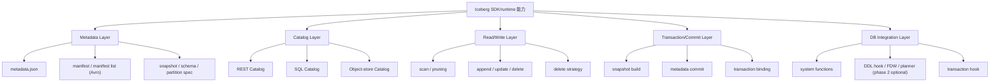

# pg_lake Iceberg SDK 能力与原生实现详细对比报告

- 主题：主讲 pg_lake 自身的 Iceberg SDK/runtime 能力，以及与 Apache Iceberg Java / PyIceberg / Rust / C++ 的详细对比
- 本次对 Apache Iceberg 官方状态页与各语言官方 API 文档的核对日期：`2026-05-28`

### 对比版本基线

为避免“只给调研日期、不锁定版本边界”导致结论过快失效，本报告对原生实现采用以下版本基线。这里的“版本基线”主要用于约束本次评审时点的判断口径；其中 Java 不宜机械固定为某一个小版本，更稳妥的基线应以 Apache Iceberg latest release line、官方 API 文档和 Implementation Status 为准。

| SDK | 对比版本基线 |
|---|---|
| Java API | Apache Iceberg latest release line（本次评审参考 `1.10.0` release line；后续评审应重新校准） |
| PyIceberg | `0.11.1` |
| Rust | `0.9.0` |
| C++ | `0.2.0` |

说明：

- Java API 采用 Apache Iceberg 主项目 release line 作为规范基线。
- PyIceberg、Rust、C++ 演进较快；若后续版本升级，矩阵判断应随版本重新校准。
- Apache 官方实现状态页是动态页面；本报告对其引用以 `2026-05-28` 的页面状态为准。

## 执行摘要

1. pg_lake 可以视为一套数据库内嵌式 Iceberg runtime，而不是官方 SDK 的薄封装。
2. 它在 metadata、manifest、snapshot、commit、catalog、数据库事务绑定这些主链路上的工程实现较完整，但不等同于 Apache Iceberg Java API 的规范完整度。
3. 它与原生 SDK 的差距主要集中在高级规范能力和跨系统一致性能力，例如 equality delete、branch/tag、数据库本地事务与外部 REST Catalog 之间缺乏跨系统 2PC、多引擎共享生态完整度。
4. 如果从“官方规范基线”看，Java API 仍是第一参考对象；如果从“PostgreSQL-native Iceberg runtime 工程参考”看，pg_lake 更贴近目标形态。

### 摘要表

| 评审维度 | `pg_lake` | Java API | PyIceberg | Rust | C++ |
|---|---|---|---|---|---|
| 定位 | 数据库内嵌 runtime | 规范参考实现 | Python 官方实现 | 系统语言官方实现 | 系统语言官方实现 |
| 主链路工程实现 | 高 | 高 | 高 | 中到高 | 中 |
| 规范完整度 | 中到高 | 高 | 中到高 | 中到高 | 中 |
| 数据库事务绑定 | 高 | 低 | 低 | 低 | 低 |
| REST / 多引擎协议兼容性 | 低到中 | 高 | 高 | 高 | 中到高 |
| SQL 端点现成度 | 高 | 低 | 低 | 低 | 低 |
| 可嵌入数据库进程 | 高 | 中 | 中 | 中到高 | 中到高 |
| 长期规范回归基线价值 | 中 | 高 | 高 | 中到高 | 中 |
| 最适合作用 | 工程实现基线 | 规范基线 | Python/轻量 client 参考 | native runtime 参考 | native runtime 参考 |

这张表可以直接收敛成一句判断：

> `pg_lake` 更适合作为 PostgreSQL-native Iceberg runtime 的工程参考，Java API 更适合作为规范与生态兼容的基线。

## 1. `pg_lake` runtime 的对象与边界

### 1.1 先说结论

本报告里说的“`pg_lake` Iceberg SDK/runtime”，不是指它提供了一个独立的通用 SDK 包，而是指：

> `pg_lake` 在数据库插件内部，已经自己实现了一套可读、可写、可提交、可管理 catalog 的 Iceberg runtime。

### 1.2 为什么它可以被视为“数据库内嵌式 SDK/runtime”

从源码直接可以看到这些自实现能力：

- metadata JSON 读写
  - `pg_lake_iceberg/src/iceberg/read_table_metadata.c`
  - `pg_lake_iceberg/src/iceberg/write_table_metadata.c`
- manifest / manifest list 的 Avro 读写
  - `pg_lake_iceberg/src/iceberg/read_manifest.c`
  - `pg_lake_iceberg/src/iceberg/write_manifest.c`
- snapshot / metadata operation / commit 组装
  - `pg_lake_iceberg/src/iceberg/metadata_operations.c`
  - `pg_lake_iceberg/src/iceberg/api/table_metadata.c`
- catalog 抽象与实现
  - `pg_lake_iceberg/src/iceberg/catalog.c`
  - `pg_lake_iceberg/src/rest_catalog/rest_catalog.c`
  - `pg_lake_iceberg/src/object_store_catalog/object_store_catalog.c`
- PostgreSQL 事务末尾集成
  - `pg_lake_table/src/transaction/transaction_hooks.c`
  - `pg_lake_table/src/transaction/track_iceberg_metadata_changes.c`

### 1.3 它依赖官方 Java / Python / Rust / C++ SDK 吗

结论：运行时不依赖官方 Iceberg Java / Python / Rust / C++ SDK。

`pg_lake` 的运行时依赖更偏本地原生组件，核心是 Apache Avro C、DuckDB 和 libcurl。  
Java / PyIceberg 等更多出现在测试或互操作验证场景中，而不是运行时主依赖。

证据：

- `README.md:239-240`
- `pg_lake_iceberg/Makefile` 中 `-lavro -lcurl`

---

## 2. `pg_lake` 自身能力基线

### 2.1 分层能力模型

为了判断是否适合迁入 `pg_lake` runtime，最重要的不是只看有没有 `CREATE TABLE` 或 `SELECT`，而是看它在哪些层已经形成主链路较完整的工程实现。  
如果第一阶段对外接口采用系统函数，那么这里最关键的是 `metadata / catalog / commit / transaction` 四层，而不是 `DDL hook / FDW / planner`。

### 2.2 `pg_lake` 自身能力矩阵

判定口径：

- `高`：主路径清晰、源码实现完整、可作为数据库插件迁移基线
- `中`：能力存在，但依赖特定实现路径、存在明显边界，或不等于官方最完整语义
- `低`：仅有部分底层结构、能力明显不完整，或当前不宜按“已支持”计
- `无`：源码/文档明确显示当前不支持

| 能力层 | 能力项 | 结论 | 支持程度 | 证据 | 为什么这样判断 / 具体支持到什么程度 |
|---|---|---|---|---|---|
| Metadata | metadata.json 读写 | 支持 | 高 | `read_table_metadata.c` `write_table_metadata.c` | 有独立读写实现，说明 `pg_lake` 能直接解析和生成 Iceberg 顶层 table metadata；这不是“透传官方 SDK”，而是自有 runtime 主能力 |
| Metadata | manifest / manifest list 读写 | 支持 | 高 | `read_manifest.c` `write_manifest.c` | 有 manifest 与 manifest list 的 Avro 读写实现，说明它已掌握 Iceberg 提交链路中的关键中间元数据格式 |
| Metadata | snapshot 管理 | 支持 | 高 | `metadata_operations.c` `pg_lake_iceberg/src/iceberg/api/snapshot.c` | 不只是能读取当前 snapshot，还能围绕 metadata operation 构建新 snapshot，并维护 snapshot log / expire 等能力 |
| Metadata | schema evolution | 支持 | 中到高 | `ddl_changes.c` `metadata_operations.c` | 支持 ADD/DROP 列、default 等主路径演进；但相比 Java 规范基线，仍应保守看待高级/边角 schema 语义覆盖度 |
| Metadata | partition evolution | 支持 | 中到高 | `partition_spec_catalog.c` `spec_generation.c` | 支持 partition spec 生成与多 spec 管理，说明不是静态分区模型；但完整规范覆盖度仍建议以 PoC 和互操作测试校准 |
| Catalog | SQL catalog | 支持 | 高 | `pg_lake_iceberg--3.0.sql` | 自建 `lake_iceberg.*` 及兼容视图，说明其具备数据库内 catalog 组织能力；但这里的 SQL catalog 更接近 `pg_lake` 自己的数据库内目录实现，不等同于 Apache Iceberg 生态里的通用 JDBC/SQL Catalog |
| Catalog | REST Catalog | 支持 | 中到高 | `rest_catalog.c` | 支持 REST catalog 的装载与提交主路径，但 writable 路径与本地事务不是单一原子提交，因此不能按“最完整”计 |
| Catalog | object-store catalog | 支持 | 中 | `object_store_catalog.c` | 说明它具备不依赖完整 catalog 服务的最小表发现/装载能力，但这不是主流多引擎生态首选路线 |
| Surface | SQL catalog 视图端点 | 支持 | 高 | `pg_lake_iceberg--3.0.sql` | 已暴露 `pg_catalog.iceberg_tables`、`pg_catalog.iceberg_namespace_properties` 等统一查询视图，适合作为数据库内目录端点 |
| Surface | SQL metadata / file / snapshot 函数端点 | 支持 | 中 | `pg_lake_iceberg--3.0.sql` | 已暴露 `lake_iceberg.metadata(...)`、`files(...)`、`snapshots(...)`、`data_file_stats(...)` 这类查询型函数，可作为系统函数设计参考，但覆盖面主要集中在读与观测，不等于完整通用 SDK API 面 |
| Read | scan / pruning | 支持 | 高 | `query_pushdown.c` `data_file_pruning.c` | 不是简单全表暴力扫描，而是有 scan planning、data file pruning、pushdown；但当前读执行器明显绑定 DuckDB |
| Write | INSERT/UPDATE/DELETE/TRUNCATE | 支持 | 高 | `writable_table.c` | 源码和测试都表明它已打通数据库 SQL DML 到 Iceberg 写路径；若第一阶段走系统函数，这些写路径逻辑仍可复用，只是入口从 SQL DML 改为函数 API |
| Write | position delete | 支持 | 中到高 | `position_delete_dest.c` | 明确有 position delete 写路径，足以覆盖相当多删除场景；但这不等于完整 row-level delete 规范全覆盖 |
| Write | copy-on-write delete | 支持 | 高 | `writable_table.c:479-569` | 明确实现了达到阈值后重写数据文件的策略，属于工程上很实用的主路径能力 |
| Write | equality delete | 无 | 无 | `external_heavy_asserts.c:736` | 源码明确报错 `equality deletes are not yet supported`，因此这里不是“支持较弱”，而是当前应视为不支持 |
| Commit | metadata operation -> snapshot -> manifest -> metadata.json | 支持 | 高 | `metadata_operations.c` | 这是较完整的 Iceberg commit 主链路工程实现，说明 `pg_lake` 已经是 runtime，而不是 catalog/FDW 外挂；但仍不宜直接等同于 Java API 的规范完整度 |
| Commit | PostgreSQL 事务末尾提交 | 支持 | 高 | `transaction_hooks.c` | 这里绑定的是 PostgreSQL 内部事务生命周期与 Iceberg metadata changes：通过 `PRE_COMMIT` 聚合本地 metadata changes 并构造提交主链路；它不应直接等同于外部 REST Catalog、多引擎写入或跨系统提交的强原子性 |
| Commit | REST catalog 事务原子性 | 有缺口 | 低 | `track_iceberg_metadata_changes.c` | `COMMIT` 后才发送 REST 请求；因此会存在“本地数据库事务已成功，但外部 REST catalog commit 失败或延迟生效”的窗口。要把这条路径做成可生产使用，通常还需要 retry、resync、repair、external writer detection 等额外机制 |
| Advanced | branch / tag | 基本不支持 | 低 | `table_metadata.c:178` `rest_catalog.c:929` | 虽然底层 metadata 结构可能读到 `refs`，但写路径当前只维护 `main`；因此不能按“已支持 branch/tag”计 |
| Advanced | 2PC / prepared transaction | 无 | 无 | `transaction_hooks.c:70-77` | 有 metadata change 时直接禁止 `PREPARE TRANSACTION`，说明当前没有把 Iceberg commit 纳入数据库 2PC 语义 |

#### 2.2.1 `pg_lake` 的“能力端点”应怎么理解

这里建议把能力端点分成两层理解：

1. runtime 内部能力
   - 即 metadata、manifest、snapshot、commit、catalog 这些内部实现能力
   - 这是本报告主体关注的 “SDK/runtime 能力”
2. 对外暴露面
   - 即最终给用户或外部组件调用的接口形态
   - 在 `pg_lake` 当前实现里，主要是 SQL 视图和 SQL 函数

从安装 SQL 可直接确认，`pg_lake_iceberg` 当前已经暴露了几类典型对外端点：

- catalog 视图端点
  - `pg_catalog.iceberg_tables`
  - `pg_catalog.iceberg_namespace_properties`
- metadata / file / snapshot 函数端点
  - `lake_iceberg.metadata(metadata_uri TEXT)`
  - `lake_iceberg.files(metadata_uri TEXT)`
  - `lake_iceberg.snapshots(metadata_uri TEXT)`
  - `lake_iceberg.data_file_stats(metadata_location text)`

这些端点说明：

1. `pg_lake` 不只是内部 runtime，它已经向 SQL 层暴露了部分可直接消费的能力。
2. 这些端点目前更偏查询、观测和目录访问，而不是一套完整统一的通用写入 API 面。
3. 如果第一阶段选择系统函数路线，更值得参考的是先复用 `metadata(...)` / `files(...)` / `snapshots(...)` 这类读与观测端点，再补齐 `create / append / delete / commit` 这类写入端点。

因此，从能力端点这个角度看，`pg_lake` 当前更像“已经具备一组数据库内 SQL 操作面的 Iceberg runtime”；这里说的端点主要是数据库对象、SQL 函数和可调用能力，不是 HTTP service endpoint。

#### 2.2.2 能力端点到实现能力的映射

如果把 `pg_lake` 当作数据库内 runtime 来看，可以把常见 Iceberg 能力端点与其内部实现能力对应起来：

| 能力端点 | 依赖的内部实现能力 | 对应模块 / 文件 |
|---|---|---|
| `create table` | schema / partition spec 生成、table metadata 初始化、catalog 写入、首次 commit | `ddl_changes.c` `spec_generation.c` `catalog.c` `metadata_operations.c` |
| `load table` | `metadata_location` 获取、`metadata.json` 读取、snapshot 解析 | `catalog.c` `read_table_metadata.c` |
| `metadata query` | table metadata 解析与投影 | `read_table_metadata.c` `pg_lake_iceberg--3.0.sql` |
| `files / snapshots query` | manifest / snapshot 读取、catalog SQL 函数暴露 | `read_manifest.c` `pg_lake_iceberg--3.0.sql` |
| `append` | data file 写出、metadata operation 记录、manifest/snapshot/metadata commit | `writable_table.c` `metadata_operations.c` `transaction_hooks.c` |
| `delete` | position delete 或 copy-on-write、metadata operation 记录、commit | `position_delete_dest.c` `writable_table.c` `metadata_operations.c` |
| `commit` | metadata operation 聚合、manifest / manifest list 生成、snapshot 构造、metadata pointer 切换 | `metadata_operations.c` `transaction_hooks.c` |
| `catalog query` | SQL catalog 视图 / 函数或 REST catalog client | `pg_lake_iceberg--3.0.sql` `rest_catalog.c` |

这张表的作用是把“业务能力端点”翻译成“需要补齐哪些 runtime 模块”。  
如果后续要把能力对外做成系统函数，函数签名可以按端点定义，但底层实现仍然要落到这些 metadata、catalog、commit 与事务模块上。

#### 2.2.3 `pg_lake` 已知缺口汇总

为避免缺口信息分散在多个矩阵中，这里把当前对选型影响最大的已知边界集中列出：

| 缺口 | 严重程度 | 依据 |
|---|---|---|
| equality delete 不支持 | 明确不支持 | `external_heavy_asserts.c:736` |
| branch / tag 写路径基本不支持 | 明显缺口 | `table_metadata.c:178` `rest_catalog.c:929` |
| 2PC / prepared transaction 禁止 | 明确不支持 | `transaction_hooks.c:70-77` |
| writable REST 非单一原子提交 | 有一致性窗口 | `track_iceberg_metadata_changes.c` `transaction_hooks.c` |
| 外部引擎不能写回 `pg_lake` 创建的 internal 表 | 多引擎互操作硬约束 | `docs/iceberg-tables.md:525-527` |
| 无 FDW batch DML 接口 | 工程能力缺口 | `pg_lake_table/src/fdw/pg_lake_table.c:554-565` |

### 2.3 核心判断

`pg_lake` 已经越过 catalog client / connector 层，进入了主链路工程实现较完整的 runtime 层。它的核心价值不在某个单点功能，而在于已经把 metadata、manifest、snapshot、commit、catalog、数据库事务这几层打通；但它仍然是 PostgreSQL-native Iceberg runtime 的工程参考，不应直接被当作 Iceberg spec 的唯一规范基线。

因此，真正的关键问题不是“它能不能算 SDK”，而是：

> 它已经是一套可迁移的数据库内嵌式 Iceberg runtime，但它的主链路工程实现较完整，并不等同于 Apache Iceberg Java API 的规范完整度；高级规范能力和原生 SQL 集成能力仍需后补。

---

## 3. 与原生 Iceberg SDK 对比

### 3.1 先说明“原生 SDK”的范围

本报告中的原生 SDK 指：

- Apache Iceberg Java API
  - 事实上的参考实现
- PyIceberg
  - Apache 官方 Python 实现
- Iceberg Rust
  - Apache 官方 Rust 实现
- Iceberg C++
  - Apache 官方 C++ 实现

### 3.2 对比时要分两条线看

| 维度 | 更适合对标的对象 |
|---|---|
| Iceberg 规范完整度 | Java API |
| 非 JVM 轻量 client / Python 生态 | PyIceberg |
| 系统语言 native runtime | Rust / C++ |
| PostgreSQL 数据库插件化嵌入 | `pg_lake` |

### 3.3 详细矩阵的判定口径

为避免把“规范支持”“实现成熟度”“数据库内嵌可迁移性”混在一起，下面统一按以下口径打分：

- `高`：能力完整，且可直接作为该维度主参考
- `中`：能力存在，但边界明显、成熟度有限，或依赖额外前提
- `低`：能力弱、缺口明显，或不适合作为该维度主参考
- `待确认`：官方状态页、API 文档、实现细节之间仍需 PoC 核实

特别说明：

1. Java 作为事实上的规范参考实现，默认是最强基线。
2. PyIceberg / Rust / C++ 以 Apache 官方实现状态页为保守基线，再结合各自 API 文档补充。
3. C++ 官网对能力描述较积极，但本报告在选型时优先采用 Apache 官方状态页的保守口径。
4. `pg_lake` 不在 Apache 官方状态页中，因此完全依据源码、测试、SQL 定义和仓库文档判断。
5. PyIceberg、Rust、C++ 的能力演进较快，本报告判断以本次调研日期 `2026-05-28` 为准；具体能力仍应以实际版本和官方状态页/API 文档为准。
6. 尤其是 Rust：其 transaction / writer 能力演进较快，因此本文中的“中”或“中到高”更多表示当前生态成熟度和规范回归强度判断，不应简单理解为长期能力上限。
7. 对官方实现状态页与单个语言官网存在张力时，本报告优先采用状态页的保守口径；尤其是 C++ 官网表述相对积极，评审口径仍以状态页快照为主。

核心外部依据统一放在文末“关键证据索引”。

### 3.3.1 矩阵阅读注意事项

- 矩阵中的 `高 / 中 / 低 / 无` 是面向工程选型的判断口径，不是 Apache 官方认证能力表。
- 对 `PyIceberg`、`Rust`、`C++` 这类演进较快的实现，具体能力必须以官方状态页、API 文档、release notes 和 PoC 验证为准。
- 如果官方状态页、API 文档与 release notes 之间存在差异，本文统一标记为 `待确认` 或在备注中明确“需 PoC 验证”。
- 尤其是 C++：官方 release notes 与 status page 之间可能存在口径差异，因此本报告在评审判断上保持保守，不把单一来源直接视为最终结论。

### 3.4 能力对比矩阵（按 7 类能力重组）

为减少重复矩阵、提升评审可读性，后续对比统一按 7 类能力组织：

1. **Metadata / Table Spec Layer**
   - `metadata.json`、schema、partition spec、snapshot、manifest
2. **Catalog / Metadata Pointer Layer**
   - internal catalog、REST catalog、object-store catalog、`metadata_location`
3. **Read / Scan Planning Layer**
   - scan planning、file pruning、projection/filter pushdown、position/equality delete read
4. **Write / Mutation Layer**
   - append、overwrite、update/delete、position/equality delete write、copy-on-write、row delta
5. **Commit / Concurrency Layer**
   - metadata commit、snapshot commit、metadata pointer 更新、conflict detection、multi-writer、REST commit、数据库事务绑定
6. **DB Integration / Surface Layer**
   - SQL 函数、视图、FDW、planner、`CustomScan`、transaction hook、type conversion、tuple 回填、插件迁移价值
7. **Maintenance / Advanced Spec Layer**
   - expire snapshots、rewrite manifests、orphan cleanup、branch/tag、time travel、高级 schema/partition evolution

在这个分类之上，本文把对比收敛成三组矩阵：

- **A. 核心能力对比矩阵**
  - 聚焦 `Metadata / Catalog / Read / Write / Commit`
- **B. 数据库插件适配矩阵**
  - 聚焦 `DB Integration / Surface`
- **C. 生态与长期演进矩阵**
  - 聚焦 `Maintenance / Advanced Spec`、互操作、成熟度与长期回归

#### 3.4.1 A. 核心能力对比矩阵

这张表中的判断依据主要来自四类来源：

- `pg_lake`：源码、测试、SQL 定义与仓库文档
- Java API：官方 API 文档、Implementation Status 与 latest release line
- PyIceberg / Rust / C++：官方状态页、API 文档、release notes；若三者存在张力，则保守标注为 `待确认` 或“需 PoC 复核”

| 分类 | 能力项 | `pg_lake` | Java API | PyIceberg | Rust | C++ | 判断 |
|---|---|---|---|---|---|---|---|
| Metadata / Table Spec | `metadata.json` 读写 | 高 | 高 | 高 | 高 | 高 | `pg_lake` 源码主链完整；Java 以规范/API 为基线；其余以状态页/API 为准 |
| Metadata / Table Spec | manifest / manifest list | 高 | 高 | 高 | 高 | 高 | `pg_lake` 有独立 Avro 读写；Java 最稳定；C++ 能力需随版本复核 |
| Metadata / Table Spec | snapshot 模型 | 高 | 高 | 高 | 高 | 高 | `pg_lake` snapshot 主链完整；Java 是规范基线；Py/Rust/C++ 以官方实现文档复核 |
| Metadata / Table Spec | schema evolution | 中到高 | 高 | 高 | 中到高 | 高 | `pg_lake` 主路径可用；Java 最完整；Rust/C++ 需结合状态页与版本判断高级语义 |
| Metadata / Table Spec | partition spec / evolution | 中到高 | 高 | 高 | 中到高 | 高 | `pg_lake` 已具备多 spec 管理；Java 最完整；其余按官方实现口径保守判断 |
| Catalog / Metadata Pointer | internal / SQL catalog | 高 | 中到高 | 中到高 | 中到高 | 中 | `pg_lake` 自建数据库内 catalog；原生实现更偏通用 catalog 语义而非数据库内目录 |
| Catalog / Metadata Pointer | REST Catalog | 中到高 | 高 | 高 | 高 | 高 | 原生 SDK 更贴标准 REST Catalog；`pg_lake` writable REST 仍有本地/外部边界 |
| Catalog / Metadata Pointer | object-store catalog | 中 | 中 | 中 | 中 | 中 | 各实现都有最小装载能力，但都不是多引擎治理的最强路径 |
| Catalog / Metadata Pointer | metadata pointer / `metadata_location` 管理 | 高 | 高 | 高 | 高 | 中到高 | `pg_lake` internal 与 REST 路径分化；原生实现更贴标准 catalog pointer 语义 |
| Read / Scan Planning | scan planning / file pruning | 高 | 高 | 高 | 高 | 中到高 | `pg_lake` 有数据库内 pruning/pushdown 主链；原生实现能力以状态页/API 为准 |
| Read / Scan Planning | projection / filter pushdown | 高 | 高 | 中到高 | 高 | 中到高 | `pg_lake` 已具备查询下推工程主链；原生实现更多体现为 scan planning/runtime 能力 |
| Read / Scan Planning | position delete read | 中到高 | 高 | 高 | 高 | 低到中 | `pg_lake` 当前可直接坐实的是 position delete；C++ 需 PoC 复核 |
| Read / Scan Planning | equality delete read | 无 | 高 | 无 | 高 | 低 | `pg_lake` 明确不支持；C++ 官方状态页当前对 `Read with equality deletes` 为 `N`，0.2.0 release notes 又强调 V2 delete/filtering support，因此按保守口径记为低 |
| Write / Mutation | append / append files | 高 | 高 | 高 | 高 | 高 | 主路径都具备；Java 规范最稳，Py/Rust/C++ 以官方文档与版本复核 |
| Write / Mutation | overwrite / rewrite | 中到高 | 高 | 高 | 中 | 低到中 | `pg_lake` 主路径可用；Java 最完整；C++ 不宜绝对化写成无 |
| Write / Mutation | update / delete | 高 | 中 | 低 | 低 | 低 | `pg_lake` 打通数据库内 DML 写路径；原生 SDK 更偏底层 API，不等于数据库 DML 体验 |
| Write / Mutation | position delete write | 中到高 | 高 | 无 | 无 | 低到中 | `pg_lake` 明确有写路径；Java 最完整；C++ 需结合版本与 PoC 复核 |
| Write / Mutation | equality delete write | 无 | 高 | 无 | 中到高 | 低 | `pg_lake` 明确不支持；Rust 演进较快；C++ 官方状态页当前对 `Write equality deletes` 为 `N`，0.2.0 release notes 未直接承诺该写路径，因此按低处理 |
| Write / Mutation | copy-on-write | 高 | 高 | 高 | 中 | 低到中 | `pg_lake` 工程写路径中已有明确实现；Java/ Py 更完整 |
| Write / Mutation | row delta | 中 | 高 | 无 | 无 | 无 | `pg_lake` 不能按 Java 完整 row delta 计；其余实现以官方状态页保守判断 |
| Commit / Concurrency | metadata commit / snapshot commit | 高 | 高 | 高 | 高 | 中到高 | `pg_lake` commit 主链完整；Java 是规范基线；C++ 仍需按版本复核细节 |
| Commit / Concurrency | metadata pointer 更新 | 高 | 高 | 高 | 高 | 中到高 | `pg_lake` internal 与 writable REST 路径不同；原生实现更贴标准 catalog 语义 |
| Commit / Concurrency | conflict detection / retry | 中 | 高 | 高 | 高 | 中 | 原生 SDK 更贴标准 catalog/commit 协议模型；`pg_lake` 需结合具体 catalog 路径看 |
| Commit / Concurrency | multi-writer | 中 | 高 | 高 | 高 | 中 | `pg_lake` 多 writer 语义需结合具体 catalog 路径谨慎评估；原生实现更贴多引擎模型 |
| Commit / Concurrency | REST Catalog commit / conflict handling | 低到中 | 高 | 高 | 高 | 中到高 | 这是标准 REST Catalog 提交与冲突处理能力，不等于数据库本地事务与外部 REST Catalog 之间的跨系统 2PC |
| Commit / Concurrency | PostgreSQL 数据库事务绑定 | 高 | 低 | 低 | 低 | 低 | `pg_lake` 的独特优势；原生 SDK 的 transaction API 不等于数据库事务绑定能力 |

这张矩阵更适合回答：如果只看 Iceberg runtime 主链能力，`pg_lake` 能做到什么、与原生 SDK 差距主要在哪。结论仍然是：`pg_lake` 的主链路工程实现较完整，但它不是 Java API 的完整替代。

这里还需要明确一条对多引擎互操作影响很大的架构约束：`pg_lake` 官方文档明确说明，外部驱动当前还不能写回由 `pg_lake` 创建的 Iceberg 表。换句话说，`pg_lake` 的 internal catalog 并不是一个天然开放给 Spark / Trino / Flink 等外部引擎双向写入的通用多引擎 catalog 形态。

此外，仍需区分三个不同层次的“事务”概念：

1. Iceberg table transaction
   - 指单表范围内对 metadata changes 的聚合、snapshot 构造与 commit 发布。
2. REST Catalog commit / conflict handling
   - 指通过标准 REST Catalog 协议提交 metadata pointer 更新，并处理冲突、重试和多引擎兼容语义。
3. 数据库级 2PC / prepared transaction
   - 指数据库本地事务管理器提供的两阶段提交语义。

原生 SDK 即使提供 transaction API，也只说明其支持 Iceberg table transaction 或接近标准 catalog commit 流程，不能直接外推为数据库本地事务与外部 REST Catalog 之间具备跨系统 2PC 强原子性。

#### 3.4.2 B. 数据库插件适配矩阵

| 分类 | 能力项 | `pg_lake` | Java API | PyIceberg | Rust | C++ | 判断 |
|---|---|---|---|---|---|---|---|
| DB Integration / Surface | SQL 视图 / SQL 函数 | 高 | 无 | 无 | 无 | 无 | `pg_lake` 已直接暴露 `pg_catalog.iceberg_tables`、`metadata(...)`、`files(...)`、`snapshots(...)` |
| DB Integration / Surface | 系统函数化基线 | 高 | 中 | 中 | 中 | 中 | `pg_lake` 已经有数据库内能力端点原型；原生 SDK 更像库 API |
| DB Integration / Surface | FDW / planner / `CustomScan` | 中到高 | 无 | 无 | 无 | 无 | 这是 `pg_lake` 独有的 PostgreSQL 插件集成价值 |
| DB Integration / Surface | transaction hook / `PRE_COMMIT` | 高 | 无 | 无 | 无 | 无 | `pg_lake` 直接给出数据库事务与 Iceberg metadata changes 的绑定路径 |
| DB Integration / Surface | type conversion / tuple 回填 | 高 | 无 | 无 | 无 | 无 | `pg_lake` 已处理 PostgreSQL 类型边界、结果回填与 `TupleTableSlot` 路径 |
| DB Integration / Surface | 数据库进程内嵌适配度 | 高 | 中 | 中 | 中到高 | 中到高 | Java/Python 理论上可桥接，但工程复杂度明显更高 |
| DB Integration / Surface | 作为数据库插件 PoC 基线 | 高 | 中 | 低到中 | 中 | 中 | `pg_lake` 最贴近 PostgreSQL-native runtime 目标形态 |
| DB Integration / Surface | 插件迁移价值 | 高 | 低到中 | 低 | 中 | 中 | Java 更适合作为规范校验；`pg_lake` 更适合作为工程参考 |

这张矩阵回答的是另一个问题：如果目标不是“做应用侧 SDK”，而是“做数据库插件或系统函数能力”，谁更接近实际落地骨架。这里 `pg_lake` 的优势是最明显的。

#### 3.4.3 C. 生态与长期演进矩阵

| 分类 | 能力项 | `pg_lake` | Java API | PyIceberg | Rust | C++ | 判断 |
|---|---|---|---|---|---|---|---|
| Maintenance / Advanced Spec | expire snapshots | 中到高 | 高 | 高 | 低到中 | 低到中 | `pg_lake` 有维护基础，但完整度仍弱于 Java |
| Maintenance / Advanced Spec | rewrite manifests / rewrite data files | 中 | 高 | 高 | 低到中 | 低到中 | `pg_lake` 有部分维护能力；Java 仍是最完整基线 |
| Maintenance / Advanced Spec | orphan cleanup | 低到中 | 高 | 中 | 低 | 低 | `pg_lake` 有数据库内清理路径，但不是完整 lakehouse maintenance 工具集 |
| Maintenance / Advanced Spec | branch / tag | 低 | 高 | 中到高 | 中 | 中 | `pg_lake` 当前写路径主要围绕 `main` |
| Maintenance / Advanced Spec | time travel | 低到中 | 高 | 中到高 | 中 | 低 | `pg_lake` 更接近 snapshot/changelog 侧能力；C++ 0.2.0 已有 snapshot management，但官方状态页没有直接的 time travel 条目，当前只能按保守口径记为低 |
| Maintenance / Advanced Spec | 高级 schema / partition evolution | 中到高 | 高 | 高 | 中到高 | 高 | `pg_lake` 主路径可用，但高级边角语义仍建议保守看待 |
| 生态 / 互操作 | 多引擎互操作 | 中 | 高 | 高 | 中到高 | 中 | 原生 SDK 更天然适配 Spark / Flink / Trino 等多引擎共享 |
| 生态 / 互操作 | 通用多引擎 catalog 形态 | 低到中 | 高 | 高 | 高 | 中 | `pg_lake` internal catalog 不等于通用多引擎 catalog |
| 生态 / 长期演进 | 规范完整度 | 中到高 | 高 | 中到高 | 中到高 | 中 | Java 仍是第一规范基线 |
| 生态 / 长期演进 | 测试与互操作成熟度 | 中 | 高 | 高 | 中到高 | 中 | Java 生态最稳；Rust/C++ 演进快，需按版本复核 |
| 生态 / 长期演进 | 长期回归基线价值 | 中 | 高 | 高 | 中到高 | 中 | 长期规格回归仍应以 Java API 为第一基线 |

这张矩阵主要服务长期路线判断：`pg_lake` 很适合工程落地参考，但长期规范演进、维护工具集和多引擎生态兼容，仍需要靠 Java API 以及其他官方实现持续校准。

### 3.5 面向选型的汇总表

| 选型问题 | 首选参考对象 | 次选参考对象 | 原因 |
|---|---|---|---|
| “Iceberg 规范的完整基线是什么” | Java API | PyIceberg | Java 仍是事实标准 |
| “数据库插件里要迁什么 runtime 结构” | `pg_lake` | Rust / C++ | `pg_lake` 已给出 PG 内嵌答案 |
| “系统语言里怎样做 native runtime” | Rust / C++ | Java API | 更接近数据库周边系统语言技术栈 |
| “怎么做标准 REST Catalog client” | Java / PyIceberg / Rust / C++ | `pg_lake` | 原生 SDK 更贴协议 |
| “怎么做数据库内函数调用写路径与 PRE_COMMIT 绑定” | `pg_lake` | 无真正等价物 | 这是 `pg_lake` 的独有价值，且比 DDL hook 更适合第一阶段系统函数路线 |
| “怎么做第一阶段数据库插件 PoC” | `pg_lake` | Java API | `pg_lake` 做实现基线，Java 做规范校准 |
| “怎么做长期规格回归与生态兼容” | Java API | PyIceberg / Rust | 避免 runtime 偏离主生态 |

### 3.6 选型结论

1. 如果目标是数据库内嵌 runtime，`pg_lake` 是最接近数据库插件目标形态的参考对象。
   - 它已经解决了 PostgreSQL 扩展落地、事务 hook 绑定和数据库内写路径承载问题。
2. 如果目标是官方规范完整度，Java API 仍然是第一基线。
   - `pg_lake` 在 branch/tag、equality delete、跨系统原子性和多引擎共享生态上仍弱于原生 SDK。
3. 最合理的方式不是二选一，而是双基线对标。
   - 用 `pg_lake` 校准插件化落地路径。
   - 用 Java / PyIceberg / Rust / C++ 校准规范边界与生态兼容性。

### 3.7 面向自研数据库插件的建议

1. 以 Java API 作为规范基线。
   - 规范语义、回归判断和高级能力边界，优先对齐 Java API，而不是直接把 `pg_lake` 的当前行为视作标准答案。
2. 以 `pg_lake` 作为工程参考。
   - 重点参考其 metadata、manifest、snapshot、commit、catalog、事务 hook、数据库内写路径这些工程实现。
   - 但应明确：`pg_lake` 是 PostgreSQL-native Iceberg runtime 工程参考，不应把它的当前行为直接视作 Iceberg spec 的唯一规范基线。
3. 将 writable REST Catalog 写路径单独设计一致性方案。
   - 不应把 PostgreSQL 内部事务绑定直接等同于外部 catalog 强原子性；至少需要单独考虑 `retry`、`resync`、`repair`、`external writer detection`、冲突检测与恢复流程。
4. 高级能力分阶段实现。
   - 第一阶段优先打通 metadata、catalog、append、position delete、commit 主链路。
   - 第二阶段再补 equality delete、branch/tag、更完整的 maintenance、跨系统一致性增强等高级能力。
5. 持续做互操作与规范校验。
   - `pg_lake` 的主链路工程实现即使较完整，仍需要通过 Java API / PyIceberg / Rust / C++ 的 API 行为、官方状态页以及 PoC 验证来校准规范边界与互操作兼容性。

---

## 4. 关键证据索引

### `pg_lake` 仓库与文档

- `README.md:3-14`
- `README.md:239-240`
- `docs/iceberg-tables.md:525-527`
- `docs/building-from-source.md:555`

### `pg_lake` SQL / catalog

- `pg_lake_iceberg/pg_lake_iceberg--3.0.sql:24-71`
- `pg_lake_iceberg/pg_lake_iceberg--3.0.sql:75-107`
- `pg_lake_iceberg/pg_lake_iceberg--3.0.sql:138-144`
- `pg_lake_table/pg_lake_table--3.0.sql:46-51`
- `pg_lake_table/pg_lake_table--3.0.sql:200-208`

### `pg_lake` runtime 核心

- `pg_lake_iceberg/src/iceberg/read_table_metadata.c:61-120`
- `pg_lake_iceberg/src/iceberg/write_table_metadata.c`
- `pg_lake_iceberg/src/iceberg/read_manifest.c:80-140`
- `pg_lake_iceberg/src/iceberg/write_manifest.c:42-66`
- `pg_lake_iceberg/src/iceberg/metadata_operations.c:158-410`
- `pg_lake_iceberg/src/iceberg/api/table_metadata.c:341-424`
- `pg_lake_iceberg/src/iceberg/catalog.c`
- `pg_lake_iceberg/src/rest_catalog/rest_catalog.c`

### `pg_lake` PostgreSQL 集成

- `pg_lake_table/src/ddl/create_table.c:1063-1164`
- `pg_lake_table/src/fdw/pg_lake_table.c:554-565`
- `pg_lake_table/src/fdw/writable_table.c`
- `pg_lake_table/src/planner/query_pushdown.c:1372-1455`
- `pg_lake_table/src/transaction/transaction_hooks.c:42-85`
- `pg_lake_table/src/transaction/track_iceberg_metadata_changes.c:223-427`
- `pg_lake_table/src/transaction/track_iceberg_metadata_changes.c:720-821`

### 官方 Iceberg 参考

- Java API：<https://iceberg.apache.org/docs/latest/docs/api/>
- REST Catalog Spec：<https://iceberg.apache.org/rest-catalog-spec/>
- 规范：<https://iceberg.apache.org/spec/>
- 实现状态页：<https://iceberg.apache.org/status/>
- Apache Iceberg Releases：<https://iceberg.apache.org/releases/>
- PyIceberg：<https://py.iceberg.apache.org/api/>
- PyIceberg Release History：<https://pypi.org/project/pyiceberg/>
- Rust：<https://rust.iceberg.apache.org/api/iceberg/>
- Rust Release：<https://iceberg.apache.org/blog/apache-iceberg-rust-0.9.0-release/>
- C++：<https://cpp.iceberg.apache.org/>
- C++ Release History：<https://cpp.iceberg.apache.org/releases/>
