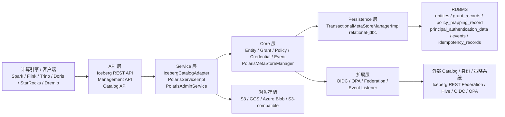
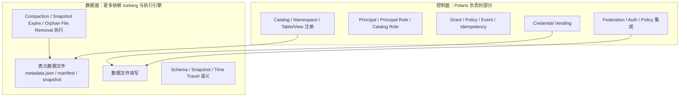
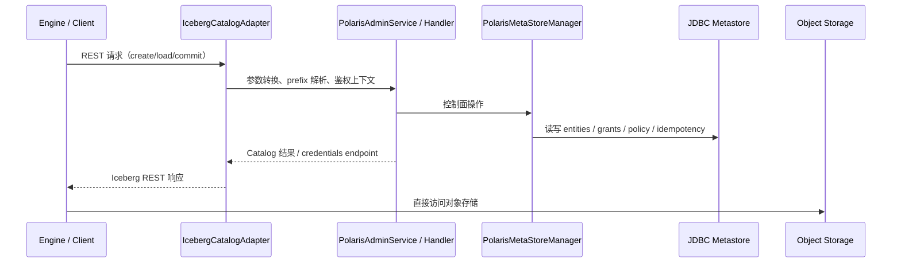

# Apache Polaris 调研报告

## A. 定位与设计目标

### 项目来源
- 发起方：Snowflake。
- 捐赠路径：Snowflake 于 2024 年将 Polaris 捐赠给 Apache Software Foundation，当前仍处于 Apache Incubator。
- 当前版本：本地源码与已有报告都指向 1.3.0 这一代实现；第二版报告记录的发布日期为 `2026-01-16`。

### 初始痛点
- 为 Apache Iceberg 提供开放、标准化、可互操作的 REST Catalog。
- 降低私有 Catalog 锁定风险，让 Spark、Flink、Trino、Doris、StarRocks、Dremio OSS 等引擎共享同一套 Iceberg 元数据。
- 在开放互操作基础上补齐企业环境常见的权限控制、认证集成、临时存储凭证下发和审计/事件能力。

### 目标用户与典型场景
- 面向以 Iceberg 为核心表格式、需要多引擎共享表的企业数据平台团队。
- 典型场景：
  - 统一 Iceberg Catalog 服务层。
  - 中心化管理 Catalog、Namespace、Table/View、角色和权限。
  - 通过 credential vending 向执行引擎下发临时对象存储凭证。
  - 通过 federation 方式接入外部 Catalog。

### 设计目标与非目标

| 做什么 | 不做什么 |
|---|---|
| 实现并扩展 Iceberg REST Catalog 体系 | 不做自有查询引擎 |
| 强调开放互操作 | 不做通用 Data Catalog / 数据发现平台 |
| 提供中心化权限控制与凭证下发 | 不做 AI/ML 资产目录 |
| 支持内部 Catalog 与外部/联邦 Catalog | 不追求 Delta/Hudi/Paimon 多表格式统一 |

### 差异化主张
- Polaris 不是“大一统数据目录”，而是围绕 **Iceberg REST** 展开的开放 Catalog。
- 相比 Nessie 更轻，不引入 Git-like branch/tag/merge 语义。
- 相比 Unity Catalog 更窄，不把 model、volume、feature、vector 等扩成一等对象。
- 相比“仅实现 REST 协议”的参考实现更完整，额外覆盖管理 API、RBAC、realm、federation、policy、事件等能力。

### 源码补充
- 仓库 README 直接将项目结构划分为 `polaris-core`、`api`、`runtime`、`persistence`、`extensions` 几大块，表明它从一开始就不是“单个 REST handler 项目”，而是带完整运行时、持久化、扩展和运维结构的 Catalog 服务。
  - 参考：`D:\project\polaris\README.md:35-83`

---

## B. 核心概念与元数据模型

### 顶层抽象

```text
Realm（最高隔离单元）
  └─ Catalog（存储桶/业务边界）
      └─ Namespace（支持嵌套）
          ├─ Table（表）
          ├─ View（视图）
          └─ Policy（可附着到 catalog/namespace/table/view）

控制面对象（独立于数据面层级）：
- Principal（用户/服务身份）
- Principal Role（平台级角色）
- Catalog Role（Catalog 内局部角色）
```

#### 各层说明

| 层级 | 含义 | 说明 |
|---|---|---|
| **Realm** | 多租户隔离单元 | 请求路由、鉴权、持久化的统一隔离键；JDBC schema 全表带 `realm_id` |
| **Catalog** | 存储桶 / 业务边界 | 对应一个 Iceberg Catalog 或外部联邦 Catalog；管理存储配置、存储凭证 |
| **Namespace** | 命名空间（支持嵌套） | 层级结构：`Catalog → NS → NS → Table`；类似于数据库的 schema 分层 |
| **Table / View** | 表和视图 | 在 Polaris 内部统一为 `TABLE_LIKE` 实体，通过 subtype 区分 |
| **Policy** | 维护治理规则 | 可附着到任意层级；当前主要是 `system.*` 预定义维护策略 |

#### 控制面对象说明

| 对象 | 作用域 | 作用 |
|---|---|---|
| **Principal** | 全局 | 用户或服务账号的身份标识 |
| **Principal Role** | 全局 | 平台级角色（如 `admin`、`developer`）；可分配给 Principal |
| **Catalog Role** | 单 Catalog 内 | Catalog 内局部权限边界（如 `data_writer`、`readonly`）；需绑定到 Principal Role |

#### 层级关系图

```
┌─────────────────────────────────────────────────────────────┐
│                        Realm                                 │
│  ┌─────────────────────────────────────────────────────┐   │
│  │                    Catalog                            │   │
│  │  ┌─────────────────────────────────────────────┐    │   │
│  │  │              Namespace (可嵌套)               │    │   │
│  │  │  ┌─────────────────────────────────────┐    │    │   │
│  │  │  │    Table / View + Policy            │    │    │   │
│  │  │  └─────────────────────────────────────┘    │    │   │
│  │  └─────────────────────────────────────────────┘    │   │
│  └─────────────────────────────────────────────────────┘   │
│                                                              │
│  ┌──────────────┐    ┌──────────────────┐                   │
│  │   Principal  │───▶│  PrincipalRole   │                   │
│  └──────────────┘    └────────┬─────────┘                   │
│                               │ 关联                          │
│                      ┌────────▼─────────┐                   │
│                      │  CatalogRole     │                   │
│                      │  (在特定 Catalog) │                   │
│                      └──────────────────┘                   │
└─────────────────────────────────────────────────────────────┘
```

### 源码级模型说明

#### 1. 统一实体类型系统
- Polaris 并不是为 catalog、namespace、table、role、policy 分别维护很多独立的持久化主表，而是采用统一的实体类型系统。
- `PolarisEntityType` 定义了核心实体类型：
  - `PRINCIPAL`
  - `PRINCIPAL_ROLE`
  - `CATALOG`
  - `CATALOG_ROLE`
  - `NAMESPACE`
  - `TABLE_LIKE`
  - `TASK`
  - `FILE`
  - `POLICY`
- 其中：
  - `CATALOG_ROLE` 的父级是 `CATALOG`
  - `NAMESPACE` 的父级是 `CATALOG`，并且允许自引用嵌套
  - `TABLE_LIKE` 的父级是 `NAMESPACE`
  - `POLICY` 的父级也是 `NAMESPACE`
- 这意味着 Polaris 的核心对象模型本质上是“一棵类型化实体树”。
  - 参考：`D:\project\polaris\polaris-core\src\main\java\org\apache\polaris\core\entity\PolarisEntityType.java:26-79`

#### 2. Realm 是最外层隔离单元
- `RealmContext` 非常轻，只暴露 `getRealmIdentifier()`，说明 realm 本身更像请求路由与隔离上下文，而不是一个重业务对象。
- 但在持久化层它是一级关键分区键，所有核心表都带 `realm_id`，说明 realm 不只是逻辑概念，而是贯穿请求、鉴权、存储隔离的主线。
  - 参考：`D:\project\polaris\polaris-core\src\main\java\org\apache\polaris\core\context\RealmContext.java:21-27`
  - 参考：`D:\project\polaris\persistence\relational-jdbc\src\main\resources\postgres\schema-v4.sql:36-56`

#### 3. Catalog 模型
- `CatalogEntity` 负责在 REST 模型和持久化实体之间转换。
- `CatalogEntity.fromCatalog(...)` 会把 REST 请求模型转换为内部实体，同时写入：
  - 目录名
  - properties
  - `catalogType`
  - storage config
  - 对外部 Catalog 场景还可能写入 connection config
- `CatalogEntity.asCatalog(...)` 则会把内部实体恢复为：
  - `PolarisCatalog`（内部 Catalog）
  - `ExternalCatalog`（外部/联邦 Catalog）
- 这说明 Polaris 在 Catalog 级别已经显式区分 internal / external，而不是后期通过某个 flag 临时扩展。
  - 参考：`D:\project\polaris\polaris-core\src\main\java\org\apache\polaris\core\entity\CatalogEntity.java:98-153`

#### 4. Namespace 模型
- `NamespaceEntity` 通过 `parent-namespace` 内部属性保存父命名空间编码值，并通过 `asNamespace()` 还原完整层级。
- Builder 在创建时会自动拆出父 namespace 和最后一级 name，这说明嵌套 namespace 是 Polaris 原生模型的一部分，不是仅靠字符串路径拼接模拟。
  - 参考：`D:\project\polaris\polaris-core\src\main\java\org\apache\polaris\core\entity\NamespaceEntity.java:32-68`
  - 参考：`D:\project\polaris\polaris-core\src\main\java\org\apache\polaris\core\entity\NamespaceEntity.java:76-99`

#### 5. Table / View 模型
- Polaris 把表和视图统一归入 `TABLE_LIKE` 大类，再通过 subtype 区分。
- `IcebergTableLikeEntity` 明确只接受 `ICEBERG_TABLE` 与 `ICEBERG_VIEW` 两种 subtype。
- 它在内部属性中保存 `metadata-location`，并把 Iceberg 元数据文件中的关键字段名常量化，例如：
  - `format-version`
  - `current-snapshot-id`
  - `snapshots`
  - `statistics`
  - `partition-statistics`
- 这说明 Polaris 对 Table/View 的建模方式是：
  - 控制面上仍然是统一实体；
  - 数据面上核心抓手是 Iceberg metadata location，而不是把整套表元数据重新设计成 Polaris 自有格式。
  - 参考：`D:\project\polaris\polaris-core\src\main\java\org\apache\polaris\core\entity\table\IcebergTableLikeEntity.java:38-85`
  - 参考：`D:\project\polaris\polaris-core\src\main\java\org\apache\polaris\core\entity\table\IcebergTableLikeEntity.java:104-120`
  - 参考：`D:\project\polaris\polaris-core\src\main\java\org\apache\polaris\core\entity\table\IcebergTableLikeEntity.java:122-210`

#### 6. Principal Role 与 Catalog Role 双层角色模型
- `PrincipalRoleEntity` 是顶层实体，`parentId` 绑定到 root，说明它是全局角色。
- `CatalogRoleEntity` 则挂在 catalog 下，说明它是 catalog 内局部角色。
- 这一设计把”平台级身份聚合”和”catalog 内授权边界”拆开了：
  - Principal Role：承接 principal 到平台角色的映射。
  - Catalog Role：承接 catalog 内具体资源权限。
- 这也是 Polaris RBAC 的核心结构。
  - 参考：`D:\project\polaris\polaris-core\src\main\java\org\apache\polaris\core\entity\PrincipalRoleEntity.java:65-89`
  - 参考：`D:\project\polaris\polaris-core\src\main\java\org\apache\polaris\core\entity\CatalogRoleEntity.java:62-75`

##### 6.1 RBAC 权限管理机制

###### 层级结构

```
Principal（用户/服务账号）
    ├─ 激活 → PrincipalRole（平台级角色，可分配多个）
    │       └─ 激活 → CatalogRole（在特定 Catalog 内的角色）
    │               └─ 持有 → Grant（具体资源权限）
    └─ 持有 → 直接 Grant（少量特殊权限）
```

| 实体 | 作用域 | 层级 | 说明 |
|---|---|---|---|
| Principal | 全局 | root 下 | 对应一个用户或服务账号 |
| PrincipalRole | 全局 | root 下 | 平台级角色，如 `admin`、`developer` |
| CatalogRole | 单 Catalog | Catalog 下 | Catalog 内局部角色，如 `data_writer`、`readonly` |
| Grant | 可细化 | 多级 | 关联 CatalogRole 与目标资源（catalog/namespace/table/view/policy） |

###### 授权对象类型

Grant 可授权的目标对象类型：
- `CATALOG` - 整个 Catalog
- `NAMESPACE` - 命名空间（含嵌套）
- `TABLE` - 表
- `VIEW` - 视图
- `POLICY` - 策略

###### 认证与授权流程

```
1. 请求进入 → DefaultAuthenticator
                ├─ 解析 Principal（从 token/credential 中提取身份）
                ├─ 从请求中获取要激活的 PrincipalRole
                └─ 从 Metastore 加载该 Principal 的所有 Grants
                    → 计算出最终 Active Roles（PrincipalRole + CatalogRole 组合）

2. 鉴权时 → 检查 Active Roles 是否持有目标资源的必要权限
```

关键点：
- **Principal Role 是平台级激活凭证**，决定用户可以在哪些 Catalog 内做什么
- **Catalog Role 是 Catalog 内权限边界**，决定在特定 Catalog 内的具体操作能力
- **双层解耦**：平台身份和单个 Catalog 的权限分开管理，便于跨 Catalog 权限管理

###### 角色分配示例

```sql
-- 创建一个 principal（用户）
CREATE PRINCIPAL alice;

-- 创建一个平台级角色
CREATE PRINCIPAL ROLE data_engineer;

-- 将平台角色分配给用户（用户 Alice 激活 data_engineer 角色）
GRANT PRINCIPAL_ROLE data_engineer TO PRINCIPAL alice;

-- 在某个 Catalog 下创建 Catalog 级角色
CREATE CATALOG_ROLE data_writer IN my_catalog;

-- 给 Catalog 角色授权（在 my_catalog 下的 namespace foo 上有写权限）
GRANT USAGE ON NAMESPACE foo TO CATALOG_ROLE data_writer;
GRANT SELECT,INSERT,UPDATE ON TABLE foo.users TO CATALOG_ROLE data_writer;

-- 将 Catalog 角色分配给平台角色
GRANT CATALOG_ROLE data_writer TO PRINCIPAL_ROLE data_engineer;
```

###### 与 OPA 的集成

Polaris 支持将外部 Policy Decision Point（PDP）委托给 OPA：
- Polaris 作为 Policy Administration Point（PAP）
- 授权决策可交给外部 OPA 处理
- 适用于复杂 ABAC 策略场景

  参考：`D:\project\polaris\runtime\service\src\main\java\org\apache\polaris\service\admin\PolarisAdminService.java:1975-2065`

#### 7. Policy 是一等对象
- `PolicyEntity` 不是附在资源上的松散 JSON，而是独立实体类型 `POLICY`。
- 一个 policy 至少携带：
  - `policy-type-code`
  - `policy-description`
  - `policy-version`
  - `policy-content`
- policy 同样挂在 namespace 下，这表示它与 namespace/table/view 共享相近的层级管理方式。
  - 参考：`D:\project\polaris\polaris-core\src\main\java\org\apache\polaris\core\policy\PolicyEntity.java:34-90`
  - 参考：`D:\project\polaris\polaris-core\src\main\java\org\apache\polaris\core\policy\PolicyEntity.java:92-141`

#### 8. 预定义 Policy 类型
- 当前源码里的系统预定义策略类型主要是维护类策略，而不是行列级安全策略：
  - `system.data-compaction`
  - `system.metadata-compaction`
  - `system.orphan-file-removal`
  - `system.snapshot-expiry`
- 且这些策略都被标记为 `isInheritable=true`，说明 Polaris 的 policy 更偏向“可继承的治理/维护规则”。
  - 参考：`D:\project\polaris\polaris-core\src\main\java\org\apache\polaris\core\policy\PredefinedPolicyTypes.java:27-35`
  - 参考：`D:\project\polaris\polaris-core\src\main\java\org\apache\polaris\core\policy\PredefinedPolicyTypes.java:63-107`

### 元数据持久化模型

#### 1. `entities` 是统一主表
- JDBC schema 中的 `entities` 表保存所有核心实体。
- 关键字段包括：
  - `realm_id`
  - `catalog_id`
  - `id`
  - `parent_id`
  - `name`
  - `entity_version`
  - `type_code`
  - `sub_type_code`
  - `properties`
  - `internal_properties`
  - `grant_records_version`
  - `location_without_scheme`
- 唯一约束 `(realm_id, catalog_id, parent_id, type_code, name)` 说明同一父级下同类型同名对象不能重复。
  - 参考：`D:\project\polaris\persistence\relational-jdbc\src\main\resources\postgres\schema-v4.sql:36-63`

#### 2. 授权、认证、策略、事件、幂等也有独立表
- `grant_records`：授权关系。
- `principal_authentication_data`：principal 的 client_id / secret hash。
- `policy_mapping_record`：policy 与目标对象的绑定关系。
- `events`：事件记录。
- `idempotency_records`：REST 幂等记录。
- 这说明 Polaris 的元数据层不仅管理“数据对象”，还管理控制面与运维面元数据。
  - 参考：`D:\project\polaris\persistence\relational-jdbc\src\main\resources\postgres\schema-v4.sql:83-171`

#### 3. `ModelEntity` 映射统一实体表
- `ModelEntity` 对 `entities` 表字段做一一映射，再转换回 `PolarisBaseEntity`。
- 它显式把 `properties` 和 `internal_properties` 当作 JSON 字符串处理，也保留 `grant_records_version` 和 `location_without_scheme`。
- 这进一步确认 Polaris 的元数据模型是“统一实体表 + 类型系统 + JSON 属性扩展”的方式。
  - 参考：`D:\project\polaris\persistence\relational-jdbc\src\main\java\org\apache\polaris\persistence\relational\jdbc\models\ModelEntity.java:33-80`
  - 参考：`D:\project\polaris\persistence\relational-jdbc\src\main\java\org\apache\polaris\persistence\relational\jdbc\models\ModelEntity.java:86-137`

### 结论
- Polaris 的核心建模不是”丰富资产模型”，而是”围绕 Iceberg Catalog 的统一实体树”。
- 它把扩展重点放在：
  - RBAC
  - Federation
  - Credential Vending
  - Policy / 维护规则
  - Event / Idempotency
- 它没有把 AI/ML 资产、搜索、血缘、质量等纳入同一元数据主模型。

### 9. Generic Table API（非 Iceberg 表格式的扩展机制）

#### 背景与设计动机

Polaris 最初定位为 Iceberg REST Catalog，但实际环境中存在大量 Delta Lake、Hudi、Paimon、Lance 等表格式。为了在 Polaris 中统一管理这些格式，Polaris 引入了 **Generic Table API** 作为扩展机制。

#### 核心概念

Generic Table 是 Polaris 中的一种**通用表实体**，不依赖特定表格式的元数据规范：

| 字段 | 必填 | 说明 |
|---|---|---|
| **name** | 是 | 表在命名空间内的唯一标识符 |
| **format** | 是 | 表格式标识（如 `delta`、`csv`、`lance`） |
| **base-location** | 否 | 表根目录的 URI（如 `s3://bucket/path/to/table`） |
| **properties** | 否 | 键值对格式的扩展属性 |
| **doc** | 否 | 表的描述信息 |

#### Generic Table API vs Iceberg Table API

Polaris 为两类表提供了不同的 API 端点：

| 操作 | Iceberg Table API | Generic Table API |
|---|---|---|
| Create Table | `POST .../namespaces/{ns}/tables` | `POST .../namespaces/{ns}/generic-tables` |
| Load Table | `GET .../namespaces/{ns}/tables/{table}` | `GET .../namespaces/{ns}/generic-tables/{table}` |
| Drop Table | `DELETE .../namespaces/{ns}/tables/{table}` | `DELETE .../namespaces/{ns}/generic-tables/{table}` |
| List Tables | `GET .../namespaces/{ns}/tables` | `GET .../namespaces/{ns}/generic-tables` |

两种 API 的**命名空间层级共享**，但表格式操作完全隔离。

#### 支持的格式

当前 Generic Table API 主要支持以下格式：

| 格式 | 状态 | 说明 |
|---|---|---|
| Lance | 正式支持 | 2026-01 官方集成，有完整 Lance Namespace 实现 |
| Delta Lake | 理论支持 | API 层面支持 `format=delta`，但无深度集成 |
| CSV / Parquet | 理论支持 | 可注册为 Generic Table，但无写入治理 |

#### 局限性

| 能力 | 当前状态 | 原因 |
|---|---|---|
| Credential Vending | **不支持** | 非 Iceberg 格式不通过 REST Catalog 路径读写数据 |
| Table Commit Path | **受限** | Delta/Lance 等格式创建后不通过 Catalog 提交 |
| 元数据完整性 | **弱** | Generic Table 只记录 location，不解析格式内部元数据 |
| 事务支持 | **无** | 各格式自身负责 ACID 语义，Catalog 不参与 |

#### 设计启示

1. **Generic Table API 是 Polaris 扩展多表格式的官方路径**，但各格式的深度集成取决于该格式是否愿意将 Catalog 作为信任源
2. **信任链断裂问题**：Iceberg 通过 REST Catalog 路径实现元数据权威，而 Delta/Lance 等格式的元数据在格式自身，Catalog 只是”登记地址”
3. **如果自研需要支持多表格式**，可参考 Generic Table API 思路，但需提前设计”格式元数据同步机制”以避免 Catalog 成为摆设

---

## C. 架构与关键设计

### 分层结构

结合 README 和运行时代码，可将 Polaris 概括为五层：

```text
API / Spec
  ├─ Management API
  ├─ Catalog API
  └─ Iceberg REST API

Service / Runtime
  ├─ PolarisServiceImpl
  ├─ PolarisAdminService
  ├─ IcebergCatalogAdapter
  └─ Auth / Event / Config components

Core
  ├─ Entity model
  ├─ Policy model
  ├─ Grant / credential / event abstractions
  └─ PolarisMetaStoreManager

Persistence
  ├─ TransactionalMetaStoreManagerImpl / AtomicOperationMetaStoreManager
  └─ relational-jdbc

Extensions
  ├─ federation-hadoop
  └─ federation-hive
```

### 架构图

#### 1. 总体架构图



#### 2. 控制面与数据面职责划分图



#### 3. 请求路径示意图



### 源码级架构说明

#### 1. API 层是三套接口，而不是单一 REST 面
- README 明确区分：
  - Polaris Management API
  - Iceberg REST API
  - Polaris Catalog API
- 这说明 Polaris 对外并不是只暴露 Iceberg REST，还保留了管理面与扩展管理接口。
  - 参考：`D:\project\polaris\README.md:43-56`

#### 2. `IcebergCatalogAdapter` 是协议适配层
- `IcebergCatalogAdapter` 实现 `IcebergRestCatalogApiService` 与 `IcebergRestConfigurationApiService`。
- 它的核心职责不是自己处理元数据，而是：
  - 把 `prefix` 解析成 catalog name
  - 校验 request
  - 创建 `IcebergCatalogHandler`
  - 委托具体操作
- `withCatalog(...)` / `withCatalogByName(...)` 显示它是一个典型 adapter/facade。
  - 参考：`D:\project\polaris\runtime\service\src\main\java\org\apache\polaris\service\catalog\iceberg\IcebergCatalogAdapter.java:72-125`

#### 3. `PolarisAdminService` 是管理面业务编排层
- `PolarisServiceImpl` 更像 OpenAPI 生成接口后的 REST service 实现。
- 真正的管理面业务逻辑在 `PolarisAdminService` 中，例如：
  - `createCatalog(...)`
  - `createPrincipalRole(...)`
  - `createCatalogRole(...)`
  - `listGrantsForCatalogRole(...)`
- 例如 `createCatalog(...)` 中除了落库，还处理：
  - catalog location overlap 校验
  - reserved properties 清理
  - external catalog federation 的 secret 引用提取
  - service identity 分配
- 这说明 Polaris 在管理面采用“API 层薄、业务服务层厚”的设计。
  - 参考：`D:\project\polaris\runtime\service\src\main\java\org\apache\polaris\service\admin\PolarisServiceImpl.java:127-134`
  - 参考：`D:\project\polaris\runtime\service\src\main\java\org\apache\polaris\service\admin\PolarisAdminService.java:700-794`
  - 参考：`D:\project\polaris\runtime\service\src\main\java\org\apache\polaris\service\admin\PolarisAdminService.java:1217-1350`

#### 4. `PolarisMetaStoreManager` 是控制面能力汇聚接口
- `PolarisMetaStoreManager` 并不只是 CRUD 接口，而是同时继承：
  - `PolarisSecretsManager`
  - `PolarisGrantManager`
  - `PolarisCredentialVendor`
  - `PolarisPolicyMappingManager`
  - `PolarisEventManager`
  - `PolarisMetricsManager`
- 这很关键，说明在架构上 Polaris 把授权、凭证、策略、事件、指标都视为 metastore manager 的一部分，而不是外围插件。
  - 参考：`D:\project\polaris\polaris-core\src\main\java\org\apache\polaris\core\persistence\PolarisMetaStoreManager.java:63-69`


#### 5. 持久化事务由 `TransactionalMetaStoreManagerImpl` 统一封装
- `TransactionalMetaStoreManagerImpl` 是控制面事务逻辑的主实现。
- 它负责：
  - 持久化新实体
  - 更新实体
  - 删除实体
  - 同步清理 grants / policies / principal secrets
- `dropEntity(...)` 里可以看到一个很典型的控制面事务流程：
  - 加载并删除所有 grant records
  - 回写关联对象的 `grant_records_version`
  - 清理 policy mapping
  - 删除实体
  - 如果是 principal，再删除 secrets
- 这说明 Polaris 并不是“删一条 entities 记录”那么简单，而是把控制面一致性维护集中在 metastore transaction 内完成。
  - 参考：`D:\project\polaris\polaris-core\src\main\java\org\apache\polaris\core\persistence\transactional\TransactionalMetaStoreManagerImpl.java:117-157`
  - 参考：`D:\project\polaris\polaris-core\src\main\java\org\apache\polaris\core\persistence\transactional\TransactionalMetaStoreManagerImpl.java:174-256`


#### 6. Policy 挂载有独立映射层，而不是塞进资源属性
- `loadPoliciesOnEntity(...)` / `loadPoliciesOnEntityByType(...)` 会先查目标实体，再查 policy mapping 记录，再回装 policy 实体。
- `persistNewPolicyMappingRecord(...)` 单独创建 `PolarisPolicyMappingRecord`。
- 这意味着 policy 与 target 的关系是标准多对多映射，不是把 policy content 直接嵌入 table 或 namespace properties。
  - 参考：`D:\project\polaris\polaris-core\src\main\java\org\apache\polaris\core\persistence\transactional\TransactionalMetaStoreManagerImpl.java:2476-2526`
  - 参考：`D:\project\polaris\polaris-core\src\main\java\org\apache\polaris\core\persistence\transactional\TransactionalMetaStoreManagerImpl.java:2539-2569`


#### 7. 认证设计是“统一认证器 + realm 配置”
- `AuthenticationConfiguration` 按 `polaris.authentication.realm` 做 realm 级配置，并支持 default realm fallback。
- `DefaultAuthenticator` 同时适用于 internal / external 认证场景。
- 它的认证逻辑是：
  - 先解析 principal
  - 再从 credentials 中提取请求激活的 principal role
  - 再到 metastore 里加载 principal 的 grants，得到最终 active roles
- 这说明 Polaris 把“认证”和“激活哪些角色”明确分开处理。
  - 参考：`D:\project\polaris\runtime\service\src\main\java\org\apache\polaris\service\auth\AuthenticationConfiguration.java:29-48`
  - 参考：`D:\project\polaris\runtime\service\src\main\java\org\apache\polaris\service\auth\DefaultAuthenticator.java:44-56`
  - 参考：`D:\project\polaris\runtime\service\src\main\java\org\apache\polaris\service\auth\DefaultAuthenticator.java:91-196`


#### 8. Credential Vending 直接体现在 Iceberg REST 流程里
- `AccessDelegationMode` 用于表达 Iceberg REST 协议中的 access delegation mode。
- `IcebergCatalogAdapter.createTable(...)` 和 `loadTable(...)` 会解析 delegation mode。
- 当 mode 包含 `VENDED_CREDENTIALS` 时，会生成 refresh credentials endpoint。
- `loadCredentials(...)` 则单独暴露凭证刷新入口。
- 这说明 credential vending 不是旁路扩展，而是被直接嵌入 Iceberg REST 资源模型。
  - 参考：`D:\project\polaris\runtime\service\src\main\java\org\apache\polaris\service\catalog\AccessDelegationMode.java:36-83`
  - 参考：`D:\project\polaris\runtime\service\src\main\java\org\apache\polaris\service\catalog\iceberg\IcebergCatalogAdapter.java:257-360`
  - 参考：`D:\project\polaris\runtime\service\src\main\java\org\apache\polaris\service\catalog\iceberg\IcebergCatalogAdapter.java:515-529`


#### 9. 事件是显式设计点
- `PolarisCatalogsEventServiceDelegator` 在 create/delete/get/update catalog 与 catalog role 等管理操作前后显式派发事件。
- 再结合 JDBC schema 中的 `events` 表，可以看出 Polaris 不是只有日志，而是有结构化事件通道。
  - 参考：`D:\project\polaris\runtime\service\src\main\java\org\apache\polaris\service\admin\PolarisCatalogsEventServiceDelegator.java:70-173`
  - 参考：`D:\project\polaris\persistence\relational-jdbc\src\main\resources\postgres\schema-v4.sql:131-143`


### 一致性与事务模型

#### 1. 控制面元数据事务
- 对 Polaris 自己管理的实体、授权、policy mapping、principal secret、events/idempotency 等，事务边界主要落在 metastore persistence 层。
- `entity_version` 用于对象版本控制。
- `grant_records_version` 用于授权关系变化后的失效与并发控制。

#### 2. 表级提交依赖 Iceberg
- `IcebergCatalogAdapter.commitTransaction(...)` 只是做 request 清洗和校验，然后委托 `catalog.commitTransaction(revisedRequest)`。
- 这说明多表提交能力来自 Iceberg REST / 底层表格式语义，而不是 Polaris 自己再实现一层分布式事务管理器。
  - 参考：`D:\project\polaris\runtime\service\src\main\java\org\apache\polaris\service\catalog\iceberg\IcebergCatalogAdapter.java:624-654`

#### 3. 没有独立的跨 Catalog 分布式事务系统
- 从代码结构看不到类似 Saga/2PC/全局事务协调器的独立模块。
- 因而更稳妥的结论是：
  - Polaris 擅长 Catalog 控制面事务；
  - 不主打跨 Catalog 的分布式事务。


### 持久化选型
- 生产主路径是 `relational-jdbc`。
- `JdbcMetaStoreManagerFactory` 会为每个 realm 初始化：
  - schema version
  - `JdbcBasePersistenceImpl`
  - `PolarisMetaStoreManager`
- bootstrap 阶段会执行 SQL 脚本创建 schema，并为 realm 创建 root principal。
  - 参考：`D:\project\polaris\persistence\relational-jdbc\src\main\java\org\apache\polaris\persistence\relational\jdbc\JdbcMetaStoreManagerFactory.java:96-122`
  - 参考：`D:\project\polaris\persistence\relational-jdbc\src\main\java\org\apache\polaris\persistence\relational\jdbc\JdbcMetaStoreManagerFactory.java:149-191`

#### 为什么是关系型数据库
- 从源码和 schema 看，Polaris 控制面元数据具有明显关系型特征：
  - 层级实体树
  - 多对多授权关系
  - 多对多 policy mapping
  - 幂等状态机
  - 事件与报表记录
- 因而关系型数据库的优势在这里很明显：
  - 事务边界清晰
  - 一致性更强
  - schema 演进可管理
  - 查询与索引模型成熟

### 部署形态
- 运行时基于 Quarkus。
- 提供 Docker、Helm、Kubernetes 部署路径。
- 逻辑多租户主要通过 realm 实现。
- 目前更像单服务进程 + 可扩展模块，而不是复杂微服务矩阵。

### 关键设计判断
1. Polaris 的架构重点不是“算”，而是“控”。
2. 它把控制面的复杂度集中到 metastore manager，而不是分散在各个 API handler。
3. 它用统一实体树简化模型，用外部表格式语义承接数据面事务。
4. 它对存储优化采取“建模治理、而非亲自执行”的策略。

---

## D. 协议与接口

### 对外协议

| 协议/接口 | 结论 |
|---|---|
| Iceberg REST Catalog Spec | 核心兼容目标，也是 Polaris 的中心能力 |
| Polaris Management API | 官方公开 OpenAPI |
| Polaris Catalog API | 官方公开 OpenAPI |
| HMS Thrift | 不以 HMS Thrift 服务形态对外兼容 |
| gRPC | 未见官方支持 |
| JDBC | 不是对外 Catalog 协议，而是内部持久化实现 |

### Federation
- 支持外部 Iceberg REST Catalog federation。
- 仓库中也存在 Hive federation 扩展模块。
- 这说明 Polaris 的“外部接入”是其正式设计方向之一，而不是样例级功能。

### SDK / 客户端生态
- Polaris 的主互操作单元不是自家多语言 SDK，而是 Iceberg REST 兼容客户端。
- README 中明确点名的引擎包括 Doris、Flink、Spark、Dremio OSS、StarRocks、Trino。

### 认证协议
- 控制面：internal / external OIDC / mixed。
- 联邦远端认证：OAuth2 client credentials、bearer token、AWS SigV4。
- 数据面：credential vending 下发临时对象存储凭证。

### 源码补充
- 默认 `CatalogPrefixParser` 直接把 prefix 映射为 catalogName，说明当前默认实现里 Iceberg REST `prefix` 与 Polaris catalog 名是一一对应的。
  - 参考：`D:\project\polaris\runtime\service\src\main\java\org\apache\polaris\service\catalog\DefaultCatalogPrefixParser.java:23-33`

---

## E. 功能矩阵

| 能力域 | Polaris 结论 | 说明 |
|---|---|---|
| 表格式支持 | 强支持 Iceberg，扩展支持 Lance | Iceberg 是核心定位；Lance 通过 Generic Table API 接入（2026-01 官方集成） |
| Delta/Hudi/Paimon | 不支持 | 当前不在主产品边界 |
| Lance 格式 | 通过 Generic Table API 支持 | 支持 DeclareTable / ListTables / DescribeTable / DeregisterTable；不支持 Credential Vending 和 Commit Path |
| Namespace / Table / View | 支持 | View 也是一等对象 |
| 嵌套 Namespace | 支持 | 源码中有父 namespace 编码 |
| Schema 演化 | 依赖 Iceberg / 客户端 | Polaris 主要承接 Catalog 层 |
| 版本管理 | 依赖 Iceberg | Time Travel / Snapshot 由 Iceberg 提供 |
| Branch / Tag / Merge | 不支持 | 与 Nessie 路线不同 |
| 存储优化与调度 | 建模层面支持 | Compaction / Expiry / Orphan Removal 以 Policy 建模，但不直接执行 |
| 查询加速 | 依赖 Iceberg / 客户端 | 数据跳读、Metadata Index 由引擎负责 |
| 跨表事务 | 不主打 | 更依赖 Iceberg 自身语义 |
| 视图与物化视图 | View 支持，MV 不支持 | View 是一等对象，MV 刷新调度不在范围内 |
| RBAC | 支持 | Principal Role + Catalog Role 双层结构 |
| 外部 PDP / OPA | 支持 | 已有明确集成路径 |
| 行列级安全 | 未见原生能力 | 不属于其当前治理深度 |
| Policy Framework | 支持 | 重点新增能力，含预定义维护策略 |
| 审计 / 事件 | 基础支持 | 事件通道 + 事件表 |
| 搜索与发现 | 不支持 | 不属于其产品定位 |
| 数据质量 | 不支持 | 无内置数据校验规则 |
| 血缘 | 不支持 | 无列级/表级血缘采集能力 |
| AI/ML 资产治理 | 不支持 | 无 model / feature / vector 原生对象 |
| Credential Vending | 支持 | 直接嵌入 Iceberg REST 流程，AccessDelegationMode 支持 VENDED_CREDENTIALS |
| 数据共享 | 依赖 Iceberg REST | 通过 federation 实现跨组织共享 |
- `listGrantsForCatalogRole(...)` 可把授权对象区分为 catalog、namespace、table、view、policy，说明这几类对象都已纳入统一授权域。
  - 参考：`D:\project\polaris\runtime\service\src\main\java\org\apache\polaris\service\admin\PolarisAdminService.java:1975-2065`

---

## F. 非功能特性

### 性能
- 未见公开系统级 benchmark 数据。
- 从 schema 与实现分析，已明确考虑的优化点：
  - 统一实体表索引（`entities` 主表）
  - grant / policy mapping 索引
  - idempotency 记录索引
  - metrics report 持久化
- **潜在退化场景**：REST Catalog 高并发场景下清单加载延迟、超大 Snapshot 数下的 manifest 扫描，暂无公开最佳实践。

### 可用性
- 具备 Docker、Helm、K8s 部署路径。
- 公开文档与源码层面**没有**看到完整 HA / DR 蓝图（RTO / RPO 指标未公开）。
- 单点部署是当前默认形态，多实例 HA 依赖外部负载均衡，而非内置主备切换。

### 可扩展性
- 水平扩展：通过多 realm 分区实现逻辑隔离，非状态分片。
- 状态管理：元数据存储于 JDBC，session / token 状态由 realm 管理。
- 整体形态仍是”单服务 + 模块扩展”，而非强微服务化。

### 可观测性
- 有 telemetry 与 metrics 基础（`PolarisMetricsManager`）。
- 事件表与 metrics report 表说明它在结构化可观测数据上有正式设计。
- 日志与 tracing 的开箱程度需进一步验证 Operator Guide。

### 安全
- principal 认证数据独立存于 `principal_authentication_data` 表。
- 支持 OIDC、内部 token、临时凭证下发（Credential Vending）。
- 支持 OPA 集成做外部 PDP。
- 传输加密：依赖外部 TLS。
- 密钥管理：credential vending 通过对象存储 STS / 临时凭证实现。
- **审计合规**：SOC2 / GDPR 等认证状态未在公开资料中确认。

### 多租户隔离
- realm 是主隔离单元（逻辑隔离）。
- JDBC schema 全表带 `realm_id`，体现”共享服务、按 realm 分区”模式。
- 不提供物理隔离（无 namespace / schema 级物理分区）。
- Quota 机制未在当前版本中看到显式实现。

---

## G. 生态与集成

### 计算引擎
- Polaris 的计算生态定位比较清晰，本质上是通过 Iceberg REST Catalog 对接外部计算引擎，而不是自带执行能力。
- README 明确点名的对接对象包括 Apache Doris、Apache Flink、Apache Spark、Dremio OSS、StarRocks、Trino，这说明它优先覆盖的是主流 Lakehouse 查询与计算引擎。
- 这类集成方式的优点是引擎接入面较广、协议边界清楚；代价是 Polaris 自身不负责上层作业编排、SQL 开发体验或统一计算治理。

### 存储后端
- Polaris 面向的是对象存储上的 Iceberg 表元数据管理，存储后端并不是内嵌专有能力，而是依赖外部对象存储体系。
- 官方主路径覆盖 AWS / Azure / GCP，同时兼容多种对象存储部署方式，包括 S3-compatible、MinIO、Ceph、RustFS、Ozone。
- 这意味着它在“云对象存储 + 开放表格式”场景下适配性较强，但前提仍是对象存储、凭证体系和访问路径需要与 Iceberg REST 的工作方式对齐。

### 云厂商
- 从 README、部署说明与 credential vending 相关实现看，Polaris 的一等公民云集成仍然集中在 AWS、Azure、GCP，重点围绕对象存储访问、身份凭证下发和外部 catalog 接入展开。
- 其中 AWS 路径最完整，既包括 S3 / Glue / IAM / STS 相关能力，也包括围绕 Iceberg REST Catalog 的 access delegation 与 credential vending 设计。
- Azure 与 GCP 也有明确入口，但整体成熟度、示例数量和生态强调程度仍主要落在三大主流公有云上。
- 对阿里云、腾讯云、华为云等国内云厂商，更合理的判断是“可以通过 S3-compatible 或通用对象存储接口兼容接入”，而不是“已经被官方按一等场景深度建设”。
- 因而在自研选型时，如果首期目标环境主要是国内云，必须单独评估 STS 或临时凭证机制、RAM/AKSK 体系、对象存储签名方式、元数据联邦能力以及凭证下发链路的适配成本。

### Federation / 外部 Catalog
- `external catalog + federation` 是 Polaris 的真实能力边界，而不是停留在概念层的路线图能力。
- 从 `createCatalog(...)` 的实现可以看到，外部 catalog 接入已经包含 connection config、secret reference、service identity 分配等控制面逻辑。
- 参考：`D:\project\polaris\runtime\service\src\main\java\org\apache\polaris\service\admin\PolarisAdminService.java:722-774`
- 这说明 Polaris 试图把自己定位成“统一入口型 catalog 控制面”，既可以托管本地 catalog，也可以把外部 catalog 纳入统一治理边界。

### AI/ML 与 BI
- Polaris 并不直接面向 BI 平台、AI 平台或数据资产门户提供完整产品化接口，它更接近底层 catalog 控制面。
- 更合理的消费方式仍然是”引擎通过 Iceberg REST 接 Polaris”，再由上层产品或平台承接开发、分析、建模和运营体验。
- 对选型来说，这意味着 Polaris 适合作为 Lakehouse 元数据与访问控制底座，但并不能替代完整的数据开发平台、BI 门户或 AI 数据管理产品。

### Lance 格式集成
- Polaris 通过 **Generic Table API** 支持 Lance 格式（官方集成公告：2026-01-06）。
- Lance 表在 Polaris 中被识别为：注册为 Generic Table + `format=lance` + `base-location` 指向 Lance 根目录 + `properties.table_type=lance`。
- **支持的操作**：CreateNamespace、ListNamespaces、DescribeNamespace、DropNamespace、DeclareTable、ListTables、DescribeTable、DeregisterTable。
- **支持的操作引擎**：Apache Spark、LanceDB、Ray、Trino 可通过 Lance Namespace 规范访问 Polaris 管理的 Lance 表。
- **不支持的能力**：
  - Credential Vending（未来计划支持）
  - OAuth 客户端刷新（未来计划支持）
  - Table Commit Path（Delta/Lance 创建后不通过 Catalog 提交，难以实现集中治理）
- **设计启示**：Generic Table API 是 Polaris 扩展多表格式的官方路径，但高级治理能力（如凭证下发、提交控制）仍受限于各格式自身语义。
- 参考：`D:\project\polaris\site\content\blog\2026\01\06\lance-integration.md`

---

## H. 运维与落地成本

### 部署依赖
- Java 21+
- Docker 27+
- JDBC 数据库
- 对象存储
- Kubernetes / Helm 可选

### 运维复杂度判断
- 优点：
  - 服务形态相对集中。
  - 基于 Quarkus，部署链路清晰。
  - 文档、Helm、Docker 路径相对完整。
- 不足：
  - federation、OIDC、credential vending 会显著提升集成复杂度。
  - 高可用与大规模生产最佳实践公开信息有限。

### 升级与 schema 演进
- JDBC schema 采用版本化脚本，如 `schema-v1.sql` 到 `schema-v4.sql`。
- 这说明持久化演进是被正式管理的，不是随代码隐式变更。

---

## I. 社区与治理

### 治理状态
- Apache Incubator 项目。
- 已不是 Snowflake 的单一私有项目，但 Snowflake 仍然是最重要的初始推动方。

### 社区成熟度判断
- 版本迭代较快，说明项目处于高速演进期。
- 但与 HMS 这类老牌基础组件相比，成熟度仍偏新。

### 源码侧观察
- 仓库模块划分、测试、扩展、Helm、docs 结构都比较完整，说明工程化质量是明显高于“概念性开源项目”的。

---

## J. License 与商业化

### License
- Apache License 2.0。
- 对 fork、二次开发、商用集成都比较友好。

### 商业化边界
- Polaris 由 Snowflake 发起并捐赠，但不能简单理解为 Snowflake 商业产品的 OSS/Enterprise 双版本拆分。
- 更准确地说，它是 Snowflake 推动的一个开源 Iceberg Catalog 路线项目。

### Fork 可行性
- 从许可和模块结构看，fork 可行性较高。
- 但真正代价集中在长期维护：
  - Iceberg REST 兼容演进
  - Federation
  - OIDC / token / credential vending
  - JDBC schema 与元数据兼容

---

## K. Roadmap 与趋势

### 可观察方向
- 持续增强 federation。
- 持续增强安全与策略体系：
  - OIDC
  - external PDP / OPA
  - policy framework
- 把部分数据维护规则上提到 policy 层。

### 不太像短期主方向的内容
- AI Asset Catalog
- 多表格式统一 Catalog
- Git-like 数据版本控制

### 设计趋势判断
- Polaris 的路线越来越清晰：
  - Iceberg-first
  - REST-first
  - Open interoperability
  - Security / policy / federation 增强

---

## L. 已知缺陷与局限

### 已证实局限
1. 定位较窄，核心是 Iceberg Catalog，而不是通用数据治理平台。
2. 没有 Git-like branch/tag/merge 模型。
3. 没有独立的跨 Catalog 分布式事务系统。
4. 没有 AI/ML 资产对象模型。
5. 没有搜索、血缘、数据质量等重治理能力。
6. 没有原生行级过滤、列级脱敏这类细粒度数据面治理能力。
7. 大规模生产成熟度公开材料有限。
8. 高可用、容灾、超大规模最佳实践公开信息不充分。

### 源码级佐证
- `commitTransaction(...)` 直接委托 Iceberg handler，而非引入独立全局事务协调器。
- policy 主要是维护策略，而非数据面细粒度安全策略。
- 实体类型系统中没有 model、feature、vector、volume 等一等对象类型。

---

## 设计启示

### 值得借鉴
1. 以 Iceberg REST 作为产品边界，生态兼容成本低。
2. 统一实体树 + 类型系统，比为每类对象单独造表更利于扩展。
3. 把权限、凭证、策略、事件纳入同一个控制面元数据体系。
4. 把 realm 作为统一隔离键，能同时贯穿请求、鉴权和持久化。
5. 把存储优化先建模成 policy，再决定是否单独引入执行器，是一种更稳妥的演进路径。

### 不应照搬
1. 不要把 Polaris 的 federation 增强误判为“多表格式统一 Catalog”。
2. 不要把 policy framework 等同于策略执行引擎。
3. 如果自研目标包含 AI 资产、血缘、搜索、质量，Polaris 的模型宽度明显不够。

### 架构选项小结

| 架构选项 | Polaris 的取舍 | 对自研 Lakehouse Table Catalog 的启示 |
|---|---|---|
| 产品边界 | 聚焦 Iceberg Catalog，而不是大一统数据治理平台 | 第一阶段宜先收敛边界，优先做强 Table Catalog 控制面 |
| 协议路线 | Iceberg REST First，同时保留 Management API / Catalog API | 若目标是多引擎互操作，建议优先以 Iceberg REST 为核心兼容面 |
| 系统形态 | 单服务进程 + 模块扩展，不走重微服务矩阵 | 早期自研宜优先单体或强模块化单体，降低协调成本 |
| 核心模型 | 统一实体树 + 类型系统 | 比“每类对象一套独立模型”更适合快速扩展 catalog/role/policy 等对象 |
| 权限模型 | Principal Role + Catalog Role 双层 RBAC | 值得重点借鉴，可把平台身份与 catalog 内授权边界拆开 |
| 认证设计 | 统一认证器 + realm 配置 + 请求级角色激活 | 适合企业环境，建议避免把身份解析、授权激活、租户隔离揉成一个黑盒 |
| 多租户方案 | realm 贯穿请求、鉴权、持久化 | 如果自研需要多租户，建议尽早决定隔离主键，不要后补 |
| 控制面事务 | 由 metastore manager 统一封装 | 建议把实体、授权、policy、secret、幂等等控制面变更放到统一事务边界里 |
| 数据面事务 | 依赖 Iceberg 语义，不自建全局事务协调器 | 第一阶段应尽量复用表格式语义，不建议过早做跨 Catalog 全局事务 |
| 持久化选型 | RDBMS + JDBC schema 演进 | 对第一阶段 Catalog 控制面，关系型数据库通常是更稳妥的默认选项 |
| Policy 建模 | policy 独立对象化，并通过 mapping 绑定目标 | 如果未来要接生命周期、治理、维护策略，建议尽早对象化 policy |
| 存储优化职责 | 建模治理，不亲自执行 compaction / expiry | 可采用“Catalog 管规则，执行器跑任务”的分层，而非把执行器硬塞进 Catalog |
| Credential Vending | 做进 Iceberg REST 主路径 | 如果目标包含企业级多云安全访问，这项能力最好早设计、早进入主协议 |
| Federation | 正式能力边界之一 | 适合后续演进方向，但不建议在最小可用阶段过度扩展 |
| 事件与审计 | 结构化事件，而非仅日志 | 若后续要接审计、异步治理、血缘采集，建议保留事件通道能力 |
| 非目标能力 | 不覆盖 AI/ML 资产、搜索、血缘、质量全家桶 | 若自研目标包含这些，需要额外设计上层模型，不应直接套 Polaris 路线 |

### 对自研 Lakehouse Table Catalog 的启示

| 决策问题                       | Polaris 的答案 | 对自研的启示                             |
| ------------------------------ | -------------- | ---------------------------------------- |
| 是否基于 Iceberg REST Spec     | 是             | 建议优先采用                             |
| 是否做 Git-like 版本控制       | 否             | 若需要可参考 Nessie                      |
| 是否做多表格式统一             | 否             | 若要做需额外参考 Gravitino / Unity       |
| 是否把权限做进 Catalog         | 是             | 非常值得借鉴                             |
| 是否做 Credential Vending      | 是             | 建议重点评估                             |
| 是否把存储优化执行放在 Catalog | 否             | 可考虑"Catalog 管策略，执行器跑任务"     |
| 是否把 AI Asset 作为一等公民   | 否             | 若目标包含 AI 资产，需另补模型层         |
| 多租户隔离方案                 | realm          | 建议尽早决定隔离主键，不要后补           |
| 持久化选型                     | RDBMS + JDBC   | 对控制面元数据，关系型是更稳妥的默认选项 |

---

## 结论

### 一句话判断
**Polaris 是当前较有代表性的、面向 Apache Iceberg 的开放 REST Catalog 实现之一，优势在开放互操作、权限模型、credential vending、federation 和工程化完整度；短板在资产模型宽度、重治理能力、跨域事务和超大规模成熟度。**

### 核心优势

| 维度               | 结论                                                        |
| ------------------ | ----------------------------------------------------------- |
| 协议标准           | 全面兼容 Iceberg REST Catalog Spec，是事实标准的重要实现    |
| 权限模型           | Principal Role + Catalog Role 双层 RBAC，隔离清晰           |
| Credential Vending | 直接嵌入 Iceberg REST 流程，支持临时对象存储凭证下发        |
| Federation         | 正式支持外部 Iceberg REST / Hive Catalog 接入               |
| Policy Framework   | 预定义维护策略（Compaction / Expiry / Orphan Removal）建模  |
| 工程化质量         | 模块化架构、版本化 schema、Quarkus 运行时、Helm/Docker 完整 |
| License            | Apache 2.0，fork 与商用友好                                 |

### 核心局限

| 维度          | 结论                                                |
| ------------- | --------------------------------------------------- |
| 资产模型宽度  | 仅覆盖 Iceberg Table/View，不支持 Delta/Hudi/Paimon |
| AI/ML 资产    | 无 Model / Feature / Vector 等一等对象              |
| 跨表事务      | 不主打全局分布式事务，依赖 Iceberg 自身语义         |
| Git-like 版本 | 不支持 Branch / Tag / Merge（与 Nessie 路线不同）   |
| 重治理能力    | 无搜索、血缘、数据质量、列级/行级安全               |
| 生产成熟度    | HA/DR 最佳实践、规模案例公开信息有限                |

### 适用场景

- 目标明确聚焦在 **Iceberg Catalog**，暂不追求多表格式统一
- 需要多引擎（Spark / Flink / Trino / Doris / StarRocks）共享 Iceberg 表
- 希望把 **权限控制** 和 **对象存储临时凭证下发** 收敛到 Catalog 层
- 需要 Federation 接入外部 Iceberg REST Catalog 或 Hive Metastore
- 接受"治理能力偏控制面，不覆盖重数据治理"的边界

### 不适用场景

- 目标是统一所有数据资产的**大一统 Catalog**（应考虑 Unity Catalog / Gravitino）
- 需要 **Git-like** branch/tag/merge 版本控制（应参考 Nessie）
- 需要 **Feature Store / Model Registry / Vector** 等 AI 资产对象（应参考 Unity Catalog）
- 需要**非常成熟的大规模 HA/DR**落地经验背书（当前公开案例有限）
- 需要**列级/行级安全**、血缘、数据质量等重治理能力

### 综合评价
- 如果你的自研方向是“开放 Iceberg Catalog 服务”，Polaris 非常值得深读，尤其是：
  - 统一实体建模
  - RBAC 分层
  - credential vending
  - policy mapping
  - realm 隔离
  - JDBC 持久化 schema 设计
- 如果你的目标是“更宽的 Lakehouse / AI 统一资产目录”，Polaris 更适合作为一个 **控制面骨架参考**，而不是完整产品蓝本。

---

## 参考资料

### 官方资料

- Apache Polaris 1.3.0 文档：https://polaris.apache.org/releases/1.3.0/
- Apache Polaris 发布页：https://polaris.apache.org/downloads/
- Apache Polaris GitHub 仓库：https://github.com/apache/polaris
- Apache Polaris Releases 索引：https://polaris.apache.org/releases/
- ASF Incubator 页面：https://incubator.apache.org/projects/polaris.html

### 关键文档

- Configuration：https://polaris.apache.org/releases/1.3.0/configuration/
- Creating a Catalog：https://polaris.apache.org/releases/1.3.0/getting-started/creating-a-catalog/
- Using Polaris：https://polaris.apache.org/releases/1.3.0/getting-started/using-polaris/
- Realm：https://polaris.apache.org/releases/1.3.0/realm/
- Access Control（in-dev 路径更完整）：https://polaris.apache.org/in-dev/unreleased/managing-security/access-control/
- OPA Integration：https://polaris.apache.org/releases/1.3.0/managing-security/external-pdp/opa/
- Policy Framework：https://polaris.apache.org/releases/1.3.0/policy/
- Iceberg REST Federation：https://polaris.apache.org/releases/1.3.0/federation/iceberg-rest-federation/
- Telemetry：https://polaris.apache.org/releases/1.3.0/telemetry/
