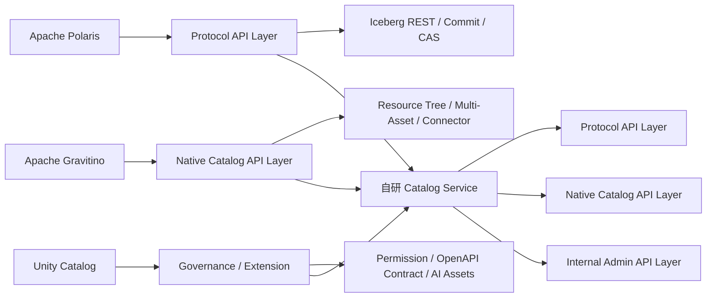
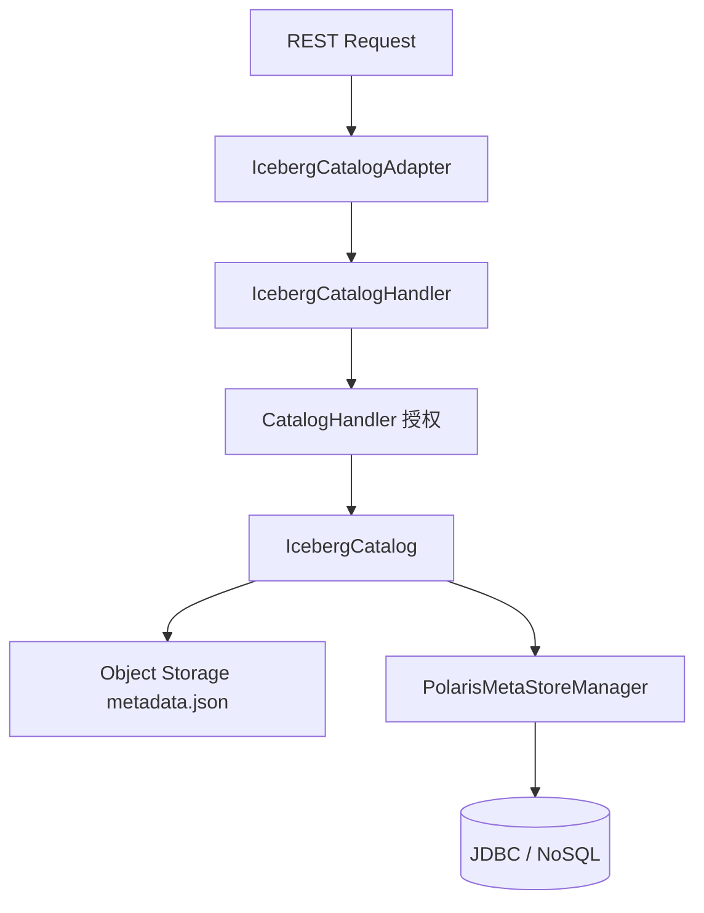
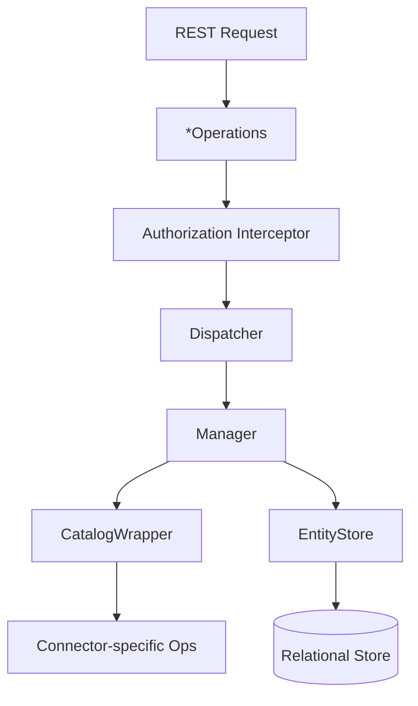
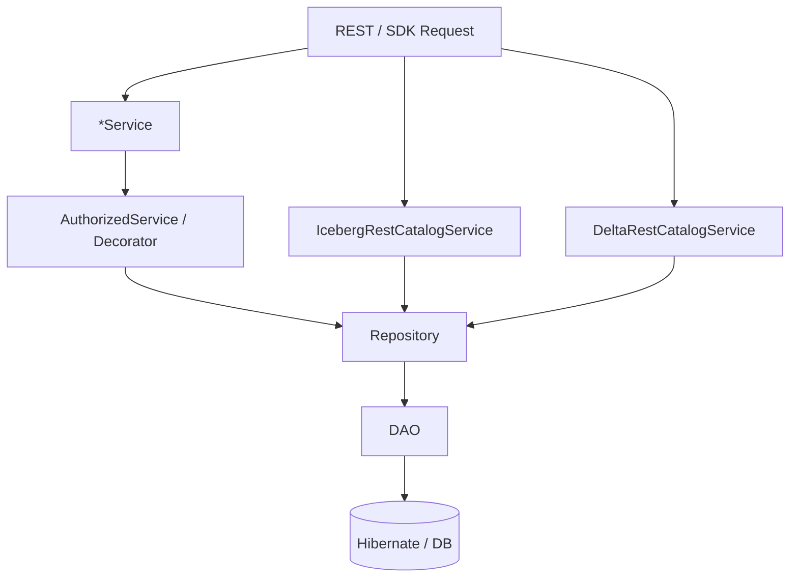
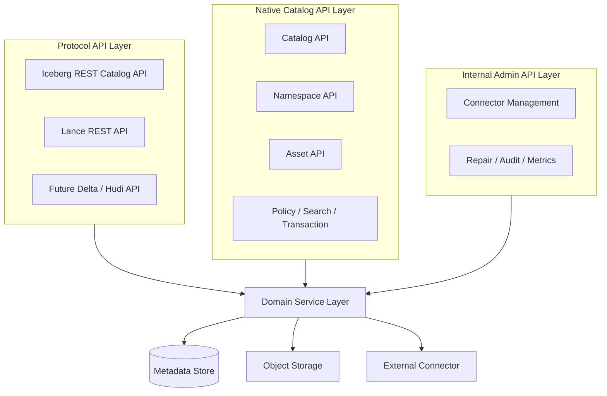
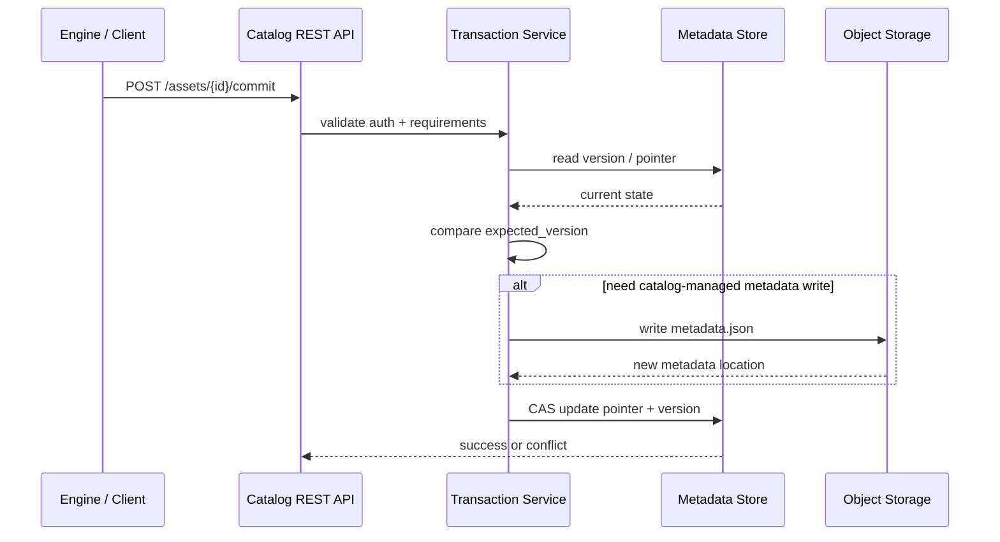

# 开源 Catalog Service REST API 源码分析报告

> 分析日期：2026-05-25  
> 分析对象：Apache Polaris、Apache Gravitino、Unity Catalog  
> 分析目标：为自研 Catalog Service 的 REST API 设计提供源码级参考

---

## 1. 结论摘要

本次分析只回答三个问题：协议层怎么做、原生平台层怎么做、治理与扩展层怎么做。

核心结论：

- **Polaris** 是 `Protocol API Layer` 的第一参考对象。它最值得借鉴的是 `Iceberg REST Catalog API`、`commit / transaction`、`metadata pointer` 管理，以及 `requirements + CAS` 并发控制。
- **Gravitino** 是 `Native Catalog API Layer` 的第一参考对象。它最值得借鉴的是层级清晰的资源树、多资产原生 API，以及 connector 路由与平台调度结构。
- **Unity Catalog** 是 `治理与扩展层` 的第一参考对象。它最值得借鉴的是 `OpenAPI contract`、`Repository / DAO` 分层、统一权限模型和 AI 资产建模。

对应到自研 Catalog Service，建议采用三层 API：

1. `Protocol API Layer`：Iceberg REST、Lance REST、未来 Delta/Hudi 兼容协议
2. `Native Catalog API Layer`：Catalog、Namespace、Asset、Policy、Search、Transaction
3. `Internal Admin API Layer`：Connector 管理、修复、审计、指标、后台任务

---

## 2. 总体判断图



判断标准：

- Polaris 更集中地回答“协议层下的 commit / transaction 应如何落地”
- Gravitino 更集中地回答“资源树和原生 API 怎么做”
- Unity Catalog 更集中地回答“治理、权限、AI 资产怎么做”
- 三者不是互相替代关系，而是分别支撑自研 Catalog 的不同 API 层

### 2.1 源码结论可信度说明

| 结论 | 可信度 | 依据 | 是否需进一步确认 |
|---|---|---|---|
| Polaris 实现 Iceberg REST Catalog API | 高 | OpenAPI spec、Catalog API 实现类、源码结构 | 否 |
| Polaris 服务端参与 `metadata.json` 写入 | 高 | `IcebergCatalog.java:1506,1571,1720,1726,1734` 的 `doCommit -> writeNewMetadataIfRequired -> writeNewMetadata -> TableMetadataParser.overwrite` 调用链 | 否 |
| Polaris 支持 `requirements + CAS` commit 校验 | 高 | Iceberg REST commit 语义、Polaris commit 调用链 | 否 |
| Gravitino Native API 采用 `Operations / Dispatcher / Manager` 分层 | 高 | `server/web/rest`、dispatcher、manager 源码结构 | 否 |
| Gravitino Iceberg REST Server 对 multi-table transaction 等协议能力支持有限 | 高 | `docs/iceberg-rest-service.md:22-25` 明确写出未实现 `multi table transaction`、`pagination`、`register view` | 否 |
| Unity Catalog OpenAPI 契约意识强 | 高 | `api/all.yaml` 覆盖多类资源 | 否 |
| Unity Catalog 不宜简单归类为严格 OpenAPI-first codegen 架构 | 中高 | `build.sbt` 生成 `serverModels/controlModels` 与文档、client；`UnityCatalogServer.java` 仍以 `annotatedService(...)` 手写注册服务入口 | 否 |

---

## 3. Apache Polaris REST API 源码分析

### 3.1 总体结构

Polaris 的 REST API 分为三类：

1. 管理面 API
2. Iceberg 标准协议 API
3. Polaris Native 扩展 API

完整源码路径索引见附录，本节只保留结构判断与关键结论。
- `polaris/runtime/service/src/main/java/org/apache/polaris/service/admin/PolarisServiceImpl.java`

判断：

- 标准协议与平台扩展明确分离
- 适合作为协议型 Catalog 参考
- 不适合作为自研 native API 路径风格直接复用

### 3.2 API 入口与路径

Iceberg REST 的源码级入口类是：

- `IcebergCatalogAdapter`

管理面入口类是：

- `PolarisServiceImpl`

路径风格：

- Catalog API 面向 Iceberg REST Catalog 协议
- Management API 面向 Polaris 管理面，管理 catalogs、principals、principal roles、catalog roles、grants 等资源
- 具体 base path 应以对应版本 OpenAPI spec 为准。例如，在当前源码中，Management API 常见形式为 `/api/management/v1/...`，Iceberg Catalog API 采用 `/v1/{prefix}/...`，Native 扩展 API 可见 `/polaris/v1/{prefix}/...`

结论：

- Catalog API 与 Management API 明确分离
- 不宜在文档中写死未经当前版本 OpenAPI spec 明确确认的 base path

### 3.3 调用链

关键入口摘要：

- `create namespace`：`IcebergCatalogAdapter.createNamespace` -> `IcebergCatalogHandler.createNamespace` -> `IcebergCatalog.createNamespace` -> `PolarisMetaStoreManager.createEntityIfNotExists`
- `list namespace`：`IcebergCatalogAdapter.listNamespaces` -> `IcebergCatalogHandler.listNamespaces` -> `CatalogHandlerUtils.listNamespaces` -> `IcebergCatalog.listNamespaces`
- `load table`：`IcebergCatalogAdapter.loadTable` -> `IcebergCatalogHandler.loadTable` -> `IcebergCatalog.loadTable` -> `BasePolarisTableOperations.doRefresh`
- `commit table`：`IcebergCatalogAdapter.updateTable` -> `IcebergCatalogHandler.updateTable` -> `TableOperations.commit` -> `BasePolarisTableOperations.doCommit` -> `PolarisMetaStoreManager`
- `commit transaction`：`IcebergCatalogAdapter.commitTransaction` -> `IcebergCatalogHandler.commitTransaction` -> 多表 commit 聚合提交



说明：

- `IcebergCatalogHandler` 是协议请求到内部元数据操作的核心编排点
- `loadTable` 通过内部保存的 `metadata-location` 读取 `metadata.json`
- `commitTable` 同时触达对象存储和元数据存储

### 3.4 API Model 与数据模型

分层方式：

- 协议 request / response：Iceberg 标准模型
- Service API 类型：`org.apache.polaris.service.types.*`
- Internal entity：`core/entity/*`
- Store model：`core/persistence/dao/entity/*`

关键映射：

- `CreateNamespaceRequest -> NamespaceEntity`
- `TableMetadata / ViewMetadata -> IcebergTableLikeEntity`

结论：

- API 模型与持久化模型明确隔离
- Service 层不直接暴露底层 store model
- 适合作为自研 DTO / Entity / Store 三层分离的参考

### 3.5 Commit / Transaction / Concurrency

这是 Polaris 最有价值的部分。三者都处理 commit，但 Polaris 对 Iceberg commit 的介入最深。

关键判断：

- `Catalog` 在标准 REST commit 中明确参与 metadata 编排
- 在 Polaris 的实现中，服务端会基于 `requirements / updates` 加载当前 metadata，生成并写出新的 `metadata.json`，再通过 CAS 更新 `metadata-location`
- 并发控制不是单层 optimistic lock，而是双层 CAS

并发机制：

1. 先比较 `metadata-location`
2. 再比较底层 `entityVersion`

前者用于判断提交是否基于当前最新表元数据，后者用于判断 Catalog 内部实体是否已被并发修改。因此，Polaris 不只是 registry，更接近 `metadata pointer manager + commit validator`。

多表 transaction 编排：

- 入口是 `Iceberg REST commitTransaction`
- Handler 会先做统一鉴权与能力检查，并拒绝 `static facade`、`federated catalog`、`updateForStagedCreate` 和部分 `SetLocation` 场景
- 随后用 `TransactionWorkspaceMetaStoreManager` 暂存各表 entity 变更
- `tableChanges` 按 `TableIdentifier` 分组；同一张表的多次变更会先顺序应用到同一个 `currentMetadata`
- 同一张表最终只触发一次 `tableOps.commit(baseMetadata, currentMetadata)`
- 所有表处理完成后，工作区中的 `pendingUpdates` 会统一提交到 metastore；失败则整体返回 `CommitFailedException`

边界：

- 上述行为是 Polaris 的具体实现方式，不应泛化为所有 Iceberg Catalog 的通用行为
- Iceberg 的核心语义仍是 Catalog 原子更新当前 metadata pointer；`metadata.json` 由客户端写还是服务端写，取决于具体实现
- 其原子性主要体现在 Catalog metastore 的统一提交，而不是对象存储层面的分布式事务

### 3.6 权限与错误处理

关键鉴权与异常入口见附录，本节只保留责任边界判断。

说明：

- 鉴权发生在 handler 链路中，而不是持久化层
- 协议异常与平台异常分开映射
- 协议错误模型较规范

### 3.7 对自研 Catalog 的启示

- 标准协议 API 与 native API 必须拆层
- commit API 必须显式建模 `requirements / metadata pointer / CAS`
- DTO、entity、store model 必须三层隔离

---

## 4. Apache Gravitino REST API 源码分析

### 4.1 总体结构

Gravitino 的 REST 设计核心不是协议兼容，而是平台型原生 API。

完整源码路径索引见附录，本节只保留结构判断与关键结论。

主要资源类：

- `MetalakeOperations`
- `CatalogOperations`
- `SchemaOperations`
- `TableOperations`
- `ViewOperations`
- `FilesetOperations`
- `FunctionOperations`
- `ModelOperations`

### 4.2 分层与路径

Gravitino 的链路大体是：

1. REST 资源层：`*Operations`
2. Dispatcher 层：`*Dispatcher`
3. Manager 层：`*Manager`
4. `EntityStore / CatalogWrapper / connector`

路径风格是强层级型：

- `/metalakes`
- `/metalakes/{metalake}/catalogs`
- `/metalakes/{metalake}/catalogs/{catalog}/schemas`
- `/metalakes/{metalake}/catalogs/{catalog}/schemas/{schema}/tables|views|filesets|models|functions`

补充说明：

- 本文中的 Gravitino path 示例省略了服务部署 base path
- 实际访问时通常还会包含 server base path，例如 `/api`
- 具体以部署配置和对应版本 OpenAPI spec 为准

结论：

- 资源 containment 关系清晰
- 非常适合作为自研 native API 主路径风格

### 4.3 调用链

关键入口摘要：

- `create catalog`：`CatalogOperations.createCatalog` -> `CatalogDispatcher.createCatalog` -> `CatalogManager.createCatalog` -> `EntityStore.put(CatalogEntity)` -> `createCatalogWrapper`
- `table API`：`TableOperations.createTable/loadTable/alterTable` -> `TableOperationDispatcher` -> `CatalogManager.loadCatalogAndWrap` -> `CatalogWrapper.doWithTableOps(TableCatalog)`



说明：

- REST 请求先经过平台调度层，再进入 connector 或内部 store
- 入口层与底层外部 catalog 实现隔离较好
- 适合挂鉴权、审计、事件、规范化等平台能力

### 4.4 多资产与 Connector

Gravitino 的优势在于多资产一等公民：

- table
- view
- fileset
- model
- function
- topic
- tag
- policy

同时，它通过 `CatalogWrapper` 路由到底层 connector：

- `doWithSchemaOps`
- `doWithTableOps`
- `doWithViewOps`
- `doWithFilesetOps`
- `doWithModelOps`
- `doWithCredentialOps`

create catalog 关键请求结构：

- `CatalogCreateRequest{name, type, provider, properties}`

判断：

- provider / type / properties 表达清晰
- connector 路由模型明确
- 在 `docs/open-api` 与 `server/src/main/java` 中未看到显式的 capability discovery REST 资源，connector 能力更像通过 provider 配置、内部包装层和不支持操作时的异常返回来间接表达

### 4.5 DTO / Entity / Store

分层方式：

- DTO：`dto.requests/*`、`dto.responses/*`
- DTO 转换：`DTOConverters`
- Internal entity：`core/meta/*Entity`
- Store model：`storage/relational/po/*`
- Store 转换：`POConverters`

结论：

- DTO 与内部 entity 隔离明确
- API 不直接依赖底层 relational PO

### 4.6 权限与错误处理

关键鉴权与异常入口见附录，本节只保留责任边界判断。

说明：

- 鉴权主要发生在拦截层
- 列表结果支持二次过滤
- 错误处理以 native 平台 API 为中心，统一度尚可

### 4.7 Iceberg REST / Lance REST

Gravitino 在 native metadata service 之外，还单独提供 `iceberg-rest-server` 和 `lance-rest-server`。

结论：

- 原生 API 与协议 API 在模块上拆开
- Iceberg REST 支持多数 namespace / table / view 接口
- 根据 `docs/iceberg-rest-service.md`，当前仍缺 `multi table transaction`、`pagination`、`register view`
- 因此它更适合作为“多后端代理 + credential vending + access control”的参考，而不是 Iceberg 多表事务的第一参考对象

### 4.8 对自研 Catalog 的启示

- native 主路径建议优先借鉴 Gravitino
- 非表资产应作为显式资源建模
- connector 应作为平台显式能力，而非只藏在 properties 中

---

## 5. Unity Catalog REST API 源码分析

### 5.1 总体结构

Unity Catalog 更接近统一治理平台，而非单一协议 Catalog。

完整源码路径索引见附录，本节只保留结构判断与关键结论。

### 5.2 OpenAPI 与入口

判断：

- Unity Catalog 具有较强的 OpenAPI 契约意识，`api/all.yaml` 覆盖 catalogs、schemas、tables、volumes、functions、registered models、model versions、permissions、Delta commits 等资源
- 但从 server 实现看，不宜简单归类为严格的 OpenAPI-first codegen 架构
- 如果自研 Catalog 采用 OpenAPI-first，需要补充 contract test，防范 spec 与 server implementation 在后续演进中发生偏离

入口组织：

- `UnityCatalogServer.addApiServices`
- `addIcebergApiServices`
- `addDeltaApiServices`
- `addSecurityDecorators`

结论：

- 契约意识强
- 但由于 server 侧并非严格 codegen 驱动，后续演进中存在 spec 与实现偏离的潜在风险

### 5.3 路径与调用链

native path 偏扁平：

- `/catalogs`
- `/schemas/{full_name}`
- `/tables/{full_name}`
- `/volumes/{name}`
- `/functions/{name}`
- `/registered-models/...`

协议 path 单独拆出：

- Iceberg REST
- Delta REST

调用链：

- `Service -> Repository -> DAO -> DB`



说明：

- `Service` 同时承担入口与轻量业务编排职责
- native API 与协议 API 最终复用 repository / DAO 层

### 5.4 资源模型与 AI 资产

Unity Catalog 明确支持：

- catalog
- schema
- table
- volume
- function
- registered model
- model version
- credential
- external location

其最值得关注的设计是：

- `registered model + model version` 被建成独立 securable
- AI 资产共享 namespace 和权限体系
- AI 资产没有被硬塞进 table 模型

这对自研 Catalog 的启示很明确：

- `model / feature / agent / tool / vector index` 应共享资源框架
- 但应保留独立 asset subtype

### 5.5 权限与错误处理

关键鉴权与异常入口见附录，本节只保留责任边界判断。
- `ErrorCode`

说明：

- 权限模型以 `securable + privilege` 为中心
- Service 注解和 decorator 负责入口鉴权
- 错误码枚举化较好，适合作为平台错误模型参考

### 5.6 对自研 Catalog 的启示

- 可以借鉴其 `Repository / DAO` 分层
- 可以借鉴其统一权限模型
- 可以借鉴其 AI 资产建模
- 不建议直接照搬 `full_name` 作为唯一路径风格

---

## 6. 横向对比

### 6.1 REST API 分层对比

| 项目 | API 入口层 | 业务编排层 | Store 层 | 标准协议兼容 | 最适合参考的层 |
|---|---|---|---|---|---|
| Polaris | OpenAPI/spec 接口 + Adapter 实现层 | handler / admin service | metastore manager + persistence | 强 | Protocol API 第一参考对象 |
| Gravitino | Jersey Resource（`*Operations` 类） | dispatcher / manager | entity store + connector | 中 | Native API |
| Unity Catalog | OpenAPI contract + annotated service 实现层 | service / repository | DAO / Hibernate | 中 | Governance / AI assets / OpenAPI contract |

### 6.2 路径风格对比

| 项目 | 风格 | 示例 | 评价 |
|---|---|---|---|
| Polaris | Catalog API 与 Management API 分离 | 例如当前源码中可见 `/api/management/v1/...`、`/v1/{prefix}/...`、`/polaris/v1/{prefix}/...` | 适合标准协议与管理面分离，不宜脱离 spec 写死 base path |
| Gravitino | 层级型 | `/metalakes/{m}/catalogs/{c}/schemas/{s}/tables` | 适合 native 主路径；示例省略 server base path |
| Unity Catalog | 扁平型 | `/tables/{full_name}` | 适合 SDK 查询，不宜作为唯一风格 |

### 6.3 资源模型对比

| 项目 | 表资产 | 非表资产 | 统一治理模型 | 评价 |
|---|---|---|---|---|
| Polaris | 强 | 弱 | 一般 | 表中心 |
| Gravitino | 强 | 强 | 中 | 多资产最完整 |
| Unity Catalog | 强 | 强 | 强 | 治理导向最明显 |

### 6.4 Commit / Transaction 对比

| 项目 | commit API | transaction API | Catalog 是否参与 metadata 编排 | 评价 |
|---|---|---|---|---|
| Polaris | 强 | 强 | 是 | Iceberg commit / transaction 的第一参考对象 |
| Gravitino | 中 | 弱 | 间接 | multi-table transaction 等能力有限，主价值仍在 native API 与 connector |
| Unity Catalog | 中 | Delta 场景较强 | 是 | 也处理 commit，适合借 staged / finalize 思路 |

补充说明：

- `Polaris`：以 Iceberg `metadata pointer` 协调为核心。服务端执行 `doCommit -> writeNewMetadataIfRequired -> writeNewMetadata -> TableMetadataParser.overwrite`，并结合 `metadata-location + entityVersion` 做双层 CAS。
- `Polaris` 的多表 transaction 本质上是“先按表计算新 metadata，再把多张表的 entity 更新放进 workspace，最后一次性提交 metastore”。它协调的是多表 metadata pointer，而不是对象存储分布式事务。
- `Gravitino`：以协议代理和后端路由为主。Iceberg REST commit 入口经 `IcebergTableOperations -> CatalogWrapperForREST`，非 create 场景下主要走 `CatalogHandlers.updateTable(...)`。
- `Unity Catalog`：也支持 Iceberg REST，但当前源码更偏 `config / list / exists / load / metrics` 这类读路径；其强协调 commit 主战场仍在 Delta 路径，由 `DeltaRestCatalogService + DeltaCommitRepository` 承载。

对自研的直接启示：

- 设计 Iceberg commit，优先借鉴 `Polaris` 的 `requirements + metadata pointer + CAS`
- 设计多后端协议接入，借鉴 `Gravitino` 的 `protocol entry + auth + credential vending + backend routing`
- 设计 managed table 或大对象写入后的收口流程，借鉴 `Unity Catalog` 的 `staging / finalize / backfill`

### 6.5 权限与错误处理对比

| 项目 | 权限模型 | 鉴权位置 | 错误模型 | 评价 |
|---|---|---|---|---|
| Polaris | principal / role / grant | handler 链路 | 协议 mapper | 协议层最规范 |
| Gravitino | permission / role / policy | interceptor | handler 集中映射 | 平台型 API 足够用 |
| Unity Catalog | securable / privilege | service decorator | error code 枚举 | 治理层最成熟 |

### 6.6 Lance API 对比

结论先行：以下判断均以当前源码、当前仓库内文档和 OpenAPI/spec 文件为依据。

- `Gravitino`：当前源码中已实现独立的 Lance REST 服务，入口包括 `LanceRESTService`、`LanceNamespaceOperations` 和 `LanceTableOperations`。适合作为 Lance 协议层第一参考对象。
- `Polaris`：当前通过 `Generic Table API` 承载 Lance 元数据，核心入口是 `generic-tables-api.yaml`、`GenericTableCatalogAdapter` 和 `GenericTableCatalogHandler`。更适合作为 Lance 元数据挂载层，而不是 Lance protocol server。
- `Unity Catalog`：当前服务端与 OpenAPI 中未见 Lance REST 路径；文档将 Lance datasets 归为适合用 `volume` 管理的对象。更适合作为 Lance 数据集治理参考，而不是 Lance 协议实现参考。

对自研的启示：

- 若目标是兼容 `Lance REST / Lance Namespace` 协议，第一参考对象应是 `Gravitino`
- 若目标是把 Lance 作为统一 catalog 下的一个格式挂进去，`Polaris` 的 `Generic Table` 思路足够轻量
- 若目标是把 Lance dataset 作为 AI/文件型资产纳入统一治理，`Unity Catalog` 的 `volume` 思路更有参考价值

---

## 7. 自研 Catalog Service REST API 设计建议

### 7.1 三层 API 架构



职责划分：

- `Protocol API Layer`：兼容外部引擎与协议客户端
- `Native Catalog API Layer`：面向控制台、SDK、平台系统；`Unified API` 与 `Typed API` 都归属这一层
- `Internal Admin API Layer`：面向运维与内部治理

### 7.2 Protocol API 与 Native API 的边界

边界原则很简单：

- `Protocol API` 优先遵守外部标准，不引入自研语义
- `Native API` 承担统一资产、权限、搜索、血缘、事务、connector、审计等平台扩展能力
- 两层可以共享 `Domain Service` 和 `Metadata Store`，但 API 契约必须分离

### 7.3 自研 REST API 设计取舍表

| 设计点 | 主要借鉴对象 | 是否照搬 | 自研取舍 |
|---|---|---|---|
| Iceberg REST Protocol | Polaris | 部分照搬 | 遵循标准协议，不改 path / request / response；内部复用自研 Domain Service |
| Native Catalog 层级路径 | Gravitino | 部分照搬 | 保留 catalog / namespace / typed asset 层级，但避免 path 过深 |
| 多资产资源模型 | Gravitino + Unity Catalog | 不完全照搬 | 用统一 Asset 抽象承接 table / model / feature / fileset / function / agent / tool |
| AI 资产模型 | Unity Catalog | 部分照搬 | 借鉴 registered model / model version，扩展 feature / vector index / prompt / agent |
| Commit API | Polaris | 不完全照搬 | 借鉴 requirements + metadata pointer + CAS，增加 asset-level commit 抽象 |
| Connector API | Gravitino | 不完全照搬 | 借鉴 provider / type / properties，补充 capability / validate / sync API |
| 权限模型 | Unity Catalog + Polaris | 融合 | 采用 securable + privilege + role，同时预留 policy evaluate / ABAC / tag-based policy |
| 错误处理 | Polaris + Unity Catalog | 融合 | Protocol API 遵循协议错误模型；Native API 使用平台统一错误模型 |

### 7.4 Unified API 建议

先给结论：三个开源项目都没有完整的 `Unified Asset API`，因此自研需要补出这一层。

归属上，`Unified API` 属于 `Native Catalog API Layer`。它解决的是跨资产的查询、关系、版本、权限、审计，而不是协议兼容或内部运维。

建议采用“双入口”设计：

- `Typed API`
  - 面向表、模型、函数等强类型资源
  - 负责类型专属 schema、commit、引擎兼容
- `Unified API`
  - 面向跨资产检索、关系、版本、权限、审计
  - 面向控制台、搜索、SDK 和治理平台

边界建议：

- 通用元信息、关系、版本、权限、审计，走 `Unified API`
- 类型专属结构和协议能力，走 `Typed API`
- 两者指向同一套 `Asset` 内部实体

### 7.5 DTO / Entity / Store 分层

建议强制三层隔离：

1. `API DTO`
   面向接口契约，负责 request / response 的字段定义与参数校验，解决“接口长什么样”。
2. `Domain Entity`
   面向系统内部业务语义，表达 Catalog、Namespace、Asset、Transaction 等核心对象，解决“系统内部真正管理什么”。
3. `Store Model`
   面向持久化存储，定义对象在数据库或元数据存储中的落盘结构，解决“数据最终怎么存”。

分层价值：

- 避免 request / response 直接落库
- 避免数据库结构反向影响 API
- 便于协议层、业务层、存储层独立演进

### 7.6 Commit / Transaction 建议

建议支持两类接口：

1. 单资产 commit
2. 多资产 transaction

关键字段：

- `idempotency_key`
- `expected_version`
- `base_metadata_location`
- `new_metadata_location`
- `requirements`
- `updates`
- `audit_event`

关键原则：

- 核心状态是 `metadata pointer + version + etag`
- 采用 `requirements + CAS` 语义
- 单资产 commit 和多资产 transaction 分开
- 跨资产事务优先定义为“元数据指针原子提交”，不承诺对象存储分布式事务
- 对事务和幂等写入单独建模



图示说明：

- 第一步是请求进入 `Catalog REST API`。这一层负责鉴权、参数校验、幂等键检查，以及把外部 request 转成内部 commit 命令。
- 第二步是 `Transaction Service` 读取当前 `version / etag / metadata pointer`。这是后续做 `expected_version` 和 `requirements` 校验的基线。
- 第三步是版本比较。如果客户端带了 `expected_version` 或 `base_metadata_location`，系统会先判断这次提交是不是基于当前最新状态发起的。
- 第四步是可选的 `metadata.json` 写入。只有在 Catalog 负责 metadata 编排的场景下，服务端才会写对象存储；如果采用客户端预写模式，这一步可以不存在。
- 第五步是 `CAS update pointer + version`。这是整个 commit 的真正提交点：只有 metastore 中当前状态仍然匹配预期时，才会把新的 pointer、version、etag 一起更新。
- 如果 CAS 失败，返回结果应明确区分为 `conflict`，而不是笼统的内部错误。调用方据此决定是否 refresh 后重试。
- 这张图描述的是单资产 commit 的主链路。多资产 transaction 可以复用同样的校验语义，但原子性首先定义在 Catalog 元数据层，而不是对象存储分布式事务层。

幂等性与重试语义：

- `idempotency_key` 不应只作为 request 字段存在，而应成为 commit / transaction API 的一等语义。
- 服务端至少要明确区分三类结果：
  - `retryable error`：例如临时性依赖失败、短暂网络错误、可安全重试的内部异常
  - `conflict error`：例如 `expected_version` 或 `metadata pointer` 不匹配，这类请求通常需要先 refresh 再决定是否重试
  - `unknown commit state`：例如客户端超时，但服务端可能已经提交成功；这类情况不能让客户端盲目重试
- 对 `unknown commit state`，推荐处理方式是：
  - 先 refresh 当前 `metadata pointer / version / etag`
  - 再通过 `idempotency_key` 查询上一次提交状态
  - 只有在明确未提交成功时，才允许重新发起 commit
- 这套语义要覆盖几个现实场景：
  - 客户端超时，但服务端已提交成功
  - CAS conflict 后是否允许重试
  - `metadata.json` 已写入对象存储，但 pointer 更新失败
  - 多资产 transaction 中，部分 metadata 文件已生成，但 metastore commit 失败

对象存储垃圾清理与 orphan metadata：

- 如果服务端或客户端已经写出了新的 `metadata.json`，但最终 `CAS update pointer` 失败，那么对象存储上会留下 orphan metadata file。
- 因此 commit 设计不能只讨论 metastore 原子提交，还需要定义后台治理能力，例如：
  - orphan metadata cleanup
  - metadata repair
  - expire metadata
  - 定期扫描未引用 metadata file
- 这类能力更适合放在 `Internal Admin API Layer`，而不是塞进业务侧 commit API。

Native transaction 的边界：

- Native transaction 不应承诺同时原子提交数据文件、外部系统状态和 Catalog 元数据。
- 第一阶段只定义 Catalog metadata 层面的原子性，也就是 `metadata pointer / version / relation / audit` 这些元数据对象的一致提交。
- 跨系统一致性应通过补偿、幂等、状态机和后台 repair 保证，而不是在第一阶段直接承诺分布式事务。
- 这样可以避免评审把 Native transaction 误解成“对象存储 + metastore + 外部 connector”的全局强事务。

### 7.7 Connector 建议

connector 不应只藏在 catalog properties 内部，应作为显式平台能力：

- connector type
- connection instance
- capabilities
- validate
- sync

借鉴来源：

- Gravitino 的 provider / type / properties
- Unity Catalog 的 credential / external location 分离

### 7.8 权限建议

建议双轨并存：

1. `Permission API`
2. `Policy API`

原因：

- 简单授权适合统一 permission API
- 复杂治理适合 policy / attachment / evaluate 模型

### 7.9 Search 建议

搜索应作为一等公民：

- 支持 keyword、asset_type、namespace、owner、tags、properties、updated_time
- 后续扩展 relation filters、lineage filters

原因：

- 多资产场景下，list API 无法替代统一 search API

### 7.10 OpenAPI-first 策略建议

自研 Catalog Service 建议采用 OpenAPI-first，但不建议完全依赖 codegen。

建议：

1. `Protocol API` 严格对齐官方协议 spec
2. `Native API` 自研 OpenAPI spec 先行
3. Server 可以手写 Controller / Resource，但必须通过 contract test 校验 spec 与实现一致
4. Client SDK 优先基于 OpenAPI 生成 Java / Python client
5. CI 增加 OpenAPI breaking change 检测
6. API 文档由 OpenAPI 自动生成，避免文档与实现漂移

### 7.11 推荐错误响应模型

`Protocol API` 应遵循对应协议错误模型，例如 Iceberg REST `ErrorResponse`。

`Native API` 建议使用统一平台错误模型：

```json
{
  "request_id": "req_xxx",
  "error": {
    "code": "CATALOG_NOT_FOUND",
    "message": "Catalog not found: prod",
    "retryable": false,
    "details": {
      "catalog": "prod"
    }
  }
}
```

设计原则：

- `request_id` 用于链路追踪
- `code` 使用稳定业务错误码
- `retryable` 明确客户端是否可重试
- `details` 放结构化上下文，不放敏感信息
- `Protocol API` 与 `Native API` 外部格式可不同，但内部应映射到同一套 domain exception

---

## 8. 推荐 REST API 草案

### 8.1 Catalog / Namespace API

```text
GET    /api/v1/catalogs
POST   /api/v1/catalogs
GET    /api/v1/catalogs/{catalog}
PATCH  /api/v1/catalogs/{catalog}
DELETE /api/v1/catalogs/{catalog}

GET    /api/v1/catalogs/{catalog}/namespaces
POST   /api/v1/catalogs/{catalog}/namespaces
GET    /api/v1/catalogs/{catalog}/namespaces/{namespace}
PATCH  /api/v1/catalogs/{catalog}/namespaces/{namespace}
DELETE /api/v1/catalogs/{catalog}/namespaces/{namespace}
```

### 8.2 Unified Asset API

```text
GET    /api/v1/assets
POST   /api/v1/assets
GET    /api/v1/assets/{asset_id}
PATCH  /api/v1/assets/{asset_id}
DELETE /api/v1/assets/{asset_id}

GET    /api/v1/assets/{asset_id}/versions
GET    /api/v1/assets/{asset_id}/relations
POST   /api/v1/assets/{asset_id}/relations
```

说明：

- 统一 API 返回通用字段
- typed API 返回类型专属字段
- `asset_id / full_name / version / etag` 在两套 API 中保持一致

### 8.3 Typed Asset API

```text
GET /api/v1/catalogs/{catalog}/namespaces/{namespace}/tables/{table}
GET /api/v1/catalogs/{catalog}/namespaces/{namespace}/models/{model}
GET /api/v1/catalogs/{catalog}/namespaces/{namespace}/functions/{function}
GET /api/v1/catalogs/{catalog}/namespaces/{namespace}/filesets/{fileset}
```

### 8.4 Commit / Transaction API

```text
POST /api/v1/assets/{asset_id}/commit
POST /api/v1/transactions
POST /api/v1/transactions/{tx_id}/commit
POST /api/v1/transactions/{tx_id}/rollback
```

request 示例：

```json
{
  "idempotency_key": "idem_001",
  "expected_version": 12,
  "base_metadata_location": "s3://bucket/path/v12.metadata.json",
  "new_metadata_location": "s3://bucket/path/v13.metadata.json",
  "requirements": [],
  "updates": [],
  "audit_event": {
    "actor": "alice",
    "reason": "schema update"
  }
}
```

### 8.5 Connector API

```text
GET  /api/v1/connectors
POST /api/v1/connectors
GET  /api/v1/connectors/{connector_id}
GET  /api/v1/connectors/{connector_id}/capabilities
POST /api/v1/connectors/{connector_id}/validate
POST /api/v1/connectors/{connector_id}/sync
```

### 8.6 Policy / Permission API

```text
GET   /api/v1/assets/{asset_id}/permissions
PATCH /api/v1/permissions/{resource_type}/{full_name}
POST  /api/v1/policies
POST  /api/v1/policies/evaluate
```

### 8.7 Search API

```text
POST /api/v1/search
```

---

## 9. 风险与注意事项

- Polaris 的 OpenAPI spec 与入口实现类已经确认；本报告仅以当前源码中可直接定位的 spec、资源类和实现类为依据。
- Gravitino 的 federation 更像 connector/provider 机制，而非显式 federation API；若自研需要平台级 connector 管理，应补出独立 API。
- Unity Catalog 提醒我们：当 spec 与 server 并行演进、且实现并非完全由 codegen 驱动时，需要建立更强的契约校验机制。
- 自研时应避免两类问题：协议 DTO 直接落库；只做单层 optimistic check，而没有 `metadata pointer + version` 的双层 CAS。

---

## 10. 附录：关键源码路径与后续阅读清单

本节集中列出正文涉及的关键源码入口，便于评审后继续追踪实现细节；正文不再展开成段源码路径。

| 项目 | 模块 | 关键类或文件 | 主要用途 |
|---|---|---|---|
| Polaris | Iceberg REST | `runtime/service/.../IcebergCatalogAdapter.java` | 协议入口适配层 |
| Polaris | Iceberg REST | `runtime/service/.../IcebergCatalogHandler.java` | 协议请求到内部元数据操作的编排层 |
| Polaris | Commit / Metadata | `runtime/service/.../IcebergCatalog.java` | 核心 commit、metadata pointer、CAS 逻辑 |
| Polaris | Namespace / Helper | `runtime/service/.../CatalogHandlerUtils.java` | namespace 等公共处理逻辑 |
| Gravitino | Server Boot | `server/.../GravitinoServer.java` | REST server 启动入口 |
| Gravitino | Runtime Wiring | `server/.../GravitinoEnv.java` | dispatcher、manager、hook 等运行时装配 |
| Gravitino | Native REST | `server/web/rest/CatalogOperations.java` | catalog 资源 REST 入口 |
| Gravitino | Native REST | `server/web/rest/TableOperations.java` | table 资源 REST 入口 |
| Gravitino | Core Manager | `core/.../CatalogManager.java` | catalog wrapper、connector 路由与业务编排 |
| Unity Catalog | Server Boot | `server/.../UnityCatalogServer.java` | 服务注册与 annotated service 装配入口 |
| Unity Catalog | Native Service | `server/service/CatalogService.java` | catalog API 入口 |
| Unity Catalog | Native Service | `server/service/TableService.java` | table API 入口 |
| Unity Catalog | AI Asset | `server/service/ModelService.java` | model / model version 相关入口 |
| Unity Catalog | Permission | `server/service/PermissionService.java` | permission / grant 相关入口 |
| Unity Catalog | Iceberg REST | `server/service/IcebergRestCatalogService.java` | Iceberg REST 读路径入口 |
