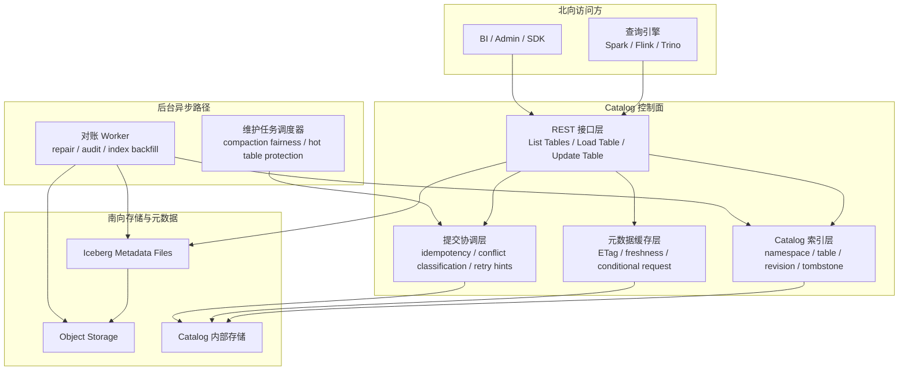

# Iceberg REST Catalog 批判性文章调研分析与自研 Catalog 启示

> 调研对象：Data Engineering Weekly 文章《A Critique of Iceberg REST Catalog: A Classic Case of Why Semantic Spec Fails》
>
> 文章地址：<https://www.dataengineeringweekly.com/p/a-critique-of-iceberg-rest-catalog>
>
> 对照材料：
> - Apache Iceberg REST Catalog Spec：<https://iceberg.apache.org/rest-catalog-spec/>
> - Apache Iceberg REST API Overview：<https://apache-iceberg.mintlify.app/api/rest/overview>
> - Apache Iceberg Table Endpoints：<https://apache-iceberg.mintlify.app/api/rest/tables>

---

## 执行摘要

本文围绕文章《A Critique of Iceberg REST Catalog》展开分析，并结合 Apache Polaris、Apache Gravitino、Unity Catalog OSS 的公开资料，对 Iceberg Catalog 的工程化现状与自研启示进行梳理。

文章的核心观点是：

**Iceberg REST Catalog 解决了跨引擎、跨实现的接口语义互通问题，但没有自动解决生产环境中的行为可预测性问题。**

作者主要批评以下几点：

- `List Tables` 这类发现接口语义很轻，但在真实实现中可能退化为重校验、重同步路径。
- `Load Table` 与查询规划路径缺少明确的延迟边界与运行时约束。
- `Update Table` 对应的提交路径虽然定义了 `409 Conflict`，但没有进一步规定公平性、退避、重试预算与饥饿避免。
- HTTP 缓存、`ETag`、条件请求等机制存在，但缺少统一、强约束的数据新鲜度语义。
- 生态层面缺少行为一致性标准，导致“兼容 REST Catalog”不等于“生产行为一致”。

结合官方文档对照后，可以得到更平衡的结论：

- 文章的主判断基本成立，尤其是“语义兼容不等于生产可用”这一点。
- 但文章也放大了一部分 spec 问题。Iceberg 官方 REST 文档已经提供了 `ETag`、`If-None-Match`、`304 Not Modified`、`Idempotency-Key` 等基础机制。
- 更准确的表述应是：**REST Catalog 提供了基础积木，但如果要支撑规模化生产，仍需在实现侧补齐更强的行为契约。**

从开源实现现状看：

- **Polaris** 最接近“生产级 Iceberg Catalog 内核”，在持久化、内部索引、服务端缓存、失效传播方面公开得最完整。
- **Gravitino** 更像“联邦/代理 + 运营增强”路线，在元数据缓存、扫描计划缓存、维护服务上更积极，但在发现路径、分页和内部索引的公开程度上弱于 Polaris。
- **Unity Catalog OSS** 更适合用来参考统一资产治理模型；对文章关心的 catalog 运行时细节，公开说明最少。

对自研 catalog 的直接启示是：

1. 不能只围绕接口设计，必须同时定义数据新鲜度、冲突、公平性、过载行为等运行时语义。
2. `List Tables`、`Load Table`、`Update Table` 三条核心路径必须做轻重分层，避免在线请求夹带重修复逻辑。
3. catalog 应被视为分布式元数据控制面，需要自有索引层、服务端缓存、异步对账机制、冲突协调和运行时保护能力。

---

## 1. 调研背景

Iceberg REST Catalog 已逐渐成为多引擎访问 Iceberg 元数据的事实标准接口。随着 Spark、Flink、Trino、StarRocks 等引擎围绕该接口形成生态协作，业界很容易把“支持 REST Catalog”理解成“具备一致的生产行为”。

这篇文章提醒我们，这种理解并不充分。原因在于：

- 协议兼容只保证接口语义一致；
- 生产可用还依赖延迟、缓存、冲突、公平性、过载退化等运行时行为；
- 这些行为在当前 spec 中缺少足够强的标准化约束。

因此，本文的重点不是否定 REST Catalog，而是分析一个更关键的问题：

**当 catalog 从接口标准走向生产控制面时，哪些运行时语义必须由实现显式承担。**

---

## 2. 文章核心观点与主要批评点

### 2.1 核心判断：REST Catalog 解决了“能互通”，但没有保证“能稳定协作”

文章最核心的判断是：

**Iceberg REST Catalog 当前更接近“语义互操作性”，而不是“操作互操作性”。**

所谓“语义互操作性”，是指不同引擎、不同 catalog 实现，至少可以围绕同一套对象模型和接口语义协作。比如大家都理解：

- `List Tables` 是列出某个 namespace 下的表；
- `Load Table` 是加载一张表的当前元数据视图；
- `Check Table Exists` 是做轻量存在性判断；
- `Update Table` 是提交一组带前置条件校验的表元数据变更。

这一层能力非常重要，因为它解决了历史上“各家 catalog 接口各不相同、客户端适配成本很高”的问题。也正因为有了这层统一，Iceberg 才能逐步形成多引擎共享 catalog 的生态基础。

但文章认为，真正进入生产环境之后，系统要面对的不是“接口是否能对上”，而是“接口在压力、冲突、缓存、过载和失败场景下会表现成什么样”。这时问题就从“对象语义”转向了“运行时行为”：

- 大 namespace 下，discovery 要不要退化，如何退化；
- metadata load 的延迟和开销有没有边界；
- 多写者同时提交时，冲突之后如何保证公平；
- cache 命中与失效后的 freshness 到底如何定义；
- 过载时系统是快速失败还是拖慢全链路。

也就是说，文章真正批评的不是 REST 形式本身，而是：

**spec 对运行时行为的约束太弱，导致“兼容 REST Catalog”并不等于“在生产上具有可预测的一致行为”。**

### 2.2 `List Tables`：规范语义很轻，但真实实现可能很重

从官方文档看，`List Tables` 的设计非常克制：

- 接口是 `GET /v1/{prefix}/namespaces/{namespace}/tables`；
- 支持分页；
- 返回的是 table identifier 列表，而不是整张表的完整 metadata。

从接口语义上说，它更像一个目录浏览能力，而不是状态校验能力。也就是说，客户端是在问：

**“这个 namespace 下有哪些表名？”**

而不是在问：

**“这个 namespace 下的每张表现在是否处于完全可读、可提交、与底层严格同步的状态？”**

文章的担心在于，真实实现里这两件事很容易被混在一起。

当 catalog 规模变大、部署拓扑复杂、多个系统共享同一批 Iceberg 表时，某些实现可能会在 `List Tables` 的热路径上顺手做很多额外动作，例如：

- 校验 metadata pointer 是否仍然有效；
- 检查 metadata 文件是否可读、是否损坏；
- 校验调用者是否具有访问权限；
- 检查底层对象存储或外部 metastore 状态是否一致；
- 遇到异常时触发在线修复或 reconcile。

如果这些动作都落在 list 路径上，那么一个本来应该快速返回的发现接口，就会演变成“列目录 + 核验状态 + 尝试修复”的复合操作。这样一来，目录浏览、BI 下拉、引擎启动 discovery 都会被拉重。

因此，文章对 `List Tables` 的批评并不是接口定义错了，而是：

**spec 没有明确约束实现应该把它做成多轻，也没有区分“轻量 list”和“强校验 list”这两类完全不同的运行时意图。**

这个批评很关键，因为它指出了一个常见工程问题：看起来简单的接口，最容易被不断叠加责任，最终变成系统中的高成本热点。

### 2.3 `Load Table`：metadata load 的尾延迟本身就是系统语义的一部分

文章在 `Load Table` 这一点上的批评，比表面看上去更深。

作者并不是单纯抱怨“读 metadata 可能比较慢”，而是在强调一个更强的观点：

**对于控制面接口来说，延迟是否可预测，本身就是正确性的一部分。**

原因很简单。对查询引擎而言，`Load Table` 往往是 query planning 的起点。如果这一步出现以下问题：

- metadata retrieval latency 没有明确边界；
- 一次 planning 需要多轮 HTTP 往返；
- metadata payload 过大；
- 同一张热表被反复 load，导致控制面抖动；

那么上层看到的结果不只是“慢一点”，而是：

- planning 阶段不稳定；
- 失败率上升；
- retry 放大下游压力；
- 用户无法判断问题是偶发抖动还是系统性退化。

文章引用的系统观是：“语义正确但慢到不可用，在实践中等同于不正确。” 放到 `Load Table` 上，它想表达的是：

**如果一个 catalog 不能把 metadata load 做成可预测、可复用、可缓存的控制面读路径，那么它即使接口语义完全兼容，也很难被认为是成熟的生产级 catalog。**

因此，作者实际上是在呼吁：`Load Table` 不应只满足“能返回 table metadata”，还应具备更明确的运行时设计，例如：

- metadata pointer 的稳定管理；
- 热表 load 的缓存策略；
- 条件请求与 cheap revalidation；
- 对 metadata payload 和 fan-out 成本的控制。

### 2.4 `Update Table`：`409 Conflict` 只是开始，不是完成

在提交路径上，文章批评得最尖锐。

Iceberg 的并发控制建立在乐观并发模型上。客户端先基于当前表状态构造变更，再通过 `Update Table` 提交；如果前置条件不再成立，则返回 `409 Conflict`。从协议语义上讲，这没有问题。

但文章认为，这种定义只回答了一个问题：

**“冲突有没有被识别出来？”**

它没有回答另外几个在生产中更棘手的问题：

- 收到 `409` 之后客户端应该如何退避；
- 不同客户端是否会采用极不一致的 retry 策略；
- 是否存在 retry budget；
- 热表竞争下是否会长期饿死某类工作负载；
- streaming writer 与 compaction / optimize / cleanup 是否天然会走向不公平竞争。

作者担心的是：如果协议只负责返回 `409`，而不进一步约束冲突后的行为，那么系统最终会演化成“谁重试更激进，谁更容易赢”。这样短期看似吞吐很高，长期却会导致维护任务持续失败、表健康恶化、小文件不断积累、metadata 越来越重。

所以文章在这一点上的核心批评是：

**提交冲突不是一个单纯的接口错误处理问题，而是一个长期的调度、公平性和表健康问题。**

这也是为什么作者会把“undefined and unfair”作为 commit contention 的关键词。

### 2.5 缓存机制已经存在，但数据新鲜度语义仍然偏弱

这一点需要更细致地理解。

从官方文档看，Iceberg REST Catalog 已经具备不少标准能力：

- `ETag`
- `If-None-Match`
- `304 Not Modified`
- `Idempotency-Key`

这说明它并不是一个完全忽略缓存和幂等的接口体系。

文章真正质疑的是：即使这些机制存在，它们仍不足以自动构成一个强数据新鲜度契约。也就是说，客户端依然未必能清楚知道：

- 我现在读到的是不是最新状态；
- 返回 `304` 时，依据的是全局最新视图，还是某个实例上的本地状态；
- 跨实例或跨地域部署时，freshness 是如何保证的；
- `List Tables`、`Load Table` 和 `Check Table Exists` 是否共享同一套 freshness 语义；
- stale 上界是否可被明确定义。

因此，文章并不是反对 cache，而是在指出：

**缓存能力、条件请求和真正可依赖的数据新鲜度语义之间，还有一层没有完全补齐的契约。**

这个判断对我们很有启发，因为它说明“支持 ETag”不等于“调用方可以放心依赖缓存结果”。如果 catalog 自身不定义好 freshness，客户端通常会退回最保守模式，也就是尽可能重拉、重验、强刷新。

### 2.6 当前缺少的是行为一致性标准，而不是更多接口

文章最后的批评点，本质上是在质疑生态里的“兼容性”定义。

今天很多系统说自己“兼容 REST Catalog”，通常是在说：

- 接口对上了；
- schema 格式对上了；
- 主路径可以跑通；
- 基础增删改查、加载和更新能完成。

但文章认为，这种兼容性定义还停留在协议层，离生产层还差一大截。真正决定 catalog 能否在生产中作为控制面运行的，是行为上的一致性，例如：

- 高负载下 p95 / p99 是否仍可控；
- 分页在并发更新下是否稳定；
- overload 时是否清晰返回 `503/504`；
- retry amplification 是否有边界；
- 多工作负载竞争时是否会长期失衡。

这也是文章想表达的最终落点：

**Iceberg 生态当前并不缺更多接口定义，真正缺的是一套能描述和约束运行时行为的一致性标准。**

如果没有这一层，所谓“兼容 REST Catalog”很多时候只意味着“可以互相说话”，而不意味着“可以长期稳定协作”。

---

## 3. 对文章观点的客观评价

### 3.1 成立的部分

文章有三点判断非常有价值：

1. 它准确区分了“接口语义兼容”和“生产行为兼容”。
2. 它指出了 catalog 的核心复杂度不在对象模型，而在行为契约。
3. 它把焦点集中在 `List Tables`、`Load Table`、`Update Table` 这三条最容易在生产中失控的路径上，这一点很准确。

### 3.2 需要保留判断的部分

文章也有一定放大之处：

1. 它把部分“实现质量差异”上升成了“spec 本身失败”。
2. 通用协议本身通常不会规定 p99、公平性等运行时目标，因此 spec 对行为保持中立并不完全异常。
3. 官方 REST 文档已经补充了较多基础机制，不能简单认为 REST Catalog 完全缺少缓存、幂等和条件请求支持。

更平衡的结论应是：

**REST Catalog 解决了基础互操作问题，但若要支撑规模化生产，必须在实现侧补齐更强的操作性契约。**

---

## 4. 案例化理解

### 4.1 案例一：`List Tables` 如何退化成重同步接口

典型场景如下：

- Catalog A 面向 streaming ingestion；
- Catalog B 面向 BI 浏览与分析；
- 多个系统共享同一批 Iceberg 表；
- B 需要在 namespace 页面展示表列表。

理想情况下，`List Tables` 只做两件事：

1. 从 catalog 自有索引读取 namespace 下的 table identifiers；
2. 稳定分页返回 `namespace + name`。

退化情况下，B 可能在 list 路径上额外做：

1. metadata pointer 校验；
2. 权限核对；
3. 底层 metadata 文件有效性检查；
4. 在线修复或同步。

结果是：

- namespace 浏览变慢；
- 引擎启动阶段 discovery 变慢；
- BI 下拉表列表超时；
- 用户感知为“catalog 不稳定”。

这个案例说明：

**目录发现与状态修复必须解耦。**

### 4.2 案例二：`409 Conflict` 如何演化成后台维护任务饥饿

典型场景如下：

- streaming job 高频提交小批次写入；
- compaction job 周期性尝试合并小文件；
- 两者都通过 `Update Table` 竞争同一张表的提交窗口。

如果客户端策略不同：

- streaming writer 收到 `409` 后快速重试；
- compaction job 收到 `409` 后指数退避且预算较小；

长期结果可能是：

- streaming writer 持续成功；
- compaction 持续失败；
- 小文件持续累积；
- metadata 不断膨胀；
- planning 与 scan 成本持续恶化。

这个案例说明：

**冲突处理不仅是正确性问题，也是资源公平性和表健康度问题。**

---

## 5. 开源 Catalog 现状对照分析

本节从文章批评的几个关键维度出发，对 Polaris、Gravitino、Unity Catalog OSS 的公开现状进行分析。

### 5.1 总体判断

如果只从“谁更接近文章所说的生产级 Catalog 控制面”来排序：

**Polaris > Gravitino > Unity Catalog OSS**

这里比较的不是功能数量，而是：

- 谁更明确地把 catalog 视为元数据控制面；
- 谁更公开地暴露了持久化、内部索引、服务端缓存、失效传播和运行时配置；
- 谁更正面回应了 `List Tables`、`Load Table`、`Update Table` 这些路径的生产复杂性。

### 5.2 Polaris

Polaris 是三者里最接近“生产级 Iceberg Catalog 内核”的实现。

**优势一：元数据持久化与内部索引的公开程度最高。**

官方资料明确公开：

- metastore / persistence backend；
- 生产推荐 PostgreSQL；
- `max-index-stripes`、`max-embedded-index-size`、`max-index-stripe-size`、bulk fetch 等持久化层参数。

这意味着 Polaris 不只是“有数据库”，而是把 catalog 自身的内部索引与持久化组织公开成了产品能力。

**优势二：服务端缓存和失效传播设计成熟。**

官方配置包括：

- `polaris.persistence.cache.enable`
- reference TTL 与 negative TTL
- cache sizing
- `distributed-cache-invalidations.*`

这说明 Polaris 明确把多实例下的缓存一致性视为服务端责任，而不是只依赖客户端条件请求。

**优势三：对 `Load Table` / `Update Table` 的 catalog 内核职责界定清晰。**

官方概览明确把 catalog 的职责描述为：

- 管理 current metadata pointer；
- 通过 atomic operation 更新 metadata pointer。

这符合 Iceberg Catalog 的核心控制面定位。

**局限：维护任务和公平性不在内核内解决。**

Polaris 官方明确将 compaction、snapshot expiration、orphan cleanup 等维护职责交给外部系统，例如 Floe。这意味着它没有在 catalog 内核里内建“writer vs maintenance”公平性框架。

综合判断：

**Polaris 最适合借鉴的是 catalog 自身如何成为一个成熟的元数据控制面。**

### 5.3 Gravitino

Gravitino 更像“联邦/代理 + 运营增强”的 catalog 路线。

**优势一：缓存与 planning 优化能力公开得很明确。**

官方 Iceberg REST service 文档明确提供：

- 表元数据缓存；
- 扫描计划缓存；
- 扫描计划缓存使用 snapshot ID 作为 key；
- planning offload；
- 线程池、队列、超时等运行时配置。

这说明 Gravitino 对 `Load Table` 和查询规划路径的运行时问题有较强工程意识。

**优势二：运营增强能力更积极。**

Gravitino 还公开了：

- audit log；
- event listener；
- metrics store；
- Table Maintenance Service（TMS / Optimizer）。

尤其 TMS 是对“后台维护任务”和“表健康退化”问题的正面回应。

**短板一：discovery / pagination 公开成熟度不高。**

官方文档明确写明：

- pagination 尚未实现；
- multi table transaction 尚未实现；
- register view 尚未实现。

这意味着它在文章最敏感的 `List Tables` 问题上，公开成熟度明显弱于 Polaris。

**短板二：internal metadata index 公开表达不强。**

Gravitino 更强调：

- backend 支持；
- proxy/service 形态；
- 缓存和运行时增强；

但没有像 Polaris 那样系统公开 Catalog 自身的内部索引设计。

综合判断：

**Gravitino 最适合借鉴的是元数据缓存、扫描计划缓存、REST 代理与维护控制面；但在发现路径与内部索引方面弱于 Polaris。**

### 5.4 Unity Catalog OSS

Unity Catalog OSS 的公开定位更偏向统一治理入口，而不是专门展开 Iceberg Catalog 的运行时细节。

**优势：统一资产治理模型清晰。**

它强调：

- universal catalog；
- multimodal interface；
- Open API + Hive Metastore API + Iceberg REST API 兼容；
- 统一的数据与 AI 资产入口。

这使它很适合用来参考统一 catalog 的产品抽象。

**现状：元数据存储明确存在，但运行时公开说明较弱。**

官方 server configuration 明确写了：

- `test` 环境使用 in-memory H2；
- `dev` 环境使用基于文件的 H2 作为元数据存储。

但公开资料中几乎没有看到像 Polaris/Gravitino 那样明确展开：

- 内部索引；
- 元数据缓存；
- distributed invalidation；
- planning cache；
- 更新路径冲突策略。

**另一个限制：公开的 Iceberg REST 场景更偏读取 UniForm tables。**

文档重点是通过 Iceberg REST 去访问 Delta UniForm tables，而不是系统展开 `Update Table` 并发冲突、公平性和运行时行为。

综合判断：

**Unity Catalog OSS 更适合借鉴统一资产模型与治理接口，不适合作为文章所讨论那类生产级 Iceberg 运行型 Catalog 的主要参考。**

### 5.5 横向对照表

| 维度 | Polaris | Gravitino | Unity Catalog OSS |
|---|---|---|---|
| Metadata persistence | 强，生产级 metastore 明确 | 有，但 backend 依赖更强 | 有，但公开设计较基础 |
| Internal index 公开程度 | 最强 | 较弱 | 很弱 |
| Catalog 内缓存 | 强，且有分布式失效传播 | 强，且有元数据缓存与扫描计划缓存 | 公开说明很少 |
| `List Tables` / pagination | 有显式 feature flag | 文档明确未实现 pagination | 公开说明较少 |
| `Load Table` 路径优化 | 有元数据指针、缓存和持久化组织 | 有元数据缓存与扫描计划缓存 | 公开说明较少 |
| `Update Table` / commit path | 强，catalog 内核职责明确 | 有，但 backend 影响更大 | 公开重点不在这里 |
| 维护任务与表健康 | 依赖外部系统，如 Floe | 内建 TMS，但仍处早期 | 公开说明很少 |
| 运行时工程化 | 强 | 强 | 弱 |

### 5.6 对我们的借鉴价值

- **Polaris**
  - 最适合借鉴：Catalog 内部索引、持久化组织、服务端缓存、失效传播、生产级控制面设计。

- **Gravitino**
  - 最适合借鉴：元数据缓存、扫描计划缓存、REST 代理形态、维护控制面、丰富运行时配置。

- **Unity Catalog OSS**
  - 最适合借鉴：统一资产模型、统一治理 API、Catalog 作为多资产入口的抽象方式。

### 5.7 一页式对照表

下表用于将“文章批评点”“我们的判断”和“三个开源项目的现状”放在同一视图中，便于评审或汇报时快速使用。

| 主题 | 文章关注点 | 我们的判断 | Polaris | Gravitino | Unity Catalog OSS |
|---|---|---|---|---|---|
| `List Tables` | 发现接口可能被做重，缺少轻量语义与运行时边界 | discovery 必须与校验/修复解耦，分页与稳定性是关键 | 有显式分页 feature flag，内部 persistence/index 能力较强 | 文档明确 pagination 尚未实现，风险较高 | 公开说明较少，重点不在大规模 discovery |
| `Load Table` | 元数据加载可能拉长查询规划路径 | 需要明确元数据指针、缓存和规划成本边界 | 元数据指针、持久化缓存和失效传播设计较完整 | 元数据缓存和扫描计划缓存较积极 | 有接口和元数据存储，但公开优化说明较少 |
| `Update Table` | `409` 只解决冲突识别，不解决公平性 | 提交路径需要冲突分类、退避、公平性与幂等 | 提交语义清晰，但公平性不是公开主打能力 | 有提交路径，但真实行为受 backend 影响更大 | 公开重点不在写入并发与提交冲突 |
| 数据新鲜度 | 有缓存机制，但 freshness 契约不强 | 需要服务端缓存与失效传播，不能只靠客户端 ETag | cache、TTL、distributed invalidation 明确 | snapshot-aware cache 明确，但契约更多体现在实现层 | 公开资料中缺少系统化说明 |
| 内部索引 | 规范不讨论内部索引，但生产实现离不开它 | Catalog 自有索引层几乎是必需的 | 三者中最明确，公开到配置层 | 公开表达较弱，更偏后端加缓存 | 公开表达最弱 |
| 维护任务 | compaction 等后台任务可能长期被前台写入压制 | 维护公平性是长期表健康关键 | 维护职责外置，Catalog 与维护系统解耦 | 有 TMS/Optimizer，方向积极但仍早期 | 公开说明较少 |
| 运行时工程化 | 缺少行为一致性标准 | 需要限流、超时、隔离、失效保护和观测 | 生产级信号最强 | 运行时配置丰富，运营增强明显 | 更偏 OSS 治理入口，生产信号较弱 |
| 综合定位 | 语义兼容不等于生产行为兼容 | 需要把 Catalog 视为元数据控制面 | 最接近生产级 Iceberg Catalog 内核 | 最像联邦、代理加运营增强 | 最适合作为统一治理与多资产模型参考 |

---

## 6. 对我们后续自研 Catalog 的启示

### 6.1 先定义行为承诺，再设计接口

后续自研 Catalog 时，建议先回答以下问题，而不是先列接口：

- 哪些接口必须尽量返回最新状态；
- 哪些接口允许短时间过期视图；
- 冲突提交由客户端自处理，还是服务端提供策略引导；
- 过载时是快速失败，还是排队等待；
- 哪些路径必须低延迟，哪些可以走异步处理。

### 6.2 轻量读路径与重修复路径必须解耦

`List Tables`、`Load Table`、`Check Table Exists` 这类高频读路径应优先命中 catalog 自有索引和服务端缓存，避免同步扫描底层对象存储或深度对账。

而以下动作应尽量放在后台：

- reconcile；
- repair；
- audit；
- 索引回补；
- 在线修复。

核心原则是：

**不要把“保证系统健康”的重操作塞进“响应客户端请求”的热路径。**

### 6.3 Catalog 自有索引层几乎是必需的

若 `List Tables`、`Check Table Exists`、`Load Table` 总依赖底层 metadata 文件现查，则很容易在以下场景失控：

- namespace 很大；
- 热表访问频繁；
- 大量并发查询规划；
- 后端对象存储抖动。

建议至少维护一层 catalog 自有索引，存储：

- namespace；
- table identifier；
- current metadata location；
- revision / etag / generation；
- deletion tombstone；
- ownership / policy / audit 摘要。

### 6.4 服务端缓存应视为核心能力

客户端缓存和条件请求值得支持，但通常不足以替代服务端缓存。原因包括：

- 上层缓存只能解决部分重复读问题；
- catalog 最清楚内部状态如何共享与失效；
- 权限、metadata pointer、planning result 等往往需要服务端复用；
- 多实例失效传播只能由服务端统一承担。

建议从第一阶段就至少支持：

- `ETag` / `If-None-Match` / `304`；
- table existence cache；
- metadata pointer cache；
- 表元数据缓存；
- permission lookup cache。

### 6.5 冲突处理必须从“返回 409”升级为“完整策略”

建议服务端补齐以下能力：

- 幂等提交键；
- 冲突原因分类；
- 推荐的 backoff / retry 策略；
- 热表冲突观测；
- maintenance fairness 保护；
- retry budget 控制。

### 6.6 运行时保护能力必须前置设计

catalog 天然是控制面热点，建议从第一天就考虑：

- 限流；
- 超时；
- 熔断；
- 请求隔离；
- 缓存失效风暴保护；
- 热 namespace / 热表观测；
- 慢请求治理。

---

## 7. 建议参考的目标架构

下面这张图用于说明“轻量读路径”和“重修复路径”为什么必须分层：

简要说明如下：

- 北向访问方包括查询引擎、BI、管理后台和 SDK，它们共同把 catalog 当成元数据控制面入口。
- `List Tables`、`Load Table`、`Update Table` 只是统一入口，真正的核心能力在索引层、缓存层和提交协调层。
- 高频读路径优先命中 Catalog 自有索引和服务端缓存，避免每次直接扫描底层 metadata 文件或对象存储。
- 提交路径单独通过“提交协调层”治理，用于处理幂等、冲突分类、重试提示和公平性问题。
- repair、audit、reconcile、索引回补等重操作走后台异步路径，不应同步夹带在在线请求中。
- 最底层的数据文件和 metadata 文件仍保存在对象存储中，Catalog 内部存储负责维护控制面状态，而不是取代数据面。

这张图表达的是：

- 高并发读路径优先命中索引与缓存；
- `Update Table` 不只是写请求，而是带有冲突协调和公平性语义的提交路径；
- 修复、审计、对账这类重操作应交给后台工作器，而不是同步塞进在线请求。

---

## 8. 结论

这篇文章最值得吸收的，不是对 Iceberg REST Catalog 的情绪化批评，而是它指出了一个很现实的架构事实：

**Catalog 的复杂度主要来自行为契约，而不是对象模型。**

从现有开源实现看：

- Polaris 最接近“成熟的 Iceberg Catalog 控制面”；
- Gravitino 在运行时增强和维护服务上最积极；
- Unity Catalog OSS 更适合作为统一治理模型的参考。

对我们而言，真正需要警惕的不是“接口没补齐”，而是：

- `List Tables` 会不会越做越重；
- `Load Table` 会不会拖慢 planning；
- `Update Table` 冲突会不会长期不公平；
- 缓存能否被系统性信任；
- 过载时系统是否还能给出清晰、可恢复的行为。

因此，更稳妥的研发顺序应是：

1. 先定义一致性、数据新鲜度、冲突、公平性、过载语义；
2. 再设计接口、索引结构和服务端缓存；
3. 再实现行为层验证、压测与运行时保护。

如果只做第二步，很容易得到“接口完整但运行脆弱”的 catalog；而这正是本文批评 Iceberg REST Catalog 时最想提醒的问题。

---

## 9. 参考资料

- Data Engineering Weekly, *A Critique of Iceberg REST Catalog: A Classic Case of Why Semantic Spec Fails*, 2026-01-09
- Apache Iceberg, *REST Catalog Spec*
- Apache Iceberg Documentation, *REST Catalog API Overview*
- Apache Iceberg Documentation, *Table Endpoints*
- Apache Polaris Documentation, *Overview*
- Apache Polaris Documentation, *Metastores*
- Apache Polaris Documentation, *Configuration Reference*
- Apache Polaris Blog, *Floe and Apache Polaris: Policy-Driven Table Maintenance for Apache Iceberg*
- Apache Gravitino Documentation, *Iceberg REST catalog service*
- Apache Gravitino Documentation, *Gravitino server config*
- Apache Gravitino Documentation, *Table Maintenance Service*
- Apache Gravitino Blog, *Gravitino 1.2.0 Release Notes*
- Unity Catalog Documentation, *Server Configuration*
- Unity Catalog Documentation, *Quickstart*
- Unity Catalog Documentation, *Unity Catalog with UniForm tables*
